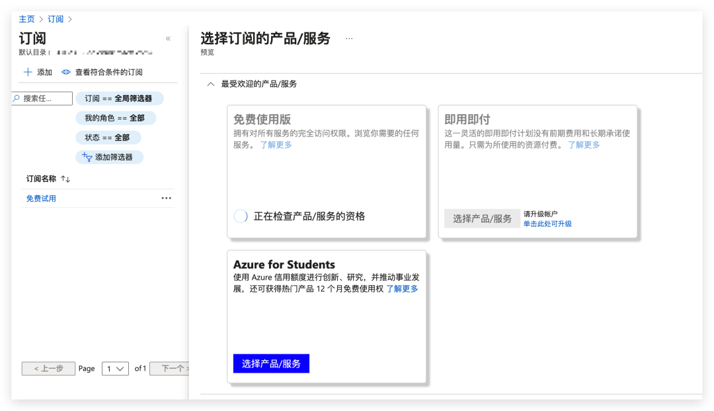
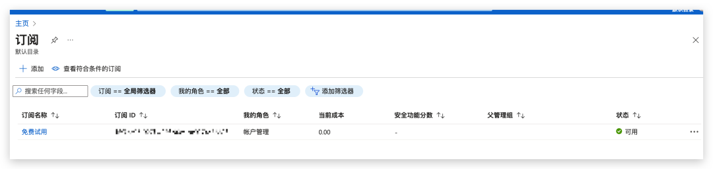
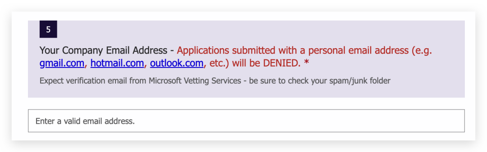
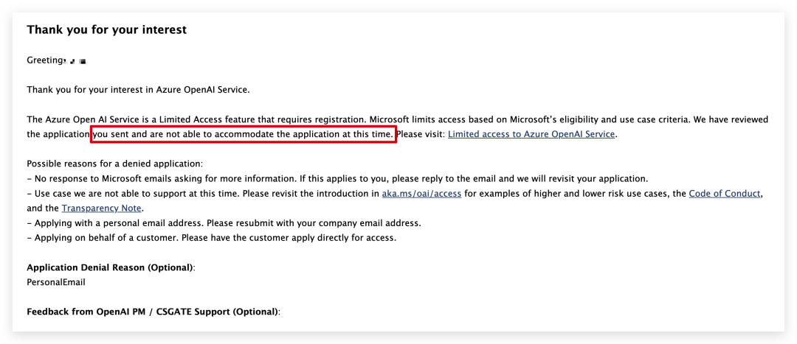
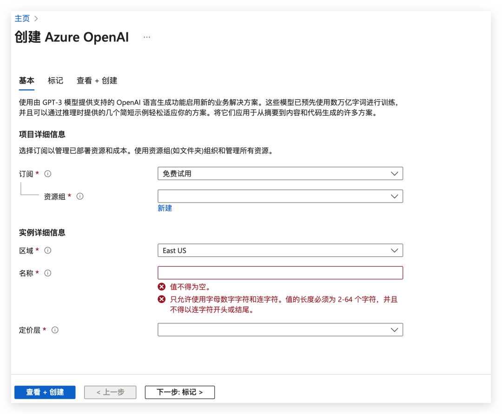
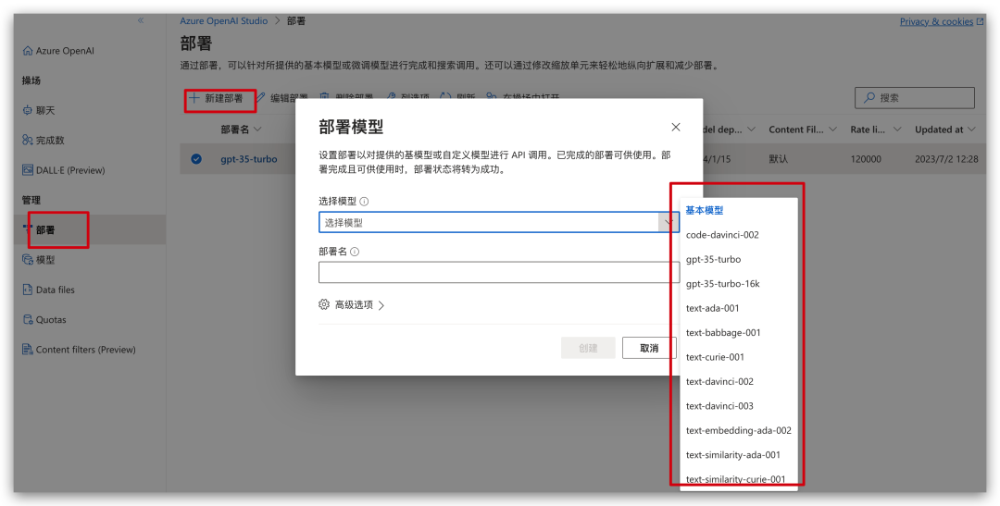
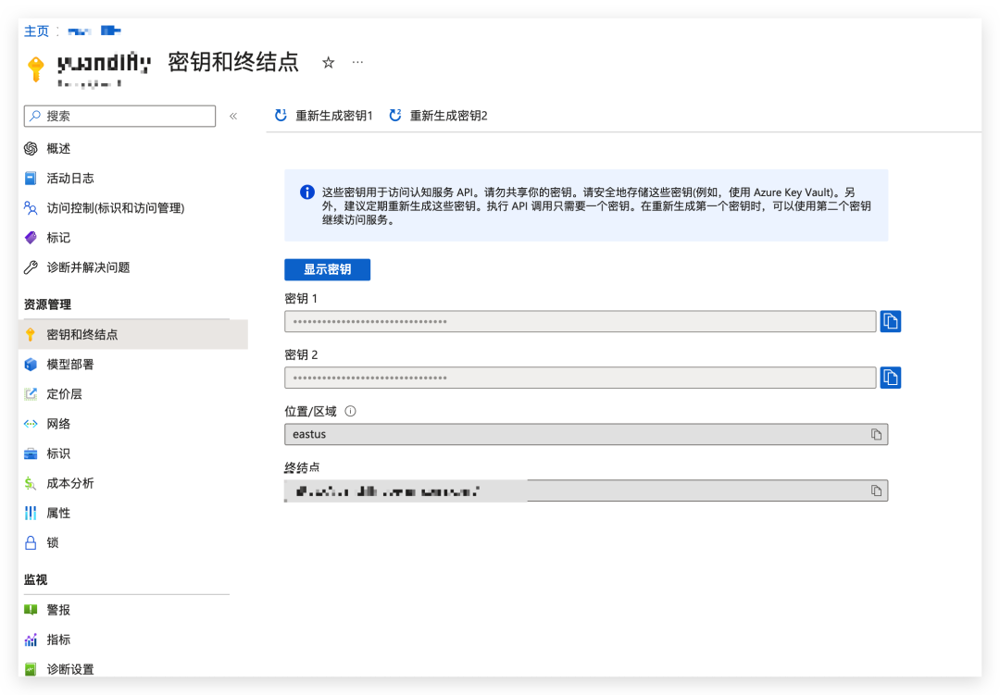

之前一直以为微软的 `Azure OpenAI` 只针对企业才能申请，普通用户是不能申请成功的，但是最近经过测试发现普通用户也是可以申请成功的，虽然有一些门槛，但是对于开发者来说想要申请还是很简单的。

## 为什么要申请

对于大部分开发这来说，如果想开发 `AI` 应用，接入 `OpenAI` 的 `API` 接口，必然要考虑的是如何创建账号，然后给 `OpenAI` 账号绑定一个卡进行额度充值。

随着 `OpenAI` 风控的升级，很多虚拟卡都已经被拒绝了，这就导致很多时候我们不能正常的绑定成功。

没有绑定卡的账号虽然可以使用，但是相应的接口访问次数都是会被限制的。一两个人使用没什么问题，如果业务大了使用起来就很麻烦了，换句话说就是想花钱充值都充值充值不了。

另外直接使用 `OpenAI` 的接口会有一些安全风险，这个懂得都懂，就不细说了。

## 申请微软 Azure OpenAI 前提

经过本人测试，申请 `Azure OpenAI` 需要如下几个前提

1.  一张国内银行的国际信用卡，比如 `VISA` 这种，这个都有吧，没有的可以办理；

2.  需要一个备案过的域名网站，搞技术的大部分也都有；

3.  需要跟域名一致的企业邮箱；

国际信用卡这个很好办理，只要去银行办理一张就好，现在银行信用卡办理都挺简单的，就不说了。

备案的域名对于很有如果有自己的博客或者网站的小伙伴来说完全不是问题，如果没有的话就需要先搭建一个站点，然后购买域名进行备案，搭建站点和购买域名备案都很简单，国内阿里云或者腾讯云都可以直接搞定，无非就是花点小钱和时间而已。

关于企业邮箱这个可以通过企业微信来创建一个企业，个人也是可以通过企业微信来创建一个企业的，只不过是未认证的而已，不影响使用。

## 申请流程

### 注册 Azure 账号

先用微软账号登录，登录过后，还要注册 `Azure` 账号，通过地址 `https://azure.microsoft.com/en-us/free/?cdn=disable` 进行注册，注册的时候会需要填入姓名地址以及 VISA 之类的国际信用卡，这里只是先绑定卡，不会扣费消耗。

### 创建订阅

注册账号过后，在主页中找到订阅选项，点击进入添加订阅，这里可以选择免费试用

创建完成之后，等待一会在订阅菜单下面会出现免费试用订阅信息，这里会有一个订阅 ID，在后续申请接口会用到。

### 申请 Azure OpenAI 权限

在上面的订阅创建完成之后，通过下面的表单链接来进行 Azure OpenAI 权限的申请 `https://customervoice.microsoft.com/Pages/ResponsePage.aspx?id=v4j5cvGGr0GRqy180BHbR7en2Ais5pxKtso_Pz4b1_xUOFA5Qk1UWDRBMjg0WFhPMkIzTzhKQ1dWNyQlQCN0PWcu`

表单的内容就会涉及到我们前面说的备案的域名和一个同域名的企业邮箱，这里有明确的说明，如果邮箱不合规的话会直接拒绝申请的。

这里的企业邮箱就可以有上面创建的企业微信绑定了备案域名的邮箱。正常来说审核速度还是很快的，我周六上午申请的，下午就通过了。

如果邮箱不合规基本上几分钟就就会收到审核被拒绝的邮件，所以不要做无畏的尝试。

### 审核通过

正常填入申请表单在审核通过之后我们就可以来创建资源了，通过官方的操作手册，我们可以一步步的进行资源的创建和模型的部署。

`https://learn.microsoft.com/zh-cn/azure/cognitive-services/openai/how-to/create-resource?pivots=web-portal`

资源创建完成过后，我们在到 `https://oai.azure.com/` 平台去部署我们想要的模型，选择一个自己想部署的模型，然后再设置一个部署名称，后续很多地方会用到这个部署名称，建议取个跟模型近似的。部署完成过后，等个三五分钟就可以使用了。

在创建的资源下面我们可以找到对应的 `API Key` 和 `Endpoint`，后续我们就可以通过代码来调用 `Azure OpenAI` 了。

## 总结

今天给大家演示了如何申请微软的 `Azure OpenAI` 账号，以及如何获取对应的 `API Key`，对于一些无法使用 `OpenAI` 的 `ChatGPT` 的朋友来说，不妨尝试一下这种方式，这个是相应的文档资料地址，可以参考 `https://learn.microsoft.com/zh-tw/azure/cognitive-services/openai/overview`。
