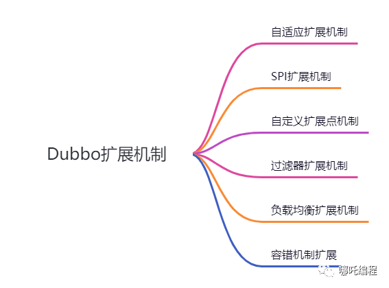
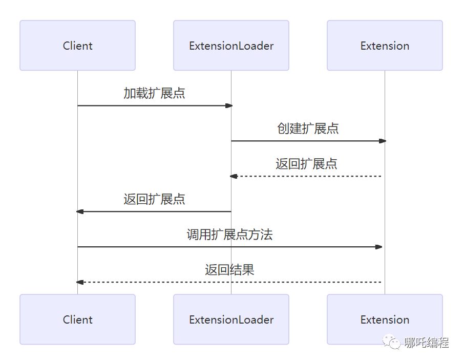
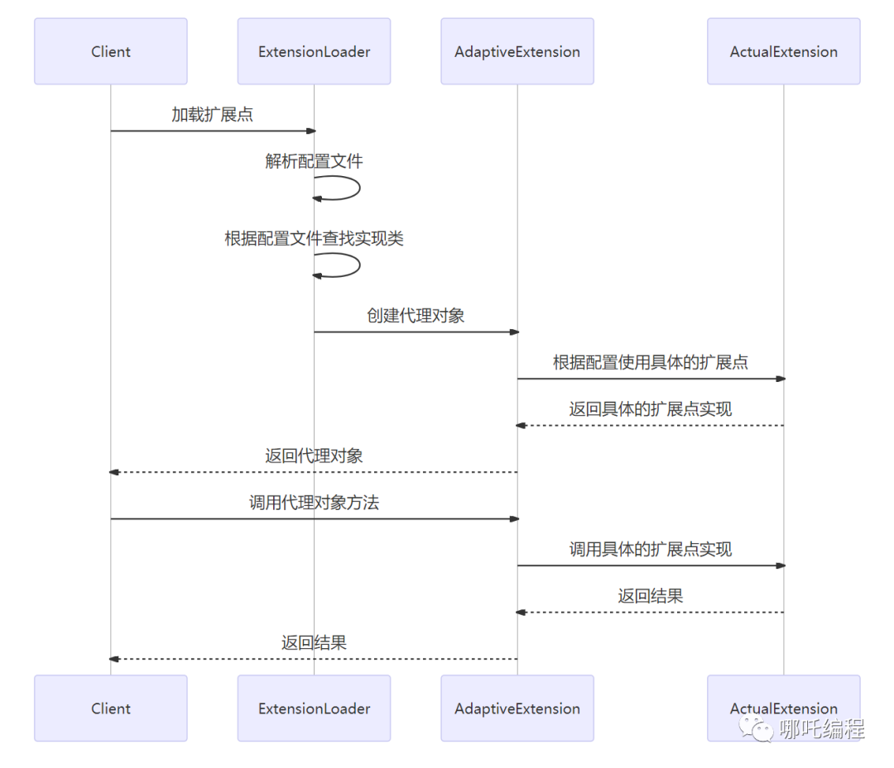
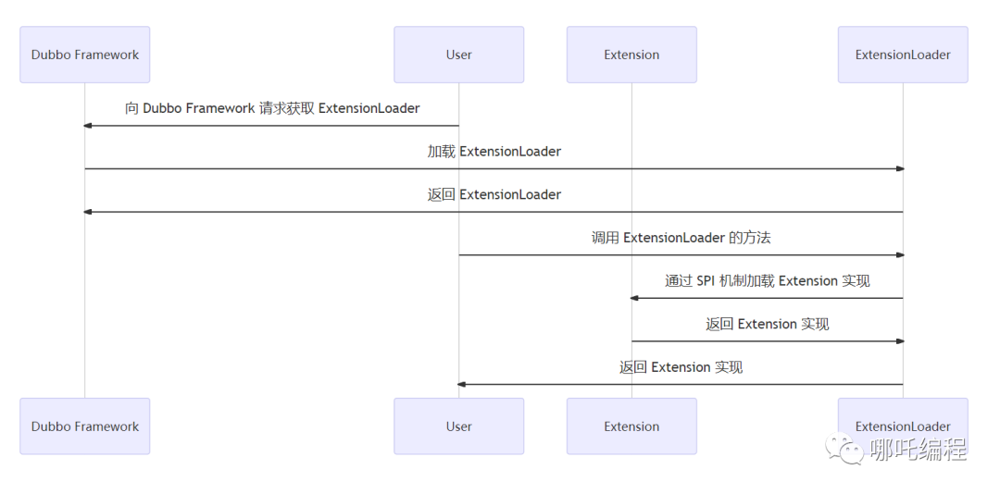
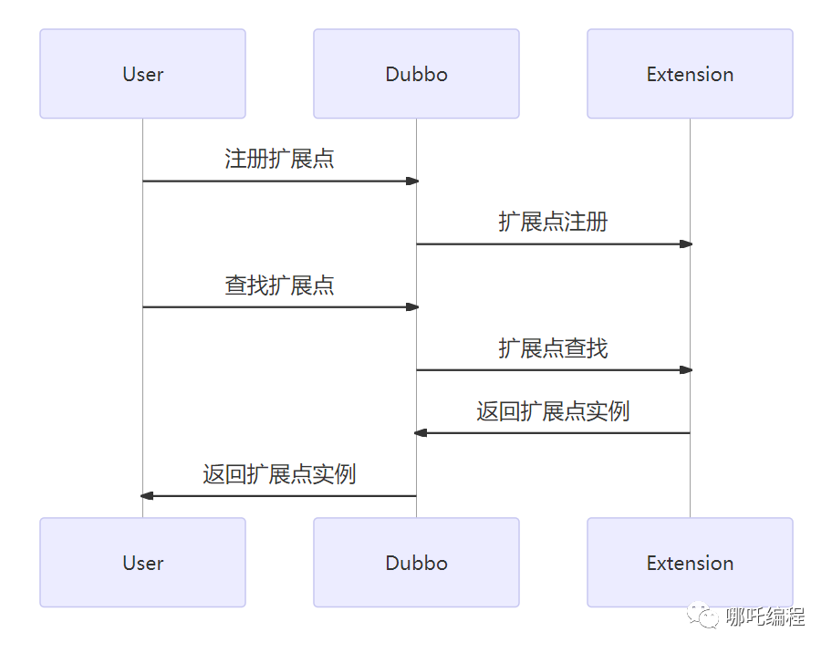
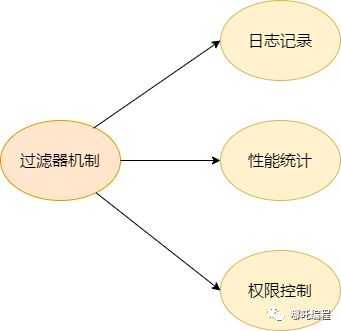
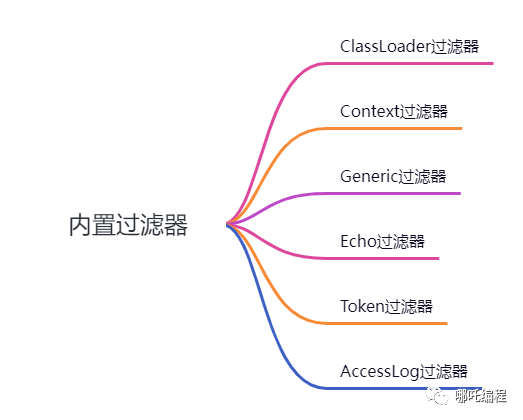
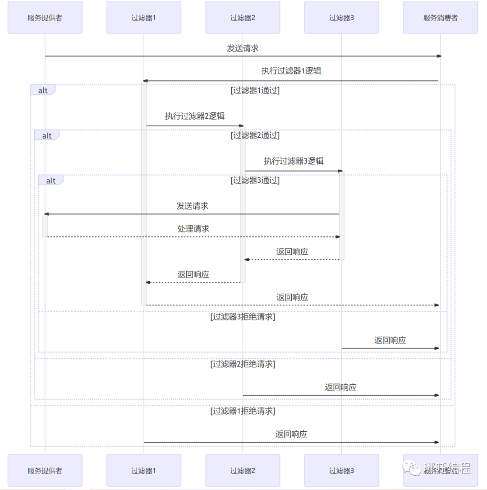
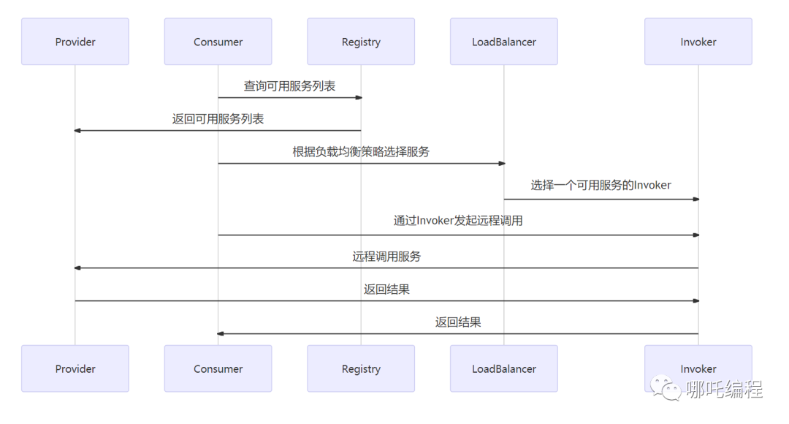
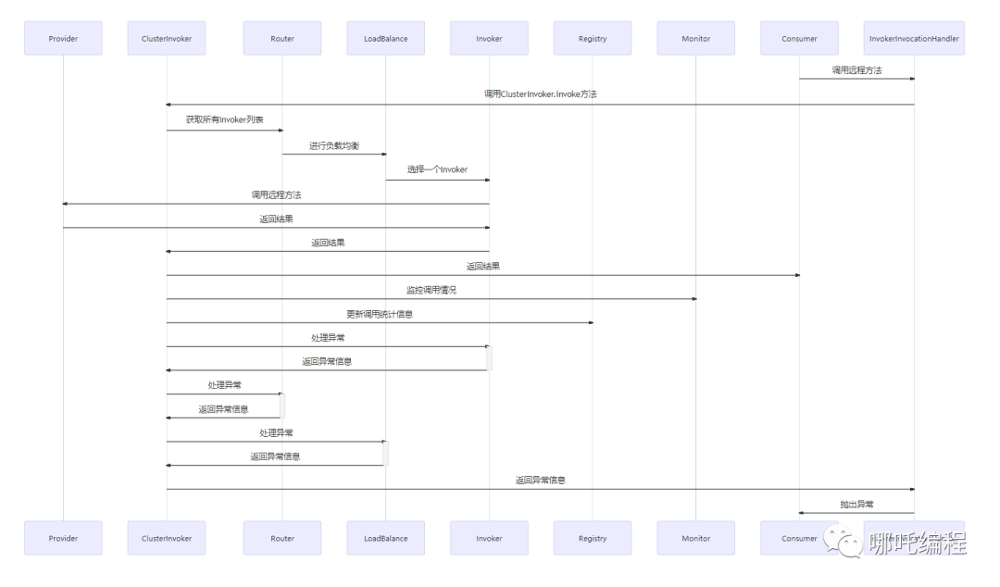

三分钟你将学会：

1.  Dubbo 的自适应扩展机制

2.  Dubbo 的 SPI 扩展机制

3.  Dubbo 的自定义扩展点机制

4.  Dubbo 的过滤器扩展机制

5.  Dubbo 的负载均衡扩展机制；

6.  Dubbo 的容错机制扩展；

## 一、Dubbo 扩展机制的概述

> Dubbo 是一个**高性能的分布式服务框架**，广泛应用于各种规模和种类的企业级项目中。在实际应用过程中，Dubbo 的核心能力是扩展机制，它可以让 Dubbo 具有更强的可定制化能力，也可以让 Dubbo 更好地适应各种应用场景。



**Dubbo 的扩展机制主要包括：**自适应扩展机制、SPI 扩展机制、自定义扩展点机制、过滤器扩展机制、负载均衡扩展机制和容错机制扩展。

这些机制使得 Dubbo 的使用更加灵活方便，可以满足不同需要的业务场景，也可以根据实际情况来选择合适的扩展机制。

在 Dubbo 的扩展机制中，尤其需要注意自定义扩展点机制和 SPI 扩展机制。这些机制是 Dubbo 中较为重要和常用的扩展机制，充分了解这些机制可以让应用程序更加灵活和可定制。

**下图展示了 Dubbo 扩展机制的调用流程：**



上图中，Dubbo 客户端首先会通过 ExtensionLoader 加载需要使用的扩展点，ExtensionLoader 会根据客户端传入的扩展点名和配置，创建对应的扩展点实例，并返回给客户端，客户端再通过返回的扩展点实例调用相应的方法。

## 二、Dubbo 的自适应扩展机制

### 1、什么是自适应扩展机制

> **自适应扩展机制**是 Dubbo 提供的一种机制，它可以使 Dubbo 框架根据实际使用情况动态地选择不同的扩展实现，从而达到最优的效果。

**自适应扩展机制的实现方式**是通过在扩展接口的代理类中，根据实际情况动态地生成对应扩展实现的代理类实例。

下图是自适应扩展机制的详细时序图：



上图中

1.  Client 先调用 ExtensionLoader 加载扩展点，并解析配置文件；

2.  ExtensionLoader 根据配置文件查找实现类

3.  然后创建一个 AdaptiveExtension 的代理对象，并将该代理对象返回给 Client；

4.  Client 调用代理对象的方法时，AdaptiveExtension 会根据配置使用具体的扩展点实现，并将调用转发给具体的扩展点实现；

5.  最后将结果返回给 Client；

### 2、自适应扩展机制的使用示例

在 Dubbo 框架中，有一个名为 Protocol 的扩展接口，它有多种不同的实现方式，如 dubbo、rmi、http 等。在使用 Dubbo 时，我们可以通过@Reference 注解来注入对应的扩展实现，如：

```
@Reference(protocol = "dubbo")
private DemoService demoService;


```

在上述代码中，我们指定了使用 dubbo 协议的 DemoService 接口的扩展实现。

我们也可以通过 adaptive 属性来实现自适应调用，如：

```
@Reference(adaptive = "true")
private Protocol protocol;


```

在上述代码中，我们使用了 adaptive 属性，并注入了 Protocol 类型的实例。这时，Dubbo 框架会根据实际情况动态地生成对应实现的代理类，并返回对应的实例。

## 三、Dubbo 的 SPI 扩展机制

### 1、什么是 SPI 扩展机制

> Dubbo 使用了 Java 的 SPI（Service Provider Interface）扩展机制。**SPI 是 JDK 内置的一种服务发现机制**，其具体实现方式是在资源文件 META-INF/services 中通过名称为 SPI 接口的全限定类名创建一个文本文件，在这个文本文件中可以写入该 SPI 接口的实现类全限定类名，这样可以实现动态加载实现类的目的。

**Dubbo 中的 SPI 扩展机制**能够在不修改核心源代码的前提下，通过修改配置文件或者实现自定义拓展类的方式来替换或增加核心功能。

下图描述了 Dubbo SPI 扩展机制的工作流程：



上图描述了 Dubbo SPI 扩展机制的工作流程，其中：

1.  用户向 Dubbo Framework 请求获取 ExtensionLoader，ExtensionLoader 是 Dubbo SPI 扩展机制的核心类；

2.  Dubbo Framework 加载 ExtensionLoader，并返回给用户；

3.  用户调用 ExtensionLoader 的方法；

4.  ExtensionLoader 根据指定的 Extension 接口，通过 SPI 机制加载 Extension 实现；

5.  Extension 实现将被加载，ExtensionLoader 返回 Extension 实现给用户；

### 2、SPI 扩展机制的使用示例

首先，我们需要定义一个 SPI 扩展接口，让 Dubbo 的扩展实现类都实现该接口。

示例代码：

```
package com.example.extension;

import com.alibaba.dubbo.common.extension.SPI;

@SPI("default")
public interface PrintService {
    void print(String msg);
}
```

在接口上添加@SPI 注解，指定该扩展的默认实现类。

然后，我们需要在`META-INF/services`目录下创建一个“接口全限定类名”的文件名的文件，文件中写入我们实现的 SPI 扩展类的全限定类名。

比如我们需要同过实现 PrintService 接口来实现打印功能，那么我们在 META-INF/services/目录下创建一个名为`“com.example.extension.PrintService”`的文件，文件内容为：

```
com.example.extension.impl.ConsolePrintServiceImpl
```

接下来，我们就可以通过 Dubbo 框架自动加载通过 SPI 机制注册的实现类了。

示例代码：

```
AnnotationConfigApplicationContext context = 
new AnnotationConfigApplicationContext(Main.class);
    PrintService printService = 
    ExtensionLoader.getExtensionLoader(PrintService.class).getDefaultExtension();
    printService.print("hello world!");
```

以上代码中，我们使用 Dubbo 的扩展加载器 ExtensionLoader 来获取 PrintService 接口的默认实现类，然后调用该实现类的 print()方法即可实现打印功能。

### 3、Dubbo 的 SPI 扩展机制中自定义扩展点的实现示例

在 Dubbo 框架中，我们可以通过自定义扩展点来增强 Dubbo 的功能。

> **自定义扩展点**需要实现 Dubbo 提供的 ExtensionFactory 接口，并在`META-INF/dubbo/internal/`路径下创建一个文件名为`com.alibaba.dubbo.common.extension.ExtensionFactory`的文件，文件中写入扩展点实现类的全限定类名。

示例代码：

```
package com.example.extension;

import com.alibaba.dubbo.common.extension.ExtensionFactory;

public class MyExtensionFactory implements ExtensionFactory {
    @Override
    public <T> T getExtension(Class<T> type, String name) {
        if (type.equals(PrintService.class)) {
            return (T) new ConsolePrintServiceImpl();
        }
        return null;
    }
}


```

在 MyExtensionFactory 中实现 getExtension()方法，并根据 type 参数判断获取哪个扩展实现类。

> 在本示例中，我们仅仅实现了 PrintService 接口的实现类，因此只需要判断 type 参数是否为 PrintService 类即可。

下一步，我们需要在 META-INF/dubbo/internal/目录下创建一个名为`com.alibaba.dubbo.common.extension.ExtensionFactory`的文件，文件内容为我们实现的扩展点实现类全限定类名。

比如我们实现的扩展点实现类为`com.example.extension.MyExtensionFactory`，那么我们就要在 META-INF/dubbo/internal/目录下创建一个名为`com.alibaba.dubbo.common.extension.ExtensionFactory`的文件，并将文件内容写为`com.example.extension.MyExtensionFactory。`

最后，我们在程序中就可以使用自定义的扩展点了。示例代码：

```
AnnotationConfigApplicationContext context = 
new AnnotationConfigApplicationContext(Main.class);
PrintService printService = 
ExtensionLoader.getExtensionLoader(PrintService.class).getExtension("console");
printService.print("hello world!");


```

在以上示例代码中，我们通过 getExtension()方法来获取 PrintService 接口的实现类。getExtension()方法中的参数为扩展点的 name 属性，该属性值默认为“default”。

在本示例中我们将 name 的值设置为“console”，因此即使用了我们自定义的扩展点实现类。

## 四、Dubbo 的自定义扩展点机制

### 1、什么是自定义扩展点机制

> Dubbo 的**自定义扩展点机制**是在 SPI 扩展机制的基础上，增加了自定义扩展点的实现方式。通过 Dubbo 的扩展机制，我们可以通过配置文件切换 Dubbo 内部的实现方式，但是对于用户自己实现的功能模块，如何进行扩展呢？

这里就需要用到自定义扩展点机制了。

下图是自定义扩展点机制的详细时序图：



在上图中

1.  用户首先将自己实现的扩展点注册到 Dubbo 中；

2.  然后在需要使用该扩展点的时候，Dubbo 会根据扩展点的名称进行查找并返回相应的扩展点实例；

3.  通过这样的机制，用户可以灵活地扩展 Dubbo 的功能，同时也可以让 Dubbo 更加适应不同的业务场景。

自定义扩展点的核心思想就是：**“面向接口编程，实现类实现接口，接口与实现类通过扩展点 Binder 关联。”**

其中，Binder 的定义可以参考以下的代码：

```
public interface ExtensionFactory {
    // 返回一个扩展点的代理对象
    <T> T getExtension(Class<T> type, String name) throws IllegalStateException;
}

public interface ExtensionLoader<T> {
    T getExtension(String name);
}

public interface ExtensionBinder<T> {
    // 绑定
    void bind(T instance);
    // 获取绑定的扩展对象
    T get();
}

public interface ExtensionLoaderListener {
    void onLoad();
}


```

### 2、自定义扩展点机制的使用示例

为了更好地理解 Dubbo 的自定义扩展点机制，我们可以通过一个简单的示例来演示其使用方法。假设我们有一个接口 HelloService，我们想要通过自定义扩展点机制，为这个接口添加一个实现类。

首先，我们需要创建一个实现类 HelloServiceImpl，该实现类需要实现 HelloService 接口。

接着，我们需要在`resources/META-INF/dubbo`目录下创建一个名为 com.xxx.HelloService 的文件，该文件中需要指定 HelloService 接口的实现类名称。

```
helloService=com.xxx.HelloServiceImpl
```

接下来，我们需要在代码中获取 HelloService 接口的实例。这可以通过以下方式实现：

```
ExtensionLoader<HelloService> loader = 
ExtensionLoader.getExtensionLoader(HelloService.class);
HelloService helloService = 
loader.getExtension("helloService");
helloService.sayHello();
```

其中，getExtensionLoader()方法用于获取扩展点的 ExtensionLoader 实例，getExtension()方法用于 获取具体的扩展实例。

在上面的代码中，我们通过“helloService”这个名称获取到了实现了 HelloService 接口的 HelloServiceImpl 实例，并调用了其中的 sayHello()方法。

通过上述示例，我们可以看出，使用 Dubbo 的自定义扩展点机制非常简单，只需要在配置文件中指定实现类的名称，然后通过 getExtensionLoader()和 getExtension()方法获取实例即可。

### 3、Dubbo 的自定义扩展点机制的实现示例

在 Dubbo 的自定义扩展点机制中，最核心的是 ExtensionLoader 类和 ExtensionFactory 类。

其中，ExtensionLoader 用于加载和管理扩展实例，ExtensionFactory 用于创建扩展实例。

下面，我们将通过一个简单的示例，演示 Dubbo 的自定义扩展点机制的具体实现方式。

**首先，我们需要定义一个扩展点接口：**

```
public interface HelloService {
    String sayHello(String name);
}


```

**接着，我们需要实现该接口的一个实现类：**

```
@SPI("helloWorld")
public class HelloWorldService implements HelloService {
    @Override
    public String sayHello(String name) {
        return "Hello, " + name;
    }
}


```

在这里，我们使用了@SPI 注解来指定该扩展点的默认实现，如果配置文件中没有指定其他实现，则会使用该默认实现。

**接下来，我们需要创建一个名为 com.xxx.HelloService 的文件，该文件中需要指定扩展点接口的实现类名称：**

```
helloWorld=com.xxx.HelloWorldService


```

**最后，我们需要在代码中获取 HelloService 接口的实例，这可以通过以下代码实现：**

```
ExtensionLoader<HelloService> loader = 
ExtensionLoader.getExtensionLoader(HelloService.class);
HelloService helloService = 
loader.getExtension("helloWorld");
System.out.println(helloService.sayHello("Dubbo"));


```

在上述代码中，我们通过 getExtensionLoader()方法获取 HelloService 接口的 ExtensionLoader 实例，然后通过 getExtension()方法获取名为“helloWorld”的实现类实例，并调用其中的 sayHello()方法。

## 五、Dubbo 的过滤器扩展机制

### 1、Dubbo 的过滤器机制概述



> Dubbo 的**过滤器机制**允许在调用前、调用后以及抛出异常时执行一些额外的操作。过滤器在调用链路中按顺序执行，可以在过滤器中实现各种功能，例如：日志记录、性能统计、权限控制等。



Dubbo 中内置了多个过滤器，包括：ClassLoader 过滤器、Context 过滤器、Generic 过滤器、Echo 过滤器、Token 过滤器、AccessLog 过滤器等。

下面是 Dubbo 的过滤器机制的时序图：



上图中

1.  服务消费者向服务提供者发送请求时，请求先经过过滤器 1；

2.  如果过滤器 1 通过则进一步经过过滤器 2；

3.  如果过滤器 2 通过则进一步经过过滤器 3；

4.  如果过滤器 3 通过则将请求发送给服务提供者，服务提供者处理请求后将响应返回给服务消费者，响应也会经过相同的过滤器链路；

5.  如果任意一个过滤器拒绝请求，则直接返回错误响应。

### 2、过滤器扩展机制的使用示例

Dubbo 提供了**扩展机制**，可以在 dubbo 配置文件中配置过滤器，示例如下：

```
<dubbo:provider filter="accessLogFilter" />
```

在上面的例子中，accessLogFilter 表示需要使用的过滤器名称，可以在 dubbo 配置文件中通过 dubbo:filter 标签进行定义。

### 3、自定义过滤器的实现示例

要实现自定义过滤器，需要按照以下步骤进行：

1.  定义一个类实现 org.apache.dubbo.rpc.Filter 接口；

2.  实现接口中的方法；

3.  在 META-INF/dubbo 目录下创建一个以`org.apache.dubbo.rpc.Filter`接口全限定名为名称的文件，并在文件中添加自定义过滤器的类名。

下面是一个自定义的过滤器示例：

```
package com.example;

import org.apache.dubbo.common.extension.Activate;
import org.apache.dubbo.rpc.*;

@Activate(group = "provider")
public class MyFilter implements Filter {
    @Override
    public Result invoke(Invoker<?> invoker, Invocation invocation) throws RpcException {
        // 在这里实现自己的逻辑
        return invoker.invoke(invocation);
    }
}


```

在上面的例子中，我们实现了一个 MyFilter 过滤器，并使用@Activate 注解指定了它是一个 provider 端的过滤器，然后在 invoke()方法中编写自己的逻辑，最后调用 invoker.invoke(invocation)方法来执行调用链路中的下一个过滤器或服务。

## 六、Dubbo 的负载均衡扩展机制

### 1、Dubbo 的负载均衡扩展机制概述

> **负载均衡**是分布式系统中的一个重要问题，它可以实现将请求分摊到多个服务提供者上，提高系统的并发能力和可用性。

Dubbo 的负载均衡扩展机制允许用户自定义负载均衡策略，实现更加灵活、适合特定场景的负载均衡算法。

Dubbo 内置了多种负载均衡算法，包括随机、轮询、最少活跃调用等。

下面是 Dubbo 的负载均衡扩展机制的时序图：



### 2、负载均衡扩展机制的使用示例

**Dubbo 的负载均衡扩展机制**可以通过在服务提供方和服务消费方的配置文件中指定负载均衡策略来使用。

例如，在服务提供方的配置文件中可以添加以下配置：

```
<dubbo:service interface="com.xxx.XxxService" loadbalance="roundrobin" />
```

在服务消费方的配置文件中可以添加以下配置：

```
<dubbo:reference interface="com.xxx.XxxService" loadbalance="random" />
```

这样就可以实现使用 Dubbo 内置的轮询

### 3、自定义负载均衡策略的实现示例

用户可以通过实现 Dubbo 的 LoadBalance 接口来自定义负载均衡策略。

以下是一个示例：

```
public class MyLoadBalance implements LoadBalance {
    @Override
    public <T> Invoker<T> select(List<Invoker<T>> invokers, URL url, Invocation invocation) throws RpcException {
        // 自定义负载均衡算法实现
        return invokers.get(0);
    }
}
```

## 七、Dubbo 的容错机制扩展

### 1、Dubbo 的容错机制概述

> **Dubbo 的容错机制**是指当 Dubbo 服务调用出现异常时，Dubbo 框架会根据预设的容错机制进行处理，以保证服务的高可用性。

Dubbo 框架默认提供了多种容错机制，如 Failover、Failfast、Failsafe、Failback、Forking 等，也支持自定义容错机制。

Dubbo 的容错机制通常是通过在客户端代理层实现的，当远程服务调用出现异常时，客户端代理会根据预设的容错机制进行重试或处理，以保证服务的高可用性。



在 Dubbo 的容错机制中，ClusterInvoker 负责调用远程服务，并进行容错处理。当调用远程服务发生异常时，Dubbo 会按照以下顺序进行容错处理：

1.  ClusterInvoker 处理异常；

2.  如果 ClusterInvoker 处理异常失败，则交由 Router 处理异常；

3.  如果 Router 处理异常失败，则交由 LoadBalance 处理异常；

4.  如果 LoadBalance 处理异常失败，则抛出异常给 InvokerInvocationHandler，最终抛出给 Consumer。同时，Dubbo 还会将异常信息进行监控，并更新调用统计信息。

### 2、容错机制扩展的使用示例

**Dubbo 默认的容错机制是 Failover**，即自动切换重试其他节点，达到容错和负载均衡的效果。如果需要使用其他容错机制，可以通过在服务提供方和服务消费方的配置文件中进行配置。

例如，我们可以通过以下方式配置使用 Failfast 容错机制：

在服务提供方的配置文件中增加如下配置：

```
<dubbo:service interface="com.example.service.SomeService" retries="0"/>
```

在服务消费方的配置文件中增加如下配置：

```
<dubbo:reference interface="com.example.service.SomeService" check="false" cluster="failfast"/>
```

这样，在服务调用出现异常时，Dubbo 框架会自动使用 Failfast 容错机制进行处理，即只进行一次调用，若调用失败则立即抛出异常，不进行重试。

### 3、自定义容错策略的实现示例

如果需要实现自定义的容错策略，可以通过继承`org.apache.dubbo.rpc.cluster.support.AbstractClusterInvoker`类，并实现`org.apache.dubbo.rpc.Invoker`接口，来自定义容错策略的实现。

例如，我们可以通过以下代码实现一个自定义的容错策略：

```
public class MyClusterInvoker<T> extends AbstractClusterInvoker<T> {
    public MyClusterInvoker(Directory<T> directory) {
        super(directory);
    }

    @Override
    protected Result doInvoke(Invocation invocation, List<Invoker<T>> invokers, LoadBalance loadbalance) throws RpcException {
        // 自定义容错逻辑
        ...
    }
}
```

在实现自定义容错策略后，需要在服务提供方和服务消费方的配置文件中进行配置。

例如，在服务提供方的配置文件中增加如下配置：

```
<dubbo:service interface="com.example.service.SomeService" cluster="myClusterInvoker"/>
```

在服务消费方的配置文件中增加如下配置：

```
<dubbo:reference interface="com.example.service.SomeService" check="false" cluster="myClusterInvoker"/>
```

这样，在服务调用时，Dubbo 框架会使用我们自定义的 MyClusterInvoker 容错策略进行处理。

## 八、Dubbo 的扩展机制实践

### 1、实现一个使用自定义扩展点、过滤器、负载均衡器和容错机制的 Dubbo 服务

在这个实践中，我们将实现一个使用自定义扩展点、过滤器、负载均衡器和容错机制的 Dubbo 服务。

### 2、首先，我们需要定义一个服务接口。

例如，我们可以定义一个名为 SomeService 的服务接口，如下所示：

```
public interface SomeService {
    String sayHello(String name);
}
```

### 3、然后，我们需要实现该服务接口。

例如，我们可以实现一个名为 SomeServiceImpl 的服务实现类，如下所示：

```
public class SomeServiceImpl implements SomeService {
    @Override
    public String sayHello(String name) {
        return "Hello, " + name + "!";
    }
}
```

### 4、接下来，我们需要配置 Dubbo 的扩展点、过滤器、负载均衡器和容错机制。

例如，我们可以在服务提供方和服务消费方的配置文件中进行如下配置：

```
<!-- 扩展点配置 -->
<dubbo:protocol />

<!-- 过滤器配置 -->
<dubbo:provider filter="com.example.filter.MyProviderFilter"/>
<dubbo:consumer filter="com.example.filter.MyConsumerFilter"/>

<!-- 负载均衡器配置 -->
<dubbo:reference interface="com.example.service.SomeService" loadbalance="com.example.loadbalance.MyLoadBalance"/>

<!-- 容错机制配置 -->
<dubbo:service interface="com.example.service.SomeService" cluster="com.example.cluster.MyCluster"/>
<dubbo:reference interface="com.example.service.SomeService" cluster="com.example.cluster.MyCluster"/>
```

其中，`com.example.extension.MyProtocol` 是一个自定义的 Dubbo 协议扩展点实现类，`com.example.filter.MyProviderFilter` 和 `com.example.filter.MyConsumerFilter` 是自定义的 Dubbo 过滤器实现类，`com.example.loadbalance.MyLoadBalance` 是一个自定义的 Dubbo 负载均衡器实现类，`com.example.cluster.MyCluster` 是一个自定义的 Dubbo 容错机制实现类。

### 5、最后，我们可以使用 Dubbo 的 API 在客户端调用该服务。

例如，我们可以使用如下代码在客户端调用该服务：

```
// 获取 Dubbo 服务引用
SomeService someService = DubboReferenceBuilder.newBuilder()
        .setInterface(SomeService.class)
        .setUrl("dubbo://localhost:20880")
        .build();

// 调用 Dubbo 服务
String result = someService.sayHello("Dubbo");
System.out.println(result);
```

这样，我们就实现了一个使用自定义扩展点、过滤器、负载均衡器和容错机制的 Dubbo 服务。
