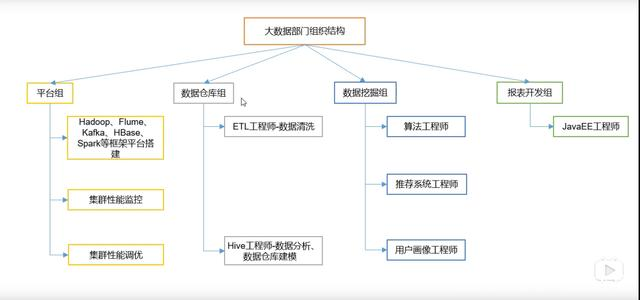

# 大数据概念

## 1.大数据概念

大数据（Big Data）：指**无法在一定时间范围**内用常规软件工具进行捕捉、管理和处理的数据集合，是需要新处理模式才能具有更强的决策力、洞察发现力和流程优化能力的**海量、高增长率**和多样化的**信息资产**。

大数据主要解决，**海量**数据的**采集、存储**和**分析计算**问题

按顺序给出数据存储单位：bit、Byte、KB、MB、GB、**TB、PB、EB**、ZB、YB、BB、NB、DB。

> 1Byte = 8bit 1K = 1024Byte 1MB = 1024K
> 1G = 1024M 1T = 1024G 1P = 1024T

## 2.大数据特点（5V）

大数据的特点可以用 IBM 曾经提出的 “5V” 来描述，如下：

### 1、Volume（大量）

大数据的第一个特点就是“数量大”。大数据的数据量是惊人的，随着技术的发展，数据量开始爆发性增长，达到 TB 甚至 PB 级别。例如，淘宝网平常每天的商品交易数据约 20TB（1TB=1024GB），全球最大设计平台 Facebook 的用户，每天产生的日志数据超过了 300TB（日志数据是记录用户操作记录的，并非发帖内容） 。

大数据如此庞大的数据量，是无法通过人工处理的。需要智能的算法、强大的数据处理平台和新的数据处理技术来处理这些大数据。

### 2、Velocity（高速）

这是大数据区分于传统数据挖掘的最显著特征。根据 IDC 的“数字宇宙”的报告，预计到 2025 年，全球数据使用量将达到 163ZB。在如此海量的数据面前，处理数据的效率就是企业的生命。

> 天猫双十一：2017 年 3 分 01 秒，天猫交易额超过 100 亿
> 2020 年 96 秒，天猫交易额超过 100 亿

实时分析而非批量分析，数据输入、处理与丢弃立刻见效，几乎无延迟。数据的增长速度和处理速度是大数据高速性的重要体现。

### 3、Variety（多样）

这种类型的多样性也让数据被分为结构化数据和非结构化数据。相对于以往便于存储的**以数据库/文本为主的结构化数据，非结构化数据**越来越多，包括网络**日志、音频、视频、图**
**片、地理位置信息**等，这些多类型的数据对数据的处理能力提出了更高要求。

### 4、真实

确保数据的真实性，才能保证数据分析的正确性

### 5、Value（低价值密度）

价值密度的高低与数据总量的大小成反比。 如何快**速对有价值数据“提纯”成为目前大数据背景下待解决的难题**。价值性是大数据的核心特点。现实中大量的数据是无效或者低价值的，大数据最大的价值在于通过从大量不相关的各种类型的数据中，挖掘出对未来趋势与模式预测分析有价值的数据。比如，某宝电商平台每天产生的大量交易数据（大数据），通过一些算法可以分析出具有某些特征的人喜欢什么类型的商品，然后根据客户的特征，给其推荐 TA 喜欢的商品。

## 3.大数据应用场景

3.1 抖音：推荐的都是你喜欢的视频

3.2 电商站内广告推荐：给用户推荐可能喜欢的商品

3.3 零售：分析用户消费习惯，为用户购买商品提供方便，从而提升商品销量。经典案例，纸尿布+啤酒。

3.4 物流仓储：京东物流，上午下单下午送达、下午下单次日上午送达

3.5 保险：海量数据挖掘及风险预测，助力保险行业精准营销，提升精细化定价能力。

3.6 金融：多维度体现用户特征，帮助金融机构推荐优质客户，防范欺诈风险。

3.7 房产：大数据全面助力房地产行业，打造精准投策与营销，选出更合适的地，建造更合适的楼，卖给更合适的人。

3.8 人工智能+ 5G + 物联网+ 虚拟与现实

## 大数据部门组织结构

# 下一个风口

2020 年是 5G 的元年，国家在大力铺设 5G 设备，2021 年就是 5G 手机应用的开始，也是大数据要爆发的 1 年。5G 带来的是每秒钟 10g 的数据，会给每家公司都带来海量的数据。那么传统的 Java 工具根本解决不了海量数据的存储。就更不用说海量数据的计算了。如果你对 5G 的感触不够深，可以回忆一下 3G 和 4G 的区别。3G 时只能打电话、发短信，当时还觉得很好，觉得 3G 不错。但是 4G 来了后，大家很少打电话和发短信了，都改为语音、视频、直播、网上购物等生活方式，带火了淘宝、京东、美团、字节跳动等企业。没有跟上节奏的百度，有点摇摇欲坠。
