#  Hadoop介绍 

- **狭义上Hadoop指的是Apache软件基金会的一款开源软件**。

用java语言实现，开源

允许用户使用简单的编程模型实现跨机器集群对海量数据进行分布式计算处理

- **Hadoop核心组件**

Hadoop HDFS（分布式文件存储系统）：解决海量数据存储

Hadoop YARN（集群资源管理和任务调度框架）：解决资源任务调度

Hadoop MapReduce（分布式计算框架）：解决海量数据计算

- 官网

http://hadoop.apache.org/

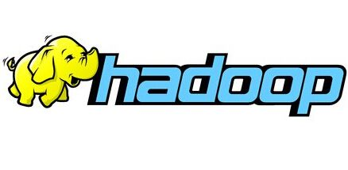

- 广义上Hadoop指的是围绕Hadoop打造的大数据生态圈。

    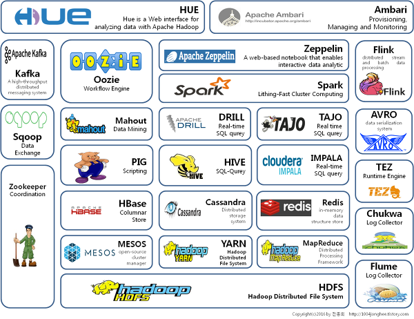

#  Hadoop发展历史

1）Hadoop创始人Doug Cutting，为了实现与Google类似的全文搜索功能，他在Lucene框架基础上进行优化升级，查询引擎和索引引擎。

Hadoop创始人Doug Cutting
2）2001年年底Lucene成为Apache基金会的一个子项目。
3）对于海量数据的场景，Lucene框架面对与Google同样的困难，存储海量数据困难，检索海量速度慢。
4）学习和模仿Google解决这些问题的办法：微型版Nutch。
5）可以说Google是Hadoop的思想之源（Google在大数据方面的三篇论文）

> 《The Google file system》：谷歌分布式文件系统GFS  --->HDFS
>
> 《MapReduce: Simplified Data Processing on Large Clusters》：谷歌分布式计算框架MapReduce --->MR
>
> 《Bigtable: A Distributed Storage System for Structured Data》：谷歌结构化数据存储系统  --->HBase

6）2003-2004年，Google公开了部分GFS和MapReduce思想的细节，以此为基础Doug Cutting等人用了2年业余时间实现了DFS和MapReduce机制，使Nutch性能飙升。
7）2005 年Hadoop 作为Lucene的子项目Nutch的一部分正式引入Apache基金会。
8）2006 年3 月份，Map-Reduce和Nutch Distributed File System （NDFS）分别被纳入到Hadoop 项目中，Hadoop就此正式诞生，标志着大数据时代来临。
9）名字来源于Doug Cutting儿子的玩具大象

Hadoop的logo

# **Hadoop现状**

- **HDFS**作为分布式文件存储系统，处在**生态圈的底层与核心地位**；

- **YARN**作为分布式通用的集群资源管理系统和任务调度平台，支撑各种**计算引擎运行，保证了Hadoop地位**；

- **MapReduce**作为大数据生态圈第一代分布式计算引擎，由于自身设计的模型所产生的弊端，导致企业一线几乎不再直接使用MapReduce进行编程处理，但是很多软件的底层依然在使用MapReduce引擎来处理数据

#  Hadoop特性优点 

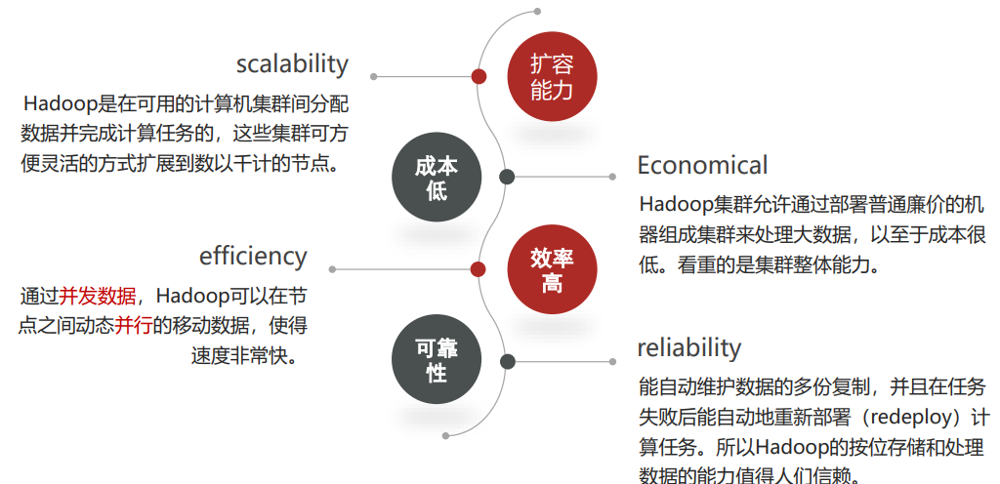

#  Hadoop国外应用 

- Yahoo 

    支持广告系统 

    用户行为分析 

    支持Web搜索 

    反垃圾邮件系统 

- Facebook  
    存储处理数据挖掘和日志统计
    构建基于Hadoop数据仓库平台（Apache Hive来自FB） 

- IBM 
    蓝云基础设施构建   
    商业化Hadoop发行、解决方案支持 

#  Hadoop国内应用 

- 百度

用户搜索表征的需求数据、阿拉丁爬虫数据存储

数据分析和挖掘竞价排名

- 阿里巴巴

为电子商务网络平台提供底层的基础计算和存储服务

交易数据、信用数据

- 腾讯

用户关系数据

基于Hadoop、Hive构建TDW（腾讯分布式数据仓库）

- 华为

    对Hadoop的HA方案，以及HBase领域有深入研究 

#  Hadoop发行版本 

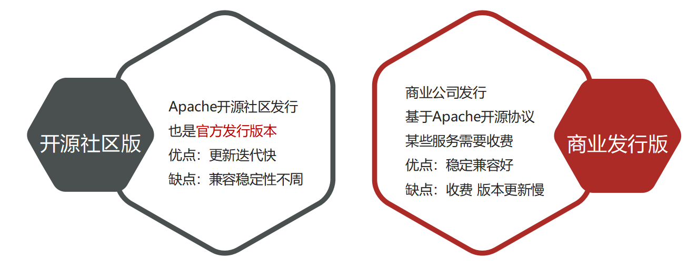

- Apache开源社区版本

http://hadoop.apache.org/

- 商业发行版本

Cloudera[：](https://www.cloudera.com/products/open-source/apache-hadoop.html)https://www.cloudera.com/products/open-source/apache-hadoop.html

Hortonworks [：](https://www.cloudera.com/products/hdp.html)https://www.cloudera.com/products/hdp.html

- 本课程中使用的是Apache版的Hadoop，版本号为：**3.3.0**

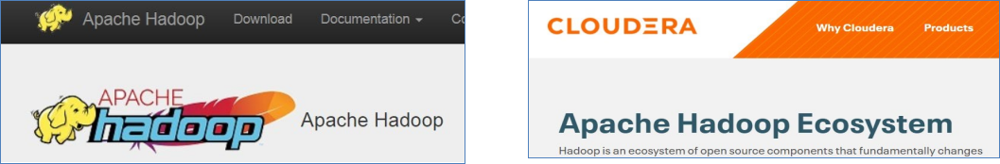

#  Hadoop架构变迁（1.0-2.0变迁）

 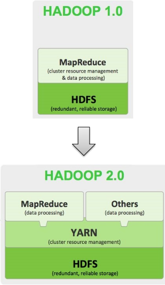

##  

- **Hadoop 1.0**

HDFS（分布式文件存储）

MapReduce（资源管理和分布式数据处理）

- **Hadoop 2.0**

HDFS（分布式文件存储）

MapReduce（分布式数据处理）

**YARN**（集群资源管理、任务调度）

## **Hadoop架构变迁（3.0新版本）**

Hadoop 3.0架构组件和Hadoop 2.0类似,**3.0着重于性能优化** 。 

-  **通用方面**

精简内核、类路径隔离、shell脚本重构

- **Hadoop HDFS**

EC纠删码、多NameNode支持

- **Hadoop MapReduce**

任务本地化优化、内存参数自动推断

-  **Hadoop YARN**

Timeline Service V2、队列配置

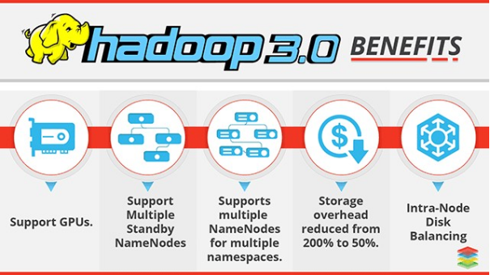

#  Hadoop 优势（4 高） 

## 1. 高可靠性

Hadoop底层维护多个数据副本，所以即使Hadoop某个计算元 素或存储出现故障，也不会导致数据的丢失。 

## 2. 高扩展性

在集群间分配任务数据，可方便的扩展数以千计的节点 

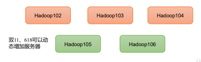

## 3. 高效性

在MapReduce的思想下，Hadoop是并行工作的，以加快任务处 理速度。 

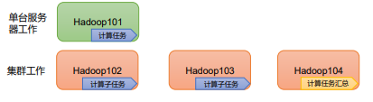

## 4. 高容错性

能够自动将失败的任务重新分配。  

#  Hadoop 组成 

- Hadoop集群包括两个集群：HDFS集群、YARN集群

- 两个集群逻辑上分离、通常物理上在一起
- 两个集群都是标准的主从架构集群

##  1.HDFS 架构概述 

 Hadoop Distributed File System，简称 HDFS，是一个分布式文件系统。 

###  HDFS架构概述 

#### 1. NameNode（nn）

存储文件的元数据，如文件名，文件目录结构，文件属性（生成时间、副本数、 文件权限），以及每个文件的块列表和块所在的DataNode等。 

#### 2. DataNode(dn)

在本地文件系统存储文件块数据，以及块数据的校验和。 

#### 3. Secondary NameNode(2nn)()秘书，辅助nn

每隔一段时间对NameNode元数据备份。  备份nn数据，nn奔溃，恢复后中2nn获取数据 

## 2.  YARN 架构概述 

 Yet Another Resource Negotiator 简称 YARN ，另一种资源协调者，是 Hadoop 的资源管理器。  

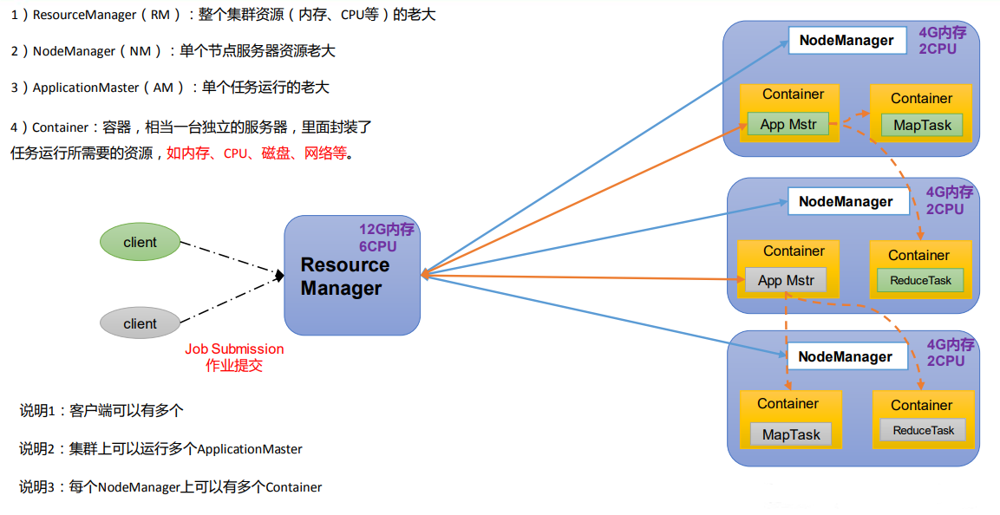

## Hadoop集群 = HDFS集群 + YARN 集群

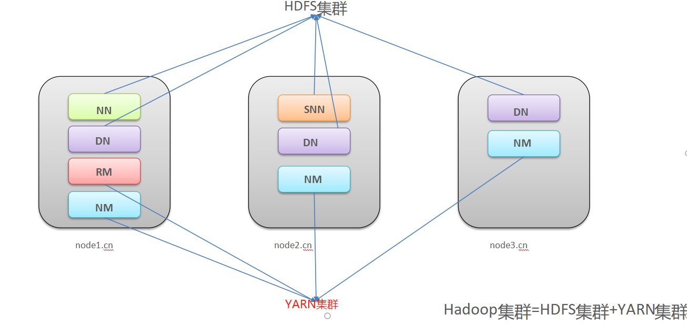

- 逻辑上分离

两个集群互相之间没有依赖、互不影响

- 物理上在一起某些角色进程往往部署在同一台物理服务器上

- MapReduce集群呢？

MapReduce是计算框架、代码层面的组件没有集群之说

#  大数据技术生态体系

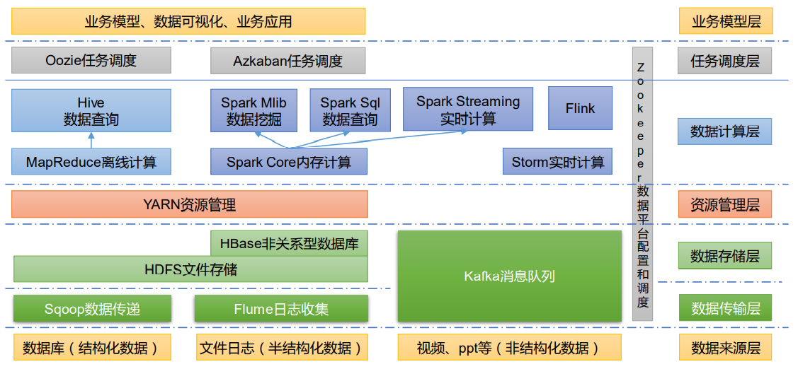图中涉及的技术名词解释如下： 

1）Sqoop：Sqoop 是一款开源的工具，主要用于在 Hadoop、Hive 与传统的数据库（MySQL） 间进行数据的传递，可以将一个关系型数据库（例如 ：MySQL，Oracle 等）中的数据导进 到 Hadoop 的 HDFS 中，也可以将 HDFS 的数据导进到关系型数据库中。 

2）Flume：Flume 是一个高可用的，高可靠的，分布式的海量日志采集、聚合和传输的系统， Flume 支持在日志系统中定制各类数据发送方，用于收集数据；

3 ) Kafka：Kafka 是一种高吞吐量的分布式发布订阅消息系统 ；

4）Spark：Spark 是当前最流行的开源大数据内存计算框架。可以基于 Hadoop 上存储的大数 据进行计算。 
5）Flink：Flink 是当前最流行的开源大数据内存计算框架。用于实时计算的场景较多。 
6）Oozie：Oozie 是一个管理 Hadoop 作业（job）的工作流程调度管理系统。 
7）Hbase：HBase 是一个分布式的、面向列的开源数据库。HBase 不同于一般的关系数据库， 它是一个适合于非结构化数据存储的数据库。 
8）Hive：Hive 是基于 Hadoop 的一个数据仓库工具，可以将结构化的数据文件映射为一张 数据库表，并提供简单的 SQL 查询功能，可以将 SQL 语句转换为 MapReduce 任务进行运 行。其优点是学习成本低，可以通过类 SQL 语句快速实现简单的 MapReduce 统计，不必开 发专门的 MapReduce 应用，十分适合数据仓库的统计分析。
9）ZooKeeper：它是一个针对大型分布式系统的可靠协调系统，提供的功能包括：配置维护、 名字服务、分布式同步、组服务等。
