 

基础环境：Centos 7.7 

参考：[VMware虚拟机安装详细教程网络NAT、网桥配置](https://andyoung.blog.csdn.net/article/details/124333491)


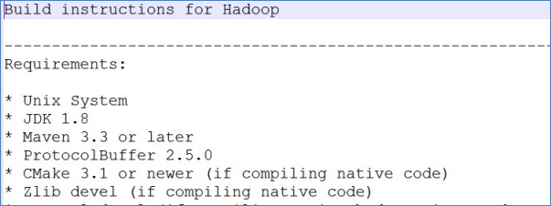

- 安装包、源码包下载地址

https://archive.apache.org/dist/hadoop/common/hadoop-3.3.0/

- 为什么要重新编译Hadoop源码?

匹配不同操作系统本地库环境，Hadoop某些操作比如压缩、IO需要调用系统本地库（*.so|*.dll）修改源码、重构源码 

- 如何编译Hadoop 源码包根目录下文件：BUILDING.txt 详细步骤参考附件资料

# Hadoop 运行模式

1）Hadoop 官方网站：http://hadoop.apache.org/ 

2）Hadoop 运行模式包括：本地模式、伪分布式模式以及完全分布式模式。 

		➢ 本地模式：单机运行，只是用来演示一下官方案例。生产环境不用。
	
		➢ 伪分布式模式：也是单机运行，但是具备 Hadoop 集群的所有功能，一台服务器模 拟一个分布式的环境。个别缺钱的公司用来测试，生产环境不用。

 ➢ 完全分布式模式：多台服务器组成分布式环境。生产环境使用。

# 一、Hadoop编译安装（选做）

- 安装编译相关的依赖

    ```shell
    yum install gcc gcc-c++ make autoconf automake libtool curl lzo-devel zlib-devel openssl openssl-devel ncurses-devel snappy snappy-devel bzip2 bzip2-devel lzo lzo-devel lzop libXtst zlib -y
    
    yum install -y doxygen cyrus-sasl* saslwrapper-devel*
    ```

- 手动安装cmake 

    ```shell
    #yum卸载已安装cmake 版本低
    yum erase cmake
    
    #解压
    tar zxvf CMake-3.19.4.tar.gz
    
    #编译安装
    cd /export/server/CMake-3.19.4
    
    ./configure
    
    make && make install
    
    #验证
    [root@node4 ~]# cmake -version
    cmake version 3.19.4
    
    #如果没有正确显示版本 请断开SSH连接 重写登录
    ```

- 手动安装snappy

    ```shell
    #卸载已经安装的
    
    rm -rf /usr/local/lib/libsnappy*
    rm -rf /lib64/libsnappy*
    
    #上传解压
    tar zxvf snappy-1.1.3.tar.gz 
    
    #编译安装
    cd /export/server/snappy-1.1.3
    ./configure
    make && make install
    
    #验证是否安装
    [root@node4 snappy-1.1.3]# ls -lh /usr/local/lib |grep snappy
    -rw-r--r-- 1 root root 511K Nov  4 17:13 libsnappy.a
    -rwxr-xr-x 1 root root  955 Nov  4 17:13 libsnappy.la
    lrwxrwxrwx 1 root root   18 Nov  4 17:13 libsnappy.so -> libsnappy.so.1.3.0
    lrwxrwxrwx 1 root root   18 Nov  4 17:13 libsnappy.so.1 -> libsnappy.so.1.3.0
    -rwxr-xr-x 1 root root 253K Nov  4 17:13 libsnappy.so.1.3.0
    ```

- 安装配置JDK 1.8

    ```shell
    #解压安装包
    tar zxvf jdk-8u65-linux-x64.tar.gz
    
    #配置环境变量
    vim /etc/profile
    
    export JAVA_HOME=/export/server/jdk1.8.0_241
    export PATH=$PATH:$JAVA_HOME/bin
    export CLASSPATH=.:$JAVA_HOME/lib/dt.jar:$JAVA_HOME/lib/tools.jar
    
    source /etc/profile
    
    #验证是否安装成功
    java -version
    
    java version "1.8.0_241"
    Java(TM) SE Runtime Environment (build 1.8.0_241-b07)
    Java HotSpot(TM) 64-Bit Server VM (build 25.241-b07, mixed mode)
    ```

- 安装配置maven

    ```shell
    #解压安装包
    tar zxvf apache-maven-3.5.4-bin.tar.gz
    
    #配置环境变量
    vim /etc/profile
    
    export MAVEN_HOME=/export/server/apache-maven-3.5.4
    export MAVEN_OPTS="-Xms4096m -Xmx4096m"
    export PATH=:$MAVEN_HOME/bin:$PATH
    
    source /etc/profile
    
    #验证是否安装成功
    [root@node4 ~]# mvn -v
    Apache Maven 3.5.4
    
    #添加maven 阿里云仓库地址 加快国内编译速度
    vim /export/server/apache-maven-3.5.4/conf/settings.xml
    
    <mirrors>
         <mirror>
               <id>alimaven</id>
               <name>aliyun maven</name>
               <url>http://maven.aliyun.com/nexus/content/groups/public/</url>
               <mirrorOf>central</mirrorOf>
          </mirror>
    </mirrors>
    ```

- 安装ProtocolBuffer 3.7.1

    ```shell
    #卸载之前版本的protobuf
    
    #解压
    tar zxvf protobuf-3.7.1.tar.gz
    
    #编译安装
    cd /export/server/protobuf-3.7.1
    ./autogen.sh
    ./configure
    make && make install
    
    #验证是否安装成功
    [root@node4 protobuf-3.7.1]# protoc --version
    libprotoc 3.7.1
    ```

- 编译hadoop

    ```shell
    #上传解压源码包
    tar zxvf hadoop-3.3.0-src.tar.gz
    
    #编译
    cd /root/hadoop-3.3.0-src
    
    mvn clean package -Pdist,native -DskipTests -Dtar -Dbundle.snappy -Dsnappy.lib=/usr/local/lib
    
    #参数说明：
    
    Pdist,native ：把重新编译生成的hadoop动态库；
    DskipTests ：跳过测试
    Dtar ：最后把文件以tar打包
    Dbundle.snappy ：添加snappy压缩支持【默认官网下载的是不支持的】
    Dsnappy.lib=/usr/local/lib ：指snappy在编译机器上安装后的库路径
    ```

- 编译之后的安装包路径

    ```
    /root/hadoop-3.3.0-src/hadoop-dist/target
    ```

# 二、Hadoop集群分布式安装

## **Step1:集群角色规划**

- **角色规划的准则**

根据软件工作特性和服务器硬件资源情况合理分配

比如依赖内存工作的NameNode是不是部署在大内存机器上？

-  **角色规划注意事项**

资源上有抢夺冲突的，尽量不要部署在一起工作上需要互相配合的。尽量部署在一起

 | 主机  | 角色                                          | 角色                 |
 | ----- | --------------------------------------------- | -------------------- |
 | node1 | namenode datanode resourcemanager nodemanager | NN    DN   RM  NM    |
 | node2 | secondarynamenode datanode nodemanager        | SNN  DN           NM |
 | node3 | datanode nodemanager                          | DN          NM       |

## **Step2:服务器基础环境准备**

- 修改主机名，利于识别（3台机器）

    ```
    vim /etc/hostname
    ```

    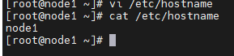

- Hosts映射（3台机器) vim /etc/hosts

    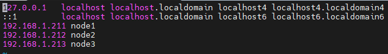

- 防火墙关闭（3台机器)

```
# 防火墙关闭
firewall-cmd --state	#查看防火墙状态
systemctl stop firewalld.service  #停止firewalld服务
systemctl disable firewalld.service  #开机禁用firewalld服务
```

- ssh免密登录（node1执行->node1|node2|node3） 

    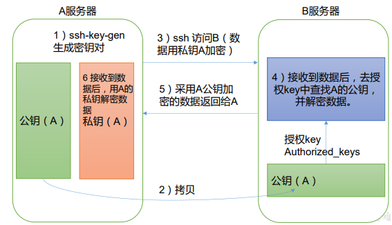

    ```
    # ssh免密登录（只需要配置node1至node1、node2、node3即可）
    
    #node1生成公钥私钥 (一路回车)
    ssh-keygen  
    	
    #node1配置免密登录到node1 node2 node3
    ssh-copy-id node1
    ssh-copy-id node2
    ssh-copy-id node3
    ```

    .ssh 文件夹下（~/.ssh）的文件功能解释

    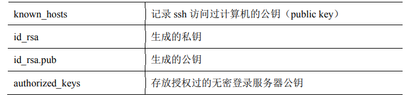

- 集群时间同步（3台机器）

    ```
    yum -y install ntpdate 
    ntpdate ntp4.aliyun.com
    ```

    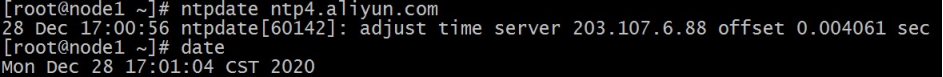

- 创建统一工作目录（3台机器)

    ```
    mkdir -p /export/server/    #软件安装路径 
    mkdir -p /export/data/      #数据存储路径 
    mkdir -p /export/software/  #安装包存放路径
    ```

    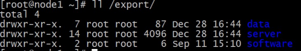

## **Step3:上传安装包、解压安装包**

- JDK 1.8安装（3台机器）

    ```
    # JDK 1.8安装  上传 jdk-8u241-linux-x64.tar.gz到/export/server/目录下
    cd /export/server/
    tar zxvf jdk-8u241-linux-x64.tar.gz
    
    #配置环境变量
    vim /etc/profile
    	
    export JAVA_HOME=/export/server/jdk1.8.0_241
    export PATH=$PATH:$JAVA_HOME/bin
    export CLASSPATH=.:$JAVA_HOME/lib/dt.jar:$JAVA_HOME/lib/tools.jar
    	
    #重新加载环境变量文件
    source /etc/profile
    ```

    

    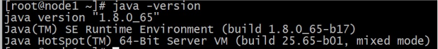

- **上传、解压Hadoop安装包（node1）**

```
#上传安装包到/export/server 解压
cd /export/server
tar zxvf hadoop-3.3.0-Centos7-64.tar.gz
```


## **Step4:Hadoop安装包目录结构**

| bin     | Hadoop最基本的管理脚本和使用脚本的目录，这些脚本是sbin目录下管理脚本的基础实现，用户可以直接使用这些脚本管理和使用Hadoop。 |
| ------- | ------------------------------------------------------------ |
| etc     | Hadoop配置文件所在的目录                                     |
| include | 对外提供的编程库头文件（具体动态库和静态库在lib目录中），这些头文件均是用C++定义的，通常用于C++程序访问HDFS或者编写MapReduce 程序。 |
| lib     | 该目录包含了Hadoop对外提供的编程动态库和静态库，与include目录中的头文件结合使用。 |
| libexec | 各个服务对用的shell配置文件所在的目录，可用于配置日志输出、启动参数（比如JVM参数）等基本信息。 |
| sbin    | Hadoop管理脚本所在的目录，主要包含HDFS和YARN中各类服务的启动/ 关闭脚本。 |
| share   | Hadoop各个模块编译后的jar包所在的目录，官方自带示例。        |

### **配置文件概述**

- 官网文档：[https://hadoop.apache.org/docs/r3.3.0](https://hadoop.apache.org/docs/r3.3.0/)[/](https://hadoop.apache.org/docs/r3.3.0/)

- 第一类1个：hadoop-env.sh

- 第二类4个：xxxx-site.xml ,site表示的是用户定义的配置，会覆盖default中的默认配置。

core-site.xml 核心模块配置 

hdfs-site.xml hdfs文件系统模块配置 

mapred-site.xml MapReduce模块配置

 yarn-site.xml yarn模块配置

- 第三类1个：workers

- 所有的配置文件目录：/export/server/hadoop-3.3.0/etc/hadoop

## Step5:编辑Hadoop配置文件

- **hadoop-env.sh** (配置文件路径 hadoop-3.3.0/etc/hadoop)

    ```
    #文件最后添加
    export JAVA_HOME=/export/server/jdk1.8.0_241
    
    export HDFS_NAMENODE_USER=root
    export HDFS_DATANODE_USER=root
    export HDFS_SECONDARYNAMENODE_USER=root
    export YARN_RESOURCEMANAGER_USER=root
    export YARN_NODEMANAGER_USER=root
    ```

- core-site.xml

    ```
    <!-- 设置默认使用的文件系统 Hadoop支持file、HDFS、GFS、ali|Amazon云等文件系统 -->
    <property>
    	<!-- 指定NameNode的地址 -->
        <name>fs.defaultFS</name>
        <value>hdfs://node1:8020</value>
    </property>
    
       <!-- 指定hadoop数据的存储目录 -->
    <property>
        <name>hadoop.tmp.dir</name>
        <value>/export/data/hadoop-3.3.0</value>
    </property>
    
    <!-- 设置HDFS web UI用户身份 -->
    <property>
        <name>hadoop.http.staticuser.user</name>
        <value>root</value>
    </property>
    
    <!-- 整合hive 用户代理设置 -->
    <property>
        <name>hadoop.proxyuser.root.hosts</name>
        <value>*</value>
    </property>
    
    <property>
        <name>hadoop.proxyuser.root.groups</name>
        <value>*</value>
    </property>
    
    <!-- 文件系统垃圾桶保存时间 -->
    <property>
        <name>fs.trash.interval</name>
        <value>1440</value>
    </property>
    ```

    

- hdfs-site.xml

```
<!-- 设置SNN进程运行机器位置信息 -->
<property>
<!-- nn web端访问地址-->
    <name>dfs.namenode.http-address</name>
    <value>node1:9870</value>
</property>
<!-- 2nn web端访问地址-->
<property>
    <name>dfs.namenode.secondary.http-address</name>
    <value>node2:9868</value>
</property>
```


- mapred-site.xml

    ```
    <!-- 设置MR程序默认运行模式： yarn集群模式 local本地模式 -->
    <property>
      <name>mapreduce.framework.name</name>
      <value>yarn</value>
    </property>
    
    <!-- MR程序历史服务地址 -->
    <property>
      <name>mapreduce.jobhistory.address</name>
      <value>node1:10020</value>
    </property>
     
    <!-- MR程序历史服务器web端地址 -->
    <property>
      <name>mapreduce.jobhistory.webapp.address</name>
      <value>node1:19888</value>
    </property>
    
    <property>
      <name>yarn.app.mapreduce.am.env</name>
      <value>HADOOP_MAPRED_HOME=${HADOOP_HOME}</value>
    </property>
    
    <property>
      <name>mapreduce.map.env</name>
      <value>HADOOP_MAPRED_HOME=${HADOOP_HOME}</value>
    </property>
    
    <property>
      <name>mapreduce.reduce.env</name>
      <value>HADOOP_MAPRED_HOME=${HADOOP_HOME}</value>
    </property>
    ```

    

- yarn-site.xml

    ```
    <!-- 设置YARN集群主角色运行机器位置 -->
    <property>
    	<!-- 指定ResourceManager的地址-->
    	<name>yarn.resourcemanager.hostname</name>
    	<value>node3</value>
    </property>
    
    <property>
    <!-- 指定MR走shuffle -->
        <name>yarn.nodemanager.aux-services</name>
        <value>mapreduce_shuffle</value>
    </property>
    
    <!-- 是否将对容器实施物理内存限制 -->
    <property>
        <name>yarn.nodemanager.pmem-check-enabled</name>
        <value>false</value>
    </property>
    
    <!-- 是否将对容器实施虚拟内存限制。 -->
    <property>
        <name>yarn.nodemanager.vmem-check-enabled</name>
        <value>false</value>
    </property>
    
    <!-- 开启日志聚集 -->
    <property>
      <name>yarn.log-aggregation-enable</name>
      <value>true</value>
    </property>
    
    <!-- 设置yarn历史服务器地址 -->
    <property>
        <name>yarn.log.server.url</name>
        <value>http://node1:19888/jobhistory/logs</value>
    </property>
    
    <!-- 历史日志保存的时间 7天 -->
    <property>
      <name>yarn.log-aggregation.retain-seconds</name>
      <value>604800</value>
    </property>
    ```

- workers

```
node1
node2
node3
```


## **Step6:分发同步安装包**

    cd /export/server
    
    scp -r hadoop-3.3.0 root@node2:$PWD
    scp -r hadoop-3.3.0 root@node3:$PWD

## **Step7:配置Hadoop环境变量**

    cd /export/server
    
    scp -r hadoop-3.3.0 root@node2:$PWD
    scp -r hadoop-3.3.0 root@node3:$PWD

- 将hadoop添加到环境变量（3台机器）

    ```
    vim /etc/profile
    
    export HADOOP_HOME=/export/server/hadoop-3.3.0
    export PATH=$PATH:$HADOOP_HOME/bin:$HADOOP_HOME/sbin
    
    source /etc/profile
    
    
    #别忘了scp给其他两台机器哦
    ```

## **Step8:NameNode format（格式化操作）**

- 首次启动HDFS时，必须对其进行格式化操作。

- format本质上是初始化工作，进行HDFS清理和准备工作

-  命令：

`hdfs namenode -format`

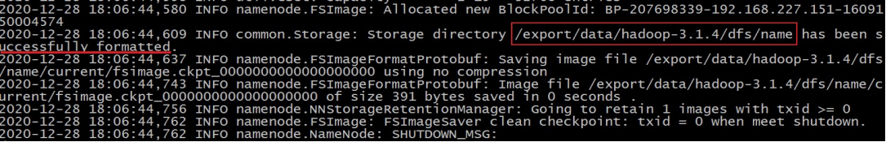

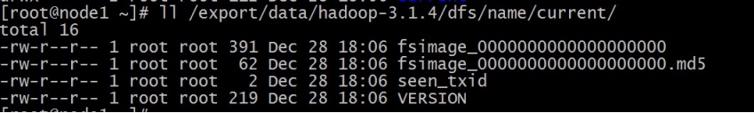

> 1. 首次启动之前需要format操作;
>
> 2. format只能进行一次后续不再需要;
>
> 3. 如果多次format除了造成数据丢失外，还会导致 hdfs集群主从角色之间互不识别。通过删除所有机器hadoop.tmp.dir目录重新format解决

## Step9: Hadoop集群启动

- 每台机器上每次手动启动关闭一个角色进程,可以精准控制每个进程启停，避免群起群停。

-  HDFS集群

    ```
    sbin/start-dfs.sh
    ```
    
    
    
-  <font color='red'>**在配置了 ResourceManager 的节点（node3）**</font>启动 YARN

```
 sbin/start-yarn.sh
```

- Web 端查看 HDFS 的 NameNode

    浏览器中输入：http://node1:9870

- Web 端查看 YARN 的 ResourceManager

    浏览器中输入：http://node3:8088

### **shell脚本一键启停**

- 在node1上，使用软件自带的shell脚本一键启动。前提：配置好机器之间的SSH免密登录和workers文件。

- HDFS集群

```start-dfs.sh stop-dfs.sh ```

-  YARN集群

```start-yarn.sh stop-yarn.sh```

-  Hadoop集群

```start-all.sh stop-all.sh ```

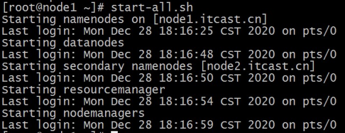

### **进程状态、日志查看**

-  启动完毕之后可以使用jps命令查看进程是否启动成功

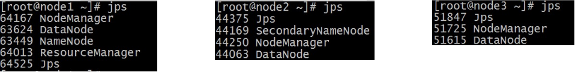

- Hadoop启动日志路径：/export/server/hadoop-3.3.0/logs/

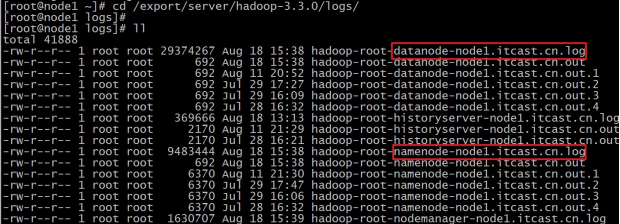

# 三、**HDFS集群**
常用端口：
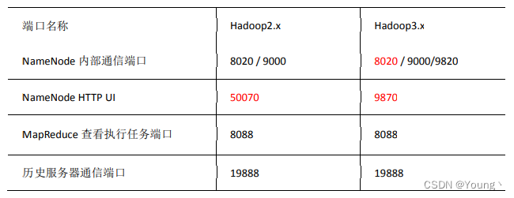


地址：[http://namenode_host:9870 ](http://namenode_host:9870/)其中namenode_host是namenode运行所在机器的主机名或者ip 如果使用主机名访问，别忘了在Windows配置hosts

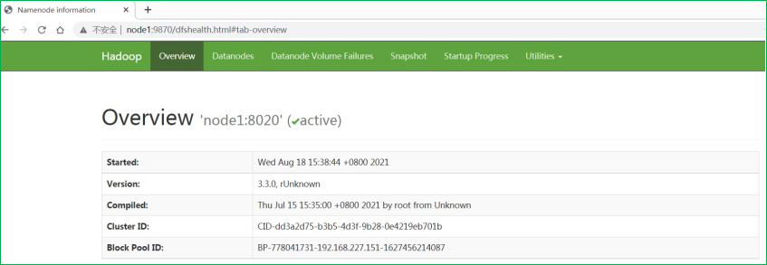

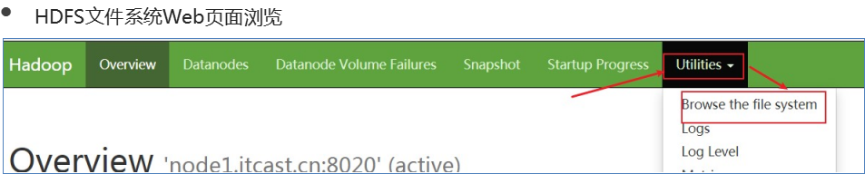

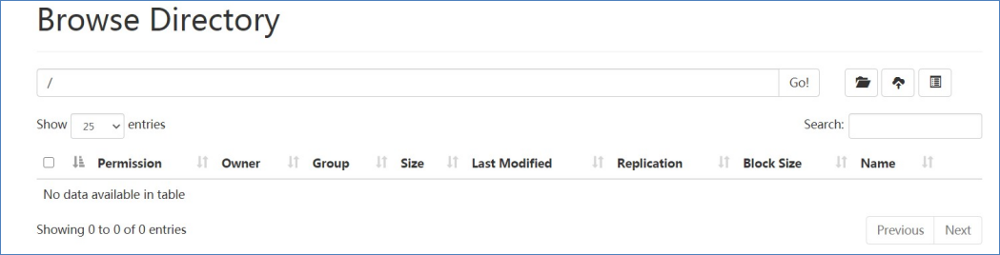

# 四、**YARN集群**

- 地址：[http://resourcemanager_host:8088 ](http://resourcemanager_host:8088/)其中resourcemanager_host是resourcemanager运行所在机器的主机名或者ip

如果使用主机名访问，别忘了在Windows配置hosts

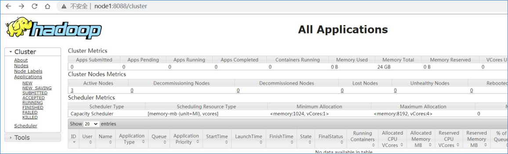


# 五、配置历史服务器

在Yarn中运行的任务产生的日志数据不能查看，为了查看程序的历史运行情况，需要配置一下历史日志 服务器。上面已经配置好了下面只需要启动下

在 hadoop_home/sbin目录下

```
./mr-jobhistory-daemon.sh start historyserver
```

 查看日志，如图所示

http://node1:19888/jobhistory

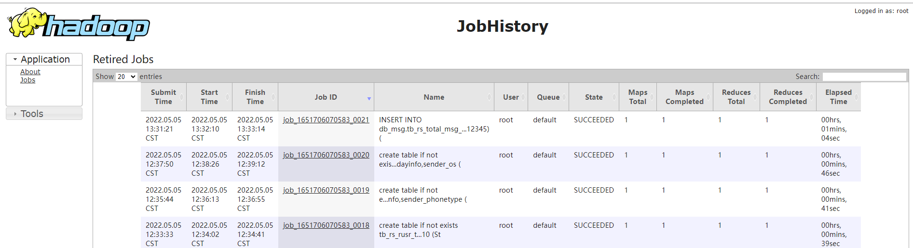

# 六、文件分发小脚本

编写集群分发脚本rsync-scrip

> rsync 远程同步工具

rsync主要用于备份和镜像。具有速度快、避免复制相同内容和支持符号链接的优点。 rsync和scp区别：用rsync做文件的复制要比scp的速度快，rsync只对差异文件做更新。scp是把所有文件都复制过去。

- 基本语法

    ```
    rsync -rvl $pdir/$fname $user@$host:$pdir/$fname
    ```

    命令 选项参数 要拷贝的文件路径/名称 目的用户@主机:目的路径/名称

- 选项参数说明

| 选项 | 功能         |
| ---- | ------------ |
| -r   | 递归         |
| -v   | 显示复制过程 |
| -l   | 拷贝符号连接 |

## 集群分发脚本编写

- 需求：循环复制文件到集群所有节点的相同目录下

     ```
     yum -y install  rsync
     ```

（1）在/usr/local/bin目录下创建文件xsync，文件内容如下：

```
[root@linux121 bin]$ touch xsync
[root@linux121 bin]$ vim xsync
```

在文件中编写shell代码

```
#!/bin/bash

#1. 判断参数个数
if [ $# -lt 1 ]
then
    echo Not Enough Arguement!
    exit;
fi

#2. 遍历集群所有机器
for host in hadoop102 hadoop103 hadoop104
do
    echo ====================  $host  ====================
    #3. 遍历所有目录，挨个发送

    for file in $@
    do
        #4. 判断文件是否存在
        if [ -e $file ]
            then
                #5. 获取父目录
                pdir=$(cd -P $(dirname $file); pwd)

                #6. 获取当前文件的名称
                fname=$(basename $file)
                ssh $host "mkdir -p $pdir"
                rsync -av $pdir/$fname $host:$pdir
            else
                echo $file does not exists!
        fi
    done
done
```

（2）修改脚本 xsync 具有执行权限

```
[root@linux121 bin]$ chmod +x xsync
```

（3）调用脚本形式：xsync 文件名称

```
[root@linux121 bin]$ xsync /home/root/bin
```

 （4） 调用脚本分发Hadoop安装目录到其它节点

```
[root@linux121 bin]$ xsync /opt/servers/hadoop
```

# 七、SSH 无密登录配置

1. 免密登录原理

    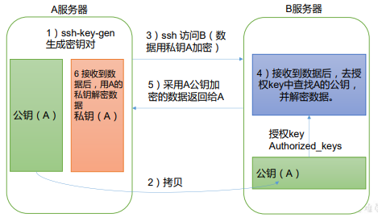

2. 生成公钥和私钥

```
[atguigu@hadoop102 .ssh]$ pwd
/home/atguigu/.ssh
[atguigu@hadoop102 .ssh]$ ssh-keygen -t rsa
```

然后敲（三个回车），就会生成两个文件 id_rsa（私钥）、id_rsa.pub（公钥）

3. 将公钥拷贝到要免密登录的目标机器上

    ```
    [atguigu@hadoop102 .ssh]$ ssh-copy-id hadoop102
    [atguigu@hadoop102 .ssh]$ ssh-copy-id hadoop103
    [atguigu@hadoop102 .ssh]$ ssh-copy-id hadoop104
    ```

    

    


