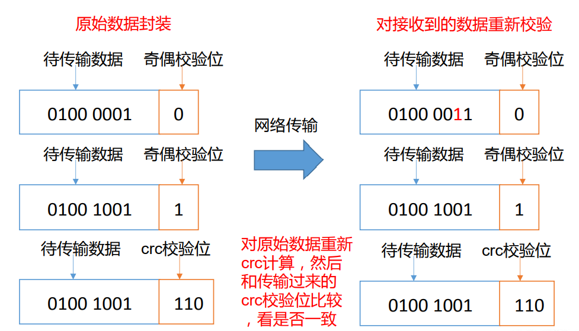

# 1. HDFS 概述

## 1.1 HDFS 产出背景及定义

- #### 1）HDFS 产生背景

随着数据量越来越大，在一个操作系统存不下所有的数据，那么就分配到更多的操作系统管理的磁盘中，但是不方便管理和维护，迫切需要一种系统来管理多台机器上的文件，这就是分布式文件管理系统。HDFS 只是分布式文件管理系统中的一种。

- #### 2）HDFS 定义

HDFS（Hadoop Distributed File System），它是一个文件系统，用于存储文件，通过目录树来定位文件；其次，它是分布式的，由很多服务器联合起来实现其功能，集群中的服务器有各自的角色。 HDFS 的使用场景：适合一次写入，多次读出的场景。一个文件经过创建、写入和关闭之后就不需要改变。

## 1.2 HDFS 优缺点

### DFS 优点

- 1. 高容错性

     ➢ 数据自动保存多个副本。它通过增加副本的形式，提高容错性。

     ➢ 某一个副本丢失以后，它可以自动恢复。

- 2. 适合处理大数据

     ➢ 数据规模：能够处理数据规模达到 GB、TB、甚至 PB 级别的数据；

     ➢ 文件规模：能够处理百万规模以上的文件数量，数量相当之大。

- 3. 可构建在廉价机器上，通过多副本机制，提高可靠性。

### HDFS 缺点

- 1. 不适合低延时数据访问，比如毫秒级的存储数据，是做不到的。

- 2. 无法高效的对大量小文件进行存储。

     ➢ 存储大量小文件的话，**它会占用 NameNode 大量的内存来存储文件目录和块信息**。这样是不可取的，因为 NameNode 的内存总是有限的；

     ➢ **小文件存储的寻址时间会超过读取时间**，它违反了 HDFS 的设计目标。

- 3. 不支持并发写入、文件随机修改。

     ➢ 一个文件只能有一个写，不允许多个线程同时写；

     ➢ 仅支持数据 append（追加），不支持文件的随机修改

## 1.3 HDFS 的重要概念

HDFS 通过统一的命名空间目录树来定位文件； 另外，它是分布式的，由很多服务器联合起来实现其功能，集群中的服务器有各自的角色（分布式本质是拆分，各司其职）

- 典型的 Master/Slave 架构

  HDFS 的架构是典型的 Master/Slave 结构。 HDFS 集群往往是一个 NameNode（HA 架构会有两个 NameNode,联邦机制）+多个 DataNode 组 成； NameNode 是集群的主节点，DataNode 是集群的从节点。

- 分块存储（block 机制）

  HDFS 中的文件在物理上是分块存储（block）的，块的大小可以通过配置参数来规定；默认的 block 大小是 128M；

- 命名空间（NameSpace）

  HDFS 支持传统的层次型文件组织结构。用户或者应用程序可以创建目录，然后将文件保存在这些目录里。文件系统名字空间的层次结构和大多数现有的文件系统类似：用户可以创建、删除、移动或重命名文件。 Namenode 负责维护文件系统的名字空间，任何对文件系统名字空间或属性的修改都将被 Namenode 记录下来。 HDFS 提供给客户单一个抽象目录树，访问形式：hdfs://namenode 的 hostname:port/test/input hdfs://linux121:9000/test/input

- NameNode 元数据管理

  我们把目录结构及文件分块位置信息叫做元数据。 NameNode 的元数据记录每一个文件所对应的 block 信息（block 的 id,以及所在的 DataNode 节点的信息）

- DataNode 数据存储

  文件的各个 block 的具体存储管理由 DataNode 节点承担。一个 block 会有多个 DataNode 来存储，DataNode 会定时向 NameNode 来汇报自己持有的 block 信息。

- 副本机制

  为了容错，文件的所有 block 都会有副本。每个文件的 block 大小和副本系数都是可配置的。应用程序可以指定某个文件的副本数目。副本系数可以在文件创建的时候指定，也可以在之后改变。 副本数量默认是 3 个。

- 一次写入，多次读出

  HDFS 是设计成适应一次写入，多次读出的场景，且不支持文件的随机修改。 （支持追加写入， 不支持随机更新）

正因为如此，HDFS 适合用来做大数据分析的底层存储服务，并不适合用来做网盘等应用（修改不方便，延迟大，网络开销大，成本太高）

## 1.4 HDFS 组成架构

官网介绍 https://hadoop.apache.org/docs/stable/hadoop-project-dist/hadoop-hdfs/HdfsDesign.html

##### 1）NameNode（nn)：

> Hdfs 集群的管理者，就是 Master，它是一个主管、管理者。

（1）管理 HDFS 的名称空间；

（2）配置副本策略；

（3）管理数据块（Block）映射信息；

（4）处理客户端读写请求。

##### 2）DataNode：

就是 Slave。NameNode 下达命令，DataNode 执行实际的操作。

（1）存储实际的数据块；

（2) 执行数据块的读/写操作

##### 3）Client：

> 就是客户端。

（1）文件切分。文件上传 HDFS 的时候，Client 将文件切分成一个一个的 Block，然后进行上传；

（2）与 NameNode 交互，获取文件的位置信息；

（3）与 DataNode 交互，读取或者写入数据；

（4）Client 提供一些命令来管理 HDFS，比如 NameNode 格式化；

（5）Client 可以通过一些命令来访问 HDFS，比如对 HDFS 增删查改操作；

##### 4）Secondary NameNode：

并非 NameNode 的热备。当 NameNode 挂掉的时候，它并不能马上替换 NameNode 并提供服务。

（1）辅助 NameNode，分担其工作量，比如定期合并 Fsimage 和 Edits，并推送给 NameNode ；

（2）在紧急情况下，可辅助恢复 NameNode。

## 1.5 HDFS 文件块大小（面试重点）

HDFS 中的文件在物理上是分块存储（Block），块的大小可以通过配置参数 ( dfs.blocksize）来规定，**默认大小在 Hadoop2.x/3.x 版本中是 128M，1.x 版本中是 64M**


**思考：为什么块的大小不能设置太小，也不能设置太大？**

- （1）HDFS 的块设置太小，会增加寻址时间，程序一直在找块的开始位置；

- （2）如果块设置的太大，从磁盘传输数据的时间会明显大于定位这个块开始位置所需的时间。导致程序在处理这块数据时，会非常慢。

总结：HDFS 块的大小设置主要取决于磁盘传输速率。

> hdfs 中小于 blcok 块大小的文件如何存储：当所存储的文件小于 block 块的大小时，它并不会占用整个 block 块的大小，只会占用它的实际存储大小

# 2. HDFS 的 Shell 操作（开发重点）

## 2.1 基本语法

hadoop fs 具体命令 OR hdfs dfs 具体命令

两个是完全相同的。

## 2.2 命令大全

```
$ bin/hadoop fs
[-appendToFile <localsrc> ... <dst>]
 [-cat [-ignoreCrc] <src> ...]
 [-chgrp [-R] GROUP PATH...]
 [-chmod [-R] <MODE[,MODE]... | OCTALMODE> PATH...]
 [-chown [-R] [OWNER][:[GROUP]] PATH...]
 [-copyFromLocal [-f] [-p] <localsrc> ... <dst>]
 [-copyToLocal [-p] [-ignoreCrc] [-crc] <src> ... <localdst>]
 [-count [-q] <path> ...]
 [-cp [-f] [-p] <src> ... <dst>]
 [-df [-h] [<path> ...]]
 [-du [-s] [-h] <path> ...]
 [-get [-p] [-ignoreCrc] [-crc] <src> ... <localdst>]
 [-getmerge [-nl] <src> <localdst>]
 [-help [cmd ...]]
 [-ls [-d] [-h] [-R] [<path> ...]]
 [-mkdir [-p] <path> ...]
 [-moveFromLocal <localsrc> ... <dst>]
 [-moveToLocal <src> <localdst>]
 [-mv <src> ... <dst>]
 [-put [-f] [-p] <localsrc> ... <dst>]
 [-rm [-f] [-r|-R] [-skipTrash] <src> ...]
 [-rmdir [--ignore-fail-on-non-empty] <dir> ...]
<acl_spec> <path>]]
 [-setrep [-R] [-w] <rep> <path> ...]
 [-stat [format] <path> ...]
 [-tail [-f] <file>]
 [-test -[defsz] <path>]
 [-text [-ignoreCrc] <src> ...]
```

## 2.3 常用命令实操

### 2.3.2 上传

1）-moveFromLocal：从本地剪切粘贴到 HDFS

```
hadoop fs -moveFromLocal ./shuguo.txt /sanguo
```

- `./shuguo.txt` 本地文件
- `/sanguo` HDFS 文件夹

2）-copyFromLocal：从本地文件系统中拷贝文件到 HDFS 路径去

3）-put：等同于 copyFromLocal，生产环境更习惯用 put

4）-appendToFile：追加一个文件到已经存在的文件末尾

### 2.3.3 下载

1）-copyToLocal：从 HDFS 拷贝到本地

```
 hadoop fs -copyToLocal /sanguo/shuguo.txt ./
```

- `/sanguo` HDFS 文件夹

2）-get：等同于 copyToLocal，生产环境更习惯用 get

### 2.3.4 HDFS 直接操作

1）-ls: 显示目录信息

```
$ hadoop fs -ls /sanguo
```

2）-cat：显示文件内容

3）-chgrp、-chmod、-chown：Linux 文件系统中的用法一样，修改文件所属权限

4）-mkdir：创建路径

5）-cp：从 HDFS 的一个路径拷贝到 HDFS 的另一个路径

6）-mv：在 HDFS 目录中移动文件

7）-tail：显示一个文件的末尾 1kb 的数据

8）-rm：删除文件或文件夹

9）-rm -r：递归删除目录及目录里面内容

10）-du 统计文件夹的大小信息

11）-setrep：设置 HDFS 中文件的副本数量


这里设置的副本数只是记录在 NameNode 的元数据中，是否真的会有这么多副本，还得 看 DataNode 的数量。因为目前只有 3 台设备，最多也就 3 个副本，只有节点数的增加到 10 台时，副本数才能达到 10。

# 3. JAVA 客户端

## 3.1 客户端环境准备

- 环境配置

  - 1.  将 hadoop 解压到 window 中,路径不能有中文,不能有空格。

  - 2. 拷贝 hadoop 的 windows 执行环境工具到 bin 路径下,替换客户端工具。

       

  - 3.  配置环境变量

    HADOOP_HOME=hadoop 安装路径
    PATH=hadoop 安装路径/bin

    注意：如果环境变量不起作用，可以重启电脑试试。

    

  - 4.  重启 IDEA 或者 eclipse

  - windows 下需要下载 [winutils](https://github.com/steveloughran/winutils)

  - 验证 Hadoop 环境变量是否正常。双击 winutils.exe，如果报如下错误。说明缺少微软运行库（正版系统往往有这个问题）。再资料包里面有对应的微软运行库安装包双击安装即可。

    

- Hadoop 项目 maven 依赖

  ```
   <dependencies>
          <dependency>
              <groupId>org.apache.hadoop</groupId>
              <artifactId>hadoop-client</artifactId>
              <version>3.1.3</version>
          </dependency>
          <dependency>
              <groupId>junit</groupId>
              <artifactId>junit</artifactId>
              <version>4.12</version>
          </dependency>
          <dependency>
              <groupId>org.slf4j</groupId>
              <artifactId>slf4j-log4j12</artifactId>
              <version>1.7.30</version>
          </dependency>
      </dependencies>
  ```

- 在项目的 src/main/resources 目录下，新建一个文件，命名为“log4j.properties”，在文件中填入

  ```
  log4j.rootLogger=INFO, stdout
  log4j.appender.stdout=org.apache.log4j.ConsoleAppender
  log4j.appender.stdout.layout=org.apache.log4j.PatternLayout
  log4j.appender.stdout.layout.ConversionPattern=%d %p [%c] - %m%n
  log4j.appender.logfile=org.apache.log4j.FileAppender
  log4j.appender.logfile.File=target/spring.log
  log4j.appender.logfile.layout=org.apache.log4j.PatternLayout
  log4j.appender.logfile.layout.ConversionPattern=%d %p [%c] - %m%n
  ```

- 实例代码

```
          System.setProperty("HADOOP_USER_NAME","root");
          Configuration conf = new Configuration();


          conf.set("fs.defaultFS","hdfs://192.168.244.100:8020");

          conf.set("dfs.client.use.datanode.hostname", "true");
          FileSystem fs = FileSystem.get(conf);


          //创建目录
          Boolean flag = fs.mkdirs(new Path("/root/data"));
          System.out.println(flag);

          //判断文件是否存在
          Boolean isExists = fs.exists(new Path("/root/data/student2.txt"));
          System.out.println(isExists);
          if(isExists == false){
              fs.create(new Path("/root/data/student2.txt"));
          }


          //查看文件信息
          FileStatus fileStatus = fs.getFileStatus(new Path("/root/data/student2.txt"));
          System.out.println(fileStatus.toString());

          //下载文件
          if(isExists == false){
              fs.copyToLocalFile(new Path("/root/data/"),new Path("D:\\linuxvmware\\hadooptest2\\src\\main\\resources\\"));
          }


          //上传文件

          String srcFilePath = "C:\\Users\\86132\\Desktop\\0715.txt";
          String remoteFilePath = "/root/data/";
          fs.copyFromLocalFile(new Path(srcFilePath),new Path(remoteFilePath));

          //删除文件
          //fs.delete(new Path("/root/data/"),true);


          //查看文件列表
          RemoteIterator<LocatedFileStatus> fileList = fs.listFiles(new Path("/root/data/"), true);
          while (fileList.hasNext()){
              System.out.println(fileList.next().toString());
          }
```

# 4.1 HDFS 写数据流程

### 4.1.1 剖析文件写入


（1）客户端通过 Distributed FileSystem 模块向 NameNode 请求上传文件，NameNode 检查目标文件是否已存在，父目录是否存在。

（2）NameNode 返回是否可以上传。

（3）客户端请求第一个 Block 上传到哪几个 DataNode 服务器上。

（4）NameNode 返回 3 个 DataNode 节点，分别为 dn1、dn2、dn3。

（5）客户端通过 FSDataOutputStream 模块请求 dn1 上传数据，dn1 收到请求会继续调用 dn2，然后 dn2 调用 dn3，将这个通信管道建立完成。

（6）dn1、dn2、dn3 逐级应答客户端。

（7）客户端开始往 dn1 上传第一个 Block（先从磁盘读取数据放到一个本地内存缓存）， 以 Packet 为单位，dn1 收到一个 Packet 就会传给 dn2，dn2 传给 dn3；dn1 每传一个 packet 会放入一个应答队列等待应答。  
（8）当一个 Block 传输完成之后，客户端再次请求 NameNode 上传第二个 Block 的服务器。（重复执行 3-7 步）。

### 4.1.2 网络拓扑-节点距离计算

在 HDFS 写数据的过程中，NameNode 会选择距离待上传数据最近距离的 DataNode 接收数据。那么这个最近距离怎么计算呢？

**节点距离：两个节点到达最近的共同祖先的距离总和。**

例如，假设有数据中心 d1 机架 r1 中的节点 n1。该节点可以表示为/d1/r1/n1。利用这种 标记，这里给出四种距离描述。 大家算一算每两个节点之间的距离。

### 4.1.3 机架感知（副本存储节点选择）

1）机架感知说明

（1）官方说明 http://hadoop.apache.org/docs/r3.1.3/hadoop-project-dist/hadoop-hdfs/HdfsDesign.html#Data_Replication

（2）源码说明 Crtl + n 查找 BlockPlacementPolicyDefault，在该类中查找 chooseTargetInOrder 方法。

2）Hadoop3.1.3 副本节点选择


第一个副本在 Client 所处的节点上。 如果客户端在集群外，随机选一个。

第二个副本在另一个机架的随机 一个节点

第三个副本在第二个副本所在机架的随机节点

## 4.2 HDFS 读数据流程


（1）客户端通过 Distributed FileSystem 向 NameNode 请求下载文件，NameNode 通过查询元数据，找到文件块所在的 DataNode 地址。

（2）挑选一台 DataNode（就近原则，然后随机）服务器，请求读取数据。

（3）DataNode 开始传输数据给客户端（从磁盘里面读取数据输入流，以 Packet 为单位来做校验）。

（4）客户端以 Packet 为单位接收，先在本地缓存，然后写入目标文件。各个分片串行读取。

# 5 NameNode 和 SecondaryNameNode

## 5.1 NN 和 2NN 工作机制

> 思考：NameNode 中的元数据是存储在哪里的？

首先，我们做个假设，如果存储在 NameNode 节点的磁盘中，因为经常需要进行随机访问，还有响应客户请求，必然是效率过低。因此，元数据需要存放在内存中。但如果只存在内存中，一旦断电，元数据丢失，整个集群就无法工作了。因此产生在磁盘中备份元数据的 FsImage。

这样又会带来新的问题，当在内存中的元数据更新时，如果同时更新 FsImage，就会导致效率过低，但如果不更新，就会发生一致性问题，一旦 NameNode 节点断电，就会产生数据丢失。因此，引入 Edits 文件（只进行追加操作，效率很高）。每当元数据有更新或者添加元数据时，修改内存中的元数据并追加到 Edits 中。这样，一旦 NameNode 节点断电，可以通过 **FsImage** 和 **Edits** 的合并，合成元数据。 但是，如果长时间添加数据到 Edits 中，会导致该文件数据过大，效率降低，而且一旦断电，恢复元数据需要的时间过长。因此，<mark>需要定期进行 FsImage 和 Edits 的合并</mark>，如果这个操作由 NameNode 节点完成，又会效率过低。因此，引入一个新的节点**SecondaryNamenode**， 专门用于 FsImage 和 Edits 的合并。

#### NameNode 工作机制


- 第一阶段：NameNode 启动

（1）第一次启动 NameNode 格式化后，创建 **Fsimage** 和 **Edits** 文件。如果不是第一次启动，直接加载编辑日志和镜像文件到内存

（2）客户端对元数据进行增删改的请求。

（3）NameNode 记录操作日志，更新滚动日志。

（4）NameNode 在内存中对元数据进行增删改

- 第二阶段：Secondary NameNode 工作

（1）Secondary NameNode 询问 NameNode 是否需要 CheckPoint。直接带回 NameNode 是否检查结果

（2）Secondary NameNode 请求执行 CheckPoint。

（3）NameNode 滚动正在写的 Edits 日志。写入一个新的文件

（4）将滚动前的编辑日志（老的文件）和镜像文件拷贝到 Secondary NameNode。

（5）Secondary NameNode 加载编辑日志和镜像文件到内存，并合并。

（6）生成新的镜像文件 fsimage.chkpoint。

（7）拷贝 fsimage.chkpoint 到 NameNode。

（8）NameNode 将 fsimage.chkpoint 重新命名成 fsimage。

## 5.2 Fsimage 和 Edits 解析

NameNode 被格式化之后，将在/opt/module/hadoop-3.1.3/data/tmp/dfs/name/current 目录中产生如下文件


（1）Fsimage 文件：HDFS 文件系统元数据的一个永久性的检查点，其中包含 HDFS 文件系统的所有目录和文件相关信息（Block 数量，副本数量，权限等信息）

（2）Edits 文件：存放 HDFS 文件系统的所有更新操作的路径，文件系统客户端执行的所有写操作首先会被记录到 Edits 文件中。

（3）seen_txid: 文件保存的是一个数字，就是最后一个 edits\*的数字 （edits 最大编号）

（4）VERSION：该文件记录 namenode 的一些版本号信息，比如：CusterId,namespaceID 等

（5）每次 NameNode 启动的时候都会将 Fsimage 文件读入内存，加载 Edits 里面的更新操作，保证内存中的元数据信息是最新的、同步的，可以看成 NameNode 启动的时候就将 Fsimage 和 Edits 文件进行了合并。


## 5.3 oiv 查看 Fsimage 文件

官方地址：[[Apache Hadoop 3.1.3 – Offline Image Viewer Guide](https://hadoop.apache.org/docs/r3.1.3/hadoop-project-dist/hadoop-hdfs/HdfsImageViewer.html)]()

（1）查看 oiv 和 oev 命令

（2）基本语法 hdfs oiv -p 文件类型 -i 镜像文件 -o 转换后文件输出路径

（3）案例实操

```
[atguigu@hadoop102 current]$ pwd
/opt/module/hadoop-3.1.3/data/dfs/name/current
[atguigu@hadoop102 current]$ hdfs oiv -p XML -i
fsimage_0000000000000000025 -o /opt/module/hadoop-3.1.3/fsimage.xml
[atguigu@hadoop102 current]$ cat /opt/module/hadoop-3.1.3/fsimage.xml
```

将显示的 xml 文件内容拷贝到 Idea 中创建的 xml 文件中，并格式化。部分显示结果如 下。

```
<inode>
    <id>16386</id>
    <type>DIRECTORY</type>
    <name>user</name>
    <mtime>1512722284477</mtime>
    <permission>atguigu:supergroup:rwxr-xr-x</permission>
    <nsquota>-1</nsquota>
    <dsquota>-1</dsquota>
</inode>
<inode>
    <id>16387</id>
    <type>DIRECTORY</type>
    <name>atguigu</name>
    <mtime>1512790549080</mtime>
    <permission>atguigu:supergroup:rwxr-xr-x</permission>
    <nsquota>-1</nsquota>
    <dsquota>-1</dsquota>
</inode>
<inode>
    <id>16389</id>
    <type>FILE</type>
    <name>wc.input</name>
    <replication>3</replication>
    <mtime>1512722322219</mtime>
    <atime>1512722321610</atime>
    <perferredBlockSize>134217728</perferredBlockSize>
    <permission>atguigu:supergroup:rw-r--r--</permission>
    <blocks>
        <block>
            <id>1073741825</id>
            <genstamp>1001</genstamp>
            <numBytes>59</numBytes>
        </block>
    </blocks>
</inode >
```

#### 思考：可以看出，Fsimage 中没有记录块所对应 DataNode，为什么？

> 在集群启动后，要求 **DataNode 上报数据块信息，并间隔一段时间后再次上报。**

在内存元数据中是有记录块所对应的 dn 信息，但是 fsimage 中就剔除了这个信息；HDFS 集群在启动的时候会加载 image 以及 edits 文件，block 对应的 dn 信息都没有记录，集群启动时会有一个**安全模式 （safemode）**,安全模式就是为了让 dn 汇报自己当前所持有的 block 信息给 nn 来补全元数据。后续每隔 一段时间 dn 都要汇报自己持有的 block 信息。

2）oev 查看 Edits 文件

（1）基本语法

`hdfs oev -p 文件类型 -i 编辑日志 -o 转换后文件输出路径 `

（2）案例实操

```
[atguigu@hadoop102 current]$ hdfs oev -p XML -i
edits_0000000000000000012-0000000000000000013 -o /opt/module/hadoop3.1.3/edits.xml
[atguigu@hadoop102 current]$ cat /opt/module/hadoop-3.1.3/edits.xml
```

将显示的 xml 文件内容拷贝到 Idea 中创建的 xml 文件中，并格式化。显示结果如下。

```
<?xml version="1.0" encoding="UTF-8"?>
<EDITS>
    <EDITS_VERSION>-63</EDITS_VERSION>
    <RECORD>
        <OPCODE>OP_START_LOG_SEGMENT</OPCODE>
        <DATA>
            <TXID>129</TXID>
        </DATA>
    </RECORD>
    <RECORD>
        <OPCODE>OP_ADD</OPCODE>
        <DATA>
            <TXID>130</TXID>
            <LENGTH>0</LENGTH>
            <INODEID>16407</INODEID>
            <PATH>/hello7.txt</PATH>
            <REPLICATION>2</REPLICATION>
            <MTIME>1512943607866</MTIME>
            <ATIME>1512943607866</ATIME>
            <BLOCKSIZE>134217728</BLOCKSIZE>
            <CLIENT_NAME>DFSClient_NONMAPREDUCE_-
1544295051_1</CLIENT_NAME>
            <CLIENT_MACHINE>192.168.10.102</CLIENT_MACHINE>
            <OVERWRITE>true</OVERWRITE>
            <PERMISSION_STATUS>
                <USERNAME>atguigu</USERNAME>
                <GROUPNAME>supergroup</GROUPNAME>
                <MODE>420</MODE>
            </PERMISSION_STATUS>
            <RPC_CLIENTID>908eafd4-9aec-4288-96f1-
e8011d181561</RPC_CLIENTID>
            <RPC_CALLID>0</RPC_CALLID>
        </DATA>
    </RECORD>
    <RECORD>
        <OPCODE>OP_ALLOCATE_BLOCK_ID</OPCODE>
        <DATA>
            <TXID>131</TXID>
            <BLOCK_ID>1073741839</BLOCK_ID>
        </DATA>
    </RECORD>
    <RECORD>
        <OPCODE>OP_SET_GENSTAMP_V2</OPCODE>
        <DATA>
            <TXID>132</TXID>
            <GENSTAMPV2>1016</GENSTAMPV2>
        </DATA>
    </RECORD>
    <RECORD>
        <OPCODE>OP_ADD_BLOCK</OPCODE>
        <DATA>
            <TXID>133</TXID>
            <PATH>/hello7.txt</PATH>
            <BLOCK>
                <BLOCK_ID>1073741839</BLOCK_ID>
                <NUM_BYTES>0</NUM_BYTES>
                <GENSTAMP>1016</GENSTAMP>
            </BLOCK>
            <RPC_CLIENTID></RPC_CLIENTID>
            <RPC_CALLID>-2</RPC_CALLID>
        </DATA>
    </RECORD>
    <RECORD>
        <OPCODE>OP_CLOSE</OPCODE>
        <DATA>
            <TXID>134</TXID>
            <LENGTH>0</LENGTH>
            <INODEID>0</INODEID>
            <PATH>/hello7.txt</PATH>
            <REPLICATION>2</REPLICATION>
            <MTIME>1512943608761</MTIME>
            <ATIME>1512943607866</ATIME>
            <BLOCKSIZE>134217728</BLOCKSIZE>
            <CLIENT_NAME></CLIENT_NAME>
            <CLIENT_MACHINE></CLIENT_MACHINE>
            <OVERWRITE>false</OVERWRITE>
            <BLOCK>
                <BLOCK_ID>1073741839</BLOCK_ID>
                <NUM_BYTES>25</NUM_BYTES>
                <GENSTAMP>1016</GENSTAMP>
            </BLOCK>
            <PERMISSION_STATUS>
                <USERNAME>atguigu</USERNAME>
                <GROUPNAME>supergroup</GROUPNAME>
                <MODE>420</MODE>
            </PERMISSION_STATUS>
        </DATA>
    </RECORD>
</EDITS >
```

#### 思考：NameNode 如何确定下次开机启动的时候合并哪些 Edits？


> <mark>最新的 fsimages（355） 比他小的就是合并过了，只会合并比他大的 edits 文件</mark>

## 5.4 CheckPoint 时间设置

1）通常情况下，SecondaryNameNode 每隔一小时执行一次。

[hdfs-default.xml]

```
<property>
 <name>dfs.namenode.checkpoint.period</name>
 <value>3600s</value>
</property>
```

2）一分钟检查一次操作次数，当操作次数达到 1 百万时，SecondaryNameNode 执行一次。

```
<property>
 <name>dfs.namenode.checkpoint.txns</name>
 <value>1000000</value>
<description>操作动作次数</description>
</property>
<property>
 <name>dfs.namenode.checkpoint.check.period</name>
 <value>60s</value>
<description> 1 分钟检查一次操作次数</description>
</property>
```

# 6. NN 故障处理

NameNode 故障后，HDFS 集群就无法正常工作，因为 HDFS 文件系统的元数据需要由 NameNode 来管理维护并与 Client 交互，如果元数据出现损坏和丢失同样会导致 NameNode 无法正常工作进而 HDFS 文件系统无法正常对外提供服务。

如果元数据出现丢失损坏如何恢复呢？

- 将 2NN 的元数据拷贝到 NN 的节点下

  此种方式会存在元数据部分丢失

- 搭建 HDFS 的 HA（高可用）集群，解决 NN 的单点故障问题！！（借助 Zookeeper 实现 HA，一个 Active 的 NameNode,一个是 Standby 的 NameNode）

# 7. Hadoop 的限额与归档以及集群安全模式

**高级命令**

## 7.1 HDFS 文件限额配置

HDFS 文件的限额配置允许我们以文件大小或者文件个数来限制我们在某个目录下上传的文件数量 或者文件内容总量，以便达到我们类似百度网盘网盘等限制每个用户允许上传的最大的文件的量

### 7.1.1 数量限限额

```
hdfs dfs -mkdir -p /user/root/hdfs #创建hdfs文件夹
hdfs dfsadmin -setQuota 2 /user/root/hdfs # 给该文件夹下面设置最多上传两个文件，上传文件，发现只能上传两个文件
hdfs dfsadmin -clrQuota /user/root/hdfs # 清除文件数量限制
```

### 7.1.2 空间大小限额

```
hdfs dfsadmin -setSpaceQuota 4k /user/root/hdfs # 限制空间大小4KB
#上传超过4Kb的文件大小上去提示文件超过限额
hdfs dfs -put /export/softwares/xxx.tar.gz /user/root/hdfs
hdfs dfsadmin -clrSpaceQuota /user/root/hdfs #清除空间限额
#查看hdfs文件限额数量
hdfs dfs -count -q -h /user/root/hdfs
```

## 7.2 HDFS 的安全模式

安全模式是 HDFS 所处的一种特殊状态，在这种状态下，**文件系统只接受读数据请求，而不接受删除、修改等变更请求**。 在 NameNode 主节点启动时，HDFS 首先进入安全模式，**DataNode 在启动的时候会向 NameNode 汇报可用的 block 等状态**，当整个系统达到安全标准时，HDFS 自动离开安全模式。如果 HDFS 出于安全模式下，则文件 block 不能进行任何的副本复制操作，因此达到最小的副本数量要求是基于 DataNode 启动时的状态来判定的，启动时不会再做任何复制（从而达到最小副本数量要求），HDFS 集群刚启动的时候，默认 30S 钟的时间是出于安全期的，只有过了 30S 之后，集群脱离了安全期，然后才可以对集群进行操作。

```
hdfs dfsadmin -safemode
```

## 7.3 Hadoop 归档技术

主要解决 HDFS 集群存在大量小文件的问题！！

由于**大量小文件会占用 NameNode 的内存**，因此对于 HDFS 来说存储大量小文件造成 NameNode 内存资源的浪费！ Hadoop 存档文件 HAR 文件，是一个更高效的文件存档工具，HAR 文件是由一组文件通过 archive 工具创建而来，在减少了 NameNode 的内存使用的同时，可以对文件进行透明的访问，通俗来说就是 **HAR 文件对** NameNode 来说是一个文件减少了内存的浪费，对于实际操作处理文件依然是一个一个独立的文件。


### 7.3.1 案例

#### 启动 YARN 集群

```
 start-yarn.sh
```

#### 归档文件

把/user/input 目录里面的所有文件归档成一个叫 input.har 的归档文件，并把归档后文件存储到/user/output 路径下。

```
$ bin/hadoop archive -archiveName input.har –p /user/root/input /user/root/output
```

#### 查看归档

```
$ hadoop fs -lsr /user/root/output/input.har
$ hadoop fs -lsr
har:///user/root/output/input.har
```

#### 解归档文件

```
$ hadoop fs -cp har:/// user/root/output/input.har/*
/user/root
```

# 8 DataNode

## 8.1 DataNode 工作机制


（1）一个数据块在 DataNode 上以文件形式存储在磁盘上，包括两个文件，一个是数据本身，一个是元数据包括数据块的长度，块数据的校验和，以及时间戳。

（2）DataNode 启动后向 NameNode 注册，通过后，周期性（6 小时）的向 NameNode 上报所有的块信息。

DN 向 NN 汇报当前解读信息的时间间隔，默认 6 小时；

```
<property>
	<name>dfs.blockreport.intervalMsec</name>
	<value>21600000</value>
	<description>Determines block reporting interval in
milliseconds.</description>
</property>
```

DN 扫描自己节点块信息列表的时间，默认 6 小时

```
<property>
	<name>dfs.datanode.directoryscan.interval</name>
	<value>21600s</value>
	<description>Interval in seconds for Datanode to scan data
	directories and reconcile the difference between blocks in memory and on
	the disk.
	Support multiple time unit suffix(case insensitive), as described
	in dfs.heartbeat.interval.
	</description>
</property>
```

（3）心跳是每 3 秒一次，心跳返回结果带有 NameNode 给该 DataNode 的命令如复制块数据到另一台机器，或删除某个数据块。如果超过 10 分钟没有收到某个 DataNode 的心跳， 则认为该节点不可用。

（4）集群运行中可以安全加入和退出一些机器。

## 8.2 数据完整性

思考：如果电脑磁盘里面存储的数据是控制高铁信号灯的红灯信号（1）和绿灯信号（0）， 但是存储该数据的磁盘坏了，一直显示是绿灯，是否很危险？同理 DataNode 节点上的数据损坏了，却没有发现，是否也很危险，那么如何解决呢？

如下是 DataNode 节点保证数据完整性的方法。

（1）当 DataNode 读取 Block 的时候，它会计算 CheckSum。

（2）如果计算后的 CheckSum，与 Block 创建时值不一样，说明 Block 已经损坏。

（3）Client 读取其他 DataNode 上的 Block。

（4）常见的校验算法 crc（32），md5（128），sha1（160）

（5）DataNode 在其文件创建后周期验证 CheckSum。



## 8.3 掉线时限参数设置


需要注意的是 hdfs-site.xml 配置文件中的 heartbeat.recheck.interval 的单位为毫秒， dfs.heartbeat.interval 的单位为秒。

```
<property>
 <name>dfs.namenode.heartbeat.recheck-interval</name>
 <value>300000</value>
</property>
<property>
 <name>dfs.heartbeat.interval</name>
 <value>3</value>
</property>
```
