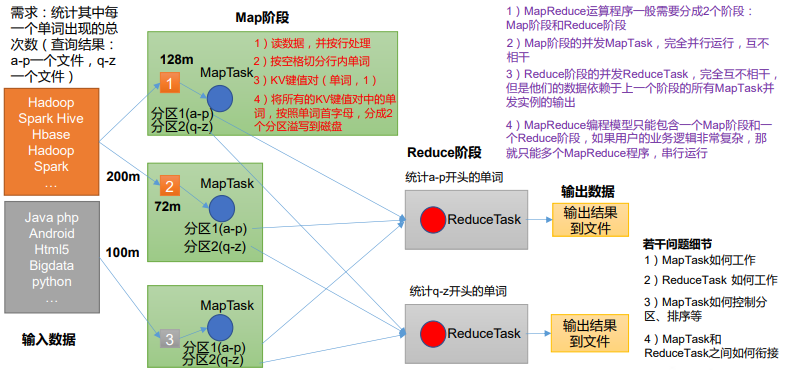
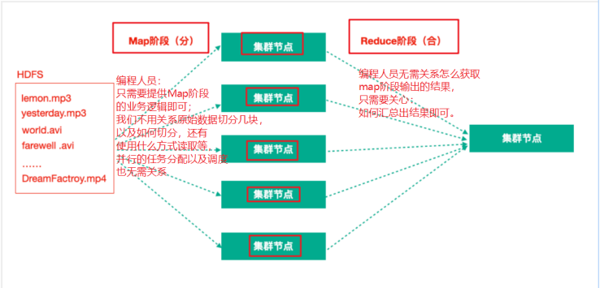
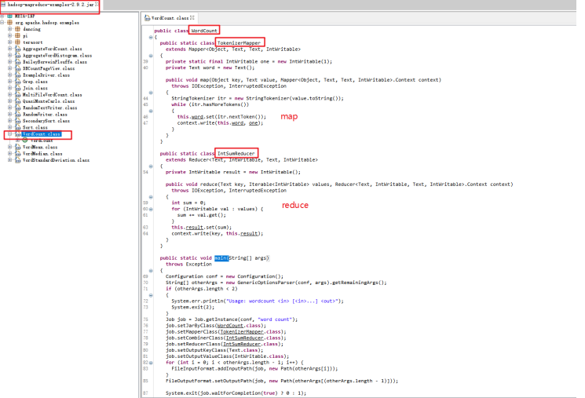
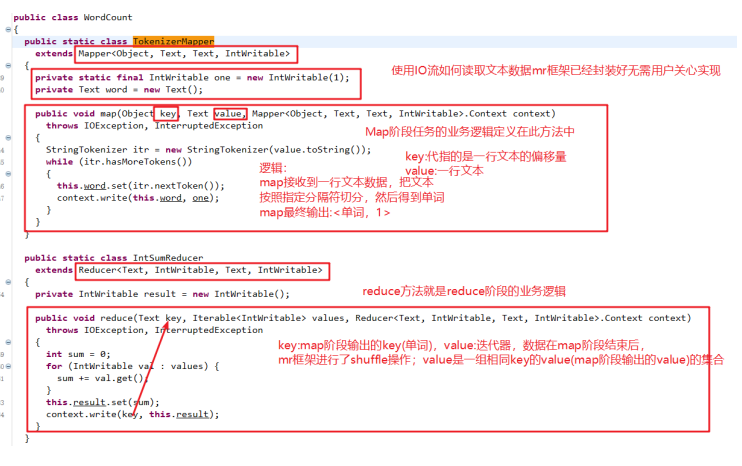
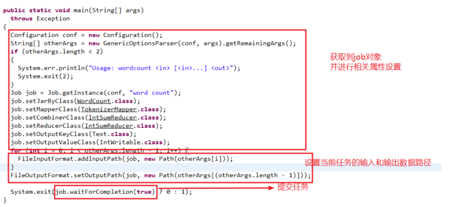
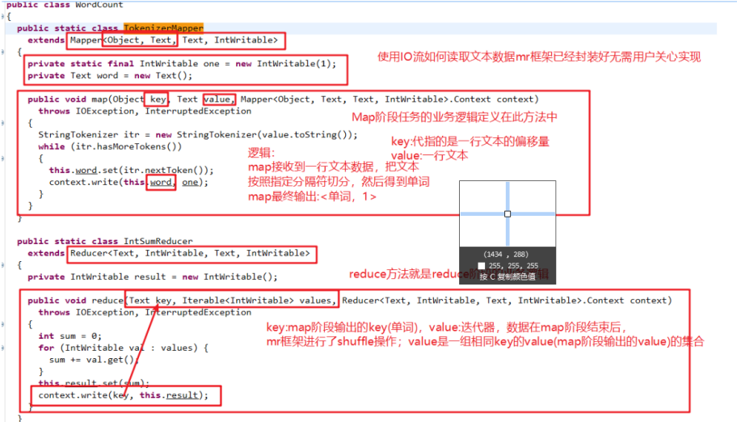

# 1. MapReduce 概述

## 1.1 MapReduce 定义

MapReduce 是一个**分布式运算程序**的编程框架，是用户开发“基于 Hadoop 的数据分析应用”的核心框架。 

MapReduce 核心功能是将用户编写的业务逻辑代码和自带默认组件整合成一个完整的分布式运算程序，并发运行在一个 Hadoop 集群上。

## 1.2 MapReduce 优缺点

### 1.2.1 优点 

1）MapReduce 易于编程 

**它简单的实现一些接口，就可以完成一个分布式程序**，这个分布式程序可以分布到大量 廉价的 PC 机器上运行。也就是说你写一个分布式程序，跟写一个简单的串行程序是一模一样的。就是因为这个特点使得 MapReduce 编程变得非常流行。

 2）良好的扩展性 

当你的计算资源不能得到满足的时候，你可以通过**简单的增加机器**来扩展它的计算能力。 

3）高容错性 

MapReduce 设计的初衷就是使程序能够部署在廉价的 PC 机器上，这就要求它具有很高 的容错性。比如**其中一台机器挂了，它可以把上面的计算任务转移到另外一个节点上运行， 不至于这个任务运行失败，**而且这个过程不需要人工参与，而完全是由 Hadoop 内部完成的。

4）适合 PB 级以上海量数据的离线处理 

可以实现上千台服务器集群并发工作，提供数据处理能力。

### 1.2.2 缺点

1）不擅长实时计算

MapReduce 无法像 MySQL 一样，在毫秒或者秒级内返回结果。

2）不擅长流式计算

流式计算的输入数据是动态的，而 MapReduce 的**输入数据集是静态**的，不能动态变化。 这是因为 MapReduce 自身的设计特点决定了数据源必须是静态的。

3）不擅长 DAG（有向无环图）计算

多个应用程序存在依赖关系，后一个应用程序的输入为前一个的输出。在这种情况下， MapReduce 并不是不能做，而是使用后，每个 MapReduce 作业的输出结果都会写入到磁盘， 会造成大量的磁盘 IO，导致性能非常的低下。

## 1.3 MapReduce 核心思想




（1）分布式的运算程序往往需要分成至少 2 个阶段。 

（2）第一个阶段的 MapTask 并发实例，完全并行运行，互不相干。 （3）第二个阶段的 ReduceTask 并发实例互不相干，但是他们的数据依赖于上一个阶段的所有 MapTask 并发实例的输出。 

（4）MapReduce 编程模型只能包含一个 Map 阶段和一个 Reduce 阶段，如果用户的业 务逻辑非常复杂，那就只能多个 MapReduce 程序，串行运行。

 总结：分析 WordCount   数据流走向深入理解 MapReduce 核心思想。

## 1.4 MapReduce 进程

一个完整的 MapReduce 程序在分布式运行时有三类实例进程：

（1）MrAppMaster：负责整个程序的过程调度及状态协调。

（2）MapTask：负责 Map 阶段的整个数据处理流程。

（3）ReduceTask：负责 Reduce 阶段的整个数据处理流程。

## 1.5 官方 WordCount 源码

采用反编译工具反编译源码，发现 WordCount 案例有 Map 类、Reduce 类和驱动类。且 数据的类型是 Hadoop 自身封装的序列化类型。

## 1.6 常用数据序列化类型

| Java基本类型 | Hadoop Writable类型 |
| ------------ | ------------------- |
| boolean      | BooleanWritable     |
| byte         | ByteWritable        |
| int          | IntWritable         |
| float        | FloatWritable       |
| long         | LongWritable        |
| double       | DoubleWritable      |
| String       | Text                |
| map          | MapWritable         |
| array        | ArrayWritable       |

## 1.7 MapReduce 编程规范

用户编写的程序分成三个部分：Mapper、Reducer 和 Driver。

1．Mapper阶段

（1）用户自定义的Mapper要继承自己的父类 

（2）Mapper的输入数据是KV对的形式（KV的类型可自定义） 

（3）Mapper中的业务逻辑写在map()方法中 

（4）Mapper的输出数据是KV对的形式（KV的类型可自定义） 

（5）**map()方法（MapTask进程）对每一个调用一次**

2．Reducer阶段

（1）用户自定义的Reducer要继承自己的父类 

（2）Reducer的输入数据类型对应Mapper的输出数据类型，也是KV （3）Reducer的业务逻辑写在reduce()方法中 

（4）**ReduceTask进程对每一组相同k的组调用一次reduce()方法**

3．Driver阶段

相当于YARN集群的客户端，用于提交我们整个程序到YARN集群，提交的是封装了MapReduce程序相关运行参数的job对象

## 1.8 WordCount 案例实操

### 1.8.1 本地测试

1）需求 

在给定的文本文件中统计输出每一个单词出现的总次数

2）需求分析 

按照 MapReduce 编程规范，分别编写 Mapper，Reducer，Driver。

3）环境准备

（1）创建 maven 工程，MapReduceDemo

（2）在 pom.xml 文件中添加如下依赖

```
  <dependencies>
        <dependency>
            <groupId>org.apache.hadoop</groupId>
            <artifactId>hadoop-client</artifactId>
            <version>3.1.3</version>
        </dependency>
        <dependency>
            <groupId>junit</groupId>
            <artifactId>junit</artifactId>
            <version>4.12</version>
        </dependency>
        <dependency>
            <groupId>org.slf4j</groupId>
            <artifactId>slf4j-log4j12</artifactId>
            <version>1.7.30</version>
        </dependency>
    </dependencies>
```

（2）在项目的 src/main/resources 目录下，新建一个文件，命名为“log4j.properties”，在 文件中填入。

```
log4j.rootLogger=INFO, stdout 
log4j.appender.stdout=org.apache.log4j.ConsoleAppender 
log4j.appender.stdout.layout=org.apache.log4j.PatternLayout 
log4j.appender.stdout.layout.ConversionPattern=%d %p [%c] - %m%n 
log4j.appender.logfile=org.apache.log4j.FileAppender 
log4j.appender.logfile.File=target/spring.log 
log4j.appender.logfile.layout=org.apache.log4j.PatternLayout 
log4j.appender.logfile.layout.ConversionPattern=%d %p [%c] - %m%n
```

4）编写程序

（1）编写 Mapper 类


# 第一节 MapReduce思想

MapReduce思想在生活中处处可见。我们或多或少都曾接触过这种思想。MapReduce的思想核心是**分而治之，**

充分利用了并行处理的优势。 

即使是发布过论文实现分布式计算的谷歌也只是实现了这种思想，而不是自己原创。 MapReduce任务过程是分为两个处理阶段： 

- Map阶段：Map阶段的主要作用是“分”，即把复杂的任务分解为若干个“简单的任务”来并行处理。 Map阶段的这些任务可以**并行计算**，彼此间没有依赖关系。 
- Reduce阶段：Reduce阶段的主要作用是“合”，即对map阶段的结果进行全局汇总。

再次理解MapReduce的思想




# 第二节 官方WordCount案例源码解析





经过查看分析官方WordCount案例源码我们发现一个统计单词数量的MapReduce程序的代码由三个部 分组成，

- Mapper类 
- Reducer类 
- 运行作业的代码（Driver）

Mapper类继承了org.apache.hadoop.mapreduce.Mapper类重写了其中的map方法，Reducer类继承 了org.apache.hadoop.mapreduce.Reducer类重写了其中的reduce方法。 

重写的Map方法作用：map方法其中的逻辑就是用户希望mr程序map阶段如何处理的逻辑； 

重写的Reduce方法作用：reduce方法其中的逻辑是用户希望mr程序reduce阶段如何处理的逻辑；

## 1. Hadoop序列化

为什么进行序列化？

序列化主要是我们通过网络通信传输数据时或者把对象持久化到文件，需要把对象序列化成二进制的结构。 

观察源码时发现自定义Mapper类与自定义Reducer类都有泛型类型约束，比如自定义Mapper有四个形参类型，但是形参类型并不是常见的java基本类型。 

为什么Hadoop要选择建立自己的序列化格式而不使用java自带serializable？

- 序列化在分布式程序中非常重要，在Hadoop中，集群中多个节点的进程间的通信是通过RPC（远程过程调用：Remote Procedure Call）实现；RPC将消息序列化成二进制流发送到远程节点，远程节点再将接收到的二进制数据反序列化为原始的消息，因此RPC往往追求如下特点：
    - 紧凑:数据更紧凑，能充分利用网络带宽资源
    - 快速:序列化和反序列化的性能开销更低
- Hadoop使用的是自己的序列化格式Writable,它比java的序列化serialization更紧凑速度更快。一 个对象使用Serializable序列化后，会携带很多额外信息比如校验信息，Header,继承体系等。

Java基本类型与Hadoop常用序列化类型

| Java基本类型 | Hadoop Writable类型 |
| ------------ | ------------------- |
| boolean      | BooleanWritable     |
| byte         | ByteWritable        |
| int          | IntWritable         |
| float        | FloatWritable       |
| long         | LongWritable        |
| double       | DoubleWritable      |
| String       | Text                |
| map          | MapWritable         |
| array        | ArrayWritable       |

# 第三节 MapReduce编程规范及示例编写

## 3.1 Mapper类

- 用户自定义一个Mapper类继承Hadoop的Mapper类 
- Mapper的输入数据是KV对的形式（类型可以自定义） 
- Map阶段的业务逻辑定义在map()方法中 
- Mapper的输出数据是KV对的形式（类型可以自定义）

> 注意：map()方法是对输入的一个KV对调用一次！！

## 3.2 Reducer类

- 用户自定义Reducer类要继承Hadoop的Reducer类 
- Reducer的输入数据类型对应Mapper的输出数据类型（KV对） 
- Reducer的业务逻辑写在reduce()方法中 
- Reduce()方法是对相同K的一组KV对调用执行一次

## 3.3 Driver阶段

创建提交YARN集群运行的Job对象，其中封装了MapReduce程序运行所需要的相关参数入输入数据路 径，输出数据路径等，也相当于是一个YARN集群的客户端，主要作用就是提交我们MapReduce程序运行。



## 3.4 WordCount代码实现
