# 1. MapReduce 概述

## 1.1 MapReduce 定义

MapReduce 是一个**分布式运算程序**的编程框架，是用户开发“基于 Hadoop 的数据分析应用”的核心框架。 

MapReduce 核心功能是将用户编写的业务逻辑代码和自带默认组件整合成一个完整的分布式运算程序，并发运行在一个 Hadoop 集群上。

## 1.2 MapReduce 优缺点

### 1.2.1 优点 

1）MapReduce 易于编程 

**它简单的实现一些接口，就可以完成一个分布式程序**，这个分布式程序可以分布到大量 廉价的 PC 机器上运行。也就是说你写一个分布式程序，跟写一个简单的串行程序是一模一样的。就是因为这个特点使得 MapReduce 编程变得非常流行。

 2）良好的扩展性 

当你的计算资源不能得到满足的时候，你可以通过**简单的增加机器**来扩展它的计算能力。 

3）高容错性 

MapReduce 设计的初衷就是使程序能够部署在廉价的 PC 机器上，这就要求它具有很高 的容错性。比如**其中一台机器挂了，它可以把上面的计算任务转移到另外一个节点上运行， 不至于这个任务运行失败，**而且这个过程不需要人工参与，而完全是由 Hadoop 内部完成的。

4）适合 PB 级以上海量数据的离线处理 

可以实现上千台服务器集群并发工作，提供数据处理能力。

### 1.2.2 缺点

1）不擅长实时计算

MapReduce 无法像 MySQL 一样，在毫秒或者秒级内返回结果。

2）不擅长流式计算

流式计算的输入数据是动态的，而 MapReduce 的**输入数据集是静态**的，不能动态变化。 这是因为 MapReduce 自身的设计特点决定了数据源必须是静态的。

3）不擅长 DAG（有向无环图）计算

多个应用程序存在依赖关系，后一个应用程序的输入为前一个的输出。在这种情况下， MapReduce 并不是不能做，而是使用后，每个 MapReduce 作业的输出结果都会写入到磁盘， 会造成大量的磁盘 IO，导致性能非常的低下。

## 1.3 MapReduce 核心思想


（1）分布式的运算程序往往需要分成至少 2 个阶段。 

（2）第一个阶段的 MapTask 并发实例，完全并行运行，互不相干。 （3）第二个阶段的 ReduceTask 并发实例互不相干，但是他们的数据依赖于上一个阶段的所有 MapTask 并发实例的输出。 

（4）MapReduce 编程模型只能包含一个 Map 阶段和一个 Reduce 阶段，如果用户的业 务逻辑非常复杂，那就只能多个 MapReduce 程序，串行运行。

 总结：分析 WordCount   数据流走向深入理解 MapReduce 核心思想。

## 1.4 MapReduce 进程

一个完整的 MapReduce 程序在分布式运行时有三类实例进程：

（1）MrAppMaster：负责整个程序的过程调度及状态协调。

（2）MapTask：负责 Map 阶段的整个数据处理流程。

（3）ReduceTask：负责 Reduce 阶段的整个数据处理流程。

## 1.5 官方 WordCount 源码

采用反编译工具反编译源码，发现 WordCount 案例有 Map 类、Reduce 类和驱动类。且 数据的类型是 Hadoop 自身封装的序列化类型。

## 1.6 常用数据序列化类型

| Java基本类型 | Hadoop Writable类型 |
| ------------ | ------------------- |
| boolean      | BooleanWritable     |
| byte         | ByteWritable        |
| int          | IntWritable         |
| float        | FloatWritable       |
| long         | LongWritable        |
| double       | DoubleWritable      |
| String       | Text                |
| map          | MapWritable         |
| array        | ArrayWritable       |

## 1.7 MapReduce 编程规范

用户编写的程序分成三个部分：Mapper、Reducer 和 Driver。

1．Mapper阶段

（1）用户自定义的Mapper要继承自己的父类 

（2）Mapper的输入数据是KV对的形式（KV的类型可自定义） 

（3）Mapper中的业务逻辑写在map()方法中 

（4）Mapper的输出数据是KV对的形式（KV的类型可自定义） 

（5）**map()方法（MapTask进程）对每一个调用一次**

2．Reducer阶段

（1）用户自定义的Reducer要继承自己的父类 

（2）Reducer的输入数据类型对应Mapper的输出数据类型，也是KV （3）Reducer的业务逻辑写在reduce()方法中 

（4）**ReduceTask进程对每一组相同k的组调用一次reduce()方法**

3．Driver阶段

相当于YARN集群的客户端，用于提交我们整个程序到YARN集群，提交的是封装了MapReduce程序相关运行参数的job对象

## 1.8 WordCount 案例实操

### 1.8.1 本地测试

1）需求 

在给定的文本文件中统计输出每一个单词出现的总次数

2）需求分析 

按照 MapReduce 编程规范，分别编写 Mapper，Reducer，Driver。

3）环境准备

（1）创建 maven 工程，MapReduceDemo

（2）在 pom.xml 文件中添加如下依赖

```
  <dependencies>
        <dependency>
            <groupId>org.apache.hadoop</groupId>
            <artifactId>hadoop-client</artifactId>
            <version>3.1.3</version>
        </dependency>
        <dependency>
            <groupId>junit</groupId>
            <artifactId>junit</artifactId>
            <version>4.12</version>
        </dependency>
        <dependency>
            <groupId>org.slf4j</groupId>
            <artifactId>slf4j-log4j12</artifactId>
            <version>1.7.30</version>
        </dependency>
    </dependencies>
```

（2）在项目的 src/main/resources 目录下，新建一个文件，命名为“log4j.properties”，在 文件中填入。

```
log4j.rootLogger=INFO, stdout 
log4j.appender.stdout=org.apache.log4j.ConsoleAppender 
log4j.appender.stdout.layout=org.apache.log4j.PatternLayout 
log4j.appender.stdout.layout.ConversionPattern=%d %p [%c] - %m%n 
log4j.appender.logfile=org.apache.log4j.FileAppender 
log4j.appender.logfile.File=target/spring.log 
log4j.appender.logfile.layout=org.apache.log4j.PatternLayout 
log4j.appender.logfile.layout.ConversionPattern=%d %p [%c] - %m%n
```

4）编写程序

（1）编写 Mapper 类

```
import org.apache.hadoop.io.IntWritable;
import org.apache.hadoop.io.LongWritable;
import org.apache.hadoop.io.Text;
import org.apache.hadoop.mapreduce.Mapper;

import java.io.IOException;
/**
 * KEYIN, map阶段输入的key的类型：LongWritable
 * VALUEIN,map阶段输入value类型：Text
 * KEYOUT,map阶段输出的Key类型：Text
 * VALUEOUT,map阶段输出的value类型：IntWritable
 */
public class WordCountMapper extends Mapper<LongWritable, Text, Text, IntWritable> {
    private Text outK = new Text();
    private IntWritable outV = new IntWritable(1);

    @Override
    protected void map(LongWritable key, Text value, Context context) throws IOException, InterruptedException {

        // 1 获取一行
        // atguigu atguigu
        String line = value.toString();

        // 2 切割
        // atguigu
        // atguigu
        String[] words = line.split(" ");

        // 3 循环写出
        for (String word : words) {
            // 封装outk
            outK.set(word);

            // 写出
            context.write(outK, outV);
        }
    }
}
```

（2）编写 Reducer 类

```
import org.apache.hadoop.io.IntWritable;
import org.apache.hadoop.io.Text;
import org.apache.hadoop.mapreduce.Reducer;

import java.io.IOException;
/**
 * KEYIN, reduce阶段输入的key的类型：Text
 * VALUEIN,reduce阶段输入value类型：IntWritable
 * KEYOUT,reduce阶段输出的Key类型：Text
 * VALUEOUT,reduce阶段输出的value类型：IntWritable
 */
public class WordCountReducer extends Reducer<Text, IntWritable, Text, IntWritable> {
    private IntWritable outV = new IntWritable();

    @Override
    protected void reduce(Text key, Iterable<IntWritable> values, Context context) throws IOException, InterruptedException {

        int sum = 0;
        // atguigu, (1,1)
        // 累加
        for (IntWritable value : values) {
            sum += value.get();
        }

        outV.set(sum);

        // 写出
        context.write(key, outV);
    }
}
```

（3）编写 Driver 驱动类

```
import org.apache.hadoop.conf.Configuration;
import org.apache.hadoop.fs.Path;
import org.apache.hadoop.io.IntWritable;
import org.apache.hadoop.io.Text;
import org.apache.hadoop.mapreduce.Job;
import org.apache.hadoop.mapreduce.lib.input.FileInputFormat;
import org.apache.hadoop.mapreduce.lib.output.FileOutputFormat;

import java.io.IOException;

/**
 * @author andanyoung
 * @version 1.0
 * @date 2023/6/8 22:55
 */

public class WordCountDriver {

    public static void main(String[] args) throws IOException, ClassNotFoundException, InterruptedException {

        // 1 获取job
        Configuration conf = new Configuration();
        //conf.set("fs.defaultFS", "hdfs://node1:8020");
        Job job = Job.getInstance(conf);

        // 2 设置jar包路径
        job.setJarByClass(WordCountDriver.class);

        // 3 关联mapper和reducer
        job.setMapperClass(WordCountMapper.class);
        job.setReducerClass(WordCountReducer.class);

        // 4 设置map输出的kv类型
        job.setMapOutputKeyClass(Text.class);
        job.setMapOutputValueClass(IntWritable.class);

        // 5 设置最终输出的kV类型
        job.setOutputKeyClass(Text.class);
        job.setOutputValueClass(IntWritable.class);

        // 6 设置输入路径和输出路径
        FileInputFormat.setInputPaths(job, new Path("F:\\hadoop-test\\wc.txt"));
        FileOutputFormat.setOutputPath(job, new Path("F:\\hadoop-out11"));

        // 7 提交job
        boolean result = job.waitForCompletion(true);

        System.exit(result ? 0 : 1);
    }
}
```

5）本地测试

（1）需要首先配置好 HADOOP_HOME 变量以及 Windows 运行依赖 

（2）在 IDEA/Eclipse 上运行程序

### 1.8.2 提交到集群测试

集群上测试 

（1）用 maven 打 jar 包，需要添加的打包插件依赖

```
<build>
        <plugins>
            <plugin>
                <artifactId>maven-compiler-plugin</artifactId>
                <version>3.6.1</version>
                <configuration>
                    <source>1.8</source>
                    <target>1.8</target>
                </configuration>
            </plugin>
            <plugin>
                <artifactId>maven-assembly-plugin</artifactId>
                <configuration>
                    <descriptorRefs>
                        <descriptorRef>jar-with-dependencies</descriptorRef>
                    </descriptorRefs>
                </configuration>
                <executions>
                    <execution>
                        <id>make-assembly</id>
                        <phase>package</phase>
                        <goals>
                            <goal>single</goal>
                        </goals>
                    </execution>
                </executions>
            </plugin>
        </plugins>
    </build>
```

（2）将程序打成 jar 包

```
mvn clean package
```

（3）修改不带依赖的 jar 包名称为 wc.jar，并拷贝该 jar 包到 Hadoop 集群的 /opt/module/hadoop-3.1.3 路径

（4）启动 Hadoop 集群

（5）执行 WordCount 程序

```
 hadoop jar wc.jar
com.atguigu.mapreduce.wordcount.WordCountDriver /user/atguigu/input 
/user/atguigu/output
```

# 2. Hadoop 序列化

## 2.1 序列化概述 

1）什么是序列化 

**序列化**就是把**内存中的对象，转换成字节序列**（或其他数据传输协议）以便于存储到磁盘（持久化）和网络传输。 

**反序列化**就是将收到字节序列（或其他数据传输协议）或者是磁盘的持久化数据，转换成内存中的对象。

2）为什么要序列化 

一般来说，“活的”对象只生存在内存里，关机断电就没有了。而且“活的”对象只能 由本地的进程使用，不能被发送到网络上的另外一台计算机。 然而序列化可以存储“活的” 对象，可以将“活的”对象发送到远程计算机。

**3）为什么不用 Java 的序列化** 

Java 的序列化是一个重量级序列化框架（Serializable），一个对象被序列化后，会附带很多额外的信息（各种校验信息，Header，继承体系等），不便于在网络中高效传输。所以， Hadoop 自己开发了一套序列化机制（Writable）。

4）Hadoop 序列化特点： 

- （1）紧凑 ：高效使用存储空间。 
- （2）快速：读写数据的额外开销小。 
- （3）互操作：支持多语言的交互

Java基本类型与Hadoop常用序列化类型

| Java基本类型 | Hadoop Writable类型 |
| ------------ | ------------------- |
| boolean      | BooleanWritable     |
| byte         | ByteWritable        |
| int          | IntWritable         |
| float        | FloatWritable       |
| long         | LongWritable        |
| double       | DoubleWritable      |
| String       | Text                |
| map          | MapWritable         |
| array        | ArrayWritable       |

## 2.2 自定义 bean 对象实现序列化接口（Writable）

在企业开发中往往常用的基本序列化类型不能满足所有需求，比如在 Hadoop 框架内部 传递一个 bean 对象，那么该对象就需要实现序列化接口。

具体实现 bean 对象序列化步骤如下 7 步。

（1）必须实现 `Writable` 接口 

（2）反序列化时，需要反射调用空参构造函数，所以必须有空参构造

```
public FlowBean() {
	super();
}
```

（3）重写序列化方法

```
@Override
public void write(DataOutput out) throws IOException {
	out.writeLong(upFlow);
    out.writeLong(downFlow);
    out.writeLong(sumFlow);
}
```

（4）重写反序列化方法

```
@Override
public void readFields(DataInput in) throws IOException {
    upFlow = in.readLong();
    downFlow = in.readLong();
    sumFlow = in.readLong();
}
```

（5）**注意反序列化的顺序和序列化的顺序完全一致**

（6）要想把结果显示在文件中，需要重写 toString()，可用"\t"分开，方便后续用。 

（7）如果需要将自定义的 bean 放在 key 中传输，则还需要实现 Comparable 接口，因为 MapReduce 框中的 Shuffle 过程要求对 key 必须能排序。详见后面排序案例。

```
@Override
public int compareTo(FlowBean o) {
    // 倒序排列，从大到小
    return this.sumFlow > o.getSumFlow() ? -1 : 1;
}
```


# 3. MapReduce 框架原理

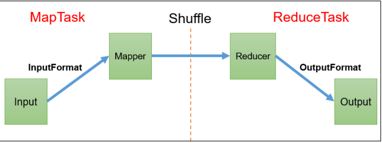

## 3.1 InputFormat 数据输入

### 3.1.1 切片与 MapTask 并行度决定机制

1）问题引出

MapTask 的并行度决定 Map 阶段的任务处理并发度，进而影响到整个 Job 的处理速度。

思考：1G 的数据，启动 8 个 MapTask，可以提高集群的并发处理能力。那么 1K 的数据，也启动 8 个 MapTask，会提高集群性能吗？MapTask 并行任务是否越多越好呢？哪些因素影响了 MapTask 并行度？

2）MapTask 并行度决定机制

**数据块：**Block 是 HDFS 物理上把数据分成一块一块。数据块是 HDFS 存储数据单位。 

**数据切片：**数据切片只是在逻辑上对输入进行分片，并不会在磁盘上将其切分成片进行存储。数据切片是 MapReduce 程序计算输入数据的单位，一个切片会对应启动一个 MapTask。

### 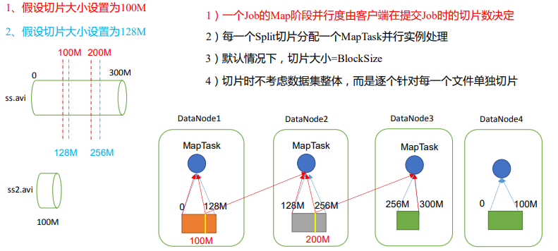3.1.2 Job 提交流程源码和切片源码详解

1）Job 提交流程源码详解

```
waitForCompletion()

submit();

// 1建立连接
	connect();	
		// 1）创建提交Job的代理
		new Cluster(getConfiguration());
			// （1）判断是本地运行环境还是yarn集群运行环境
			initialize(jobTrackAddr, conf); 

// 2 提交job
submitter.submitJobInternal(Job.this, cluster)

	// 1）创建给集群提交数据的Stag路径
	Path jobStagingArea = JobSubmissionFiles.getStagingDir(cluster, conf);

	// 2）获取jobid ，并创建Job路径
	JobID jobId = submitClient.getNewJobID();

	// 3）拷贝jar包到集群
copyAndConfigureFiles(job, submitJobDir);	
	rUploader.uploadFiles(job, jobSubmitDir);

	// 4）计算切片，生成切片规划文件
writeSplits(job, submitJobDir);
		maps = writeNewSplits(job, jobSubmitDir);
		input.getSplits(job);

	// 5）向Stag路径写XML配置文件
writeConf(conf, submitJobFile);
	conf.writeXml(out);

	// 6）提交Job,返回提交状态
status = submitClient.submitJob(jobId, submitJobDir.toString(), job.getCredentials());
```

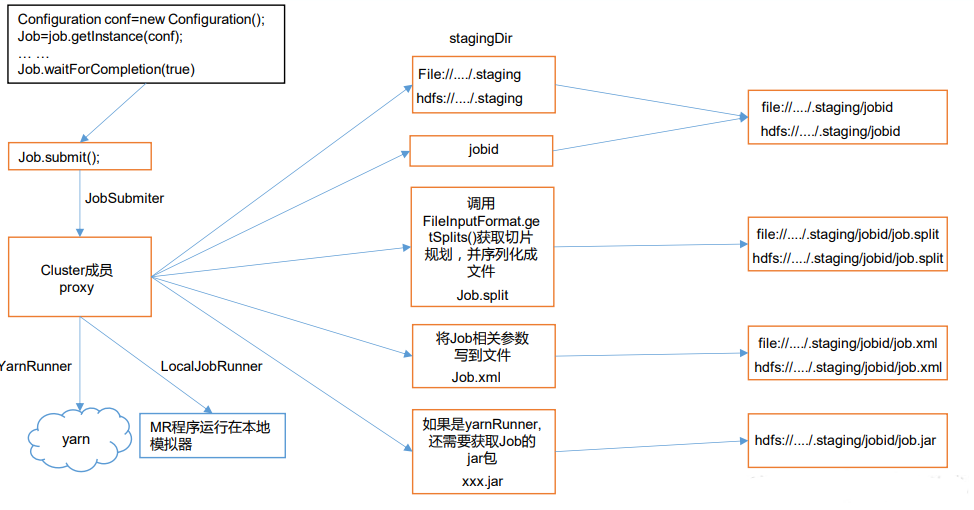

2）FileInputFormat 切片源码解析（input.getSplits(job)）

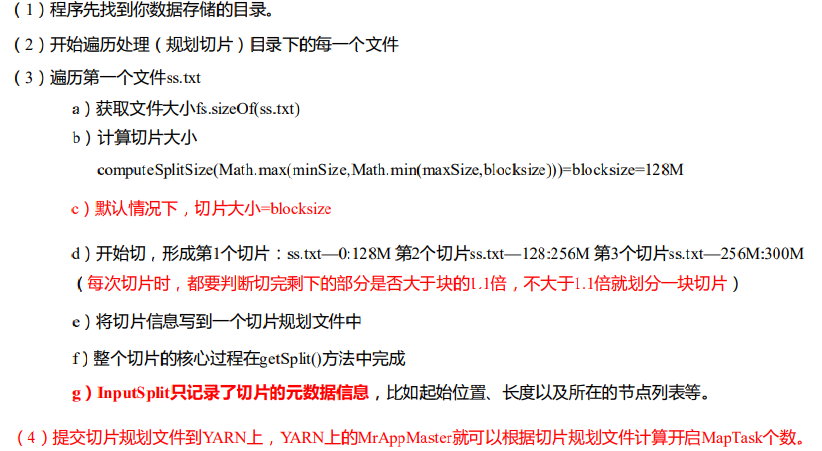

### 3.1.3 FileInputFormat 切片机制

#### 1、切片机制

（1）简单地按照文件的内容长度进行切片

（2）切片大小，默认等于Block大小

**（3）切片时不考虑数据集整体，而是逐个针对每一个文件单独切片**

#### 2、案例分析

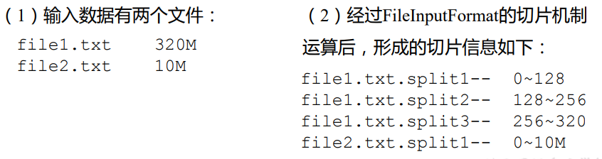

（1）源码中计算切片大小的公式

```
Math.max(minSize, Math.min(maxSize, blockSize));
mapreduce.input.fileinputformat.split.minsize=1 默认值为1
mapreduce.input.fileinputformat.split.maxsize= Long.MAXValue 默认值Long.MAXValu
```

因此，**默认情况下，切片大小=blocksize。**

（2）切片大小设置

maxsize（切片最大值）：参数如果调得比blockSize小，则会让切片变小，而且就等于配置的这个参数的值。 minsize（切片最小值）：参数调的比blockSize大，则可以让切片变得比blockSize还大。

（3）获取切片信息API

```
// 获取切片的文件名称
String name = inputSplit.getPath().getName();
// 根据文件类型获取切片信息
FileSplit inputSplit = (FileSplit) context.getInputSplit();
```

### 3.1.4 TextInputFormat

#### 1）FileInputFormat 实现类

思考：**在运行 MapReduce 程序时，输入的文件格式包括：基于行的日志文件、二进制格式文件、数据库表等。** 那么，针对不同的数据类型，MapReduce 是如何读取这些数据的呢？ 

FileInputFormat 常见的接口实现类包括：TextInputFormat、KeyValueTextInputFormat、NLineInputFormat、CombineTextInputFormat 和自定义 InputFormat 等

#### 2）TextInputFormat

TextInputFormat 是**默认的** FileInputFormat 实现类。按行读取每条记录。**键是存储该行在整个文件中的起始字节偏移量， LongWritable 类型。值是这行的内容，**不包括任何行终止符（换行符和回车符），Text 类型。

以下是一个示例，比如，一个分片包含了如下 4 条文本记录。

```
Rich learning form
Intelligent learning engine
Learning more convenient
From the real demand for more close to the enterprise
```

每条记录表示为以下键/值对：

```
(0,Rich learning form)
(20,Intelligent learning engine)
(49,Learning more convenient)
(74,From the real demand for more close to the enterprise)
```

### 3.1.5 CombineTextInputFormat 切片机制

框架默认的 TextInputFormat 切片机制是对任务按文件规划切片，**不管文件多小，都会是一个单独的切片，**都会交给一个 MapTask，这样如果有大量小文件，就会产生大量的 **MapTask**(一个MapTask 消耗一个CPU ，1G内存)，处理效率极其低下。

1）应用场景：

CombineTextInputFormat 用于小文件过多的场景，它可以将多个小文件从逻辑上规划到 一个切片中，这样，多个小文件就可以交给一个 MapTask 处理。

2）虚拟存储切片最大值设置

CombineTextInputFormat.setMaxInputSplitSize(job, 4194304);// 4m

注意：虚拟存储切片最大值设置最好根据实际的小文件大小情况来设置具体的值。

3）切片机制

生成切片过程包括：虚拟存储过程和切片过程二部分


setMaxInputSplitSize值为4M

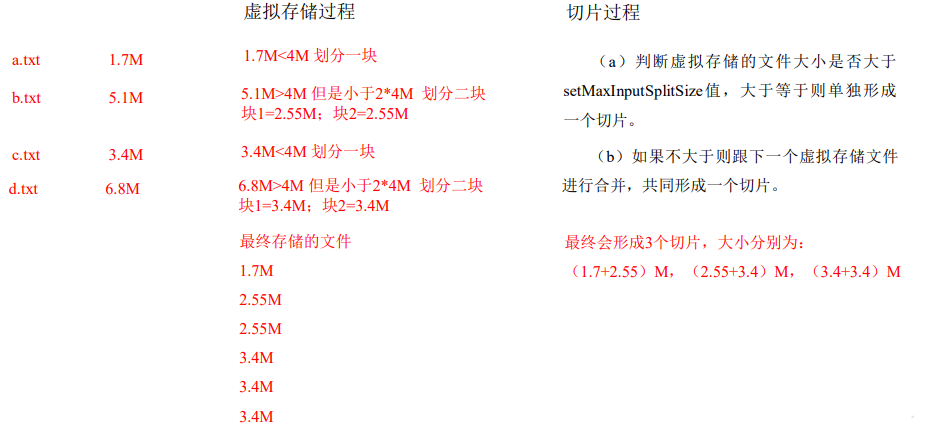

#### （1）虚拟存储过程：

将输入目录下所有文件大小，依次和设置的 setMaxInputSplitSize 值比较，如果不大于设置的最大值，逻辑上划分一个块。如果输入文件大于设置的最大值且大于两倍， 那么以最大值切割一块；**当剩余数据大小超过设置的最大值且不大于最大值 2 倍，此时将文件均分成 2 个虚拟存储块（防止出现太小切片）。**

例如 setMaxInputSplitSize 值为 4M，输入文件大小为 8.02M，则先逻辑上分成一个 4M。剩余的大小为 4.02M，如果按照 4M 逻辑划分，就会出现 0.02M 的小的虚拟存储 文件，所以将剩余的 4.02M 文件切分成（2.01M 和 2.01M）两个文件。

#### （2）切片过程：

- （a）判断虚拟存储的文件大小是否大于 setMaxInputSplitSize 值，大于等于则单独形成一个切片。

- （b）如果不大于则跟下一个虚拟存储文件进行合并，共同形成一个切片。

- （c）测试举例：有 4 个小文件大小分别为 1.7M、5.1M、3.4M 以及 6.8M 这四个小 文件，则虚拟存储之后形成 6 个文件块，大小分别为：

    1.7M，（2.55M、2.55M），3.4M 以及（3.4M、3.4M）

    最终会形成 3 个切片，大小分别为： （1.7+2.55）M，（2.55+3.4）M，（3.4+3.4）M

### 3.1.6 CombineTextInputFormat 案例实操

1）需求

将输入的大量小文件合并成一个切片统一处理。

- （1）输入数据 准备 4 个小文件

    

- （2）期望

    期望一个切片处理 4 个文件

2）实现过程

- （1）不做任何处理，运行 1.8 节的 WordCount 案例程序，观察切片个数为 4。

    ```
    number of splits:4
    ```

- （2）在 WordcountDriver 中增加如下代码，运行程序，并观察运行的切片个数为 3。

    （a）驱动类中添加代码如下：

    ```
    // 如果不设置 InputFormat，它默认用的是 TextInputFormat.class
    job.setInputFormatClass(CombineTextInputFormat.class);
    //虚拟存储切片最大值设置 4m
    CombineTextInputFormat.setMaxInputSplitSize(job, 4194304);
    ```

    （b）运行如果为 3 个切片。

    ```
    number of splits:3
    ```

- （3）在 WordcountDriver 中增加如下代码，运行程序，并观察运行的切片个数为 1。

    （a）驱动中添加代码如下：

    ```
    // 如果不设置 InputFormat，它默认用的是 TextInputFormat.class
    job.setInputFormatClass(CombineTextInputFormat.class);
    //虚拟存储切片最大值设置 20m
    CombineTextInputFormat.setMaxInputSplitSize(job, 20971520);
    ```

    （b）运行如果为 1 个切片

    ```
    number of splits:1
    ```

    ## 3.2 MapReduce 工作流程

    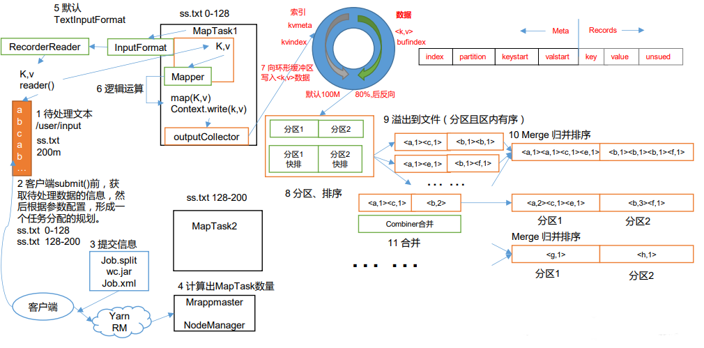

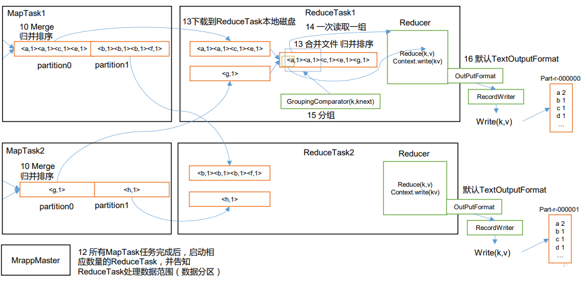

上面的流程是整个 MapReduce 最全工作流程，但是 Shuffle 过程只是从第 7 步开始到第 16 步结束，具体 Shuffle 过程详解，如下： 

- （1）MapTask 收集我们的 map()方法输出的 kv 对，放到内存缓冲区中 
- （2）从内存缓冲区不断溢出本地磁盘文件，可能会溢出多个文件 
- （3）多个溢出文件会被合并成大的溢出文件 
- （4）在溢出过程及合并的过程中，都要调用 Partitioner 进行分区和针对 key 进行排序 
- （5）ReduceTask 根据自己的分区号，去各个 MapTask 机器上取相应的结果分区数据 
- （6）ReduceTask 会抓取到同一个分区的来自不同 MapTask 的结果文件，ReduceTask 会将这些文件再进行合并（归并排序） 
- （7）合并成大文件后，Shuffle 的过程也就结束了，后面进入 ReduceTask 的逻辑运算过程（从文件中取出一个一个的键值对 Group，调用用户自定义的 reduce()方法）


注意： 

（1）Shuffle 中的缓冲区大小会影响到 MapReduce 程序的执行效率，原则上说，缓冲区越大，磁盘 io 的次数越少，执行速度就越快。 

（2）缓冲区的大小可以通过参数调整，参数：mapreduce.task.io.sort.mb 默认 100M。

## 3.3 Shuffle 机制

### 3.3.1 Shuffle 机制

Map 方法之后，Reduce 方法之前的数据处理过程称之为 Shuffle。

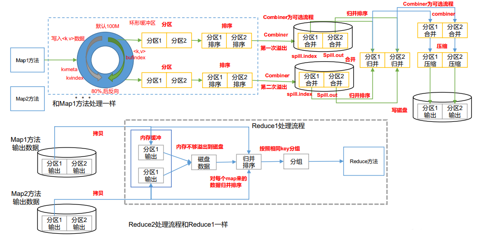

### 3.3.2 Partition 分区

#### 1、问题引出 

要求将统计结果按照条件输出到不同文件中（分区）。比如：将统计结果按照手机归属地不同省份输出到不同文件中（分区）

#### 2、默认Partitioner分区

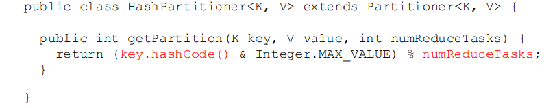

默 认分区是根据key的hashCode对ReduceTasks个数取模得到的。用户没法控制哪个 key存储到哪个分区。

#### 3、自定义Partitioner步骤

（1）自定义类继承Partitioner，重写getPartition()方法

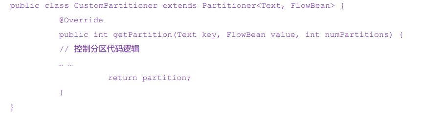（2)在Job驱动中，设置自定义Partitioner

```
job.setPartitionerClass(CustomPartitioner.class);
```

（3）自定义Partition后，要根据自定义Partitioner的逻辑设置相应数量的ReduceTask

```
job.setNumReduceTasks(5);
```

#### 4、分区总结

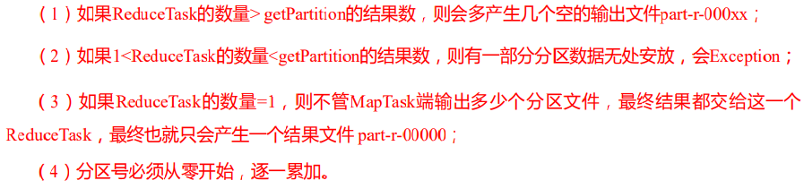

#### 5、案例分析

例如：假设自定义分区数为5，则

 （1）job.setNumReduceTasks(1);  会正常运行，只不过会产生一个输出文件

（2）job.setNumReduceTasks(2);  会报错

（3）job.setNumReduceTasks(6);  大于5，程序会正常运行，会产生空文件

### 3.3.3 Partition 分区案例实操

```
package com.atguigu.mapreduce.partitioner;
import org.apache.hadoop.io.Text;
import org.apache.hadoop.mapreduce.Partitioner;
public class ProvincePartitioner extends Partitioner<Text, FlowBean> {
 @Override
 public int getPartition(Text text, FlowBean flowBean, int numPartitions) 
{
     //获取手机号前三位 prePhone
     String phone = text.toString();
     String prePhone = phone.substring(0, 3);
     //定义一个分区号变量 partition,根据 prePhone 设置分区号
     int partition;
     if("136".equals(prePhone)){
     	partition = 0;
     }else if("137".equals(prePhone)){
     	partition = 1;
     }else if("138".equals(prePhone)){
     	partition = 2;
     }else if("139".equals(prePhone)){
     	partition = 3;
     }else {
     	partition = 4;
     }
     //最后返回分区号 partition
     return partition;
 	}
}
```

4）在驱动函数中增加自定义数据分区设置和 ReduceTask 设置

```
//8 指定自定义分区器
 job.setPartitionerClass(ProvincePartitioner.class);
 //9 同时指定相应数量的 ReduceTask
 job.setNumReduceTasks(5);
```

