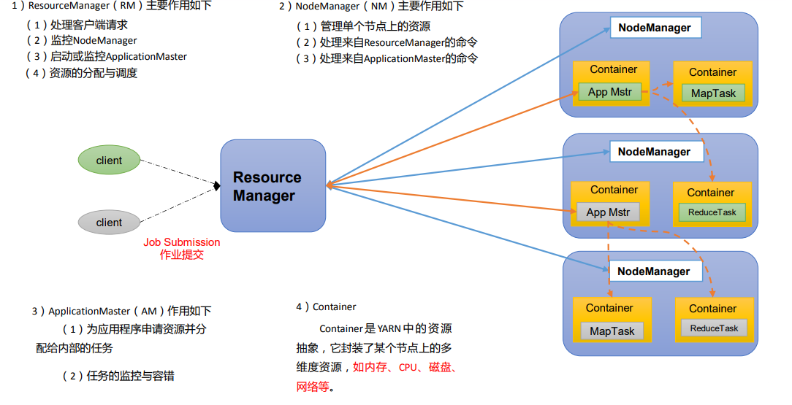
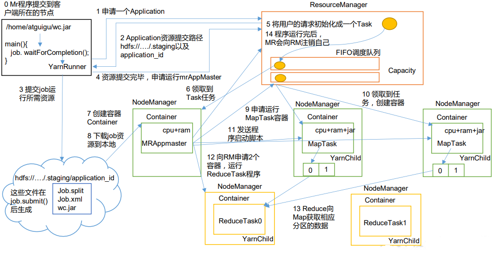
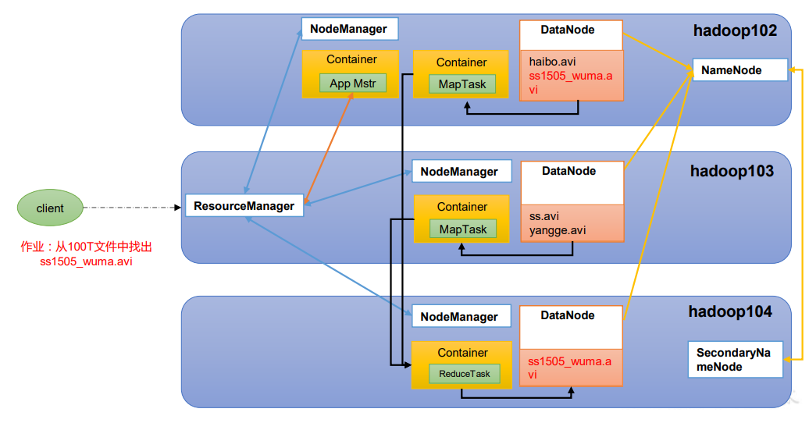
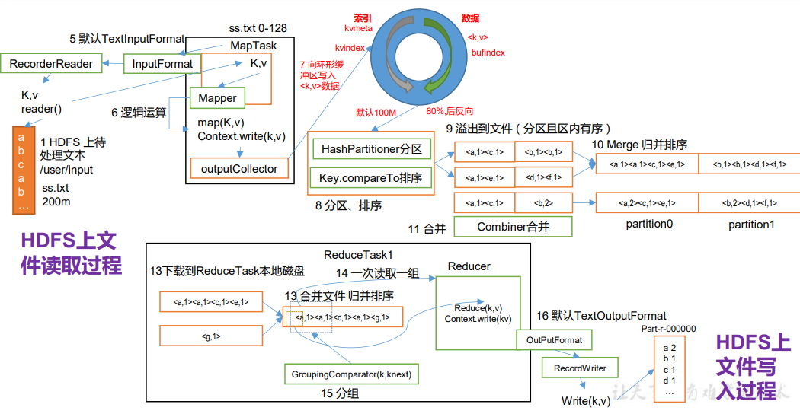

# 第 1 章 Yarn 资源调度器

思考：

 1）如何管理集群资源？ 

 2）如何给任务合理分配资源

Yarn 是一个资源调度平台，负责为运算程序提供服务器运算资源，相当于一个分布式的操作系统平台，而 MapReduce 等运算程序则相当于运行于操作系统之上的应用程序。

## 1.1 Yarn 基础架构

YARN 主要由 ResourceManager、NodeManager、ApplicationMaster 和 Container 等组件构成

## 1.2 Yarn 工作机制

​	（1）MR程序提交到客户端所在的节点。

​	（2）YarnRunner向ResourceManager申请一个Application。

​	（3）RM将该应用程序的资源路径返回给YarnRunner。

​	（4）该程序将运行所需资源提交到HDFS上。

​	（5）程序资源提交完毕后，申请运行mrAppMaster。

​	（6）RM将用户的请求初始化成一个Task。

​	（7）其中一个NodeManager领取到Task任务。

​	（8）该NodeManager创建容器Container，并产生MRAppmaster。

​	（9）Container从HDFS上拷贝资源到本地。

​	（10）MRAppmaster向RM 申请运行MapTask资源。

​	（11）RM将运行MapTask任务分配给另外两个NodeManager，另两个NodeManager分别领取任务并创建容器。

​	（12）MR向两个接收到任务的NodeManager发送程序启动脚本，这两个NodeManager分别启动MapTask，MapTask对数据分区排序。

​	（13）MrAppMaster等待所有MapTask运行完毕后，向RM申请容器，运行ReduceTask。

​	（14）ReduceTask向MapTask获取相应分区的数据。

​	（15）程序运行完毕后，MR会向RM申请注销自己。

## **1.3 作业提交全过程**

### 1.3.1 HDFS、YARN、MapReduce三者关系

### 1.3.2 **作业提交过程之YARN**

### 1.3.3 作业提交过程之HDFS & MapReduce

作业提交全过程详解

（1）作业提交

第1步：Client调用job.waitForCompletion方法，向整个集群提交MapReduce作业。

第2步：Client向RM申请一个作业id。

第3步：RM给Client返回该job资源的提交路径和作业id。

第4步：Client提交jar包、切片信息和配置文件到指定的资源提交路径。

第5步：Client提交完资源后，向RM申请运行**MrAppMaster**。

（2）作业初始化

第6步：当RM收到Client的请求后，将该job添加到容量调度器中。

第7步：某一个空闲的NM领取到该Job。

第8步：该NM创建Container，并产生MRAppmaster。

第9步：下载Client提交的资源到本地。

（3）任务分配

第10步：MrAppMaster向RM申请运行多个MapTask任务资源。

第11步：RM将运行MapTask任务分配给另外两个NodeManager，另两个NodeManager分别领取任务并创建容器。

（4）任务运行

第12步：MR向两个接收到任务的NodeManager发送程序启动脚本，这两个NodeManager分别启动MapTask，MapTask对数据分区排序。

第13步：MrAppMaster等待所有MapTask运行完毕后，向RM申请容器，运行ReduceTask。

第14步：ReduceTask向MapTask获取相应分区的数据。

第15步：程序运行完毕后，MR会向RM申请注销自己。

（5）进度和状态更新

YARN中的任务将其进度和状态(包括counter)返回给应用管理器, 客户端每秒(通过mapreduce.client.progressmonitor.pollinterval设置)向应用管理器请求进度更新, 展示给用户。

（6）作业完成

除了向应用管理器请求作业进度外, 客户端每5秒都会通过调用waitForCompletion()来检查作业是否完成。时间间隔可以通过mapreduce.client.completion.pollinterval来设置。作业完成之后, 应用管理器和Container会清理工作状态。作业的信息会被作业历史服务器存储以备之后用户核查。
