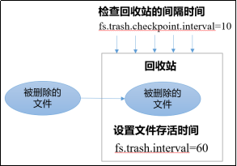
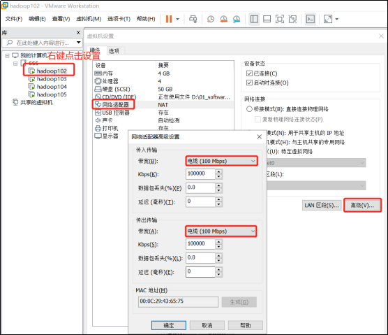
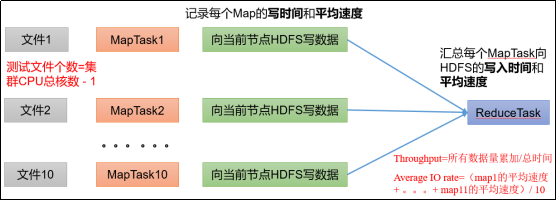
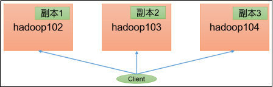
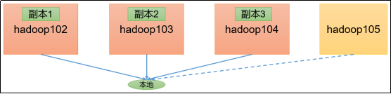

# 第 1 章 HDFS—核心参数

## 1.1 NameNode 内存生产配置

- 1）NameNode 内存计算

每个文件块大概占用 150byte，一台服务器 128G 内存为例，能存储多少文件块呢？

128 * 1024 * 1024 * 1024 / 150Byte ≈ 9.1 亿

G MB KB Byte

- 2）Hadoop2.x 系列，配置 NameNode 内存 

NameNode 内存默认 2000m，如果服务器内存 4G，NameNode 内存可以配置 3g。在 hadoop-env.sh 文件中配置如下。

```
HADOOP_NAMENODE_OPTS=-Xmx3072m
```

- 3）Hadoop3.x 系列，配置 NameNode 内存
    - （1）hadoop-env.sh 中描述 Hadoop 的内存是动态分配的

```
# The maximum amount of heap to use (Java -Xmx).  If no unit
# is provided, it will be converted to MB.  Daemons will
# prefer any Xmx setting in their respective _OPT variable.
# There is no default; the JVM will autoscale based upon machine
# memory size.
# export HADOOP_HEAPSIZE_MAX=

# The minimum amount of heap to use (Java -Xms).  If no unit
# is provided, it will be converted to MB.  Daemons will
# prefer any Xms setting in their respective _OPT variable.
# There is no default; the JVM will autoscale based upon machine
# memory size.
# export HADOOP_HEAPSIZE_MIN=
HADOOP_NAMENODE_OPTS=-Xmx102400m
```
  （2）查看NameNode占用内存

```
[atguigu@hadoop102 ~]$ jps
3088 NodeManager
2611 NameNode
3271 JobHistoryServer
2744 DataNode
3579 Jps
[atguigu@hadoop102 ~]$ jmap -heap 2611
Heap Configuration:
   MaxHeapSize              = 1031798784 (984.0MB)
```

（3）查看DataNode占用内存

```
[atguigu@hadoop102 ~]$ jmap -heap 2744
Heap Configuration:
   MaxHeapSize              = 1031798784 (984.0MB)
```

查看发现hadoop102上的NameNode和DataNode占用内存都是自动分配的，且相等。不是很合理。

**经验参考：**

[https://docs.cloudera.com/documentation/enterprise/6/release-notes/topics/rg_hardware_requirements.html#concept_fzz_dq4_gbb](https://docs.cloudera.com/documentation/enterprise/6/release-notes/topics/rg_hardware_requirements.html#concept_fzz_dq4_gbb])

 

具体修改：hadoop-env.sh

```
export HDFS_NAMENODE_OPTS="-Dhadoop.security.logger=INFO,RFAS -Xmx1024m"
export HDFS_DATANODE_OPTS="-Dhadoop.security.logger=ERROR,RFAS -Xmx1024m"
```

## **1.2** **NameNode心跳并发配置**


1）hdfs-site.xml

```
The number of Namenode RPC server threads that listen to requests from clients. If dfs.namenode.servicerpc-address is not configured then Namenode RPC server threads listen to requests from all nodes.
NameNode有一个工作线程池，用来处理不同DataNode的并发心跳以及客户端并发的元数据操作。
对于大集群或者有大量客户端的集群来说，通常需要增大该参数。默认值是10。
<property>
    <name>dfs.namenode.handler.count</name>
    <value>21</value>
</property>
```

企业经验：dfs.namenode.handler.count=，比如集群规模（DataNode台数)为3台时，此参数设置为21。可通过简单的python代码计算该值，代码如下。

```
[atguigu@hadoop102 ~]$ sudo yum install -y python
[atguigu@hadoop102 ~]$ python
Python 2.7.5 (default, Apr 11 2018, 07:36:10) 
[GCC 4.8.5 20150623 (Red Hat 4.8.5-28)] on linux2
Type "help", "copyright", "credits" or "license" for more information.
>>> import math
>>> print int(20*math.log(3))
21
>>> quit()
```

## **1.3** **开启回收站配置**

开启回收站功能，可以将删除的文件在不超时的情况下，恢复原数据，起到防止误删除、备份等作用。

1）回收站工作机制



2）开启回收站功能参数说明

（1）默认值fs.trash.interval = 0，0表示禁用回收站；其他值表示设置文件的存活时间。

（2）默认值fs.trash.checkpoint.interval = 0，检查回收站的间隔时间。如果该值为0，则该值设置和fs.trash.interval的参数值相等。

（3）要求fs.trash.checkpoint.interval <= fs.trash.interval。

3）启用回收站

修改core-site.xml，配置垃圾回收时间为1分钟。

```
<property>
    <name>fs.trash.interval</name>
    <value>1</value>
</property>
```

4）查看回收站

回收站目录在HDFS集群中的路径：/user/atguigu/.Trash/….

<mark>5）注意：通过网页上直接删除的文件也不会走回收站。</mark>

6）通过程序删除的文件不会经过回收站，需要调用moveToTrash()才进入回收站

```
Trash trash = New Trash(conf);
trash.moveToTrash(path);
```

7）只有在命令行利用`hadoop fs -rm`命令删除的文件才会走回收站。

```
[atguigu@hadoop102 hadoop-3.1.3]$ hadoop fs -rm -r /user/atguigu/input
2021-07-14 16:13:42,643 INFO fs.TrashPolicyDefault: Moved: 'hdfs://hadoop102:9820/user/atguigu/input' to trash at: hdfs://hadoop102:9820/user/atguigu/.Trash/Current/user/atguigu/input
```

8）恢复回收站数据

```
[atguigu@hadoop102 hadoop-3.1.3]$ hadoop fs -mv
/user/atguigu/.Trash/Current/user/atguigu/input    /user/atguigu/input
```

# 第2章 HDFS—集群压测

在企业中非常关心每天从Java后台拉取过来的数据，需要多久能上传到集群？消费者关心多久能从HDFS上拉取需要的数据？

为了搞清楚HDFS的读写性能，生产环境上非常需要对集群进行压测。


HDFS的读写性能主要受**网络和磁盘**影响比较大。为了方便测试，将hadoop102、hadoop103、hadoop104虚拟机网络都设置为100mbps。



100Mbps单位是bit；10M/s单位是byte ; 1byte=8bit，100Mbps/8=12.5M/s。

测试网速：来到hadoop102的/opt/module目录，创建一个

```
[atguigu@hadoop102 software]$ python -m SimpleHTTPServer
```

## **2.1** 测试HDFS写性能

0）写测试底层原理



1）测试内容：向HDFS集群写10个128M的文件

```
[atguigu@hadoop102 mapreduce]$ hadoop jar /opt/module/hadoop-3.1.3/share/hadoop/mapreduce/hadoop-mapreduce-client-jobclient-3.1.3-tests.jar TestDFSIO -write -nrFiles 10 -fileSize 128MB

2021-02-09 10:43:16,853 INFO fs.TestDFSIO: ----- TestDFSIO ----- : write
2021-02-09 10:43:16,854 INFO fs.TestDFSIO:             Date & time: Tue Feb 09 10:43:16 CST 2021
2021-02-09 10:43:16,854 INFO fs.TestDFSIO:         Number of files: 10
2021-02-09 10:43:16,854 INFO fs.TestDFSIO:  Total MBytes processed: 1280
2021-02-09 10:43:16,854 INFO fs.TestDFSIO:       Throughput mb/sec: 1.61
2021-02-09 10:43:16,854 INFO fs.TestDFSIO:  Average IO rate mb/sec: 1.9
2021-02-09 10:43:16,854 INFO fs.TestDFSIO:   IO rate std deviation: 0.76
2021-02-09 10:43:16,854 INFO fs.TestDFSIO:      Test exec time sec: 133.05
2021-02-09 10:43:16,854 INFO fs.TestDFSIO:
```

<mark>注意：nrFiles n为生成mapTask的数量，生产环境一般可通过hadoop103:8088查看CPU核数，设置为（CPU核数 - 1)</mark>

- Number of files：生成mapTask数量，一般是集群中（CPU核数-1），我们测试虚拟机就按照实际的物理内存-1分配即可

- Total MBytes processed：单个map处理的文件大小

- Throughput mb/sec:单个mapTak的吞吐量；
    - 计算方式：处理的总文件大小/每一个mapTask写数据的时间累加
    - 集群整体吞吐量：生成mapTask数量*单个mapTak的吞吐量

- Average IO rate mb/sec: 平均mapTak的吞吐量
    - 计算方式：每个mapTask处理文件大小/每一个mapTask写数据的时间全部相加除以task数量

- IO rate std deviation:方差、反映各个mapTask处理的差值，越小越均衡

2）注意：如果测试过程中，出现异常

（1）可以在yarn-site.xml中设置虚拟内存检测为false

```
<!--是否启动一个线程检查每个任务正使用的虚拟内存量，如果任务超出分配值，则直接将其杀掉，默认是true -->
<property>
     <name>yarn.nodemanager.vmem-check-enabled</name>
     <value>false</value>
</property>
```

（2）分发配置并重启Yarn集群


3）测试结果分析

（1）由于副本1就在本地，所以该副本不参与测试


一共参与测试的文件：10个文件 * 2个副本 = 20个

压测后的速度：1.61

实测速度：1.61M/s * 20个文件 ≈ 32M/s

三台服务器的带宽：12.5 + 12.5 + 12.5 ≈ 30m/s

所有网络资源都已经用满。

**如果实测速度远远小于网络，并且实测速度不能满足工作需求，可以考虑采用固态硬盘或者增加磁盘个数。**

（2）如果客户端不在集群节点，那就三个副本都参与计算



## **2.2** 测试HDFS读性能

1）测试内容：读取HDFS集群10个128M的文件

```
[atguigu@hadoop102 mapreduce]$ hadoop jar /opt/module/hadoop-3.1.3/share/hadoop/mapreduce/hadoop-mapreduce-client-jobclient-3.1.3-tests.jar TestDFSIO -read -nrFiles 10 -fileSize 128MB

2021-02-09 11:34:15,847 INFO fs.TestDFSIO: ----- TestDFSIO ----- : read
2021-02-09 11:34:15,847 INFO fs.TestDFSIO:             Date & time: Tue Feb 09 11:34:15 CST 2021
2021-02-09 11:34:15,847 INFO fs.TestDFSIO:         Number of files: 10
2021-02-09 11:34:15,847 INFO fs.TestDFSIO:  Total MBytes processed: 1280
2021-02-09 11:34:15,848 INFO fs.TestDFSIO:       Throughput mb/sec: 200.28
2021-02-09 11:34:15,848 INFO fs.TestDFSIO:  Average IO rate mb/sec: 266.74
2021-02-09 11:34:15,848 INFO fs.TestDFSIO:   IO rate std deviation: 143.12
2021-02-09 11:34:15,848 INFO fs.TestDFSIO:      Test exec time sec: 20.83
```

2）删除测试生成数据

```
[atguigu@hadoop102 mapreduce]$ hadoop jar /opt/module/hadoop-3.1.3/share/hadoop/mapreduce/hadoop-mapreduce-client-jobclient-3.1.3-tests.jar TestDFSIO -clean
```

3）测试结果分析：为什么读取文件速度大于网络带宽？由于目前只有三台服务器，且有三个副本，数据读取就近原则，相当于都是读取的本地磁盘数据，没有走网络。

