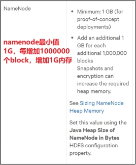
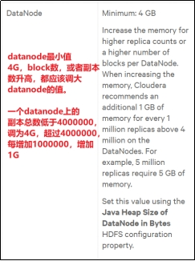
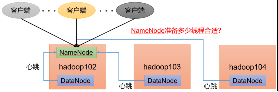

# 第 1 章 HDFS—核心参数

## 1.1 NameNode 内存生产配置

- 1）NameNode 内存计算

每个文件块大概占用 150byte，一台服务器 128G 内存为例，能存储多少文件块呢？

128 * 1024 * 1024 * 1024 / 150Byte ≈ 9.1 亿

G MB KB Byte

- 2）Hadoop2.x 系列，配置 NameNode 内存 

NameNode 内存默认 2000m，如果服务器内存 4G，NameNode 内存可以配置 3g。在 hadoop-env.sh 文件中配置如下。

```
HADOOP_NAMENODE_OPTS=-Xmx3072m
```

- 3）Hadoop3.x 系列，配置 NameNode 内存
    - （1）hadoop-env.sh 中描述 Hadoop 的内存是动态分配的

```
# The maximum amount of heap to use (Java -Xmx).  If no unit
# is provided, it will be converted to MB.  Daemons will
# prefer any Xmx setting in their respective _OPT variable.
# There is no default; the JVM will autoscale based upon machine
# memory size.
# export HADOOP_HEAPSIZE_MAX=

# The minimum amount of heap to use (Java -Xms).  If no unit
# is provided, it will be converted to MB.  Daemons will
# prefer any Xms setting in their respective _OPT variable.
# There is no default; the JVM will autoscale based upon machine
# memory size.
# export HADOOP_HEAPSIZE_MIN=
HADOOP_NAMENODE_OPTS=-Xmx102400m
```
  （2）查看NameNode占用内存

```
[atguigu@hadoop102 ~]$ jps
3088 NodeManager
2611 NameNode
3271 JobHistoryServer
2744 DataNode
3579 Jps
[atguigu@hadoop102 ~]$ jmap -heap 2611
Heap Configuration:
   MaxHeapSize              = 1031798784 (984.0MB)
```

（3）查看DataNode占用内存

```
[atguigu@hadoop102 ~]$ jmap -heap 2744
Heap Configuration:
   MaxHeapSize              = 1031798784 (984.0MB)
```

查看发现hadoop102上的NameNode和DataNode占用内存都是自动分配的，且相等。不是很合理。

**经验参考：**

[https://docs.cloudera.com/documentation/enterprise/6/release-notes/topics/rg_hardware_requirements.html#concept_fzz_dq4_gbb](https://docs.cloudera.com/documentation/enterprise/6/release-notes/topics/rg_hardware_requirements.html#concept_fzz_dq4_gbb])

 

具体修改：hadoop-env.sh

```
export HDFS_NAMENODE_OPTS="-Dhadoop.security.logger=INFO,RFAS -Xmx1024m"
export HDFS_DATANODE_OPTS="-Dhadoop.security.logger=ERROR,RFAS -Xmx1024m"
```

## **1.2** **NameNode心跳并发配置**



1）hdfs-site.xml

```
The number of Namenode RPC server threads that listen to requests from clients. If dfs.namenode.servicerpc-address is not configured then Namenode RPC server threads listen to requests from all nodes.
NameNode有一个工作线程池，用来处理不同DataNode的并发心跳以及客户端并发的元数据操作。
对于大集群或者有大量客户端的集群来说，通常需要增大该参数。默认值是10。
<property>
    <name>dfs.namenode.handler.count</name>
    <value>21</value>
</property>
```

企业经验：dfs.namenode.handler.count=，比如集群规模（DataNode台数)为3台时，此参数设置为21。可通过简单的python代码计算该值，代码如下。

```
[atguigu@hadoop102 ~]$ sudo yum install -y python
[atguigu@hadoop102 ~]$ python
Python 2.7.5 (default, Apr 11 2018, 07:36:10) 
[GCC 4.8.5 20150623 (Red Hat 4.8.5-28)] on linux2
Type "help", "copyright", "credits" or "license" for more information.
>>> import math
>>> print int(20*math.log(3))
21
>>> quit()
```

## **1.3** **开启回收站配置**

开启回收站功能，可以将删除的文件在不超时的情况下，恢复原数据，起到防止误删除、备份等作用。

1）回收站工作机制


2）开启回收站功能参数说明

（1）默认值fs.trash.interval = 0，0表示禁用回收站；其他值表示设置文件的存活时间。

（2）默认值fs.trash.checkpoint.interval = 0，检查回收站的间隔时间。如果该值为0，则该值设置和fs.trash.interval的参数值相等。

（3）要求fs.trash.checkpoint.interval <= fs.trash.interval。

3）启用回收站

修改core-site.xml，配置垃圾回收时间为1分钟。

```
<property>
    <name>fs.trash.interval</name>
    <value>1</value>
</property>
```

4）查看回收站

回收站目录在HDFS集群中的路径：/user/atguigu/.Trash/….

<mark>5）注意：通过网页上直接删除的文件也不会走回收站。</mark>

6）通过程序删除的文件不会经过回收站，需要调用moveToTrash()才进入回收站

```
Trash trash = New Trash(conf);
trash.moveToTrash(path);
```

7）只有在命令行利用`hadoop fs -rm`命令删除的文件才会走回收站。

```
[atguigu@hadoop102 hadoop-3.1.3]$ hadoop fs -rm -r /user/atguigu/input
2021-07-14 16:13:42,643 INFO fs.TrashPolicyDefault: Moved: 'hdfs://hadoop102:9820/user/atguigu/input' to trash at: hdfs://hadoop102:9820/user/atguigu/.Trash/Current/user/atguigu/input
```

8）恢复回收站数据

```
[atguigu@hadoop102 hadoop-3.1.3]$ hadoop fs -mv
/user/atguigu/.Trash/Current/user/atguigu/input    /user/atguigu/input
```

# 第2章 HDFS—集群压测

在企业中非常关心每天从Java后台拉取过来的数据，需要多久能上传到集群？消费者关心多久能从HDFS上拉取需要的数据？

为了搞清楚HDFS的读写性能，生产环境上非常需要对集群进行压测。


HDFS的读写性能主要受**网络和磁盘**影响比较大。为了方便测试，将hadoop102、hadoop103、hadoop104虚拟机网络都设置为100mbps。


100Mbps单位是bit；10M/s单位是byte ; 1byte=8bit，100Mbps/8=12.5M/s。

测试网速：来到hadoop102的/opt/module目录，创建一个

```
[atguigu@hadoop102 software]$ python -m SimpleHTTPServer
```

## **2.1** 测试HDFS写性能

0）写测试底层原理


1）测试内容：向HDFS集群写10个128M的文件

```
[atguigu@hadoop102 mapreduce]$ hadoop jar /opt/module/hadoop-3.1.3/share/hadoop/mapreduce/hadoop-mapreduce-client-jobclient-3.1.3-tests.jar TestDFSIO -write -nrFiles 10 -fileSize 128MB

2021-02-09 10:43:16,853 INFO fs.TestDFSIO: ----- TestDFSIO ----- : write
2021-02-09 10:43:16,854 INFO fs.TestDFSIO:             Date & time: Tue Feb 09 10:43:16 CST 2021
2021-02-09 10:43:16,854 INFO fs.TestDFSIO:         Number of files: 10
2021-02-09 10:43:16,854 INFO fs.TestDFSIO:  Total MBytes processed: 1280
2021-02-09 10:43:16,854 INFO fs.TestDFSIO:       Throughput mb/sec: 1.61
2021-02-09 10:43:16,854 INFO fs.TestDFSIO:  Average IO rate mb/sec: 1.9
2021-02-09 10:43:16,854 INFO fs.TestDFSIO:   IO rate std deviation: 0.76
2021-02-09 10:43:16,854 INFO fs.TestDFSIO:      Test exec time sec: 133.05
2021-02-09 10:43:16,854 INFO fs.TestDFSIO:
```

<mark>注意：nrFiles n为生成mapTask的数量，生产环境一般可通过hadoop103:8088查看CPU核数，设置为（CPU核数 - 1)</mark>

- Number of files：生成mapTask数量，一般是集群中（CPU核数-1），我们测试虚拟机就按照实际的物理内存-1分配即可

- Total MBytes processed：单个map处理的文件大小

- Throughput mb/sec:单个mapTak的吞吐量；
    - 计算方式：处理的总文件大小/每一个mapTask写数据的时间累加
    - 集群整体吞吐量：生成mapTask数量*单个mapTak的吞吐量

- Average IO rate mb/sec: 平均mapTak的吞吐量
    - 计算方式：每个mapTask处理文件大小/每一个mapTask写数据的时间全部相加除以task数量

- IO rate std deviation:方差、反映各个mapTask处理的差值，越小越均衡

2）注意：如果测试过程中，出现异常

（1）可以在yarn-site.xml中设置虚拟内存检测为false

```
<!--是否启动一个线程检查每个任务正使用的虚拟内存量，如果任务超出分配值，则直接将其杀掉，默认是true -->
<property>
     <name>yarn.nodemanager.vmem-check-enabled</name>
     <value>false</value>
</property>
```

（2）分发配置并重启Yarn集群


3）测试结果分析

（1）由于副本1就在本地，所以该副本不参与测试


一共参与测试的文件：10个文件 * 2个副本 = 20个

压测后的速度：1.61

实测速度：1.61M/s * 20个文件 ≈ 32M/s

三台服务器的带宽：12.5 + 12.5 + 12.5 ≈ 30m/s

所有网络资源都已经用满。

**如果实测速度远远小于网络，并且实测速度不能满足工作需求，可以考虑采用固态硬盘或者增加磁盘个数。**

（2）如果客户端不在集群节点，那就三个副本都参与计算


## **2.2** 测试HDFS读性能

1）测试内容：读取HDFS集群10个128M的文件

```
[atguigu@hadoop102 mapreduce]$ hadoop jar /opt/module/hadoop-3.1.3/share/hadoop/mapreduce/hadoop-mapreduce-client-jobclient-3.1.3-tests.jar TestDFSIO -read -nrFiles 10 -fileSize 128MB

2021-02-09 11:34:15,847 INFO fs.TestDFSIO: ----- TestDFSIO ----- : read
2021-02-09 11:34:15,847 INFO fs.TestDFSIO:             Date & time: Tue Feb 09 11:34:15 CST 2021
2021-02-09 11:34:15,847 INFO fs.TestDFSIO:         Number of files: 10
2021-02-09 11:34:15,847 INFO fs.TestDFSIO:  Total MBytes processed: 1280
2021-02-09 11:34:15,848 INFO fs.TestDFSIO:       Throughput mb/sec: 200.28
2021-02-09 11:34:15,848 INFO fs.TestDFSIO:  Average IO rate mb/sec: 266.74
2021-02-09 11:34:15,848 INFO fs.TestDFSIO:   IO rate std deviation: 143.12
2021-02-09 11:34:15,848 INFO fs.TestDFSIO:      Test exec time sec: 20.83
```

2）删除测试生成数据

```
[atguigu@hadoop102 mapreduce]$ hadoop jar /opt/module/hadoop-3.1.3/share/hadoop/mapreduce/hadoop-mapreduce-client-jobclient-3.1.3-tests.jar TestDFSIO -clean
```

3）测试结果分析：为什么读取文件速度大于网络带宽？由于目前只有三台服务器，且有三个副本，数据读取就近原则，相当于都是读取的本地磁盘数据，没有走网络。


# 第3章 HDFS—多目录

## 3.1 NameNode多目录配置

1）NameNode的本地目录可以配置成多个，**且每个目录存放内容相同**，增加了可靠性


2）具体配置如下

（1）在hdfs-site.xml文件中添加如下内容

```
<property>
     <name>dfs.namenode.name.dir</name>
     <value>file://${hadoop.tmp.dir}/dfs/name1,file://${hadoop.tmp.dir}/dfs/name2</value>
</property>
```

**注意：因为每台服务器节点的磁盘情况不同，所以这个配置配完之后，可以选择不分发**

（2）停止集群，删除三台节点的data和logs中所有数据。

```
[atguigu@hadoop102 hadoop-3.1.3]$ rm -rf data/ logs/
[atguigu@hadoop103 hadoop-3.1.3]$ rm -rf data/ logs/
[atguigu@hadoop104 hadoop-3.1.3]$ rm -rf data/ logs/
```

（3）格式化集群并启动。

```
[atguigu@hadoop102 hadoop-3.1.3]$ bin/hdfs namenode -format
[atguigu@hadoop102 hadoop-3.1.3]$ sbin/start-dfs.sh
```

3）查看结果

```
[atguigu@hadoop102 dfs]$ ll
总用量 12
drwx------. 3 atguigu atguigu 4096 12月 11 08:03 data
drwxrwxr-x. 3 atguigu atguigu 4096 12月 11 08:03 name1
drwxrwxr-x. 3 atguigu atguigu 4096 12月 11 08:03 name2
```

**检查name1和name2里面的内容，发现一模一样。**

## 3.2 DataNode多目录配置

1）DataNode可以配置成多个目录，**每个目录存储的数据不一样（**数据不是副本）


2）具体配置如下

在hdfs-site.xml文件中添加如下内容

```
<property>
     <name>dfs.datanode.data.dir</name>
     <value>file://${hadoop.tmp.dir}/dfs/data1,file://${hadoop.tmp.dir}/dfs/data2</value>
</property>
```

3）查看结果

```
[atguigu@hadoop102 dfs]$ ll
总用量 12
drwx------. 3 atguigu atguigu 4096 4月   4 14:22 data1
drwx------. 3 atguigu atguigu 4096 4月   4 14:22 data2
drwxrwxr-x. 3 atguigu atguigu 4096 12月 11 08:03 name1
drwxrwxr-x. 3 atguigu atguigu 4096 12月 11 08:03 name2
```

4）向集群上传一个文件，再次观察两个文件夹里面的内容发现不一致（一个有数一个没有）

```
[atguigu@hadoop102 hadoop-3.1.3]$ hadoop fs -put wcinput/word.txt /
```

## 3.3 集群数据均衡之磁盘间数据均衡

生产环境，由于硬盘空间不足，往往需要增加一块硬盘。刚加载的硬盘没有数据时，可以执行磁盘数据均衡命令。（Hadoop3.x新特性）

> 同一台主机


（1）生成均衡计划（**我们只有一块磁盘，不会生成计划**）

（2）执行均衡计划

```
hdfs diskbalancer -execute hadoop103.plan.json
```

（3）查看当前均衡任务的执行情况

```
hdfs diskbalancer -query hadoop103
```

（4）取消均衡任务

```
hdfs diskbalancer -cancel hadoop103.plan.json
```

# 第4章 HDFS—集群扩容及缩容

## 4.1 添加白名单

白名单：表示在白名单的主机IP地址可以，用来存储数据。

企业中：配置白名单，可以尽量防止黑客恶意访问攻击。


配置白名单步骤如下：

- 1）在NameNode节点的/opt/module/hadoop-3.1.3/etc/hadoop目录下分别创建whitelist 和blacklist文件

    - （1）创建白名单

        ```
        [atguigu@hadoop102 hadoop]$ vim whitelist
        ```

        在whitelist中添加如下主机名称，假如集群正常工作的节点为102 103

        ```
        hadoop102
        hadoop103
        ```

    - （2）创建黑名单

        ```
        [atguigu@hadoop102 hadoop]$ touch blacklist
        ```

        保持空的就可以

- 2）在hdfs-site.xml配置文件中增加dfs.hosts配置参数

    ```
    <!-- 白名单 -->
    <property>
         <name>dfs.hosts</name>
         <value>/opt/module/hadoop-3.1.3/etc/hadoop/whitelist</value>
    </property>
    
    <!-- 黑名单 -->
    <property>
         <name>dfs.hosts.exclude</name>
         <value>/opt/module/hadoop-3.1.3/etc/hadoop/blacklist</value>
    </property>
    ```

- 3）分发配置文件whitelist，hdfs-site.xml

    ```
    [atguigu@hadoop104 hadoop]$ xsync hdfs-site.xml whitelist
    ```

- 4）第一次添加白名单必须重启集群，不是第一次，只需要刷新NameNode节点即可

    ```
    [atguigu@hadoop102 hadoop-3.1.3]$ myhadoop.sh stop
    [atguigu@hadoop102 hadoop-3.1.3]$ myhadoop.sh start
    ```

- 5）在web浏览器上查看DN，http://hadoop102:9870/dfshealth.html#tab-datanode

    

- 6）在hadoop104上执行上传数据数据失败

    ```
    [atguigu@hadoop104 hadoop-3.1.3]$ hadoop fs -put NOTICE.txt /
    ```

- 7）二次修改白名单，增加hadoop104

    ```
    [atguigu@hadoop102 hadoop]$ vim whitelist
    修改为如下内容
    hadoop102
    hadoop103
    hadoop104
    ```

- 8）刷新NameNode

    ```
    [atguigu@hadoop102 hadoop-3.1.3]$ hdfs dfsadmin -refreshNodes
    Refresh nodes successful
    ```

- 9）在web浏览器上查看DN，http://hadoop102:9870/dfshealth.html#tab-datanode


## 4.2 服役新服务器

- 1）需求

    随着公司业务的增长，数据量越来越大，原有的数据节点的容量已经不能满足存储数据的需求，需要在原有集群基础上动态添加新的数据节点。

- 2）环境准备

    - （1）在hadoop100主机上再克隆一台hadoop105主机

    - （2）修改IP地址和主机名称

        ```
        [root@hadoop105 ~]# vim /etc/sysconfig/network-scripts/ifcfg-ens33
        [root@hadoop105 ~]# vim /etc/hostname
        ```

    - （3）拷贝hadoop102的/opt/module目录和/etc/profile.d/my_env.sh到hadoop105

        ```
        [atguigu@hadoop102 opt]$ scp -r module/* atguigu@hadoop105:/opt/module/
        
        [atguigu@hadoop102 opt]$ sudo scp /etc/profile.d/my_env.sh root@hadoop105:/etc/profile.d/my_env.sh
        
        [atguigu@hadoop105 hadoop-3.1.3]$ source /etc/profile
        ```

    - （4）删除hadoop105上Hadoop的历史数据，data和log数据

        ```
        [atguigu@hadoop105 hadoop-3.1.3]$ rm -rf data/ logs/
        ```

    - （5）配置hadoop102和hadoop103到hadoop105的ssh无密登录
    
        ```
        [atguigu@hadoop102 .ssh]$ ssh-copy-id hadoop105
        
        [atguigu@hadoop103 .ssh]$ ssh-copy-id hadoop105
        ```
    
- 3）服役新节点具体步骤

    - （1）直接启动DataNode，即可关联到集群

    ```
    [atguigu@hadoop105 hadoop-3.1.3]$ hdfs --daemon start datanode
    [atguigu@hadoop105 hadoop-3.1.3]$ yarn --daemon start nodemanager
    ```

    

- 4）在白名单中增加新服役的服务器

    - （1）在白名单whitelist中增加hadoop104、hadoop105，并重启集群

       ```
        [atguigu@hadoop102 hadoop]$ vim whitelist
        修改为如下内容
        hadoop102
        hadoop103
        hadoop104
        hadoop105
       ```

    - （2）分发
    
       ```
       [atguigu@hadoop102 hadoop]$ xsync whitelist
       ```
    
    - （3）刷新NameNode
    
       ```
       [atguigu@hadoop102 hadoop-3.1.3]$ hdfs dfsadmin -refreshNodes
       Refresh nodes successful
       ```
    
- 5）在hadoop105上上传文件

    ```
    [atguigu@hadoop105 hadoop-3.1.3]$ hadoop fs -put /opt/module/hadoop-3.1.3/LICENSE.txt /
    ```

    

    思考：如果数据不均衡（hadoop105数据少，其他节点数据多），怎么处理？

## 4.3 服务器间数据均衡

- 1）企业经验：

在企业开发中，如果经常在hadoop102和hadoop104上提交任务，且副本数为2，由于数据本地性原则，就会导致hadoop102和hadoop104数据过多，hadoop103存储的数据量小。
        
另一种情况，就是新服役的服务器数据量比较少，需要执行集群均衡命令。


- 2）开启数据均衡命令：

    ```
    [atguigu@hadoop105 hadoop-3.1.3]$ sbin/start-balancer.sh -threshold 10
    ```

    对于参数10，代表的是集群中各个节点的磁盘空间利用率相差不超过10%，可根据实际情况进行调整

- 3）停止数据均衡命令：

    ```
    [atguigu@hadoop105 hadoop-3.1.3]$ sbin/stop-balancer.sh
    ```

    > 注意：由于HDFS需要启动单独的Rebalance Server来执行Rebalance操作，[所以尽量不要在NameNode上执行start-balancer.sh](http://xn--NameNodestart-balancer-sy68a2bx05ag98dux2afg9ay6af924fm2hzl3e.sh)，而是找一台比较空闲的机器。

    ## 4.4 黑名单退役服务器

    黑名单：表示在黑名单的主机IP地址不可以，用来存储数据。

    企业中：配置黑名单，用来退役服务器。

    

    黑名单配置步骤如下：

- 1）编辑/opt/module/hadoop-3.1.3/etc/hadoop目录下的blacklist文件

    ```
    [atguigu@hadoop102 hadoop] vim blacklist
    ```

    添加如下主机名称（要退役的节点）

    ```
    hadoop105
    ```

    > 注意：如果白名单中没有配置，需要在hdfs-site.xml配置文件中增加dfs.hosts配置参数

    ```
    <!-- 黑名单 -->
    <property>
         <name>dfs.hosts.exclude</name>
         <value>/opt/module/hadoop-3.1.3/etc/hadoop/blacklist</value>
    </property>
    ```

- 2）分发配置文件blacklist，hdfs-site.xml

    ```
    [atguigu@hadoop104 hadoop]$ xsync hdfs-site.xml blacklist
    ```

- 3）第一次添加黑名单必须重启集群，不是第一次，只需要刷新NameNode节点即可

    ```
    [atguigu@hadoop102 hadoop-3.1.3]$ hdfs dfsadmin -refreshNodes
    Refresh nodes successful
    ```

- 4）检查Web浏览器，退役节点的状态为decommission in progress（退役中），说明数据节点正在复制块到其他节点

    

    

- 5）等待退役节点状态为decommissioned（所有块已经复制完成），停止该节点及节点资源管理器。注意：如果副本数是3，服役的节点小于等于3，是不能退役成功的，需要修改副本数后才能退役

    

    ```
    [atguigu@hadoop105 hadoop-3.1.3]$ hdfs --daemon stop datanode
    stopping datanode
    [atguigu@hadoop105 hadoop-3.1.3]$ yarn --daemon stop nodemanager
    stopping nodemanager
    ```

- 6）如果数据不均衡，可以用命令实现集群的再平衡

    ```
    [atguigu@hadoop102 hadoop-3.1.3]$ sbin/start-balancer.sh -threshold 10
    ```

# 第5章 HDFS—存储优化

> 注：演示纠删码和异构存储需要一共5台虚拟机。尽量拿另外一套集群。提前准备5台服务器的集群。

## 5.1 纠删码

### 5.1.1 纠删码原理

HDFS默认情况下，一个文件有3个副本，这样提高了数据的可靠性，但也带来了2倍的冗余开销。Hadoop3.x引入了纠删码，采用计算的方式，可以节省约50％左右的存储空间。


- 1）纠删码操作相关的命令

    ```
    [atguigu@hadoop102 hadoop-3.1.3]$ hdfs ec
    Usage: bin/hdfs ec [COMMAND]
              [-listPolicies]
              [-addPolicies -policyFile <file>]
              [-getPolicy -path <path>]
              [-removePolicy -policy <policy>]
              [-setPolicy -path <path> [-policy <policy>] [-replicate]]
              [-unsetPolicy -path <path>]
              [-listCodecs]
              [-enablePolicy -policy <policy>]
              [-disablePolicy -policy <policy>]
              [-help <command-name>].
    ```

- 2）查看当前支持的纠删码策略

    ```
    [atguigu@hadoop102 hadoop-3.1.3] hdfs ec -listPolicies
    
    Erasure Coding Policies:
    ErasureCodingPolicy=[Name=RS-10-4-1024k, Schema=[ECSchema=[Codec=rs, numDataUnits=10, numParityUnits=4]], CellSize=1048576, Id=5], State=DISABLED
    
    ErasureCodingPolicy=[Name=RS-3-2-1024k, Schema=[ECSchema=[Codec=rs, numDataUnits=3, numParityUnits=2]], CellSize=1048576, Id=2], State=DISABLED
    
    ErasureCodingPolicy=[Name=RS-6-3-1024k, Schema=[ECSchema=[Codec=rs, numDataUnits=6, numParityUnits=3]], CellSize=1048576, Id=1], State=ENABLED
     
    ErasureCodingPolicy=[Name=RS-LEGACY-6-3-1024k, Schema=[ECSchema=[Codec=rs-legacy, numDataUnits=6, numParityUnits=3]], CellSize=1048576, Id=3], State=DISABLED
    
    ErasureCodingPolicy=[Name=XOR-2-1-1024k, Schema=[ECSchema=[Codec=xor, numDataUnits=2, numParityUnits=1]], CellSize=1048576, Id=4], State=DISABLED
    ```

- 3）纠删码策略解释:

    - RS-3-2-1024k：使用RS编码，每3个数据单元，生成2个校验单元，共5个单元，也就是说：这5个单元中，只要有任意的3个单元存在（不管是数据单元还是校验单元，只要总数=3），就可以得到原始数据。每个单元的大小是1024k=1024*1024=1048576。

    

    - RS-10-4-1024k：使用RS编码，每10个数据单元（cell），生成4个校验单元，共14个单元，也就是说：这14个单元中，只要有任意的10个单元存在（不管是数据单元还是校验单元，只要总数=10），就可以得到原始数据。每个单元的大小是1024k=1024*1024=1048576。

    - RS-6-3-1024k：使用RS编码，每6个数据单元，生成3个校验单元，共9个单元，也就是说：这9个单元中，只要有任意的6个单元存在（不管是数据单元还是校验单元，只要总数=6），就可以得到原始数据。每个单元的大小是1024k=1024*1024=1048576。

    - RS-LEGACY-6-3-1024k：策略和上面的RS-6-3-1024k一样，只是编码的算法用的是rs-legacy。 

    - XOR-2-1-1024k：使用XOR编码（速度比RS编码快），每2个数据单元，生成1个校验单元，共3个单元，也就是说：这3个单元中，只要有任意的2个单元存在（不管是数据单元还是校验单元，只要总数= 2），就可以得到原始数据。每个单元的大小是1024k=1024*1024=1048576。

### 5.1.2 纠删码案例实操

    

纠删码策略是给**具体一个路径设置**。所有往此路径下存储的文件，都会执行此策略。

>    **默认只开启对RS-6-3-1024k策略的支**持，如要使用别的策略需要提前启用。

- 1）需求：将/input目录设置为RS-3-2-1024k策略
- 2）具体步骤
