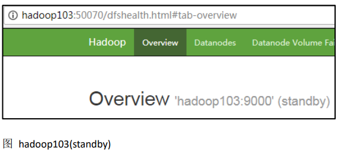
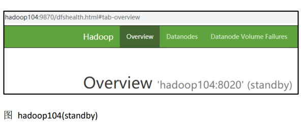
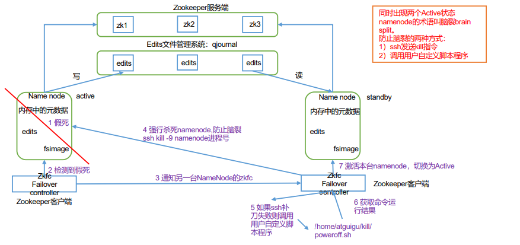

# Hadoop HA 高可用

> 参考[[NameNode HA With QJM](https://hadoop.apache.org/docs/r3.3.6/hadoop-project-dist/hadoop-hdfs/HDFSHighAvailabilityWithQJM.html)]
>
> NFS 方式 [[NFS的命名节点HA](https://hadoop.apache.org/docs/r3.3.6/hadoop-project-dist/hadoop-hdfs/HDFSHighAvailabilityWithNFS.html)]

## 1. HA 概述

（1）所谓 HA（High Availablity），即高可用（7*24 小时不中断服务）。 

（2）实现高可用最关键的策略是消除单点故障。HA 严格来说应该分成各个组件的 HA 机制：HDFS 的 HA 和 YARN 的 HA。 

（3）NameNode 主要在以下两个方面影响 HDFS 集群 

➢ NameNode 机器发生意外，如宕机，集群将无法使用，直到管理员重启 

➢ NameNode 机器需要升级，包括软件、硬件升级，此时集群也将无法使用 

HDFS HA 功能通过配置多个 NameNodes(Active/Standby)实现在集群中对 NameNode 的热备来解决上述问题。如果出现故障，如机器崩溃或机器需要升级维护，这时可通过此种方式将 NameNode 很快的切换到另外一台机器。

## 2.  HDFS-HA 集群搭建

当前 HDFS 集群的规划


HA 的主要目的是消除 namenode 的单点故障,需要将 hdfs 集群规划成以下模样


### 2.1 HDFS-HA 核心问题

1）怎么保证三台 namenode 的数据一致 

- a. Fsimage:让一台 nn 生成数据,让其他机器 nn 同步 

- b. Edits:需要引进新的模块 JournalNode 来保证 edtis 的文件的数据一致性 

2）怎么让同时只有一台 nn 是 active，其他所有是 standby 的

- a.手动分配
- b.自动分配

3）2nn 在 ha 架构中并不存在，定期合并 fsimage 和 edtis 的活谁来

- 由 standby 的 nn 来干

4）如果 nn 真的发生了问题，怎么让其他的 nn 上位干活

- a.手动故障转移 
- b.自动故障转移

## 3 HDFS-HA 手动模式

### 3.1 环境准备

（1）修改 IP 

（2）修改主机名及主机名和 IP 地址的映射 

（3）关闭防火墙 

（4）ssh 免密登录 

（5）安装 JDK，配置环境变量等

### 3.2 规划集群


### 3.3 配置 HDFS-HA 集群

1）官方地址：http://hadoop.apache.org/ 

2）在 opt 目录下创建一个 ha 文件夹

```
[atguigu@hadoop102 ~]$ cd /opt
[atguigu@hadoop102 opt]$ sudo mkdir ha
[atguigu@hadoop102 opt]$ sudo chown atguigu:atguigu /opt/ha
```

3）将/opt/module/下的 hadoop-3.1.3 拷贝到/opt/ha 目录下（记得删除 data 和 log 目录）

```
[atguigu@hadoop102 opt]$ cp -r /opt/module/hadoop-3.1.3 /opt/ha/
```

4）配置 core-site.xml

```
<configuration>
    <!-- 把多个 NameNode 的地址组装成一个集群 mycluster -->
     <property>
         <name>fs.defaultFS</name>
         <value>hdfs://mycluster</value>
     </property>
    <!-- 指定 hadoop 运行时产生文件的存储目录 -->
     <property>
         <name>hadoop.tmp.dir</name>
         <value>/opt/ha/hadoop-3.1.3/data</value>
     </property>
</configuration>
```

5）配置 hdfs-site.xml

```
<configuration>
    <!-- NameNode 数据存储目录 -->
     <property>
         <name>dfs.namenode.name.dir</name>
         <value>file://${hadoop.tmp.dir}/name</value>
     </property>
    <!-- DataNode 数据存储目录 -->
     <property>
         <name>dfs.datanode.data.dir</name>
         <value>file://${hadoop.tmp.dir}/data</value>
     </property>
    <!-- JournalNode 数据存储目录 -->
     <property>
         <name>dfs.journalnode.edits.dir</name>
         <value>${hadoop.tmp.dir}/jn</value>
     </property>
    <!-- 完全分布式集群名称 -->
     <property>
         <name>dfs.nameservices</name>
         <value>mycluster</value>
     </property>
    <!-- 集群中 NameNode 节点都有哪些 -->
     <property>
         <name>dfs.ha.namenodes.mycluster</name>
         <value>nn1,nn2,nn3</value>
     </property>
    <!-- NameNode 的 RPC 通信地址 -->
     <property>
         <name>dfs.namenode.rpc-address.mycluster.nn1</name>
         <value>hadoop102:8020</value>
     </property>
     <property>
         <name>dfs.namenode.rpc-address.mycluster.nn2</name>
         <value>hadoop103:8020</value>
     </property>
     <property>
         <name>dfs.namenode.rpc-address.mycluster.nn3</name>
         <value>hadoop104:8020</value>
     </property>
    <!-- NameNode 的 http 通信地址 -->
     <property>
         <name>dfs.namenode.http-address.mycluster.nn1</name>
         <value>hadoop102:9870</value>
     </property>
     <property>
         <name>dfs.namenode.http-address.mycluster.nn2</name>
         <value>hadoop103:9870</value>
     </property>
     <property>
         <name>dfs.namenode.http-address.mycluster.nn3</name>
         <value>hadoop104:9870</value>
     </property>
    <!-- 指定 NameNode 元数据在 JournalNode 上的存放位置 -->
     <property>
        <name>dfs.namenode.shared.edits.dir</name>
        <value>qjournal://hadoop102:8485;hadoop103:8485;hadoop104:8485/myclus
    	ter</value>
     </property>
    <!-- 访问代理类：client 用于确定哪个 NameNode 为 Active -->
     <property>
         <name>dfs.client.failover.proxy.provider.mycluster</name>
         <value>org.apache.hadoop.hdfs.server.namenode.ha.ConfiguredFailoverProxyProvider</value>
     </property>
    <!-- 配置隔离机制，即同一时刻只能有一台服务器对外响应 -->
     <property>
         <name>dfs.ha.fencing.methods</name>
         <value>sshfence</value>
     </property>
    <!-- 使用隔离机制时需要 ssh 秘钥登录-->
     <property>
         <name>dfs.ha.fencing.ssh.private-key-files</name>
         <value>/home/atguigu/.ssh/id_rsa</value>
     </property>
</configuration>
```

6）分发配置好的 hadoop 环境到其他节点

### 3.4 启动 HDFS-HA 集群

**1）将 HADOOP_HOME 环境变量更改到 HA 目录(三台机器)**

```
[atguigu@hadoop102 ~]$ sudo vim /etc/profile.d/my_env.sh
```

将 HADOOP_HOME 部分改为如下

```
#HADOOP_HOME
export HADOOP_HOME=/opt/ha/hadoop-3.1.3
export PATH=$PATH:$HADOOP_HOME/bin
export PATH=$PATH:$HADOOP_HOME/sbin
```

去三台机器上 source 环境变量

```
atguigu@hadoop102 ~]$source /etc/profile
```

2）在各个 JournalNode 节点上，输入以下命令启动 journalnode 服务

```
[atguigu@hadoop102 ~]$ hdfs --daemon start journalnode
[atguigu@hadoop103 ~]$ hdfs --daemon start journalnode
[atguigu@hadoop104 ~]$ hdfs --daemon start journalnode
```

3）在[nn1]上，对其进行格式化，并启动

```
[atguigu@hadoop102 ~]$ hdfs namenode -format
[atguigu@hadoop102 ~]$ hdfs --daemon start namenode
```

4）在[nn2]和[nn3]上，同步 nn1 的元数据信息

```
[atguigu@hadoop103 ~]$ hdfs namenode -bootstrapStandby
[atguigu@hadoop104 ~]$ hdfs namenode -bootstrapStandby
```

5）启动[nn2]和[nn3]

```
[atguigu@hadoop103 ~]$ hdfs --daemon start namenode
[atguigu@hadoop104 ~]$ hdfs --daemon start namenode
```

6）查看 web 页面显示






7）在所有节点上，启动 datanode

```
[atguigu@hadoop102 ~]$ hdfs --daemon start datanode
[atguigu@hadoop103 ~]$ hdfs --daemon start datanode
[atguigu@hadoop104 ~]$ hdfs --daemon start datanode
```

8）将[nn1]切换为 Active

```
[atguigu@hadoop102 ~]$ hdfs haadmin -transitionToActive nn1
```

9）查看是否 Active

```
[atguigu@hadoop102 ~]$ hdfs haadmin -getServiceState nn1
```

## 4 HDFS-HA 自动模式

### 4.1 HDFS-HA 自动故障转移工作机制

自动故障转移为 HDFS 部署增加了两个新组件：ZooKeeper 和 ZKFailoverController （ZKFC）进程，如图所示。ZooKeeper 是维护少量协调数据，通知客户端这些数据的改变 和监视客户端故障的高可用服务。



### 4.2 HDFS-HA 自动故障转移的集群规划


### 4.3 配置 HDFS-HA 自动故障转移

#### 1）具体配置

（1）在 hdfs-site.xml 中增加

```
<!-- 启用 nn 故障自动转移 -->
<property>
    <name>dfs.ha.automatic-failover.enabled</name>
    <value>true</value>
</property>
```

（2）在 core-site.xml 文件中增加

```
<!-- 指定 zkfc 要连接的 zkServer 地址 -->
<property>
    <name>ha.zookeeper.quorum</name>
    <value>hadoop102:2181,hadoop103:2181,hadoop104:2181</value>
</property>
```

（3）修改后分发配置文件

```
[atguigu@hadoop102 etc]$ pwd
/opt/ha/hadoop-3.1.3/etc
[atguigu@hadoop102 etc]$ xsync hadoop/
```

#### 2）启动

（1）关闭所有 HDFS 服务：

```
[atguigu@hadoop102 ~]$ stop-dfs.sh
```

（2）启动 Zookeeper 集群：

```
[atguigu@hadoop102 ~]$ zkServer.sh start
[atguigu@hadoop103 ~]$ zkServer.sh start
[atguigu@hadoop104 ~]$ zkServer.sh start
```

（3）启动 Zookeeper 以后，然后再初始化 HA 在 Zookeeper 中状态：

```
[atguigu@hadoop102 ~]$ hdfs zkfc -formatZK
```

（4）启动 HDFS 服务：

```
[atguigu@hadoop102 ~]$ start-dfs.sh
```

（5）可以去 zkCli.sh 客户端查看 Namenode 选举锁节点内容：

```
[zk: localhost:2181(CONNECTED) 7] get -s 
/hadoop-ha/mycluster/ActiveStandbyElectorLock
	
	myclusternn2 hadoop103 �>(�>
cZxid = 0x10000000b
ctime = Tue Jul 14 17:00:13 CST 2020
mZxid = 0x10000000b
mtime = Tue Jul 14 17:00:13 CST 2020
pZxid = 0x10000000b
cversion = 0
dataVersion = 0
aclVersion = 0
ephemeralOwner = 0x40000da2eb70000
dataLength = 33
numChildren = 0
```

#### 3）验证

4.3 解决 NN 连接不上 JN 的问题

自动故障转移配置好以后，然后使用 start-dfs.sh 群起脚本启动 hdfs 集群，有可能会遇到 NameNode 起来一会后，进程自动关闭的问题。查看 NameNode 日志，报错信息如下：

```
2020-08-17 10:11:40,658 INFO org.apache.hadoop.ipc.Client: Retrying connect 
to server: hadoop104/192.168.6.104:8485. Already tried 0 time(s); retry 
policy is RetryUpToMaximumCountWithFixedSleep(maxRetries=10, 
sleepTime=1000 MILLISECONDS)
2020-08-17 10:11:40,659 INFO org.apache.hadoop.ipc.Client: Retrying connect 
to server: hadoop102/192.168.6.102:8485. Already tried 0 time(s); retry 
policy is RetryUpToMaximumCountWithFixedSleep(maxRetries=10, 
sleepTime=1000 MILLISECONDS)
2020-08-17 10:11:40,659 INFO org.apache.hadoop.ipc.Client: Retrying connect 
to server: hadoop103/192.168.6.103:8485. Already tried 0 time(s); retry 
policy is RetryUpToMaximumCountWithFixedSleep(maxRetries=10, 
sleepTime=1000 MILLISECONDS)
2020-08-17 10:11:41,660 INFO org.apache.hadoop.ipc.Client: Retrying connect 
to server: hadoop104/192.168.6.104:8485. Already tried 1 time(s); retry 
policy is RetryUpToMaximumCountWithFixedSleep(maxRetries=10, 
sleepTime=1000 MILLISECONDS)
2020-08-17 10:11:41,660 INFO org.apache.hadoop.ipc.Client: Retrying connect 
to server: hadoop102/192.168.6.102:8485. Already tried 1 time(s); retry 
policy is RetryUpToMaximumCountWithFixedSleep(maxRetries=10, 
sleepTime=1000 MILLISECONDS)
2020-08-17 10:11:41,665 INFO org.apache.hadoop.ipc.Client: Retrying connect 
to server: hadoop103/192.168.6.103:8485. Already tried 1 time(s); retry 
policy is RetryUpToMaximumCountWithFixedSleep(maxRetries=10, 
sleepTime=1000 MILLISECONDS)
2020-08-17 10:11:42,661 INFO org.apache.hadoop.ipc.Client: Retrying connect 
to server: hadoop104/192.168.6.104:8485. Already tried 2 time(s); retry 
policy is RetryUpToMaximumCountWithFixedSleep(maxRetries=10, 
sleepTime=1000 MILLISECONDS)
2020-08-17 10:11:42,661 INFO org.apache.hadoop.ipc.Client: Retrying connect 
to server: hadoop102/192.168.6.102:8485. Already tried 2 time(s); retry 
policy is RetryUpToMaximumCountWithFixedSleep(maxRetries=10, 
sleepTime=1000 MILLISECONDS)
2020-08-17 10:11:42,667 INFO org.apache.hadoop.ipc.Client: Retrying connect 
to server: hadoop103/192.168.6.103:8485. Already tried 2 time(s); retry 
policy is RetryUpToMaximumCountWithFixedSleep(maxRetries=10, 
sleepTime=1000 MILLISECONDS)
2020-08-17 10:11:43,662 INFO org.apache.hadoop.ipc.Client: Retrying connect 
to server: hadoop104/192.168.6.104:8485. Already tried 3 time(s); retry 
policy is RetryUpToMaximumCountWithFixedSleep(maxRetries=10, 
sleepTime=1000 MILLISECONDS)
2020-08-17 10:11:43,662 INFO org.apache.hadoop.ipc.Client: Retrying connect 
to server: hadoop102/192.168.6.102:8485. Already tried 3 time(s); retry 
policy is RetryUpToMaximumCountWithFixedSleep(maxRetries=10, 
sleepTime=1000 MILLISECONDS)
2020-08-17 10:11:43,668 INFO org.apache.hadoop.ipc.Client: Retrying connect 
to server: hadoop103/192.168.6.103:8485. Already tried 3 time(s); retry 
policy is RetryUpToMaximumCountWithFixedSleep(maxRetries=10, 
sleepTime=1000 MILLISECONDS)
2020-08-17 10:11:44,663 INFO org.apache.hadoop.ipc.Client: Retrying connect 
to server: hadoop104/192.168.6.104:8485. Already tried 4 time(s); retry 
policy is RetryUpToMaximumCountWithFixedSleep(maxRetries=10, 
sleepTime=1000 MILLISECONDS)
2020-08-17 10:11:44,663 INFO org.apache.hadoop.ipc.Client: Retrying connect 
to server: hadoop102/192.168.6.102:8485. Already tried 4 time(s); retry 
policy is RetryUpToMaximumCountWithFixedSleep(maxRetries=10, 
sleepTime=1000 MILLISECONDS)
2020-08-17 10:11:44,670 INFO org.apache.hadoop.ipc.Client: Retrying connect 
to server: hadoop103/192.168.6.103:8485. Already tried 4 time(s); retry 
policy is RetryUpToMaximumCountWithFixedSleep(maxRetries=10, 
sleepTime=1000 MILLISECONDS)
2020-08-17 10:11:45,467 INFO 
org.apache.hadoop.hdfs.qjournal.client.QuorumJournalManager: Waited 6001 
ms (timeout=20000 ms) for a response for selectStreamingInputStreams. No 
responses yet.
2020-08-17 10:11:45,664 INFO org.apache.hadoop.ipc.Client: Retrying connect 
to server: hadoop102/192.168.6.102:8485. Already tried 5 time(s); retry 
policy is RetryUpToMaximumCountWithFixedSleep(maxRetries=10, 
sleepTime=1000 MILLISECONDS)
2020-08-17 10:11:45,664 INFO org.apache.hadoop.ipc.Client: Retrying connect 
to server: hadoop104/192.168.6.104:8485. Already tried 5 time(s); retry 
policy is RetryUpToMaximumCountWithFixedSleep(maxRetries=10, 
sleepTime=1000 MILLISECONDS)
2020-08-17 10:11:45,672 INFO org.apache.hadoop.ipc.Client: Retrying connect 
to server: hadoop103/192.168.6.103:8485. Already tried 5 time(s); retry 
policy is RetryUpToMaximumCountWithFixedSleep(maxRetries=10, 
sleepTime=1000 MILLISECONDS)
2020-08-17 10:11:46,469 INFO 
org.apache.hadoop.hdfs.qjournal.client.QuorumJournalManager: Waited 7003 
ms (timeout=20000 ms) for a response for selectStreamingInputStreams. No 
responses yet.
2020-08-17 10:11:46,665 INFO org.apache.hadoop.ipc.Client: Retrying connect 
to server: hadoop102/192.168.6.102:8485. Already tried 6 time(s); retry 
policy is RetryUpToMaximumCountWithFixedSleep(maxRetries=10, 
sleepTime=1000 MILLISECONDS)
2020-08-17 10:11:46,665 INFO org.apache.hadoop.ipc.Client: Retrying connect 
to server: hadoop104/192.168.6.104:8485. Already tried 6 time(s); retry 
policy is RetryUpToMaximumCountWithFixedSleep(maxRetries=10, 
sleepTime=1000 MILLISECONDS)
2020-08-17 10:11:46,673 INFO org.apache.hadoop.ipc.Client: Retrying connect 
to server: hadoop103/192.168.6.103:8485. Already tried 6 time(s); retry 
policy is RetryUpToMaximumCountWithFixedSleep(maxRetries=10, 
sleepTime=1000 MILLISECONDS)
2020-08-17 10:11:47,470 INFO 
org.apache.hadoop.hdfs.qjournal.client.QuorumJournalManager: Waited 8004 
ms (timeout=20000 ms) for a response for selectStreamingInputStreams. No 
responses yet.
2020-08-17 10:11:47,666 INFO org.apache.hadoop.ipc.Client: Retrying connect 
to server: hadoop102/192.168.6.102:8485. Already tried 7 time(s); retry 
policy is RetryUpToMaximumCountWithFixedSleep(maxRetries=10, 
sleepTime=1000 MILLISECONDS)
2020-08-17 10:11:47,667 INFO org.apache.hadoop.ipc.Client: Retrying connect 
to server: hadoop104/192.168.6.104:8485. Already tried 7 time(s); retry 
policy is RetryUpToMaximumCountWithFixedSleep(maxRetries=10, 
sleepTime=1000 MILLISECONDS)
2020-08-17 10:11:47,674 INFO org.apache.hadoop.ipc.Client: Retrying connect 
to server: hadoop103/192.168.6.103:8485. Already tried 7 time(s); retry 
policy is RetryUpToMaximumCountWithFixedSleep(maxRetries=10, 
sleepTime=1000 MILLISECONDS)
2020-08-17 10:11:48,471 INFO 
org.apache.hadoop.hdfs.qjournal.client.QuorumJournalManager: Waited 9005 
ms (timeout=20000 ms) for a response for selectStreamingInputStreams. No 
responses yet.
2020-08-17 10:11:48,668 INFO org.apache.hadoop.ipc.Client: Retrying connect 
to server: hadoop102/192.168.6.102:8485. Already tried 8 time(s); retry 
policy is RetryUpToMaximumCountWithFixedSleep(maxRetries=10, 
sleepTime=1000 MILLISECONDS)
2020-08-17 10:11:48,668 INFO org.apache.hadoop.ipc.Client: Retrying connect 
to server: hadoop104/192.168.6.104:8485. Already tried 8 time(s); retry 
policy is RetryUpToMaximumCountWithFixedSleep(maxRetries=10, 
sleepTime=1000 MILLISECONDS)
2020-08-17 10:11:48,675 INFO org.apache.hadoop.ipc.Client: Retrying connect 
to server: hadoop103/192.168.6.103:8485. Already tried 8 time(s); retry 
policy is RetryUpToMaximumCountWithFixedSleep(maxRetries=10, 
sleepTime=1000 MILLISECONDS)
2020-08-17 10:11:49,669 INFO org.apache.hadoop.ipc.Client: Retrying connect 
to server: hadoop102/192.168.6.102:8485. Already tried 9 time(s); retry 
policy is RetryUpToMaximumCountWithFixedSleep(maxRetries=10, 
sleepTime=1000 MILLISECONDS)
2020-08-17 10:11:49,673 INFO org.apache.hadoop.ipc.Client: Retrying connect 
to server: hadoop104/192.168.6.104:8485. Already tried 9 time(s); retry 
policy is RetryUpToMaximumCountWithFixedSleep(maxRetries=10, 
sleepTime=1000 MILLISECONDS)
2020-08-17 10:11:49,676 INFO org.apache.hadoop.ipc.Client: Retrying connect 
to server: hadoop103/192.168.6.103:8485. Already tried 9 time(s); retry 
policy is RetryUpToMaximumCountWithFixedSleep(maxRetries=10, 
sleepTime=1000 MILLISECONDS)
2020-08-17 10:11:49,678 WARN 
org.apache.hadoop.hdfs.server.namenode.FSEditLog: Unable to determine input 
streams from QJM to [192.168.6.102:8485, 192.168.6.103:8485, 
192.168.6.104:8485]. Skipping.
org.apache.hadoop.hdfs.qjournal.client.QuorumException: Got too many 
exceptions to achieve quorum size 2/3. 3 exceptions thrown:
192.168.6.103:8485: Call From hadoop102/192.168.6.102 to hadoop103:8485 
failed on connection exception: java.net.ConnectException: 拒绝连接; For more 
details see: http://wiki.apache.org/hadoop/ConnectionRefused
192.168.6.102:8485: Call From hadoop102/192.168.6.102 to hadoop102:8485 
failed on connection exception: java.net.ConnectException: 拒绝连接; For more 
details see: http://wiki.apache.org/hadoop/ConnectionRefused
192.168.6.104:8485: Call From hadoop102/192.168.6.102 to hadoop104:8485 
failed on connection exception: java.net.ConnectException: 拒绝连接; For more 
details see: http://wiki.apache.org/hadoop/ConnectionRefused
```

查看报错日志，可分析出报错原因是因为 NameNode 连接不上 JournalNode，而利 用 jps 命令查看到三台 JN 都已经正常启动，为什么 NN 还是无法正常连接到 JN 呢？这 是因为 start-dfs.sh 群起脚本默认的启动顺序是先启动 NN，再启动 DN，然后再启动 JN， 并且默认的 rpc 连接参数是重试次数为 10，每次重试的间隔是 1s，也就是说启动完 NN 以后的 10s 中内，JN 还启动不起来，NN 就会报错了。

core-default.xml 里面有两个参数如下：

```
<!-- NN 连接 JN 重试次数，默认是 10 次 -->
<property>
 <name>ipc.client.connect.max.retries</name>
 <value>10</value>
</property>
<!-- 重试时间间隔，默认 1s -->
<property>
 <name>ipc.client.connect.retry.interval</name>
 <value>1000</value>
</property>
```

解决方案：遇到上述问题后，可以稍等片刻，等 JN 成功启动后，手动启动下三台

**NN:**

```
[atguigu@hadoop102 ~]$ hdfs --daemon start namenode
[atguigu@hadoop103 ~]$ hdfs --daemon start namenode
[atguigu@hadoop104 ~]$ hdfs --daemon start namenode
```

也可以在 core-site.xml 里面适当调大上面的两个参数：

```
<!-- NN 连接 JN 重试次数，默认是 10 次 -->
<property>
 <name>ipc.client.connect.max.retries</name>
 <value>20</value>
</property>
<!-- 重试时间间隔，默认 1s -->
<property>
 <name>ipc.client.connect.retry.interval</name>
 <value>5000</value>
</property>
```

### 4.4 HDFS-HA 自动故障转移 客户端如何配置 namenode 的ip

在 HDFS-HA 集群中，客户端需要配置名称节点的 IP 地址，以便连接到 HDFS 集群并进行读写操作。

对于客户端而言，它们需要配置两个名称节点的 IP 地址，一个是主名称节点的 IP 地址，另一个是备用名称节点的 IP 地址。这样，当主名称节点出现故障时，客户端可以通过备用名称节点的 IP 地址连接到 HDFS 集群，保证数据的可用性。

具体的配置方法如下：

- 1.在客户端的配置文件中，添加如下的配置项：

```
fs.defaultFS: hdfs://<ha-namenode-IP-address>:<port>/
dfs.ha.namenodes: <ha-namenode-IP-address>:<port>,<ha-standby-namenode-IP-address>:<port>
```


其中，`<ha-namenode-IP-address>`和`<ha-standby-namenode-IP-address>`分别表示主名称节点和备用名称节点的 IP 地址，`<port>`表示 HDFS 集群的端口号。


- 2.对于需要访问 HDFS 集群的应用程序，需要使用上述配置项指定 HDFS 集群的名称节点地址。例如，在 Java 程序中，可以使用如下的代码进行配置：

```
FileSystem.get(URI.create(“hdfs://<ha-namenode-IP-address>:<port>/“)).listFiles(“path”)
```

通过上述配置和代码，客户端可以连接到 HDFS-HA 集群，并在主名称节点和备用名称节点之间进行切换，以保证数据的可用性。当主名称节点出现故障时，客户端可以通过备用名称节点的 IP 地址连接到 HDFS 集群，继续进行读写操作。

### 4.5 ZooKeeper failover controller（ZKFC）

HDFS-HA 使用 ZooKeeper 作为其高可用性（HA）的协调器。然而，为了确保 NameNode 在故障转移期间正确地同步数据，还需要一个名为 ZooKeeper failover controller（ZKFC）的组件。


ZKFC 是一个守护进程，负责监测 NameNode 和 ZooKeeper 的状态，并在 NameNode 故障时触发故障转移。它的主要功能是：


1. 监测 NameNode 和 ZooKeeper 的状态：ZKFC 定期检查 NameNode 和 ZooKeeper 的状态，以确保它们都在正常运行。
2. 检测 NameNode 故障：如果 NameNode 停止响应或无法连接，ZKFC 将检测到故障。
3. 触发故障转移：一旦检测到 NameNode 故障，ZKFC 将触发故障转移，将备用 NameNode 切换为新的主 NameNode。
4. 同步数据：在故障转移期间，ZKFC 将确保备用 NameNode 正确地同步数据，以确保数据的一致性。

因此，虽然 ZooKeeper 是 HDFS-HA 的协调器，但 ZKFC 仍然是必不可少的，因为它确保了 NameNode 在故障转移期间正确地同步数据，从而确保了 HDFS 的高可用性。

# YARN-HA 配置

## 5.1 YARN-HA 工作机制

1）官方文档： http://hadoop.apache.org/docs/r3.1.3/hadoop-yarn/hadoop-yarn-site/ResourceManagerHA.html

2）YARN-HA 工作机制


## 5.2 配置 YARN-HA 集群

### 1）环境准备 

（1）修改 IP 

（2）修改主机名及主机名和 IP 地址的映射 

（3）关闭防火墙 

（4）ssh 免密登录 

（5）安装 JDK，配置环境变量等 

（6）配置 Zookeeper 集群

### 2）规划集群


### **3）核心问题** 

- a .如果当前 active rm 挂了，其他 rm 怎么将其他 standby rm 上位 

​    核心原理跟 hdfs 一样，利用了 zk 的临时节点 

- b. 当前 rm 上有很多的计算程序在等待运行,其他的 rm 怎么将这些程序接手过来接着跑 

​	rm 会将当前的所有计算程序的状态存储在 zk 中,其他 rm 上位后会去读取，然后接着跑

### 4）具体配置

（1）yarn-site.xml

```
<configuration>
 <property>
     <name>yarn.nodemanager.aux-services</name>
     <value>mapreduce_shuffle</value>
 </property>
 <!-- 启用 resourcemanager ha -->
 <property>
     <name>yarn.resourcemanager.ha.enabled</name>
     <value>true</value>
 </property>
 <!-- 声明两台 resourcemanager 的地址 -->
 <property>
     <name>yarn.resourcemanager.cluster-id</name>
     <value>cluster-yarn1</value>
 </property>
 <!--指定 resourcemanager 的逻辑列表-->
 <property>
     <name>yarn.resourcemanager.ha.rm-ids</name>
     <value>rm1,rm2,rm3</value>
</property>
<!-- ========== rm1 的配置 ========== -->
<!-- 指定 rm1 的主机名 -->
 <property>
     <name>yarn.resourcemanager.hostname.rm1</name>
     <value>hadoop102</value>
</property>
<!-- 指定 rm1 的 web 端地址 -->
<property>
     <name>yarn.resourcemanager.webapp.address.rm1</name>
     <value>hadoop102:8088</value>
</property>
<!-- 指定 rm1 的内部通信地址 -->
<property>
     <name>yarn.resourcemanager.address.rm1</name>
     <value>hadoop102:8032</value>
</property>
<!-- 指定 AM 向 rm1 申请资源的地址 -->
<property>
     <name>yarn.resourcemanager.scheduler.address.rm1</name> 
     <value>hadoop102:8030</value>
</property>
<!-- 指定供 NM 连接的地址 --> 
<property>
     <name>yarn.resourcemanager.resource-tracker.address.rm1</name>
     <value>hadoop102:8031</value>
</property>
<!-- ========== rm2 的配置 ========== -->
 <!-- 指定 rm2 的主机名 -->
 <property>
     <name>yarn.resourcemanager.hostname.rm2</name>
     <value>hadoop103</value>
</property>
<property>
     <name>yarn.resourcemanager.webapp.address.rm2</name>
     <value>hadoop103:8088</value>
</property>
<property>
     <name>yarn.resourcemanager.address.rm2</name>
     <value>hadoop103:8032</value>
</property>
<property>
     <name>yarn.resourcemanager.scheduler.address.rm2</name>
     <value>hadoop103:8030</value>
</property>
<property>
     <name>yarn.resourcemanager.resource-tracker.address.rm2</name>
     <value>hadoop103:8031</value>
</property>
<!-- ========== rm3 的配置 ========== -->
<!-- 指定 rm1 的主机名 -->
 <property>
     <name>yarn.resourcemanager.hostname.rm3</name>
     <value>hadoop104</value>
</property>
<!-- 指定 rm1 的 web 端地址 -->
<property>
     <name>yarn.resourcemanager.webapp.address.rm3</name>
     <value>hadoop104:8088</value>
</property>
<!-- 指定 rm1 的内部通信地址 -->
<property>
     <name>yarn.resourcemanager.address.rm3</name>
     <value>hadoop104:8032</value>
</property>
<!-- 指定 AM 向 rm1 申请资源的地址 -->
<property>
     <name>yarn.resourcemanager.scheduler.address.rm3</name> 
     <value>hadoop104:8030</value>
</property>
<!-- 指定供 NM 连接的地址 --> 
<property>
     <name>yarn.resourcemanager.resource-tracker.address.rm3</name>
     <value>hadoop104:8031</value>
</property>
 <!-- 指定 zookeeper 集群的地址 --> 
 <property>
     <name>yarn.resourcemanager.zk-address</name>
     <value>hadoop102:2181,hadoop103:2181,hadoop104:2181</value>
 </property>
 <!-- 启用自动恢复 --> 
 <property>
     <name>yarn.resourcemanager.recovery.enabled</name>
     <value>true</value>
 </property>
 <!-- 指定 resourcemanager 的状态信息存储在 zookeeper 集群 --> 
 <property>
     <name>yarn.resourcemanager.store.class</name> 
    <value>org.apache.hadoop.yarn.server.resourcemanager.recovery.ZKRMStateSt
    ore</value>
</property>
<!-- 环境变量的继承 -->
<property>
 <name>yarn.nodemanager.env-whitelist</name>
 
<value>JAVA_HOME,HADOOP_COMMON_HOME,HADOOP_HDFS_HOME,HADOOP_CONF_DIR,CLAS
SPATH_PREPEND_DISTCACHE,HADOOP_YARN_HOME,HADOOP_MAPRED_HOME</value>
 </property>
</configuration>
```

（2）同步更新其他节点的配置信息，分发配置文件

```
[atguigu@hadoop102 etc]$ xsync hadoop/
```

### 5）启动 YARN

（1）在 hadoop102 或者 hadoop103 中执行：

```
[atguigu@hadoop102 ~]$ start-yarn.sh
```

（2）查看服务状态

```
[atguigu@hadoop102 ~]$ yarn rmadmin -getServiceState rm1
```

（3）可以去 zkCli.sh 客户端查看 ResourceManager 选举锁节点内容：

```
[atguigu@hadoop102 ~]$ zkCli.sh
[zk: localhost:2181(CONNECTED) 16] get -s 
/yarn-leader-election/cluster-yarn1/ActiveStandbyElectorLock
cluster-yarn1rm1
cZxid = 0x100000022
ctime = Tue Jul 14 17:06:44 CST 2020
mZxid = 0x100000022
mtime = Tue Jul 14 17:06:44 CST 2020
pZxid = 0x100000022
cversion = 0
dataVersion = 0
aclVersion = 0
ephemeralOwner = 0x30000da33080005
dataLength = 20
numChildren = 
```

（4）web 端查看 hadoop102:8088 和 hadoop103:8088 的 YARN 的状态


