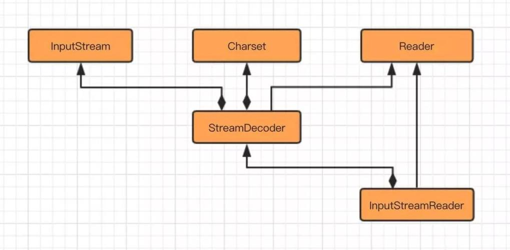

## 一、摘要

在之前的文章中，我们了解到在 Java I/O 体系中，**File 类是唯一代表磁盘文件本身的对象**。

File 类定义了一些与平台无关的方法来操作文件，包括检查一个文件是否存在、创建、删除文件、重命名文件、判断文件的读写权限是否存在、设置和查询文件的最近修改时间等等操作。

值得注意的地方是，**Java 中通常的 File 并不代表一个真实存在的文件对象，当你通过指定一个路径描时，它就会返回一个代表这个路径相关联的一个虚拟对象，这个可能是一个真实存在的文件或者是一个包含多个文件的目录**。

下面我们一起来看看 File 类有哪些操作方法，以及实际使用过程中如何避坑。

## 二、File 类介绍

大家 JDK 中源代码，你会发现 File 类没有无参构造方法，最常用的是使用下面的构造方法来生成 File 对象。

以 windows 操作系统为例，操作文件的方式如下！

```
// 指定一个完整路径，获取文件对象
File file = new File("D:\\Files\\test.txt");
System.out.println(file1.getName());

// 指定一个父文件路径和子文件名称，获取文件对象
File file = new File("D:\\Files", "test.txt");
System.out.println(file2.getName());
```

File 类中定义了很多关于 File 对象的一些操作方法，我们通过一段代码一起来看看。

```
public static void main(String[] args) throws Exception {
    // 指定一个文件完整路径，获取文件对象
    File file = new File("D:\\Files\\test.txt");

    // 获取文件父节点目录对象
    File parentFile = file.getParentFile();

    // 判断指定路径的文件目录是否存在
    if(parentFile.exists()){
        System.out.println("文件目录存在");
    } else {
        // 创建文件夹，可以自动创建多级文件夹
        parentFile.mkdirs();
        System.out.println("文件目录不存在，创建一个文件目录");
    }

    // 判断指定父节点路径的是否是一个目录
    if(parentFile.isDirectory()){
        System.out.println("父节点路径是一个目录");
    }

    // 判断指定路径的文件是否存在
    if(file.exists()){
        System.out.println("文件存在");
    } else {
        // 创建文件
        file.createNewFile();
        System.out.println("文件不存在，创建一个文件");
    }

    // 获取目录下的所有文件/文件夹（仅该层路径下）
    File[] files = parentFile.listFiles();
    System.out.print("路径下有文件：");
    for (File f : files) {
        System.out.print(f + "；");
    }
    System.out.println();

    // 获取文件名、文件夹名
    System.out.println("files[0]的文件名：" + files[0].getName());
    // 获取文件、文件夹路径
    System.out.println("files[0]的文件路径：" + files[0].getPath());
    // 获取文件、文件夹绝对路径
    System.out.println("files[0]的绝对路径：" + files[0].getAbsolutePath());
    // 获取文件父目录路径
    System.out.println("files[0]的父文件夹名：" + files[0].getParent());
    // 判断文件、文件夹是否存在
    System.out.println(files[0].exists() ? "files[0]的存在" : "files[0]的不存在");
    // 判断文件是否可写
    System.out.println(files[0].canWrite() ? "files[0]的可写" : "files[0]的不可写");
    // 判断文件是否可读
    System.out.println(files[0].canRead() ? "files[0]的可读" : "files[0]的不可读");
    // 判断文件是否可执行
    System.out.println(files[0].canExecute() ? "file[0]可执行" : "file[0]不可执行");
    // 判断文件、文件夹是不是目录
    System.out.println(files[0].isDirectory() ? "files[0]的是目录" : "files[0]的不是目录");
    // 判断拿文件、文件夹是不是标准文件
    System.out.println(files[0].isFile() ? "files[0]的是文件" : "files[0]的不是文件");
    // 判断路径名是不是绝对路径
    System.out.println(files[0].isAbsolute() ? "files[0]的路径名是绝对路径" : "files[0]的路径名不是绝对路径");
    // 获取文件、文件夹上一次修改时间
    System.out.println("files[0]的最后修改时间：" + files[0].lastModified());
    // 获取文件的字节数，如果是一个文件夹则这个值为0
    System.out.println("files[0]的大小：" + files[0].length() + " Bytes");
    // 获取文件路径URI后的路径名
    System.out.println("files[0]的路径转换为URI：" + files[0].toURI());

    // 下面的代码逻辑，假设目录下有3个以上文件

    // 对文件重命名
    File newfile = new File(file.getParentFile(), "22.txt");  //新的文件名称
    files[0].renameTo(newfile);

    // 删除指定的文件、文件夹
    files[1].delete();

    // 当虚拟机终止时删除指定的文件、文件夹
    files[2].deleteOnExit();
}
```

输出结果如下：

```
文件目录存在
父节点路径是一个目录
文件存在
路径下有文件：D:\Files\1.txt；D:\Files\2.txt；D:\Files\3.txt；
files[0]1.txt
files[0]的文件路径：D:\Files\1.txt
files[0]的绝对路径：D:\Files\1.txt
files[0]的父文件夹名：D:\Files
files[0]的存在
files[0]的可写
files[0]的可读
file[0]不可执行
files[0]的不是目录
files[0]的是文件
files[0]的路径名是绝对路径
files[0]的最后修改时间：1686814709000
files[0]的大小：8 Bytes
files[0]的路径转换为URI：file:/D:/Files/1.txt
```

示例代码中，基本比较全面地演示了 File 的一些基本用法，比如文件或者文件夹的新增、重命名、删除，以及获取文件或者文件夹相关信息等操作。

其中有两点地方，值得注意：

- **第一个就是分隔符的问题。不同的操作系统，路径分隔符是不一样的，这个可以通过`File.separator`解决，具体实现看下面**

- **第二个就是删除的如果是一个文件夹的话，文件夹下还有文件 / 文件夹，是无法删除成功的**

关于不同操作系统下的路径符号问题解决办法！（windows->“\”;Linux->“/”）

在实际的编程过程中，我们不可能为了区分操作系统，然后又单独写一份文件路径。

可以通过`File.separator`来实现跨平台的编程逻辑，`File.separator`会根据不同的操作系统取不同操作系统下的分隔符。

以上面的示范代码为例，我们可以对写法进行如下改造！

```
// windows 系统下的文件绝对路径定义方式
String path = "d:"+File.separator +"Files"+File.separator+"text.txt";
File file = new File(path);
```

文件的路径结果会与预期一致！

## 三、文件的读写操作

对文件的读写，可以通过字节流或者字符流接口来完成，但不管哪种方式，大致分以下几个步骤完成。

- 第一步：获取一个文件 file 对象

- 第二步：通过 file 对象，获取一个字节流或者字符流接口的对象，进行读写操作

- 第三步：关闭文件流

具体的代码实践如下！

#### 3.1、通过字节流接口写入

字节流接口的文件写入，可以通过`OutputStream`下的子类`FileOutputStream`来实现文件的数据写入操作。

具体实例如下：

```
// 创建一个 readWriteDemo.txt 文件
File file = new File("readWriteDemo.txt");
if(!file.exists()){
    file.createNewFile();
}

// 向文件中写入数据(这种方式会覆盖原始数据)
OutputStream outputStream = new FileOutputStream(file);
String str = "我们一起学习Java";
outputStream.write(str.getBytes(StandardCharsets.UTF_8));
outputStream.close();
```

上面的操作方式会覆盖原始数据，如果想在已有的文件里面，进行追加写入数据，可以如下方式实现。

```
// 追加数据写入(这种方式不会覆盖原始数据)
OutputStream appendOutputStream = new FileOutputStream(file, true);
String str = "-----这是追加的内容------";
appendOutputStream.write(str.getBytes(StandardCharsets.UTF_8));
appendOutputStream.close();
```

#### 3.2、通过字节流接口读取

字节流方式的文件读取，可以通过`InputStream`下的子类`FileInputStream`来实现文件的数据读取操作。

具体实例如下：

```
// 获取 readWriteDemo.txt 文件
File file = new File("readWriteDemo.txt");
if(file.exists()){
    // 获取文件流
    InputStream input = new FileInputStream(file);

    // 临时区
    byte[] buffer = new byte[1024];

    // 分次读取数据，每次最多读取1024个字节，将数据读取到临时区之中，同时返回读取的字节个数，如果遇到文件末尾，会返回-1
    int len;
    while ((len = input.read(buffer)) > -1) {
        // 字节转为字符串
        String msg = new String(buffer, 0, len, StandardCharsets.UTF_8);
        System.out.println(msg);
    }

    // 数据读取完毕之后，关闭输入流
    input.close();
}
```

#### 3.3、通过字符流接口写入

在之前的文章中，我们了解到为了简化字符的数据传输操作，JDK 提供了 Writer 与 Reader 字符流接口。

字符流方式的文件写入，可以通过`Writer`下的子类`FileWriter`来实现文件的数据写入操作。

具体实例如下：

```
// 创建一个 newReadWriteDemo.txt 文件
File file = new File("newReadWriteDemo.txt");
if(!file.exists()){
    file.createNewFile();
}
// 实例化Writer类对象
Writer out = new FileWriter(file) ;
// 输出字符串
out.write("Hello");
// 输出换行
out.write("\n");
// 追加信息，append 方法底层本质调用的是 write 方法
out.append("我们一起来学习Java");

// 关闭输出流
out.close();
```

#### 3.4、通过字符流接口读取

字符流方式的文件读取，可以通过`Reader`下的子类`FileReader`来实现文件的数据读取操作。

具体实例如下：

```
// 创建一个 newReadWriteDemo.txt 文件
File file = new File("newReadWriteDemo.txt");
if(file.exists()){
    // 实例化输入流
    Reader reader = new FileReader(file);
    // 临时区
    char[] buffer = new char[1024];

    // 分次读取数据，每次最多读取1024个字符，将数据读取到临时区之中，同时返回读取的字节个数，如果遇到文件末尾，会返回-1
    int len;
    while ((len = reader.read(buffer)) > -1) {
        // 字符转为字符串
        String msg = new String(buffer, 0, len);
        System.out.println(msg);
    }

    // 关闭输入流
    reader.close();
}
```

#### 3.5、文件拷贝

在实际的软件开发过程中，避免不了文件拷贝。通过以上的接口方法，我们可以很容易的写出一个文件复制的方法。

比如以字节流操作为例，具体实例如下：

```
// 1. 创建一个字节数组作为数据读取的临时区
byte[] buffer = new byte[1024];
// 2. 创建一个 FileInputStream 对象用于读取文件
InputStream input = new FileInputStream(new File("input.txt"));
// 3. 创建一个 FileOutputStream 对象用于写入文件
OutputStream output = new FileOutputStream(new File("output.txt"));
// 4. 循环读取文件内容到临时区，并将临时区中的数据写入到输出文件中
int length;
while ((length = input.read(buffer)) != -1) {
    output.write(buffer, 0, length);
}
// 5. 关闭输入流
input.close();
// 6. 关闭输出流
output.close()
```

除此之外，JDK 也支持采用**缓存流读写技术来实现数据的高效读写**。

之所为高效，是因为字节缓冲流内部维护了一个缓冲区，读写时先将数据存入缓冲区中，当缓冲区满时再将数据一次性读取出来或者写入进去，这样可以减少与磁盘实际的 I/O 操作次数，可以显著提升读写操作的效率。

比如以字节流缓冲流为例，包装类分别是：**BufferedInputStream（字节缓存输入流） 和 BufferedOutputStream（字符缓存输入流）**。

采用缓冲流拷贝文件，具体实例如下：

```
// 1. 创建一个字节数组作为数据读取的临时区
byte[] buffer = new byte[1024];
// 2. 创建一个 BufferedInputStream 缓存输入流对象用于读取文件
InputStream bis = new BufferedInputStream(new FileInputStream(new File("input.txt")));
// 3. 创建一个 BufferedOutputStream 缓存输出流对象用于写入文件
OutputStream bos = new BufferedOutputStream(new FileOutputStream(new File("output.txt")));

// 4. 循环读取文件内容到临时区，并将缓冲区中的数据写入到输出文件中
int length;
while ((length = bis.read(buffer)) != -1) {
    bos.write(buffer, 0, length);
}
// 5. 关闭输入流
bis.close();
// 6. 关闭输出流
bos.close();
```

**在大文件的拷贝中，使用缓存流比不使用缓存流技术至少快 10 倍**，耗时是很明显的，大家可以亲自试一下。

## 四、字节流与字符流的互转

在之前的文章中，我们了解到字节流与字符流，两者其实是可以互转的。

其中 InputStreamReader 和 OutputStreamWriter 就是转化桥梁。

#### 4.1、字节流转字符流的操作

字节流转字符流的操作，主要体现在数据的读取阶段，转化过程如下图所示：



以上文中的字节流接口读取文件为例，如果我们想要转换字符流接口来读取数据，具体的操作方式如下：

```
// 获取 readWriteDemo.txt 文件
File file = new File("readWriteDemo.txt");
if(file.exists()){
    // 获取字节输入流
    InputStream inputStream = new FileInputStream(file);
    // 转字符流输入流，指定 UTF_8 编码规则，读取数据
    Reader reader = new InputStreamReader(inputStream, StandardCharsets.UTF_8);

    // 缓冲区
    char[] buffer = new char[1024];

    // 分次读取数据，每次最多读取1024个字符，将数据读取到缓冲区之中，同时返回读取的字节个数
    int len;
    while ((len = reader.read(buffer)) > -1) {
        // 字符转为字符串
        String msg = new String(buffer, 0, len);
        System.out.println(msg);
    }

    // 关闭输入流
    reader.close();
    inputStream.close();
}
```

当读取数据的时候，先通过字节流读取，再转成字符流读取。

字节流转字符流，需要指定编码规则，如果没有指定，会取当系统默认的编码规则。

#### 4.2、字符流转字节流的操作

字符流转字节流的操作，主要体现在数据的写入阶段，转化过程如下图所示：


以上文中的字节流接口写入文件为例，如果我们想要转换字符流接口来写入数据，具体的操作方式如下：

```
// 创建一个 newReadWriteDemo.txt 文件
File file = new File("readWriteDemo.txt");
if(!file.exists()){
    file.createNewFile();
}

// 获取字节输出流
OutputStream outputStream = new FileOutputStream(file);
// 转字符流输出流，指定 UTF_8 编码规则,写入数据
Writer out = new OutputStreamWriter(outputStream, StandardCharsets.UTF_8);
// 输出字符串
out.write("Hello");
// 输出换行
out.write("\n");
// 追加信息，append 方法底层本质调用的是 write 方法
out.append("我们一起来学习Java");

// 关闭输出流
out.close();
outputStream.close();
```

同样的，当写入数据的时候，先通过字符流写入，再转成字节流输出。

字符流转字节流，也需要指定编码规则，如果没有指定，会取当系统默认的编码规则。
