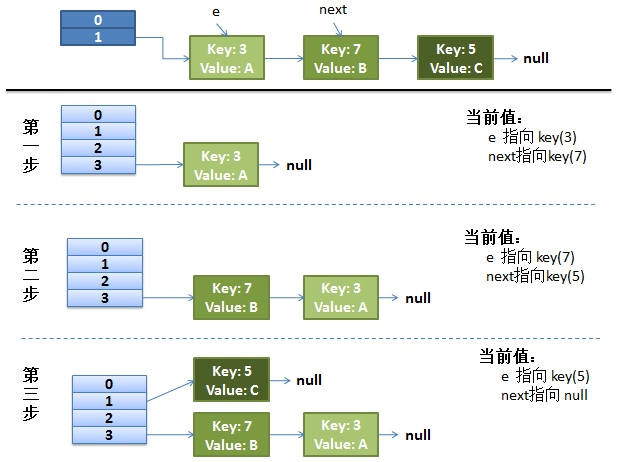
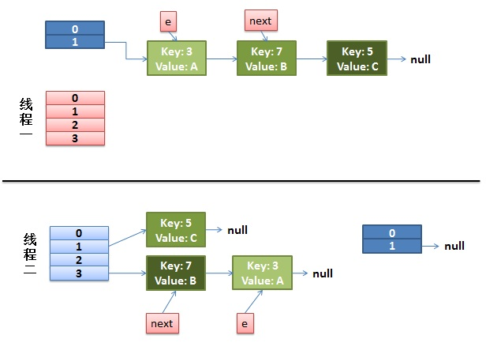
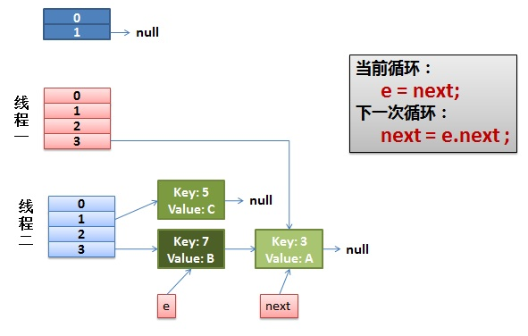
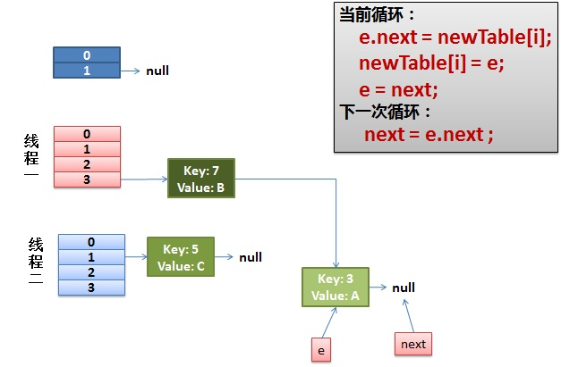
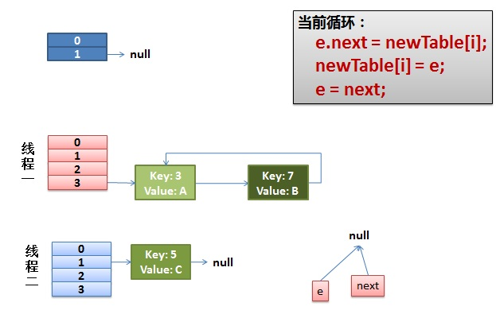

Java 的 HashMap 是非线程安全的。多线程下应该用 ConcurrentHashMap。

多线程下[HashMap]的问题（这里主要说死循环问题）：

- 多线程 put 操作后，get 操作导致死循环。
- 多线程 put 非 NULL 元素后，get 操作得到 NULL 值。
- 多线程 put 操作，导致元素丢失。

### 1、为何出现死循环？（在多线程下使用非线程安全的 HashMap，单线程根本不会出现）

- HashMap 是采用链表解决 Hash 冲突，**因为是链表结构，那么就很容易形成闭合的链路**，这样在循环的时候只要有线程对这个 HashMap 进行 get 操作就会产生死循环。
- 在单线程情况下，只有一个线程对 HashMap 的数据结构进行操作，是不可能产生闭合的回路的。
- 那就只有在多线程并发的情况下才会出现这种情况，那就是在 put 操作的时候，如果`size>initialCapacity*loadFactor`，那么这时候 HashMap 就会进行 rehash 操作，随之 HashMap 的结构就会发生翻天覆地的变化。很有可能就是在两个线程在这个时候同时触发了 rehash 操作，产生了闭合的回路。

### 2、如何产生的：

存储数据`put()`：

```
 public V put(K key, V value)
 {
  ......
  //算Hash值
  int hash = hash(key.hashCode());
  int i = indexFor(hash, table.length);
  //如果该key已被插入，则替换掉旧的value （链接操作）
  for (Entry<K,V> e = table[i]; e != null; e = e.next) {
   Object k;
   if (e.hash == hash && ((k = e.key) == key || key.equals(k))) {
    V oldValue = e.value;
    e.value = value;
    e.recordAccess(this);
    return oldValue;
   }
  }
  modCount++;
  //该key不存在，需要增加一个结点
  addEntry(hash, key, value, i);
  return null;
 }
```

当我们往 HashMap 中 put 元素的时候，先根据 key 的 hash 值得到这个元素在数组中的位置（即下标），然后就可以把这个元素放到对应的位置中了。

如果这个元素所在的位置上已经存放有其他元素了，那么在同一个位子上的元素将以链表的形式存放，新加入的元素放在链头，而先前加入的放在链尾。

检查容量是否超标 addEntry：

```
 void addEntry(int hash, K key, V value, int bucketIndex)
 {
  Entry<K,V> e = table[bucketIndex];
  table[bucketIndex] = new Entry<K,V>(hash, key, value, e);
  //查看当前的size是否超过了我们设定的阈值threshold，如果超过，需要resize
  if (size++ >= threshold)
   resize(2 * table.length);
 }
```

如果现在 size 已经超过了 threshold，那么就要进行 resize 操作,新建一个更大尺寸的 hash 表，然后把数据从老的 Hash 表中迁移到新的 Hash 表中。

调整 Hash 表大小 resize：

```
 void resize(int newCapacity)
 {
  Entry[] oldTable = table;
  int oldCapacity = oldTable.length;
  ......
  //创建一个新的Hash Table
  Entry[] newTable = new Entry[newCapacity];
  //将Old Hash Table上的数据迁移到New Hash Table上
  transfer(newTable);
  table = newTable;
  threshold = (int)(newCapacity * loadFactor);
 }
```

当 table[]数组容量较小，容易产生哈希碰撞，所以，Hash 表的尺寸和容量非常的重要。

一般来说，Hash 表这个容器当有数据要插入时，都会检查容量有没有超过设定的 thredhold，如果超过，需要增大 Hash 表的尺寸，这个过程称为 resize。

多个线程同时往 HashMap 添加新元素时，多次 resize 会有一定概率出现死循环，因为每次 resize 需要把旧的数据映射到新的哈希表，这一部分代码在`HashMap#transfer()` 方法，如下：

```
 void transfer(Entry[] newTable)
 {
  Entry[] src = table;
  int newCapacity = newTable.length;
  //下面这段代码的意思是：
  //  从OldTable里摘一个元素出来，然后放到NewTable中
  for (int j = 0; j < src.length; j++) {
   Entry<K,V> e = src[j];
   if (e != null) {
    src[j] = null;
    do {
     Entry<K,V> next = e.next;//取出第一个元素
     int i = indexFor(e.hash, newCapacity);
     e.next = newTable[i];
     newTable[i] = e;
     e = next;
    } while (e != null);
   }
  }
 }
```

标红代码是导致多线程使用 hashmap 出现 CUP 使用率骤增，出现死循环，从而多个线程阻塞的罪魁祸首。

### 3、图解 HashMap 死循环：

正常的 ReHash 的过程（单线程）：假设了我们的 hash 算法就是简单的用 key mod 一下表的大小（也就是数组的长度）。

最上面的是 old hash 表，其中的 Hash 表的 size=2, 所以`key = 3, 7, 5`，在 mod 2 以后都冲突在`table[1]`这里了。接下来的三个步骤是 Hash 表 resize 成 4，然后所有的`<key,value>` 重新 rehash 的过程。



并发下的 Rehash（多线程）

**1）假设我们有两个线程。**

```
 do {
  Entry<K,V> next = e.next; // <--假设线程一执行到这里就被调度挂起了，执行其他操作
  int i = indexFor(e.hash, newCapacity);
  e.next = newTable[i];
  newTable[i] = e;
  e = next;
 } while (e != null);
```

而我们的线程二执行完成了。于是我们有下面的这个样子：



> 注意，因为 Thread1 的 e 指向了 key(3)，而 next 指向了 key(7)，其在线程二 rehash 后，指向了线程二重组后的链表。我们可以看到链表的顺序被反转后。在这里线程一变成了操作经过线程二操作后的 HashMap。

**2）线程一被调度回来执行。**

- 先是执行 `newTalbe[i] = e;`
- 然后是`e = next`，导致了 e 指向了`key(7)`，
- 而下一次循环的`next = e.next`导致了 next 指向了`key(3)`。



**3）一切安好。**

线程一接着工作。把`key(7)`摘下来，放到`newTable[i]`的第一个，然后把 e 和 next 往下移。这个元素所在的位置上已经存放有其他元素了，那么在同一个位子上的元素将以链表的形式存放，新加入的放在链头，而先前加入的放在链尾。



**4）环形链接出现。**

`e.next = newTable[i]` 导致 `key(3).next` 指向了 `key(7)`。

> 注意：此时的`key(7).next` 已经指向了`key(3)`， 环形链表就这样出现了。



于是，当我们的线程一调用到，`HashTable.get(11)`时，悲剧就出现了——Infinite Loop。

这里介绍了在多线程下为什么 HashMap 会出现死循环，不过在真实的生产环境下，不会使用线程不安全的 HashMap 的。
