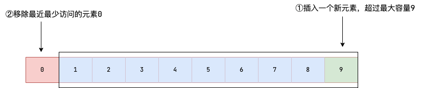
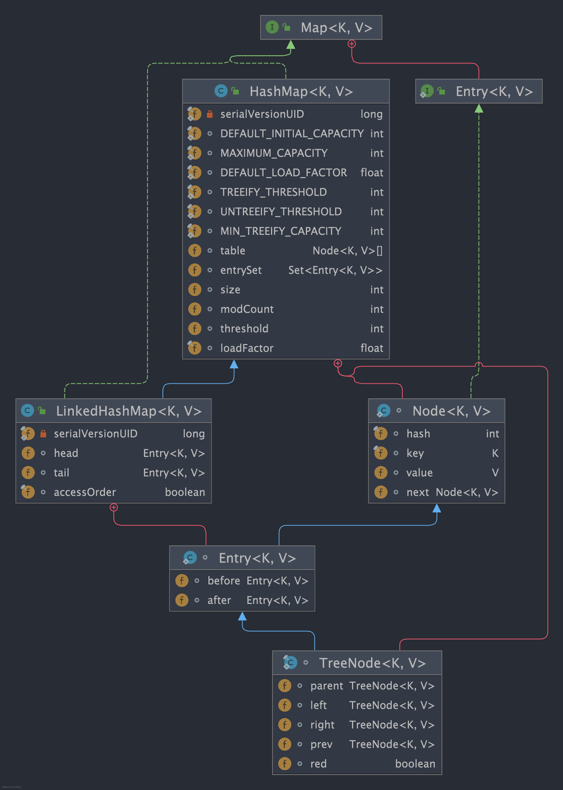

## LinkedHashMap 简介

[https://javaguide.cn/java/collection/linkedhashmap-source-code.html](https://javaguide.cn/java/collection/linkedhashmap-source-code.html)

LinkedHashMap 是 Java 提供的一个集合类，它继承自 HashMap，并在 HashMap 基础上<b>维护一条双向链表</b>，使得具备如下特性:

1. 支持遍历时会按照插入顺序有序进行迭代。
2. 支持按照元素访问顺序排序,适用于封装 LRU 缓存工具。
3. 因为内部使用双向链表维护各个节点，所以遍历时的效率和元素个数成正比，相较于和容量成正比的 HashMap 来说，迭代效率会高很多。

> LinkedHashMap 逻辑结构如下图所示，它是在 HashMap 基础上在各个节点之间维护一条双向链表，使得原本散列在不同 bucket 上的节点、链表、红黑树有序关联起来。


## 访问顺序遍历

`LinkedHashMap` 定义了排序模式 `accessOrder`(boolean 类型，默认为 false)，访问顺序则为 true，插入顺序则为 false。

为了实现访问顺序遍历，我们可以使用传入 `accessOrder` 属性的 `LinkedHashMap` 构造方法，并将 `accessOrder` 设置为 true，表示其具备访问有序性。 

```java
LinkedHashMap<Integer, String> map = new LinkedHashMap<>(16, 0.75f, true);
map.put(1, "one");
map.put(2, "two");
map.put(3, "three");
map.put(4, "four");
map.put(5, "five");
//访问元素2,该元素会被移动至链表末端
map.get(2);
//访问元素3,该元素会被移动至链表末端
map.get(3);
for (Map.Entry<Integer, String> entry : map.entrySet()) {
    System.out.println(entry.getKey() + " : " + entry.getValue());
}
```

输出：

```
1 : one
4 : four
5 : five
2 : two
3 : three
```

可以看出，`LinkedHashMap` 的迭代顺序是和访问顺序一致的。

## LRU 缓存

从上一个我们可以了解到通过 `LinkedHashMap` 我们可以封装一个简易版的 LRU（**L**east **R**ecently **U**sed，最近最少使用） 缓存，确保当存放的元素超过容器容量时，将最近最少访问的元素移除。



具体实现思路如下：

- 继承 `LinkedHashMap`;
- 构造方法中指定 `accessOrder` 为 true ，这样在访问元素时就会把该元素移动到链表尾部，链表首元素就是最近最少被访问的元素；
- 重写`removeEldestEntry` 方法，该方法会返回一个 boolean 值，告知 `LinkedHashMap` 是否需要移除链表首元素（缓存容量有限）。


```
public class LRUCache<K, V> extends LinkedHashMap<K, V> {
    private final int capacity;

    public LRUCache(int capacity) {
        super(capacity, 0.75f, true);
        this.capacity = capacity;
    }

    /**
     * 判断size超过容量时返回true，告知LinkedHashMap移除最老的缓存项(即链表的第一个元素)
     */
    @Override
    protected boolean removeEldestEntry(Map.Entry<K, V> eldest) {
        return size() > capacity;
    }
}
```




## LinkedHashMap 和 HashMap 遍历性能比较

LinkedHashMap 维护了一个双向链表来记录数据插入的顺序，因此在迭代遍历生成的迭代器的时候，是按照双向链表的路径进行遍历的。这一点相比于 HashMap 那种遍历整个 bucket 的方式来说，高效需多。

## 什么是-linkedhashmap

`LinkedHashMap` 是 Java 集合框架中 `HashMap` 的一个子类，它继承了 `HashMap` 的所有属性和方法，并且在 `HashMap` 的基础重写了 `afterNodeRemoval`、`afterNodeInsertion`、`afterNodeAccess` 方法。使之拥有顺序插入和访问有序的特性

## linkedhashmap-如何按照插入顺序迭代元素

LinkedHashMap 按照插入顺序迭代元素是它的默认行为。LinkedHashMap 内部维护了一个双向链表，用于记录元素的插入顺序。因此，当使用迭代器迭代元素时，元素的顺序与它们最初插入的顺序相同。

## LinkedHashMap 如何按照访问顺序迭代元素？

LinkedHashMap 可以通过构造函数中的 accessOrder 参数指定按照访问顺序迭代元素。当 accessOrder 为 true 时，每次访问一个元素时，该元素会被移动到链表的末尾，因此下次访问该元素时，它就会成为链表中的最后一个元素，从而实现按照访问顺序迭代元素

 

## LinkedHashMap 如何实现 LRU 缓存？

将 accessOrder 设置为 true 并重写 removeEldestEntry 方法当链表大小超过容量时返回 true，使得每次访问一个元素时，该元素会被移动到链表的末尾。一旦插入操作让 removeEldestEntry 返回 true 时，视为缓存已满，LinkedHashMap 就会将链表首元素移除，由此我们就能实现一个 LRU 缓存。


## LinkedHashMap 和 HashMap 有什么区别？

LinkedHashMap 和 HashMap 都是 Java 集合框架中的 Map 接口的实现类。它们的最大区别在于迭代元素的顺序。HashMap 迭代元素的顺序是不确定的，而 LinkedHashMap 提供了按照插入顺序或访问顺序迭代元素的功能。此外，LinkedHashMap 内部维护了一个双向链表，用于记录元素的插入顺序或访问顺序，而 HashMap 则没有这个链表。因此，LinkedHashMap 的插入性能可能会比 HashMap 略低，但它提供了更多的功能并且迭代效率相较于 HashMap 更加高效。 

 

 
