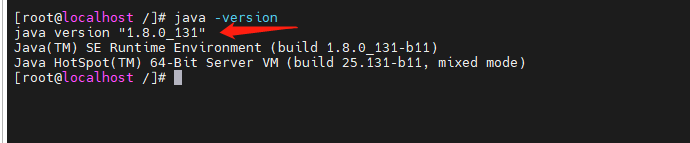

# 一、卸载 openjdk

## 1、查看 java 版本时，显示已经安装了 openjdk，需要卸载

```
[root@xxx ~]# java -version
openjdk version "1.8.0_292"
OpenJDK Runtime Environment (build 1.8.0_292-b10)
OpenJDK 64-Bit Server VM (build 25.292-b10, mixed mode)
```

## 2、查询当前跟 java 相关的 rpm 包

```
[root@xxx ~]# rpm -qa|grep java
javapackages-tools-3.4.1-11.el7.noarch
java-1.8.0-openjdk-1.8.0.292.b10-1.el7_9.x86_64
java-1.8.0-openjdk-headless-1.8.0.292.b10-1.el7_9.x86_64
python-javapackages-3.4.1-11.el7.noarch
tzdata-java-2021a-1.el7.noarch
```

## 3、卸载 openjdk 相关文件，除了 .noarch 的文件，其他的都卸载 ，要使用 root 权限 sudo

```
sudo rpm -e --nodeps java-1.8.0-openjdk-headless-1.8.0.342.b07-1.el7_9.x86_64
 sudo rpm -e --nodeps java-1.8.0-openjdk-1.8.0.342.b07-1.el7_9.x86_64
```

```
4、查看卸载完成


[root@xxx ~]# java -version
-bash: /usr/bin/java: No such file or directory
```

# 二、安装步骤

## 第一步：下载 JDK

1、下载 LInux 环境下的 jdk,请去 官网 中下载 jdk 的安装文件，选择自己要安装的版本 JDK 下载 - [oracle 官方下载](https://www.oracle.com/java/technologies/downloads/)

## 第二步：解压

```
tar  -zxvf  jdk-8u131-linux-x64.tar.gz
```

## 第三步：修改环境变量

```
cd /
vi /etc/profile
```

用 vi 编辑器来编辑 profile 文件，在文件末尾添加一下内容（按“i”进入编辑，编辑完之后先按“Esc”,再“Shift+:” ,然后"wq"回车）

```
export JAVA_HOME=/usr/javaJDK/jdk1.8.0_131
export JRE_HOME=${JAVA_HOME}/jre
export CLASSPATH=.:${JAVA_HOME}/lib:${JRE_HOME}/lib:$CLASSPATH
export JAVA_PATH=${JAVA_HOME}/bin:${JRE_HOME}/bin
export PATH=$PATH:${JAVA_PATH}
```

保存完之后，我们还需要让这个环境变量配置信息里面生效，要不然只能重启电脑生效了。通过命令 source /etc/profile 让 profile 文件立即生效，如图所示

```
source /etc/profile
```


