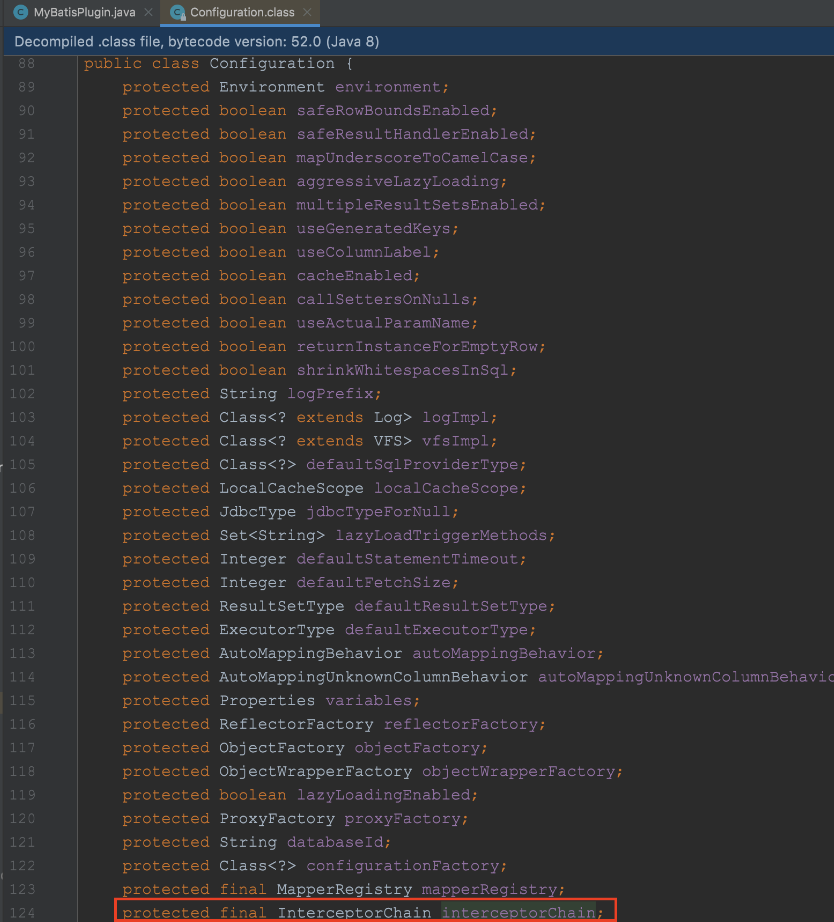
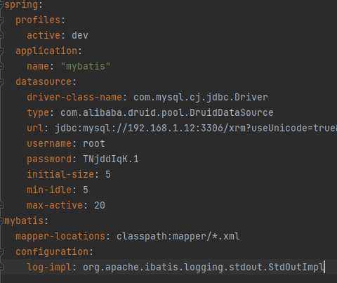

# MyBatis 的插件运行原理

MyBatis 插件的运行是基于 JDK 动态代理 + 拦截器链实现。

MyBatis 的拦截器可以拦截 4 大对象，开发者通过自定义拦截器，拦截对应的方法实现插件。

- Executor(update, query, flushStatements, commit, rollback, getTransaction, close, isClosed)
- ParameterHandler(getParameterObject, setParameters)
- ResultSetHandler(handleResultSets, handleOutputParameters)
- StatementHandler(prepare, parameterize, batch, update, query)

在 MyBatis 的全局配置类 Configuration 中，定义了一个拦截器链。InterceptorChain 中用一个 List 集合保存所有的拦截器，其中 pluginAll 方法会遍历 List 集合，并调用所有拦截器的 plugin 方法。



```
public class InterceptorChain {
    // 定义了一个List集合装拦截器对象
    private final List<Interceptor> interceptors = new ArrayList();

    public InterceptorChain() {
    }

    // 遍历interceptors，并调用拦截器的plugin方法
    public Object pluginAll(Object target) {
        Interceptor interceptor;
        for(Iterator var2 = this.interceptors.iterator(); var2.hasNext(); target = interceptor.plugin(target)) {
            interceptor = (Interceptor)var2.next();
        }

        return target;
    }

    // 添加拦截器
    public void addInterceptor(Interceptor interceptor) {
        this.interceptors.add(interceptor);
    }

    // 获取interceptors
    public List<Interceptor> getInterceptors() {
        return Collections.unmodifiableList(this.interceptors);
    }
}
```

MyBatis 的拦截器，自定义插件就需要实现该接口

```
public interface Interceptor {
    // 拦截处理
    Object intercept(Invocation var1) throws Throwable;

    // 生成代理对象
    default Object plugin(Object target) {
        return Plugin.wrap(target, this);
    }

    // 插件的属性设置
    default void setProperties(Properties properties) {
    }
}
```

```
public class Invocation {
    // 目标对象
    private final Object target;
    // 目标对象的方法
    private final Method method;
    // 目标对象的方法参数
    private final Object[] args;

    public Invocation(Object target, Method method, Object[] args) {
        this.target = target;
        this.method = method;
        this.args = args;
    }

    public Object getTarget() {
        return this.target;
    }

    public Method getMethod() {
        return this.method;
    }

    public Object[] getArgs() {
        return this.args;
    }

    // 继续往下执行
    public Object proceed() throws InvocationTargetException, IllegalAccessException {
        return this.method.invoke(this.target, this.args);
    }
}
```

# MyBatis 插件的开发

第一步：实现  Interceptor 接口

```
package com.learn.blog.demo;

import org.apache.ibatis.executor.Executor;
import org.apache.ibatis.mapping.BoundSql;
import org.apache.ibatis.mapping.MappedStatement;
import org.apache.ibatis.plugin.Interceptor;
import org.apache.ibatis.plugin.Intercepts;
import org.apache.ibatis.plugin.Invocation;
import org.apache.ibatis.plugin.Signature;
import org.apache.ibatis.session.ResultHandler;
import org.apache.ibatis.session.RowBounds;

import java.lang.reflect.Field;
import java.util.Properties;

/**
 * 自定义 MyBatis 插件，拦截 Executor 对象的 query 方法，添加limit 1
 */
@Intercepts({
        @Signature(
                type = Executor.class,
                method = "query",
                args = {MappedStatement.class, Object.class, RowBounds.class, ResultHandler.class})
})
public class MyBatisPlugin implements Interceptor {

    @Override
    public Object intercept(Invocation invocation) throws Throwable {
        // 方法的参数
        Object[] args = invocation.getArgs();
        MappedStatement mappedStatement = (MappedStatement) args[0];
        Object parameterObject = args[1];
        BoundSql boundSql = mappedStatement.getBoundSql(parameterObject);
        // 获取到原查询sql语句
        String sql = boundSql.getSql();

        // 利用反射修改boundSql的字段
        Field field = boundSql.getClass().getDeclaredField("sql");
        field.setAccessible(true);
        field.set(boundSql, sql + "limit 1");

        // 修改完继续执行
        return invocation.proceed();
    }

    @Override
    public Object plugin(Object target) {
        return Interceptor.super.plugin(target);
    }


    @Override
    public void setProperties(Properties properties) {
        Interceptor.super.setProperties(properties);
    }
}
```

第二步：在 MyBatis 中注册拦截器 mybatis-config.xml

```
<plugins>
	<plugin interceptor="com.learn.blog.demo.MyBatisPlugin">
        <--可以指定插件的参数-->
		<property />
		<property />
	</plugin>
</plugins>
```

第三步：spring 配置中指定 Mybatis 配置文件路径  
