在 MyBatis 的两万多行的框架源码中，使用了大量的设计模式对工程架构中的复杂场景进行解耦，这些设计模式的巧妙使用是整个框架的精华。

经过整理，大概有以下设计模式，如图 1 所示。

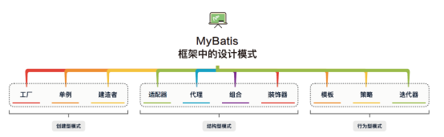

# 1 **类型：创建型模式**

### **工厂模式**

SqlSessionFactory 的结构如图 2 所示。

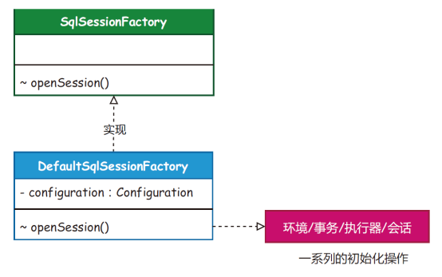

**工厂模式：** 简单工厂是一种创建型模式，在父类中提供一个创建对象的方法，允许子类决定实例对象的类型。

**场景介绍：** SqlSessionFactory 是获取会话的工厂，每次使用 MyBatis 操作数据库时， 都会开启一个新的会话。在会话工厂的实现中，SqlSessionFactory 负责获取数据源环境配置信息、构建事务工厂和创建操作 SQL 的执行器，最终返回会话实现类。

**同类设计：** SqlSessionFactory、ObjectFactory、MapperProxyFactory 和 DataSourceFactory。

### **单例模式**

Configuration 单例配置类的结构如图 3 所示。

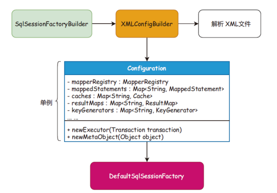

**单例模式：** 是一种创建型模式，能够保证一个类只有一个实例，并且提供一个访问该实例的全局节点。

**场景介绍：** Configuration 是一个大单例，贯穿整个会话周期，所有的配置对象（如映射、缓存、入参、出参、拦截器、注册机和对象工厂等）都在 Configuration 配置项中初始化， 并且随着 SqlSessionFactoryBuilder 构建阶段完成实例化操作。

**同类场景：** ErrorContext、LogFactory 和 Configuration。

### **建造者模式**

ResultMap 建造者模式的结构如图 4 所示。

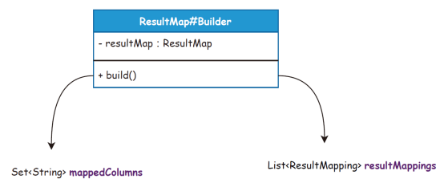

**建造者模式：** 使用多个简单的对象一步一步地构建成一个复杂的对象，提供了一种创建对象的最佳方式。

**场景介绍：** 建造者模式在 MyBatis 中使用了大量的 XxxxBuilder，将 XML 文件解析到各类对象的封装中，使用建造者及建造者助手完成对象的封装。它的核心目的是不希望把过多的关于对象的属性设置写到其他业务流程中，而是用建造者方式提供最佳的边界隔离。

**同类场景：** SqlSessionFactoryBuilder、XMLConfigBuilder、XMLMapperBuilder、XML StatementBuilder 和 CacheBuilder。

# 2 **类型：结构型模式**

### **适配器模式**

日志实现类的结构如图 5 所示。

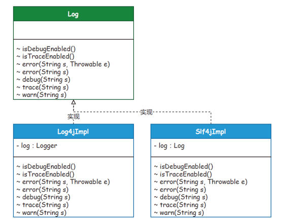

**适配器模式：** 是一种结构型模式，能使接口不兼容的对象也可以相互合作。

**场景介绍：** 正是因为有太多的日志框架，包括 Log4j、Log4j2 和 Slf4J 等，而这些日志框架的使用接口又各有差异，为了统一这些日志框架的接口，MyBatis 定义了一套统一的接口，为所有的其他日志框架的接口做相应的适配。

**同类场景：** 主要集中在对 Log 日志的适配上。

### **代理模式**

代理模式的实现结构如图 6 所示。

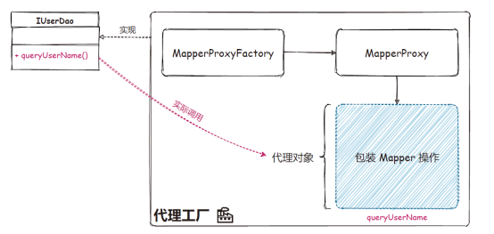

**代理模式：** 是一种结构型模式，能够提供对象的替代品或占位符。代理控制元对象的访问，并且允许在将请求提交给对象前进行一些处理。

**场景介绍：** 没有代理模式就不存在各类框架。就像 MyBatis 中的 MapperProxy 实现类， 代理工厂实现的功能就是完成 DAO 接口的具体实现类的方法，配置的任何一个 DAO 接口调用的 CRUD 方法，都会被 MapperProxy 接管，调用到方法执行器等，并返回最终的数据库执行结果。

**同类场景：** DriverProxy、Plugin、Invoker 和 MapperProxy。

### **组合模式**

解析节点类的结构如图 7 所示。

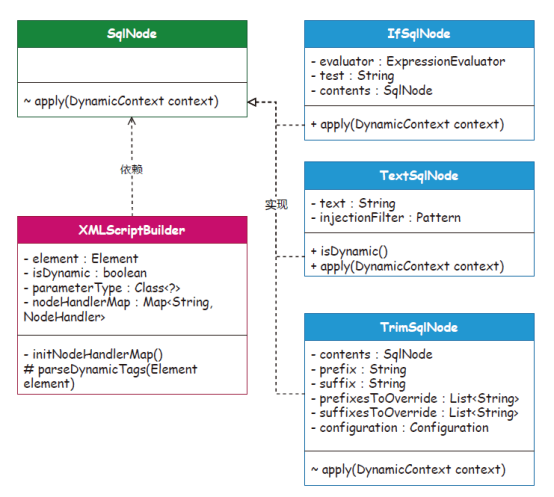

**组合模式：** 是一种结构型模式，可以将对象组合成树形结构以表示“部分—整体” 的层次结构。

**场景介绍：** 在 MyBatis XML 动态的 SQL 配置中，共提供了 9 种标签（trim、where、set、foreach、if、choose、when、otherwise 和 bind），使用者可以组合出各类场景的 SQL 语句。而 SqlNode 接口的实现就是每个组合结构中的规则节点，通过规则节点的组装，完成规则树组合模式的使用。

**同类场景：** 主要体现在对各类 SQL 标签的解析上，以实现 SqlNode 接口的各个子类为主。

### **装饰器模式**

二级缓存装饰器的实现结构如图 8 所示。

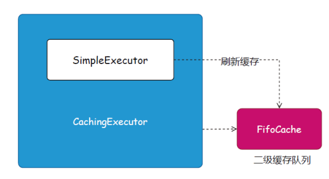

**装饰器模式：** 是一种结构型设计模式，允许将对象放入包含行为的特殊封装对象中， 为元对象绑定新的行为。

**场景介绍：** MyBatis 的所有 SQL 操作都是经过 SqlSession 调用 SimpleExecutor 完成的， 而一级缓存的操作也是在简单执行器中处理的。这里的二级缓存因为是基于一级缓存刷新的，所以在实现上，通过创建一个缓存执行器，包装简单执行器的处理逻辑，实现二级缓存操作。这里用到的就是装饰器模式，也叫俄罗斯套娃模式。

# 3 **类型：行为型模式**

### **模板模式**

SQL 执行模板模式如图 9 所示。

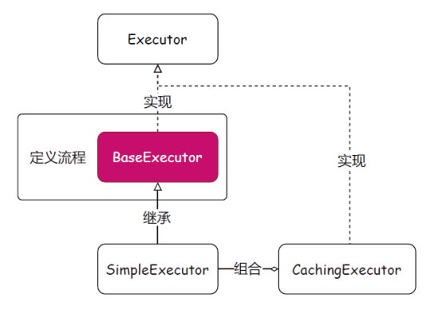

**模板模式：** 是一种行为型模式，在超类中定义了一个算法的框架，允许子类在不修改结构的情况下重写算法的特定步骤。场景介绍：存在一系列可被标准定义的流程，并且流程的步骤大部分采用通用逻辑，只有一小部分是需要子类实现的，通常采用模板模式来定义这个标准的流程。就像 MyBatis 的 BaseExecutor 就是一个用于定义模板模式的抽象类，在这个类中把查询、修改的操作都定义为一套标准的流程。

**同类场景：** BaseExecutor、SimpleExecutor 和 BaseTypeHandler。

### **策略模式**

多类型处理器策略模式的结构如图 10 所示。

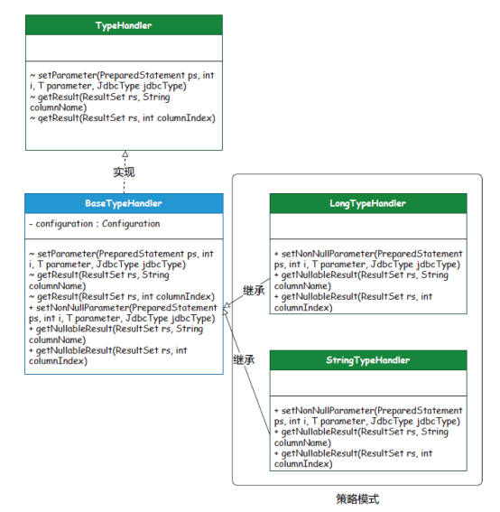

**策略模式：** 是一种行为型模式，能定义一系列算法，并将每种算法分别放入独立的类中，从而使算法的对象能够互相替换。

**场景介绍：** 在 MyBatis 处理 JDBC 执行后返回的结果时，需要按照不同的类型获取对应的值，这样就可以避免大量的 if 判断。所以，这里基于 TypeHandler 接口对每个参数类型分别做了自己的策略实现。

**同类场景：** PooledDataSource、UnpooledDataSource、BatchExecutor、ResuseExecutor、SimpleExector、CachingExecutor、LongTypeHandler、StringTypeHandler 和 DateTypeHandler。

### **迭代器模式**

拆解字段解析实现的结构如图 11 所示。

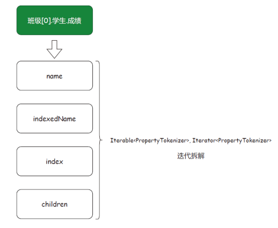

**迭代器模式：** 是一种行为型模式，能在不暴露集合底层表现形式的情况下遍历集合中的所有元素。

**场景介绍：** PropertyTokenizer 用于 MyBatis 的 MetaObject 反射工具包下，用来解析对象关系的迭代操作。这个类在 MyBatis 中使用得非常频繁，包括解析数据源配置信息并填充到数据源类上，同时参数的解析、对象的设置都会使用这个类。

**同类场景：** PropertyTokenizer。

# **4 总结**

通过梳理，MyBatis 大约运用了 10 种左右设计模式。可以说，复杂且优秀的 ORM 框架源码在设计和实现的过程中都会使用大量的设计模式。

在解决复杂场景的问题时，需要采用分治、抽象的方法，运用设计模式和设计原则等相关知识，把问题合理切割为若干子问题，以便加以理解和解决。

学习源码远不是只是为了应付面试，更重要的是学习优秀框架在复杂场景下的解决方案。通过学习这些优秀的方案技术，可以提高对技术设计和实现的理解，扩展编码思维，积累落地经验。只有经过这样长期的积累，我们才更有可能成为优秀的高级工程师和架构师。
