我们在日常工作中广泛使用 mybatis 作为数据持久层框架，但是 mybatis 的执行流程是怎么样的，你了解过吗。本文将从源码角度，带你分析 mybatis 的工作原理。

先看一个简单的例子，以 Service 调用 Mapper 接口为例：

```
public interface StudentMapper {
    @Select("select * from student")
    public List<Map<String,Object>> query();
}
```

```
@Service("studentService")
public class StudentServiceImpl implements StudentService {
    @Autowired
    StudentMapper studentMapper;

    @Override
    public List<Map<String, Object>> query() {
        return studentMapper.select();
    }
}
```

向 Service 中注入这个 Mapper 并调用时，你知道这时注入的是什么吗？

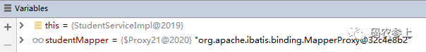

通过调试，可以知道这时实际的 studentMapper 是一个类型为 MapperProxy 的代理对象，下面将从 myabtis 环境初始化开始，具体分析代理对象的产生过程。（不熟悉代理对象的同学，可以查看之前专门讲 [java 代理](https://blog.csdn.net/agonie201218/article/details/123722767t)的文章）

# **一、配置 SqlSessionFactoryBean 时都做了什么？**

在进行 spring 和 mybatis 整合时，会用 xml 或者注解的方式去配置一个 SqlSessionFactoryBean，本文中以注解方式为例：

```
@Bean
public SqlSessionFactoryBean sqlSessionFactoryBean(DataSource dataSource){
   SqlSessionFactoryBean sqlSessionFactoryBean=new SqlSessionFactoryBean();
   sqlSessionFactoryBean.setDataSource(dataSource);
   return  sqlSessionFactoryBean;
}
```

看一下 SqlSessionFactoryBean 的继承实现关系：

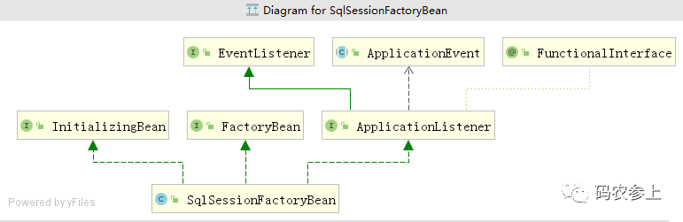

先看 spring 中两个非常重要的接口，FactoryBean 和 InitializingBean。

### **FactoryBean：**

FactoryBean 是一个 spring 中比较特殊的 Bean，通过它的 getObject() 方法可以返回一个对象实例。SqlSessionFactoryBean 中 getObject() 方法的实现：

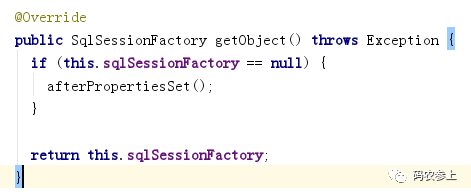

在这里用于创建并返回一个 SqlSessionFactory，在 spring +mybatis 的环境下，我们使用 SqlSessionFactoryBean 来充当 SqlSessionFactory。

### **InitializingBean：**

InitializingBean 接口中只有一个方法，afterPropertiesSet()，所有实现了该接口的类，在 bean 的初始化之前都要调用这个方法。可以看出在上面的 getObject 方法中，如果 SqlSessionFactory 为空，会调用这个方法创建 SqlSessionFactory。

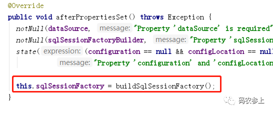

通过调用 SqlSessionFactoryBuilder 的 build 方法，最终返回了一个 DefaultSqlSessionFactory 实例，这个 DefaultSqlSessionFactory 中保存了一个非常重要的 Configuration 对象。

# **二、@MapperScan 都做了什么？**

在注解配置 mybatis 时，通过 @MapperScan 指定 Mapper 存放的包，就能自动为我们把接口实现成类。那么这是怎么实现的呢？

点开 @MapperScan 的源码，发现上面还有一行非常重要的注解：

```
@Import(MapperScannerRegistrar.class)
```

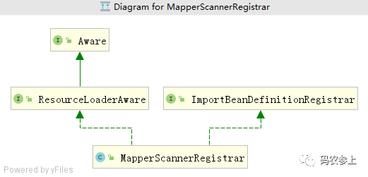

ImportBeanDefinitionRegistrar 接口提供 registerBeanDefinitions 方法向用户暴露了 BeanDefinitionRegistry，也就是说可以让用户手动创建 BeanDefinition 并使用该注册器注册到 spring 容器中。

查看 MapperScannerRegistrar 的方法 registerBeanDefinitions 中的核心代码：

```
ClassPathMapperScanner scanner = new ClassPathMapperScanner(registry);
……
scanner.doScan(StringUtils.toStringArray(basePackages));
```

主要是创建了一个 Mapper 扫描器，开启扫描。

ClassPathMapperScanner 中 doScan 方法：

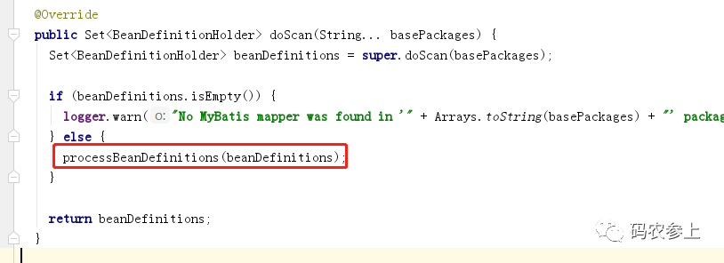

这里对生成的 mapper 的 bean 定义做了进一步处理

进入 processBeanDefinitions() 方法：

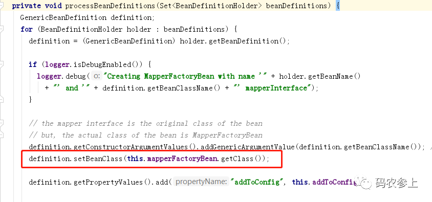

注意画框代码及上方的注释，先看一下从 BeanDefinitionHolder 获得 BeanDefinition 时 beanClass 初始的值：

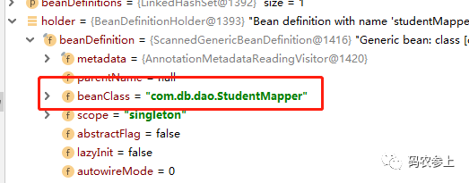

等待 setBeanClass 执行完毕：

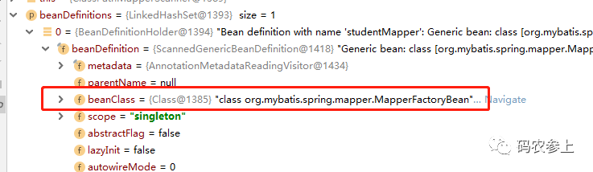

通过 definition.setBeanClass() 把原来的 BeanClass 的类型替换成了 MapperFactoryBean 类型。到这，完成了 Mapper 接口加载定义阶段中非常重要的一步，而这也是生成代理对象 MapperProxy 的关键。

# **三、mybatis 如何生成代理对象？**

看一下 MapperFactoryBean 的继承关系：

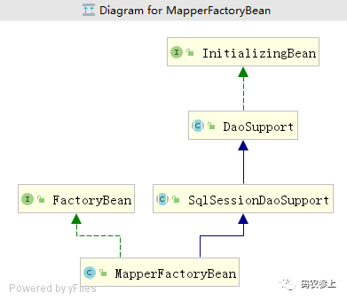

MapperFactoryBean 继承的 SqlSessionDaoSupport 类实现了 InitializingBean 接口，那么我们还是首先找 afterPropertiesSet() 方法：

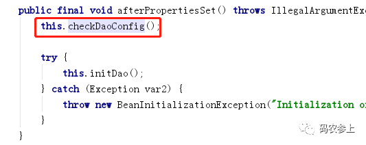

DaoSupport 中，最终调用 MapperFactoryBean 中的方法：

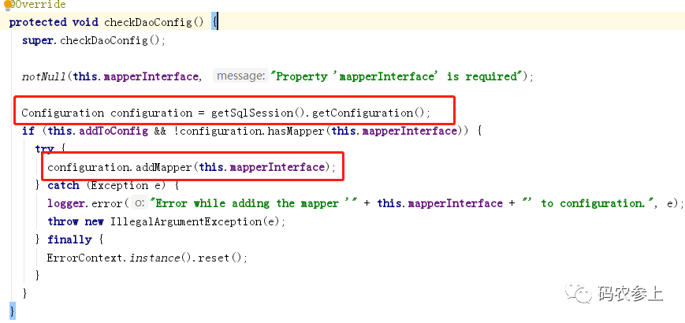

首先通过获取 sqlSession 获得了非常重要的配置类 Configuration，然后查看一下 addMapper 方法，最终调用的是 MapperRegistry 的 addMapper 方法：

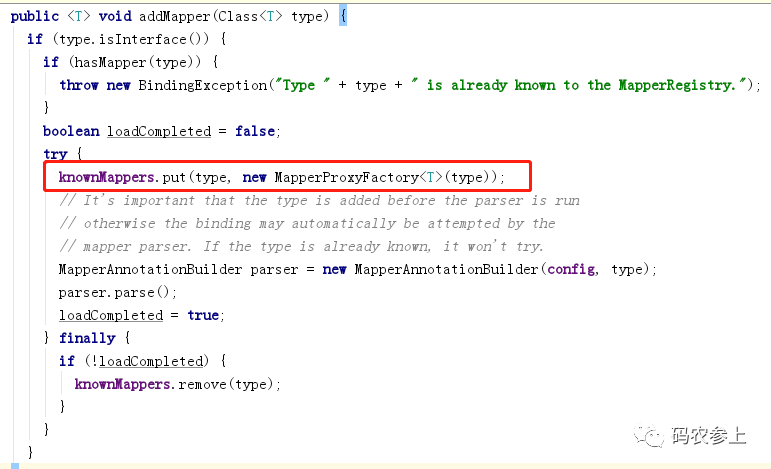

红框中的代码为我们创建了 Mapper 的代理工厂对象（还不是 Mapper 的代理对象），并把它放入了 knownMappers 这个 Map 中。

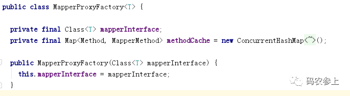

在这一步，只是简单初始化了 MapperProxyFactory，把我们自己的 mapper 的类型传给了它，还并没有真正产生代理对象。

MapperRegistry 并在之后的 parse() 方法中完成了 xml 文件的解析，每一个 sql 方法都被解析成了一个 MappedStatement 对象，并添加到了配置类 Configuration 对象中。

### **MapperFactoryBean 最终返回了什么？**

因为 MapperFactoryBean 实现了 FactoryBean 接口，所以我们看看 getObject 方法究竟返回了什么：

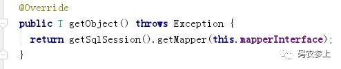

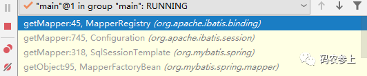

最终调用 MapperRegistry 的 getMapper 方法：

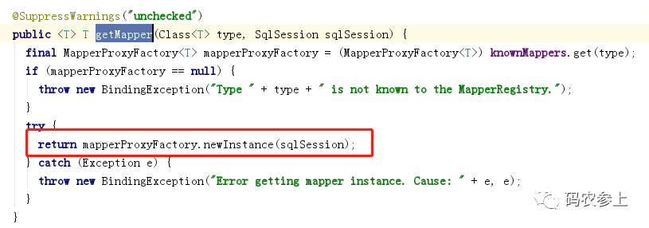

这里调用的了 mybatis 刚才生成的 MapperProxyFactory，帮助我们实例化并返回了一个代理对象。

MapperProxyFactory 中使用 newInstance 方法，实例化 MapperProxy，用于生成代理：

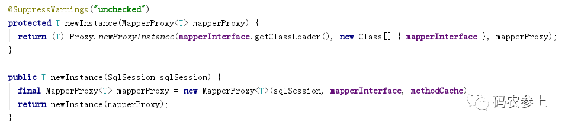

至此，我们已经弄明白了文章开头的 MapperProxy 是如何生成的。

# **四、MapperProxy 代理对象如何执行 sql 语句？**

在 StudentServiceImpl 中的 query 方法中打一个断点跟踪语句，你会发现实际执行的就是代理类 MapperProxy 中的 invoke() 方法。

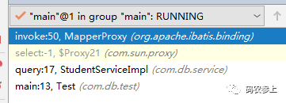

MapperProxy 在作为代理类的同时，自身实现了 InvocationHandler 接口，所以 invoke 方法就是真正执行的代理逻辑。

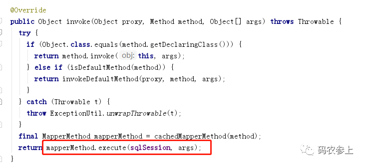

在这里最终调用了 MapperMethod 的 execute 方法实际去执行了 sql 语句。

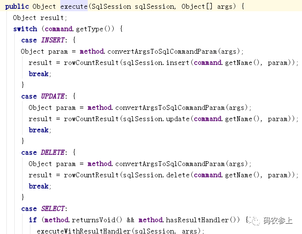

在该方法中，根据 sql 语句执行类型，调用 sqlSession 对应的方法执行并将结果返回给用户。至此，mybatis 在 spring 环境下一次调用全部完成。
