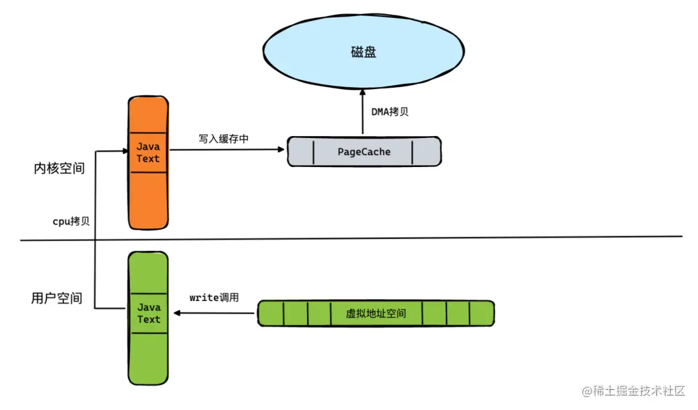
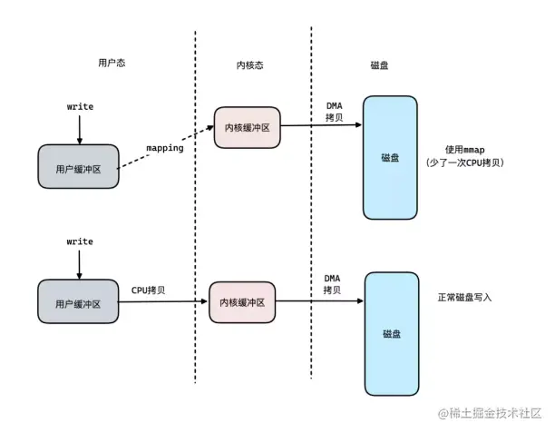
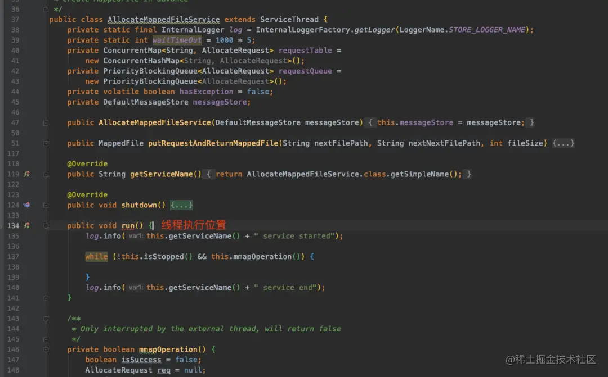

今天抽空给大家整理了一份关于 RocketMQ 的高性能知识点文章总结。希望能对各位读者有所帮助。

# **关于 RockeMQ 的基本介绍**

## **简介**

RocketMQ 是一个纯 Java、分布式、队列模型的开源消息中间件，前身是 MetaQ，是阿里参考 Kafka 特点研发的一个队列模型的消息中间件，后开源给 apache 基金会成为了 apache 顶级开源项目，具有高性能、高可靠、高实时、分布式特点。

### **发展背景**

- 2011 年：业界出现了现在被很多大数据领域所推崇的 Kafka 消息引擎，阿里巴巴在研究了 Kafka 的整体机制和架构设计之后，基于 Kafka 的设计使用 Java 进行了完全重写并推出了 MetaQ 1.0 版本，主要是用于解决顺序消息和海量堆积的问题。
- 2012 年：阿里巴巴开源其自研的第三代分布式消息中间件——RocketMQ。
- 2016 年 11 月：阿里将 RocketMQ 捐献给 Apache 软件基金会，正式成为孵化项目。
- 2017 年 2 月 20 日：RocketMQ 正式发布 4.0 版本，专家称新版本适用于电商领域，金融领域，大数据领域，兼有物联网领域的编程模型。
- 2022 年：RocketMQ 正式发布 5.0 版本，这也是目前最新版本。

### **RocketMQ 的各个特点**

- 单机吞吐量：10w/s。
- 可用性：支持双主双从的分布式架构，具备高可用特性。支持使用 topic,tag,SQL 来对消息进行筛选。底层结构通过多队列来承载消息存储等特性。可靠的 FIFO 和严格有序的消息队列中间件。支持多种消息传递协议，例如 grpc，Mqtt，Jms....
- 源码实现：Java 语言。

# **PageCache 和 Mmap**

RocketMQ 这款中间件具有着单机 10w + 的吞吐量，其底层原因，实际上得从操作系统原理开始和大家讲起。

## **顺序写入**

磁盘的写步骤通常是：CPU 发送一个写信号给到磁盘磁头，接着磁头需要进行寻道操作，找到对应的磁道后，定位对应的位置进行数据写入。所以如果数据是随机写入的话，磁头就需要频繁地切换盘道进行数据的写入，整体耗时会有所提升。

顺序写，其实是一种非常常见的提升 IO 写性能的方式，利用连续的写入地址，从而减少磁头的切换次数，提升性能。

## **PageCache**

为了提升对文件的读写效率，Linux 内核会以页大小（4KB）为单位，将文件划分为多数据块。当用户对文件中的某个数据块进行读写操作时，内核首先会申请一个内存页（称为 页缓存）与文件中的数据块进行绑定。

例如下边这张图，当我们发起一次系统调用的 write 方法，想要将用户态中的数据写入磁盘的时候，其实是需要发生以下操作的：



首先，将用户地址空间的数据通过 CPU 拷贝，放入到内核空间中，并且写入一个 PageCache 里面，然后通过 DMA 去将 PageCache 的数据写入到磁盘。

这里面由于有 CPU 拷贝这样的重操作，所以想要提升吞吐量，必须解决这个问题。而 RocketMQ 的创作团队，则是通过 mmap 技术来解决了它。

## **什么是 mmap**

mmap 系统调用，让用户地址空间，跟文件做映射（实际是指向不存在的物理内存）。将内核态的一段空间地址映射到了用户态中，这样数据只需要写入到用户态的这段虚拟地址中，接着内核空间的 DMA 会将这段数据写入到磁盘中。这样之后，整体的写入流程就如下图所示：



使用 mmap 技术之后，可以减少一次的 CPU 拷贝次数，提升性能。

这里补充一些说明，其实 DMA 本质上是一块访问独立的芯片。由于每次访问磁盘进行 IO 操作都会导致 CPU 大量的空闲时间，而 DMA 则是用于提升 IO 操作效率的一个角色，主要用于 IO 的数据传输，降低 CPU 等待时间。

# **Java 里面如何使用 mmap 技术**

在 Java 语言中，其实很早就有提供 mmap 方面的 api 了，下边是一段简单的 mmap 使用案例。

```
public class MmapUtils {


    public File commitLogFile;
    public MappedByteBuffer mappedByteBuffer;
    public int mappedSize = 0;
    public int writePos = 0;


    public MmapUtils(String commitLogPath, int mappedSize) {
        this.commitLogFile = new File(commitLogPath);
        if(!commitLogFile.exists()){
            try {
                commitLogFile.createNewFile();
            } catch (IOException e) {
                e.printStackTrace();
            }
        }
        this.mappedSize = mappedSize;
        try {
            mappedByteBuffer = new RandomAccessFile(commitLogFile, "rw").getChannel().map(FileChannel.MapMode.READ_WRITE, 0, mappedSize);
        } catch (IOException e) {
            e.printStackTrace();
        }
    }


    /**
     * 往磁盘写数据
     *
     * @param content
     * @return
     */
    public int writeFile(String content) {
        mappedByteBuffer.put(content.getBytes());
        //强制刷盘
        mappedByteBuffer.force();
        writePos = mappedByteBuffer.position();
        return 1;
    }


    /**
     * 从磁盘中读取数据
     *
     * @param len
     * @return
     */
    public byte[] readContent(int len) {
        mappedByteBuffer.position(0);
        byte[] dest = new byte[len];
        int j = 0;
        for (int i = 0; i < mappedSize; i++) {
            byte b = mappedByteBuffer.get();
            if (b != 0) {
                dest[j++] = b;
            }
        }
        return dest;
    }


}

```

## **mmap 存在的缺陷**

其实使用 mmap 技术还是存在一些缺陷的。

### **导致缺页中断问题**

我们知道，在操作系统的中，数据通常都是被放在磁盘中的，只有在需要计算的时候，才会将数据加载到内存中，而每次加载的单位都是以 “页” 作为基础，假设我们需要访问一块存在于磁盘，但是没有被加载到内存中的数据，这种情况，我们称之为 **“软性的缺页中断”** 。 如果数据是存在于内存，但是该页的地址没有被注册到 MMU 中，我们则称之为 **“硬性的缺页中断”** 。

总之不管是软性还是硬性的中断，都需要重新建立一次数据的内存映射，比较消耗性能。

### **mmap 对于文件的大小有一定要求**

使用 mmap 技术之后，我们不可以使用 2gb 大小以上的文件去做映射，同时文件的长度也不建议做变长，最好是固定的大小。最后对于小文件而言，使用 mmap 可能性能还不如直接的原始 IO 操作。

### **RocketMQ 对 mmap 的优化**

好了，现在我们了解了 mmap 存在的缺陷之后，来看看 RocketMQ 是如何解决这些不足点的。

### **预映射**

在 RocketMQ 的源代码里，可以看到这样一份代码，它的名字叫做：org.apache.rocketmq.store.AllocateMappedFileService。这个类负责在 rocketmq 启动时，预先分配 mmap 的文件映射。

### **文件预热**

调用 mmap 进行内存映射后，OS 只是建立虚拟内存地址至物理地址的映射表，没有实际加载任何文件至内存。依靠一次缺页加载 4K，1G 的 commitLog 需要发生 256 次缺页中断。而在 RocketMQ 的源代码中，进行了 madvise 系统调用，其目的是使操作系统做一次内存映射后对应的文件数据尽可能多地预加载进内存，从而实现预热。

### **内存锁定**

将进程使用的部分或者全部的地址空间锁定在物理内存中，并会先写入一些随机值到 mmap 映射出的内存空间里，防止其被交换到 swap 空间。基于 mlock 系统调用。

### **堆外缓存**

到这里，我们了解了 RocketMQ 内部通过使用 PageCache 去让我们的数据写入如写入内存般轻松，但是这在极端情况下，可能会有出现频繁出现缺页中断的情况，以及 PageCache 阻塞，这种情况下，Broker 节点会返回一个 SYSTEM_BUSY 的信号给到客户端，不过这类场景在实际生产中很少会出现。为了避免这种情况，RocketMQ 底层增加了一套堆外缓存来优化这类场景。当 PageCache 写入阻塞的时候，可以选择写入到堆外缓存中，之后再从堆外缓存 **(DirectByteBuffer)** 写入到 PageCache。

# **RocketMQ 中的 mmap 预分配实现分析**

下边让我们来看看 RocketMQ 底层是如何进行 mmap 的文件映射预分配的。在 RocketMQ 的源代码中，当服务启动之后，AllocateMappedFileService 这个线程类便会开始执行。



线程启动之后，便会执行 mmapOperation 方法，这个方法的大致步骤如下：

- 从优先级队列中获取 AllocateRequest
- 创建 MappedFile
- 根据配置是否预热 MappedFile（填充 0 字节），将 MappedFile 放入到 AllocateRequest
- 如果出现 IOException 将 AllocateRequest 重新放入优先级队列
- 调用 AllocateRequest 的 CountDownLatch#countDown 方法通知 putRequestAndReturnMappedFile 线程

整体执行目的总结起来就是：初始化 + 预热 mappedFile。

关于 mmapOperation 的源代码和其含义，我列了一份出来给各位读者查看：

```
/**
 * Only interrupted by the external thread, will return false
 */
private boolean mmapOperation() {
    boolean isSuccess = false;
    AllocateRequest req = null;
    try {
        // 从优先级队列里获取AllocateRequest
        req = this.requestQueue.take();
        //从Map里获取AllocateRequest
        AllocateRequest expectedRequest = this.requestTable.get(req.getFilePath());
        if (null == expectedRequest) {
            log.warn("this mmap request expired, maybe cause timeout " + req.getFilePath() + " "
                + req.getFileSize());
            return true;
        }
        //putRequestAndReturnMappedFile里map与优先级队列并不是强一致，是最终一致的
        if (expectedRequest != req) {
            log.warn("never expected here,  maybe cause timeout " + req.getFilePath() + " "
                + req.getFileSize() + ", req:" + req + ", expectedRequest:" + expectedRequest);
            return true;
        }


        if (req.getMappedFile() == null) {
            long beginTime = System.currentTimeMillis();


            MappedFile mappedFile;
            //堆外内存
            if (messageStore.getMessageStoreConfig().isTransientStorePoolEnable()) {
                try {
                    mappedFile = ServiceLoader.load(MappedFile.class).iterator().next();
                    mappedFile.init(req.getFilePath(), req.getFileSize(), messageStore.getTransientStorePool());
                } catch (RuntimeException e) {
                    log.warn("Use default implementation.");
                    mappedFile = new MappedFile(req.getFilePath(), req.getFileSize(), messageStore.getTransientStorePool());
                }
            } else {
                mappedFile = new MappedFile(req.getFilePath(), req.getFileSize());
            }


            long eclipseTime = UtilAll.computeEclipseTimeMilliseconds(beginTime);
            //创建MappedFile 花费大于10ms打印日志
            if (eclipseTime > 10) {
                int queueSize = this.requestQueue.size();
                log.warn("create mappedFile spent time(ms) " + eclipseTime + " queue size " + queueSize
                    + " " + req.getFilePath() + " " + req.getFileSize());
            }


            // pre write mappedFile 默认warmMapedFileEnable=false，即默认不预热
            if (mappedFile.getFileSize() >= this.messageStore.getMessageStoreConfig()
                .getMapedFileSizeCommitLog()
                &&
                this.messageStore.getMessageStoreConfig().isWarmMapedFileEnable()) {
                // 文件预热
                mappedFile.warmMappedFile(this.messageStore.getMessageStoreConfig().getFlushDiskType(),
                    this.messageStore.getMessageStoreConfig().getFlushLeastPagesWhenWarmMapedFile());
            }


            req.setMappedFile(mappedFile);
            this.hasException = false;
            isSuccess = true;
        }
    } catch (InterruptedException e) {
        log.warn(this.getServiceName() + " interrupted, possibly by shutdown.");
        this.hasException = true;
        return false;
    } catch (IOException e) {
        log.warn(this.getServiceName() + " service has exception. ", e);
        this.hasException = true;
        if (null != req) {
            //重新插入请求到队列
            requestQueue.offer(req);
            try {
                Thread.sleep(1);
            } catch (InterruptedException ignored) {
            }
        }
    } finally {
        //AllocateRequest计数器减一，表示MappedFile已经创建完成
        if (req != null && isSuccess)
            req.getCountDownLatch().countDown();
    }
    return true;
}
复制代码
```

在这段代码里头，我们可以看到有个文件预热的方法，叫做：warmMappedFile，该方法内部最后发出了一次系统调用，mlock 方法。

```
public void warmMappedFile(FlushDiskType type, int pages) {
        long beginTime = System.currentTimeMillis();
        ByteBuffer byteBuffer = this.mappedByteBuffer.slice();
        int flush = 0;
        long time = System.currentTimeMillis();
        for (int i = 0, j = 0; i < this.fileSize; i += MappedFile.OS_PAGE_SIZE, j++) {
            byteBuffer.put(i, (byte) 0);
            // force flush when flush disk type is sync
            if (type == FlushDiskType.SYNC_FLUSH) {
                if ((i / OS_PAGE_SIZE) - (flush / OS_PAGE_SIZE) >= pages) {
                    flush = i;
                    mappedByteBuffer.force();
                }
            }


            // prevent gc
            if (j % 1000 == 0) {
                log.info("j={}, costTime={}", j, System.currentTimeMillis() - time);
                time = System.currentTimeMillis();
                try {
                    Thread.sleep(0);
                } catch (InterruptedException e) {
                    log.error("Interrupted", e);
                }
            }
        }


        // force flush when prepare load finished
        if (type == FlushDiskType.SYNC_FLUSH) {
            log.info("mapped file warm-up done, force to disk, mappedFile={}, costTime={}",
                this.getFileName(), System.currentTimeMillis() - beginTime);
            mappedByteBuffer.force();
        }
        log.info("mapped file warm-up done. mappedFile={}, costTime={}", this.getFileName(),
            System.currentTimeMillis() - beginTime);
        // 这里是一个系统调用
        this.mlock();
    }

```

这段代码的末尾处调用的 mlock 函数，它的内部是利用了 Java 的 JNI 机制，去进行系统调用。

JNA 的本质就是将大多数 native 的方法封装到 jar 包中的动态库中，并且提供了一系列的机制来自动加载这个动态库。例如下边这个例子就是基于 JNI 去调用 c lib 中的 print 方法：

```
public class JNAUsage {


    public interface CLibrary extends Library {
        CLibrary INSTANCE = (CLibrary)
                Native.load((Platform.isWindows() ? "msvcrt" : "c"),
                        CLibrary.class);


        void printf(String format, Object... args);
    }


    public static void main(String[] args) {
        CLibrary.INSTANCE.printf("Hello, World\n");
        for (int i=0;i < args.length;i++) {
            CLibrary.INSTANCE.printf("Argument %d: %s\n", i, args[i]);
        }
    }
}

```

这个例子中，我们想要加载系统的 c lib，从而使用 c lib 中的 printf 方法。

具体做法就是创建一个 CLibrary interface，这个 interface 继承自 Library，然后使用 Native.load 方法来加载 c lib，最后在这个 interface 中定义要使用的 lib 中的方法即可。

那么在 RocketMQ 中，底层又是如何通过 JNI 来实现 mlock 的调用呢，来看源代码：

```
public void mlock() {
        final long beginTime = System.currentTimeMillis();
        final long address = ((DirectBuffer) (this.mappedByteBuffer)).address();
        Pointer pointer = new Pointer(address);
        {
            int ret = LibC.INSTANCE.mlock(pointer, new NativeLong(this.fileSize));
            log.info("mlock {} {} {} ret = {} time consuming = {}", address, this.fileName, this.fileSize, ret, System.currentTimeMillis() - beginTime);
        }


        {
            int ret = LibC.INSTANCE.madvise(pointer, new NativeLong(this.fileSize), LibC.MADV_WILLNEED);
            log.info("madvise {} {} {} ret = {} time consuming = {}", address, this.fileName, this.fileSize, ret, System.currentTimeMillis() - beginTime);
        }
    }

```

上边代码中的 LIbC 是一个作者封装的系统调用接口文件，里面正好是映射了操作系统的 mlock 方法。

```
package org.apache.rocketmq.store.util;


import com.sun.jna.Library;
import com.sun.jna.Native;
import com.sun.jna.NativeLong;
import com.sun.jna.Platform;
import com.sun.jna.Pointer;


public interface LibC extends Library {
    LibC INSTANCE = (LibC) Native.loadLibrary(Platform.isWindows() ? "msvcrt" : "c", LibC.class);


    int MADV_WILLNEED = 3;
    int MADV_DONTNEED = 4;


    int MCL_CURRENT = 1;
    int MCL_FUTURE = 2;
    int MCL_ONFAULT = 4;


    /* sync memory asynchronously */
    int MS_ASYNC = 0x0001;
    /* invalidate mappings & caches */
    int MS_INVALIDATE = 0x0002;
    /* synchronous memory sync */
    int MS_SYNC = 0x0004;


    int mlock(Pointer var1, NativeLong var2);


    int munlock(Pointer var1, NativeLong var2);


    int madvise(Pointer var1, NativeLong var2, int var3);


    Pointer memset(Pointer p, int v, long len);


    int mlockall(int flags);


    int msync(Pointer p, NativeLong length, int flags);
}
```

通过调用 mlock 可以将进程使用的部分或者全部的地址空间锁定在物理内存中，防止其被交换到 **swap** 空间。对时间敏感的应用会希望全部使用物理内存，提高数据访问和操作的效率。例如，**memcached** 就提供锁定内存的选项，保证 memcached 使用内存全部在物理内存中。

通过 mlock 锁定对应的地址空间，防止被 swap 出去，这样的效果 ，也正是 RocketMQ 所需要的。
