Feign 作为一个声明式的 Http 服务客户端，通过接口加注解的方式，就能够完成对服务提供方接口的调用，极大的简化了我们在调用服务时的工作。

那么在只有接口的条件下，Feign 是如何基于接口实现服务调用的呢？在之前的[代理模式](http://mp.weixin.qq.com/s?__biz=MzIwMTgzOTQ0Ng==&mid=2247483663&idx=1&sn=909add352e8ff4895b39cd6c56a2c721&chksm=96e68736a1910e201830701a3fec7e95a9c99c5319d2bf8860b13fcf3594651b7e6c7e2916ba&scene=21#wechat_redirect)及 [mybatis 实现原理](http://mp.weixin.qq.com/s?__biz=MzIwMTgzOTQ0Ng==&mid=2247483726&idx=1&sn=f312fd31c8c3211488032e6b1f2466ff&chksm=96e68777a1910e619ead788e1c3424eeb8206b5d782ab1ff6847f5f734c741aeb6889bf003e8&scene=21#wechat_redirect)的文章中，我们知道了可以通过动态代理的方式生成代理对象。Feign 是否这样实现的呢，我们从源码角度进行分析。

# _**01**_**初始化阶段**

首先看一下 Feign 的开启注解 @EnableFeignClients：

```
@Retention(RetentionPolicy.RUNTIME)
@Target(ElementType.TYPE)
@Documented
@Import(FeignClientsRegistrar.class)
public @interface EnableFeignClients {
  String[] value() default {};
  String[] basePackages() default {};
  Class<?>[] basePackageClasses() default {};
  Class<?>[] defaultConfiguration() default {};
  Class<?>[] clients() default {};
}
```

@Import 导入了 FeignClientsRegistrar，该类实现了 ImportBeanDefinitionRegistrar 接口，在该接口的 registerBeanDefinitions 方法中，spring 向外暴露了 BeanDefinitionRegistry 注册器。用户如果需要手动创建或修改 BeanDefinition，可以通过把 BeanDefinition 注册到 BeanDefinitionRegistry 的方式，之后 spring 会帮我们实例化 bean 并放在容器中。

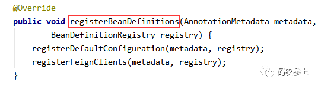

里面两个方法中，registerDefaultConfiguration 方法主要用于读取配置信息，我们主要看一下 registerFeignClients 方法的实现：

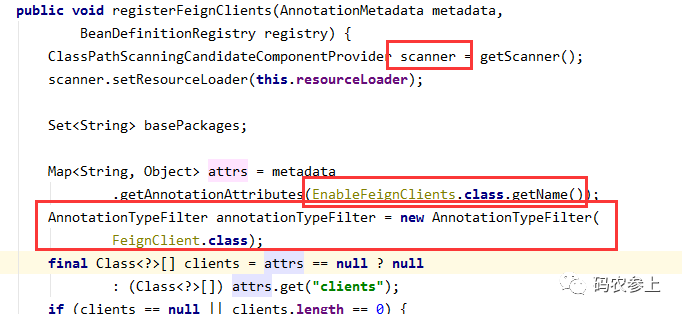

这里首先定义了一个扫描器，并读取 @EnableFeignClients 注解的属性，配置 FeignClient 的注解类型过滤器，用以在后面进行进行包扫描操作。

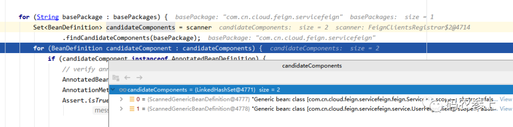

通过扫描，得到所有在 basepackage 定义的路径下的被 @FeignClient 注解标记的类的 BeanDefinition。

读取 @FeignClient 注解的内容，并存放在一个 Map 中，由于我在注解中只指定了 name，因此只存在 name 和 value 的值（value 通过 @AliasFor 指定为 name 的别名）

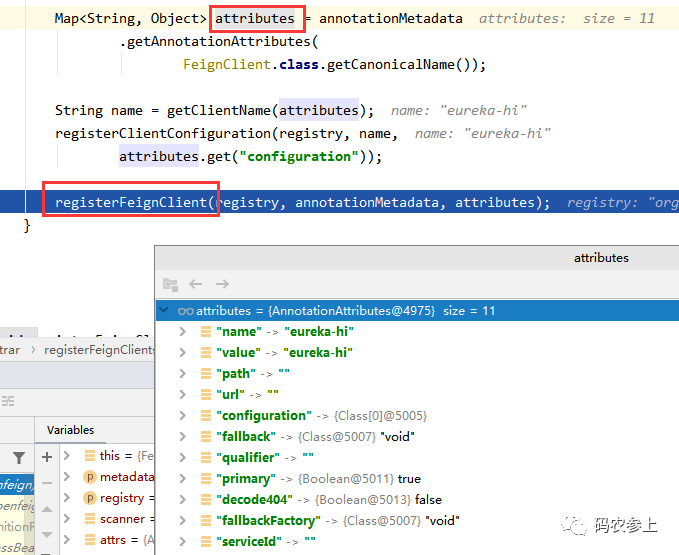

之后，调用 registerFeignClient 方法：

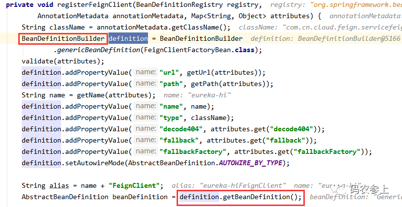

注意这里通过 BeanDefinitionBuilder 创建的是一个 FeignClientFactoryBean 类型的工厂 bean，注意通过它的 getObject 返回的才是我们的 FeignClient。之后通过 BeanDefinitionBuilder 填充 FeignClient 对象的属性，并获得 BeanDefinition。

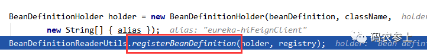

这里的 BeanDefinitionHolder 可以理解为 BeanDefinition 的包装类，提供了根据 beanName 获取 BeanDefinition 的方法，可以理解为额外加了一层封装。

完成属性填充后，通过 Spring 提供的 registerBeanDefinition 方法向 BeanDefinitionRegistry 注册了刚实例化的这个 BeanDefinitionHolder。这里完成的是将 FeignClient 注解的类的信息交给工厂 bean 代理类，并将代理类的定义注册到 Spring 的容器中。

至此，已经把要创建的接口代理对象的信息放入 registry 里面，之后 spring 在启动调用 refresh 方法的时候会负责 bean 的实例化。在实例化过程中，调用 FeignClientFactoryBean 的 getObject 方法：

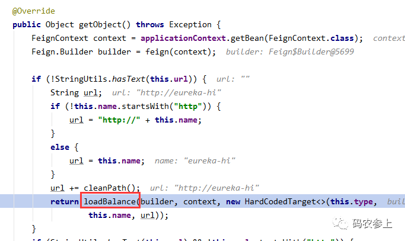

调用 loadBalance 方法：

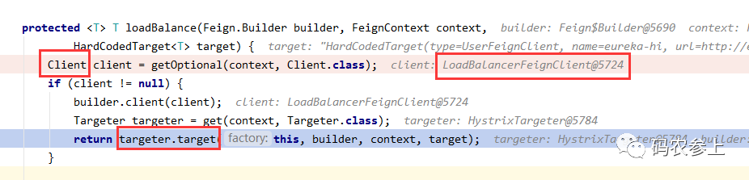

这里创建的 Client 实例是一个 LoadBalancerFeignClient 的对象。Client 是一个非常重要的组件，看一下配置类中注入的实例：

```
@Configuration
class DefaultFeignLoadBalancedConfiguration {
  @Bean
  @ConditionalOnMissingBean
  public Client feignClient(CachingSpringLoadBalancerFactory cachingFactory,
                SpringClientFactory clientFactory) {
    return new LoadBalancerFeignClient(new Client.Default(null, null),
        cachingFactory, clientFactory);
  }
}
```

在没有配置 Client 的情况下，会注入一个 LoadBalancerFeignClient，其中 delegate 属性中注入了一个 Client$Default 对象，我们可以暂时理解为代理，后面就会讲到，Feign 发送 Request 请求以及接收 Response 响应，都是借助 Client$Default 对象完成的。

可以回想一下之前 Ribbon 中讲过的 RibbonLoadBalancerClient，Ribbon 是使用拦截器后调用了它的 execute 方法。那么我们可以猜测一下，这里是不是使用什么方式最终了调用 LoadBalancerFeignClient 的 execute 方法呢？这个问题我们放在后面去证实。

# _**02**_**创建代理对象**

接着看上面 loadBalance 方法中，首先调用了 HystrixTargeter 的 target 方法：

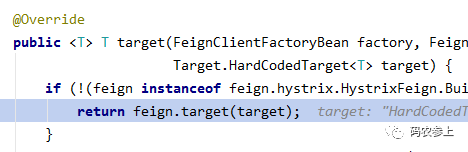

之后调用了 Feign 的 target 方法：

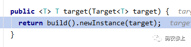

最终调用了 ReflectiveFeign 类中的 newInstance 方法。其中名为 nameToHandler 的 Map 中存储了 FeignClient 接口中定义的方法：

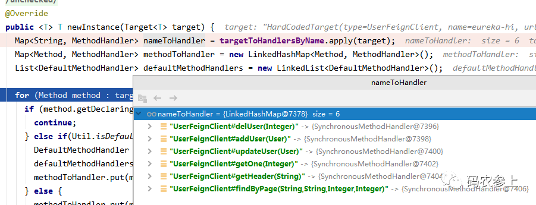

看到下面的 InvocationHandler 和 Proxy 就很清楚了，和我们在开头说的一样，这里是使用 JDK 动态代理的方式创建代理对象。创建 InvocationHandler 及代理对象过程：

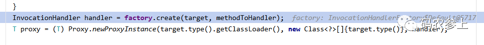

这里的 factory 是 InvocationHandlerFactory 的对象，看一下它的 create 方法，用于创建 FeignInvocationHandler 实例来对方法进行拦截。在构造方法中传入了代理类的接口，以及需要代理的方法：

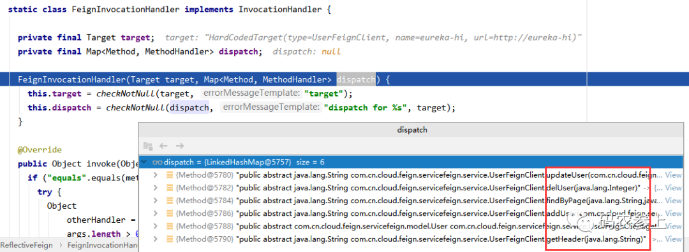

# _**03**_**拦截方法**

通过 JDK 动态代理我们知道，在 InvocationHandler 中，invoke 方法对进行方法拦截和逻辑增强。那么我们使用一个测试接口，看一下关键的 invoke 方法是如何工作的：

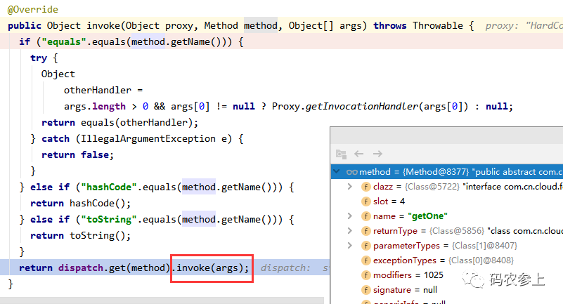

首先根据方法名去判断是不是 Object 类内置的一些方法，都不是则往下，执行了一个分发的操作，这个 dispatch 是初始化阶段生成的 MethodHandler 列表。调用 SynchronousMethodHandler 类的 invoke 方法：

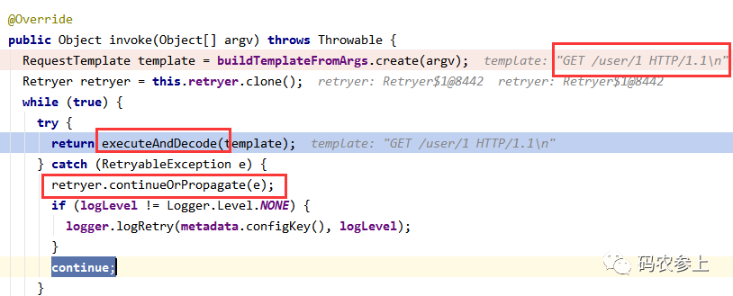

使用 RequestTemplate 创建了一个 http 请求的模板，可以看见这里创建了一个请求：

```
GET /user/1 HTTP/1.1
```

进入 executeAndDecode 方法，在该方法中，首先使用刚才创建的模板生成了一个 Request 请求，并且把我们本次调用的服务名和接口名拼接在了一起：

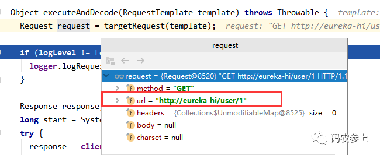

这里把请求交给了之前创建的 LoadBalancerFeignClient，执行了它的 execute 方法。和开头说的一样，和 Ribbon 类似的调用流程。只不过需要区别一下的是，Ribbon 是使用拦截器拦截请求，而 Feign 是使用动态代理的 invoke 方法对方法进行拦截并转发。

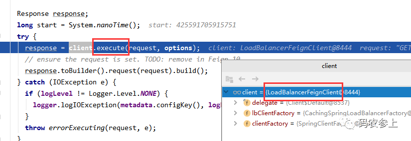

进入 LoadBalancerFeignClient 的 execute 方法，在其中构建了一个 RibbonRequest 的请求：

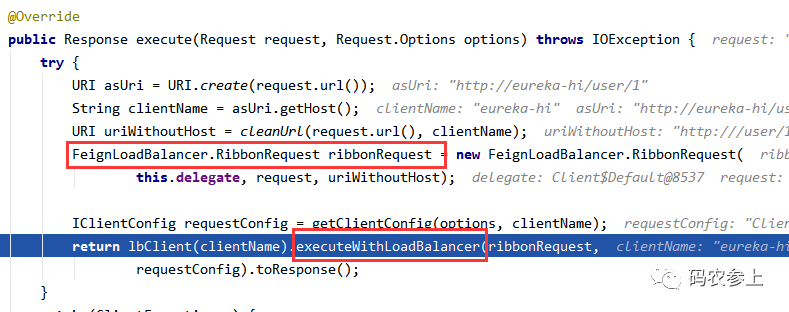

在上面的 uriWithoutHost 中，去除了 url 中的服务名。这么做是因为 Feign 其实只需要这个服务后面的接口字符串，至于如何选择服务与负载均衡，都交给了 Ribbon 去做。

进入 RibbonRequest 的构造方法中，可以看见，用的 Client 的实现类是 Client$Default 对象，即前面讲到的在配置文件中，LoadBalancerFeignClient 中 delegate 存储的对象。

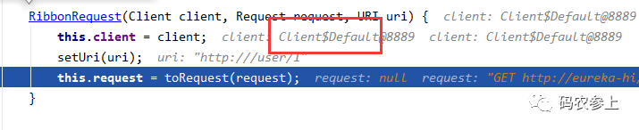

调用 AbstractLoadBalancerAwareClient 的 executeWithLoadBalancer 方法：

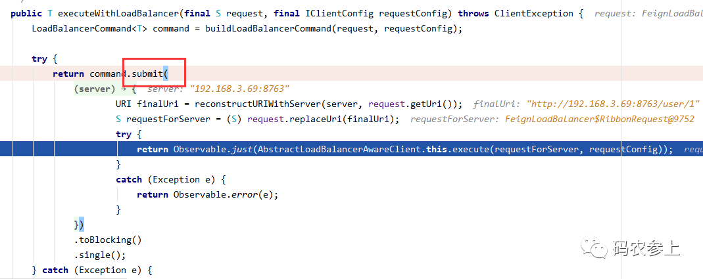

进入其 submit 方法：

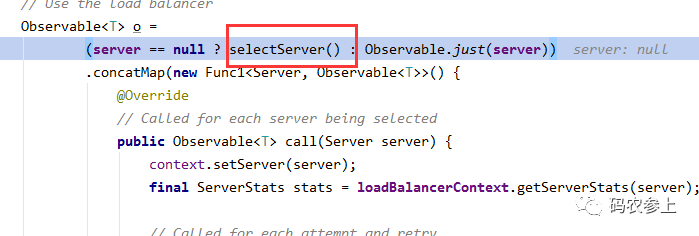

进入 selectServer 方法：

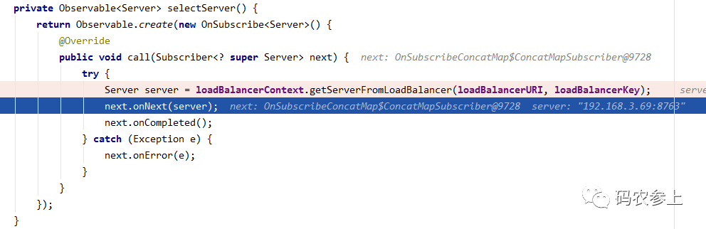

进入 LoadBalancerContext 的 getServerFromLoadBalancer 方法：

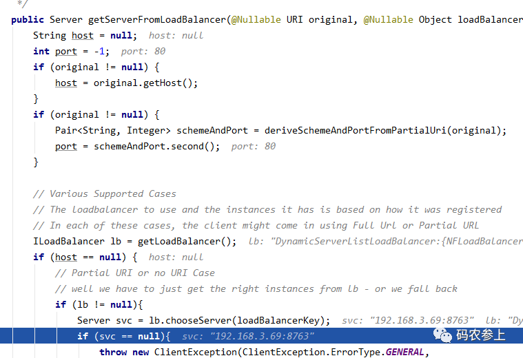

在这里结合了 Ribbon，完成负载均衡，根据负载均衡算法选择 Server。

之后通过调用 FeignLoadBalancer 的 execute 方法，再调用 Client$Default 的 execute 方法：

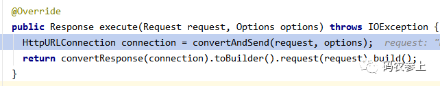

调用 convertAndSend 创建了一个 HttpURLConnection 的连接，最后发起远程调用还是用的 HttpURLConnection，并在 convertResponse 方法中封装结果，至此一次调用过程完成。

到这里，我们就能明白为什么说 Feign 是一个 Web 客户端并不准确，其实它并没有完成任何请求处理操作，只是一个伪客户端，最终还是调用其他组件完成的请求发送与接收。

最后，对 Feign 的实现流程进行一下总结：

1、使用 JDK 动态代理为接口创建代理对象

2、执行接口的方法时，调用代理对象的 invoker 方法

3、读取 FeignClient 的注解得到要调用的远程服务的接口

4、通过 Ribbon 负载均衡得到一个要调用的服务提供者

5、使用 HttpURLConnection 发起请求，得到响应
