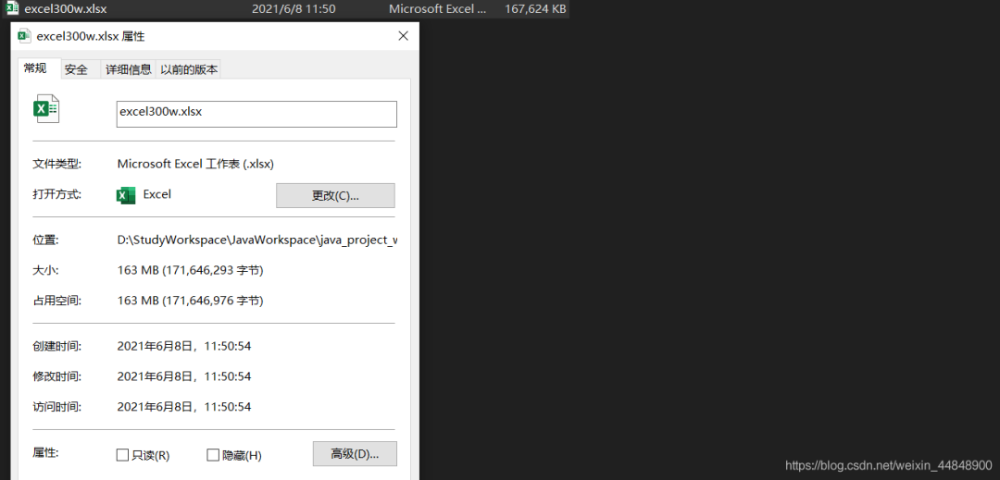
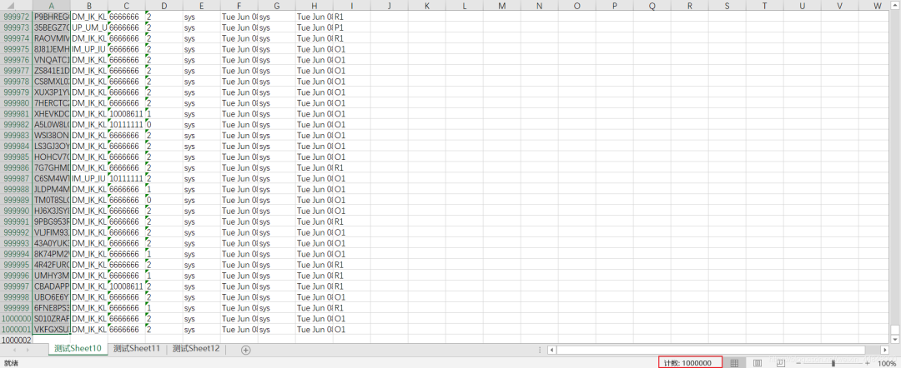

# 前景

在项目开发中往往需要使用到数据的导入和导出,导入就是从 Excel 中导入到 DB 中,而导出就是从 DB 中查询数据然后使用 POI 写到 Excel 上。

写本文的背景是因为在工作中遇到了大数据的导入和导出，问题既然来了逃跑不如干掉它！！！

只要这一次解决了，后期遇到同样的问题就好解决了。

废话不多说，开始撸起来！！！

# 传统 POI 的的版本优缺点比较

其实想到数据的导入导出,理所当然的会想到 apache 的 poi 技术,以及 Excel 的版本问题。

既然要做导入导出,那么我们就先来大致看一下传统 poi 技术的版本以及优缺点对比吧!

首先我们知道 POI 中我们最熟悉的莫过于 WorkBook 这样一个接口，我们的 POI 版本也在更新的同时对这个几口的实现类做了更新；

- HSSFWorkbook :

这个实现类是我们早期使用最多的对象，它可以操作 Excel2003 以前（包含 2003）的所有 Excel 版本。在 2003 以前 Excel 的版本后缀还是.xls

- XSSFWorkbook :

这个实现类现在在很多公司都可以发现还在使用，它是操作的 Excel2003--Excel2007 之间的版本，Excel 的扩展名是.xlsx

- SXSSFWorkbook :

这个实现类是 POI3.8 之后的版本才有的,它可以操作 Excel2007 以后的所有版本 Excel,扩展名是.xlsx

大致知道了我们在导入导出操作的时候会用到这样三个实现类以及他们可以操作的 Excel 版本和后缀之后,我们就要从优缺点分析他们了

- HSSFWorkbook

它是 POI 版本中最常用的方式,不过:

- 它的缺点是 最多只能导出 65535 行,也就是导出的数据函数超过这个数据就会报错;
- 它的优点是 不会报内存溢出。（因为数据量还不到 7w 所以内存一般都够用，首先你得明确知道这种方式是将数据先读取到内存中，然后再操作）

- XSSFWorkbook

优点：这种形式的出现是为了突破 HSSFWorkbook 的 65535 行局限，是为了针对 Excel2007 版本的 1048576 行，16384 列，最多可以导出 104w 条数据；

缺点：伴随的问题来了，虽然导出数据行数增加了好多倍，但是随之而来的内存溢出问题也成了噩梦。因为你所创建的 book，Sheet，row，cell 等在写入到 Excel 之前，都是存放在内存中的（这还没有算 Excel 的一些样式格式等等），可想而知，内存不溢出就有点不科学了！！！

- SXSSFWorkbook

从 POI 3.8 版本开始，提供了一种基于 XSSF 的低内存占用的 SXSSF 方式;

**优点：**

- 这种方式不会一般不会出现内存溢出（它使用了硬盘来换取内存空间，
- 也就是当内存中数据达到一定程度这些数据会被持久化到硬盘中存储起来，而内存中存的都是最新的数据），
- 并且支持大型 Excel 文件的创建（存储百万条数据绰绰有余）。

**缺点：**

- 既然一部分数据持久化到了硬盘中，且不能被查看和访问那么就会导致，
- 在同一时间点我们只能访问一定数量的数据，也就是内存中存储的数据;
- sheet.clone()方法将不再支持,还是因为持久化的原因;
- 不再支持对公式的求值，还是因为持久化的原因，在硬盘中的数据没法读取到内存中进行计算；
- 在使用模板方式下载数据的时候，不能改动表头，还是因为持久化的问题，写到了硬盘里就不能改变了；

# 使用方式哪种看情况

经过了解也知道了这三种 Workbook 的优点和缺点，那么具体使用哪种方式还是需要看情况的：

我一般会根据这样几种情况做分析选择：

1.当我们经常导入导出的数据不超过 7w 的情况下，可以使用 HSSFWorkbook 或者 XSSFWorkbook 都行；

2.当数据量查过 7w 并且导出的 Excel 中不牵扯对 Excel 的样式，公式，格式等操作的情况下，推荐使用 SXSSFWorkbook;

3.当数据量查过 7w，并且我们需要操做 Excel 中的表头，样式，公式等，

这时候我们可以使用 XSSFWorkbook 配合进行分批查询，分批写入 Excel 的方式来做；

# 百万数据导入导出（正菜）

铺垫也做了不少，那么现在开始讲讲我在工作中遇到的超百万数据的导入导出解决方案：

想要解决问题我们首先要明白自己遇到的问题是什么？

1、 我遇到的数据量超级大，使用传统的 POI 方式来完成导入导出很明显会内存溢出，并且效率会非常低；

2、 数据量大直接使用 select \* from tableName 肯定不行，一下子查出来 300w 条数据肯定会很慢；

3、 300w 数据导出到 Excel 时肯定不能都写在一个 Sheet 中，这样效率会非常低；估计打开都得几分钟；

4、 300w 数据导出到 Excel 中肯定不能一行一行的导出到 Excel 中。频繁 IO 操作绝对不行；

5、 导入时 300 万数据存储到 DB 如果循环一条条插入也肯定不行；

6、导入时 300w 数据如果使用 Mybatis 的批量插入肯定不行，因为 Mybatis 的批量插入其实就是 SQL 的循环；一样很慢。

## **解决思路：**

**针对 1 ：**

其实问题所在就是内存溢出，我们只要使用对上面介绍的 POI 方式即可，主要问题就是原生的 POI 解决起来相当麻烦。

经过查阅资料翻看到阿里的一款 POI 封装工具 EasyExcel，上面问题等到解决；

**针对 2：**

不能一次性查询出全部数据，我们可以分批进行查询，只不过时多查询几次的问题，况且市面上分页插件很多。此问题好解决。

**针对 3：**

可以将 300w 条数据写到不同的 Sheet 中，每一个 Sheet 写一百万即可。

**针对 4：**

不能一行一行的写入到 Excel 上，我们可以将分批查询的数据分批写入到 Excel 中。

**针对 5：**

导入到 DB 时我们可以将 Excel 中读取的数据存储到集合中，到了一定数量，直接批量插入到 DB 中。

**针对 6：**

不能使用 Mybatis 的批量插入，我们可以使用 JDBC 的批量插入，配合事务来完成批量插入到 DB。即 Excel 读取分批+JDBC 分批插入+事务。

## 1.EasyExcel 简介

> 附上 GitHub 地址：https://github.com/alibaba/easyexcel

GitHub 地址上教程和说明很详细，并且附带有读和写的 demo 代码，这里对它的介绍我就不再详细说了。

至于 EasyExcel 底层怎么实现的这个还有待研究。

## 2. 300w 数据导出

EasyExcel 完成 300w 数据的导出。技术难点已经知道了，接下来就是针对这一难点提供自己的解决思路即可。

300w 数据的导出解决思路：

1、 首先在查询数据库层面，需要分批进行查询（我使用的是每次查询 20w）

2、 每查询一次结束，就使用 EasyExcel 工具将这些数据写入一次；

3、 当一个 Sheet 写满了 100w 条数据，开始将查询的数据写入到另一个 Sheet 中；

4、 如此循环直到数据全部导出到 Excel 完毕。

注意：

1.我们需要计算 Sheet 个数，以及循环写入次数。特别是最后一个 Sheet 的写入次数

> 因为你不知道最后一个 Sheet 选哟写入多少数据，可能是 100w，也可能是 25w 因为我们这里的 300w 只是模拟数据，有可能导出的数据比 300w 多也可能少

2 我们需要计算写入次数，因为我们使用的分页查询，所以需要注意写入的次数。

> （其实查询数据库多少次就是写入多少次）

```
//导出逻辑代码
public void dataExport300w(HttpServletResponse response) {
        {
            OutputStream outputStream = null;
            try {
                long startTime = System.currentTimeMillis();
                System.out.println("导出开始时间:" + startTime);

                outputStream = response.getOutputStream();
                ExcelWriter writer = new ExcelWriter(outputStream, ExcelTypeEnum.XLSX);
                String fileName = new String(("excel100w").getBytes(), "UTF-8");

                //title
                Table table = new Table(1);
                List<List<String>> titles = new ArrayList<List<String>>();
                titles.add(Arrays.asList("onlineseqid"));
                titles.add(Arrays.asList("businessid"));
                titles.add(Arrays.asList("becifno"));
                titles.add(Arrays.asList("ivisresult"));
                titles.add(Arrays.asList("createdby"));
                titles.add(Arrays.asList("createddate"));
                titles.add(Arrays.asList("updateby"));
                titles.add(Arrays.asList("updateddate"));
                titles.add(Arrays.asList("risklevel"));
                table.setHead(titles);

                //模拟统计查询的数据数量这里模拟100w
                int count = 3000001;
                //记录总数:实际中需要根据查询条件进行统计即可
                Integer totalCount = actResultLogMapper.findActResultLogByCondations(count);
                //每一个Sheet存放100w条数据
                Integer sheetDataRows = ExcelConstants.PER_SHEET_ROW_COUNT;
                //每次写入的数据量20w
                Integer writeDataRows = ExcelConstants.PER_WRITE_ROW_COUNT;
                //计算需要的Sheet数量
                Integer sheetNum = totalCount % sheetDataRows == 0 ? (totalCount / sheetDataRows) : (totalCount / sheetDataRows + 1);
                //计算一般情况下每一个Sheet需要写入的次数(一般情况不包含最后一个sheet,因为最后一个sheet不确定会写入多少条数据)
                Integer oneSheetWriteCount = sheetDataRows / writeDataRows;
                //计算最后一个sheet需要写入的次数
                Integer lastSheetWriteCount = totalCount % sheetDataRows == 0 ? oneSheetWriteCount : (totalCount % sheetDataRows % writeDataRows == 0 ? (totalCount / sheetDataRows / writeDataRows) : (totalCount / sheetDataRows / writeDataRows + 1));

                //开始分批查询分次写入
                //注意这次的循环就需要进行嵌套循环了,外层循环是Sheet数目,内层循环是写入次数
                List<List<String>> dataList = new ArrayList<>();
                for (int i = 0; i < sheetNum; i++) {
                    //创建Sheet
                    Sheet sheet = new Sheet(i, 0);
                    sheet.setSheetName("测试Sheet1" + i);
                    //循环写入次数: j的自增条件是当不是最后一个Sheet的时候写入次数为正常的每个Sheet写入的次数,如果是最后一个就需要使用计算的次数lastSheetWriteCount
                    for (int j = 0; j < (i != sheetNum - 1 ? oneSheetWriteCount : lastSheetWriteCount); j++) {
                        //集合复用,便于GC清理
                        dataList.clear();
                        //分页查询一次20w
                        PageHelper.startPage(j + 1 + oneSheetWriteCount * i, writeDataRows);
                        List<ActResultLog> reslultList = actResultLogMapper.findByPage100w();
                        if (!CollectionUtils.isEmpty(reslultList)) {
                            reslultList.forEach(item -> {
                                dataList.add(Arrays.asList(item.getOnlineseqid(), item.getBusinessid(), item.getBecifno(), item.getIvisresult(), item.getCreatedby(), Calendar.getInstance().getTime().toString(), item.getUpdateby(), Calendar.getInstance().getTime().toString(), item.getRisklevel()));
                            });
                        }
                        //写数据
                        writer.write0(dataList, sheet, table);
                    }
                }

                // 下载EXCEL
                response.setHeader("Content-Disposition", "attachment;filename=" + new String((fileName).getBytes("gb2312"), "ISO-8859-1") + ".xlsx");
                response.setContentType("multipart/form-data");
                response.setCharacterEncoding("utf-8");
                writer.finish();
                outputStream.flush();
                //导出时间结束
                long endTime = System.currentTimeMillis();
                System.out.println("导出结束时间:" + endTime + "ms");
                System.out.println("导出所用时间:" + (endTime - startTime) / 1000 + "秒");
            } catch (FileNotFoundException e) {
                e.printStackTrace();
            } catch (IOException e) {
                e.printStackTrace();
            } finally {
                if (outputStream != null) {
                    try {
                        outputStream.close();
                    } catch (Exception e) {
                        e.printStackTrace();
                    }
                }
            }
        }
    }

```

### **2.1 测试机状态**

下面是测试机配置


****

****

### **2.2 使用数据库版本**

数据库我使用的是 Oracle19C 在网上查阅其实在数据量不超过 1 亿的情况下,Mysql 和 Oracle 的性能其实相差不大,超过 1 亿,Oracle 的各方面优势才会明显。

所以这里可以忽略使用数据库对时间造成的影响，使用 mysql 一样可以完成测试，不需要单独安装 Oracle。

这次测试在查询方面我使用的是 rownum 进行的模拟查询 300w 条数据，这种查询效率其实并不高，实际还有很多优化空间来加快查询速度，

如：明确查询具体字段，不要用星号，经常查询字段增加索引等尽可能提高查询效率，用时可能会更短。

```
<select id="findByPage300w" resultType="show.mrkay.pojo.ActResultLog">
    select *
    from ACT_RESULT_LOG
    where rownum <![CDATA[<]]> 3000001
</select>

```

建表语句：可以参考一下

```
-- Create table
create table ACT_RESULT_LOG
(
  onlineseqid VARCHAR2(32),
  businessid  VARCHAR2(32),
  becifno     VARCHAR2(32),
  ivisresult  VARCHAR2(32),
  createdby   VARCHAR2(32),
  createddate DATE,
  updateby    VARCHAR2(32),
  updateddate DATE,
  risklevel   VARCHAR2(32)
)
tablespace STUDY_KAY
  pctfree 10
  initrans 1
  maxtrans 255
  storage
  (
    initial 64K
    next 1M
    minextents 1
    maxextents unlimited
  );

```

### **2.3 测试结果**

下面是 300w 数据从 DB 导出到 Excel 所用时间


从上面结果可以看出,300w 的数据导出时间用时 2 分 15 秒,并且这是在不适用实体作为映射的情况下,如果使用实体映射不适用循环封装的话速度会更快(当然这也是在没有设置表头等其他表格样式的情况下)

综合来说速度还算可以.

在网上查了很多资料有一个博主测试使用 EasyExcel 导出 102w 数据用时 105 秒,具体可以看一下链接：

> https://blog.csdn.net/u014299266/article/details/107790561

看一下导出效果:文件还是挺大的 163M





### **2.4 导出小结**

经过测试 EasyExcel 还是挺快的,并且使用起来相当方便,作者还专门提供了关流方法,不需要我们手动去关流了,也避免了我们经常忘记关流导致的一系列问题。

导出测试就到这里，对于数据量小于 300W 的数据可以使用在一个 Sheet 中进行导出。这里就不再演示。

## 3. 300w 数据导入

代码不重要首先还是思路

### **300W 数据的导入解决思路**

1、首先是分批读取读取 Excel 中的 300w 数据，这一点 EasyExcel 有自己的解决方案，我们可以参考 Demo 即可，只需要把它分批的参数 3000 调大即可。我是用的 20w；（一会儿代码一看就能明白）

2、其次就是往 DB 里插入，怎么去插入这 20w 条数据，当然不能一条一条的循环，应该批量插入这 20w 条数据，同样也不能使用 Mybatis 的批量插入语，因为效率也低。

3、使用 JDBC+事务的批量操作将数据插入到数据库。（分批读取+JDBC 分批插入+手动事务控制）

> https://www.cnblogs.com/wxw7blog/p/8706797.html

### **3.1 数据库数据(导入前)**

如图


### **3.2 核心业务代码**

- EasyExcel 的读取 Excel 数据的 API

```
@Test
public void import2DBFromExcel10wTest() {
    String fileName = "D:\\StudyWorkspace\\JavaWorkspace\\java_project_workspace\\idea_projects\\SpringBootProjects\\easyexcel\\exportFile\\excel300w.xlsx";
    //记录开始读取Excel时间,也是导入程序开始时间
    long startReadTime = System.currentTimeMillis();
    System.out.println("------开始读取Excel的Sheet时间(包括导入数据过程):" + startReadTime + "ms------");
    //读取所有Sheet的数据.每次读完一个Sheet就会调用这个方法
    EasyExcel.read(fileName, new EasyExceGeneralDatalListener(actResultLogService2)).doReadAll();
    long endReadTime = System.currentTimeMillis();
    System.out.println("------结束读取Excel的Sheet时间(包括导入数据过程):" + endReadTime + "ms------");
}

```

- 事件监听

```
public class EasyExceGeneralDatalListener extends AnalysisEventListener<Map<Integer, String>> {
    /**
     * 处理业务逻辑的Service,也可以是Mapper
     */
    private ActResultLogService2 actResultLogService2;

    /**
     * 用于存储读取的数据
     */
    private List<Map<Integer, String>> dataList = new ArrayList<Map<Integer, String>>();

    public EasyExceGeneralDatalListener() {
    }

    public EasyExceGeneralDatalListener(ActResultLogService2 actResultLogService2) {
        this.actResultLogService2 = actResultLogService2;
    }

    @Override
    public void invoke(Map<Integer, String> data, AnalysisContext context) {
        //数据add进入集合
        dataList.add(data);
        //size是否为100000条:这里其实就是分批.当数据等于10w的时候执行一次插入
        if (dataList.size() >= ExcelConstants.GENERAL_ONCE_SAVE_TO_DB_ROWS) {
            //存入数据库:数据小于1w条使用Mybatis的批量插入即可;
            saveData();
            //清理集合便于GC回收
            dataList.clear();
        }
    }

    /**
     * 保存数据到DB
     *
     * @param
     * @MethodName: saveData
     * @return: void
     */
    private void saveData() {
        actResultLogService2.import2DBFromExcel10w(dataList);
        dataList.clear();
    }

    /**
     * Excel中所有数据解析完毕会调用此方法
     *
     * @param: context
     * @MethodName: doAfterAllAnalysed
     * @return: void
     */
    @Override
    public void doAfterAllAnalysed(AnalysisContext context) {
        saveData();
        dataList.clear();
    }
}

```

- JDBC 工具类

```
public class JDBCDruidUtils {
    private static DataSource dataSource;

    /*
   创建数据Properties集合对象加载加载配置文件
    */
    static {
        Properties pro = new Properties();
        //加载数据库连接池对象
        try {
            //获取数据库连接池对象
            pro.load(JDBCDruidUtils.class.getClassLoader().getResourceAsStream("druid.properties"));
            dataSource = DruidDataSourceFactory.createDataSource(pro);
        } catch (Exception e) {
            e.printStackTrace();
        }
    }

    /*
    获取连接
     */
    public static Connection getConnection() throws SQLException {
        return dataSource.getConnection();
    }


    /**
     * 关闭conn,和 statement独对象资源
     *
     * @param connection
     * @param statement
     * @MethodName: close
     * @return: void
     */
    public static void close(Connection connection, Statement statement) {
        if (connection != null) {
            try {
                connection.close();
            } catch (SQLException e) {
                e.printStackTrace();
            }
        }
        if (statement != null) {
            try {
                statement.close();
            } catch (SQLException e) {
                e.printStackTrace();
            }
        }
    }

    /**
     * 关闭 conn , statement 和resultset三个对象资源
     *
     * @param connection
     * @param statement
     * @param resultSet
     * @MethodName: close
     * @return: void
     */
    public static void close(Connection connection, Statement statement, ResultSet resultSet) {
        close(connection, statement);
        if (resultSet != null) {
            try {
                resultSet.close();
            } catch (SQLException e) {
                e.printStackTrace();
            }
        }
    }

    /*
    获取连接池对象
     */
    public static DataSource getDataSource() {
        return dataSource;
    }

}

```

- druid.properties 配置

```
driverClassName=oracle.jdbc.driver.OracleDriver
url=jdbc:oracle:thin:@localhost:1521:ORCL
username=mrkay
password=******
initialSize=10
maxActive=50
maxWait=60000
```

- Service 中具体业务逻辑

```
/**
 * 测试用Excel导入超过10w条数据,经过测试发现,使用Mybatis的批量插入速度非常慢,所以这里可以使用 数据分批+JDBC分批插入+事务来继续插入速度会非常快
 *
 * @param
 * @MethodName: import2DBFromExcel10w
 * @return: java.util.Map<java.lang.String, java.lang.Object>
 */
@Override
public Map<String, Object> import2DBFromExcel10w(List<Map<Integer, String>> dataList) {
    HashMap<String, Object> result = new HashMap<>();
    //结果集中数据为0时,结束方法.进行下一次调用
    if (dataList.size() == 0) {
        result.put("empty", "0000");
        return result;
    }
    //JDBC分批插入+事务操作完成对10w数据的插入
    Connection conn = null;
    PreparedStatement ps = null;
    try {
        long startTime = System.currentTimeMillis();
        System.out.println(dataList.size() + "条,开始导入到数据库时间:" + startTime + "ms");
        conn = JDBCDruidUtils.getConnection();
        //控制事务:默认不提交
        conn.setAutoCommit(false);
        String sql = "insert into ACT_RESULT_LOG (onlineseqid,businessid,becifno,ivisresult,createdby,createddate,updateby,updateddate,risklevel) values";
        sql += "(?,?,?,?,?,?,?,?,?)";
        ps = conn.prepareStatement(sql);
        //循环结果集:这里循环不支持"烂布袋"表达式
        for (int i = 0; i < dataList.size(); i++) {
            Map<Integer, String> item = dataList.get(i);
            ps.setString(1, item.get(0));
            ps.setString(2, item.get(1));
            ps.setString(3, item.get(2));
            ps.setString(4, item.get(3));
            ps.setString(5, item.get(4));
            ps.setTimestamp(6, new Timestamp(System.currentTimeMillis()));
            ps.setString(7, item.get(6));
            ps.setTimestamp(8, new Timestamp(System.currentTimeMillis()));
            ps.setString(9, item.get(8));
            //将一组参数添加到此 PreparedStatement 对象的批处理命令中。
            ps.addBatch();
        }
        //执行批处理
        ps.executeBatch();
        //手动提交事务
        conn.commit();
        long endTime = System.currentTimeMillis();
        System.out.println(dataList.size() + "条,结束导入到数据库时间:" + endTime + "ms");
        System.out.println(dataList.size() + "条,导入用时:" + (endTime - startTime) + "ms");
        result.put("success", "1111");
    } catch (Exception e) {
        result.put("exception", "0000");
        e.printStackTrace();
    } finally {
        //关连接
        JDBCDruidUtils.close(conn, ps);
    }
    return result;
}
```

### **3.3 测试结果**

下面是 300w 数据边读边写用时间:

大致计算一下:

从开始读取到中间分批导入再到程序结束总共用时: (1623127964725-1623127873630)/1000=91.095 秒

300w 数据正好是分 15 次插入综合用时:8209 毫秒 也就是 8.209 秒

计算可得 300w 数据读取时间为:91.095-8.209=82.886 秒

结果显而易见:

> EasyExcel 分批读取 300W 数据只用了 82.886 秒
>
> 使用 JDBC 分批+事务操作插入 300w 条数据综合只用时 8.209 秒

```
------开始读取Excel的Sheet时间(包括导入数据过程):1623127873630ms------
200000条,开始导入到数据库时间:1623127880632ms
200000条,结束导入到数据库时间:1623127881513ms
200000条,导入用时:881ms
200000条,开始导入到数据库时间:1623127886945ms
200000条,结束导入到数据库时间:1623127887429ms
200000条,导入用时:484ms
200000条,开始导入到数据库时间:1623127892894ms
200000条,结束导入到数据库时间:1623127893397ms
200000条,导入用时:503ms
200000条,开始导入到数据库时间:1623127898607ms
200000条,结束导入到数据库时间:1623127899066ms
200000条,导入用时:459ms
200000条,开始导入到数据库时间:1623127904379ms
200000条,结束导入到数据库时间:1623127904855ms
200000条,导入用时:476ms
200000条,开始导入到数据库时间:1623127910495ms
200000条,结束导入到数据库时间:1623127910939ms
200000条,导入用时:444ms
200000条,开始导入到数据库时间:1623127916271ms
200000条,结束导入到数据库时间:1623127916744ms
200000条,导入用时:473ms
200000条,开始导入到数据库时间:1623127922465ms
200000条,结束导入到数据库时间:1623127922947ms
200000条,导入用时:482ms
200000条,开始导入到数据库时间:1623127928260ms
200000条,结束导入到数据库时间:1623127928727ms
200000条,导入用时:467ms
200000条,开始导入到数据库时间:1623127934374ms
200000条,结束导入到数据库时间:1623127934891ms
200000条,导入用时:517ms
200000条,开始导入到数据库时间:1623127940189ms
200000条,结束导入到数据库时间:1623127940677ms
200000条,导入用时:488ms
200000条,开始导入到数据库时间:1623127946402ms
200000条,结束导入到数据库时间:1623127946925ms
200000条,导入用时:523ms
200000条,开始导入到数据库时间:1623127952158ms
200000条,结束导入到数据库时间:1623127952639ms
200000条,导入用时:481ms
200000条,开始导入到数据库时间:1623127957880ms
200000条,结束导入到数据库时间:1623127958925ms
200000条,导入用时:1045ms
200000条,开始导入到数据库时间:1623127964239ms
200000条,结束导入到数据库时间:1623127964725ms
200000条,导入用时:486ms
------结束读取Excel的Sheet时间(包括导入数据过程):1623127964725ms------
```

看一下数据库的数据是不是真的存进去了 300w

可以看到数据比导入前多了 300W,测试很成功


### **3.4 导入小结**

具体我没有看网上其他人的测试情况,这东西一般也很少有人愿意测试,不过这个速度对于我当时解决公司大数据的导入和导出已经足够,

当然公司的业务逻辑很复杂,数据量也比较多,表的字段也比较多,导入和导出的速度会比现在测试的要慢一点,但是也在人类能接受的范围之内。

# 总结

这次工作中遇到的问题也给我留下了深刻印象,同时也是我职业生涯添彩的一笔。

最起码简历上可以写上你处理过上百万条数据的导入导出。

最后说一下公司之前怎么做的，公司之前做法是

> 限制了用户的下载数量每次最多只能有四个人同时下载，并且控制每个用户最大的导出数据最多只能是 20w，与此同时他们也是使用的 JDBC 分批导入，但是并没有手动控制事务。

控制同时下载人数我可以理解，但是控制下载数据最多为 20w 就显得有点鸡肋了。

这也是我后期要解决的问题。

好了到此结束，相信大神有比我做的更好的，对于 EasyExcel 内部到底是怎么实现的还有待考究（有空我再研究研究）。

# 参考

https://www.cnblogs.com/fnz0/p/5713102.html

[java 批量插入千万条数据优化方案](https://blog.csdn.net/javaXingzhe/article/details/129278041)
