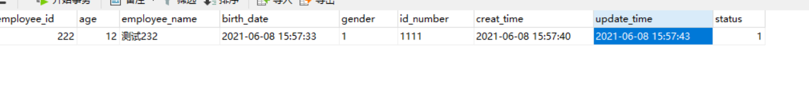
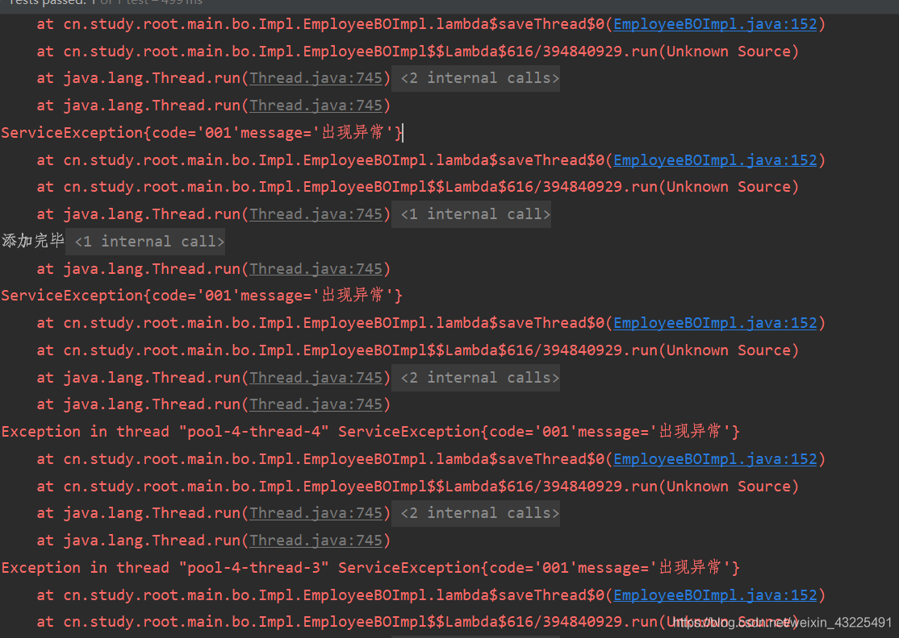
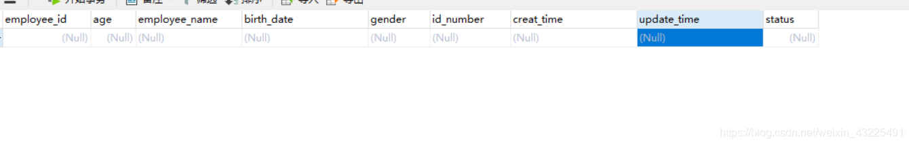
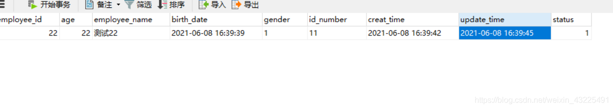
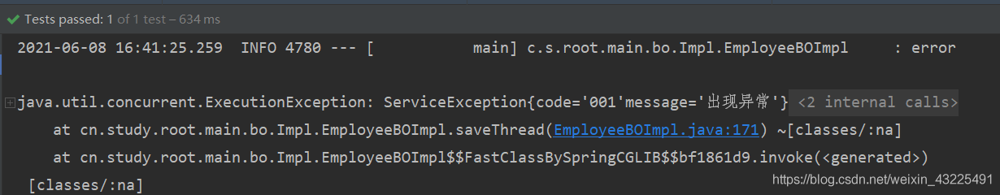
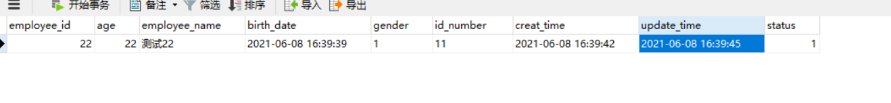
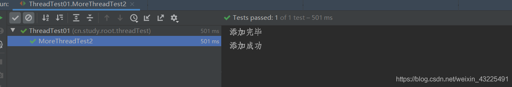
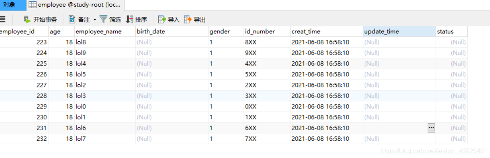

# 背景介绍

1. 最近有一个大数据量插入的操作入库的业务场景, 需要先做一些其他修改操作, 然后在执行插入操作, 由于插入数据可能会很多, 用到多线程去拆分数据并行处理来提高响应时间, 如果有一个线程执行失败, 则全部回滚.

2. 在 spring 中可以使用 Transactional 注解去控制事务, 使出现异常时会进行回滚, 在多线程中, 这个注解则不会生效, 如果主线程需要先执行一些修改数据库的操作, 当子线程在进行处理出现异常时, 主线程修改的数据则不会回滚, 导致数据错误。
3. 下面用一个简单示例演示多线程事务.

## 技术方案

1. 使用 sqlSession 手动控制事务提交的方式，利用单个链接。本文方案
2. 使用 `PlatformTransactionManager` 方案。方案链接[Spring 在多线程环境下如何确保事务一致性](https://blog.csdn.net/m0_53157173/article/details/127423286)

## 公用的类和方法

```
	/**
     * 平均拆分list方法.
     * @param source
     * @param n
     * @param <T>
     * @return
     */
    public static <T> List<List<T>> averageAssign(List<T> source,int n){
        List<List<T>> result=new ArrayList<List<T>>();
        int remaider=source.size()%n;
        int number=source.size()/n;
        int offset=0;//偏移量
        for(int i=0;i<n;i++){
            List<T> value=null;
            if(remaider>0){
                value=source.subList(i*number+offset, (i+1)*number+offset+1);
                remaider--;
                offset++;
            }else{
                value=source.subList(i*number+offset, (i+1)*number+offset);
            }
            result.add(value);
        }
        return result;
    }
```

```
/**  线程池配置
 * @version V1.0
 * @since 2021-06-08 15:39
 */
public class ExecutorConfig {
    private static int maxPoolSize = Runtime.getRuntime().availableProcessors();
    private volatile static ExecutorService executorService;
    public static ExecutorService getThreadPool() {
        if (executorService == null){
            synchronized (ExecutorConfig.class){
                if (executorService == null){
                    executorService =  newThreadPool();
                }
            }
        }
        return executorService;
    }

    private static  ExecutorService newThreadPool(){
        int queueSize = 500;
        int corePool = Math.min(5, maxPoolSize);
        return new ThreadPoolExecutor(corePool, maxPoolSize, 10000L, TimeUnit.MILLISECONDS,
            new LinkedBlockingQueue<>(queueSize),new ThreadPoolExecutor.AbortPolicy());
    }
    private ExecutorConfig(){}
}
```

```
/** 获取sqlSession
 * @author 86182
 * @version V1.0
 * @since 2021-06-03 15:08
 */
@Component
public class SqlContext {
    @Resource
    private SqlSessionTemplate sqlSessionTemplate;

    public SqlSession getSqlSession(){
        SqlSessionFactory sqlSessionFactory = sqlSessionTemplate.getSqlSessionFactory();
        return sqlSessionFactory.openSession();
    }
}
```

### 示例事务不成功操作

```
/**
     * 测试多线程事务.
     * @param employeeDOList
     */
    @Override
    @Transactional
    public void saveThread(List<EmployeeDO> employeeDOList) {
        try {
            //先做删除操作,如果子线程出现异常,此操作不会回滚
            this.getBaseMapper().delete(null);
            //获取线程池
            ExecutorService service = ExecutorConfig.getThreadPool();
            //拆分数据,拆分5份
            List<List<EmployeeDO>> lists=averageAssign(employeeDOList, 5);
            //执行的线程
            Thread []threadArray = new Thread[lists.size()];
            //监控子线程执行完毕,再执行主线程,要不然会导致主线程关闭,子线程也会随着关闭
            CountDownLatch countDownLatch = new CountDownLatch(lists.size());
            AtomicBoolean atomicBoolean = new AtomicBoolean(true);
            for (int i =0;i<lists.size();i++){
                if (i==lists.size()-1){
                    atomicBoolean.set(false);
                }
                List<EmployeeDO> list  = lists.get(i);
                threadArray[i] =  new Thread(() -> {
                    try {
                    	//最后一个线程抛出异常
                        if (!atomicBoolean.get()){
                            throw new ServiceException("001","出现异常");
                        }
                        //批量添加,mybatisPlus中自带的batch方法
                        this.saveBatch(list);
                    }finally {
                        countDownLatch.countDown();
                    }

                });
            }
            for (int i = 0; i <lists.size(); i++){
                service.execute(threadArray[i]);
            }
            //当子线程执行完毕时,主线程再往下执行
            countDownLatch.await();
            System.out.println("添加完毕");
        }catch (Exception e){
            log.info("error",e);
            throw new ServiceException("002","出现异常");
        }finally {
             connection.close();
         }
    }
```

数据库中存在一条数据：  


```
//测试用例
@RunWith(SpringRunner.class)
@SpringBootTest(classes = { ThreadTest01.class, MainApplication.class})
public class ThreadTest01 {

    @Resource
    private EmployeeBO employeeBO;

    /**
     *   测试多线程事务.
     * @throws InterruptedException
     */
    @Test
    public  void MoreThreadTest2() throws InterruptedException {
        int size = 10;
        List<EmployeeDO> employeeDOList = new ArrayList<>(size);
        for (int i = 0; i<size;i++){
            EmployeeDO employeeDO = new EmployeeDO();
            employeeDO.setEmployeeName("lol"+i);
            employeeDO.setAge(18);
            employeeDO.setGender(1);
            employeeDO.setIdNumber(i+"XX");
            employeeDO.setCreatTime(Calendar.getInstance().getTime());
            employeeDOList.add(employeeDO);
        }
        try {
            employeeBO.saveThread(employeeDOList);
            System.out.println("添加成功");
        }catch (Exception e){
            e.printStackTrace();
        }
    }
}
```

测试结果：  
  
 可以发现子线程组执行时, 有一个线程执行失败, 其他线程也会抛出异常, 但是主线程中执行的删除操作, 没有回滚, Transactional 注解没有生效.

#### 使用 sqlSession 控制手动提交事务

```
@Resource
   SqlContext sqlContext;
 /**
     * 测试多线程事务.
     * @param employeeDOList
     */
    @Override
    public void saveThread(List<EmployeeDO> employeeDOList) throws SQLException {
        // 获取数据库连接,获取会话(内部自有事务)
        SqlSession sqlSession = sqlContext.getSqlSession();
        Connection connection = sqlSession.getConnection();
        try {
            // 设置手动提交
            connection.setAutoCommit(false);
            //获取mapper
            EmployeeMapper employeeMapper = sqlSession.getMapper(EmployeeMapper.class);
            //先做删除操作
            employeeMapper.delete(null);
            //获取执行器
            ExecutorService service = ExecutorConfig.getThreadPool();
            List<Callable<Integer>> callableList  = new ArrayList<>();
            //拆分list
            List<List<EmployeeDO>> lists=averageAssign(employeeDOList, 5);
            AtomicBoolean atomicBoolean = new AtomicBoolean(true);
            for (int i =0;i<lists.size();i++){
                if (i==lists.size()-1){
                    atomicBoolean.set(false);
                }
                List<EmployeeDO> list  = lists.get(i);
                //使用返回结果的callable去执行,
                Callable<Integer> callable = () -> {
                    //让最后一个线程抛出异常
                    if (!atomicBoolean.get()){
                        throw new ServiceException("001","出现异常");
                    }
                  return employeeMapper.saveBatch(list);
                };
                callableList.add(callable);
            }
            //执行子线程
           List<Future<Integer>> futures = service.invokeAll(callableList);
            for (Future<Integer> future:futures) {
            //如果有一个执行不成功,则全部回滚
                if (future.get()<=0){
                    connection.rollback();
                     return;
                }
            }
            connection.commit();
            System.out.println("添加完毕");
        }catch (Exception e){
            connection.rollback();
            log.info("error",e);
            throw new ServiceException("002","出现异常");
        }finally {
             connection.close();
         }
    }
```

```
// sql
   <insert id="saveBatch" parameterType="List">
    INSERT INTO
    employee (employee_id,age,employee_name,birth_date,gender,id_number,creat_time,update_time,status)
    values
        <foreach collection="list" item="item" index="index" separator=",">
        (
        #{item.employeeId},
        #{item.age},
        #{item.employeeName},
        #{item.birthDate},
        #{item.gender},
        #{item.idNumber},
        #{item.creatTime},
        #{item.updateTime},
        #{item.status}
            )
        </foreach>
    </insert>
```

数据库中一条数据：  
  
测试结果：抛出异常,  
  
删除操作的数据回滚了, 数据库中的数据依旧存在, 说明事务成功了.  


**成功操作示例：**

```
@Resource
    SqlContext sqlContext;
    /**
     * 测试多线程事务.
     * @param employeeDOList
     */
    @Override
    public void saveThread(List<EmployeeDO> employeeDOList) throws SQLException {
        // 获取数据库连接,获取会话(内部自有事务)
        SqlSession sqlSession = sqlContext.getSqlSession();
        Connection connection = sqlSession.getConnection();
        try {
            // 设置手动提交
            connection.setAutoCommit(false);
            EmployeeMapper employeeMapper = sqlSession.getMapper(EmployeeMapper.class);
            //先做删除操作
            employeeMapper.delete(null);
            ExecutorService service = ExecutorConfig.getThreadPool();
            List<Callable<Integer>> callableList  = new ArrayList<>();
            List<List<EmployeeDO>> lists=averageAssign(employeeDOList, 5);
            for (int i =0;i<lists.size();i++){
                List<EmployeeDO> list  = lists.get(i);
                Callable<Integer> callable = () -> employeeMapper.saveBatch(list);
                callableList.add(callable);
            }
            //执行子线程
           List<Future<Integer>> futures = service.invokeAll(callableList);
            for (Future<Integer> future:futures) {
                if (future.get()<=0){
                    connection.rollback();
                     return;
                }
            }
            connection.commit();
            System.out.println("添加完毕");
        }catch (Exception e){
            connection.rollback();
            log.info("error",e);
            throw new ServiceException("002","出现异常");
           // throw new ServiceException(ExceptionCodeEnum.EMPLOYEE_SAVE_OR_UPDATE_ERROR);
        }
    }
```

测试结果：  


数据库中数据：  
删除的删除了, 添加的添加成功了, 测试成功.  

