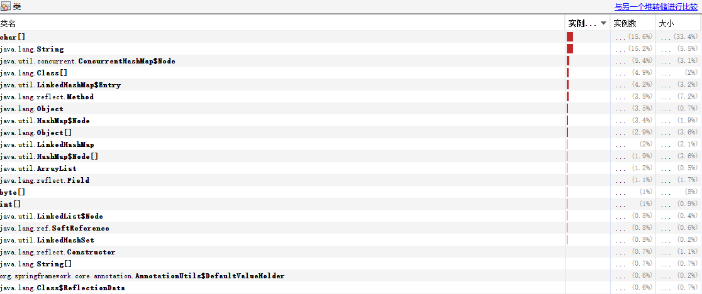
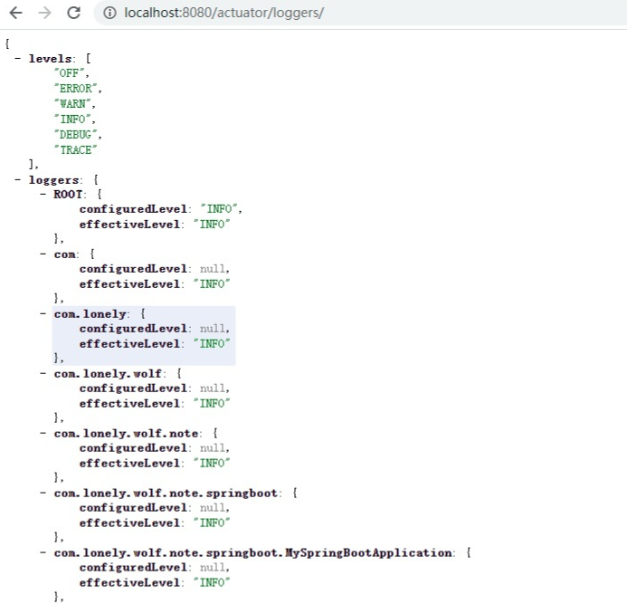
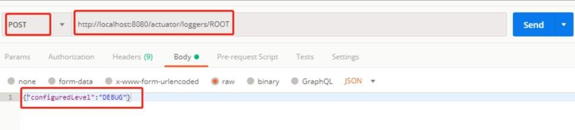
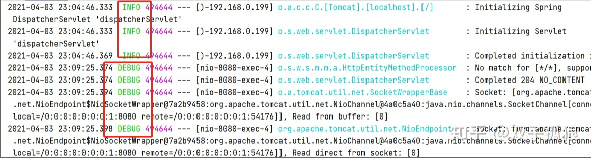
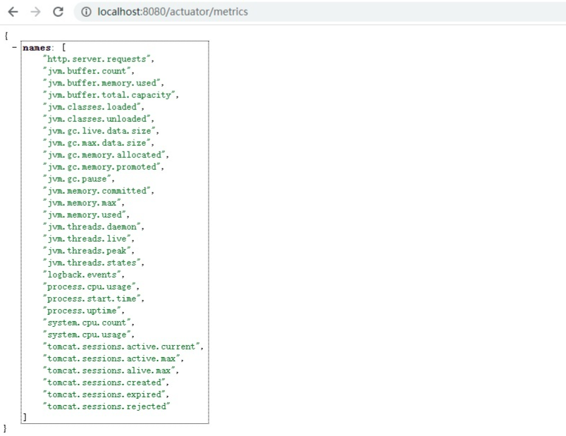
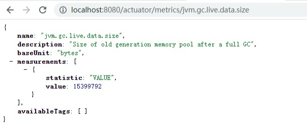
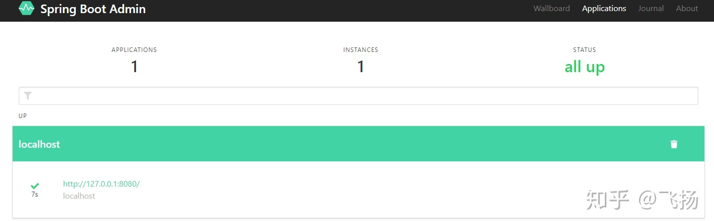
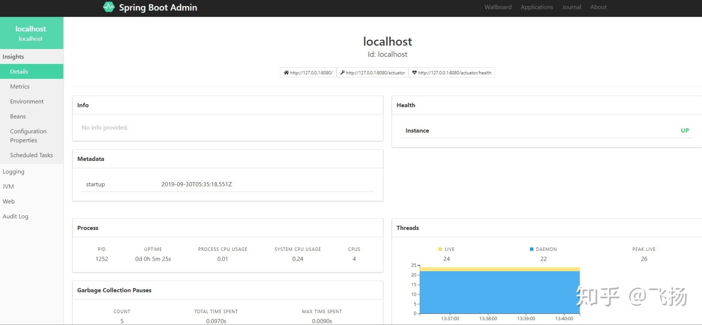

# SpringBoot 整合 actuator

> SpringBoot 自带监控功能 Actuator，可以帮助实现对程序内部运行情况监控，比如监控状况、Bean 加载情况、环境变量、日志信息、线程信息等

## 配置 Actuator

- ### `pom.xml`

```
<!-- web start-->
<dependency>
    <groupId>org.springframework.boot</groupId>
    <artifactId>spring-boot-starter-web</artifactId>
</dependency>
<!-- web end-->
<!-- actuator start-->
<dependency>
    <groupId>org.springframework.boot</groupId>
    <artifactId>spring-boot-starter-actuator</artifactId>
</dependency>
<!-- actuator end-->
```

- 浏览器打开链接 http://localhost:8080/actuator/  
  可以看到所有支持的连接，默认只有

```
/actuator
/actuator/health
/actuator/health/{component}
/actuator/health/{component}/{instance}
/actuator/info
```

- bean 加载情况 http://localhost:8080/actuator/beans

具体的使用方法：

引入上述的依赖 jar

通过下面的配置启用所有的监控端点，默认情况下，这些端点是禁用的；

```
management:
  endpoints:
    web:
      exposure:
        include: "*"
“*”号代表启用所有的监控端点，可以单独启用，例如，`health`，`info`，`metrics`等
```

## Actuator 的 REST 接口

Actuator 监控分成两类：原生端点和用户自定义端点；自定义端点主要是指扩展性，用户可以根据自己的实际应用，定义一些比较关心的指标，在运行期进行监控。

原生端点是在应用程序里提供众多 Web 接口，通过它们了解应用程序运行时的内部状况。原生端点又可以分成三类：

- 应用配置类：可以查看应用在运行期的静态信息：例如自动配置信息、加载的 springbean 信息、yml 文件配置信息、环境信息、请求映射信息；

- 度量指标类：主要是运行期的动态信息，例如堆栈、请求连、一些健康指标、metrics 信息等；

- 操作控制类：主要是指 shutdown, 用户可以发送一个请求将应用的监控功能关闭。

Actuator 提供了 13 个接口，具体如下表所示。

<table><thead><tr><th>GET</th><th>/auditevents</th><th>显示应用暴露的审计事件 (比如认证进入、订单失败)</th></tr></thead><tbody><tr><td>GET</td><td>/beans</td><td>描述应用程序上下文里全部的 Bean，以及它们的关系</td></tr><tr><td>GET</td><td>/conditions</td><td>就是 1.0 的 /autoconfig ，提供一份自动配置生效的条件情况，记录哪些自动配置条件通过了，哪些没通过</td></tr><tr><td>GET</td><td>/configprops</td><td>描述配置属性 (包含默认值) 如何注入 Bean</td></tr><tr><td>GET</td><td>/env</td><td>获取全部环境属性</td></tr><tr><td>GET</td><td>/env/{name}</td><td>根据名称获取特定的环境属性值</td></tr><tr><td>GET</td><td>/flyway</td><td>提供一份 Flyway 数据库迁移信息</td></tr><tr><td>GET</td><td>/liquidbase</td><td>显示 Liquibase 数据库迁移的纤细信息</td></tr><tr><td>GET</td><td>/health</td><td>报告应用程序的健康指标，这些值由 HealthIndicator 的实现类提供</td></tr><tr><td>GET</td><td>/heapdump</td><td>dump 一份应用的 JVM 堆信息</td></tr><tr><td>GET</td><td>/httptrace</td><td>显示 HTTP 足迹，最近 100 个 HTTP request/repsponse</td></tr><tr><td>GET</td><td>/info</td><td>获取应用程序的定制信息，这些信息由 info 打头的属性提供</td></tr><tr><td>GET</td><td>/logfile</td><td>返回 log file 中的内容 (如果 logging.file 或者 logging.path 被设置)</td></tr><tr><td>GET</td><td>/loggers</td><td>显示和修改配置的 loggers</td></tr><tr><td>GET</td><td>/metrics</td><td>报告各种应用程序度量信息，比如内存用量和 HTTP 请求计数</td></tr><tr><td>GET</td><td>/metrics/{name}</td><td>报告指定名称的应用程序度量值</td></tr><tr><td>GET</td><td>/scheduledtasks</td><td>展示应用中的定时任务信息</td></tr><tr><td>GET</td><td>/sessions</td><td>如果我们使用了 Spring Session 展示应用中的 HTTP sessions 信息</td></tr><tr><td>POST</td><td>/shutdown</td><td>关闭应用程序，要求 endpoints.shutdown.enabled 设置为 true</td></tr><tr><td>GET</td><td>/mappings</td><td>描述全部的 URI 路径，以及它们和控制器 (包含 Actuator 端点) 的映射关系</td></tr><tr><td>GET</td><td>/threaddump</td><td>获取线程活动的快照</td></tr></tbody></table>

### 命令详解

在 Spring Boot 2.x 中为了安全期间，Actuator 只开放了两个端点 /actuator/health 和 /actuator/info。可以在配置文件中设置打开。

可以打开所有的监控点

```
management:
  endpoints:
    web:
      exposure:
        include: "*"
```

也可以选择打开部分

```
management:
  endpoints:
    web:
      exposure:
        exclude: beans,trace
```

Actuator 默认所有的监控点路径都在 / actuator/\*，当然如果有需要这个路径也支持定制。

```
management:
  endpoints:
    web:
      base-path: /manage #记得要加上/
```

设置完重启后，再次访问地址就会变成 / manage/\*

Actuator 几乎监控了应用涉及的方方面面，我们重点讲述一些经常在项目中常用的命令。

#### health

health 主要用来检查应用的运行状态，这是我们使用最高频的一个监控点。通常使用此接口提醒我们应用实例的运行状态，以及应用不” 健康 “的原因，比如数据库连接、磁盘空间不够等。

默认情况下 health 的状态是开放的，添加依赖后启动项目，访问：http://localhost:8080/actuator/health 即可看到应用的状态。

```
{
    "status" : "UP"
}
```

要想查看详细的应用健康信息需要配置 management.endpoint.health.show-details 的值为 always，配置之后我们再次访问 http://localhost:8080/actuator/health，获取的信息如下：

```
{
    "status": "UP",
    "components": {
        "diskSpace": {
            "status": "UP",
            "details": {
                "total": 236510507008,
                "free": 223361744896,
                "threshold": 10485760
            }
        },
        "ping": {
            "status": "UP"
        }
    }
}
```

Spring boot 的健康信息都是从 ApplicationContext 中的各种 HealthIndicator Beans 中收集到的，Spring boot 框架中包含了大量的 HealthIndicators 的实现类，当然你也可以实现自己认为的健康状态。

默认情况下，最终的 Spring Boot 应用的状态是由 HealthAggregator 汇总而成的，汇总的算法是：

- 1 设置状态码顺序：setStatusOrder(Status.DOWN, Status.OUT_OF_SERVICE, Status.UP, Status.UNKNOWN);。
- 2 过滤掉不能识别的状态码。
- 3 如果无任何状态码，整个 Spring Boot 应用的状态是 UNKNOWN。
- 4 将所有收集到的状态码按照 1 中的顺序排序。
- 5 返回有序状态码序列中的第一个状态码，作为整个 Spring Boot 应用的状态。

health 通过合并几个健康指数检查应用的健康情况。Spring boot 框架自带的 `HealthIndicators` 目前包括：

<table><thead><tr><th>CassandraHealthIndicator</th><th>Checks that a Cassandra database is up.</th></tr></thead><tbody><tr><td><a href="https://link.jianshu.com/?t=https%3A%2F%2Fgithub.com%2Fspring-projects%2Fspring-boot%2Ftree%2Fv2.0.1.RELEASE%2Fspring-boot-project%2Fspring-boot-actuator%2Fsrc%2Fmain%2Fjava%2Forg%2Fspringframework%2Fboot%2Factuate%2Fsystem%2FDiskSpaceHealthIndicator.java"><code>DiskSpaceHealthIndicator</code></a></td><td>Checks for low disk space.</td></tr><tr><td><a href="https://link.jianshu.com/?t=https%3A%2F%2Fgithub.com%2Fspring-projects%2Fspring-boot%2Ftree%2Fv2.0.1.RELEASE%2Fspring-boot-project%2Fspring-boot-actuator%2Fsrc%2Fmain%2Fjava%2Forg%2Fspringframework%2Fboot%2Factuate%2Fjdbc%2FDataSourceHealthIndicator.java"><code>DataSourceHealthIndicator</code></a></td><td>Checks that a connection to <code>DataSource</code> can be obtained.</td></tr><tr><td><a href="https://link.jianshu.com/?t=https%3A%2F%2Fgithub.com%2Fspring-projects%2Fspring-boot%2Ftree%2Fv2.0.1.RELEASE%2Fspring-boot-project%2Fspring-boot-actuator%2Fsrc%2Fmain%2Fjava%2Forg%2Fspringframework%2Fboot%2Factuate%2Felasticsearch%2FElasticsearchHealthIndicator.java"><code>ElasticsearchHealthIndicator</code></a></td><td>Checks that an Elasticsearch cluster is up.</td></tr><tr><td><a href="https://link.jianshu.com/?t=https%3A%2F%2Fgithub.com%2Fspring-projects%2Fspring-boot%2Ftree%2Fv2.0.1.RELEASE%2Fspring-boot-project%2Fspring-boot-actuator%2Fsrc%2Fmain%2Fjava%2Forg%2Fspringframework%2Fboot%2Factuate%2Finflux%2FInfluxDbHealthIndicator.java"><code>InfluxDbHealthIndicator</code></a></td><td>Checks that an InfluxDB server is up.</td></tr><tr><td><a href="https://link.jianshu.com/?t=https%3A%2F%2Fgithub.com%2Fspring-projects%2Fspring-boot%2Ftree%2Fv2.0.1.RELEASE%2Fspring-boot-project%2Fspring-boot-actuator%2Fsrc%2Fmain%2Fjava%2Forg%2Fspringframework%2Fboot%2Factuate%2Fjms%2FJmsHealthIndicator.java"><code>JmsHealthIndicator</code></a></td><td>Checks that a JMS broker is up.</td></tr><tr><td><a href="https://link.jianshu.com/?t=https%3A%2F%2Fgithub.com%2Fspring-projects%2Fspring-boot%2Ftree%2Fv2.0.1.RELEASE%2Fspring-boot-project%2Fspring-boot-actuator%2Fsrc%2Fmain%2Fjava%2Forg%2Fspringframework%2Fboot%2Factuate%2Fmail%2FMailHealthIndicator.java"><code>MailHealthIndicator</code></a></td><td>Checks that a mail server is up.</td></tr><tr><td><a href="https://link.jianshu.com/?t=https%3A%2F%2Fgithub.com%2Fspring-projects%2Fspring-boot%2Ftree%2Fv2.0.1.RELEASE%2Fspring-boot-project%2Fspring-boot-actuator%2Fsrc%2Fmain%2Fjava%2Forg%2Fspringframework%2Fboot%2Factuate%2Fmongo%2FMongoHealthIndicator.java"><code>MongoHealthIndicator</code></a></td><td>Checks that a Mongo database is up.</td></tr><tr><td><a href="https://link.jianshu.com/?t=https%3A%2F%2Fgithub.com%2Fspring-projects%2Fspring-boot%2Ftree%2Fv2.0.1.RELEASE%2Fspring-boot-project%2Fspring-boot-actuator%2Fsrc%2Fmain%2Fjava%2Forg%2Fspringframework%2Fboot%2Factuate%2Fneo4j%2FNeo4jHealthIndicator.java"><code>Neo4jHealthIndicator</code></a></td><td>Checks that a Neo4j server is up.</td></tr><tr><td><a href="https://link.jianshu.com/?t=https%3A%2F%2Fgithub.com%2Fspring-projects%2Fspring-boot%2Ftree%2Fv2.0.1.RELEASE%2Fspring-boot-project%2Fspring-boot-actuator%2Fsrc%2Fmain%2Fjava%2Forg%2Fspringframework%2Fboot%2Factuate%2Famqp%2FRabbitHealthIndicator.java"><code>RabbitHealthIndicator</code></a></td><td>Checks that a Neo4j server is up.</td></tr><tr><td><a href="https://link.jianshu.com/?t=https%3A%2F%2Fgithub.com%2Fspring-projects%2Fspring-boot%2Ftree%2Fv2.0.1.RELEASE%2Fspring-boot-project%2Fspring-boot-actuator%2Fsrc%2Fmain%2Fjava%2Forg%2Fspringframework%2Fboot%2Factuate%2Fredis%2FRedisHealthIndicator.java"><code>RedisHealthIndicator</code></a></td><td>Checks that a Redis server is up.</td></tr><tr><td><a href="https://link.jianshu.com/?t=https%3A%2F%2Fgithub.com%2Fspring-projects%2Fspring-boot%2Ftree%2Fv2.0.1.RELEASE%2Fspring-boot-project%2Fspring-boot-actuator%2Fsrc%2Fmain%2Fjava%2Forg%2Fspringframework%2Fboot%2Factuate%2Fsolr%2FSolrHealthIndicator.java"><code>SolrHealthIndicator</code></a></td><td>Checks that a Solr server is up.</td></tr></tbody></table>

举个例子，如果你的应用使用 Redis，RedisHealthindicator 将被当作检查的一部分；如果使用 MongoDB，那么 MongoHealthIndicator 将被当作检查的一部分。

可以在配置文件中关闭特定的健康检查指标，比如关闭 redis 的健康检查：

```
management:
  health:
    redise:
      enabled: false
```

默认，所有的这些健康指标被当作健康检查的一部分。  
自定义 HealthIndicator 健康检查  
有时候需要提供自定义的健康状态检查信息，你可以通过实现 HealthIndicator 的接口来实现，并将该实现类注册为 spring bean。你需要实现其中的 health() 方法，并返回自定义的健康状态响应信息，该响应信息应该包括一个状态码和要展示详细信息。例如，下面就是一个接口 HealthIndicator 的实现类：

```
@Component
public class MyHealthIndicator implements HealthIndicator {

    @Override
    public Health health() {
        int errorCode = check(); // perform some specific health check
        if (errorCode != 0) {
            return Health.down().withDetail("Error Code", errorCode).build();
        }
        return Health.up().build();
    }

}
```

另外，除了 Spring boot 定义的几个状态类型，我们也可以自定义状态类型，用来表示一个新的系统状态。在这种情况下，你还需要实现接口 HealthAggregator ，或者通过配置 management.health.status.order 来继续使用 HealthAggregator 的默认实现。

例如，在你自定义的健康检查 HealthIndicator 的实现类中，使用了自定义的状态类型 FATAL，为了配置该状态类型的严重程度，你需要在 application 的配置文件中添加如下配置：

```
management:
  health:
    status:
      order: FATAL, DOWN, OUT_OF_SERVICE, UNKNOWN, UP
```

在做健康检查时，响应中的 HTTP 状态码反应了整体的健康状态，（例如，UP 对应 200, 而 OUT_OF_SERVICE 和 DOWN 对应 503）。同样，你也需要为自定义的状态类型设置对应的 HTTP 状态码，例如，下面的配置可以将 FATAL 映射为 503（服务不可用）：

```
management:
  health:
    status:
      http-mapping:
        FATAL: 503
```

下面是内置健康状态类型对应的 HTTP 状态码列表：

<table><thead><tr><th>Status</th><th>Mapping</th></tr></thead><tbody><tr><td>OUT_OF_SERVICE</td><td>SERVICE_UNAVAILABLE (503)</td></tr><tr><td>DOWN</td><td>SERVICE_UNAVAILABLE (503)</td></tr><tr><td>UP</td><td>No mapping by default, so http status is 200</td></tr><tr><td>UNKNOWN</td><td>No mapping by default, so http status is 200</td></tr></tbody></table>

#### info

info 就是我们自己配置在配置文件中以 info 开头的配置信息，比如我们在示例项目中的配置是：

```
info:
  app:
    name:
      spring-boot-actuator
    version: 1.0.0
    test: test
```

启动示例项目，访问：http://localhost:8080/actuator/info 返回部分信息如下：

```
{
  "app": {
    "name": "spring-boot-actuator",
    "version": "1.0.0",
    "test":"test"
  }
}
```

#### beans

根据示例就可以看出，展示了 bean 的别名、类型、是否单例、类的地址、依赖等信息。

启动示例项目，访问：`http://localhost:8080/actuator/beans`返回部分信息如下：

```
[
  {
    "context": "application:8080:management",
    "parent": "application:8080",
    "beans": [
      {
        "bean": "embeddedServletContainerFactory",
        "aliases": [

        ],
        "scope": "singleton",
        "type": "org.springframework.boot.context.embedded.tomcat.TomcatEmbeddedServletContainerFactory",
        "resource": "null",
        "dependencies": [

        ]
      },
      {
        "bean": "endpointWebMvcChildContextConfiguration",
        "aliases": [

        ],
        "scope": "singleton",
        "type": "org.springframework.boot.actuate.autoconfigure.EndpointWebMvcChildContextConfiguration$$EnhancerBySpringCGLIB$$a4a10f9d",
        "resource": "null",
        "dependencies": [

        ]
      }
  }
]
```

#### conditions

Spring Boot 的自动配置功能非常便利，但有时候也意味着出问题比较难找出具体的原因。使用 conditions 可以在应用运行时查看代码了某个配置在什么条件下生效，或者某个自动配置为什么没有生效。

启动示例项目，访问：http://localhost:8080/actuator/conditions 返回部分信息如下：

```
{
    "positiveMatches": {
     "DevToolsDataSourceAutoConfiguration": {
            "notMatched": [
                {
                    "condition": "DevToolsDataSourceAutoConfiguration.DevToolsDataSourceCondition",
                    "message": "DevTools DataSource Condition did not find a single DataSource bean"
                }
            ],
            "matched": [ ]
        },
        "RemoteDevToolsAutoConfiguration": {
            "notMatched": [
                {
                    "condition": "OnPropertyCondition",
                    "message": "@ConditionalOnProperty (spring.devtools.remote.secret) did not find property 'secret'"
                }
            ],
            "matched": [
                {
                    "condition": "OnClassCondition",
                    "message": "@ConditionalOnClass found required classes 'javax.servlet.Filter', 'org.springframework.http.server.ServerHttpRequest'; @ConditionalOnMissingClass did not find unwanted class"
                }
            ]
        }
    }
}
```

#### heapdump

返回一个 GZip 压缩的 JVM 堆 dump

启动示例项目，访问：http://localhost:8080/actuator/heapdump 会自动生成一个 Jvm 的堆文件 heapdump，我们可以使用 JDK 自带的 Jvm 监控工具 VisualVM 打开此文件查看内存快照。类似如下图：  


#### shutdown

开启接口优雅关闭 Spring Boot 应用，要使用这个功能首先需要在配置文件中开启：

```
management:
  endpoint:
    shutdown:
      enabled: true
```

配置完成之后，启动示例项目，使用 curl 模拟 post 请求访问 shutdown 接口。

> shutdown 接口默认只支持 post 请求。

```
curl -X POST "http://localhost:8080/actuator/shutdown"
{
    "message": "Shutting down, bye..."
}
```

此时你会发现应用已经被关闭。

#### mappings

描述全部的 URI 路径，以及它们和控制器的映射关系

启动示例项目，访问：`http://localhost:8080/actuator/mappings`返回部分信息如下：

```
{
  "/**/favicon.ico": {
    "bean": "faviconHandlerMapping"
  },
  "{[/hello]}": {
    "bean": "requestMappingHandlerMapping",
    "method": "public java.lang.String com.neo.controller.HelloController.index()"
  },
  "{[/error]}": {
    "bean": "requestMappingHandlerMapping",
    "method": "public org.springframework.http.ResponseEntity<java.util.Map<java.lang.String, java.lang.Object>> org.springframework.boot.autoconfigure.web.BasicErrorController.error(javax.servlet.http.HttpServletRequest)"
  }
}
```

#### threaddump

/threaddump 接口会生成当前线程活动的快照。这个功能非常好，方便我们在日常定位问题的时候查看线程的情况。 主要展示了线程名、线程 ID、线程的状态、是否等待锁资源等信息。

启动示例项目，访问：http://localhost:8080/actuator/threaddump 返回部分信息如下：

```
[
  {
    "threadName": "http-nio-8088-exec-6",
    "threadId": 49,
    "blockedTime": -1,
    "blockedCount": 0,
    "waitedTime": -1,
    "waitedCount": 2,
    "lockName": "java.util.concurrent.locks.AbstractQueuedSynchronizer$ConditionObject@1630a501",
    "lockOwnerId": -1,
    "lockOwnerName": null,
    "inNative": false,
    "suspended": false,
    "threadState": "WAITING",
    "stackTrace": [
      {
        "methodName": "park",
        "fileName": "Unsafe.java",
        "lineNumber": -2,
        "className": "sun.misc.Unsafe",
        "nativeMethod": true
      },
      ...
      {
        "methodName": "run",
        "fileName": "TaskThread.java",
        "lineNumber": 61,
        "className": "org.apache.tomcat.util.threads.TaskThread$WrappingRunnable",
        "nativeMethod": false
      }
      ...
    ],
    "lockInfo": {
      "className": "java.util.concurrent.locks.AbstractQueuedSynchronizer$ConditionObject",
      "identityHashCode": 372286721
    }
  }
  ...
]
```

生产出现问题的时候，可以通过应用的线程快照来检测应用正在执行的任务。

#### loggers 端点

访问 `http://localhost:8080/actuator/loggers` 可以查看当前应用的日志级别等信息：



这里面本身并不特别，但是有一个功能却非常有用，比如我们生产环境日志级别一般都是 `info`，但是现在有一个 `bug` 通过 `info` 级别无法排查，那么我们就可以临时修改 `log` 级别。

比如上图中的 `ROOT` 节点是 `info` 级别，那么我们可以通过 `postman` 等工具来发一个 `post` 请求修改日志级别。



修改之后就会发现，日志由原来的 `info` 变成了 `debug`：



#### metrics 端点

`metrics` 是一个非常重要的监控端点，其监控内容覆盖了 `JVM` 内存、堆、类加载、处理器和 `tomcat` 容器等一些重要指标：



可以看到这里面包含了非常多的指标，任意访问一个指标就可以查看对应的指标信息：



### 自定义 Endpoint

自定义配置来控制是否开启过滤

```
actuator:
  filter:
    switch: false
```

### 自定义监控端点常用注解

自定义一个监控端点主要有如下常用注解：

- @Endpoint：定义一个监控端点，同时支持 `HTTP` 和 `JMX` 两种方式。
- @WebEndpoint：定义一个监控端点，只支持 `HTTP` 方式。
- @JmxEndpoint：定义一个监控端点，只支持 `JMX` 方式。

以上三个注解作用在类上，表示当前类是一个监控端点，另外还有一些注解会用在方法和参数上：

- @ReadOperation：作用在方法上，可用来返回端点展示的信息（通过 `Get` 方法请求）。
- @WriteOperation：作用在方法上，可用来修改端点展示的信息（通过 `Post` 方法请求）。
- @DeleteOperation：作用在方法上，可用来删除对应端点信息（通过 `Delete` 方法请求）。
- @Selector：作用在参数上，用来定位一个端点的具体指标路由。

一般情况下，是没必要自定义 Endpoint 的，但是也不排除特殊情况，我这里自定义一个 Endpoint，用来往 request 里放一个 user 对象，这个 user 是用来做测试的，用于下面突破 filter 用的（下面再说），这里先说怎么增查这个 user。

过程如下： - 使用 @Endpoint 注解相应的类，作为 Actuator 的一个 endpoint。注解要指定 id，这个 id 作为访问路径，比如这里是 / actuator/super； - @ReadOperation 来注解查询接口，如果要根据路径做查询，要用 @Selector 注解方法参数；**注意这地方是`@Selector String arg0`，这个 arg0 不能改变，改成其他的，开放出去的接口还是 /{arg0}，这就导致你的方法无法正常获取参数值。** - @WriteOperation 来注解修改接口，注意请求数据必须是 json，而且参数不像 controller 中那么灵活，不能将实体作为参数，要把实体中相应的属性拿出来做参数。 - 这里在增加用户时，往 request 里放一个 user 对象。

SuperEndPoint :

```
package com.cff.springbootwork.actuator.endpoint;

import java.util.Map;
import java.util.Set;
import java.util.concurrent.ConcurrentHashMap;

import javax.servlet.http.HttpServletRequest;

import org.springframework.boot.actuate.endpoint.annotation.Endpoint;
import org.springframework.boot.actuate.endpoint.annotation.ReadOperation;
import org.springframework.boot.actuate.endpoint.annotation.Selector;
import org.springframework.boot.actuate.endpoint.annotation.WriteOperation;
import org.springframework.web.context.request.RequestContextHolder;
import org.springframework.web.context.request.ServletRequestAttributes;

@Endpoint(id = "super")
public class SuperEndPoint {
    private Map<String, SuperUser> users = new ConcurrentHashMap<>();

    @ReadOperation
    public Set<String> users() {
        return users.keySet();
    }

    @ReadOperation
    public SuperUser usersIdentify(@Selector String arg0) {
        return users.get(arg0);
    }

    @WriteOperation
    public Set<String> set(String userName, String passwd) {
        HttpServletRequest request = ((ServletRequestAttributes) RequestContextHolder.getRequestAttributes())
                .getRequest();
        if (request != null) {
            SuperUser superUser = new SuperUser();
            superUser.setUserName(userName);
            superUser.setPasswd(passwd);
            request.getSession().setAttribute("superUser", superUser);

            users.put(superUser.getUserName(), superUser);
        }

        return users.keySet();
    }

    public static class SuperUser {
        private String userName;
        private String passwd;

        public String getUserName() {
            return userName;
        }

        public void setUserName(String userName) {
            this.userName = userName;
        }

        public String getPasswd() {
            return passwd;
        }

        public void setPasswd(String passwd) {
            this.passwd = passwd;
        }
    }
}
```

**还要将 Endpoint 注册为 bean**

MvcEndPointConfig:

```
package com.cff.springbootwork.actuator;

import org.springframework.boot.actuate.autoconfigure.endpoint.condition.ConditionalOnEnabledEndpoint;
import org.springframework.boot.web.servlet.ServletComponentScan;
import org.springframework.context.annotation.Bean;
import org.springframework.context.annotation.Configuration;

import com.cff.springbootwork.actuator.endpoint.SuperEndPoint;

@Configuration
@ServletComponentScan
public class MvcEndPointConfig {

    @Bean
    @ConditionalOnEnabledEndpoint
    public SuperEndPoint superEndPoint() {
        return new SuperEndPoint();
    }
}
```

# 使用 Filter 对访问 actuator 做限制

上面已经说了，actuator 的接口要做保护，我这里就用 filter 对接口做最简单的保护。

- 对 / actuator/\* 下所有路径做过滤, 并用 actuator.filter.switch 属性对 filter 做开关；
- 如果时 /actuator/super 路径的 post 操作，放行它，它将会往 request 中放一个对象；
- 其他 / actuator/\* 下路径要判断 request 中有没有 user 对象，没有就返回错误提示。

ActuatorPermissionFilter ：

```
package com.cff.springbootwork.actuator.filter;

import java.io.IOException;

import javax.servlet.Filter;
import javax.servlet.FilterChain;
import javax.servlet.FilterConfig;
import javax.servlet.ServletException;
import javax.servlet.ServletRequest;
import javax.servlet.ServletResponse;
import javax.servlet.annotation.WebFilter;
import javax.servlet.http.HttpServletRequest;
import javax.servlet.http.HttpServletResponse;

import org.springframework.beans.factory.annotation.Value;
import org.springframework.core.annotation.Order;
import org.springframework.http.HttpMethod;
import org.springframework.http.HttpStatus;
import org.springframework.http.MediaType;

import com.fasterxml.jackson.databind.ObjectMapper;

@WebFilter(urlPatterns = "/actuator/*", filterName = "actuatorPermissionFilter")
@Order(1) // 指定过滤器的执行顺序,值越大越靠后执行
public class ActuatorPermissionFilter implements Filter {
    private String excludePath = "actuator/super";
    @Value("${actuator.filter.switch}")
    Boolean actuatorSwitch;

    @Override
    public void init(FilterConfig filterConfig) {

    }

    @Override
    public void doFilter(ServletRequest servletRequest, ServletResponse servletResponse, FilterChain filterChain)
            throws IOException, ServletException {
        HttpServletRequest request = (HttpServletRequest) servletRequest;
        HttpServletResponse response = (HttpServletResponse) servletResponse;
        if (actuatorSwitch && !(request.getRequestURI().endsWith(excludePath)
                && request.getMethod().equals(HttpMethod.POST.toString()))) {
            Object user = request.getSession().getAttribute("superUser");
            if (user == null) {
                // 未登录,返回数据
                ObjectMapper mapper = new ObjectMapper();
                response.setStatus(HttpStatus.OK.value());
                response.setContentType(MediaType.APPLICATION_JSON_UTF8_VALUE);
                mapper.writeValue(response.getWriter(), "您没有权限访问该接口，请使用自定义的登录接口设置superUser后使用！");
                return;
            }
        }
        filterChain.doFilter(servletRequest, servletResponse);

    }

    @Override
    public void destroy() {
    }

}
```

### Spring Boot Monitor 做监控页面

额外引入依赖

```
<dependency>
    <groupId>cn.pomit</groupId>
    <artifactId>spring-boot-monitor</artifactId>
    <version>0.0.1</version>
</dependency>
```

[Spring Boot Monitor](https://link.zhihu.com/?target=https%3A//www.pomit.cn/SpringBootMonitor/%23/) 是一个对 Spring boot admin 监控工具做修改并适配单机的监控工具，完美继承了 Spring boot admin 的风格，直接使用 actuator 的指标进行显示。

[Spring Boot Monitor](https://link.zhihu.com/?target=https%3A//www.pomit.cn/SpringBootMonitor/%23/) 官网：[https://www.pomit.cn/SpringBootMonitor](https://link.zhihu.com/?target=https%3A//www.pomit.cn/SpringBootMonitor/%23/)

前面 maven 依赖中，已经说明依赖`spring-boot-monitor`，这时，无需其他配置.

访问`http://127.0.0.1:8080/monitor`， 自动跳转到 Spring Boot Monitor 的监控页面。



Spring Boot Monitor 的监控页面和 Spring boot admin 的一模一样，前端的功能也一模一样。



可以对 Spring boot 的各项指标一目了然，还可以进行简单的操作。

当然，如果 Spring boot actuator 的指标被限制了，它也拿不到相应的指标了，因为它是直接请求 actuator 接口的。

## 参考

- [spring boot 2 使用 actuator 404 的问题](https://my.oschina.net/iyinghui/blog/1835220)  
  使用 actuator 的指标进行显示。

[Spring Boot Monitor](https://link.zhihu.com/?target=https%3A//www.pomit.cn/SpringBootMonitor/%23/) 官网：[https://www.pomit.cn/SpringBootMonitor](https://link.zhihu.com/?target=https%3A//www.pomit.cn/SpringBootMonitor/%23/)

前面 maven 依赖中，已经说明依赖`spring-boot-monitor`，这时，无需其他配置.

访问`http://127.0.0.1:8080/monitor`， 自动跳转到 Spring Boot Monitor 的监控页面。

[外链图片转存中…(img-Naa3Zjvk-1642576052461)]

Spring Boot Monitor 的监控页面和 Spring boot admin 的一模一样，前端的功能也一模一样。

[外链图片转存中…(img-EaAoMOpX-1642576052462)]

可以对 Spring boot 的各项指标一目了然，还可以进行简单的操作。

当然，如果 Spring boot actuator 的指标被限制了，它也拿不到相应的指标了，因为它是直接请求 actuator 接口的。

## 参考

- [spring boot 2 使用 actuator 404 的问题](https://my.oschina.net/iyinghui/blog/1835220)
- [Spring Boot 2.0 官方文档之 Actuator](https://blog.csdn.net/alinyua/article/details/80009435)
