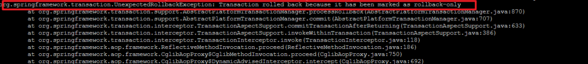
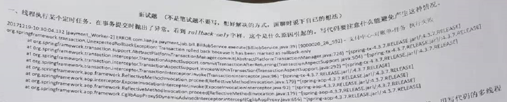
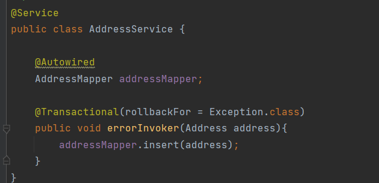
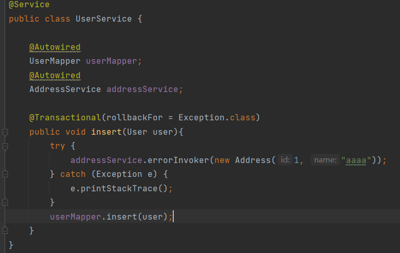
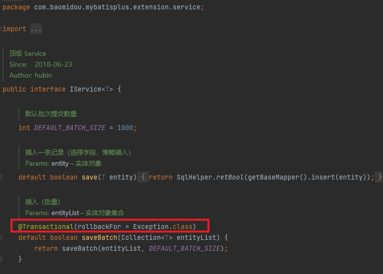
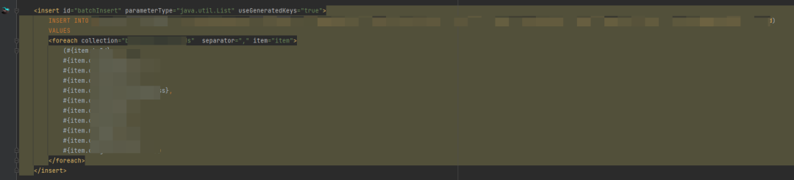

昨天测试说有个 xx 功能用不了，扔给我一个截图，说有报错：



报错信息就是：`Transaction rolled back because it has been marked as rollback-only`，很好理解：事务被回滚了，因为它已经被标记了只能回滚。

我一看巧了，这不就是我之前分析过的面试题吗！



之前的文章我解释过：这种错一般发生在嵌套事务中，即内层事务出错，但是由于是否提交事务的操作由外层事务触发，于是乎内层事务只能做个标记，来设置当前事务只能回滚。

紧接着它想抛出错误，但是由于被 try catch 了，于是乎正常执行后续的逻辑，等执行到最后，外层要提交事务了，发现当前事务已经被打了回滚的标记，所以提交失败，报了上面的错。

具体原理可以看我之前的那篇文章，这里简单举例下会出错的示例代码：

大致就是下面这个代码调用逻辑，有一个 service 标记了 @Transcational，采用默认的事务传播机制：



紧接着 UserService#insert 调用了 addressService#errorInvoker，这个方法也标记了 @Transcational：



这样一来，只要 addressService#errorInvoker 的调用发生报错，那么必然能重现上面的报错信息。

原理很清晰，我不可能犯这个错。

我信誓旦旦的对测试说：这肯定是老陈写的 bug，与我无关！


老陈瞄了我一眼：老子已经 2 个月没碰过那个项目了，你扯犊子呢？

随后这个老测试直接把更详细的报错扔了过来，咳咳，涉及公司的类名这里不展示的，反正确实是我的代码....

但是我还是觉得很不可思议，这部分逻辑是我新写的，我压根就没有使用嵌套事务啊！

大致的代码如下：

```
    @Override
    @Transactional(rollbackFor = Exception.class)
    public Boolean xxx(xxx dto) {
        list1 = .....;
        try {
              数据库批量保存list1;
        } catch (Exception e) {
            if (e instanceof DuplicateKeyException) {
                //筛选过滤重复 key 的数据
                //打标发送
                数据库批量保存过滤之后的list1;
            }
            ....
        }
        sendToMQ(xxx);
        list2 = .....;
        try {
             数据库批量保存list2;
        } catch (Exception e) {
            if (e instanceof DuplicateKeyException) {
                //筛选过滤重复 key 的数据
                //打标发送
                数据库批量保存过滤之后的list2;
            }
            ...
        }
        sendToMQ(xxx);
        return Boolean.TRUE;
    }
```

这个接口其实是一次性接口，用来补数据的，线上跑过一次后，后面应该不会再使用。

出于保险原则，兼容上游部分数据重复调用，所以我做了重复 key 的处理，剔除重复的部分，让不重复的部分正常保存。

正常情况下不会出现这个场景，刚好测试环境测试来回折腾有很多重复数据（其实我这样写也是为了兼容测试，随便他折腾）

这里的代码逻辑不复杂，明面上来看，我并没有调用别的 service ！也并不存在嵌套事务的问题，所以我思来想去也看不明白。


于是......

我出门放了个水，顺带逛了一圈，接着买了杯咖啡，遇事不决，量子力...个屁，立马屁颠屁颠的跑回来继续看代码。

回来突然就看 try-catch 不爽。

但是 try 里面就是一个 mybatis-plus 的 IService，批量保存数据的操作。

难道它有什么骚操作？点进去一看突然发现：



我丢！

唤起了我的记忆，mybatis-plus 为了保证批量保存的事务性，加了 `@Transactional`。

合着我确实没想着使用嵌套事务，但是这被迫上了“贼船”啊！

这本是好意，但是在我这个场景有点麻，它完美的复现了上文提到的那个错误使用，在有重复 key 的场景确实报错了，但是被外层 try-catch 拦住了抛错，不过事务上已经打了失败的标了！

解决办法其实很简单：

1. 把 saveBatch 上的 @Transactional 注解删了，很明显我做不到，这是 mybatisplus 的源码。
2. 把 saveBatch 上的 @Transactional 注解上设置事务传播机制为：REQUIRES_NEW 或 NESTED，很明显，我也做不到，这是 mybatis-plus 的源码。

然后我找了下，好像也没有什么参数可以指定 saveBatch 的事务传播机制。

所以咋办。。。测试还在催我，没办法，只能不用 mybatis-plus 的 saveBatch ，自己通过 mapper 写个批量插入了：

一波操作提交代码重启服务，让测试再试试，且轻飘飘的甩一句：这不是我的 bug，我被框架坑了。

咳咳，反正我不管，我的代码没有 bug，这是程序员最后的倔强。


# 最后

所以在使用三方代码的情况下还是需要多留个心眼点点看。

我记得以前还听说过一个段子，就是有个人用了一个网上的组件，正常情况下都没事，异常情况下，系统就挂了。

后面一找，那个组件在个角落嘎达写了 `System.exit`。
