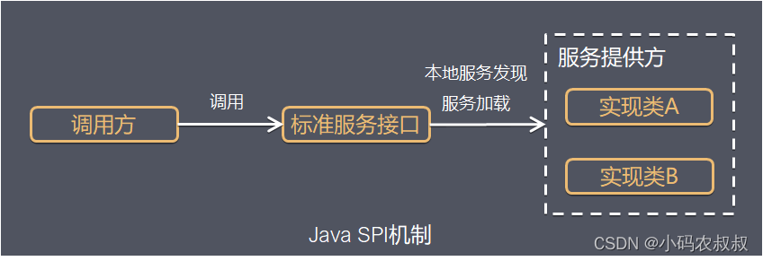
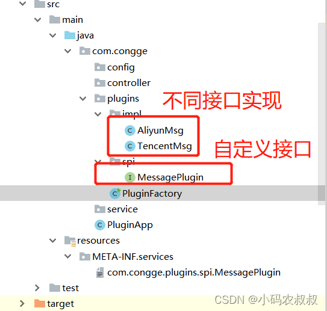
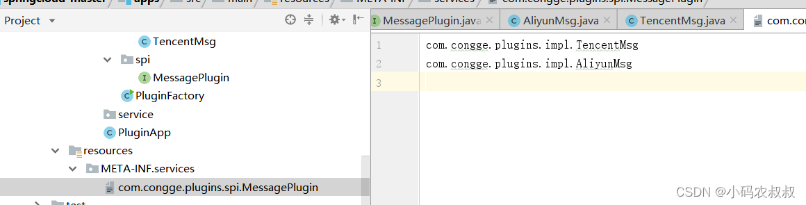
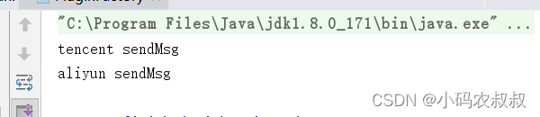
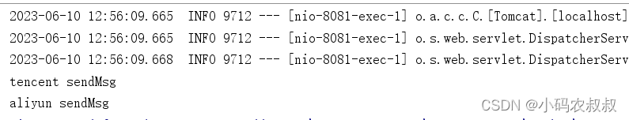
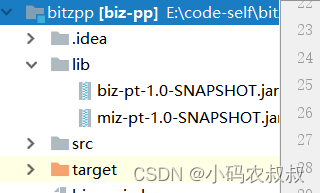
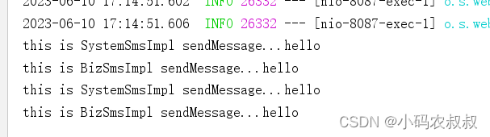
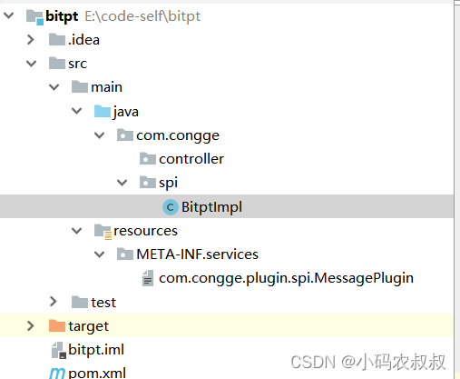
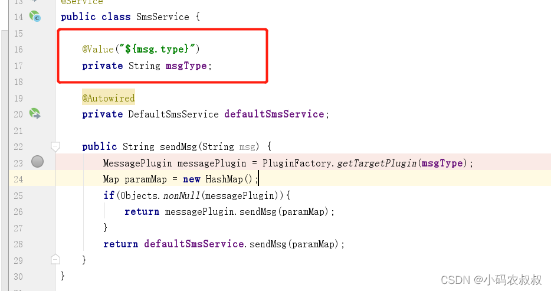

一、前言
====

插件化开发模式正在很多编程语言或技术框架中得以广泛的应用实践，比如大家熟悉的 jenkins，docker 可视化管理平台 rancher，以及日常编码使用的编辑器 idea，vscode 等，随处可见的带有热插拔功能的插件，让系统像插了翅膀一样，大大提升了系统的扩展性和伸缩性，也拓展了系统整体的使用价值，那么为什么要使用插件呢？

1.1 使用插件的好处
-----------

### 1.1.1 模块解耦

实现服务模块之间解耦的方式有很多，但是插件来说，其解耦的程度似乎更高，而且更灵活，可定制化、个性化更好。

> 举例来说，代码中可以使用设计模式来选择使用哪种方式发送短信给下单完成的客户，问题是各个短信服务商并不一定能保证在任何情况下都能发送成功，怎么办呢？这时候设计模式也没法帮你解决这个问题，如果使用定制化插件的方式，结合外部配置参数，假设系统中某种短信发送不出去了，这时候就可以利用插件动态植入，切换为不同的厂商发短信了。

### 1.1.2 提升扩展性和开放性

以 spring 来说，之所以具备如此广泛的生态，与其自身内置的各种可扩展的插件机制是分不开的，试想为什么使用了 spring 框架之后可以很方便的对接其他中间件，那就是 spring 框架提供了很多基于插件化的扩展点。

> 插件化机制让系统的扩展性得以提升，从而可以丰富系统的周边应用生态。

### 1.1.3 方便第三方接入

有了插件之后，第三方应用或系统如果要对接自身的系统，直接基于系统预留的插件接口完成一套适合自己业务的实现即可，而且对自身系统的侵入性很小，甚至可以实现基于配置参数的热加载，方便灵活，开箱即用。

1.2 插件化常用实现思路
-------------

以 java 为例，这里结合实际经验，整理一些常用的插件化实现思路：

*   spi 机制；
*   约定配置和目录，利用反射配合实现；
*   springboot 中的 Factories 机制；
*   java agent（探针）技术；
*   spring 内置扩展点；
*   第三方插件包，例如：spring-plugin-core；
*   spring aop 技术；
*   ...

二、Java 常用插件实现方案
===============

2.1 serviceloader 方式
--------------------

serviceloader 是 java 提供的 spi 模式的实现。按照接口开发实现类，而后配置，java 通过 ServiceLoader 来实现统一接口不同实现的依次调用。而 java 中最经典的 serviceloader 的使用就是 Java 的 spi 机制。

### 2.1.1 java spi

SPI 全称 Service Provider Interface ，是 JDK 内置的一种服务发现机制，SPI 是一种动态替换扩展机制，比如有个接口，你想在运行时动态给他添加实现，你只需按照规范给他添加一个实现类即可。比如大家熟悉的 jdbc 中的 Driver 接口，不同的厂商可以提供不同的实现，有 mysql 的，也有 oracle 的，而 Java 的 SPI 机制就可以为某个接口寻找服务的实现。

下面用一张简图说明下 SPI 机制的原理



### 2.1.2 java spi 简单案例

如下工程目录，在某个应用工程中定义一个插件接口，而其他应用工程为了实现这个接口，只需要引入当前工程的 jar 包依赖进行实现即可，这里为了演示我就将不同的实现直接放在同一个工程下；



**定义接口**

```
public interface MessagePlugin {
 
    public String sendMsg(Map msgMap);
 
}
```

**定义两个不同的实现**

```
public class AliyunMsg implements MessagePlugin {
 
    @Override
    public String sendMsg(Map msgMap) {
        System.out.println("aliyun sendMsg");
        return "aliyun sendMsg";
    }
}
```

```
public class TencentMsg implements MessagePlugin {
 
    @Override
    public String sendMsg(Map msgMap) {
        System.out.println("tencent sendMsg");
        return "tencent sendMsg";
    }
}
```

在 resources 目录按照规范要求创建文件目录，并填写实现类的全类名



**自定义服务加载类**

```
public static void main(String[] args) {
        ServiceLoader<MessagePlugin> serviceLoader = ServiceLoader.load(MessagePlugin.class);
        Iterator<MessagePlugin> iterator = serviceLoader.iterator();
        Map map = new HashMap();
        while (iterator.hasNext()){
            MessagePlugin messagePlugin = iterator.next();
            messagePlugin.sendMsg(map);
        }
    }
```

运行上面的程序后，可以看到下面的效果，这就是说，使用 ServiceLoader 的方式可以加载到不同接口的实现，业务中只需要根据自身的需求，结合配置参数的方式就可以灵活的控制具体使用哪一个实现。



2.2 自定义配置约定方式
-------------

serviceloader 其实是有缺陷的，在使用中必须在 META-INF 里定义接口名称的文件，在文件中才能写上实现类的类名，如果一个项目里插件化的东西比较多，那很可能会出现越来越多配置文件的情况。所以在结合实际项目使用时，可以考虑下面这种实现思路：

*   A 应用定义接口；
*   B,C,D 等其他应用定义服务实现；
*   B,C,D 应用实现后达成 SDK 的 jar；
*   A 应用引用 SDK 或者将 SDK 放到某个可以读取到的目录下；
*   A 应用读取并解析 SDK 中的实现类；

在上文中案例基础上，我们做如下调整；

### 2.2.1 添加配置文件

在配置文件中，将具体的实现类配置进去

```
server :
  port : 8081
impl:
  name : com.congge.plugins.spi.MessagePlugin
  clazz :
    - com.congge.plugins.impl.TencentMsg
    - com.congge.plugins.impl.AliyunMsg
```

### 2.2.2 自定义配置文件加载类

通过这个类，将上述配置文件中的实现类封装到类对象中，方便后续使用；

```
import lombok.Getter;
import lombok.Setter;
import lombok.ToString;
import org.springframework.boot.context.properties.ConfigurationProperties;
@ConfigurationProperties("impl")
@ToString
public class ClassImpl {
    @Getter
    @Setter
    String name;
 
    @Getter
    @Setter
    String[] clazz;
}
```

### 2.2.3 自定义测试接口

使用上述的封装对象通过类加载的方式动态的在程序中引入

```
import com.congge.config.ClassImpl;
import com.congge.plugins.spi.MessagePlugin;
import org.springframework.beans.factory.annotation.Autowired;
import org.springframework.web.bind.annotation.GetMapping;
import org.springframework.web.bind.annotation.RestController;
 
import java.util.HashMap;
 
@RestController
public class SendMsgController {
 
    @Autowired
    ClassImpl classImpl;
 
    //localhost:8081/sendMsg
    @GetMapping("/sendMsg")
    public String sendMsg() throws Exception{
        for (int i=0;i<classImpl.getClazz().length;i++) {
            Class pluginClass= Class.forName(classImpl.getClazz()[i]);
            MessagePlugin messagePlugin = (MessagePlugin) pluginClass.newInstance();
            messagePlugin.sendMsg(new HashMap());
        }
        return "success";
    }
 
}
```

### 2.2.4 启动类

```
@EnableConfigurationProperties({ClassImpl.class})
@SpringBootApplication
public class PluginApp {
 
    public static void main(String[] args) {
        SpringApplication.run(PluginApp.class,args);
    }
 
}
```

启动工程代码后，调用接口：[localhost:8081/sendMsg](http://localhost:8081/sendMsg "localhost:8081/sendMsg")，在控制台中可以看到下面的输出信息，即通过这种方式也可以实现类似 serviceloader 的方式，不过在实际使用时，可以结合配置参数进行灵活的控制；



2.3 自定义配置读取依赖 jar 的方式
---------------------

更进一步，在很多场景下，可能我们并不想直接在工程中引入接口实现的依赖包，这时候可以考虑通过读取指定目录下的依赖 jar 的方式，利用反射的方式进行动态加载，这也是生产中一种比较常用的实践经验。

具体实践来说，主要为下面的步骤：

*   应用 A 定义服务接口；
*   应用 B,C,D 等实现接口（或者在应用内部实现相同的接口）；
*   应用 B,C,D 打成 jar，放到应用 A 约定的读取目录下；
*   应用 A 加载约定目录下的 jar，通过反射加载目标方法；

在上述的基础上，按照上面的实现思路来实现一下；

### 2.3.1 创建约定目录

在当前工程下创建一个 lib 目录，并将依赖的 jar 放进去



### 2.3.2 新增读取 jar 的工具类

添加一个工具类，用于读取指定目录下的 jar，并通过反射的方式，结合配置文件中的约定配置进行反射方法的执行；

```
@Component
public class ServiceLoaderUtils {
 
    @Autowired
    ClassImpl classImpl;
 
 
    public static void loadJarsFromAppFolder() throws Exception {
        String path = "E:\\code-self\\bitzpp\\lib";
        File f = new File(path);
        if (f.isDirectory()) {
            for (File subf : f.listFiles()) {
                if (subf.isFile()) {
                    loadJarFile(subf);
                }
            }
        } else {
            loadJarFile(f);
        }
    }
 
    public static void loadJarFile(File path) throws Exception {
        URL url = path.toURI().toURL();
        // 可以获取到AppClassLoader，可以提到前面，不用每次都获取一次
        URLClassLoader classLoader = (URLClassLoader) ClassLoader.getSystemClassLoader();
        // 加载
        //Method method = URLClassLoader.class.getDeclaredMethod("sendMsg", Map.class);
        Method method = URLClassLoader.class.getMethod("sendMsg", Map.class);
 
        method.setAccessible(true);
        method.invoke(classLoader, url);
    }
 
    public  void main(String[] args) throws Exception{
        System.out.println(invokeMethod("hello"));;
    }
 
    public String doExecuteMethod() throws Exception{
        String path = "E:\\code-self\\bitzpp\\lib";
        File f1 = new File(path);
        Object result = null;
        if (f1.isDirectory()) {
            for (File subf : f1.listFiles()) {
                //获取文件名称
                String name = subf.getName();
                String fullPath = path + "\\" + name;
                //执行反射相关的方法
                //ServiceLoaderUtils serviceLoaderUtils = new ServiceLoaderUtils();
                //result = serviceLoaderUtils.loadMethod(fullPath);
                File f = new File(fullPath);
                URL urlB = f.toURI().toURL();
                URLClassLoader classLoaderA = new URLClassLoader(new URL[]{urlB}, Thread.currentThread()
                        .getContextClassLoader());
                String[] clazz = classImpl.getClazz();
                for(String claName : clazz){
                    if(name.equals("biz-pt-1.0-SNAPSHOT.jar")){
                        if(!claName.equals("com.congge.spi.BitptImpl")){
                            continue;
                        }
                        Class<?> loadClass = classLoaderA.loadClass(claName);
                        if(Objects.isNull(loadClass)){
                            continue;
                        }
                        //获取实例
                        Object obj = loadClass.newInstance();
                        Map map = new HashMap();
                        //获取方法
                        Method method=loadClass.getDeclaredMethod("sendMsg",Map.class);
                        result = method.invoke(obj,map);
                        if(Objects.nonNull(result)){
                            break;
                        }
                    }else if(name.equals("miz-pt-1.0-SNAPSHOT.jar")){
                        if(!claName.equals("com.congge.spi.MizptImpl")){
                            continue;
                        }
                        Class<?> loadClass = classLoaderA.loadClass(claName);
                        if(Objects.isNull(loadClass)){
                            continue;
                        }
                        //获取实例
                        Object obj = loadClass.newInstance();
                        Map map = new HashMap();
                        //获取方法
                        Method method=loadClass.getDeclaredMethod("sendMsg",Map.class);
                        result = method.invoke(obj,map);
                        if(Objects.nonNull(result)){
                            break;
                        }
                    }
                }
                if(Objects.nonNull(result)){
                    break;
                }
            }
        }
        return result.toString();
    }
 
    public Object loadMethod(String fullPath) throws Exception{
        File f = new File(fullPath);
        URL urlB = f.toURI().toURL();
        URLClassLoader classLoaderA = new URLClassLoader(new URL[]{urlB}, Thread.currentThread()
                .getContextClassLoader());
        Object result = null;
        String[] clazz = classImpl.getClazz();
        for(String claName : clazz){
            Class<?> loadClass = classLoaderA.loadClass(claName);
            if(Objects.isNull(loadClass)){
                continue;
            }
            //获取实例
            Object obj = loadClass.newInstance();
            Map map = new HashMap();
            //获取方法
            Method method=loadClass.getDeclaredMethod("sendMsg",Map.class);
            result = method.invoke(obj,map);
            if(Objects.nonNull(result)){
                break;
            }
        }
        return result;
    }
 
 
    public static String invokeMethod(String text) throws Exception{
        String path = "E:\\code-self\\bitzpp\\lib\\miz-pt-1.0-SNAPSHOT.jar";
        File f = new File(path);
        URL urlB = f.toURI().toURL();
        URLClassLoader classLoaderA = new URLClassLoader(new URL[]{urlB}, Thread.currentThread()
                .getContextClassLoader());
        Class<?> product = classLoaderA.loadClass("com.congge.spi.MizptImpl");
        //获取实例
        Object obj = product.newInstance();
        Map map = new HashMap();
        //获取方法
        Method method=product.getDeclaredMethod("sendMsg",Map.class);
        //执行方法
        Object result1 = method.invoke(obj,map);
        // TODO According to the requirements , write the implementation code.
        return result1.toString();
    }
 
    public static String getApplicationFolder() {
        String path = ServiceLoaderUtils.class.getProtectionDomain().getCodeSource().getLocation().getPath();
        return new File(path).getParent();
    }
 
 
 
}
```

### 2.3.3 添加测试接口

添加如下测试接口

```
@GetMapping("/sendMsgV2")
    public String index() throws Exception {
        String result = serviceLoaderUtils.doExecuteMethod();
        return result;
    }
```

以上全部完成之后，启动工程，测试一下该接口，仍然可以得到预期结果；


> 在上述的实现中还是比较粗糙的，实际运用时，还需要做较多的优化改进以满足实际的业务需要，比如接口传入类型参数用于控制具体使用哪个依赖包的方法进行执行等；

三、SpringBoot 中的插件化实现
====================

在大家使用较多的 springboot 框架中，其实框架自身提供了非常多的扩展点，其中最适合做插件扩展的莫过于 spring.factories 的实现；

3.1 Spring Boot 中的 SPI 机制 
--------------------------

在 Spring 中也有一种类似与 Java SPI 的加载机制。它在 META-INF/spring.factories 文件中配置接口的实现类名称，然后在程序中读取这些配置文件并实例化，这种自定义的 SPI 机制是 Spring Boot Starter 实现的基础。 

3.2 Spring Factories 实现原理
-------------------------

spring-core 包里定义了 SpringFactoriesLoader 类，这个类实现了检索 META-INF/spring.factories 文件，并获取指定接口的配置的功能。在这个类中定义了两个对外的方法：

*   loadFactories 根据接口类获取其实现类的实例，这个方法返回的是对象列表；
*   loadFactoryNames 根据接口获取其接口类的名称，这个方法返回的是类名的列表；

上面的两个方法的关键都是从指定的 ClassLoader 中获取 spring.factories 文件，并解析得到类名列表，具体代码如下：

```
public static List<String> loadFactoryNames(Class<?> factoryClass, ClassLoader classLoader) {
    String factoryClassName = factoryClass.getName();
    try {
        Enumeration<URL> urls = (classLoader != null ? classLoader.getResources(FACTORIES_RESOURCE_LOCATION) :
                ClassLoader.getSystemResources(FACTORIES_RESOURCE_LOCATION));
        List<String> result = new ArrayList<String>();
        while (urls.hasMoreElements()) {
            URL url = urls.nextElement();
            Properties properties = PropertiesLoaderUtils.loadProperties(new UrlResource(url));
            String factoryClassNames = properties.getProperty(factoryClassName);
            result.addAll(Arrays.asList(StringUtils.commaDelimitedListToStringArray(factoryClassNames)));
        }
        return result;
    }
    catch (IOException ex) {
        throw new IllegalArgumentException("Unable to load [" + factoryClass.getName() +
                "] factories from location [" + FACTORIES_RESOURCE_LOCATION + "]", ex);
    }
}
```

从代码中我们可以知道，在这个方法中会遍历整个 ClassLoader 中所有 jar 包下的 spring.factories 文件，就是说我们可以在自己的 jar 中配置 spring.factories 文件，不会影响到其它地方的配置，也不会被别人的配置覆盖。

spring.factories 的是通过 Properties 解析得到的，所以我们在写文件中的内容都是安装下面这种方式配置的：

> com.xxx.interface=com.xxx.classname
>
> 如果一个接口希望配置多个实现类，可以使用’,’进行分割

3.3 Spring Factories 案例实现
-------------------------

接下来看一个具体的案例实现来体验下 Spring Factories 的使用；

### 3.3.1 定义一个服务接口

自定义一个接口，里面添加一个方法；

```
public interface SmsPlugin {
 
    public void sendMessage(String message);
 
}
```

### 3.3.2 定义 2 个服务实现

实现类 1

```
public class BizSmsImpl implements SmsPlugin {
 
    @Override
    public void sendMessage(String message) {
        System.out.println("this is BizSmsImpl sendMessage..." + message);
    }
}
```

实现类 2

```
public class SystemSmsImpl implements SmsPlugin {
 
    @Override
    public void sendMessage(String message) {
        System.out.println("this is SystemSmsImpl sendMessage..." + message);
    }
}
```

### 3.3.3 添加 spring.factories 文件

在 resources 目录下，创建一个名叫：META-INF 的目录，然后在该目录下定义一个 spring.factories 的配置文件，内容如下，其实就是配置了服务接口，以及两个实现类的全类名的路径；

```
com.congge.plugin.spi.SmsPlugin=\
com.congge.plugin.impl.SystemSmsImpl,\
com.congge.plugin.impl.BizSmsImpl
```

### 3.3.4 添加自定义接口

添加一个自定义的接口，有没有发现，这里和 java 的 spi 有点类似，只不过是这里换成了 SpringFactoriesLoader 去加载服务；

```
@GetMapping("/sendMsgV3")
    public String sendMsgV3(String msg) throws Exception{
        List<SmsPlugin> smsServices= SpringFactoriesLoader.loadFactories(SmsPlugin.class, null);
        for(SmsPlugin smsService : smsServices){
            smsService.sendMessage(msg);
        }
        return "success";
    }
```

启动工程之后，调用一下该接口进行测试，[localhost:8087/sendMsgV3?msg=hello](http://localhost:8087/sendMsgV3?msg=hello "localhost:8087/sendMsgV3?msg=hello")，通过控制台，可以看到，这种方式能够正确获取到系统中可用的服务实现；



> 利用 spring 的这种机制，可以很好的对系统中的某些业务逻辑通过插件化接口的方式进行扩展实现；

四、插件化机制案例实战
===========

结合上面掌握的理论知识，下面基于 Java SPI 机制进行一个接近真实使用场景的完整的操作步骤；

4.1 案例背景
--------

*   3 个微服务模块，在 A 模块中有个插件化的接口；
*   在 A 模块中的某个接口，需要调用插件化的服务实现进行短信发送；
*   可以通过配置文件配置参数指定具体的哪一种方式发送短信；
*   如果没有加载到任何插件，将走 A 模块在默认的发短信实现；

### 4.1.1 模块结构

> 1、biz-pp，插件化接口工程；
>
> 2、bitpt，aliyun 短信发送实现；
>
> 3、miz-pt，tencent 短信发送实现；

### 4.1.2 整体实现思路

本案例完整的实现思路参考如下：

*   biz-pp 定义服务接口，并提供出去 jar 被其他实现工程依赖；
*   bitpt 与 miz-pt 依赖 biz-pp 的 jar 并实现 SPI 中的方法；
*   bitpt 与 miz-pt 按照 API 规范实现完成后，打成 jar 包，或者安装到仓库中；
*   biz-pp 在 pom 中依赖 bitpt 与 miz-pt 的 jar，或者通过启动加载的方式即可得到具体某个实现；

4.2 biz-pp 关键代码实现过程
-------------------

### 4.2.1 添加服务接口

```
public interface MessagePlugin {
 
    public String sendMsg(Map msgMap);
 
}
```

### 4.2.2 打成 jar 包并安装到仓库

这一步比较简单就不展开了

### 4.2.3 自定义服务加载工具类

这个类，可以理解为在真实的业务编码中，可以根据业务定义的规则，具体加载哪个插件的实现类进行发送短信的操作；

```
import com.congge.plugin.spi.MessagePlugin;
import com.congge.spi.BitptImpl;
import com.congge.spi.MizptImpl;
 
import java.util.*;
 
public class PluginFactory {
 
    public void installPlugin(){
        Map context = new LinkedHashMap();
        context.put("_userId","");
        context.put("_version","1.0");
        context.put("_type","sms");
        ServiceLoader<MessagePlugin> serviceLoader = ServiceLoader.load(MessagePlugin.class);
        Iterator<MessagePlugin> iterator = serviceLoader.iterator();
        while (iterator.hasNext()){
            MessagePlugin messagePlugin = iterator.next();
            messagePlugin.sendMsg(context);
        }
    }
 
    public static MessagePlugin getTargetPlugin(String type){
        ServiceLoader<MessagePlugin> serviceLoader = ServiceLoader.load(MessagePlugin.class);
        Iterator<MessagePlugin> iterator = serviceLoader.iterator();
        List<MessagePlugin> messagePlugins = new ArrayList<>();
        while (iterator.hasNext()){
            MessagePlugin messagePlugin = iterator.next();
            messagePlugins.add(messagePlugin);
        }
        MessagePlugin targetPlugin = null;
        for (MessagePlugin messagePlugin : messagePlugins) {
            boolean findTarget = false;
            switch (type) {
                case "aliyun":
                    if (messagePlugin instanceof BitptImpl){
                        targetPlugin = messagePlugin;
                        findTarget = true;
                        break;
                    }
                case "tencent":
                    if (messagePlugin instanceof MizptImpl){
                        targetPlugin = messagePlugin;
                        findTarget = true;
                        break;
                    }
            }
            if(findTarget) break;
        }
        return targetPlugin;
    }
 
    public static void main(String[] args) {
        new PluginFactory().installPlugin();
    }
 
 
}
```

### 4.2.4 自定义接口

```
@RestController
public class SmsController {
 
    @Autowired
    private SmsService smsService;
 
    @Autowired
    private ServiceLoaderUtils serviceLoaderUtils;
 
    //localhost:8087/sendMsg?msg=sendMsg
    @GetMapping("/sendMsg")
    public String sendMessage(String msg){
        return smsService.sendMsg(msg);
    }
 
}
```

### 4.2.5 接口实现

```
@Service
public class SmsService {
 
    @Value("${msg.type}")
    private String msgType;
 
    @Autowired
    private DefaultSmsService defaultSmsService;
 
    public String sendMsg(String msg) {
        MessagePlugin messagePlugin = PluginFactory.getTargetPlugin(msgType);
        Map paramMap = new HashMap();
        if(Objects.nonNull(messagePlugin)){
            return messagePlugin.sendMsg(paramMap);
        }
        return defaultSmsService.sendMsg(paramMap);
    }
}
```

### 4.2.6 添加服务依赖

在该模块中，需要引入对具体实现的两个工程的 jar 依赖（也可以通过启动加载的命令方式）

```
<dependencies>
 
        <dependency>
            <groupId>org.springframework.boot</groupId>
            <artifactId>spring-boot-starter-web</artifactId>
        </dependency>
 
        <!--依赖具体的实现-->
        <dependency>
            <groupId>com.congge</groupId>
            <artifactId>biz-pt</artifactId>
            <version>1.0-SNAPSHOT</version>
        </dependency>
 
        <dependency>
            <groupId>com.congge</groupId>
            <artifactId>miz-pt</artifactId>
            <version>1.0-SNAPSHOT</version>
        </dependency>
 
        <dependency>
            <groupId>org.projectlombok</groupId>
            <artifactId>lombok</artifactId>
        </dependency>
 
    </dependencies>
```

biz-pp 的核心代码实现就到此结束了，后面再具体测试的时候再继续；

4.3 bizpt 关键代码实现过程
------------------

接下来就是插件化机制中具体的 SPI 实现过程，两个模块的实现步骤完全一致，挑选其中一个说明，工程目录结构如下：



### 4.3.1 添加对 biz-app 的 jar 的依赖

将上面 biz-app 工程打出来的 jar 依赖过来

```
<dependencies>
        <dependency>
            <groupId>com.congge</groupId>
            <artifactId>biz-app</artifactId>
            <version>1.0-SNAPSHOT</version>
        </dependency>
    </dependencies>
```

### 4.3.2 添加 MessagePlugin 接口的实现

```
public class BitptImpl implements MessagePlugin {
 
    @Override
    public String sendMsg(Map msgMap) {
        Object userId = msgMap.get("userId");
        Object type = msgMap.get("_type");
        //TODO 参数校验
        System.out.println(" ==== userId :" + userId + ",type :" + type);
        System.out.println("aliyun send message success");
        return "aliyun send message success";
    }
}
```

### 4.3.3 添加 SPI 配置文件

按照前文的方式，在 resources 目录下创建一个文件，注意文件名称为 SPI 中的接口全名，文件内容为实现类的全类名

```
com.congge.spi.BitptImpl
```

### 4.3.4 将 jar 安装到仓库中

完成实现类的编码后，通过 maven 命令将 jar 安装到仓库中，然后再在上一步的 biz-app 中引入即可；

4.4 效果演示
--------

启动 biz-app 服务，调用接口：localhost:8087/sendMsg?msg=sendMsg，可以看到如下效果


为什么会出现这个效果呢？因为我们在实现类配置了具体使用哪一种方式进行短信的发送，而加载插件的时候正好能够找到对应的服务实现，这样的话就给当前的业务提供了一个较好的扩展点。



五、写在文末
======

从当前的趋势来看，插件化机制的思想已经遍布各种编程语言，框架，中间件，开源工具等领域，因此掌握插件化的实现机制对于当下做程序实现，或架构设计方面都有着很重要的意义，值得深入研究，本篇到此结束，感谢观看！
