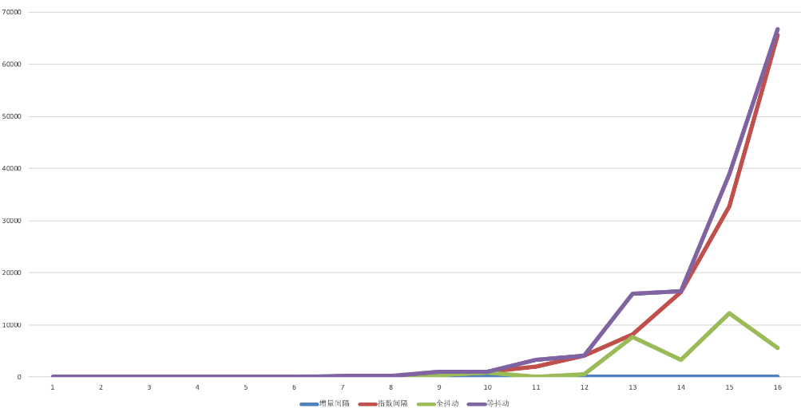

我们知道，应用系统在分布式的情况下，在通信时会有着一个显著的问题，即一个业务流程往往需要组合一组服务，且单单一次通信可能会经过 DNS 服务，网卡、交换机、路由器、负载均衡等设备，而这些服务于设备都不一定是一直稳定的，在数据传输的整个过程中，只要任意一个环节出错，都会导致问题的产生。

这样的事情在微服务下就更为明显了，因为业务需要在一致性上的保证。也就是说，如果一个步骤失败了，要么不断重试保证所有的步骤都成功，要么回滚到以前的服务调用。

因此我们可以对业务补偿的过程进行一个定义，即当某个操作发生了异常时，如何通过内部机制将这个异常产生的「不一致」状态消除掉。

## **一、关于业务补偿机制**

### 1、什么是业务补偿

我们知道，应用系统在分布式的情况下，在通信时会有着一个显著的问题，即一个业务流程往往需要组合一组服务，且单单一次通信可能会经过 DNS 服务，网卡、交换机、路由器、负载均衡等设备，而这些服务于设备都不一定是一直稳定的，在数据传输的整个过程中，只要任意一个环节出错，都会导致问题的产生。

这样的事情在微服务下就更为明显了，因为业务需要在一致性上的保证。也就是说，如果一个步骤失败了，要么不断重试保证所有的步骤都成功，要么回滚到以前的服务调用。

因此我们可以对业务补偿的过程进行一个定义，即当某个操作发生了异常时，如何通过内部机制将这个异常产生的「不一致」状态消除掉。

### 2、业务补偿设计的实现方式

业务补偿设计的实现方式主要可分为两种：

- **回滚（事务补偿）** ，逆向操作，回滚业务流程，意味着放弃，当前操作必然会失败；
- **重试** ，正向操作，努力地把一个业务流程执行完成，代表着还有成功的机会。

一般来说，业务的事务补偿都是需要一个工作流引擎的。这个工作流引擎把各式各样的服务给串联在一起，并在工作流上做相应的业务补偿，整个过程设计成为最终一致性的。

> Ps：因为「补偿」已经是一个额外流程了，既然能够走这个额外流程，说明时效性并不是第一考虑的因素。所以做补偿的核心要点是：宁可慢，不可错。

## **二、关于回滚**

“回滚” 是指当程序或数据出错时，将程序或数据恢复到最近的一个正确版本的行为。在分布式业务补偿设计到的回滚则是通过事务补偿的方式，回到服务调用以前的状态。

### 1、显示回滚

回滚一般可分为 2 种模式：

- **显式回滚** ；调用逆向接口，进行上一次操作的反操作，或者取消上一次还没有完成的操作（须锁定资源）；
- **隐式回滚** ：隐式回滚意味着这个回滚动作你不需要进行额外处理，往往是由下游提供了失败处理机制的。

最常见的就是「显式回滚」。这个方案无非就是做 2 个事情：

- 首先要确定失败的步骤和状态，从而确定需要回滚的范围。一个业务的流程，往往在设计之初就制定好了，所以确定回滚的范围比较容易。但这里唯一需要注意的一点就是：如果在一个业务处理中涉及到的服务并不是都提供了「回滚接口」，那么在编排服务时应该把提供「回滚接口」的服务放在前面，这样当后面的工作服务错误时还有机会「回滚」。
- 其次要能提供「回滚」操作使用到的业务数据。「回滚」时提供的数据越多，越有益于程序的健壮性。因为程序可以在收到「回滚」操作的时候可以做业务的检查，比如检查账户是否相等，金额是否一致等等。

### 2、回滚的实现方式

对于跨库的事务，比较常见的解决方案有：两阶段提交、三阶段提交（ACID）但是这 2 种方式，在高可用的架构中一般都不可取，因为跨库锁表会消耗很大的性能。

高可用的架构中一般不会要求强一致性，只要达到最终的一致性就可以了。可以考虑：事务表、消息队列、补偿机制、TCC 模式（占位 / 确认或取消）、Sagas 模式（拆分事务 + 补偿机制）来实现最终的一致性。

## **三、关于重试**

“重试” 的语义是我们认为这个故障是暂时的，而不是永久的，所以，我们会去重试。这个操作最大的好处就是不需要提供额外的逆向接口。这对于代码的维护和长期开发的成本有优势，而且业务是变化的。逆向接口也需要变化。所以更多时候可以考虑重试。

### 1、重试的使用场景

相较于回滚，重试使用的场景要少一些：下游系统返回请求超时，被限流中等临时状态的时候，我们就可以考虑重试了。而如果是返回余额不足，无权限的明确业务错误，就不需要重试。一些中间件或者 RPC 框架，返回 503，404 这种没有预期恢复时间的错误，也不需要重试了。

### 2、重试策略

重试的时间和重试的次数。这种在不同的情况下要有不同的考量，主流的重试策略主要是以下几种：

**策略 1 - 立即重试** ：有时候故障是暂时性的，可能因为网络数据包冲突或者硬件组件高峰流量等事件造成的，在这种情况下，适合立即重试的操作。不过立即重试的操作不应该超过一次，如果立即重试失败，应该改用其他策略；

**策略 2 - 固定间隔** ：这个很好理解，比如每隔 5 分钟重试一次。PS：策略 1 和策略 2 多用于前端系统的交互操作中；

**策略 3 - 增量间隔** ：每一次的重试间隔时间增量递增。比如，第一次 0 秒、第二次 5 秒、第三次 10 秒这样，使得失败次数越多的重试请求优先级排到越后面，给新进入的重试请求让路；

```
return (retryCount - 1) * incrementInterval;
```

**策略 4 - 指数间隔：** 每一次的重试间隔呈指数级增加。和增量间隔一样，都是想让失败次数越多的重试请求优先级排到越后面，只不过这个方案的增长幅度更大一些；

```
return 2 ^ retryCount;
```

**策略 5 - 全抖动：** 在递增的基础上，增加随机性（可以把其中的指数增长部分替换成增量增长。）适用于将某一时刻集中产生的大量重试请求进行压力分散的场景；

```
return random(0 , 2 ^ retryCount);
```

**策略 6 - 等抖动：** 在「指数间隔」和「全抖动」之间寻求一个中庸的方案，降低随机性的作用。适用场景和「全抖动」一样。

```
int baseNum = 2 ^ retryCount;
return baseNum + random(0 , baseNum);
```

策略 - 3、4、5、6 的表现情况大致是这样（x 轴为重试次数）：



### 3、重试时的注意事项

首先对于需要重试的接口，是需要做成幂等性的，即不能因为服务的多次调用而导致业务数据的累计增加或减少。

满足「幂等性」其实就是需要想办法识别重复的请求，并且将其过滤掉。思路就是：

- 给每个请求定义一个唯一标识。
- 在进行「重试」的时候判断这个请求是否已经被执行或者正在被执行，如果是则抛弃该请求。

> Ps：此外重试特别适合在高负载情况下被降级，当然也应当受到限流和熔断机制的影响。当重试的“矛”与限流和熔断的“盾”搭配使用，效果才是最好。

## **四、业务补偿机制的注意事项**

### 1、ACID 还是 BASE

ACID 和 BASE 是分布式系统中两种不同级别的一致性理论，在分布式系统中，ACID 有更强的一致性，但可伸缩性非常差，仅在必要时使用；BASE 的一致性较弱，但有很好的可伸缩性，还可以异步批量处理；大多数分布式事务适合 BASE。

而在重试或回滚的场景下，我们一般不会要求强一致性，只要保证最终一致性就可以了！

### 2、业务补偿设计的注意事项

业务补偿设计的注意事项：

- 因为要把一个业务流程执行完成，需要这个流程中所涉及的服务方支持幂等性。并且在上游有重试机制；

  我们需要小心维护和监控整个过程的状态，所以，千万不要把这些状态放到不同的组件中，最好是一个业务流程的控制方来做这个事，也就是一个工作流引擎。所以，这个工作流引擎是需要高可用和稳定的；

  补偿的业务逻辑和流程不一定非得是严格反向操作。有时候可以并行，有时候，可能会更简单。总之，设计业务正向流程的时候，也需要设计业务的反向补偿流程；

  我们要清楚地知道，业务补偿的业务逻辑是强业务相关的，很难做成通用的；

  下层的业务方最好提供短期的资源预留机制。就像电商中的把货品的库存预先占住等待用户在 15 分钟内支付。如果没有收到用户的支付，则释放库存。然后回滚到之前的下单操作，等待用户重新下单。
