# **一、什么是复杂系统**

我们经常提到复杂系统，那么到底什么是复杂系统。我们看下维基的定义：复杂系统（英语：complex system），又称复合系统，是指由许多可能相互作用的组成的系统。强调了两点：

- 由点组成

- 点之间有各种关联

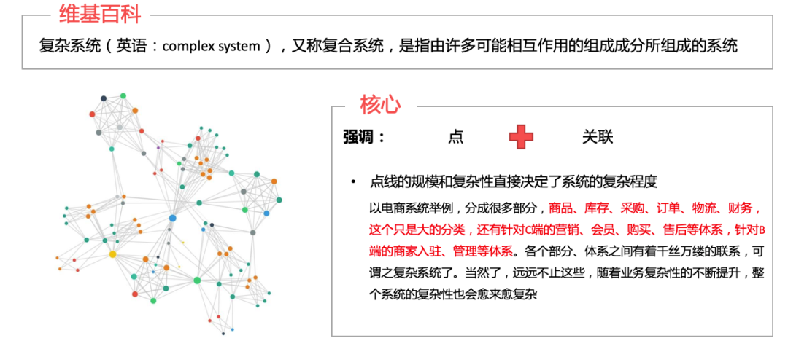

两点的规模和复杂性直接决定了系统的复杂程度。比如就拿我们的电商系统举例，分成很多部分，商品、库存、采购、订单、物流、财务，这个只是大的分类，还有针对 C 端的营销、会员、购买、售后等体系，针对 B 端的商家入驻、管理等体系。各个部分、体系之间有着千丝万缕的联系，可谓之复杂系统了。当然了，远远不止这些，随着业务复杂性的不断提升，整个系统的复杂性也会愈来愈复杂。

## 二、什么是架构

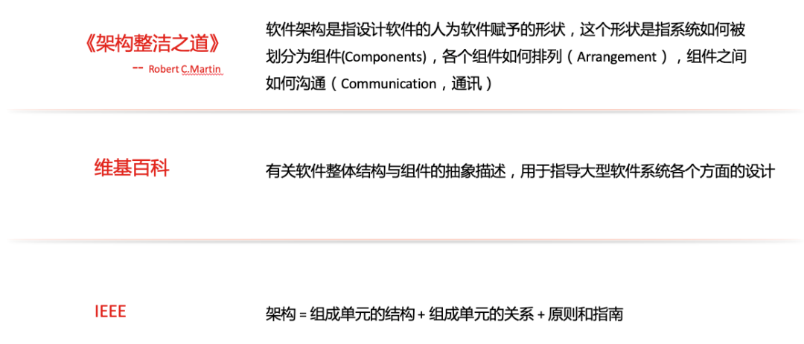

生活中我们经常谈及 “架构”，那么到底什么是 “架构”，Robert C.Martin《架构整洁之道》中的定义：软件架构是指设计软件的人为软件赋予的形状，这个形状是指系统如何被划分为组件 (Components)，各个组件如何排列（Arrangement），组件之间如何沟通（Communication，通讯），维基百科的定义：有关软件整体结构与组件的抽象描述，用于指导大型软件系统各个方面的设计，IEEE 的定义：架构 = 组成单元的结构 + 组成单元的关系 + 原则和指南，总体来看会包括几个内容：

- 整体：强调部分的组成，强调合力
- 规则：强调部分之间有关联关系，有规则，有约束
- 通信：强调部分之间有往来，有交互

这样说来，我们人类社会本身就是一个社会架构，各种职责、分工、圈层，就我们的软件系统来说，DDD 是架构，MVC 也是架构，大数据设计也有大数据的架构。所以架构无处不在，好的架构能够对特定的问题，特定的领域起到规范和指导作用。

# 三、架构的本质

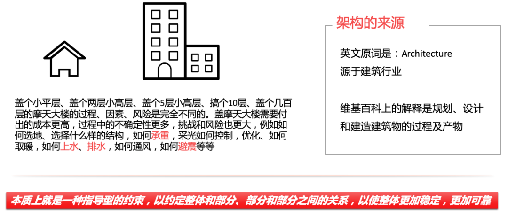

我们知道，架构这个词是源于建筑行业的，英文原词是：Architecture，维基百科上的解释是规划、设计和建造建筑物的过程及产物。那我们就用建筑行业来理解一下。建房子对大家而言再熟悉不过了，那我们盖个小平层、盖个两层小高层、盖个 5 层小高层、搞个 10 层、盖个几百层的摩天大楼的过程、因素、风险是完全不同的。盖摩天大楼需要付出的成本更高，过程中的不确定性更多，挑战和风险也更大，例如如何选地、选择什么样的结构，如何承重，采光如何控制，优化、如何取暖，如何上水、排水，如何通风，如何避震等等。这些东西我们考虑的越多，房子未来的质量，可控性也会越好。

所以架构本质上就是一种指导型的约束，以约定整体和部分、部分和部分之间的关系，以使整体更加稳定，更加可靠。

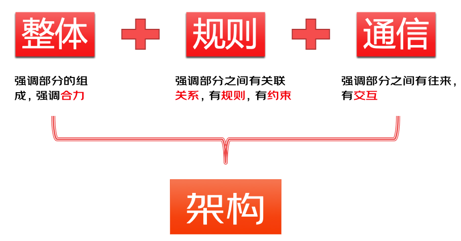

# 四、架构分类

我们上面举的例子我们可以叫做建筑架构，实际上架构有很多种类型，比如业务架构，应用架构，技术架构，数据架构等。单个架构分类，站在不同的维度也会有不同的看法，复杂性也会有相当大的区别。比如企业级架构能够凸显出公司的整体战略，业务涉及情况，分布情况，发力情况。而某一个单一的业务线也同样有自己的业务架构，凸显单独业务自己的业务目标、战略等。应用架构、技术架构也是同理，会有不同层面视野的架构。我们下面就以业务线内部视角对我们常见的架构分离进行下简单的说明。

## **1.业务架构**

说到业务架构，偏顶层设计了，业务的定义和划分甚至会影响到整个公司整体组织架构的设立和关系。业务架构偏向业务领域划分，模型设计，对整体业务进行语言转化，内化为领域通用语言。

## **2.应用架构**

体现应用内部的结构关系。应用如何进行设计，包括模块如何划分，功能如何实现，技术如何支撑，数据如何展示，流程如何定义，逻辑如何实现，数据如何存储等等，都是应用架构的范畴。我们经常说到的 MVC、分层架构、CQRS、DDD 传统洋葱圈架构、DDD 六边形架构都可以归结为应用架构的范畴。

## **3.技术架构**

技术架构不一定局限于单个应用内部，尤其是当前微服务架构时代，服务之间如何交互，服务如何治理，数据如何存储，缓存如何构建等等，都是技术架构的范畴。技术架构给应用和业务架构提供了一个技术基础，以使业务更好的发展，更健壮的迭代，发展。

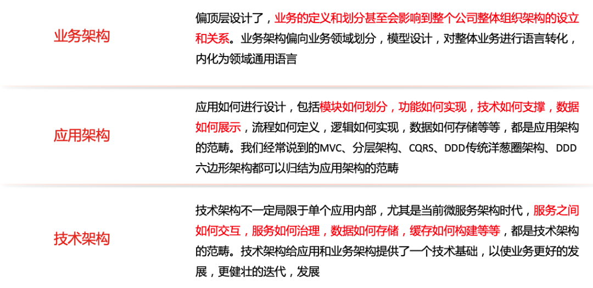

# 五、架构需要考虑哪些因素

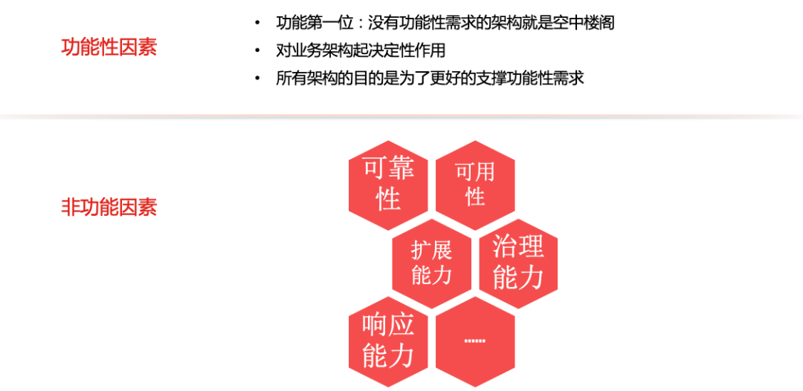

## **1.功能性需求**

无论是什么架构，我们第一时间考虑的一定是需要满足我们实际的业务述求的。没有需求的架构就是相当于空中楼阁，中看不中用，不切实际。这并不是真正的架构。一般来说，功能需求会直接决定业务架构，对应用和技术架构影响不大。我们的架构必须能够正确、完整地对功能性需求起到支撑作用。

## **2.非功能性需求**

架构满足功能性需求是第一要务，同时我们需要考虑能够稳定、可靠的支持功能，也就是我们同时需要满足一些非功能行需求，比如性能、可靠性、扩展性、兼容性等等。

## **3.可靠性**

为了更好的服务于功能，我们需要确保架构能够稳定、高效的运行。不会时不时的出现服务崩溃或者不可用的情况。

## **4.可用性**

同样的，服务对外要始终处于可用的状态，即使单个服务实例出现问题，我们依然可以正常的对外提供服务。

## **5.扩展性**

功能性需求不是一层不变的，尤其在当今盛行敏捷的时代，需求不是一次性提出的。我们需要对系统、服务的整体能力有全面的定位和把控。这就需要我们的架构在新的需求出现的时候，可以方便的进行扩展支持。

## **6.治理能力**

好的架构一定是方便运营、管理和监控的。甚至微观到工程管理，代码一定是易于维护、扩展、协同的。

## **7.响应性能**

一般的，功能性需求都会对性能有一定的预期。这个业务要我们在架构上做很多工作，比如读写分离、缓存、异步等等的介入，以满足整体架构的响应能力。

# 六、复杂系统如何分析

有的同学会有误区，一想到类似这样的系统就觉得会有很大的复杂性，就会考虑知难而退。但是你所认为的难不一定是难。我们都知道一句熟语：“难者不会，会者不难”，往往会由于大家经验的不同，对待同一问题的想法和思路就都会不一样。这也就是为什么我们会在系统设计的时候，强调专家的重要性。尤其是目前又被逐渐提及并广泛应用的 DDD 领域驱动设计方法，更加提倡领域专家的重要性。这样才能够识别现实问题的复杂性和根本痛点所在，进而能够客观合理的推导出可靠、合适的解决方案。很明显，复杂系统设计中非常重要的两个环节：需求分析、架构设计。

需求分析过程中，我们需要确认需求到底要解决什么问题，面向的角色有哪些。现在流行的分析方法要数 DDD 领域驱动的分析方法。使用 DDD 的模式分析业务需求大概会有几个步骤：

- 确认角色
- 确认角色功能
- 确认问题子域
- 确认模型、事件、归属
- 确认界限上下文

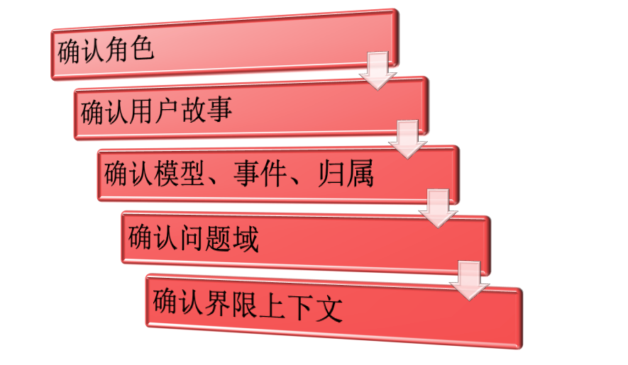

# 七、复杂系统的设计原则

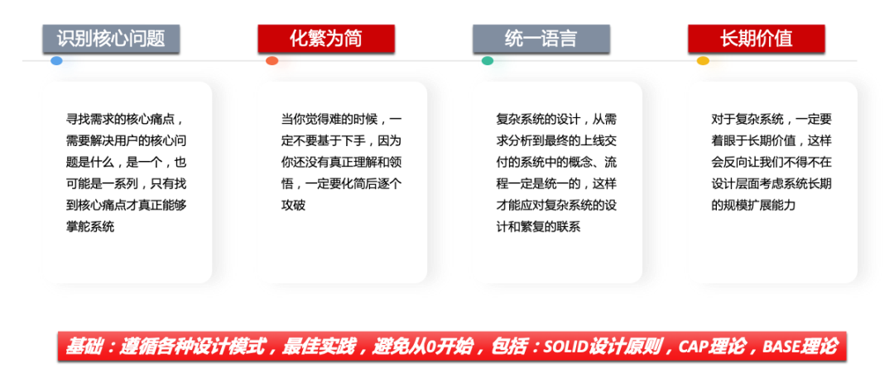

- 识别出核心问题。对于需求的承接，有些人会直接进行入开发设计阶段，尤其是对于出入职场的小伙伴。其实遇到需求我们更多的需要思考，为什么要做这个需求，这个想明白，非常有助于我们进行业务等相关的架构设计，进而掌舵整个需求，这样不会很容易的走入偏路。
- 复杂的问题简单化，需要把复杂的问题拆解成各个小的模块，进行逐个攻破，各个模块职责会相对单一，未来的扩展性和可维护性也相对独立、简单。
- 确认使用通用的语言进行沟通，尤其是面向领域设计中，领域模型的认识大家一定要保持一致。
- 理清系统、模型的定位、关系、交互等。
- 具备未来的规划能力，包括系统、技术、方案、容量等等，以使系统能够长期更好、更稳定的提供价值服务。
- 遵循各种设计模式，最佳实践，避免从 0 开始，包括：SOLID 设计原则，CAP 理论，BASE 理论。

# 八、复杂系统的架构特点

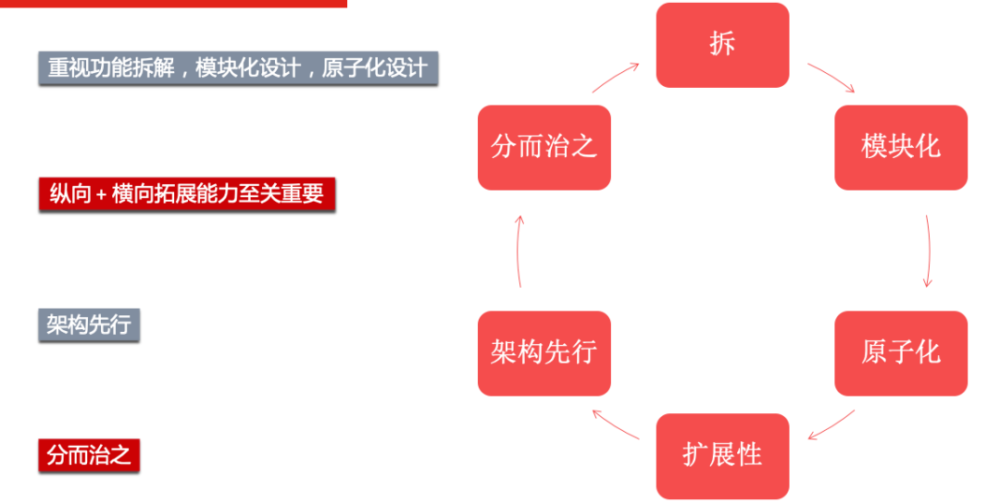

**1.重视功能拆解，模块化设计，原子化设计**

复杂系统一定要进行细致功能、模块、领域的划分。每个模块的都应该有明确，单一的职责。这样我们在分析问题的时候，可以把问题聚焦在某一个范围内，不会产生太大的影响，方便整体系统的维护和扩展。

**2.纵向 + 横向拓展能力至关重要**

我们做小的功能的时候，可能不会考虑太多。但是复杂系统的时候，必须要考虑很多，包括未来的功能承载、流量承载、数据规模、响应要求等等，这些都需要我们在纵向或者横向留出足够的扩展能力。这些不能一蹴而就，但是需要根据规划留有必要的扩展，以使系统具有长期价值。

**3.架构先行**

对于复杂系统，已经不是一个或几个流程图能解决的事情了。我们需要通过领域架构明确领域划分及领域边界，通过系统架构明确功能模块和功能边界，通过应用架构明确各个应用的职责、边界、结构划分、依赖关系等。通过技术架构明确我们使用的技术栈及在整体系统中的应用边界。通过数据架构明确我们的数据存储方式、结构、数据使用方式等。

这些架构一定要清晰，明确，着眼于系统长期价值。

**4.分而治之**

对于复杂系统，拆分是必然的，大的问题化解成小的问题，根据领域、模块、功能的划分，我们把问题归属于不同的边界内，进行逐个攻破。小的问题得道解决，那么通过合理的依赖和组合，即可有效的解决大的问题，达到整个系统的建设目的。

# 九、典型的复杂问题解决架构

随着社会的不断进步，信息化组件发达，我们更需要信息化的方式去解决系统化的问题。早前我们更多的通过数据驱动的模式，也就是我们会先去思考会用到什么样的结构去存储相关的数据，模型之间都有什么样依赖关系，怎么样组织数据，怎么样把数据和外围交互，这些思想也是典型的 MVC 架构。

MVC 架构迫使我们是面向视图来开发的，我们知道视图的变化最是不可控的，越是偏向于用户的东西，越是容易受到用户主观的影响。我们知道复杂系统必然存在的纷繁复杂的依赖，依赖不可能存在于视图部分，肯定会表现为接口的依赖。对于复杂系统，我们要强迫我们转换思维，强迫我们面向接口进行设计。结合着业务系统的复杂性，如果想要系统未来具有长期价值，不得不把大的系统进行拆分，用统一的业务语言进行描述，把不可识别的问题，拆分成可识别的问题域进行解决，这也就是现在又逐渐盛行起来的领域驱动设计的方法。

**1.领域驱动设计**

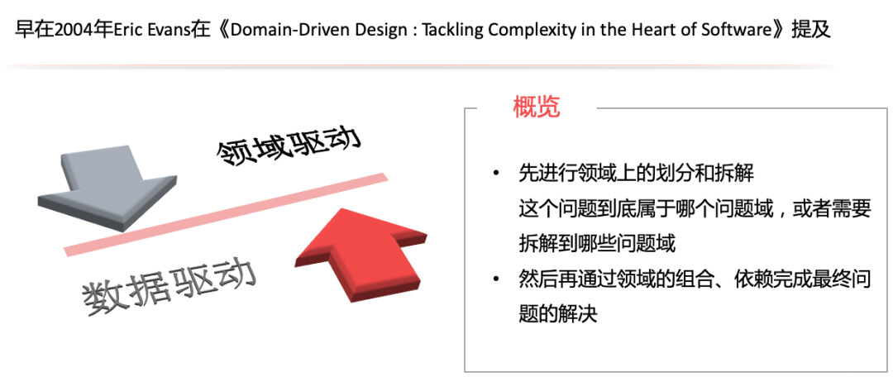

领域驱动设计，强迫我们不再用数据进行驱动，而是使用领域进行驱动。遇到问题，我们先进性领域上的划分和拆解。这个问题到底属于哪个问题域，或者需要拆解到哪些问题域，然后再通过领域的组合、依赖完成最终问题的解决。

领域驱动，早在 2004 年 Eric Evans 在《Domain-Driven Design : Tackling Complexity in the Heart of Software》（领域驱动设计：软件核心复杂性应对之道）这本书中就战略和战术两个方面进行了详细的阐述。

目前来看，对于复杂系统的设计，领域驱动的模式利于系统的可持续发展。

**2.微服务架构**

其实微服务架构就是早些时候的 SOA（面向服务架构）的一种变体。其实这个词是从 2014 年 Martin Fowler 发表的一篇文章《Are Microservices the Future》开始被业界广传而火起来的。微服务架构强调去中心化管理，尽可能的保持服务的自治性和独立性。强调能力通过不同的小的服务进行整合获取。这样我们可以对服务进行有选择的纵向和横向扩展，同时也避免了单个系统的臃肿和功能的堆叠、耦合。

**3.云原生架构**

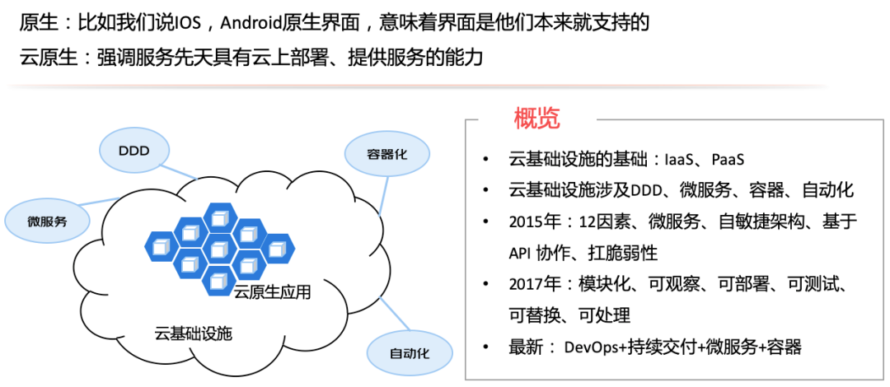

说到原生，大家再熟悉不过了。比如我们说 IOS，Android 原生界面，意味着界面是他们本来就支持的。而谈到云原生，对于服务而言，我们更多强调服务先天具有云上部署、提供服务的能力。这种能力使得服务具有先天的去中心化的能力，先天的横向扩展的能力。这也是微服务重点强调的能力。

**4.DevOps 架构**

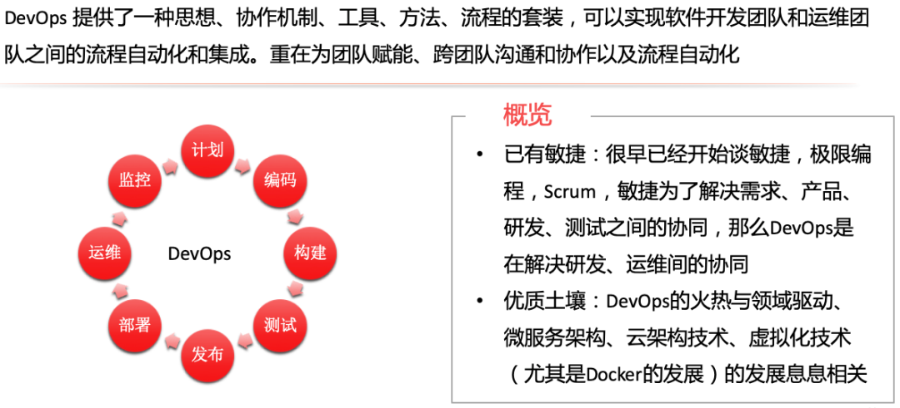

DevOps 之前，我们也一直在谈敏捷，业界也有战术上的落地方案。比如极限编程、Scrum 等等。如果说敏捷更多是为了解决需求、产品、研发、测试之间的协同、高效，那么 DevOps 更多的是在解决研发、运维间的协同问题。DevOps 近年来发展的是如火如荼，这和领域驱动、微服务架构、云架构技术、虚拟化技术（尤其是 Docker 的发展）的发展息息相关。准确的说，是各种技术微妙组合的一种共力。DevOps 的发展，是的运维不再关心应用的部署等问题，这些事情都可以交给研发来处理，运维更多的在给研发提供自动化的构建、集成、部署、监控等等相关的云基础能力。

**5.大数据架构**

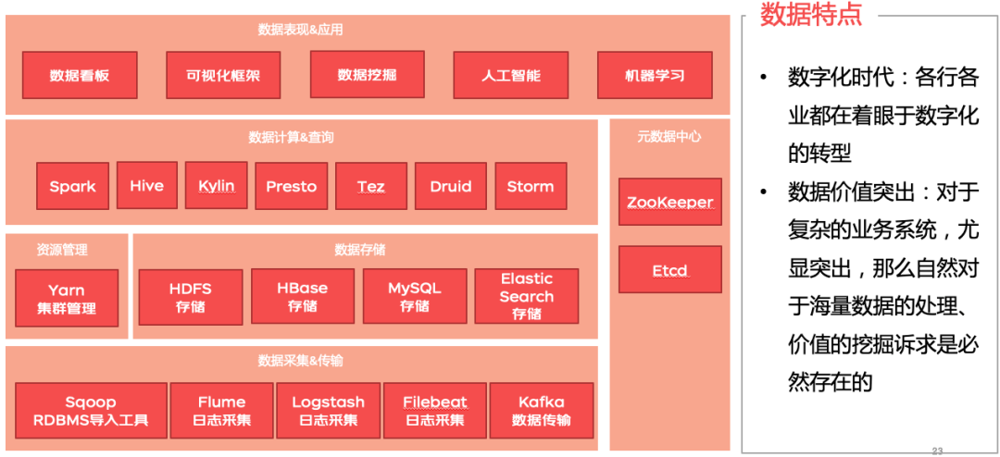

当今的是一个数字化的时代，各行各业都在忙于进行数字化的转型。对于复杂的业务系统，数据的价值尤显突出，那么自然对于海量数据的处理、价值的挖掘诉求是必然存在的。那么数据的海量存储、提取、传输、清洗、计算、挖掘等能力就需要通过大数据架构的模式进行设计。

# 十、总结

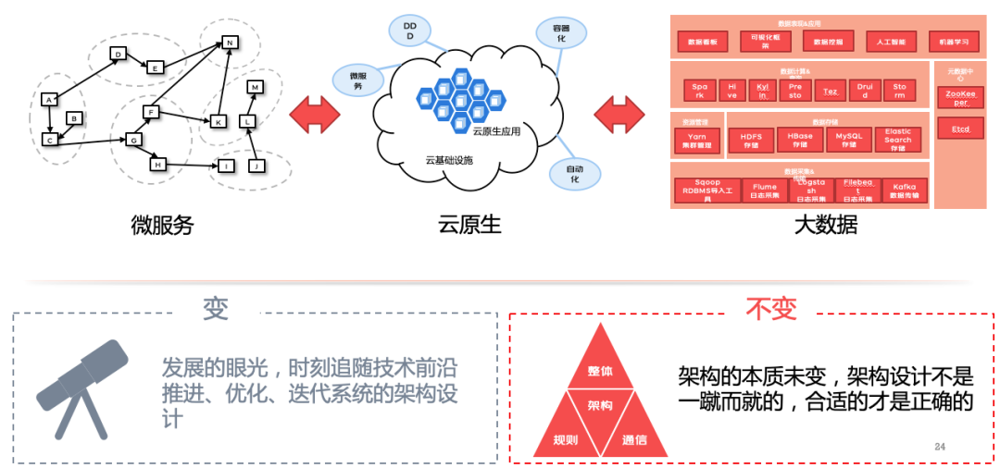

现如今，系统设计的关键已经变成分布式、云化、微服务化、大数据化。架构的本质依然没有改变，只是由于社会的发展，我们的需求，需要处理的问题、依赖愈来愈复杂，我们需要用发展的眼光，时刻追随技术前沿，进而推进、优化、迭代系统的架构设计。

复杂系统的架构设计不是一蹴而就的，合适的才是正确的。希望本文能够对您在进行复杂系统设计时有一定的参考意义。

> 来源：my.oschina.net/u/4090830/blog/8696085
