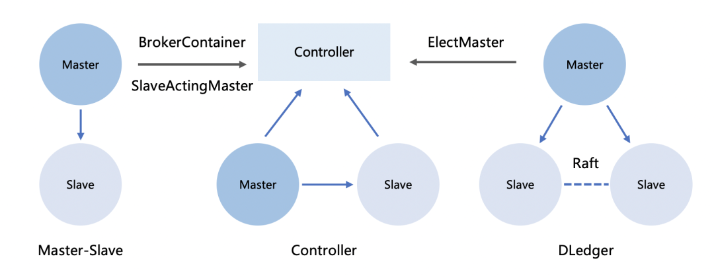
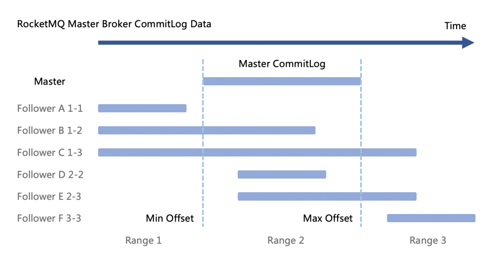
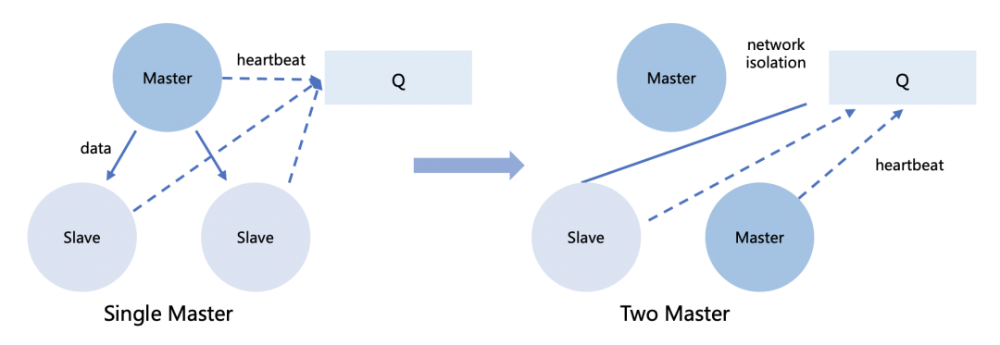
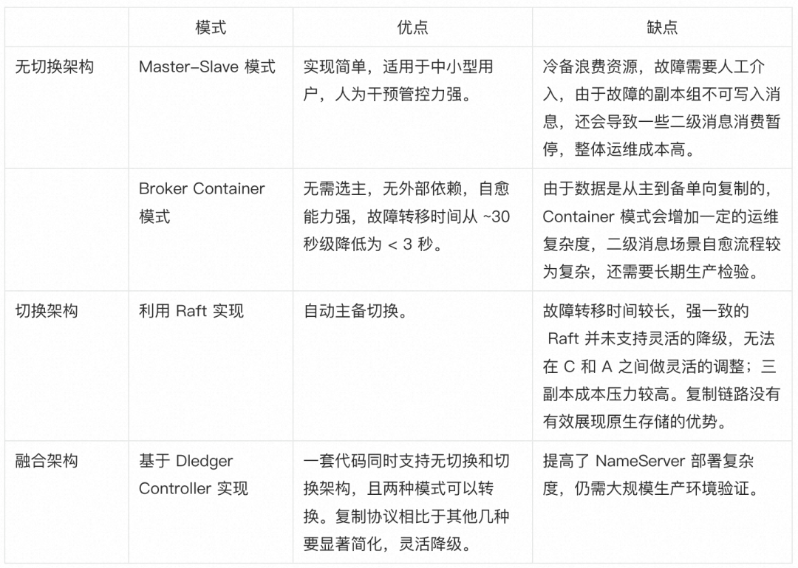

# **高可用架构演进背景**

在分布式系统中不可避免的会遇到网络故障，机器宕机，磁盘损坏等问题，为了向用户不中断且正确的提供服务，要求系统有一定的冗余与容错能力。RocketMQ 在日志，统计分析，在线交易，金融交易等丰富的生产场景中发挥着至关重要的作用，而不同环境对基础设施的成本与可靠性提出了不同的诉求。在 RocketMQ v4 版本中有两种主流高可用设计，分别是主备模式的无切换架构和基于 Raft 的多副本架构（图中左侧和右侧所示）。生产实践中我们发现，两副本的冷备模式下备节点资源利用率低，主宕机时特殊类型消息存在可用性问题；而 Raft 高度串行化，基于多数派的确认机制在扩展只读副本时不够灵活，无法很好的支持两机房对等部署，异地多中心等复杂场景。RocketMQ v5 版本融合了上述方案的优势，提出 DLedger Controller 作为管控节点（中间部分所示），将选举逻辑插件化并优化了数据复制的实现。



# **如何实现高可用系统**

## **副本组与数据分片**

在 Primary-Backup 架构的分布式系统中，一份数据将被复制成多个副本来避免数据丢失。处理相同数据的一组节点被称为副本组（ReplicaSet），副本组的粒度可以是单个文件级别的（例如 HDFS），也可以是分区级 / 队列级的（例如 Kafka），每个真实存储节点上可以容纳若干个不同副本组的副本，也可以像 RocketMQ 一样粗粒度的独占节点。独占能够显著简化数据写入时确保持久化成功的复杂度，因为每个副本组上只有主副本会响应读写请求，备机一般配置只读来提供均衡读负载，选举这件事儿等价于让副本组内一个副本持有独占的写锁。

RocketMQ 为每个存储数据的 Broker 节点配置 ClusterName，BrokerName 标识来更好的进行资源管理。多个 BrokerName 相同的节点构成一个副本组。每个副本还拥有一个从 0 开始编号，不重复也不一定连续的 BrokerId 用来表示身份，编号为 0 的节点是这个副本组的 Leader / Primary / Master，故障时通过选举来重新对 Broker 编号标识新的身份。例如 BrokerId = {0, 1, 3}，则 0 为主，其他两个为备。

一个副本组内，节点间共享数据的方式有多种，资源的共享程度由低到高来说一般有 Shared Nothing，Shared Disk，Shared Memory，Shared EveryThing。典型的 Shared Nothing 架构是 TiDB 这类纯分布式的数据库，TiDB 在每个存储节点上使用基于 RocksDB 封装的 TiKV 进行数据存储，上层通过协议交互实现事务或者 MVCC。相比于传统的分库分表策略来说，TiKV 易用性和灵活程度很高，更容易解决数据热点与伸缩时数据打散的一系列问题，但实现跨多节点的事务就需要涉及到多次网络的通信。另一端 Shared EveryThing 的案例是 AWS 的 Aurora，Aliyun 的 PolarStore，旁路 Kernal 的方式使应用完全运行于用户态，以最大程度的存储复用来减少资源消耗，一主多备完全共用一份底层可靠的存储，实现一写多读，快速切换。

大多数 KV 操作都是通过关键字的一致性哈希来计算所分配的节点，当这个节点所在的主副本组产生存储抖动，主备切换，网络分区等情况下，这个分片所对应的所有键都无法更新，局部会有一些操作失败。消息系统的模型有所不同，流量大但跨副本组的数据交互极少，无序消息发送到预期分区失败时还可以向其他副本组（分片）写入，一个副本组的故障不影响全局，这在整体服务的层面上额外提供了跨副本组的可用性。此外，考虑到 MQ 作为 Paas 层产品，被广泛部署于 Windows，Linux on Arm 等各种环境，只有减少和 Iaas 层产品的深度绑定，才能提供更好的灵活性。这种局部故障隔离和轻依赖的特性是 RocketMQ 选则 Shared Nothing 模型重要原因。

副本组中，各个节点处理的速度不同，也就有了日志水位的概念。Master 和与其差距不大的 Slave 共同组成了同步副本集（SyncStateSet）。如何定义差距不大呢？衡量的指标可以是日志水位（文件大小）差距较小，也可以是备落后的时间在一定范围内。在主宕机时，同步副本集中的其余节点有机会被提升为主，有时需要对系统进行容灾演练，或者对某些机器进行维护或灰度升级时希望定向的切换某一个副本成为新主，这又产生了优先副本（PriorityReplica）的概念。选择优先副本的原则和策略很多，可以动态选择水位最高，加入时间最久或 CommitLog 最长的副本，也可以支持机架，可用区优先这类静态策略。

从模型的角度来看，RocketMQ 单节点上 Topic 数量较多，如果像 kafka 以 topic / partition 粒度维护状态机，节点宕机会导致上万个状态机切换，这种惊群效应会带来很多潜在风险，因此 v4 版本时 RocketMQ 选择以单个 Broker 作为切换的最小粒度来管理，相比于其他更细粒度的实现，副本身份切换时只需要重分配 Broker 编号，对元数据节点压力最小。由于通信的数据量少，可以加快主备切换的速度，单个副本下线的影响被限制在副本组内，减少管理和运维成本。这种实现也一些缺点，例如存储节点的负载无法以最佳状态在集群上进行负载均衡，Topic 与存储节点本身的耦合度较高，水平扩展一般会改变分区总数，这就需要在上层附加额外的处理逻辑。


为了更规范更准确的衡量副本组的可用性指标，学术上就引入了几个名词：

- RTO（Recovery Time Objective）恢复时间目标，一般表示业务中断到恢复的时间。

- RPO（Recovery Point Object）恢复点目标，用于衡量业务连续性。例如某个硬盘每天备份，故障时丢失最近备份后的所有更新。

- SLA（Service-Level Agreement）服务等级协议，厂商以合约的形式对用户进行服务质量承诺，SLA 越高通常成本也越高。

节点数量与可靠性关系密切，根据不同生产场景，RocketMQ 的一个副本组可能会有 1，2，3，5 个副本。

1.  单副本成本最低，维护最简单，宕机时其他副本组接管新消息的写入，但已写入的数据无法读取，造成部分消息消费延迟。底层硬件故障还可能导致数据永久丢失，一般用于非关键日志，数据采集等低可靠性成本诉求较强的场景。

2.  两副本较好的权衡了数据冗余的成本与性能，RocketMQ 跨副本组容灾的特性使得两副本模式适用于绝大部分 IOPS 比较高的场景。此时备机可以分摊一定的读压力（尤其是主副本由于内存紧张或者产生冷读时）。两副本由于不满足多数派（quorum）原则，没有外部系统的参与时，故障时无法进行选举切换。

3.  三副本和五副本是业界使用最为广泛的，精心设计的算法使得多数情况下系统可以自愈。基于 Paxos / Raft 属于牺牲高可用性来保证一致性的 CP 型设计，存储成本很高，容易受到 IO 分布不均匀和水桶效应的影响。每条数据都需要半数以上副本响应的设计在需要写透（write through）多副本的消息场景下不够灵活。

## **日志复制还是消息复制**

如何保证副本组中数据的最终一致性？那肯定是通过数据复制的方式实现，我们该选择逻辑复制还是物理复制呢？

**逻辑复制：**使用消息来进行同步的场景也很多，各种 connector 实现本质上就是把消息从一个系统挪到另外一个系统上，例如将数据导入导出到 ES，Flink 这样的系统上进行分析，根据业务需要选择特定 Topic / Tag 进行同步，灵活程度和可扩展性非常高。这种方案随着 Topic 增多，系统还会有服务发现，位点和心跳管理等上层实现造成的性能损失。因此对于消息同步的场景，RocketMQ 也支持以消息路由的形式进行数据转移，将消息复制作为业务消费的特例来看待。

**物理复制：**大名鼎鼎的 MySQL 对于操作会记录逻辑日志（bin log）和重做日志（redo log）两种日志。其中 bin log 记录了语句的原始逻辑，比如修改某一行某个字段，redo log 属于物理日志，记录了哪个表空间哪个数据页改了什么。在 RocketMQ 的场景下，存储层的 CommitLog 通过链表和内核的 MappedFile 机制抽象出一条 append only 的数据流。主副本将未提交的消息按序传输给其他副本（相当于 redo log），并根据一定规则计算确认位点（confirm offset）判断日志流是否被提交。这种方案仅使用一份日志和位点就可以保证主备之间预写日志的一致性，简化复制实现的同时也提高了性能。

为了可用性而设计的多副本结构，很明显是需要对所有需要持久化的数据进行复制的，选择物理复制更加节省资源。RocketMQ 在物理复制时又是如何保证数据的最终一致性呢？这就涉及到数据的水位对齐。对于消息和流这样近似 FIFO 的系统来说，越近期的消息价值越高，消息系统的副本组的单个节点不会像数据库系统一样，保留这个副本的全量数据，Broker 一方面不断的将冷数据规整并转入低频介质来节约成本，同时对热数据盘上的数据也会由远及近滚动删除。如果副本组中有副本宕机较久，或者在备份重建等场景下就会出现日志流的不对齐和分叉的复杂情况。在下图中我们将主节点的 CommitLog 的首尾位点作为参考点，这样就可以划分出三个区间。在下图中以蓝色箭头表示。排列组合一下就可以证明备机此时的 CommitLog 一定满足下列 6 种情况之一。



下面对每种情况进行讨论与分析：

- 1-1 情况下满足备 Max <= 主 Min，一般是备新上线或下线较久，备跳过存量日志，从主的 Min 开始复制。

- 1-2，2-2 两种情况下满足 主 Min < 备 Max <= 主 Max，一般是由于备网络闪断导致日志水位落后，通过 HA 连接追随主即可。

- 1-3，2-3 两种情况下备 Max > 主 Max，可能由于主异步写磁盘宕机后又成为主，或者网络分区时双主写入造成 CommitLog 分叉。由于新主落后于备，少量未确认的消息丢失，非正常模式的选举（RocketMQ 将这种情况称为 unclean 选举）是应该尽量避免的。

- 3-3 理论上不会出现，备的数据长于主，原因可能是主节点数据丢失又叠加了非正常选举，因此这种情况需要人工介入处理。

## **租约与节点身份变更**

前文提到 RocketMQ 每个副本组的主副本才接受外部写请求，节点的身份又是如何决定的呢？

分布式系统一般分为中心化架构和去中心化架构。对于 MultiRaft，每个副本组包含三个或者五个副本，副本组内可以通过 Paxos / Raft 这样的共识协议来进行选主。典型的中心化架构，为了节省数据面资源成本会部署两副本，此时依赖于外部 ZK，ETCD，或者 DLedger Controller 这样的组件作为中心节点进行选举。由外置组件裁决成员身份涉及到分布式中两个重要的问题：1. 如何判断节点的状态是否正常。2. 如何避免双主问题。

对于第一个问题，kubernetes 的解决方案相对优雅，k8s 对与 Pod 的健康检查包括存活检测（Liveness probes）和就绪检测（Readiness probes），Liveness probes 主要是探测应用是否还活着，失败时重启 Pod。Readiness probes 来判断探测应用是否接受流量。简单的心跳机制一般只能实现存活检测，来看一个例子：假设有副本组中有 A、B、C 三个副本，另有一个节点 Q（哨兵） 负责观测节点状态，同时承担了全局选举与状态维护的职责。节点 A、B、C 周期性的向 Q 发送心跳，如果 Q 超过一段时间（一般是两个心跳间隔 ）收不到某个节点的心跳则认为这个节点异常。如果异常的是主副本，Q 将副本组的其他副本提升为主并广播告知其他副本。



在工程实践中，节点下线的可能性一般要小于网络抖动的可能性。我们假设节点 A 是副本组的主，节点 Q 与节点 A 之间的网络中断。节点 Q 认为 A 异常。重新选择节点 B 作为新的 Master，并通知节点 A、B、C 新的 Master 是节点 B。节点 A 本身工作正常，与节点 B、C 之间的网络也正常。由于节点 Q 的通知事件到达节点 A、B、C 的顺序是未知的，假如先达到 B，在这一时刻，系统中同时存在两个工作的主，一个是 A，另一个是 B。假如此时 A、B 都接收外部请求并与 C 同步数据，会产生严重的数据错误。上述 "双主" 问题出现的原因在于虽然节点 Q 认为节点 A 异常，但节点 A 自己不认为自己异常，在旧主新主都接受写入的时候就产生了日志流的分叉，其问题的本质是由于网络分区造成的系统对于节点状态没有达成一致。

租约是一种避免双主的有效手段，租约的典型含义是现在中心节点承认哪个节点为主，并允许节点在租约有效期内正常工作。如果节点 Q 希望切换新的主，只需等待前一个主的租约过期，则就可以安全的颁发新租约给新 Master 节点，而不会出现双主问题。这种情况下系统对 Q 本身的可用性诉求非常高，可能会成为集群的性能瓶颈。生产中使用租约还有很多实现细节，例如依赖时钟同步需要颁发者的有效期设置的比接收者的略大，颁发者本身的切换也较为复杂。

在 RocketMQ 的设计中，希望以一种去中心化的设计降低中心节点宕机带来的全局风险，（这里认为中心化和是否存在中心节点是两件事）所以没有引入租约机制。在 Controller （对应于 Q ）崩溃恢复期间，由于 Broker 对自己身份会进行永久缓存，每个主副本会管理这个副本组的状态机，RocketMQ Dledger Controller 这种模式能够尽量保证在大部分副本组在哨兵组件不可用时仍然不影响收发消息的核心流程。而旧主由于永久缓存身份，无法降级导致了网络分区时系统必须容忍双主。产生了多种解决方案，用户可以通过预配置选择 AP 型可用性优先，即允许系统通过短时分叉来保障服务连续性（下文还会继续谈谈为什么消息系统中分叉很难避免），还是 CP 型一致性优先，通过配置最小副本 ack 数超过集群半数以上节点。此时发送到旧主的消息将因为无法通过 ha 链路将数据发送给备，向客户端返回超时，由客户端将发起重试到其他分片。客户端经历一个服务发现的周期之后，客户端就可以正确发现新主。

特别的，在网络分区的情况下，例如旧主和备，Controller 之间产生网络分区，此时由于没有引入租约机制，旧主不会自动降级，旧主可以配置为异步双写，每一条消息需要经过主备的双重确认才能向客户端返回成功。而备在切换为主时，会设置自己只需要单个副本确认的同步写盘模式。此时，客户端短时间内仍然可以向旧主发送消息，旧主需要两副本确认才能返回成功，因此发送到旧主的消息会返回 SLAVE_NOT_AVAILABLE 的超时响应，通过客户端重试将消息发往新的节点。几秒后，客户端从 NameServer / Controller 获取新的路由时，旧主从客户端缓存中移除，此时完成了备节点的提升。


外置的组件可以对节点身份进行分配，上图展示了一个两副本的副本组上线流程：

1.  多个 Controller 通过选举和对 Broker 的请求进行重定向，最终由一个 Controller 做为主节点进行身份分配。

2.  如果 RocketMQ 副本组存在多个副本且需要选主，节点默认以备的身份启动，备节点会将自己注册到 Controller。

3.  节点从 Controller 获取 BrokerMemberGroup，包含了这个副本组的描述和连接信息。

4.  若分配的身份为备，解析出主节点的对外服务的地址并连接，完成日志截断后进行 HA 同步。

5.  若分配的身份为主，等待备机连接到自身的 HA 端口，并向 NameServer 再次宣告自己是主节点。

6.  主节点维护整个副本组的信息，向备发起数据复制，周期性的向 Controller 汇报主备之间水位差距，复制速度等。

RocketMQ 弱依赖 Controller 的实现并不会打破 Raft 中每个 term 最多只有一个 leader 的假设，工程中一般会使用 Leader Lease 解决脏读的问题，配合 Leader Stickiness 解决频繁切换的问题，保证主的唯一性。

- Leader Lease: 租约，上一任 Leader 的 Lease 过期后，等待一段时间再发起 Leader 选举。

- Leader Stickiness：Leader Lease 未过期的 Follower 拒绝新的 Leader 选举请求。

> _注：Raft 认为具有最新已提交的日志的节点才有资格成为 Leader，而 Multi-Paxos 无此限制。_

对于日志的连续性问题，Raft 在确认一条日志之前会通过位点检查日志连续性，若检查到日志不连续会拒绝此日志，保证日志连续性，Multi-Paxos 允许日志中有空洞。Raft 在 AppendEntries 中会携带 Leader 的 commit index，一旦日志形成多数派，Leader 更新本地的 commit index（对应于 RocketMQ 的 confirm offset）即完成提交，下一条 AppendEntries 会携带新的 commit index 通知其它节点，Multi-Paxos 没有日志连接性假设，需要额外的 commit 消息通知其它节点。

## **计算日志分叉位点**

除了网络分区，很多情况导致日志数据流分叉。有如下案例：三副本采用异步复制，异步持久化，A 为旧主 B C 为备，切换瞬间 B 日志水位大于 C，此时 C 成为新主，B C 副本上的数据会产生分叉，因为 B 还多出了一段未确认的数据。那么 B 是如何以一个简单可靠的方法去判断自己和 C 数据分叉的位点？

一个直观的想法就是，直接将主备的 CommitLog 从前向后逐渐字节比较，一般生产环境下，主备都有数百 GB 的日志文件流，读取和传输大量数据的方案费时费力。很快我们发现，确定两个大文件是否相同的一个好办法就是比较数据的哈希值，需要对比的数据量一下子就从数百 GB 降低为了几百个哈希值，对于第一个不相同的 CommitLog 文件，还可以采取局部哈希的方式对齐，这里仍然存在一些计算的代价。还有没有优化的空间呢，那就是利用任期 Epoch 和偏移量 StartOffset 实现一个新的截断算法。这种 Epoch-StartOffset 满足如下原则：

1.  通过共识协议保证给定的一个任期 Epoch 只有一个 Leader。

2.  只有 Leader 可以写入新的数据流，满足一定条件才会被提交。

3.  Follower 只能从 Leader 获取最新的数据流，Follower 上线时按照选举算法进行截断。

下面是一个选举截断的具体案例，选举截断算法思想和流程如下：

> 主 CommitLog Min = 300，Max = 2500，EpochMap = {<6, 200>, <7, 1200>, <8,2500>}  
> 备 CommitLog Min = 300，Max = 2500，EpochMap = {<6, 200>, <7, 1200>, <8,2250>}


1.  备节点连接到主节点进行 HA 协商，获取主节点的 Epoch-StartOffset 信息并比较

2.  备从后向前找到任期 - 起始点相同的那个点作为分叉任期，在上述案例里是 <8,2250>

3.  选择这个任期里主备结束位点的最小值（如果主副本没有切换且为最大任期，则主副本的结束位点是无穷大）

实现的代码如下：

```
public long findLastConsistentPoint(final EpochStore compareEpoch) {
    long consistentOffset = -1L;
    final Map<Long, EpochEntry> descendingMap = new TreeMap<>(this.epochMap).descendingMap();
    for (Map.Entry<Long, EpochEntry> curLocalEntry : descendingMap.entrySet()) {
      final EpochEntry compareEntry = compareEpoch.findEpochEntryByEpoch(curLocalEntry.getKey());
      if (compareEntry != null &&
        compareEntry.getStartOffset() == curLocalEntry.getValue().getStartOffset()) {
        consistentOffset = Math.min(curLocalEntry.getValue().getEndOffset(), compareEntry.getEndOffset());
      break;
      }
    }
    return consistentOffset;
}

```

## **数据回发与日志截断**

故障发生后，系统将会对分叉数据进行修复，有很多小小细节值得深究与探讨。

在实现数据截断的过程中，有一个很特殊的动作，当备切主的时候要把 ConsumeQueue 的 Confirm Offset 提升到 CommitLog 的 MaxPhyOffset，即使这一部分数据在主上是否被提交是未知的。回想起几年前看 Raft 的时候，当一条日志被传输到 Follower，Follower 确认收到这条消息，主再把这条日志应用到自己的状态机时，通知客户端和通知所有的 follower 去 commit 这条日志这两件事是并行的，假如 leader 先回复 client 处理成功，此时 leader 挂了，由于其他 follower 的确认位点 confirm offset 一般会略低于 leader，中间这段未决日志还没应用到 follower 的状态机上，这时就出现了状态机不一致的情况，即已经写入 leader 的数据丢失了。让我们来举一个具体的案例，假设两副本一主一备：

1.  主的 max offset = 100，主向备发送当前 confirm offset = 40 和 message buffer = [40-100] 的数据

2.  备向主回复 confirm offset = 100 后主需要同时做几件事

3.  本地提交（apply） [40-100] 区间的数据，用后台的 dispatch 线程异步构建这段数据的索引

4.  向 producer 响应 [40-100] 这段数据是发送成功的。

5.  向多个备机异步的提交，实际上是发送了 confirm offset = 100

6.  此时主突然宕机，备机的 confirm offset 可能是 [40-100] 中的值

所以当备切换为主的时候，如果直接以 40 进行截断，意味着客户端已经发送到服务端的消息丢失了，正确的水位应该被提升至 100。但是备还没有收到 2.3 的 confirm = 100 的信息，这个行为相当于要提交了未决消息。事实上新 leader 会遵守 "Leader Completeness" 的约定，切换时任何副本都不会删除也不会更改旧 leader 未决的 entry。新 leader 在新的 term 下，会直接应用一个较大的版本将未决的 entry 一起提交，这里副本组主备节点的行为共同保证了复制状态机的安全性。

那么备切换成功的标志是什么，什么时候才能接收 producer 新的流量呢？对于 Raft 来说一旦切换就可以，对于 RocketMQ 来说这个阶段会被稍稍推迟，即索引已经完全构建结束的时候。RocketMQ 为了保证构建 consume queue 的一致性，会在 CommitLog 中记录 consume queue offset 的偏移量，此时 confirm offset 到 max offset 间的数据是副本作为备来接收的，这部分消息在 consume queue 中的偏移量已经固定下来了，而 producer 新的流量时由于 RocketMQ 预计算位点的优化，等到消息实际放入 CommitLog 的再真实的数据分发（dispatch）的时候就会发现对应位置的 consume queue 已经被占用了，此时就造成了主备索引数据不一致。本质原因是 RocketMQ 存储层预构建索引的优化对日志有一些侵入性，但切换时短暂等待的代价远远小于正常运行时提速的收益。

## **消息中间件场景**

a. 元数据变更是否依赖于日志

目前 RocketMQ 对于元数据是在内存中单独管理的，备机间隔 5 秒向当前的主节点同步数据。例如当前主节点上创建了一个临时 Topic 并接受了一条消息，在一个同步周期内这个 Topic 又被删除了，此时主备节点元数据可能不一致。又比如位点更新的时候，对于单个队列而言，多副本架构中存在多条消费位点更新链路，Consumer 拉取消息时更新，Consumer 主动向 broker 更新，管控重置位点，HA 链路更新，当副本组发生主备切换时，consumer group 同时发生 consumer 上下线，由于路由发现的时间差，还可能造成同一个消费组两个不同 consumer 分别消费同一副本组主备上同一个队列的情况。

原因在于备机重做元数据更新和消息流这两件事是异步的，这有一定概率会造成脏数据。由于 RocketMQ 单个节点上 Topic / Group 数量较多，通过日志的实现会导致持久化的数据量很大，在复杂场景下基于日志做回滚依赖 snapshot 机制也会增加计算开销和恢复时间。这个问题和数据库很像，MySQL 在执行 DDL 修改元数据时通过会创建 MDL 锁，阻塞用户其他操作访问表空间的访问。备库同步主库也会加锁，元数据修改开始点和结束点所代表的两个日志并不是一个原子操作，这意味着主库上在修改元数据的过程中如果宕机了，备库上持有的 MDL 锁就无法释放。MySQL 的解决方案是在主库每次崩溃恢复后，都写一条特殊的日志，通知所有连接的备库释放其持有的所有 MDL 排他锁。对所有操作都走日志流进行状态机复制要求存储层有多种日志类型，实现也更加复杂。RocketMQ 选择以另一种同步的模式操作，即类似 ZAB 这样二阶段协议，例如位点更新时的可以选择配置 LockInStrictMode 让备都同步这条修改。事实上 RocketMQ 为了优化上述位点跳跃的现象，客户端在未重启时，遇到服务端主备切换还会用优先采纳本地位点的方式获取消息，进一步减少重复消费。

b. 同步复制与异步复制

同步复制的含义是用户的一个操作在多个副本上都已经提交。正常情况下，假设一个副本组中的 3 个副本都要对相同一个请求进行确认，相当于数据写透 3 个副本（简称 3-3 写），3-3 写提供了非常高的数据可靠性，但是把所有从节点都配置为同步复制时任何一个同步节点的中断都会导致整个副本组处理请求失败。当第三个副本是跨可用区时，长尾也会带来一定的延迟。

异步复制模式下，尚未复制到从节点的写请求都会丢失。向客户端确认的写操作也无法保证被持久化。异步复制是一种故障时 RPO 不为 0 的配置模式，由于不用考虑从节点上的状态，总是可以继续响应写请求，系统的延迟更低，吞吐性能更好。为了权衡两者，通常只有其中一个从节点是同步的，而其他节点是异步的模式。只要同步的从节点变得不可用或性能下降，则将另一个异步的从节点提升为同步模式。这样可以保证至少有两个节点（即主节点和一个同步从节点）拥有最新的数据副本。这种模式称为 2-3 写，能帮助避免抖动，提供更好的延迟稳定性，有时候也叫称为半同步。

在 RocketMQ 的场景中，异步复制也被广泛应用在消息读写比极高，从节点数量多或者异地多副本场景。同步复制和异步复制是通过 Broker 配置文件里的 brokerRole 参数进行设置的，这个参数可以被设置成 ASYNC_MASTER、SYNC_MASTER、SLAVE 三个值中的一个。实际应用中要结合业务场景合理设置持久化方式和主从复制方式，通常，由于网络的速度高于本地 IO 速度，采用异步持久化和同步复制是一个权衡性能与可靠性的设置。


c. 副本组自适应降级

同步复制的含义是一条数据同时被主备确认才返回用户操作成功，可以保证主宕机后消息还在备中，适合可靠性要求较高的场景，同步复制还可以限制未同步的数据量以减少 ha 链路的内存压力，缺点则是副本组中的某一个备出现假死就会影响写入。异步复制无需等待备确认，性能高于同步复制，切换时未提交的消息可能会丢失（参考前文的日志分叉）。在三副本甚至五副本且对可靠性要求高的场景中无法采用异步复制，采用同步复制需要每一个副本确认后才会返回，在副本数多的情况下严重影响效率。关于一条消息需要被多少副本确认这个问题，RocketMQ 服务端会有一些数量上的配置来进行灵活调整：

- TotalReplicas：全部副本数

- InSyncReplicas：每条消息至少要被这个数量的 Broker 确认（如果主为 ASYNC_MASTER 或者 AllAck 模式则该参数不生效）

- MinInSyncReplicas：最小的同步副本数，如果 InSyncReplicas < MinInSyncReplicas 会对客户端快速失败

- AllAckInSyncStateSet：主确认持久化成功，为 true 表示需要 SyncStateSet 中所有备确认。

因此，RocketMQ 提出了副本组在同步复制的模式下，也可以支持副本组的自适应降级（参数名称为 enableAutoInSyncReplicas）来适配消息的特殊场景。当副本组中存活的副本数减少或日志流水位差距过大时进行自动降级，最小降级到 minInSyncReplicas 副本数。比如在两副本下配置 <totalReplicas = 2，InSyncReplicas = 2，minInSyncReplicas = 1，enableAutoInSyncReplicas = true>。对于正常情况下，两个副本会处于同步复制，当备下线或假死时，会进行自适应降级，保证主节点还能正常收发消息，这个功能为用户提供了一个可用性优先的选择。

d. 轻量级心跳与快速隔离

在 RocketMQ v4.x 版本的实现中，Broker 周期性的（间隔 30 秒）将自身的所有 Topic 序列化并传输到 NameServer 注册进行保活。由于 Broker 上 Topic 的元数据规模较大，带来了较大的网络流量开销，Broker 的注册间隔不能设置的太短。同时 NameServer 对 Broker 是采取延迟隔离机制，防止 NameServer 网络抖动时可能瞬间移除所有 Broker 的注册信息，引发服务的雪崩。默认情况下异常主宕机时超过 2 分钟，或者备切换为主重新注册后才会替换。容错设计的同时导致 Broker 故障转移缓慢，RocketMQ v5.0 版本引入轻量级心跳（参数 liteHeartBeat），将 Broker 的注册行为与 NameServer 的心跳进行了逻辑拆分，将心跳间隔减小到 1 秒。当 NameServer 间隔 5 秒（可配置）没有收到来自 Broker 的心跳请求就对 Broker 进行移除，使异常场景下自愈的时间从分钟级缩短到了秒级。

# **RocketMQ 高可用架构演进路线**

**无切换架构的演进**

最早的时候，RocketMQ 基于 Master-Slave 模式提供了主备部署的架构，这种模式提供了一定的高可用能力，在 Master 节点负载较高情况下，读流量可以被重定向到备机。由于没有选主机制，在 Master 节点不可用时，这个副本组的消息发送将会完全中断，还会出现延迟消息、事务消息、Pop 消息等二级消息无法消费或者延迟。此外，备机在正常工作场景下资源使用率较低，造成一定的资源浪费。为了解决这些问题，社区提出了在一个 Broker 进程内运行多个 BrokerContainer，这个设计类似于 Flink 的 slot，让一个 Broker 进程上可以以 Container 的形式运行多个节点，复用传输层的连接，业务线程池等资源，通过单节点主备交叉部署来同时承担多份流量，无外部依赖，自愈能力强。这种方式下隔离性弱于使用原生容器方式进行隔离，同时由于架构的复杂度增加导致了自愈流程较为复杂。

## **切换架构的演进**

另一条演进路线则是基于可切换的，RocketMQ 也尝试过依托于 Zookeeper 的分布式锁和通知机制进行 HA 状态的管理。引入外部依赖的同时给架构带来了复杂性，不容易做小型化部署，部署运维和诊断的成本较高。另一种方式就是基于 Raft 在集群内自动选主，Raft 中的副本身份被透出和复用到 Broker Role 层面去除外部依赖，然而强一致的 Raft 版本并未支持灵活的降级策略，无法在 C 和 A 之间灵活调整。两种切换方案都是 CP 设计，牺牲高可用优先保证一致性。主副本下线时选主和路由定时更新策略导致整个故障转移时间依然较长，Raft 本身对三副本的要求也会面临较大的成本压力，RocketMQ 原生的 TransientPool，零拷贝等一些用来避免减少 IO 压力的方案在 Raft 下无法有效使用。

## **RocketMQ DLedger 融合模式**

RocketMQ DLedger 融合模式是 RocketMQ 5.0 演进中结合上述两条路线后的一个系统的解决方案。核心的特性有以下几点：

1.  利用可内嵌于 NameServer 的 Controller 进行选主，无外部依赖，对两副本支持友好。

2.  引入 Epoch-StartOffset 机制来计算日志分叉位点。

3.  消息在进行写入时，提供了灵活的配置来协调系统对于可用性还是一致性优先的诉求。

4.  简化日志复制协议使得日志复制为高效。

几种实现对比表如下：



# **与其他消息系统的对比**

**控制节点**

1.  是否强制要求选主  
    Kafka 的 Controller 是 Broker 选举产生，这需要有一个存储节点间的服务发现机制。RocketMQ 的 Controller 可以作为管控节点单独存在。对 Kafka，Pulsar 而言必须选择主副本进行写入，随着时间的运行节点之间负载需要通过复杂的方案进行再均衡。对 RocketMQ 的融合架构而言，由于选主是可选的，静态布局的方案（例如无需依赖复杂的动态调度就可以较为均衡的实现跨机架跨可用区），并且无切换与切换架构可以相互转换。

2.  Controller 的逻辑复杂度  
    RocketMQ Controller 相比 Kafka Controller 更加轻量，Kafka 的 Controller 承担 Partition 粒度的 ISR 维护和选举等功能，而 RocketMQ 的 Controller 维护的数据是副本组粒度的，对于元数据只维护节点身份，更加简单。RocketMQ Controller 可以独立部署，也可以内嵌 NameServer 运行。

3.  Controller 依赖程度  
    RocketMQ Broker 的同步副本集维护是 Master Broker 节点上报，由于不强依赖中心节点来提供租约，controller 宕机时虽然无法为同时有主故障的副本组选举，但不影响绝大部分副本组可用性。Pulsar 中通过 fencing 机制防止有多个 writer（pulsar 中的计算节点称为 broker）同时写同一个 partition，是对外部有依赖的。

**数据节点**

1.  副本存储结构的抽象与最小粒度不同，在这一点上其实三者的设计各有优势

- Kafka 的存储抽象粒度是 Partition，对每个分区进行维护多副本，扩容需要进行数据复制，对于冷读支持更好。

- RocketMQ 的日志流是 Broker 粒度的，顺序写盘效率更高，在磁盘空间不足时一般选择水平扩容，只需复制元数据。

- Pulsar 其实抽象了一个分布式日志流 Journal，分区被进一步分成分片，根据配置的时间或大小进行滚动，扩容只需复制元数据。

2.  复杂的参数配置被收敛至服务端  
    Kafka 和 RocketMQ 都支持灵活的配置单条消息的 ack 数，即权衡数据写入灵活性与可靠性。RocketMQ 在向云原生演进的过程希望简化客户端 API 与配置，让业务方只需关心消息本身，选择在服务端配置统一配置这个值。

3.  副本数据的同步方式不同  
    Pulsar 采用星型写：数据直接从 writer 写到多个 bookeeper。适合客户端与存储节点混部场景。数据路径只需要 1 跳，延迟更低。缺点是当存储计算分离时，星型写需要更多的存储集群和计算集群间网络带宽。  
    RocketMQ 和 Kafka 采用 Y 型写：client 先写到一个主副本，由其再转发给另外 Broker 副本。虽然服务端内部带宽充裕，但需要 2 跳网络，会增加延迟。Y 型写利于解决文件多客户端写的问题，也更容易利用 2-3 写克服毛刺，提供更好的延迟稳定性。

# **高可用架构的未来**

仔细阅读 RocketMQ 的源码，其实大家也会发现 RocketMQ 在各种边缘问题处理上细节满满，节点失效，网络抖动，副本一致性，持久化，可用性与延迟之间存在各种细微的权衡，这也是 RocketMQ 多年来在生产环境下所积累的核心竞争力之一。随着分布式技术的进一步发展，更多更有意思的技术，如基于 RDMA 网络的复制协议也呼之欲出。RocketMQ 将与社区协同进步，发展为 “消息，事件，流” 一体化的融合平台。

## **参考文档：**

1. Paxos design

_https://lamport.azurewebsites.net/pubs/paxos-simple.pdf_

2. SOFA-JRaft

_https://github.com/sofastack/sofa-jraft_

3. Pulsar Geo Replication

_https://pulsar.apache.org/zh-CN/docs/next/concepts-replication_

4. Pulsar Metadata

_https://pulsar.apache.org/zh-CN/docs/next/administration-metadata-store_

5. Kafka Persistence

_https://kafka.apache.org/documentation/#persistence_

6. Kafka Balancing leadership

_https://kafka.apache.org/documentation/#basic_ops_leader_balancing_

7. Windows Azure Storage: A Highly Available Cloud Storage Service with Strong Consistency

_https://azure.microsoft.com/en-us/blog/sosp-paper-windows-azure-storage-a-highly-available-cloud-storage-service-with-strong-consistency/_

8. PolarDB Serverless: A Cloud Native Database for Disaggregated Data Centers

_https://www.cs.utah.edu/~lifeifei/papers/polardbserverless-sigmod21.pdf_
