> 本文介绍的 MetaQ/RocketMQ 是侧重于维持消息一致性和高可靠性的消息队列中间件，帮助大家对队列设计的理解。

# 简介—— 消息队列中间件 MetaQ/RocketMQ

中间件 MetaQ 是一种基于队列模型的消息中间件，MetaQ 据说最早是受 Kafka 的影响开发的，第一版的名字 "metamorphosis"，是奥地利作家卡夫卡的名作——《变形记》。RocketMQ 是 MetaQ 的开源版本。

消息队列中间件一般用于在分布式场景下解决集群单机瓶颈的问题。在传统的分布式计算环境中，常常会出现由于某个单机节点的性能瓶颈，即使其他节点仍有余力，仍然会导致整个系统的性能无法进一步提升的情况，这一现象通常是由于任务负载不均衡，网络延迟等常见且难以解决的问题。消息队列本质上是提供了一种非常合理的任务分配策略，通过将任务分给消费者实现异步和分布式处理，提高整个集群的性能。

**消息队列（mq）**的核心思想是将耗时的任务异步化，通过消息队列缓存任务，从而实现消息发送方和接收方的解耦，使得任务的处理能够异步、并行，从而提高系统或集群的吞吐量和可扩展性。在这个过程中，整个系统强依赖于消息队列，起到类似桥梁的作用。消息队列有着经典的三大应用场景：**解耦、异步**和**削峰填谷**。

**解耦场景：**消息队列一般使用发布 / 订阅的模型，如果服务 B C D 依赖服务 A 的消息，此时新增服务 E 也需要依赖 A ，而 B 服务不再需要消息，需要频繁且复杂的业务改造，效率低，稳定性差，此时引入消息队列进行解耦，服务 A 只需要将产生的消息发布到 mq 中，就不用管了，其它服务会自己根据需要订阅 mq 中的消息，或者说去 mq 中消费，这就使得每个服务可以更多地关注自身业务，而不需要把精力用在维护服务之间的关系上，可扩展性提高。

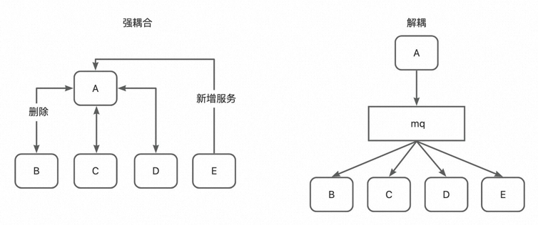

**异步场景：**如用户的业务需要一系列的服务进行处理，按顺序处理的话，用户需要等待的时间过长。例如电商平台的用户下单、支付、积分、邮件、短信通知等流程，长时间等待用户无法接受，就可以通过 mq 进行服务的异步处理，例如积分、邮件和短信通知服务订阅了支付服务的消息，将支付完成作为消息发布到 mq ，这些服务就可以同时对这一订单进行处理，降低了请求等待时间（rt） 。

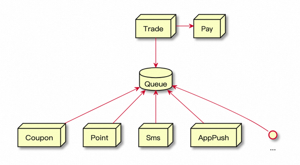

**削峰填谷场景：**削峰表示的含义是，流量如果太大，就控制服务器处理的 QPS，不要让大流量打挂数据库等导致服务器宕机，让服务处理请求更加平缓，节省服务器资源，其本质上是控制用户的请求速率，或是延缓或是直接拒绝。填谷的含义是将阶段性的大流量请求缓存起来，在流量平缓的时候慢慢处理，防止过多的请求被拒绝后的重试导致更大的流量。mq 很适合这一场景，QPS 超出服务端接收请求的能力时，服务端仍然保持在安全范围内地从消息队列中获取消息进行处理，多余的消息会积压在消息队列中，或由于超时直接拒绝，到 QPS 低于这一阈值的时候，这些积压的消息就会被逐渐消费掉。相当于在系统前修建了一个流量蓄水池。

除此之外还可以利用消息队列进行消息通信，日志处理等业务，但消息队列也会引入系统可用性，系统复杂度，数据一致性等问题（强依赖消息队列的正确执行，需要确保消息不会丢失，确保消息的顺序性等）。这意味着如果系统中的消息队列承担着重要的角色，那么消息队列的可靠性和稳定性也至关重要，本文介绍的 MetaQ/RocketMQ 是侧重于维持消息一致性和高可靠性的消息队列中间件。

# 物理架构

MetaQ 的高可用性是基于其物理部署架构实现的，在生产者为消息定义了一个 topic 之后，消费者可以订阅这个 topic ，于是消息就有了从生产到消费的路由指向。

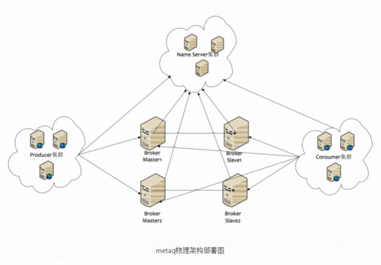

**NameServer** 负责暴露消息的 topic ，因此可以以将 NameServer 理解成一个注册中心，用来关联 topic 和对应的 broker ，即消息的存储位置。NameServer 的每个节点都维护着 topic 和 broker 的映射关系，每个节点彼此独立，无同步。在每个 NameServer 节点内部都维护着所有 **Broker** 的地址列表，所有 **Topic** 和 Topic 对应 **Queue** 的信息等。消息生产者在发送消息之前先与任意一台 NameServer 建立连接，获取 Broker 服务器的地址列表，然后根据负载均衡算法从列表中选择一台消息服务器发送消息。

**Broker** 主要负责消息的存储和转发，分为 **master** 和 **slave**，是一写多读的关系。broker 节点可以按照处理的数据相同划分成副本组，同一组 master 和 slave 的关系可以通过指定相同 brokerName，不同的 brokerId 来定义，brokerId 为 0 标识 master，非 0 是 slave。每个 broker 服务器会与 NameServer 集群建立长连接（注意是跟所有的 NameServer 服务器，因为 NameServer 彼此之间独立不同步），并且会注册 topic 信息到 NameServer 中。复制策略是 Broker 的 Master 与 Slave 间的数据同步方式，分为同步复制与异步复制。由于异步复制、异步刷盘可能会丢失少量消息，因此 Broker 默认采用的是同步双写的方式，消息写入 master 成功后，master 会等待 slave 同步数据成功后才向 Producer 返回成功 ACK ，即 Master 与 Slave 都要写入成功后才会返回成功 ACK 。这样可以保证消息发送时消息不丢失。副本组中，各个节点处理的速度不同，也就有了日志水位的概念 （高水位对消费者不可见）。在 master 宕机时，同步副本集中的其余节点会自动选举出新的 master 代替工作（Raft 协议）。

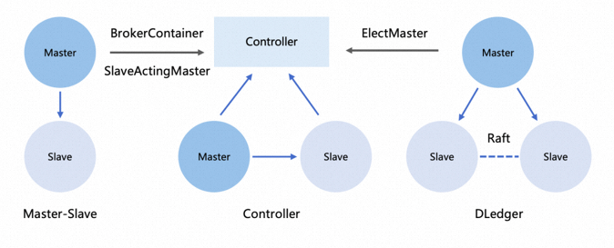

**Producer**，消息生产者，与 NameServer 随机一个节点建立长连接，定时从 NameServer 获取 topic 路由信息，与 master broker 建立长连接，定时发送心跳，Producer 只与 master 建立连接产生通信，不与 slave 建立连接。生产者和消费者都有组（Group）的概念，同一组节点的生产 / 消费逻辑相同。

**Consumer**，消息消费者，与 NameServer 随机一个节点建立长连接，定时从 NameServer 获取 topic 的路由信息，并获取想要消费的 queue 。可以和提供服务的 master 或 slave 建立长连接，定时向 master 和 slave 发送心跳，既可以从 master 订阅消息，也可以从 slave 订阅消息。


# 消息的存储

MetaQ 将消息存储（持久化）到位于生产者和消费者之间的一个消息代理（Message Broker）上。


MetaQ 消息模型：

- Message 单位消息；

- Topic 消息的类型，生产者对应消费者的分区标识；

- Tag 消息在相同 Topic 时的二级分类标识，可用于消息的筛选；

- Queue 物理分区，一个 Topic 对应多个 Queue；

- Group 生产者或消费者的逻辑分组，同一个 Group 的 生产者 / 消费者 通常 生产 / 消费 同一类消息，并且 生产 / 消费 的逻辑一致；

- Offset：偏移值， 表示消费到的位置或待消费的消息位置；


消息的存储方式对消息队列的性能有很大影响，如 ActiveMQ 会使用队列表来存储消息，依靠轮训、加锁等方式检查和处理消息，但对于 QPS 很高的系统来说，一下子积压庞大的数据量在表中会导致 B+ 树索引层级加深，影响查询效率。KV 数据库采用如 LSM 树作为索引结构，对读性能有较大的牺牲，这对于消息队列而言很难接受，因为消息队列常常需要面对消费失败需要重试的情况。

RocketMQ/Kafka/RabbitMQ 等消息队列会采用顺序写的日志结构，将消息刷盘至文件系统作持久化。顺序写日志文件可以避免频繁的随机访问而导致的性能问题，而且利于延迟写入等优化手段，能够快速保存日志。Kafka 会为每个 topic (事件的组织和存储单位，一个 topic 可以对应多个生产者和多个消费者) 划分出一个分区日志，便于根据 topic 顺序消费，消息被读取后不会立刻删除，可以持久存储，但 topic 数量增加的时候，broker 的分区文件数量增大，会使得本来速度很快的顺序写变成随机写（不同文件之间移动），性能大幅下降。

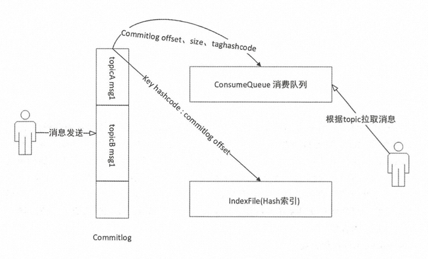

MetaQ 2.0 对这部分进行重新设计，其存储结构主要包括 **CommitLog** 和 **Consume queue** 两部分。

CommitLog 是物理存储，存储不定长的完整消息记录，逻辑上是完全连续的一个文件，物理上单个文件大小是 1 GB，文件名是当前文件首地址在 CommitLog 中的偏移量。只要 CommitLog 落盘，就可以认为已经接收到消息，即使 Cosume queue 丢失，也可以从 CommitLog 恢复。而所有 topic 的消息都会存储在同一个 CommitLog 中来保证顺序写。这样的结构会导致 CommitLog 读取完全变成随机读，所以需要 Consume queue 作为索引队列 (offset, size, tag)，每个 topic-queue 的消息在写完 CommitLog 之后，都会写到独立的 Consume queue ，队列里的每个元素都是定长的元数据，内容包含该消息在对应 CommitLog 的 offset 和 size ，还包括 tagcode 可支持消息按照指定 tag 进行过滤。顺序写是 MetaQ 实现高性能的基础。


基于这样的存储结构，MetaQ 对客户端暴露的主要是 Consume queue 逻辑视图，提供队列访问接口。消费者通过指定 Consume queue 的位点来读取消息，通过提交 Consume queue 的位点来维护消费进度。Concume queue 每个条目长度固定（8 个字节 CommitLog 物理偏移量、4 字节消息长度、8 字节 tag 哈希码），单个 ConsumeQueue 文件默认最多包括 30 万个条目。这样做的好处是队列非常轻量级，Consume Queue 非常小，且在消费过程中都是顺序读取，其速度几乎能与内存读写相比，而在 page cache 和良好的空间局部性作用下，CommitLog 的访问也非常快速。


MetaQ 会启动一个定时服务 ReputMessageService 定时调用（间隔 1ms）来生成 Consume queue 和 其它索引文件。

Consume queue 解决了顺序消费的问题，但如果需要根据属性进行筛选，就必须用到 **index 索引**。

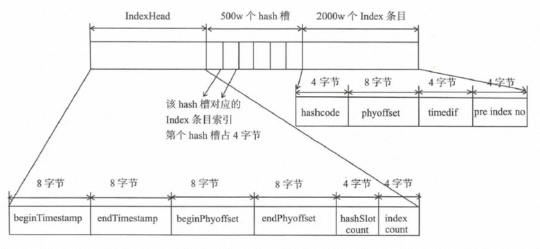

index 索引支持根据 key 值进行筛选，查找时，可以根据消息的 key 计算 hash 槽的位置，hash 槽中存储着 Index 条目的位置，可以根据这个 index 条目获得一个链表（尾），每个 index 条目包含在 CommitLog 上的消息主体的物理偏移量。

# 消息链路

MetaQ 的消息可以根据 topic-queue 划分出确定的从生产者到消费者路由指向。

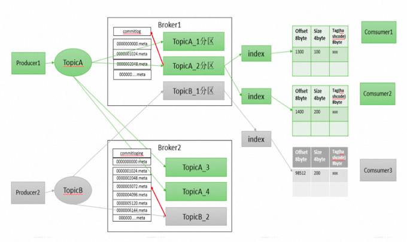

1.producer 指定 broker 和 queue 发送消息 msg ；

2.broker 接收消息，并完成缓存、刷盘和生成摘要（同时根据 tag 和 user properties 对 msg 进行打标）等操作；

3.consumer 每隔一段时间（ pullInterval ）从 broker 端的（根据服务端消息过滤模式 tag 或 sql 过滤后）获取一定量的消息到本地消息队列中（单线程）

4.consumer 按照配置并发分配上述队列消息并执行消费方法；

5.consumer 返回 broker 消费结果并重置消费位点；

# **生产者**

Topic 是消息的主题，每个 topic 对应多个队列，多个队列会均匀的分布在多个 broker 上，Producer 发送的消息在 broker 上会均衡的分布在多个队列中，Producer 发送消息时在多个队列间**轮询**确保消息的均衡。

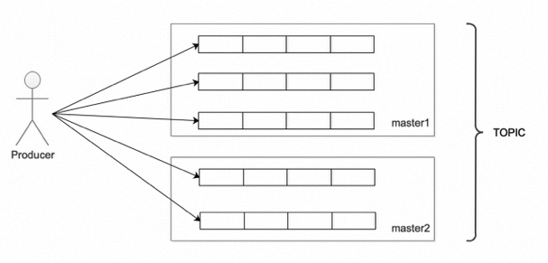

**发送消息**的具体操作如下：

1、查询本地缓存是否存储了 TopicPublishInfo ，否则从 NameServer 获取

2、根据负载均衡选择策略获取待发送队列并轮训访问

3、获取消息队列对应的 broker 实际 IP

4、设置消息 Unique ID ，zip 压缩消息

5、消息校验（长度等），发送消息

Producer 发送的每条消息都包含一个 Topic，表示一类消息的集合。同时还有一个 Tag，用于区分同一 Topic 下不同类型的消息。一个 Topic 包括多个 Queue，每个 Queue 中存放该 Topic 对应消息的位置。一个 Topic 的 Queue 相当于该 Topic 中消息的分区，Queue 可以存储在不同的 Broker 上。发送消息时，Producer 通过负载均衡模块选择相应的 Broker 集群队列进行消息投递。

消息发送时如果出现失败，默认会重试 2 次，在重试时会尽量避开刚刚接收失败的 Broker，而是选择其它 Broker 上的队列进行发送，从而提高消息发送的成功率。

# **消费者**

消费方式

- **广播消费：**Producer 向一些队列轮流发送消息，队列集合称为 Topic，每一个 Consumer 实例消费这个 Topic 对应的所有队列。

- **集群消费：**多个 Consumer 实例平均消费这个 Topic 对应的队列集合。

MetaQ 消费者端有多套负载均衡算法的实现，比较常见的是平均分配和平均循环分配，默认使用平均分配算法，给每个 Consumer 分配均等的队列。一个 Consumer 可以对应多个队列，而一个队列只能给一个 Consumer 进行消费，Consumer 和队列之间是一对多的关系。

集群模式下有一点需要注意：消费队列负载机制遵循一个通用的思想，一个消息队列同时只允许被一个消费者消费，一个消费者可以消费多个消费队列。因此当 Consumer 的数量大于队列的数量，会有部分 Consumer 分配不到队列，这些分配不到队列的 Consumer 机器不会有消息到达。

平均分配算法举例：

- 如果有 5 个队列，2 个 consumer，consumer1 会分配 3 个队列，consumer2 分配 2 个队列；

- 如果有 6 个队列，2 个 consumer，consumer1 会分配 3 个队列，consumer2 也会分配 3 个队列；

- 如果 10 个队列，11 个 consumer，consumer1~consumer10 各分配一个队列，consumer11 无队列分配；

如果消费集群规模较大：例如 topic 队列资源是 128 个，而消费机器数有 160 台，按照一个队列只会被一个消费集群中一台机器处理的原则，会有 32 台机器不会收到消息，此种情况需要联系 MetaQ 人员进行扩容评估。

消费重试：当出现消费失败的消息时，Broker 会为每个消费者组设置一个重试队列。当一条消息初次消费失败，消息队列会自动进行消费重试。达到最大重试次数后，若消费仍然失败，此时会将该消息发送到死信队列。对于死信消息，通常需要开发人员进行手动处理。

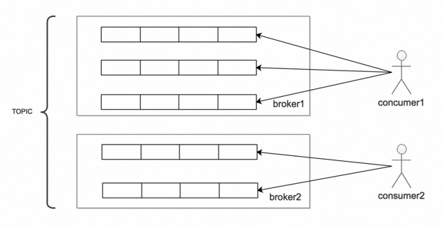

在消费时间过程中可能会遇到消息消费队列增加和减少、消息消费者增加或减少，此时需要对消息消费队列进行重新平衡，既**重新分配 （rebalance）**，这就是所谓的重平衡机制。在 RocketMQ 中，每隔 20s 会根据当前队列数量、消费者数量重新进行队列负载计算，如果计算出来的结果与当前不一样，则触发消息消费队列的重分配。

Consumer 启动时会启动定时器，还执行一些定时同步任务，包括：同步 nameServer 地址，从 nameServer 同步 topic 的路由信息，清理 offline 的 broker，并向所有 broker 发送心跳，分配给当前 consumer 的每个队列将最新消费的 offset 同步给 broker。

# **消息消费过程浅析**

三个关键服务： **RebalanceService、PullMessageService、MessageConsumeService**

## RebalanceService 负载均衡服务

定时执行一次负载均衡（20 s）分配消息队列给消费者。负载均衡针对每个 topic 独立进行，具体如下：

```
private void rebalanceByTopic(final String topic, final boolean isOrder) {
        switch (messageModel) {
            case BROADCASTING: {
                Set<MessageQueue> mqSet = this.topicSubscribeInfoTable.get(topic);
                if (mqSet != null) {
                    boolean changed = this.updateProcessQueueTableInRebalance(topic, mqSet, isOrder);//广播模式下每个消费者要消费所有 queue 的消息
                    if (changed) {
                        this.messageQueueChanged(topic, mqSet, mqSet);
                        log.info("messageQueueChanged {} {} {} {}",
                            consumerGroup,
                            topic,
                            mqSet,
                            mqSet);
                    }
                } else {
                    log.warn("doRebalance, {}, but the topic[{}] not exist.", consumerGroup, topic);
                }
                break;
            }
            case CLUSTERING: {
                Set<MessageQueue> mqSet = this.topicSubscribeInfoTable.get(topic);//找到该topic下的消息队列集合
                List<String> cidAll = this.mQClientFactory.findConsumerIdList(topic, consumerGroup);//找到给消费者组下的所有消费者id
                if (null == mqSet) {
                    if (!topic.startsWith(MixAll.RETRY_GROUP_TOPIC_PREFIX)) {
                        log.warn("doRebalance, {}, but the topic[{}] not exist.", consumerGroup, topic);
                    }
                }
                if (null == cidAll) {
                    log.warn("doRebalance, {} {}, get consumer id list failed", consumerGroup, topic);
                }
                
                if (mqSet != null && cidAll != null) {
                    List<MessageQueue> mqAll = new ArrayList<MessageQueue>();
                    mqAll.addAll(mqSet);

                    Collections.sort(mqAll);
                    Collections.sort(cidAll);
                    
                    AllocateMessageQueueStrategy strategy = this.allocateMessageQueueStrategy;
                    
                    List<MessageQueue> allocateResult = null;
                    try {
                        allocateResult = strategy.allocate(
                            this.consumerGroup,
                            this.mQClientFactory.getClientId(),
                            mqAll,
                            cidAll);// 根据分配策略进行分配
                    } catch (Throwable e) {
                        log.error("AllocateMessageQueueStrategy.allocate Exception. allocateMessageQueueStrategyName={}", strategy.getName(),
                            e);
                        return;
                    }
                    
                    Set<MessageQueue> allocateResultSet = new HashSet<MessageQueue>();
                    if (allocateResult != null) {
                        allocateResultSet.addAll(allocateResult);
                    }
                    boolean changed = this.updateProcessQueueTableInRebalance(topic, allocateResultSet, isOrder);// 更新处理队列表
                    
                    if (changed) {
                        log.info(
                            "rebalanced result changed. allocateMessageQueueStrategyName={}, group={}, topic={}, clientId={}, mqAllSize={}, cidAllSize={}, rebalanceResultSize={}, rebalanceResultSet={}",
                            strategy.getName(), consumerGroup, topic, this.mQClientFactory.getClientId(), mqSet.size(), cidAll.size(),
                            allocateResultSet.size(), allocateResultSet);
                        this.messageQueueChanged(topic, mqSet, allocateResultSet);
                    }
                }
                break;
            }
            default:
                break;
        }
    }
```

```
if (this.defaultMQPushConsumer.getOffsetStore() != null) {
          this.offsetStore = this.defaultMQPushConsumer.getOffsetStore();
        } else {
          switch (this.defaultMQPushConsumer.getMessageModel()) {
            case BROADCASTING:
              this.offsetStore = new LocalFileOffsetStore(this.mQClientFactory, this.defaultMQPushConsumer.getConsumerGroup());
              break;
            case CLUSTERING:
              this.offsetStore = new RemoteBrokerOffsetStore(this.mQClientFactory, this.defaultMQPushConsumer.getConsumerGroup());
              break;
            default:
              break;
          }
}
this.offsetStore.load();
```

这里主要做了几件事：

- 判断消费模式

- 广播模式

i. 找到 topic 下的消息队列（queue）集合

ii. 更新处理队列表

- 集群模式

i. 找到 topic 下的消息队列集合

ii. 找到消费者组下所有消费者 id

iii. 根据分配策略进行分配

iv. 更新处理队列表，开始真正拉取消息请求

消费者会将消费位点更新到 NameServer 上，Rebalance 发生时，读取消费者的消费位点信息，需要注意在消费者数量大于队列数量的情况下，如果消费者不及时更新消费位点信息，可能会导致消息被重复消费。因此，消费者需要及时更新消费位点信息，确保消费进度正确。

Consumer 创建的时候 Rebalance 会被执行。整个 rebalanceService 的作用就是不断的通过负载均衡，重新分配队列的过程。根据分配好的队列构建拉取消息的请求，然后放到 pullRequestQueue 中。

## PullMessageService 拉取消息服务

首先拉取消息时最重要的是确定偏移量 **offset**，这存储在消费者端的 OffsetStore 对象中。

```
  public void syncAll() {
        this.syncTopicConfig();
        this.syncConsumerOffset();
        this.syncDelayOffset();
        this.syncSubscriptionGroupConfig();
        this.syncMessageRequestMode();
        if (brokerController.getMessageStoreConfig().isTimerWheelEnable()) {
            this.syncTimerMetrics();
        }
    }
```

可以看到广播模式和集群模式的对象类型不同，这是因为对 offset 的维护的方式不一样，在 load 的时候 LocalFileOffsetStore 会从本地文件加载这个 offset，而 RemoteBrokerOffsetStore 的 load 函数是空的。

两种对象类型分别有 readOffset 函数支持从内存中获取 offset 值，以及分别从本地文件存储和 broker 获取 offset。需要注意集群模式下消费者只需要关心 broker 上维护的消费进度，因为不论 queue 和 消费者的映射关系如何切换， 只有 offset 之后的未消费消息是消费者需要关心的。


消息的拉取过程是一个不断循环的生产者消费者模型，一个 PullRequest 就对应一个拉取任务，并和一对 MessageQueue（保存 Consume queue 的信息）和 ProcessQueue 关联，消息拉取的过程中，PullMessageService 拉取线程不停的读取 PullRequestQueue 根据 PullRequest 拉取消息。拉取到消息时，消息提交到 ProcessQueue 中并新建 ConsumeRequest 提交到 ConsumeService 处理, 然后生成下一批的 PullRequest 丢到 PullRequestQueue。如果没有拉取到消息或出现异常，则会重新将请求放回拉取队列。ProcessQueue 中以 TreeMap 形式保存待处理的消息， key 为消息对应的 offset ，并自动进行排序。

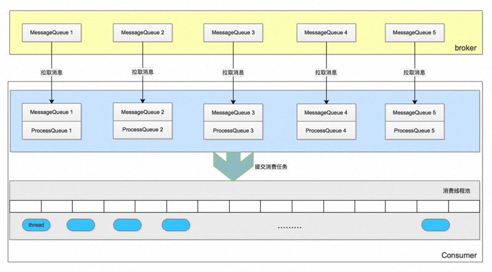

消息拉取过程：

1.PullMessageService 不断循环遍历，从 PullRequestQueue 中提取 PullRequest，根据 nextOffset 去 broker 拉取消息，若该队列 已经 dropped 则更新 offset 到 broker 并丢弃此拉消息请求。

2.PullMessageService 异步拉取消息，同时将 PullRequest 封装在 PullCallback 中，PullCallback 封装在 ResponseFuture 中，并以自增的请求 id 为键，ResponseFuture 为值放入 ResponseTable 中。

3.Broker 收到请求，如果 offset 之后有新的消息会立即发送异步响应；否则等待直到 producer 有新的消息发送后返回或者超时。如果通信异常或者 Broker 超时未返回响应，nettyClient 会定时清理超时的请求，释放 PullRequest 回到 PullRequestQueue。

4. 用最新的 offset 更新 ResponseFuture 里的 PullRequest 并推送给 PullRequestQueue 里以进行下一次拉取。批量拉取到的消息分批提交给 consumeExecutor 线程处理。

## **消费控速**

MetaQ 为消费者端拉取消息提供了消费控速的能力：

- 主动控速，在整个消费过程中我们可以发现，如果想要做到流控，一个是控制生成 PullRequest 的时间间隔，一个是控制生成新一批的请求数量，因此 MetaQ 提供了两个参数给我们 pullInterval、pullBatchSize ，主动控速的逻辑是通过控制消息的拉取速度来达到降低速率的效果。

- 被动控速，这种流量控制的方式要复杂得多，需要用户在消费消息时控制流量 （sentinel），由于消费线程池的待消费队列的消息达到一定阈值之后，MetaQ 会被动降低 PullRequest 的产生的速率，因此当采用流量控制手段通过埋点降低消费速度时，待消费队列会逐渐占满，触发降速机制；为什么不直接用 sentinel ？因为 sentinel 快速失败等策略触发限流后会产生大量重试，重试消息会进入重试队列，当重试的量逐渐增大，broker 上重试队列中消息量也越来越多，并且重试消息再次投递时还可能再次发生重试，又重新进入重试队列，同一条消息反复进出队列，这种无意义的重复动作会增加 broker 的压力。

消息种类

## **普通消息**

可选择同步、异步或单向发送。同步：Producer 发出一条消息后，会在收到 MQ 返回的 ACK 之后再发送下一条消息。异步：Producer 发出消息后无需等待 MQ 返回 ACK ，直接发送下一条消息。单向： Producer 仅负责发送消息，不等待，MQ 也不返回 ACK。

## **顺序消息**

消息的顺序性分为两种：

- 全局顺序：对于指定的一个 Topic ，所有消息按照严格的先入先出的顺序进行发布和消费 （同一个 queue）。

- 分区顺序：对于一个指定的 Topic ，所有消息根据 sharding key 进行分区，同一个分区内的消息按照严格的 FIFO 顺序进行发布和消费，分区之间彼此独立。

MetaQ 只支持同一个 queue 的顺序消息，且同一个 queue 只能被一台机器的一个线程消费，如果想要支持全局消息，那需要将该 topic 的 queue 的数量设置为 1，牺牲了可用性。

## **消息事务**


1. 发送方向 MQ 服务端发送消息。

   2.MQ Server 将消息持久化成功之后，向发送方 ACK 确认消息已经发送成功，此时消息为半消息。

2. 发送方开始执行本地事务逻辑。

3. 发送方根据本地事务执行结果向 MQ Server 提交二次确认（Commit 或是 Rollback），MQ Server 收到 Commit 状态则将半消息标记为可投递，订阅方最终将收到该消息；MQ Server 收到 Rollback 状态则删除半消息，订阅方将不会接受该消息。

4. 在断网或者是应用重启的特殊情况下，上述步骤 4 提交的二次确认最终未到达 MQ Server，经过固定时间后 MQ Server 将对该消息发起消息回查。

5. 发送方收到消息回查后，需要检查对应消息的本地事务执行的最终结果。

6. 发送方根据检查得到的本地事务的最终状态再次提交二次确认，MQ Server 仍按照步骤 4 对半消息进行操作。

MetaQ 3.0 以后，新的版本提供更加丰富的功能，支持消息属性、无序消息、延迟消息、广播消息、长轮询消费、高可用特性，这些功能基本上覆盖了大部分应用对消息中间件的需求。除了功能丰富之外，MetaQ 基于顺序写，大概率顺序读的队列存储结构和 pull 模式的消费方式，使得 MetaQ 具备了最快的消息写入速度和百亿级的堆积能力，特别适合用来削峰填谷。在 MetaQ 3.0 版本的基础上，衍生了开源版本 RocketMQ。

高可用

如何做到不重复消费也不丢失消息？

## **重复消费问题**

- 发送时消息重复【消息 Message ID 不同】：MQ Producer 发送消息时，消息已成功发送到服务端并完成持久化，此时网络闪断或者客户端宕机导致服务端应答给客户端失败。如果此时 MQ Producer 意识到消息发送失败并尝试再次发送消息，MQ 消费者后续会收到两条内容相同但是 Message ID 不同的消息。

- 投递时消息重复【消息 Message ID 相同】：MQ Consumer 消费消息场景下，消息已投递到消费者并完成业务处理，当客户端给服务端反馈应答的时候网络闪断。为了保证消息至少被消费一次，MQ 服务端将在网络恢复后再次尝试投递之前已被处理过的消息，MQ 消费者后续会收到两条内容相同并且 Message ID 也相同的消息。

MetaQ 不能保证消息不重复，因此对于重复消费情况，需要业务自定义唯一标识作为幂等处理的依据。

## **消息丢失问题**

MetaQ 避免消息丢失的机制主要包括：重试、冗余消息存储。在生产者的消息投递失败时，默认会重试两次。消费者消费失败时，在广播模式下，消费失败仅会返回 ConsumeConcurrentlyStatus.RECONSUME_LATER ，而不会重试。在未指定顺序消息的集群模式下，消费失败的消息会进入重试队列自动重试，默认最大重试次数为 16 。在顺序消费的集群模式下，消费失败会使得当前队列暂停消费，并重试到成功为止。

## 主从同步

RocketMQ/MetaQ 为每个存储数据的 Broker 节点配置 ClusterName，BrokerName 标识来更好的进行资源管理。多个 BrokerName 相同的节点构成一个副本组。每个副本还拥有一个从 0 开始编号，不重复也不一定连续的 BrokerId 用来表示身份，编号为 0 的节点是这个副本组的 Leader / Primary / Master，故障时通过选举来重新对 Broker 编号标识新的身份。例如 BrokerId = {0, 1, 3}，则 0 为主，其他两个为备。

从模型的角度来看，RocketMQ /MetaQ 单节点上 Topic 数量较多，如果像 kafka 以 topic 粒度维护状态机，节点宕机会导致上万个状态机切换，这种惊群效应会带来很多潜在风险，因此新版本的 RocketMQ/MetaQ 选择以单个 Broker 作为切换的最小粒度来管理，相比于其他更细粒度的实现，副本身份切换时只需要重分配 Broker 编号，对元数据节点压力最小。由于通信的数据量少，可以加快主备切换的速度，单个副本下线的影响被限制在副本组内，减少管理和运维成本。这种实现也存在一些缺点，例如存储节点的负载无法以最佳状态在集群上进行负载均衡。

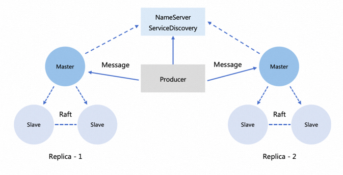

RocketMQ/MetaQ 采用物理复制的方法，存储层的 CommitLog 通过链表和内核的 MappedFile 机制抽象出一条 append only 的数据流。主副本将未提交的消息按序传输给其他副本（相当于 redo log），并根据一定规则计算确认位点（confirm offset）判断日志流是否被提交。最终一致性通过数据水位对齐的方式来实现（越近期的消息价值越高）：

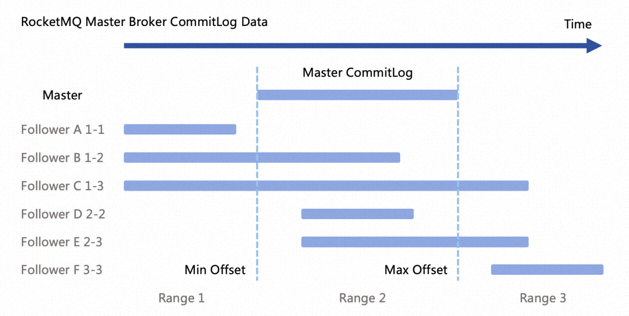

- 1-1 情况下满足备 Max <= 主 Min，一般是备新上线或下线较久，备跳过存量日志，从主的 Min 开始复制。

- 1-2，2-2 两种情况下满足 主 Min < 备 Max <= 主 Max，一般是由于备网络闪断导致日志水位落后，通过 HA 连接追随主即可。

- 1-3，2-3 两种情况下备 Max > 主 Max，可能由于主异步写磁盘宕机后又成为主，或者网络分区时双主写入造成 CommitLog 分叉。由于新主落后于备，在确认位点对齐后少量未确认的消息丢失，这种非正常模式的选举是应该尽量避免的。

- 3-3 理论上不会出现，备的数据长于主，原因可能是主节点数据丢失又叠加了非正常选举，因此这种情况需要人工介入处理。

副本组的消息复制也支持同步和异步的模式。

<table width="864"><colgroup><col width="258"><col width="318"><col width="288"></colgroup><tbody><tr data-cangjie-key="731" data-sticky="false"><td data-cangjie-key="733" data-type="table-cell" rowspan="1" colspan="1" data-container-block="true"><p>复制方式</p></td><td data-cangjie-key="738" data-type="table-cell" rowspan="1" colspan="1" data-container-block="true"><p>优点</p></td><td data-cangjie-key="743" data-type="table-cell" rowspan="1" colspan="1" data-container-block="true"><p>缺点</p></td></tr><tr data-cangjie-key="748" data-sticky="false"><td data-cangjie-key="750" data-type="table-cell" rowspan="1" colspan="1" data-container-block="true"><p>同步复制</p></td><td data-cangjie-key="755" data-type="table-cell" rowspan="1" colspan="1" data-container-block="true"><p>成功写入的消息不会丢失，可靠性高</p></td><td data-cangjie-key="760" data-type="table-cell" rowspan="1" colspan="1" data-container-block="true"><p>写入延迟更高</p></td></tr><tr data-cangjie-key="765" data-sticky="false"><td data-cangjie-key="767" data-type="table-cell" rowspan="1" colspan="1" data-container-block="true"><p>异步复制</p></td><td data-cangjie-key="772" data-type="table-cell" rowspan="1" colspan="1" data-container-block="true"><p>slave 宕机不影响 master 性能更高</p></td><td data-cangjie-key="777" data-type="table-cell" rowspan="1" colspan="1" data-container-block="true"><p>可能丢失消息</p></td></tr></tbody></table>

slave broker 会定时（60 s）从 master 同步信息

```
  public void syncAll() {
        this.syncTopicConfig();
        this.syncConsumerOffset();
        this.syncDelayOffset();
        this.syncSubscriptionGroupConfig();
        this.syncMessageRequestMode();
        if (brokerController.getMessageStoreConfig().isTimerWheelEnable()) {
            this.syncTimerMetrics();
        }
    }
```

# 主从切换

RocketMQ 衍生出了很多不同的主从切换架构。

无切换架构

最早的时候，RocketMQ 基于 Master-Slave 模式提供了主备部署的架构，这种模式提供了一定的高可用能力，在 Master 节点负载较高情况下，读流量可以被重定向到备机。由于没有选主机制，在 Master 节点不可用时，这个副本组的消息发送将会完全中断，还会出现延迟消息、事务消息等无法消费或者延迟。此外，备机在正常工作场景下资源使用率较低，造成一定的资源浪费。为了解决这些问题，社区提出了在一个 Broker 进程内运行多个 BrokerContainer，这个设计类似于 Flink 的 slot，让一个 Broker 进程上可以以 Container 的形式运行多个节点，复用传输层的连接，业务线程池等资源，通过单节点主备交叉部署来同时承担多份流量，无外部依赖，自愈能力强。这种方式下隔离性弱于使用原生容器方式进行隔离，同时由于架构的复杂度增加导致了自愈流程较为复杂。

切换架构

另一条演进路线则是基于可切换的，RocketMQ 也尝试过依托于 Zookeeper 的分布式锁和通知机制进行 HA 状态的管理。引入外部依赖的同时给架构带来了复杂性，不容易做小型化部署，部署运维和诊断的成本较高。另一种方式就是基于 Raft 在集群内自动选主，Raft 中的副本身份被透出和复用到 Broker Role 层面去除外部依赖，然而强一致的 Raft 版本并未支持灵活的降级策略，无法在 C（Consistency）和 A （Availability）之间灵活调整。两种切换方案都是 CP 设计，牺牲高可用优先保证一致性。主副本下线时选主和路由定时更新策略导致整个故障转移时间依然较长，Raft 本身对三副本的要求也会面临较大的成本压力。

RocketMQ DLedger 融合模式

RocketMQ DLedger （基于 Raft 的分布式日志存储）融合模式是 RocketMQ 5.0 演进中结合上述两条路线后的一个系统的解决方案。

<table width="864"><colgroup><col width="160"><col width="266"><col width="222"><col width="216"></colgroup><tbody><tr data-cangjie-key="838" data-sticky="false"><td data-cangjie-key="840" data-type="table-cell" rowspan="1" colspan="1" data-container-block="true"><br></td><td data-cangjie-key="845" data-type="table-cell" rowspan="1" colspan="1" data-container-block="true"><p>模式</p></td><td data-cangjie-key="850" data-type="table-cell" rowspan="1" colspan="1" data-container-block="true"><p>优点</p></td><td data-cangjie-key="855" data-type="table-cell" rowspan="1" colspan="1" data-container-block="true"><p>缺点</p></td></tr><tr data-cangjie-key="860" data-sticky="false"><td data-cangjie-key="862" data-type="table-cell" rowspan="1" colspan="1" data-container-block="true"><p>无切换</p></td><td data-cangjie-key="867" data-type="table-cell" rowspan="1" colspan="1" data-container-block="true"><p>Master-Slave 模式</p></td><td data-cangjie-key="872" data-type="table-cell" rowspan="1" colspan="1" data-container-block="true"><p>实现简单，适用于中小型用户，人工管控力强</p></td><td data-cangjie-key="877" data-type="table-cell" rowspan="1" colspan="1" data-container-block="true"><p>故障需要人工处理，故障时写入消息失败，导致消息消费暂停</p></td></tr><tr data-cangjie-key="882" data-sticky="false"><td data-cangjie-key="884" data-type="table-cell" rowspan="1" colspan="1" data-container-block="true"><br></td><td data-cangjie-key="889" data-type="table-cell" rowspan="1" colspan="1" data-container-block="true"><p>Broker Container 模式</p></td><td data-cangjie-key="894" data-type="table-cell" rowspan="1" colspan="1" data-container-block="true"><p>无需选主，无外部依赖，故障转移非常快 （&lt; 3 秒）</p></td><td data-cangjie-key="899" data-type="table-cell" rowspan="1" colspan="1" data-container-block="true"><p>增加单节点运维的复杂度，机器故障的风险增加，自愈流程复杂</p></td></tr><tr data-cangjie-key="904" data-sticky="false"><td data-cangjie-key="906" data-type="table-cell" rowspan="1" colspan="1" data-container-block="true"><p>切换架构</p></td><td data-cangjie-key="911" data-type="table-cell" rowspan="1" colspan="1" data-container-block="true"><p>Raft 自动选主模式</p></td><td data-cangjie-key="916" data-type="table-cell" rowspan="1" colspan="1" data-container-block="true"><p>自动主备切换</p></td><td data-cangjie-key="921" data-type="table-cell" rowspan="1" colspan="1" data-container-block="true"><p>故障转移时间较长，强一致无法灵活降级，三副本成本压力较大</p></td></tr><tr data-cangjie-key="926" data-sticky="false"><td data-cangjie-key="928" data-type="table-cell" rowspan="1" colspan="1" data-container-block="true"><p>融合架构</p></td><td data-cangjie-key="933" data-type="table-cell" rowspan="1" colspan="1" data-container-block="true"><p>基于 Dledger Controller 的可切换模式</p></td><td data-cangjie-key="938" data-type="table-cell" rowspan="1" colspan="1" data-container-block="true"><p>可支持无切换和切换架构之间的转换，复制协议更简单，灵活降级</p></td><td data-cangjie-key="943" data-type="table-cell" rowspan="1" colspan="1" data-container-block="true"><p>提高了部署和系统的复杂度</p></td></tr></tbody></table>

总结

相比较于 RocketMQ/MetaQ，Kafka 具有更高的吞吐量。Kafka 默认采用异步发送的机制，并且还拥有消息收集和批量发送的机制，这样的设置可以显著提高其吞吐量。由于 Kafka 的高吞吐量，因此通常被用于日志采集、大数据等领域。

RocketMQ/MetaQ 不采用异步的方式发送消息。因为当采用异步的方式发送消息时，Producer 发送的消息到达 Broker 就会返回成功。此时如果 Producer 宕机，而消息在 Broker 刷盘失败时，就会导致消息丢失，从而降低系统的可靠性。

RocketMQ/MetaQ 单机可以支持更多的 topic 数量。因为 Kafka 在 Broker 端是将一个分区存储在一个文件中的，当 topic 增加时，分区的数量也会增加，就会产生过多的文件。当消息刷盘时，就会出现性能下降的情况。而 RocketMQ/MetaQ 是将所有消息顺序写入文件的，因此不会出现这种情况。

当 Kafka 单机的 topic 数量从几十到几百个时，就会出现吞吐量大幅度下降、load 增高、响应时间变长等现象。而 RocketMQ/MetaQ 的 topic 数量达到几千，甚至上万时，也只是会出现小幅度的性能下降。

综上所述，Kafka 具有更高的吞吐量，适合应用于日志采集、大数据等领域。而 RocketMQ/MetaQ 单机支持更多的 topic，且具有更高的可靠性（一致性支持），因此适用于淘宝这样复杂的业务处理。
