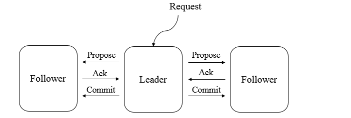
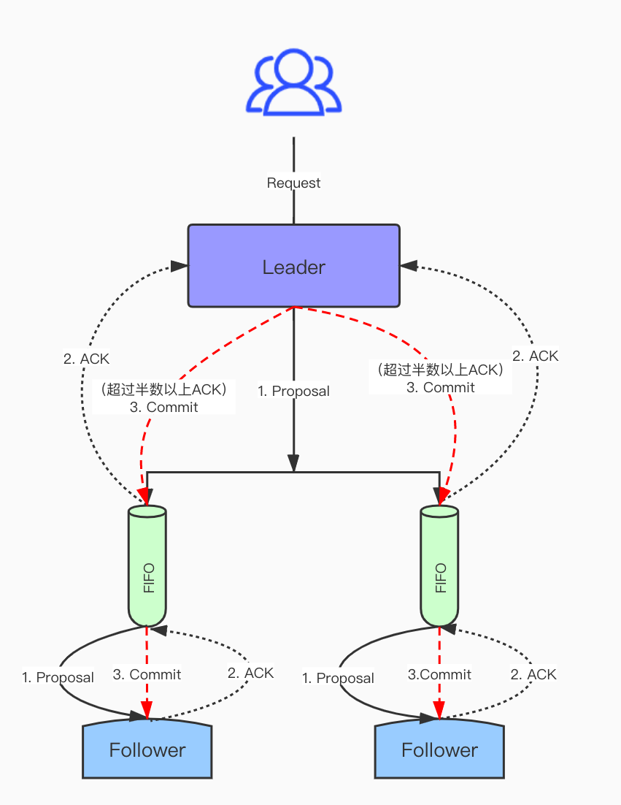
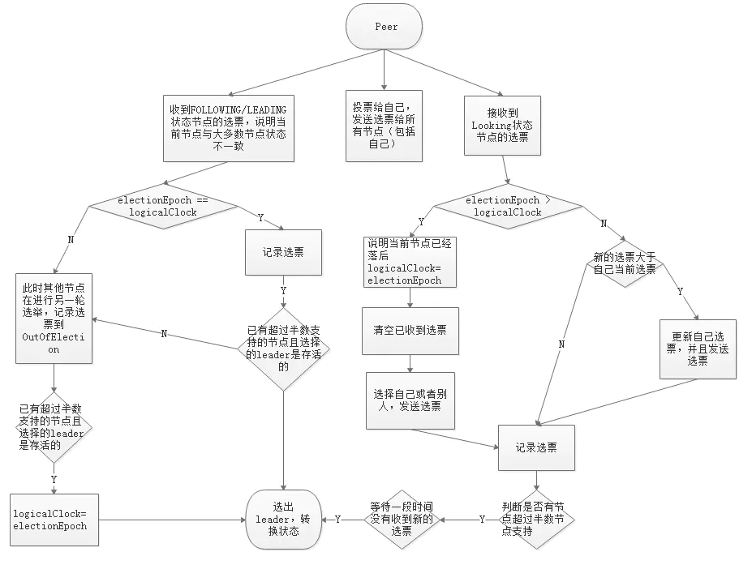
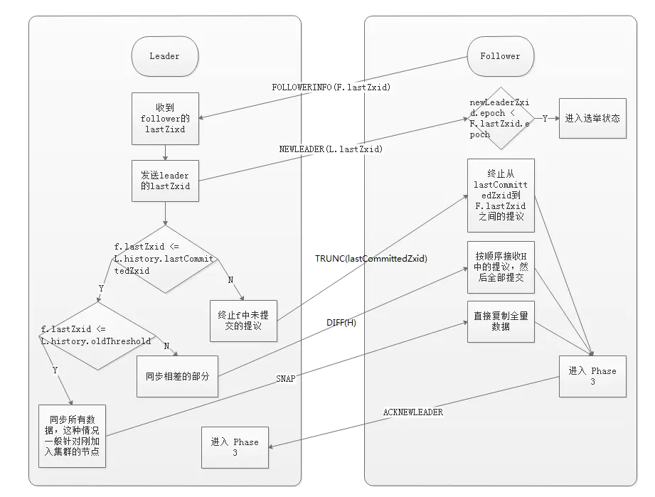

# Zookeeper 一致性协议——ZAB

> ZAB 是⼀种特别为 zookeeper 专⻔设计 的⼀种**⽀持崩溃恢复的原子广播协议。**
>
> ZAB 协议包括两种基本的模式： **崩溃恢复** 和 **消息广播**

## ZAB 协议简介

Zookeeper 通过 ZAB 保证分布式事务的最终一致性。

ZAB 全称 Zookeeper Atomic Broadcast（ZAB，Zookeeper 原子消息广播协议）

1. ZAB 是一种专门为 Zookeeper 设计的一种支持 **崩溃恢复** 的 **原子广播协议** ，是 Zookeeper 保证数据一致性的核心算法。ZAB 借鉴了 Paxos 算法，但它不是通用的一致性算法，是特别为 Zookeeper 设计的。
2. 基于 ZAB 协议，Zookeeper 实现了⼀种主备模式的系统架构来保持集群中各副本之间的**数据的⼀致性**，表现形式就是使用⼀个单⼀的主进程（Leader 服务器）来接收并处理客户端的所有事务请求（写请求），并采用 ZAB 的原子广播协议，将服务器数据的状态变更为事务 Proposal 的形式广播到所有的 Follower 进程中。

## 问题提出

- 主从架构下，leader 崩溃，数据一致性怎么保证？
- 选举 leader 的时候，整个集群无法处理写请求的，如何快速进行 leader 选举？

## ZAB 过程

ZAB 协议的核心是 **定义了对于那些会改变 Zookeeper 服务器数据状态的事务请求的处理方式**

所有事务必须由一个 **全局唯一的服务器来协调处理** ，这样的服务器被称为 Leader 服务器，余下的服务器则称为 Follower 服务器

1. Leader 服务器负责将一个客户端事务请求转化为一个事务 Proposal（提案），并将该 Proposal 分发给集群中所有的 Follower 服务器
2. Leader 服务器等待所有 Follower 服务器的反馈，一旦超过半数的 Follower 服务器进行了正确的反馈后，Leader 就会向所有的 Follower 服务器发送 Commit 消息，要求将前一个 Proposal 进行提交。

## ZAB 协议内容简介

ZAB 协议包括两种基本的模式： **崩溃恢复** 和 **消息广播**

### 消息广播

当集群中有过半的 Follower 服务器完成了和 Leader 服务器的状态同步，那么整个服务框架就可以进入 **消息广播模式** 。

当一台遵守 ZAB 协议的服务器启动后加入到集群中，如果此时集群中已经存在一个 Leader 服务器在负责进行消息广播，那么加入的服务器会自觉的进入 **数据恢复模式： 找到 Leader 所在的服务器，并与其进行数据同步，数据同步完成后参与到消息广播流程中。**

ZAB 协议的消息广播使用原子广播协议， **类似一个二阶段提交的过程** ，但又有所不同。

1. 二阶段提交中，需要所有参与者反馈 ACK 后再发送 Commit 请求。要求所有参与者要么成功，要么失败。这样会产生严重的阻塞问题
2. ZAB 协议中，Leader 等待半数以上的 Follower 成功反馈 ACK 即可，不需要收到全部的 Follower 反馈 ACK。

**消息广播过程：**

1. 客户端发起写请求
2. Leader 将客户端请求信息转化为事务 Proposal，同时为每个 Proposal 分配一个事务 ID（Zxid）
3. Leader 为每个 Follower 单独分配一个 FIFO 的队列，将需要广播的 Proposal 依次放入到队列中
4. Follower 接收到 Proposal 后，首先将其以**事务日志的方式写入到本地磁盘中**，写入成功后给 Leader 反馈一个 ACK 响应（只接受**Epoch**相同的 Proposal）
5. Leader 接收到半数以上 Follower 的 ACK 响应后，即认为消息发送成功，可以发送 Commit 消息
6. Leader 向所有 Follower 广播 Commit 消息，同时自身也会完成事务提交。Follower 接收到 Commit 消息后也会完成事务的提交

### 崩溃恢复

在整个服务框架启动过程中，如果 Leader 服务器出现网络中断、崩溃退出或重启等异常情况，ZAB 协议就会进入崩溃恢复模式。同时选举出新的 Leader 服务器。

当选举产生了新的 Leader 服务器，同时集群中已经有过半的机器与该 Leader 服务器完成了状态同步（数据同步）之后，ZAB 协议会退出恢复模式。

1. 在 ZAB 协议中，为了保证程序的正确运行，整个恢复过程结束后需要选举出⼀个新的 Leader 服务器。
2. Leader 选举算法不仅仅需要让 Leader ⾃身知道已经被选举为 Leader，同时还需要让集群中的所有其他机器也能够快速地感知到选举产生出来的新 Leader 服务器。

### ZAB 保证数据一致性

ZAB 协议规定了 **如果⼀个事务 Proposal 在⼀台机器上被处理成功，那么应该在所有的机器上都被处理成功，哪怕机器出现故障崩溃。** 针对这些情况 ZAB 协议需要保证以下条件：

- **已经在 Leader 服务器上提交的事务最终被所有服务器都提交。**

  假设⼀个事务在 Leader 服务器上被提交了，并且已经得到过半 Folower 服务器的 Ack 反馈，但是在它将 Commit 消息发送给所有 Follower 机器之前，Leader 服务器挂了

  

  图中的消息 C2 就是⼀个典型的例⼦：在集群正常运行过程中的某⼀个时刻，Server1 是 Leader 服务 器，其先后广播了消息 P1、P2、C1、P3 和 C2，其中，当 Leader 服务器将消息 C2（C2 是 Commit Of Proposal2 的缩写，即提交事务 Proposal2）发出后就⽴即崩溃退出了。针对这种情况，ZAB 协议就需要确保事务 Proposal2 最终能够在所有的服务器上都被提交成功，否则将出现不⼀致。

- **丢弃只在 Leader 服务器上被提出（未提交）的事务。**

  假设初始的 Leader 服务器 Server1 在提出了⼀个事务 Proposal3 之后就崩溃退出 了，从而导致集群中的其他服务器都没有收到这个事务 Proposal3。于是，当 Server1 恢复过来再次加 入到集群中的时候，ZAB 协议需要确保丢弃 Proposal3 这个事务。

  

  在图所示的集群中，假设初始的 Leader 服务器 Server1 在提出了⼀个事务 Proposal3 之后就崩溃退出 了，从⽽导致集群中的其他服务器都没有收到这个事务 Proposal3。于是，当 Server1 恢复过来再次加 入到集群中的时候，ZAB 协议需要确保丢弃 Proposal3 这个事务。

结合上⾯提到的这两个崩溃恢复过程中需要处理的特殊情况，就决定了 ZAB 协议必须设计这样⼀个 Leader 选举算法：能够确保提交已经被 Leader 提交的事务 Proposal，同时丢弃已经被跳过的事务 Proposal。针对这个要求，如果让 Leader 选举算法能够保证新选举出来的 Leader 服务器拥有集群中所有机器最⾼编号（即 ZXID 最⼤）的事务 Proposal，那么就可以保证这个新选举出来的 Leader ⼀定具有所有已经提交的提案。更为重要的是，如果让具有最⾼编号事务 Proposal 的机器来成为 Leader，就可以省去 Leader 服务器检查 Proposal 的提交和丢弃⼯作的这⼀步操作了。

### ZAB 如何数据同步

所有正常运行的服务器要么成为 Leader，要么成为 Follower 并和 Leader 保持同步。

1. 完成 Leader 选举（新的 Leader 具有最高的 zxid）之后，在正式开始工作（接收客户端请求）之前，Leader 服务器会首先确认事务日志中的所有 Proposal 是否都已经被集群中过半的机器提交了，即 **是否完成数据同步** 。
2. Leader 服务器需要确保所有的 Follower 服务器能够接收到每⼀条事务 Proposal，并且能够正确地将所有已经提交了的事务 Proposal 应用到内存数据中。等到 Follower 服务器将所有其尚未同步的事务 Proposal 都从 Leader 服务器上同步过来并成功应用到本地数据库中后，Leader 服务器就会将该 Follower 服务器加入到真正的可用 Follower 列表中，并开始之后的其他流程。

## ZAB 运行时状态

ZAB 协议设计中，每个进程都有可能处于如下三种状态之一：

- LOOKING：Leader 选举状态，正在寻找 Leader
- FOLLOWING：当前节点是 Follower。与 Leader 服务器保持同步状态
- LEADING：当前节点是 Leader，作为主进程领导状态。

### ZAB 状态的切换

1. 所有进程的初始状态都是 LOOKING 状态，此时不存在 Leader。
2. 接下来，进程会试图选举出来一个新的 Leader，Leader 切换为 LEADING 状态，其它进程发现已经选举出新的 Leader，那么它就会切换到 FOLLOWING 状态，并开始与 Leader 保持同步。
3. 处于 FOLLOWING 状态的进程称为 Follower，LEADING 状态的进程称为 Leader。
4. 当 Leader 崩溃或者放弃领导地位时，其余的 Follower 进程就会切换到 LOOKING 状态开始新一轮的 Leader 选举。

**运行过程中的状态转换**

**一个 Follower 只能和一个 Leader 保持同步，Leader 进程和所有的 Follower 进程之间通过心跳监测机制来感知彼此的情况。**

1. 若 Leader 能够在超时时间内正常的收到心跳检测，那么 Follower 就会一直与该 Leader 保持连接。
2. 如果在指定时间内 Leader 无法从过半的 Follower 进程那里接收到心跳检测，或者 TCP 连接断开，那么 Leader 会放弃当前周期的领导，并转换为 LOOKING 状态；其他的 Follower 也会选择放弃这个 Leader，同时转换为 LOOKING 状态，之后会进行新一轮的 Leader 选举

## ZAB 协议实现

Java 版本的 ZAB 协议的实现跟上面的定义略有不同，选举阶段使用的是 **Fast Leader Election**（FLE），它包含了步骤 2 的发现职责。因为 FLE 会选举拥有最新提议的历史节点作为 Leader，这样就省去了发现最新提议的步骤。

实际的实现将 **发现和同步阶段合并为 Recovery Phase（恢复阶段）** ，所以，Zab 的实现实际上有三个阶段。

### 快速选举（Fast Leader Election）

前面提到的 FLE 会选举拥有最新 Proposal history （lastZxid 最大）的节点作为 Leader，这样就省去了发现最新提议的步骤。 **这是基于拥有最新提议的节点也拥有最新的提交记录**

**成为 Leader 的条件：**

1. 选 epoch（任期，周期）最大的
2. epoch 相等，选 zxid 最大的
3. epoch 和 zxid 都相等，选 server_id 最大的（zoo.cfg 中配置的 myid）

节点在选举开始时，都默认投票给自己，当接收其他节点的选票时，会根据上面的 **Leader 条件** 判断并且更改自己的选票，然后重新发送选票给其他节点。**当有一个节点的得票超过半数，该节点会设置自己的状态为 Leading ，其他节点会设置自己的状态为 Following**。

### 恢复阶段（Recovery Phase）

这一阶段 Follower 发送他们的 lastZxid 给 Leader，Leader 根据 lastZxid 决定如何同步数据。这里的实现跟前面的 阶段 3 有所不同：Follower 收到 TRUNC 指令会终止 `L.lastCommitedZxid` 之后的 Proposal ，收到 DIFF 指令会接收新的 Proposal。

> history.lastCommittedZxid：最近被提交的提议的 zxid
> history.oldThreshold：被认为已经太旧的已提交提议的 zxid

## ZAB 与 Paxos 的联系和区别

### 联系

1. 都存在一个类似 Leader 进程的角色，由其负责协调多个 Follower 进程的运行
2. Leader 进程都会等待超过半数的 Follower 作出正确的反馈后，才会将一个提议进行提交（**过半原则**）
3. 在 ZAB 中，每个 Proposal 中都包含了一个 epoch 值，用来代表当前 Leader 周期，在 Paxos 中同样存在这样的一个表示，名字为 Ballot。

### 区别

1. Paxos 算法中，新选举产生的主进程会进行两个阶段的工作；第一阶段称为读阶段：新的主进程和其他进程通信来收集主进程提出的提议，并将它们提交。第二阶段称为写阶段：当前主进程开始提出自己的提议。
2. ZAB 协议在 Paxos 基础上添加了同步阶段，此时，新的 Leader 会确保存在过半的 Follower 已经提交了之前 Leader 周期中的所有事物 Proposal。这一同步阶段的引入，能够有效保证，Leader 在新的周期中提出事务 Proposal 之前，所有的进程都已经完成了对之前所有事务 Proposal 的提交。

总的来说，ZAB 协议和 Paxos 算法的本质区别在于两者的设计目的不一样：ZAB 协议主要用于构建一个高可用的分布式数据主备系统，而 Paxos 算法则用于构建一个分布式的一致性状态机系统。

## 总结

问题解答：

- 主从架构下，leader 崩溃，数据一致性怎么保证？

  leader 崩溃之后，集群会选出新的 leader，然后就会进入恢复阶段，新的 leader 具有所有已经提交的提议，因此它会保证让 followers 同步已提交的提议，丢弃未提交的提议（以 leader 的记录为准），这就保证了整个集群的数据一致性。

- 选举 leader 的时候，整个集群无法处理写请求的，如何快速进行 leader 选举？

  这是通过 Fast Leader Election 实现的，leader 的选举只需要超过半数的节点投票即可，这样不需要等待所有节点的选票，能够尽早选出 leader。

# 参考 

[【Zookeeper系列】写请求在Leader内事务处理流程](https://www.jianshu.com/p/9a2ba7278f60)
