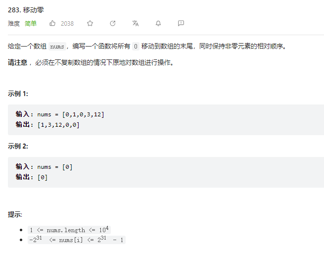
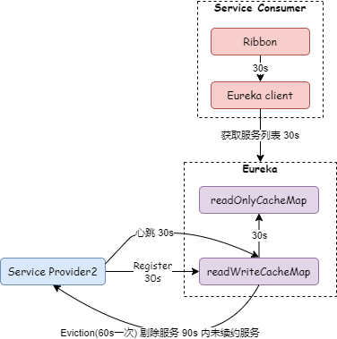
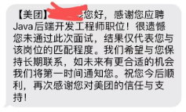

最近几个朋友找我聊天，给我讲述了面试过程中遇到的一些不太理解的事情。作为一个技术面试官，今天来分享 10 个面试相关的套路。

# 1. 自我介绍

自我介绍是一个重要的开始，好的开始是成功的一半。不需要太多花里胡哨的东西，简单、清楚的介绍自己就可以：

1.  工作履历、教育背景、擅长的技术和业务等；

2.  介绍自己项目中的亮点，比如从 0 到 1 构建了 xx 系统，参与过 xx 系统大规模重构，**注意，亮点项目面试官肯定会着重问，要好好准备**；

3.  聊点技术外的东西，比如兴趣爱好之类的；

4.  加分项：获奖经历或荣誉称号，比如 xx 开源项目 Committer，yy 社区布道师；

5.  线上面试，主动打开摄像头让面试官看到自己。

# 2. 技术连环炮

有的技术问题有会多个答案，面试官可能会引导候选人做多个回答。有的技术问题则会有多个扩展点，面试官很可能会提出一连串的问题。

### 2.1 算法题

首先我们看一道算法题，参考 leetcode-283：

这个问题我会**稍微做一点改编，改编后问题如下**：给定一个数组 nums，编写一个函数将**所有 0 移动到数组的左边，非零元素移动到数组的右边**，同时保持非零元素的相对顺序。

我把**必须在不复制数组的情况下原地对数组进行操作**这个条件去掉，希望候选人至少能有复制数组的这个思路。

候选人的答案如果一次不能给出最优解，我会连续地多问几次：

1.  复制数组，遍历原数组两遍，第一遍把 0 复制过来，第二遍把非 0 复制过来，时间复杂度 o(2n);

2.  如果得到复制数组的答案，我会跟候选人说如果不依赖外部数组，是否有什么办法。有部分候选人会想到使用冒泡的方式，从数组的末尾开始遍历，把非零元素冒泡到数组的后面，时间复杂度 o(n^2);

3.  得到冒泡的答案，我会跟候选人说冒泡时间复杂度太高了，有没有别的方法可以降低时间复杂度。这个时候部分候选人会想到双指针的方式，**不过我改编后的题目需要从后往前遍历，部分人会抓不到这个点。**

当然，刷过题的候选人会直接回答出答案 3， 就不会被连环问了。

### 2.2 项目题

候选人简历中写着使用了微服务架构，我会问【你们的微服务是怎样划分的？】，这个问题，里面的问题点很多：

1.  候选人介绍自己的业务，根据业务来划分出的服务有哪些；

2.  介绍完服务后，我会问微服务采用的技术有哪些；

3.  微服务之间是怎么通信的，比如涉及到的 RPC、注册中心等技术的介绍；

4.  比如有的候选人提到用到 OpenFeign，我接着就会问 OpenFeign 超时时间是怎么配置的？如果超时了怎么做的重试？

5.  如果候选人说超时时间配的统一的时间，我会问配置统一超时时间会不会有问题，比如调用外部多个服务或同一个服务的多个接口，如果接口对超时时间要求不一样，统一的超时时间就需要配置最长的那个超时时间，会不会有什么隐患？

6.  注册中心怎么做优雅发布的，比如候选人使用的是 Eureka，会看候选人是否注意过下图的优雅发布的时间点：

7.  如果候选人会提到异步的场景，接着会聊一些 MQ 的技术，比如 RabbitMQ、RocketMQ、Kafka 等。

8.  突然招够了

---

有一次，我面试一家叫联通集成的公司，猎头通知我一面通过了，让我赶紧做核酸，第二天要去现场进行二面，到了第二天，猎头又通知说领导临时有事，面试延后，过了几天，猎头又通知我说一面没通过。

最近一个朋友面试美团，也遇到了类似问题，都约好了二面 ，第二天又通知候选人说一面没过：

这个大概率就是备胎原理，比如一个公司某岗位有 5 个 HC，一面通过了 30 个，二面 10 个同时在进行，有一天招到了第 5 个满意的候选人，那之前在流程中的只能拜拜了。所以，平常心看待，有时候真的不是能力不够。

4. 看错了

---

之前听做面试官的朋友提到过一个问题，他说面试了一个候选人，感觉很不错，但结束的时候才发现候选人学历是专升本，因为教育经历写着 xx 学校 (本科 2009-2014), 开始没有注意上了 5 年本科，可是公司对学历又有硬性要求，只能把候选人挂了。

这种情况不少见，人力筛选简历的时候压力也很大，会有疏忽的可能。

还有的候选人简历里面不写性别、年龄，可能也会造成误会。

5. 我们不招人

---

面试的时候面试官夸奖了候选人，但是反手却把他挂了，这是什么套路？我想这个公司大概率不招人。有的公司常年挂着职位在招人，也让候选人去面试，但是真实不招人。今年大环境不好的情况下，这个现象还真不少。

公司这样做的原因不太理解，我想有可能是给外界看，自己还在招人，自己还在发展，自己资金充裕。

6. 硬着头皮面完

---

分享之前公司的一个小故事，一次我们组的架构师跟旁边的同事说：“人力约了一个候选人，xx 条件不符合，但是人力已经跟人家约好了，你去面一下走个过场，把人打发了”。

我当时很难理解这种做法，为什么不直接让人力再去通知一下呢？但随着工作年限的增加，我发现这个也不稀奇。

这场面试，双方都会非常难受，一个明知不招人，还得硬着头皮提问，一个不知道不招人，还要认知地对待。

7. 打破僵局

---

做面试官其实并不容易，尤其是遇到行业不符合的简历，候选人讲的东西很可能听不明白，这会非常尴尬，不知道该如何提问。

有个印象很深刻的候选人，每次尴尬的时候，他都主动打破，说要不我我接着讲一下 xx 吧，这个我参与比较深入。多次打破僵局，让后面的聊天很顺畅。

有时候求职面试的时候，发现面试官也不会，甚至在装 x，其实这个很正常，面试官也是普通人 ，不可能什么都会。但是作为候选人，我们的目的就是通过面试，**有一个好的态度，引导面试官去听自己擅长的东西，也会加分的**。

8. 运气来了

---

多年前，我去一个大厂面试 ，我讲到一个系统的时候，面试官跟我说你那个系统好多都是他做的。

我当即问面试官是不是叫 yy (代码注解中的名字)，确认后我接着说这个系统设计的非常好，是我工作以来遇到过的设计最好的系统，我们在这套架构上进行扩展和开发，非常容易。对面试官一顿夸赞。

虽然前面的问题回答的不好，但靠运气还是过了。

9. 要的太高了

---

从招聘网站上看，薪资都是一个范围，比如 25~50k，多数候选人会觉得薪资要求只要不超过 50k，这家公司都可以满足，其实不然。

可能公司最多只能给到 30k，或者公司只招一个 50k 的，其他都是 30k 以下的。

所以面试时感觉自己发挥很好，最后却没过，很正常。

10. 练练手

---

面试自己喜欢的公司之前，最好是先拿几个不太想去的公司多面试一下，练练手，面试经验也是需要积累的，如果好几年没有经历过面试，肯定会有不适应。

这一点，面试官、求职者，大家应该都懂的。

## 总结

作为 IT 人，换工作太常见了。求职，是一场旅行，不要太在意目的地，因为决定目的地的因素太多了，技术只是一方面，其他因素或许占得比重更大。努力准备，看淡结果，最后，祝大家都能找到满意的工作。
