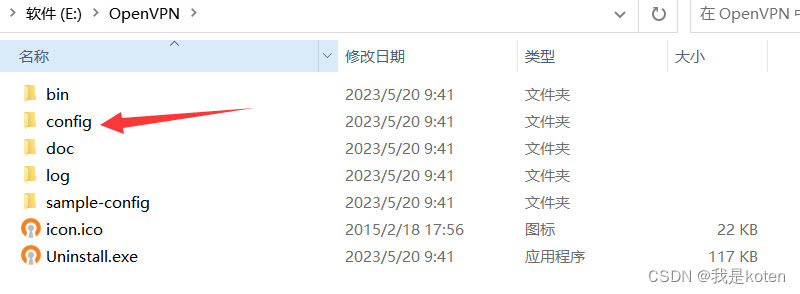
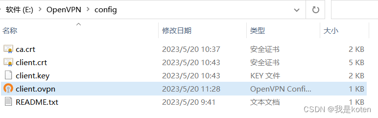
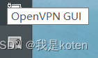
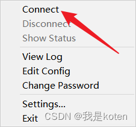
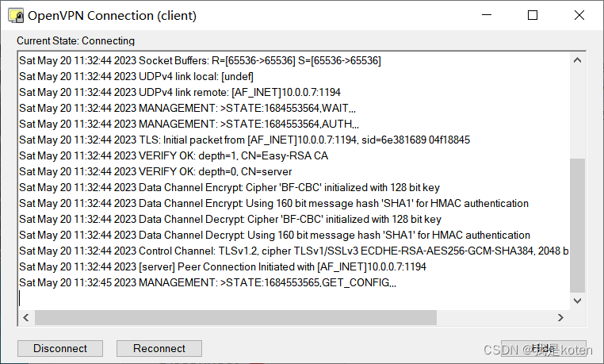
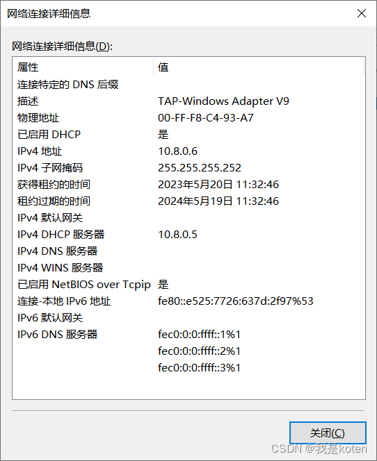
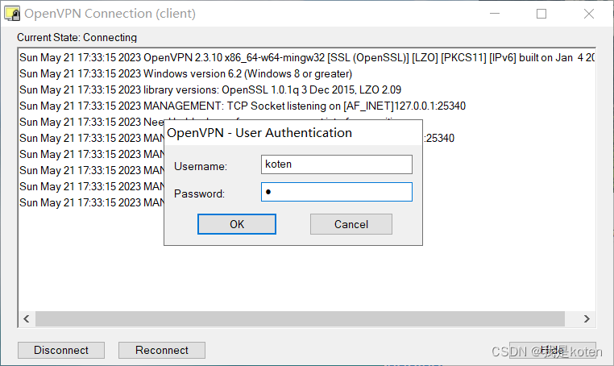

VPN 就是虚拟专用通道，是提供给企业之间或者公司个人与公司之间安全数据传输的隧道，OpenVPN 是 Linux 下开源 VPN 的先锋，提供了良好的性能和友好的用户 GUI（图形用户界面）。本篇文章包含 OpenVPN 应用场景，OpenVPN 服务端搭建，OpenVPN 客户端搭建（windows+linux），OpenVPN 密码认证，手把手教大家搭建 OpenVPN！

大家在操作的时候一定要小心谨慎，稍有不慎，尤其是 windows 客户端配置密码认证，稍有不慎就会出很多问题，大家耐心的修改配置文件，再重新尝试即可，希望大家都能做出来。

# OpenVPN 应用场景

1、个人出差需要访问公司只有内网的服务器

2、公司不同地区之间建立服务通信（IDC 与 IDC 之间）

# OpenVPN 服务端搭建部署

## 一、安装配置证书软件

```
[root@Web01 ~]# yum -y install easy-rsa
[root@Web01 ~]# mkdir /opt/easy-rsa
[root@Web01 easy-rsa]# rpm -ql easy-rsa    #查看已安装的RPM包中名为 easy-rsa 的文件列表
[root@Web01 easy-rsa]# cp -a /usr/share/easy-rsa/3.0.8/* .
[root@Web01 easy-rsa]# cp -a /usr/share/doc/easy-rsa-3.0.8/vars.example ./vars
[root@Web01 easy-rsa]# > vars
[root@Web01 easy-rsa]# cat vars
if [ -z "$EASYRSA_CALLER" ]; then
        echo "You appear to be sourcing an Easy-RSA
'vars' file." >&2
        echo "This is no longer necessary and is
disallowed. See the section called" >&2
        echo "'How to use this file' near the top
comments for more details." >&2
       return 1
fi
set_var EASYRSA_DN "cn_only"
set_var EASYRSA_REQ_COUNTRY "CN"
set_var EASYRSA_REQ_PROVINCE "Beijing"
set_var EASYRSA_REQ_CITY "Shanghai"
set_var EASYRSA_REQ_ORG "koten"
set_var EASYRSA_REQ_EMAIL "888888@qq.comm"
set_var EASYRSA_NS_SUPPORT "yes"
```

## 二、创建证书

```
[root@Web01 easy-rsa]# ./easyrsa init-pki    #1、初始化，在当前目录创建PKI目录，用于存储整数
[root@Web01 easy-rsa]# ./easyrsa build-ca    #2、创建根证书，会提示设置密码，用于ca对之后生成的server和client证书签名时使用，其他提示内容直接回车即可
Enter New CA Key Passphrase:         #注意密码不能太短，我这边设置的是123456
Re-Enter New CA Key Passphrase:
[root@Web01 easy-rsa]# ./easyrsa gen-req server nopass    #3、创建server端证书和私钥文件，nopass表示不加密私钥文件，提示内容直接回车即可
[root@Web01 easy-rsa]# ./easyrsa sign server server    #4、给server端证书签名，提示内容需要输入yes和创建ca根证书时候的密码
[root@Web01 easy-rsa]# ./easyrsa gen-dh    #5、创建Diffie-Hellman文件，密钥交换时的Diffie-Hellman算法
[root@Web01 easy-rsa]# ./easyrsa gen-req client nopass    #6、创建client端的证书和私钥文件，nopass表示不加密私钥文件，提示内容直接回车即可
[root@Web01 easy-rsa]# ./easyrsa sign client client    #7、给client端证书前面，提示内容输入yes和创建ca根证书时候的密码
[root@Web01 easy-rsa]# tree    #检查是否有ca根证书、客户端服务端证书、客户端服务端私钥
.
├── easyrsa                    #管理命令
├── openssl-easyrsa.cnf
├── pki
│   ├── ca.crt                #ca根证书，服务端与客户端都需要用
│   ├── certs_by_serial
│   │   ├── 633C217979C7B5F1D0A9ECA971006F96.pem
│   │   └── 857F9B2E3F6C3D35934672212343B42D.pem
│   ├── dh.pem                #认证算法 服务端
│   ├── index.txt
│   ├── index.txt.attr
│   ├── index.txt.attr.old
│   ├── index.txt.old
│   ├── issued
│   │   ├── client.crt        #客户端证书
│   │   └── server.crt        #服务端证书
│   ├── openssl-easyrsa.cnf
│   ├── private
│   │   ├── ca.key
│   │   ├── client.key        #客户端私钥
│   │   └── server.key        #服务端私钥
......
```

## 三、安装 openvpn 并写入服务端配置文件

```
[root@Web01 easy-rsa]# yum -y install openvpn
[root@Web01 easy-rsa]# cat /etc/openvpn/server.conf
port 1194                                    #端口
proto udp                                    #协议
dev tun                                      #采用路由隧道模式
ca /opt/easy-rsa/pki/ca.crt                  #ca证书的位置
cert /opt/easy-rsa/pki/issued/server.crt     #服务端公钥的位置
key /opt/easy-rsa/pki/private/server.key     #服务端私钥的位置
dh /opt/easy-rsa/pki/dh.pem                  #证书校验算法
server 10.8.0.0 255.255.255.0                #给客户端分配的地址池
push "route 172.16.1.0 255.255.255.0"        #允许客户端访问的内网网段
ifconfig-pool-persist ipp.txt                #地址池记录文件位置，未来让openvpn客户端固定ip地址使用的
keepalive 10 120                             #存活时间，10秒ping一次，120秒如果未收到响应则视为短线
max-clients 100                              #最多允许100个客户端连接
status openvpn-status.log                    #日志位置，记录openvpn状态
log /var/log/openvpn.log                     #openvpn日志记录位置
verb 3                                       #openvpn版本
client-to-client                             #允许客户端与客户端之间通信
persist-key                                  #通过keepalive检测超时后，重新启动VPN，不重新读取
persist-tun                                  #检测超时后，重新启动VPN，一直保持tun是linkup的，否则网络会先linkdown然后再linkup
duplicate-cn                                 #客户端密钥（证书和私钥）是否可以重复
comp-lzo                                     #启动lzo数据压缩格式
```

## 四、启动并检查端口

```
[root@Web01 easy-rsa]# systemctl start openvpn@server
[root@Web01 easy-rsa]# systemctl enable openvpn@server
Created symlink from /etc/systemd/system/multi-user.target.wants/openvpn@server.service to /usr/lib/systemd/system/openvpn@.service.
[root@Web01 easy-rsa]# ip a s tun0    #查看网段
4: tun0: <POINTOPOINT,MULTICAST,NOARP,UP,LOWER_UP> mtu 1500 qdisc pfifo_fast state UNKNOWN group default qlen 100
    link/none
    inet 10.8.0.1 peer 10.8.0.2/32 scope global tun0
       valid_lft forever preferred_lft forever
    inet6 fe80::b1:7ea6:1178:8a1a/64 scope link flags 800
       valid_lft forever preferred_lft forever
[root@Web01 easy-rsa]# ss -lntup|grep 1194    #检查端口
udp    UNCONN     0      0         *:1194                  *:*                   users:(("openvpn",pid=47104,fd=6))
[root@Web01 easy-rsa]# ps -ef|grep openvpn    #检查pid
root      47104      1  0 10:59 ?        00:00:00 /usr/sbin/openvpn --cd /etc/openvpn/ --config server.conf
root      47202  40565  0 11:01 pts/0    00:00:00 grep --color=auto openvpn
```

# OpenVPN 客户端配置（linux 端）

## 一、配置 openvpn

```
[root@Web02 ~]# yum -y install openvpn
[root@Web02 ~]# cat /etc/openvpn/client.conf
client
dev tun
proto udp
remote 10.0.0.7 1194
resolv-retry infinite
nobind
ca ca.crt
cert client.crt
key client.key
verb 3
persist-key
comp-lzo

[root@Web01 pki]# scp private/client.key 172.16.1.8:/etc/openvpn/
[root@Web01 pki]# scp issued/client.crt  172.16.1.8:/etc/openvpn/
[root@Web01 pki]# scp ca.crt 172.16.1.8:/etc/openvpn/

[root@Web02 ~]# systemctl start openvpn@client
[root@Web02 ~]# systemctl enable openvpn@client
Created symlink from /etc/systemd/system/multi-user.target.wants/openvpn@client.service to /usr/lib/systemd/system/openvpn@.service.
```

## 二、测试连接

```
[root@Web02 ~]# ifdown eth1    #关闭内网IP
[root@Web02 ~]# ip a
1: lo: <LOOPBACK,UP,LOWER_UP> mtu 65536 qdisc noqueue state UNKNOWN group default qlen 1000
    link/loopback 00:00:00:00:00:00 brd 00:00:00:00:00:00
    inet 127.0.0.1/8 scope host lo
       valid_lft forever preferred_lft forever
    inet6 ::1/128 scope host
       valid_lft forever preferred_lft forever
2: eth0: <BROADCAST,MULTICAST,UP,LOWER_UP> mtu 1500 qdisc pfifo_fast state UP group default qlen 1000
    link/ether 00:0c:29:36:19:29 brd ff:ff:ff:ff:ff:ff
    inet 10.0.0.8/24 brd 10.0.0.255 scope global eth0
       valid_lft forever preferred_lft forever
    inet6 fe80::20c:29ff:fe36:1929/64 scope link
       valid_lft forever preferred_lft forever
3: eth1: <BROADCAST,MULTICAST> mtu 1500 qdisc pfifo_fast state DOWN group default qlen 1000
    link/ether 00:0c:29:36:19:33 brd ff:ff:ff:ff:ff:ff
4: tun0: <POINTOPOINT,MULTICAST,NOARP,UP,LOWER_UP> mtu 1500 qdisc pfifo_fast state UNKNOWN group default qlen 100
    link/none
    inet 10.8.0.6 peer 10.8.0.5/32 scope global tun0
       valid_lft forever preferred_lft forever
    inet6 fe80::b198:27bb:5967:356b/64 scope link flags 800
       valid_lft forever preferred_lft forever
[root@Web02 ~]# ping 172.16.1.7    #成功通过openvpn ping通
PING 172.16.1.7 (172.16.1.7) 56(84) bytes of data.
64 bytes from 172.16.1.7: icmp_seq=1 ttl=64 time=0.686 ms
64 bytes from 172.16.1.7: icmp_seq=2 ttl=64 time=1.13 ms
^C
--- 172.16.1.7 ping statistics ---
2 packets transmitted, 2 received, 0% packet loss, time 1001ms
rtt min/avg/max/mdev = 0.686/0.908/1.130/0.222 ms
```

# OpenVPN 客户端搭建部署（windows 端）

## 一、安装 OpenVPN 软件

这个东西没法放到网盘里，需要可以私信联系

## 二、配置 OpenVPN 



将 ca 根证书、client.key、client.crt 放入 config 目录

```
[root@Web01 easy-rsa]# sz pki/ca.crt
[root@Web01 easy-rsa]# sz pki/private/client.key
[root@Web01 easy-rsa]# sz pki/issued/client.crt
```

再创建 client.ovpn，写入如下内容

```
client
dev tun
proto udp
remote 10.0.0.7 1194        #注意此处更改为openvpn服务端代码
resolv-retry infinite
nobind
ca ca.crt
cert client.crt
key client.key
verb 3
persist-key
comp-lzo
```


目录最终状态  


## 三、连接测试

双击打开 OpenVPN（桌面快捷方式）右下角出现图标，右键连接





等待进度走完会自动连接




查看网络连接，发现多了以太网 3


右键，状态，详细信息，可以看到 ipv4 地址是 10.8.0.6 是我们配置的那个段的地址



Xshell 新开个本地会话，发现可以 ping 通 openvpn 服务端的内网，也可以进行 ssh 连接，当出差在外时，可以先连通 openvpn 内网再连接要工作的服务器的内网。

```
[c:\~]$ ping 172.16.1.7

正在 Ping 172.16.1.7 具有 32 字节的数据:
来自 172.16.1.7 的回复: 字节=32 时间=1ms TTL=64
来自 172.16.1.7 的回复: 字节=32 时间<1ms TTL=64
来自 172.16.1.7 的回复: 字节=32 时间<1ms TTL=64

172.16.1.7 的 Ping 统计信息:
    数据包: 已发送 = 3，已接收 = 3，丢失 = 0 (0% 丢失)，
往返行程的估计时间(以毫秒为单位):
    最短 = 0ms，最长 = 1ms，平均 = 0ms
^C
[c:\~]$ ssh 172.16.1.7


Connecting to 172.16.1.7:22...
Connection established.
To escape to local shell, press Ctrl+Alt+].

Last login: Sat May 20 09:07:58 2023 from 10.0.0.1
[root@Web01 ~]#
```

## 四、直连其他内网服务器

首先确保我们的 openvpn 服务端开启了内核转发

```
[root@Web01 ~]# echo "net.ipv4.ip_forward = 1" >> /etc/sysctl.conf    #确保openvpn开启了ip转发
[root@Web01~]# sysctl -p
net.ipv4.ip_forward = 1
```

尝试 ping 其他内网服务器，会显示请求超时，需要在添加其他内网服务器添加网关后，才可以 ping 通，才可以直连。

```
[c:\~]$ ping 172.16.1.8            #1、无法ping通其他内网服务器，也就是无法直连

正在 Ping 172.16.1.8 具有 32 字节的数据:
请求超时。
......

[root@Web02 ~]# yum -y install tcpdump          #2、安装tcpdump尝试监控流量
[root@Web02 ~]# tcpdump -i eth1 -nn not icmp    #3、windows端再次ping，虽然ping显示请求超时，但是tcp监控有流量进入，说明只能接收，不能返回
12:47:58.759367 IP 10.8.0.10 > 172.16.1.8: ICMP echo request, id 1, seq 514, length 40
12:48:03.290454 IP 10.8.0.10 > 172.16.1.8: ICMP echo request, id 1, seq 515, length 40
......
[root@Web02 ~]# route add -net 10.8.0.0 netmask 255.255.255.0 gw 172.16.1.7    #4、添加路由，临时生效，可以加入/etc/rc.local实现永久生效

[c:\~]$ ping 172.16.1.8            #5、本地成功ping通

正在 Ping 172.16.1.8 具有 32 字节的数据:
来自 172.16.1.8 的回复: 字节=32 时间=1ms TTL=63
来自 172.16.1.8 的回复: 字节=32 时间=2ms TTL=63
......
[c:\~]$ ssh 172.16.1.8        #6、直连也没有问题

Connecting to 172.16.1.8:22...
Connection established.
To escape to local shell, press Ctrl+Alt+].

Last login: Sun May 21 12:47:51 2023 from 10.0.0.1
[root@Web02 ~]#
```

# Openvpn 密码认证

## 一、服务端配置

1、修改服务端配置文件为支持密码认证

```
[root@Web01 ~]# cat /etc/openvpn/server.conf        #添加配置文件
......
script-security 3                                   #允许使用自定义脚本
auth-user-pass-verify /etc/openvpn/check.sh via-env #指定认证脚本
username-as-common-name                             #用户密码登陆方式验证
```

2、编写脚本文件

```
[root@Web01 ~]# cat /etc/openvpn/check.sh           #
#!/bin/bash
PASSFILE="/etc/openvpn/openvpnfile"   #密码文件 用户名 密码明文
LOG_FILE="/var/log/openvpn-password.log"  #用户登录情况的日志
TIME_STAMP=`date "+%Y-%m-%d %T"`
if [ ! -r "${PASSFILE}" ]; then
    echo "${TIME_STAMP}: Could not open password file \"${PASSFILE}\" for reading." >> ${LOG_FILE}
    exit 1
fi
CORRECT_PASSWORD=`awk '!/^;/&&!/^#/&&$1=="'${username}'"{print $2;exit}'    ${PASSFILE}`
if [ "${CORRECT_PASSWORD}" = "" ]; then
    echo "${TIME_STAMP}: User does not exist: username=\"${username}\",password=\"${password}\"." >> ${LOG_FILE}
    exit 1
fi
if [ "${password}" = "${CORRECT_PASSWORD}" ]; then
    echo "${TIME_STAMP}: Successful authentication: username=\"${username}\"." >> ${LOG_FILE}
    exit 0
fi
echo "${TIME_STAMP}: Incorrect password: username=\"${username}\", password=\"${password}\"." >> ${LOG_FILE}
exit 1
```

3、给脚本执行权限

```
[root@Web01 ~]# cat /etc/openvpn/openvpnfile
koten 1
```

4、创建用户密码，空格为分割符

```
[root@Web02 ~]# cat /etc/openvpn/client.conf
client
dev tun
proto udp
remote 10.0.0.7 1194
resolv-retry infinite
nobind
ca ca.crt
cert client.crt
key client.key
verb 3
persist-key
comp-lzo
auth-user-pass
```

5、重启服务端

```
[root@Web02 ~]# systemctl restart openvpn@client    #重启时候输入密码
Enter Auth Username: koten
Enter Auth Password: *
[root@Web02 ~]# ping 172.16.1.7    #密码正确可以ping通
PING 172.16.1.7 (172.16.1.7) 56(84) bytes of data.
64 bytes from 172.16.1.7: icmp_seq=1 ttl=64 time=0.590 ms
64 bytes from 172.16.1.7: icmp_seq=2 ttl=64 time=1.11 ms
^C
--- 172.16.1.7 ping statistics ---
2 packets transmitted, 2 received, 0% packet loss, time 1000ms
rtt min/avg/max/mdev = 0.590/0.850/1.110/0.260 ms
[root@Web02 ~]# systemctl restart openvpn@client
Enter Auth Username: 1
Enter Auth Password: *
[root@Web02 ~]# ping 172.16.1.7    #密码错误不能ping通
PING 172.16.1.7 (172.16.1.7) 56(84) bytes of data.
^C
--- 172.16.1.7 ping statistics ---
4 packets transmitted, 0 received, 100% packet loss, time 3001ms
```

## 二、linux 客户端配置

在 / etc/openvpn/client.conf 最下面加上 auth-user-pass

```
client
dev tun
proto udp
remote 10.0.0.7 1194
resolv-retry infinite
nobind
ca ca.crt
cert client.crt
key client.key
verb 3
persist-key
comp-lzo
auth-user-pass
```

重启测试连接，重启服务的时候需要输入密码

```
[c:\~]$ ping 172.16.1.7

正在 Ping 172.16.1.7 具有 32 字节的数据:
来自 172.16.1.7 的回复: 字节=32 时间=1ms TTL=64
来自 172.16.1.7 的回复: 字节=32 时间<1ms TTL=64
......
```

## 三、windows 客户端配置

先 Disconnect 断开连接，注意要先断开，否则容易报错，再修改配置文件


最底行添加 auth-user-pass，注意该配置文件不要有多余空格，否则可能会报错

```
client
dev tun
proto udp
remote 10.0.0.7 1194
resolv-retry infinite
nobind
ca ca.crt
cert client.crt
key client.key
verb 3
persist-key
comp-lzo
auth-user-pass
```


再次连接，发现需要输入账号密码



再次输入密码成功连接


再次尝试 ping，成功 ping 通

```
[c:\~]$ ping 172.16.1.7

正在 Ping 172.16.1.7 具有 32 字节的数据:
来自 172.16.1.7 的回复: 字节=32 时间=1ms TTL=64
来自 172.16.1.7 的回复: 字节=32 时间<1ms TTL=64
......
```

我是 koten，10 年运维经验，持续分享运维干货，感谢大家的阅读和关注！

# 参考

- https://blog.csdn.net/qq_37510195/article/details/130777785
- [轻量级的开源代理服务器 Tinyproxy 安装与配置](https://blog.csdn.net/agonie201218/article/details/126598411)
- [centos7-pptp](https://github.com/andanyoung/centos7-pptp)
