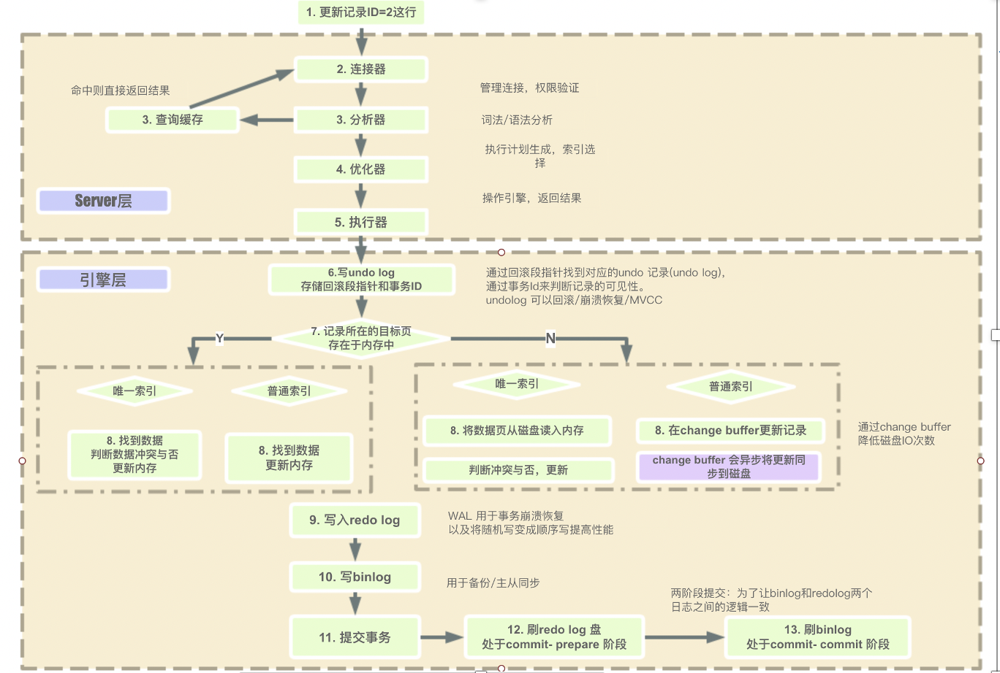
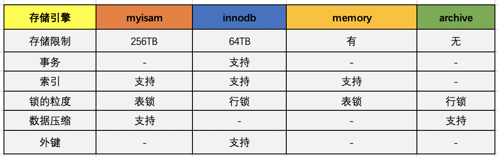
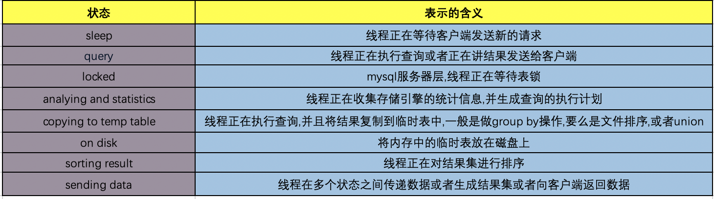
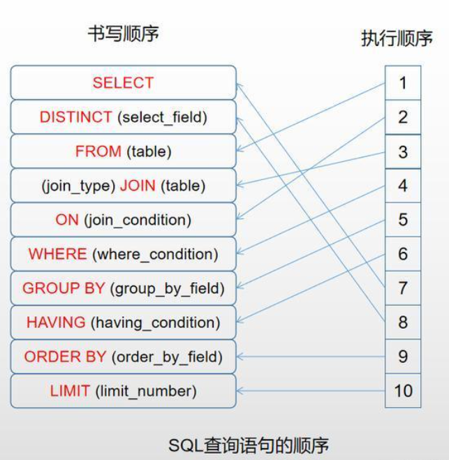

# 一、MySQL 执行过程

MySQL 整体的执行过程如下图所示

## 1.1 连接器

### 1.1.1 连接器的主要职责

1、负责与客户端的通信，是半双工模式，这就意味着某一固定时刻只能由客户端向服务器请求或者服务器向客户端发送数据，而不能同时进行，其中 MySQL 在与客户端连接`TCP/IP`的。

通讯机制：

- 全双工：能同时发送和接收数据，例如平时打电话。
- 半双工：指的某一时刻，要么发送数据，要么接收数据，不能同时。例如早期对讲机
- 单工：只能发送数据或只能接收数据。例如单行道

2、验证请求用户的账户和密码是否正确，如果账户和密码错误，会报错：`Access denied for user 'root'@'localhost' (using password: YES)`

3、如果用户的账户和密码验证通过，会在 MySQL 自带的权限表中查询当前用户的权限。

MySQL 中存在 4 个控制权限的表，分别为 user 表，db 表，tables_priv 表，columns_priv 表：

- `user`表：存放用户账户信息以及全局级别（所有数据库）权限，决定了来自哪些主机的哪些用户可以访问数据库实例
- `db`表：存放数据库级别的权限，决定了来自哪些主机的哪些用户可以访问此数据库
- `tables_priv`表：存放表级别的权限，决定了来自哪些主机的哪些用户可以访问数据库的这个表
- `columns_priv`表：存放列级别的权限，决定了来自哪些主机的哪些用户可以访问数据库表的这个字段

### 1.1.2 MySQL 权限表的验证过程

1、 先从 user 表中的 Host，User，Password 这 3 个字段中判断连接的 IP、用户名、密码是否存在，存在则通过验证。

2、通过身份认证后，进行权限分配，按照 user，db，tables_priv，columns_priv 的顺序进行验证。即先检查全局权限表 user，如果 user 中对应的权限为 Y，则此用户对所有数据库的权限都为 Y，将不再检查 db，tables_priv，columns_priv；如果为 N，则到 db 表中检查此用户对应的具体数据库，并得到 db 中为 Y 的权限；如果 db 中为 N，则检查 tables_priv 中此数据库对应的具体表，取得表中的权限 Y，以此类推。

3、如果在任何一个过程中权限验证不通过，都会报错。

## 1.2 缓存

MySQL 的缓存主要的作用是为了提升查询的效率，缓存以 key 和 value 的哈希表形式存储，key 是具体的 SQL 语句，value 是结果的集合。如果无法命中缓存，就继续走到分析器的这一步，如果命中缓存就直接返回给客户端。不过需要注意的是在 MySQL 的 8.0 版本以后，**缓存被官方删除掉**了。之所以删除掉，是因为查询缓存的失效非常频繁，如果在一个写多读少的环境中，缓存会频繁的新增和失效。对于某些更新压力大的数据库来说，查询缓存的命中率会非常低，MySQL 为了维护缓存可能会出现一定的伸缩性的问题，目前在 5.6 的版本中已经默认关闭了，比较推荐的一种做法是将缓存放在客户端，性能大概会提升 5 倍左右。

## 1.3 分析器

分析器的主要作用是将客户端发过来的 SQL 语句进行分析，这将包括预处理与解析过程，在这个阶段会解析 SQL 语句的语义，并进行关键词和非关键词进行提取、解析，并组成一个**解析树**。具体的关键词包括不限定于以下：`select/update/delete/or/in/where/group by/having/count/limit`等。如果分析到语法错误，会直接给客户端抛出异常：`ERROR:You have an error in your SQL syntax.`。

比如：`select * from user where userId =1234;`

在分析器中就通过语义规则器将`select from where`这些关键词提取和匹配出来，MySQL 会自动判断关键词和非关键词，将用户的匹配字段和自定义语句识别出来。这个阶段也会做一些校验：比如校验当前数据库是否存在 user 表，同时假如 user 表中不存在 userId 这个字段同样会报错：`unknown column in field list.`

> 将客户端发送的 SQL 进行语法解析，生成"解析树"。预处理器根据一些 MySQL 规则进一步检查“解析树”是否合法，例如这里将检查数据表和数据列是否存在，还会解析名字和别 名，看看它们是否有歧义，最后生成新的“解析树”。

## 1.4 优化器

能够进入到优化器阶段表示 SQL 是符合 MySQL 的标准语义规则的并且可以执行的，此阶段主要是进行 SQL 语句的优化，会根据执行计划进行最优的选择，匹配合适的索引，选择最佳的执行方案。比如一个典型的例子是这样的：

表 T，对 A、B、C 列建立联合索引，在进行查询的时候，当 SQL 查询到的结果是：`select xx where B=x and A=x and C=x`，很多人会以为是用不到索引的，但其实会用到，虽然索引必须符合最左原则才能使用，但是本质上，优化器会自动将这条 SQL 优化为：`where A=x and B=x and C=X`，这种优化会为了底层能够匹配到索引，同时在这个阶段是自动按照执行计划进行预处理，MySQL 会计算各个执行方法的最佳时间，最终确定一条执行的 SQL 交给最后的执行器。

> 根据“解析树”生成最优的执行计划。MySQL 使用很多优化策略生成最优的执行计划
>
> - 等价变换策略
>
>   - 5=5 and a>5 改成 a > 5
>
>   - a < b and a=5 改成 b>5 and a=5
>
>   - 基于联合索引，调整条件位置等
>
> - 优化 count、min、max 等函数
>   - InnoDB 引擎 min 函数只需要找索引最左边
>   - InnoDB 引擎 max 函数只需要找索引最右边
>   - MyISAM 引擎 count(\*)，不需要计算，直接返回
> - 提前终止查询
>   - 使用了 limit 查询，获取 limit 所需的数据，就不在继续遍历后面数据
> - in 的优化 MySQL 对 in 查询，会先进行排序，再采用二分法查找数据。比如 where id in (2,1,3)，变 成 in (1,2,3)

## 1.5 执行器

在执行器的阶段，此时会调用存储引擎的 API，API 会调用存储引擎，主要有以下存储的引擎，不过常用的还是`myisam`和`innodb`：

引擎以前的名字叫做：表处理器（其实这个名字我觉得更能表达它存在的意义）负责对具体的数据文件进行操作，对 SQL 的语义比如 select 或者 update 进行分析，执行具体的操作。在执行完以后会将具体的操作记录到 binlog 中，需要注意的一点是：select 不会记录到 binlog 中，只有`update/delete/insert`才会记录到 binlog 中。而 update 会采用两阶段提交的方式，记录都 redolog 中。

### 1.5.6 InnoDB 和 MyISAM 对比

InnoDB 和 MyISAM 是使用 MySQL 时最常用的两种引擎类型，我们重点来看下两者区别。

- 事务和外键

  InnoDB 支持事务和外键，具有安全性和完整性，适合大量 insert 或 update 操作

  MyISAM 不支持事务和外键，它提供高速存储和检索，适合大量的 select 查询操作

- 锁机制

  InnoDB 支持行级锁，锁定指定记录。基于索引来加锁实现。

  MyISAM 支持表级锁，锁定整张表。

- 索引结构

  InnoDB 使用聚集索引（聚簇索引），索引和记录在一起存储，既缓存索引，也缓存记录。

  MyISAM 使用非聚集索引（非聚簇索引），索引和记录分开。

- 并发处理能力

  MyISAM 使用表锁，会导致写操作并发率低，读之间并不阻塞，读写阻塞。

  InnoDB 读写阻塞可以与隔离级别有关，可以采用多版本并发控制（MVCC）来支持高并发

- 存储文件

  InnoDB 表对应两个文件，一个.frm 表结构文件，一个.ibd 数据文件。InnoDB 表最大支持 64TB；

  MyISAM 表对应三个文件，一个.frm 表结构文件，一个 MYD 表数据文件，一个.MYI 索引文件。从 MySQL5.0 开始默认限制是 256TB。

- 适用场景
  - MyISAM 不需要事务支持（不支持）
  - 并发相对较低（锁定机制问题）
  - 数据修改相对较少，以读为主
  - 数据一致性要求不高
- InnoDB
  - 需要事务支持（具有较好的事务特性）
  - 行级锁定对高并发有很好的适应能力
  - 数据更新较为频繁的场景
  - 数据一致性要求较高
  - 硬件设备内存较大，
  - 可以利用 InnoDB 较好的缓存能力来提高内存利用率，减少磁盘 IO
- 总结 两种引擎该如何选择？
  - 是否需要事务？有，InnoDB
  - 是否存在并发修改？有，InnoDB
  - 是否追求快速查询，且数据修改少？是，MyISAM
  - 在绝大多数情况下，推荐使用 InnoDB

# 二、执行的状态

可以通过命令：`show full processlist`，展示所有的处理进程，主要包含了以下的状态，表示服务器处理客户端的状态，状态包含了从客户端发起请求到后台服务器处理的过程，包括加锁的过程、统计存储引擎的信息，排序数据、搜索中间表、发送数据等。囊括了所有的 MySQL 的所有状态,其中具体的含义如下图：

# 三、SQL 的执行顺序

事实上，SQL 并不是按照我们的书写顺序来从前往后、左往右依次执行的，它是按照固定的顺序解析的，主要的作用就是从上一个阶段的执行返回结果来提供给下一阶段使用，SQL 在执行的过程中会有不同的临时中间表，一般是按照如下顺序：

例子：`select distinct s.id from T t join S s on t.id=s.id where t.name="Yrion" group by t.mobile having count(*)>2 order by s.create_time limit 5;`

这里有几个需要注意的地方：

1、SQL 语句是**从 FROM 开始执行的**，而不是 SELECT。MySQL 在执行 SQL 查询语句的时，首先是将数据从硬盘加载到数据缓冲区中，以便对这些数据进行操作。

2、SELECT 是在 FROM 和 GROUP BY 之后执行的。这就导致了无法在 WHERE 中使用 SELECT 中设置字段的别名作为查询条件。

3、UNION 是排在 ORDER BY 之前的。虽然数据库允许 SQL 语句对 UNION 段中的子查询或者派生表进行排序，但是这并不能说明在 UNION 操作过后仍保持排序后的顺序。

4、在 MySQL 中 SQL 的逻辑查询是根据上述进行查询，但 MySQL 可能并不完全会按照逻辑查询处理方式进行查询。MySQL 有 2 个组件：

    1）分析SQL语句的Parser；
    
    2）优化器Optimizer；

MySQL 在执行查询之前，都**会选择一条自认为最优的查询方案去执行**，获取查询结果。一般情况下都能计算出最优的查询方案，但在某些情况下，MySQL 给出的查询方案并不是很好的查询方案。

5、存在索引时，优化器优先使用索引的查询条件，当索引为多个时，优化器会直接选择效率最高的索引去执行。

# 四、SQL 语句 where 后条件执行先后顺序

## 4.1 结论

- 针对 MySQL，其条件执行顺序是 从左往右，自上而下。
- 针对 Orcale，其条件执行顺序是从右往左，自下而上。

## 4.2 MySQL

MySQL where 执行顺序是从**左往右执行的**，在数据量小的时候不用考虑，但数据量多的时候要考虑条件的先后顺序，此时应遵守一个原则：**排除越多的条件放在第一个。**

在用 MySQL 查询数据库的时候，连接了很多个过滤条件，发现非常慢。例如：`select… where p.languages_id=1 and t.type=1 and p.products_id in(472,474)，`，这样查询需要 20 多秒，虽然在各个字段上都建立了索引。用分析 Explain SQL 一分析，发现在第一次分析过程中就返回了几万条数据：`where d p.languages_id=1` ，然后再依次根据条件缩小范围。

然后稍微改变一下 where 字段的位置之后，速度就有了明显地提高：`where p.products_id in(472,474) and p.languages_id=1 and t.type=1`，这样第一次的过滤条件是`p.products_id in(472,474)`，它返回的结果只有不到 10 条，接下来还要根据其它的条件来过滤，自然在速度上有了较大的提升。经过实践发现，不要以为 where 中的字段顺序无所谓，可以随便放在哪，应该**尽可能地第一次就过滤掉大部分无用的数据**，只返回最小范围的数据。

> 大多时候 MySQL 会自动根据 SQL 语句做出优化，使用最优的 SQL 语句进行查询。有时候 MySQL 无法根据 SQL 语句做出最优的优化顺序，所以还是要我们自己预判断出哪种过滤是最优，毕竟自己才最懂自己的数据。
