# 1. InnoDB 存储结构

从 MySQL 5.5 版本开始默认使用 InnoDB 作为引擎，它擅长处理事务，具有自动崩溃恢复的特性，在日常开发中使用非常广泛。下面是官方的 InnoDB 引擎架构图，主要分为内存结构和磁盘结构两大部分。

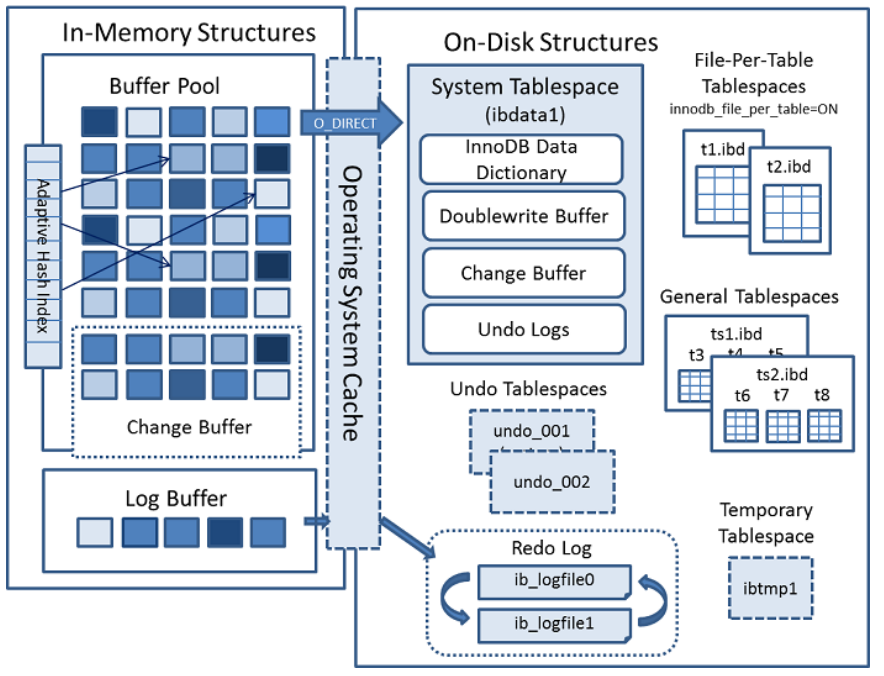

## 1.1、InnoDB 内存结构

内存结构主要包括 Buffer Pool、Change Buffer、Adaptive Hash Index 和 Log Buffer 四大组件。

Buffer Pool：缓冲池，简称 BP。BP 以 Page 页为单位，默认大小 16K，BP 的底层采用链表数 据结构管理 Page。在 InnoDB 访问表记录和索引时会在 Page 页中缓存，以后使用可以减少磁盘 IO 操作，提升效率。

- Page 管理机制

  Page 根据状态可以分为三种类型：

  - free page ： 空闲 page，未被使用

  - clean page：被使用 page，数据没有被修改过
  - dirty page：脏页，被使用 page，数据被修改过，页中数据和磁盘的数据产生了不一致

- 针对上述三种 page 类型，InnoDB 通过三种链表结构来维护和管理

  - free list ：表示空闲缓冲区，管理 free page
  - flush list：表示需要刷新到磁盘的缓冲区，管理 dirty page，内部 page 按修改时间排序。脏页即存在于 flush 链表，也在 LRU 链表中，但是两种互不影响，LRU 链表负责管理 page 的可用性和释放，而 flush 链表负责管理脏页的刷盘操作。
  - lru list：表示正在使用的缓冲区，管理 clean page 和 dirty page，缓冲区以 midpoint 为基点，前面链表称为 new 列表区，存放经常访问的数据，占 63%；后面的链表称为 old 列表区，存放使用较少数据，占 37%。

- **Buffer Pool**配置参数

  - show variables like '%innodb_page_size%'; //查看 page 页大小
  - show variables like '%innodb_old%'; //查看 lru list 中 old 列表参数
  - show variables like '%innodb_buffer%'; //查看 buffer pool 参数
  - 建议：将 innodb_buffer_pool_size 设置为总内存大小的 60%-80%， innodb_buffer_pool_instances 可以设置为多个，这样可以避免缓存争夺。

- Change Buffer：写缓冲区，简称 CB。在进行 DML 操作时，如果 BP 没有其相应的 Page 数据， 并不会立刻将磁盘页加载到缓冲池，而是在 CB 记录缓冲变更，等未来数据被读取时，再将数据合并恢复到 BP 中。

      ChangeBuffer占用BufferPool空间，默认占25%，最大允许占50%，可以根据读写业务量来进行调整。参数`innodb_change_buffer_max_size;` 当更新一条记录时，该记录在BufferPool存在，直接在BufferPool修改，一次内存操作。如果该记录在BufferPool不存在（没有命中），会直接在ChangeBuffer进行一次内存操作，不用再去磁盘查询数据，避免一次磁盘IO。当下次查询记录时，会先进性磁盘读取，然后再从 ChangeBuffer中读取信息合并，最终载入BufferPool中。 写缓冲区，仅适用于非唯一普通索引页，为什么？ 如果在索引设置唯一性，在进行修改时，**InnoDB必须要做唯一性校验**，因此必须查询磁盘， 做一次IO操作。会直接将记录查询到BufferPool中，然后在缓冲池修改，不会在 ChangeBuffer操作。

- Adaptive Hash Index：自适应哈希索引，用于优化对 BP 数据的查询。InnoDB 存储引擎会监控对表索引的查找，如果观察到建立哈希索引可以带来速度的提升，则建立哈希索引，所以 称之为自适应。InnoDB 存储引擎会自动根据访问的频率和模式来为某些页建立哈希索引。

- **Log Buffer**：日志缓冲区，用来保存要写入磁盘上 log 文件（Redo/Undo）的数据，日志缓冲区的内容定期刷新到磁盘 log 文件中。日志缓冲区满时会自动将其刷新到磁盘，当遇到 BLOB 或多行更新的大事务操作时，增加日志缓冲区可以节省磁盘 I/O。 LogBuffer 主要是用于记录 InnoDB 引擎日志，在 DML 操作时会产生 Redo 和 Undo 日志。 LogBuffer 空间满了，会自动写入磁盘。可以通过将`innodb_log_buffer_size`参数调大，减少磁盘 IO 频率

- innodb_flush_log_at_trx_commit 参数控制日志刷新行为，默认为 1

  - 0 ：每隔 1 秒写日志文件和刷盘操作（写日志文件 LogBuffer-->OS cache，刷盘 OS cache-->磁盘文件），最多丢失 1 秒数据
  - 1：事务提交，立刻写日志文件和刷盘，数据不丢失，但是会频繁 IO 操作
  - 2：事务提交，立刻写日志文件，每隔 1 秒钟进行刷盘操作

## 1.2、InnoDB 磁盘结构

InnoDB 磁盘主要包含 Tablespaces，InnoDB Data Dictionary，Doublewrite Buffer、Redo Log 和 Undo Logs。

- **表空间（Tablespaces）**：用于存储表结构和数据。表空间又分为系统表空间、独立表空间、 通用表空间、临时表空间、Undo 表空间等多种类型；

  - 系统表空间（The System Tablespace）

    包含 InnoDB 数据字典，Doublewrite Buffer，Change Buffer，Undo Logs 的存储区域。系统表空间也默认包含任何用户在系统表空间创建的表数据和索引数据。系统表空间是一个共享的表空间因为它是被多个表共享的。该空间的数据文件通过参数 innodb_data_file_path 控制，默认值是 ibdata1:12M:autoextend(文件名为 ibdata1、 12MB、自动扩展)。

  - 独立表空间（File-Per-Table Tablespaces）

    默认开启，独立表空间是一个单表表空间，该表创建于自己的数据文件中，而非创建于 系统表空间中。当 innodb_file_per_table 选项开启时，表将被创建于表空间中。否则， innodb 将被创建于系统表空间中。每个表文件表空间由一个.ibd 数据文件代表，该文件 默认被创建于数据库目录中。表空间的表文件支持动态（dynamic）和压缩 （commpressed）行格式。

  - 通用表空间（General Tablespaces）

    通用表空间为通过 create tablespace 语法创建的共享表空间。通用表空间可以创建于 mysql 数据目录外的其他表空间，其可以容纳多张表，且其支持所有的行格式。

    ```
    CREATE TABLESPACE ts1 ADD DATAFILE ts1.ibd Engine=InnoDB; //创建表空间ts1
    CREATE TABLE t1 (c1 INT PRIMARY KEY) TABLESPACE ts1; //将表添加到ts1表空间
    ```

  - 撤销表空间（Undo Tablespaces）

    撤销表空间由一个或多个包含 Undo 日志文件组成。在 MySQL 5.7 版本之前 Undo 占用的 是 System Tablespace 共享区，从 5.7 开始将 Undo 从 System Tablespace 分离了出来。 InnoDB 使用的 undo 表空间由 innodb_undo_tablespaces 配置选项控制，默认为 0。参 数值为 0 表示使用系统表空间 ibdata1;大于 0 表示使用 undo 表空间 undo_001、 undo_002 等。

  - 临时表空间（Temporary Tablespaces）

    分为 session temporary tablespaces 和 global temporary tablespace 两种。session temporary tablespaces 存储的是用户创建的临时表和磁盘内部的临时表。global temporary tablespace 储存用户临时表的回滚段（rollback segments ）。mysql 服务 器正常关闭或异常终止时，临时表空间将被移除，每次启动时会被重新创建。

  - 数据字典（InnoDB Data Dictionary）

    InnoDB 数据字典由内部系统表组成，这些表包含用于查找表、索引和表字段等对象的元数据。元数据物理上位于 InnoDB 系统表空间中。由于历史原因，数据字典元数据在一定程度上与 InnoDB 表元数据文件（.frm 文件）中存储的信息重叠。

  - 双写缓冲区（Doublewrite Buffer）

    位于系统表空间，是一个存储区域。在 BufferPage 的 page 页刷新到磁盘真正的位置前，会先将数据存在 Doublewrite 缓冲区。如果在 page 页写入过程中出现操作系统、存储子系统或 mysqld 进程崩溃，InnoDB 可以在崩溃恢复期间从 Doublewrite 缓冲区中找到页面的一个好备份。在大多数情况下，默认情况下启用双写缓冲区，要禁用 Doublewrite 缓冲区，可以将 `innodb_doublewrite`设置为 0。使用 Doublewrite 缓冲区时建议将 innodb_flush_method 设 置为 O_DIRECT。

    > MySQL 的 innodb_flush_method 这个参数控制着 innodb 数据文件及 redo log 的打开、 刷写模式。有三个值：fdatasync(默认)，O_DSYNC，O_DIRECT。设置 O_DIRECT 表示 数据文件写入操作会通知操作系统不要缓存数据，也不要用预读，直接从 Innodb Buffer 写到磁盘文件。 默认的 fdatasync 意思是先写入操作系统缓存，然后再调用 fsync()函数去异步刷数据文 件与 redo log 的缓存信息。

  - 重做日志（Redo Log）

    重做日志是一种基于磁盘的数据结构，用于在崩溃恢复期间更正不完整事务写入的数据。 MySQL 以循环方式写入重做日志文件，记录 InnoDB 中所有对 Buffer Pool 修改的日志。当出现实例故障（像断电），导致数据未能更新到数据文件，则数据库重启时须 redo，重新把数据更新到数据文件。读写事务在执行的过程中，都会不断的产生 redo log。默认情况下，重做日志在磁盘上由两个名为 ib_logfile0 和 ib_logfile1 的文件物理表示。

  - 撤销日志（Undo Logs）

    撤消日志是在事务开始之前保存的被修改数据的备份，用于例外情况时回滚事务。撤消日志属于逻辑日志，根据每行记录进行记录。撤消日志存在于系统表空间、撤消表空间和临时表空间中。

  # 三、新版本结构演变

  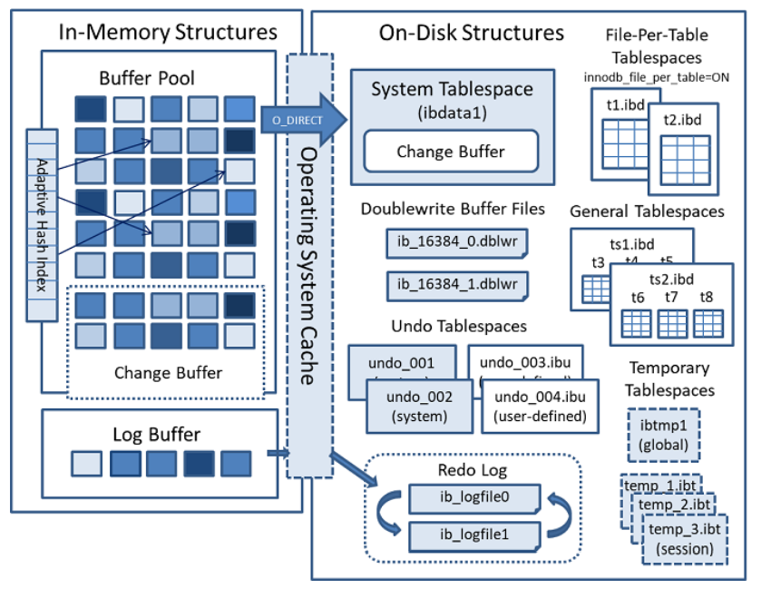

- MySQL 5.7 版本

  - 将 Undo 日志表空间从共享表空间 ibdata 文件中分离出来，可以在安装 MySQL 时由用户自行指定文件大小和数量。
  - 增加了 temporary 临时表空间，里面存储着临时表或临时查询结果集的数据。
  - Buffer Pool 大小可以动态修改，无需重启数据库实例。

- MySQL 8.0 版本 将 InnoDB 表的数据字典和 Undo 都从共享表空间 ibdata 中彻底分离出来了，以前需要 ibdata 中数据字典与独立表空间 ibd 文件中数据字典一致才行，8.0 版本就不需要了。 temporary 临时表空间也可以配置多个物理文件，而且均为 InnoDB 存储引擎并能创建索引，这样加快了处理的速度。 用户可以像 Oracle 数据库那样设置一些表空间，每个表空间对应多个物理文件，每个表空间可以给多个表使用，但一个表只能存储在一个表空间中。 将 Doublewrite Buffer 从共享表空间 ibdata 中也分离出来了。

# 2 InnoDB 线程模型

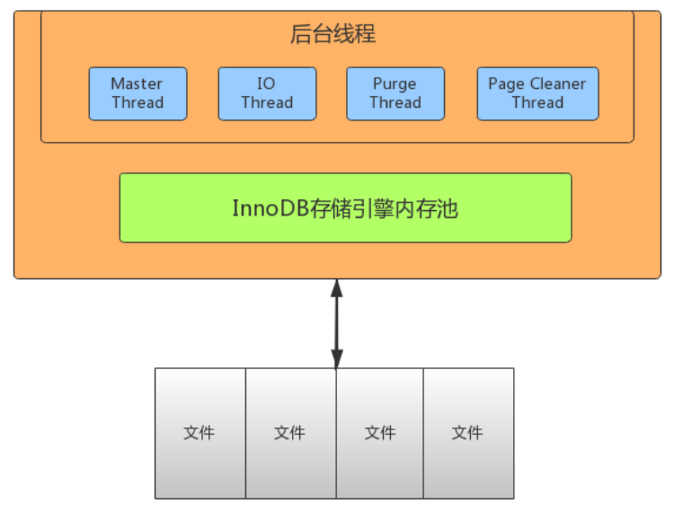

- IO Thread

  在 InnoDB 中使用了大量的 AIO（Async IO）来做读写处理，这样可以极大提高数据库的性能。在 InnoDB1.0 版本之前共有 4 个 IO Thread，分别是 write，read，insert buffer 和 log thread，后来版本将 read thread 和 write thread 分别增大到了 4 个，一共有 10 个了。

  - read thread ： 负责读取操作，将数据从磁盘加载到缓存 page 页。4 个
  - write thread：负责写操作，将缓存脏页刷新到磁盘。4 个
  - log thread：负责将日志缓冲区内容刷新到磁盘。1 个
  - insert buffer thread ：负责将写缓冲内容刷新到磁盘。1 个

- Purge Thread

  事务提交之后，其使用的 undo 日志将不再需要，因此需要 Purge Thread 回收已经分配的 undo 页。

  `show variables like '%innodb_purge_threads%'`

- Page Cleaner Thread

  作用是将脏数据刷新到磁盘，脏数据刷盘后相应的 redo log 也就可以覆盖，即可以同步数据，又能达到 redo log 循环使用的目的。会调用 write thread 线程处理。

  `show variables like '%innodb_page_cleaners%';`

- Master Thread

  Master thread 是 InnoDB 的主线程，负责调度其他各线程，优先级最高。作用是将缓冲池中的数据异步刷新到磁盘 ，保证数据的一致性。包含：脏页的刷新（page cleaner thread）、undo 页回收（purge thread）、redo 日志刷新（log thread）、合并写缓冲等。内部有两个主处理，分别是每隔 1 秒和 10 秒处理。

  每 1 秒的操作：

  - 刷新日志缓冲区，刷到磁盘
  - 合并写缓冲区数据，根据 IO 读写压力来决定是否操作
  - 刷新脏页数据到磁盘，根据脏页比例达到 75%才操作（innodb_max_dirty_pages_pct， innodb_io_capacity）

  每 10 秒的操作：

  - 刷新脏页数据到磁盘

  - 合并写缓冲区数据

  - 刷新日志缓冲区

  - 删除无用的 undo 页

# 3. InnoDB 数据文件

## 3.1、InnoDB 文件存储结构

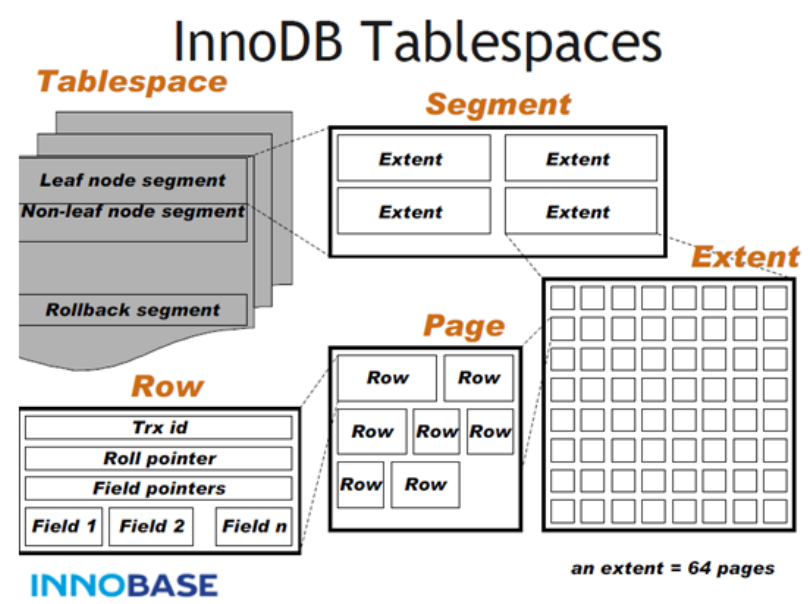

InnoDB 数据文件存储结构：

分为一个 ibd 数据文件-->Segment（段）-->Extent（区）-->Page（页）-->Row（行）

- Tablesapce

  表空间，用于存储多个 ibd 数据文件，用于存储表的记录和索引。一个文件包含多个段。

- Segment

  段，用于管理多个 Extent，分为数据段（Leaf node segment）、索引段（Non-leaf node segment）、回滚段（Rollback segment）。一个表至少会有两个 segment，一个管理数 据，一个管理索引。每多创建一个索引，会多两个 segment。

- Extent

  区，一个区固定包含 64 个连续的页，大小为 1M。当表空间不足，需要分配新的页资源，不会 一页一页分，直接分配一个区。

- Page

  页，用于存储多个 Row 行记录，大小为 16K。包含很多种页类型，比如数据页，undo 页，系 统页，事务数据页，大的 BLOB 对象页。

- Row

  行，包含了记录的字段值，事务 ID（Trx id）、滚动指针（Roll pointer）、字段指针（Field pointers）等信息。

Page 是文件最基本的单位，无论何种类型的 page，都是由 page header，page trailer 和 page body 组成。如下图所示，


## 3.2、InnoDB 文件存储格式

- 通过 SHOW TABLE STATUS 命令

  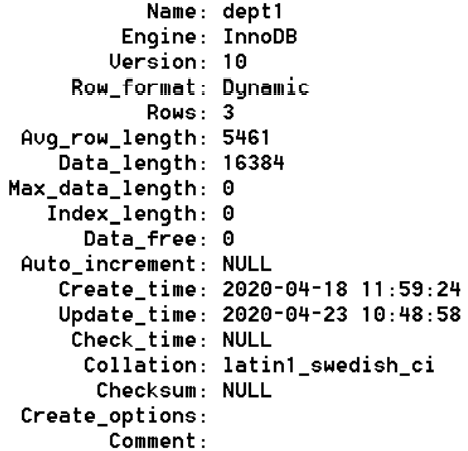

一般情况下，如果 row_format 为 REDUNDANT、COMPACT，文件格式为 Antelope；如果 row_format 为 DYNAMIC 和 COMPRESSED，文件格式为 Barracuda。

- 通过 information_schema 查看指定表的文件格式

  ```
  select * from information_schema.innodb_sys_tables;
  ```

## 3.3、File 文件格式（File-Format）

在早期的 InnoDB 版本中，文件格式只有一种，随着 InnoDB 引擎的发展，出现了新文件格式，用于 支持新的功能。目前 InnoDB 只支持两种文件格式：Antelope 和 Barracuda。

- Antelope: 先前未命名的，最原始的 InnoDB 文件格式，它支持两种行格式：COMPACT 和 REDUNDANT，MySQL 5.6 及其以前版本默认格式为 Antelope。
- Barracuda: 新的文件格式。它支持 InnoDB 的所有行格式，包括新的行格式：COMPRESSED 和 DYNAMIC。

通过 innodb_file_format 配置参数可以设置 InnoDB 文件格式，之前默认值为 Antelope，5.7 版本 开始改为 Barracuda。

## 3.4、Row 行格式（Row_format）

表的行格式决定了它的行是如何物理存储的，这反过来又会影响查询和 DML 操作的性能。如果在单个 page 页中容纳更多行，查询和索引查找可以更快地工作，缓冲池中所需的内存更少，写入更 新时所需的 I/O 更少。 InnoDB 存储引擎支持四种行格式：REDUNDANT、COMPACT、DYNAMIC 和 COMPRESSED。

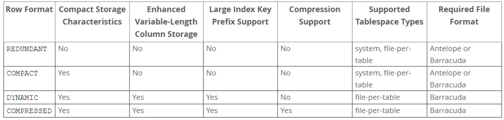

DYNAMIC 和 COMPRESSED 新格式引入的功能有：数据压缩、增强型长列数据的页外存储和大索引前缀。

每个表的数据分成若干页来存储，每个页中采用 B 树结构存储；

如果某些字段信息过长，无法存储在 B 树节点中，这时候会被单独分配空间，此时被称为溢出页， 该字段被称为页外列。

- REDUNDANT 行格式

  使用 REDUNDANT 行格式，表会将变长列值的前 768 字节存储在 B 树节点的索引记录中，其余的存储在溢出页上。对于大于等于 786 字节的固定长度字段 InnoDB 会转换为变长字段，以便能够在页外存储。

- COMPACT 行格式

  与 REDUNDANT 行格式相比，COMPACT 行格式减少了约 20%的行存储空间，但代价是增加了某些操作的 CPU 使用量。如果系统负载是受缓存命中率和磁盘速度限制，那么 COMPACT 格式可能更快。如果系统负载受到 CPU 速度的限制，那么 COMPACT 格式可能会慢一些。

- DYNAMIC 行格式

  使用 DYNAMIC 行格式，InnoDB 会将表中长可变长度的列值完全存储在页外，而索引记录只包含指向溢出页的 20 字节指针。大于或等于 768 字节的固定长度字段编码为可变长度字段。 DYNAMIC 行格式支持大索引前缀，最多可以为 3072 字节，可通过 innodb_large_prefix 参数控制。

- COMPRESSED 行格式

  COMPRESSED 行格式提供与 DYNAMIC 行格式相同的存储特性和功能，但增加了对表和索引数据压缩的支持。

在创建表和索引时，文件格式都被用于每个 InnoDB 表数据文件（其名称与\*.ibd 匹配）。修改文件 格式的方法是重新创建表及其索引，最简单方法是对要修改的每个表使用以下命令：

```
ALTER TABLE 表名 ROW_FORMAT=格式类型;
```

# 4. Undo Log

## 4.1 Undo Log 介绍

Undo：意为撤销或取消，以撤销操作为目的，返回指定某个状态的操作。

Undo Log：数据库事务开始之前，会将要修改的记录存放到 Undo 日志里，当事务**回滚时或者数据库崩溃**时，可以利用 Undo 日志，撤销未提交事务对数据库产生的影响。

Undo Log 产生和销毁：Undo Log 在事务开始前产生；事务在提交时，并不会立刻删除 undo log，innodb 会将该事务对应的 undo log 放入到删除列表中，后面会通过后台线程 purge thread 进行回收处理。

Undo Log 属于逻辑日志，记录一个变化过程。例如执行一个 delete，undolog 会记录一个 insert；执行一个 update，undolog 会记录一个相反的 update。

Undo Log 存储：undo log 采用段的方式管理和记录。在 innodb 数据文件中包含一种 rollback segment 回滚段，内部包含 1024 个 undo log segment。可以通过下面一组参数来控制 Undo log 存储。

```
show variables like '%innodb_undo%';
```

## 4.2 Undo Log 作用

- 实现事务的原子性

  Undo Log 是为了实现事务的原子性而出现的产物。事务处理过程中，如果出现了错误或者用户执行了 ROLLBACK 语句，MySQL 可以利用 Undo Log 中的备份将数据恢复到事务开始之前的状态。

- 实现多版本并发控制（MVCC）

  Undo Log 在 MySQL InnoDB 存储引擎中用来实现多版本并发控制。事务未提交之前，Undo Log 保存了未提交之前的版本数据，Undo Log 中的数据可作为数据旧版本快照供其他并发事务进行快照读。

  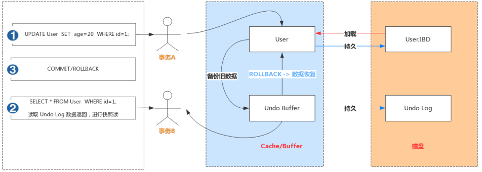

事务 A 手动开启事务，执行更新操作，首先会把更新命中的数据备份到 Undo Buffer 中。

事务 B 手动开启事务，执行查询操作，会读取 Undo 日志数据返回，进行快照读

# 5. Redo Log 和 Binlog

Redo Log 和 Binlog 是 MySQL 日志系统中非常重要的两种机制，也有很多相似之处，下面介绍下两者细节和区别。

## 5.1 Redo Log 日志

### Redo Log 介绍

Redo：顾名思义就是重做。以恢复操作为目的，在数据库发生意外时重现操作。

Redo Log：指事务中修改的任何数据，将最新的数据备份存储的位置（Redo Log），被称为重做日志。 Redo Log 的生成和释放：随着事务操作的执行，就会生成 Redo Log，在事务提交时会将产生 Redo Log 写入 Log Buffer，并不是随着事务的提交就立刻写入磁盘文件。等事务操作的脏页写入到磁盘之后，Redo Log 的使命也就完成了，Redo Log 占用的空间就可以重用（被覆盖写入）。

- **redo log 记录的是数据页上的修改。**
  > 有了 redo log 再修改数据时，InnoDB 引擎会把更新记录先写在 redo log 中，在修改 Buffer Pool 中的数据，当提交事务时，调用 fsync 把 redo log 刷入磁盘。至于缓存中更新的数据文件何时刷入磁盘，则由后台线程异步处理。
  > 注意：在事务里每修改一次就会写入 redo log。此时 redo log 的事务状态是 prepare，还未真正提交成功，要等 bin log 日志写入磁盘完成才会变更为 commit，事务才算真正提交完成。

### Redo Log 工作原理

Redo Log 是为了实现事务的持久性而出现的产物。防止在发生故障的时间点，尚有脏页未写入表 的 IBD 文件中，在重启 MySQL 服务的时候，根据 Redo Log 进行重做，从而达到事务的未入磁盘数据进行持久化这一特性。

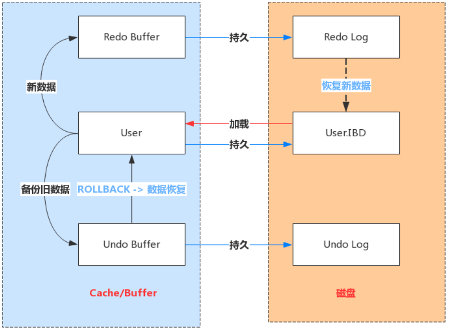

### Redo Log 写入机制

Redo Log 文件内容是以**顺序循环**的方式写入文件，写满时则回溯到第一个文件，进行覆盖写。

> Redo log 采用固定大小，顺序循环写入的格式，当 redo log 写满之后，重新从头开始如此循环写，形成一个环状。
> 那为什么要如此设计呢？
>
> > **因为 redo log 记录的是数据页上的修改，**如果 Buffer Pool 中数据页已经刷磁盘后，那这些记录就失效了，新日志会将这些失效的记录进行覆盖擦除。
> > 参考 [https://andyoung.blog.csdn.net/article/details/123896143](https://andyoung.blog.csdn.net/article/details/123896143)

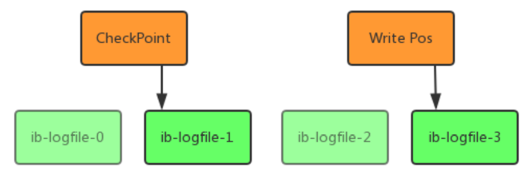

如图所示：

- write pos 是当前记录的位置，一边写一边后移，写到最后一个文件末尾后就回到 0 号文件开头；
- checkpoint 是当前要擦除的位置，也是往后推移并且循环的，擦除记录前要把记录更新到数据文件；checkpoint 是 更改的数据页落库，而不是 刷盘到 redo log 中（刷盘到 redo log 会有另外的策略）

write pos 和 checkpoint 之间还空着的部分，可以用来记录新的操作。如果 write pos 追上 checkpoint，表示写满，这时候不能再执行新的更新，得停下来先擦掉一些记录，把 checkpoint 推进一下。

### Redo Log 相关配置参数

每个 InnoDB 存储引擎至少有 1 个重做日志文件组（group），每个文件组至少有 2 个重做日志文 件，默认为 ib_logfile0 和 ib_logfile1。可以通过下面一组参数控制 Redo Log 存储：

```
show variables like '%innodb_log%';
```

Redo Buffer 持久化到 Redo Log 的策略，可通过 Innodb_flush_log_at_trx_commit 设置：

- 0：每秒提交 Redo buffer ->OS cache -> flush cache to disk，可能丢失一秒内的事务数 据。由后台 Master 线程每隔 1 秒执行一次操作。
- 1（默认值）：每次事务提交执行 Redo Buffer -> OS cache -> flush cache to disk，最安全，性能最差的方式。
- 2：每次事务提交执行 Redo Buffer -> OS cache，然后由后台 Master 线程再每隔 1 秒执行 OS cache -> flush cache to disk 的操作。

一般建议选择取值 2，因为 MySQL 挂了数据没有损失，整个服务器挂了才会损失 1 秒的事务提交数据。

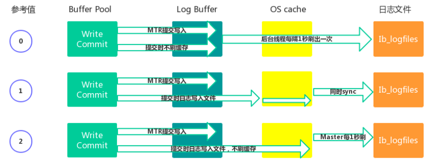

## 5.2 Binlog 日志

### Binlog 记录模式

Redo Log 是属于 InnoDB 引擎所特有的日志，而 MySQL Server 也有自己的日志，即 Binary log（二进制日志），简称 Binlog。Binlog 是记录所有数据库表结构变更以及表数据修改的二进制日志，不会记录 SELECT 和 SHOW 这类操作。Binlog 日志是以事件形式记录，还包含语句所执行的消耗时间。开启 Binlog 日志有以下两个最重要的使用场景。

- 主从复制：在主库中开启 Binlog 功能，这样主库就可以把 Binlog 传递给从库，从库拿到 Binlog 后实现数据恢复达到主从数据一致性。
- 数据恢复：通过 mysqlbinlog 工具来恢复数据。

Binlog 文件名默认为“主机名\_binlog-序列号”格式，例如 oak_binlog-000001，也可以在配置文件中指定名称。文件记录模式有 STATEMENT、ROW 和 MIXED 三种，具体含义如下。

- ROW（row-based replication, RBR）：日志中会记录每一行数据被修改的情况，然后在 slave 端对相同的数据进行修改。
  - 优点：能清楚记录每一个行数据的修改细节，能完全实现主从数据同步和数据的恢复。
  - 缺点：批量操作，会产生大量的日志，尤其是 alter table 会让日志暴涨。
- STATMENT（statement-based replication, SBR）：每一条被修改数据的 SQL 都会记录到 master 的 Binlog 中，slave 在复制的时候 SQL 进程会解析成和原来 master 端执行过的相同的 SQL 再次执行。简称 SQL 语句复制。
  - 优点：日志量小，减少磁盘 IO，提升存储和恢复速度
  - 缺点：在某些情况下会导致主从数据不一致，比如 last_insert_id()、now()等函数。
- MIXED（mixed-based replication, MBR）：以上两种模式的混合使用，一般会使用 STATEMENT 模式保存 binlog，对于 STATEMENT 模式无法复制的操作使用 ROW 模式保存 binlog，MySQL 会根据执行的 SQL 语句选择写入模式。

### Binlog 文件结构

MySQL 的 binlog 文件中记录的是对数据库的各种修改操作，用来表示修改操作的数据结构是 Log event。不同的修改操作对应的不同的 log event。比较常用的 log event 有：Query event、Row event、Xid event 等。binlog 文件的内容就是各种 Log event 的集合。

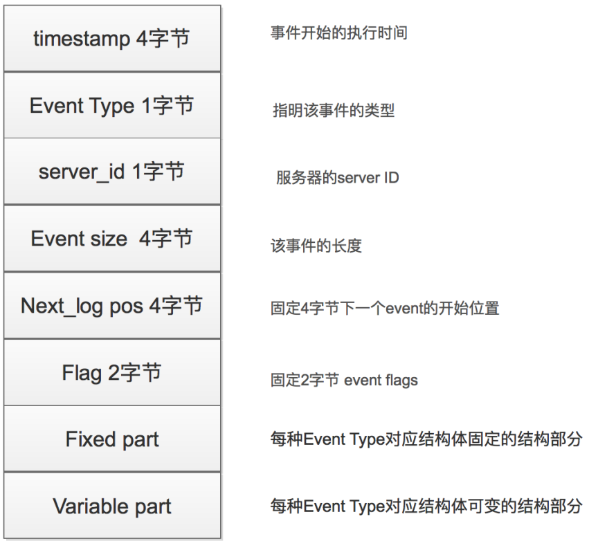

### Binlog 写入机制

- 根据记录模式和操作触发 event 事件生成 log event（事件触发执行机制）
- 将事务执行过程中产生 log event 写入缓冲区，每个事务线程都有一个缓冲区 Log Event 保存在一个 binlog_cache_mngr 数据结构中，在该结构中有两个缓冲区，一个是 stmt_cache，用于存放不支持事务的信息；另一个是 trx_cache，用于存放支持事务的信息。
- 事务在提交阶段会将产生的 log event 写入到外部 binlog 文件中。 不同事务以串行方式将 log event 写入 binlog 文件中，所以一个事务包含的 log event 信息在 binlog 文件中是连续的，中间不会插入其他事务的 log event。

### Binlog 文件操作

- Binlog 状态查看

  `show variables like 'log_bin';`

- 开启 Binlog 功能

  ```
  mysql> set global log_bin=mysqllogbin;
  ERROR 1238 (HY000): Variable 'log_bin' is a read only variable
  ```

  需要修改 my.cnf 或 my.ini 配置文件，在[mysqld]下面增加 log_bin=mysql_bin_log，重启 MySQL 服务。

  ```
  #log-bin=ON
  #log-bin-basename=mysqlbinlog
  server-id=1
  binlog-format=ROW
  log-bin=mysqlbinlog
  ```

- 使用 show binlog events 命令

  ```
  show binary logs; //等价于show master logs;
  show master status;
  show binlog events;
  show binlog events in 'mysqlbinlog.000001';
  ```

- 使用 mysqlbinlog 命令

  ```
  mysqlbinlog "文件名"
  mysqlbinlog "文件名" > "test.sql"
  ```

- 使用 binlog 恢复数据

  ```
  //按指定时间恢复
  mysqlbinlog --start-datetime="2020-04-25 18:00:00" --stop datetime="2020-04-26 00:00:00" mysqlbinlog.000002 | mysql -uroot -p1234
  //按事件位置号恢复
  mysqlbinlog --start-position=154 --stop-position=957 mysqlbinlog.000002
  | mysql -uroot -p1234
  ```

  mysqldump：定期全部备份数据库数据。mysqlbinlog 可以做增量备份和恢复操作。

- 删除 Binlog 文件

```
purge binary logs to 'mysqlbinlog.000001'; //删除指定文件
purge binary logs before '2020-04-28 00:00:00'; //删除指定时间之前的文件
reset master; //清除所有文件
```

可以通过设置**expire_logs_days**参数来启动自动清理功能。默认值为 0 表示没启用。设置为 1 表示超 出 1 天 binlog 文件会自动删除掉。

### Redo Log 和 Binlog 区别

- Redo Log 是属于 InnoDB 引擎功能，Binlog 是属于 MySQL Server 自带功能，并且是以二进制 文件记录。
- Redo Log 属于物理日志，记录该数据页更新状态内容，Binlog 是逻辑日志，记录更新过程。
- Redo Log 日志是**循环写**，日志空间大小是固定，Binlog 是追加写入，写完一个写下一个，不会覆盖使用。
- Redo Log 作为服务器异常宕机后事务数据自动恢复使用，Binlog 可以作为主从复制和数据恢复使用。Binlog 没有自动 crash-safe 能力。

# 6 InnoDB 和 MyISAM 对比

InnoDB 和 MyISAM 是使用 MySQL 时最常用的两种引擎类型，我们重点来看下两者区别。

- 事务和外键

  InnoDB 支持事务和外键，具有安全性和完整性，适合大量 insert 或 update 操作

  MyISAM 不支持事务和外键，它提供高速存储和检索，适合大量的 select 查询操作

- 锁机制

  InnoDB 支持行级锁，锁定指定记录。基于索引来加锁实现。

  MyISAM 支持表级锁，锁定整张表。

- 索引结构

  InnoDB 使用聚集索引（聚簇索引），索引和记录在一起存储，既缓存索引，也缓存记录。

  MyISAM 使用非聚集索引（非聚簇索引），索引和记录分开。

- 并发处理能力

  MyISAM 使用表锁，会导致写操作并发率低，读之间并不阻塞，读写阻塞。

  InnoDB 读写阻塞可以与隔离级别有关，可以采用多版本并发控制（MVCC）来支持高并发

- 存储文件

  InnoDB 表对应两个文件，一个.frm 表结构文件，一个.ibd 数据文件。InnoDB 表最大支持 64TB；

  MyISAM 表对应三个文件，一个.frm 表结构文件，一个 MYD 表数据文件，一个.MYI 索引文件。从 MySQL5.0 开始默认限制是 256TB。

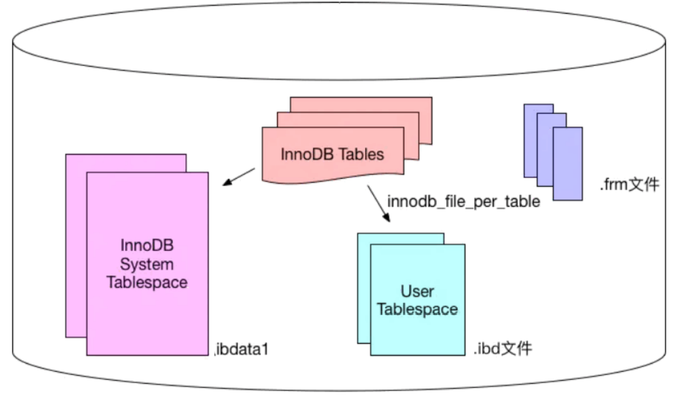

- 适用场景
  - MyISAM 不需要事务支持（不支持）
  - 并发相对较低（锁定机制问题）
  - 数据修改相对较少，以读为主
  - 数据一致性要求不高
- InnoDB
  - 需要事务支持（具有较好的事务特性）
  - 行级锁定对高并发有很好的适应能力
  - 数据更新较为频繁的场景
  - 数据一致性要求较高
  - 硬件设备内存较大，
  - 可以利用 InnoDB 较好的缓存能力来提高内存利用率，减少磁盘 IO
- 总结 两种引擎该如何选择？
  - 是否需要事务？有，InnoDB
  - 是否存在并发修改？有，InnoDB
  - 是否追求快速查询，且数据修改少？是，MyISAM
  - 在绝大多数情况下，推荐使用 InnoDB

# 参考

[MySQL 不会丢失数据的秘密，就藏在它的 7 种日志里](https://andyoung.blog.csdn.net/article/details/123896143)
[必须了解的 mysql 三大日志 binlog、redo log 和 undo log](https://andyoung.blog.csdn.net/article/details/123844120)
