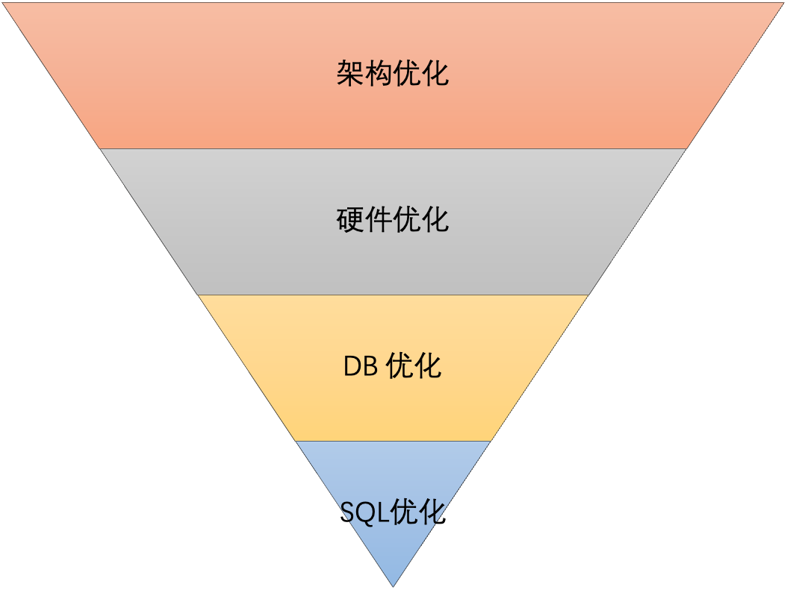

# mysql 优化步骤



正如上图所示，数据库优化可以从架构优化，硬件优化，DB 优化，SQL 优化四个维度入手。

此上而下，位置越靠前优化越明显，对数据库的性能提升越高。我们常说的 SQL 优化反而是对性能提高最小的优化。

> 业务优化
>
> - 查询跨度不能太大，限制三个月
> - 数据归档，只查询最近一年的数据，老数据去历史数据里查询
> - 导数数据，异步任务进行。

### 最后那，监控不能说少，即时报警，即时处理

接下来我们再看看每种优化该如何实施。

## 架构优化

一般来说在高并发的场景下对架构层进行优化其效果最为明显，常见的优化手段有：分布式缓存，读写分离，分库分表,主备切换等，每种优化手段又适用于不同的应用场景。

要点：

- 1. 读多，读写分离

- 2. 读多写少，加分布式缓存（redis）

- 3. 写多、海量数据：

  - 千万级数据（几个 G 数据）/ 或者一两个亿几十 G 数据 [分库分表](https://andyoung.blog.csdn.net/article/details/110823552)
  - 海量大数据（增量数据多），使用 hbase（不适合索引，要是用索引在 es 里面建立索引）等大数据数据库，
  - 查询麻烦使用 ETL 数据清洗
  - 在海量数据下支持事务，可以用分布式数据库，比如 TiDB。海量数据下支持复制 SQL 试试分析，可以使用 clickhouse，或者是 druid 之类的
  - mq 消峰

- 4. 复杂查询，es 全文索引

- 5. 高可用，主备切换

## 硬件优化

我们使用数据库，不管是读操作还是写操作，最终都是要访问磁盘，所以说磁盘的性能决定了数据库的性能。一块 PCIE 固态硬盘的性能是普通机械硬盘的几十倍不止。这里我们可以从**吞吐率**、**IOPS**两个维度看一下机械硬盘、普通固态硬盘、PCIE 固态硬盘之间的性能指标。

**吞吐率：单位时间内读写的数据量**

- 机械硬盘：约 100MB/s ～ 200MB/s
- 普通固态硬盘：200MB/s ～ 500MB/s
- PCIE 固态硬盘：900MB/s ～ 3GB/s

**IOPS：每秒 IO 操作的次数**

- 机械硬盘：100 ～ 200
- 普通固态硬盘：30000 ～ 50000
- PCIE 固态硬盘：数十万

通过上面的数据可以很直观的看到不同规格的硬盘之间的性能差距非常大。

不仅仅只有硬盘要优化，还有 CPU，内存，网络等，具体看哪个是瓶颈。

## DB 优化

SQL 执行慢有时候不一定完全是 SQL 问题，手动安装一台数据库而不做任何参数调整，再怎么优化 SQL 都无法让其性能最大化。要让一台数据库实例完全发挥其性能，首先我们就得先优化数据库的实例参数。

数据库实例参数优化遵循三句口诀：**日志不能小、缓存足够大、连接要够用。**

数据库事务提交后需要将事务对数据页的修改刷（ fsync）到磁盘上，才能保证数据的持久性。这个刷盘，是一个随机写，性能较低，如果每次事务提交都要刷盘，会极大影响数据库的性能。数据库在架构设计中都会采用如下两个优化手法：

- 先将事务写到日志文件 RedoLog（WAL），将随机写优化成顺序写
- 加一层缓存结构 Buffer，将单次写优化成顺序写

所以日志跟缓存对数据库实例尤其重要。而连接如果不够用，数据库会直接抛出异常，系统无法访问。

接下来我们以 Oracle、MySQL（InnoDB）、POSTGRES、达梦为例，看看每种数据库的参数该如何配置。

### Oracle

| 参数分类   | 参数名                            | 参数值           | 备注                        |
| ---------- | --------------------------------- | ---------------- | --------------------------- |
| 数据缓存   | SGA_TAGET、MEMORY_TARGET          | 物理内存 70-80%  | 越大越好                    |
| 数据缓存   | DB_CACHE_SIZE                     | 物理内存 70-80%  | 越大越好                    |
| SQL 解析   | SHARED_POOL_SIZE                  | 4-16G            | 不建议设置过大              |
| 监听及连接 | PROCESSES、SESSIONS、OPEN_CURSORS | 根据业务需求设置 | 一般为业务预估连接数的 120% |
| 其他       | SESSION_CACHED_CURSORS            | 大于 200         | 软软解析                    |

### MySQL

| 参数分类     | 参数名                            | 参数值           | 备注                 |
| ------------ | --------------------------------- | ---------------- | -------------------- |
| 数据缓存     | INNODB_BUFFER_POOL_SIZE           | 物理内存 50-80%  | 一般来说越大性能越好 |
| 日志相关     | Innodb_log_buffer_size            | 16-32M           | 根据运行情况调整     |
| 日志相关     | sync_binlog                       | 1、100、0        | 1 安全性最好         |
| 监听及连接   | max_connections                   | 根据业务情况调整 | 可以预留一部分值     |
| 文件读写性能 | innodb_flush_log_at_trx_commit    | 2                | 安全和性能的折中考虑 |
| 其他         | wait_timeout，interactive_timeout | 28800            | 避免应用连接定时中断 |

### POSTGRES

| 参数分类   | 参数名               | 参数值           | 备注                        |
| ---------- | -------------------- | ---------------- | --------------------------- |
| 数据缓存   | SHARED_BUFFERS       | 物理内存 10-25%  |                             |
| 数据缓存   | CACHE_BUFFER_SIZE    | 物理内存 50-60%  |                             |
| 日志相关   | wal_buffer           | 8-64M            | 不建议设置过大过小          |
| 监听及连接 | max_connections      | 根据业务情况调整 | 一般为业务预估连接数的 120% |
| 其他       | maintenance_work_mem | 512M 或更大      |                             |
| 其他       | work_mem             | 8-16M            | 原始配置 1M 过小            |
| 其他       | checkpoint_segments  | 32 或者更大      |                             |

### 达梦数据库

| 参数分类   | 参数名                     | 参数值           | 备注                        |
| ---------- | -------------------------- | ---------------- | --------------------------- |
| 数据缓存   | MEMROY_TARGET、MEMROY_POOL | 物理内存 90%     |                             |
| 数据缓存   | BUFFER                     | 物理内存 60%     | 数据缓存                    |
| 数据缓存   | MAX_BUFFER                 | 物理内存 70%     | 最大数据缓存                |
| 监听及连接 | max_sessions               | 根据业务需求设置 | 一般为业务预估连接数的 120% |

## SQL 优化

SQL 优化很容易理解，就是通过给查询字段添加索引或者改写 SQL 提高其执行效率，一般而言，SQL 编写有以下几个通用的技巧：

### 1. 查询慢 SQL 日志

```
mysql> SHOW VARIABLES LIKE 'slow_query%';
+---------------------+---------------------------------------------------------------------+
| Variable_name       | Value                                                               |
+---------------------+---------------------------------------------------------------------+
| slow_query_log      | OFF                                                                 |
| slow_query_log_file | C:\ProgramData\MySQL\MySQL Server 5.7\Data\LAPTOP-UHQ6V8KP-slow.log |
+---------------------+---------------------------------------------------------------------+
2 rows in set, 1 warning (0.02 sec)

mysql> SHOW VARIABLES LIKE 'long_query_time';
+-----------------+-----------+
| Variable_name   | Value     |
+-----------------+-----------+
| long_query_time | 10.000000 |
+-----------------+-----------+
1 row in set, 1 warning (0.01 sec)
```

参数说明如下：

- slow_query_log：慢查询开启状态
- slow_query_log_file：慢查询日志存放的位置（一般设置为 MySQL 的数据存放目录）
- long_query_time：查询超过多少秒才记录

###### 启动和设置慢查询日志

- 配置文件

```
[mysqld]
log-slow-queries=dir\filename
long_query_time=n
```

- sql

```
SET GLOBAL slow_query_log=ON/OFF;
SET GLOBAL long_query_time=n;
set global log_queries_not_using_indexes=on; 默认值为off 表示没有使用索引的sql查询也会记录下来
```

### 2.得到慢 SQL 进行慢 sql 分析

1. 使用 **explain** **分析 SQL 的执行计划**，是否索引失效

   - [https://andyoung.blog.csdn.net/article/details/122412683](https://andyoung.blog.csdn.net/article/details/122412683)
   - [sql 优化 5 大步骤+10 个案例，堪称 SQL 优化万能公式](https://andyoung.blog.csdn.net/article/details/123683536)
   - [聊聊 sql 优化的 15 个小技巧](https://andyoung.blog.csdn.net/article/details/121271976)

2. 以小表驱动大表

   - [详解 Mysql LEFT JOIN 和 JOIN 查询区别及原理](https://andyoung.blog.csdn.net/article/details/106993948)

   - [MySQL IN、Exist 关联查询时，我们为什么建议小表驱动大表？](https://blog.csdn.net/agonie201218/article/details/106882132)

3. 使用 UNION ALL 替代 UNION
4. 避免使用 NOT、!=、<>、!<、!>、NOT EXISTS、NOT IN、NOT LIKE。可以是话用 UNION 代替
5. 减少数据回表

   - [生动的解释下什么是 MySQL 的“回表”？](https://andyoung.blog.csdn.net/article/details/123846362)

6. 主键 id 优先自增，分布式使用 雪花 ID，或者 redis 自增，自增步长

7. 避免使用子查询，可以把子查询优化为 join 操作通常子查询在 in 子句中，且子查询中为简单 SQL(不包含 union、group by、order by、limit 从句) 时,才可以把子查询转化为关联查询进行优化。
   **子查询性能差的原因：** 子查询的结果集无法使用索引，通常子查询的结果集会被存储到**临时表**中，不论是内存临时表还是磁盘临时表都不会存在索引，所以查询性能会受到一定的影响。特别是对于返回结果集比较大的子查询，其对查询性能的影响也就越大。由于子查询会产生大量的临时表也没有索引，所以会消耗过多的 CPU 和 IO 资源，产生大量的慢查询。

### 3. 大事务优化

### 4. 深分页优化

## 小结

我们今天分别从架构优化、硬件优化、DB 优化、SQL 优化四个角度探讨了如何实施优化，提升数据库性能。但是大家还是要记住一句话，数据库系统没有银弹， 要让**适合**的系统，做**合适**的事情。

[MySQL 如何优化？ https://mp.weixin.qq.com/s/\_E6szZ0WFtCImYKUfygSMA](https://mp.weixin.qq.com/s/_E6szZ0WFtCImYKUfygSMA)
[完爆 90%的性能毛病，收好数据库优化八大通用绝招](https://mp.weixin.qq.com/s/ZjwTMvdCJSVGmLIpJJ5P5w)
