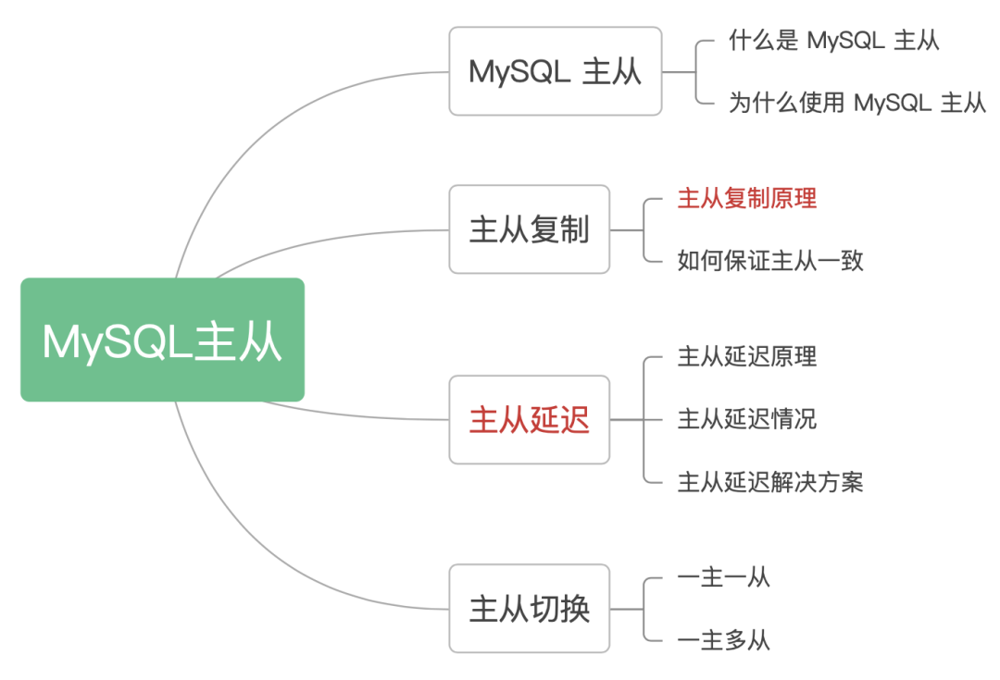
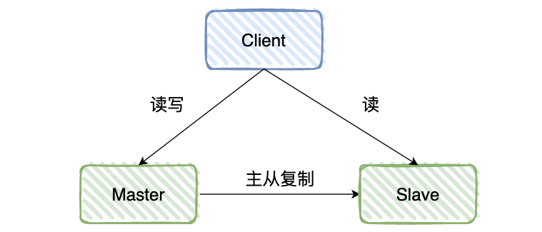
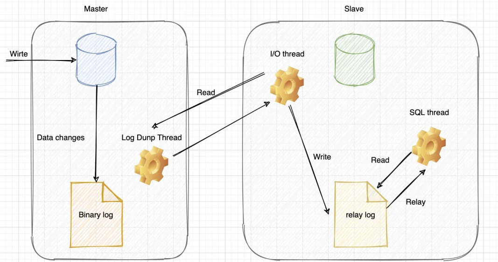
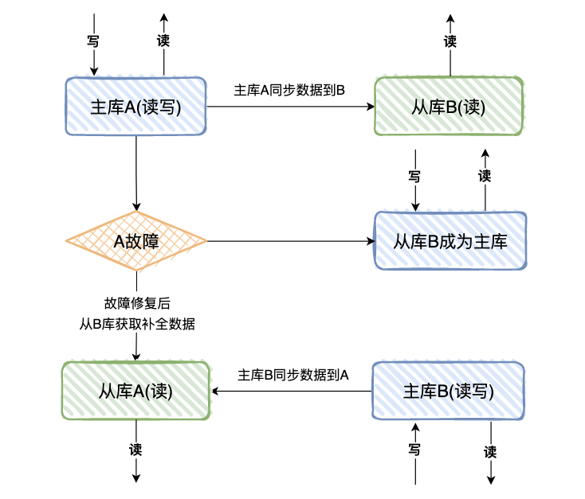
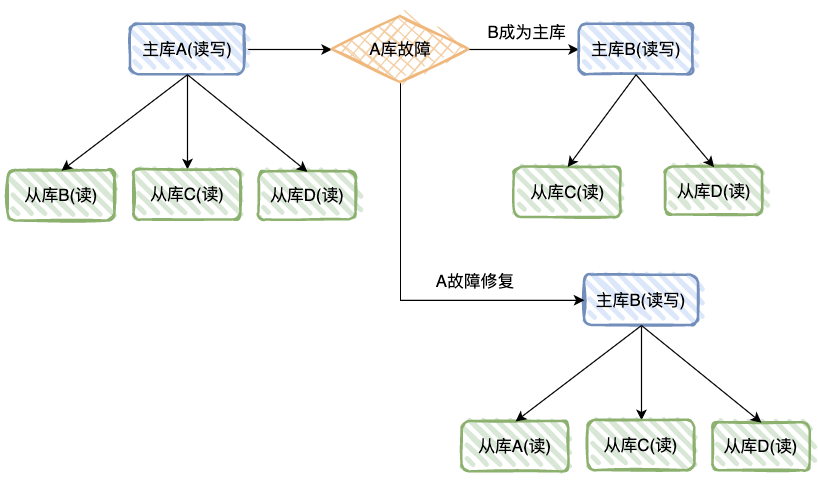

MySQL 主从一直是面试常客，里面的知识点虽然基础，但是能回答全的同学不多。

比如我之前面试小米，就被问到过主从复制的原理，以及主从延迟的解决方案，你之前面试，有遇到过哪些 MySQL 主从的问题呢？



# 1. MySQL 主从

### 1.1 什么是 MySQL 主从 ?

所谓 MySQL 主从，就是建立两个完全一样的数据库，一个是主库，一个是从库，**主库对外提供读写的操作，从库对外提供读的操作**。



### 1.2 为什么使用 MySQL 主从 ?

对于数据库单机部署，在 4 核 8G 的机器上运行 MySQL 5.7 时，大概可以支撑 500 的 TPS 和 10000 的 QPS，**当遇到一些活动时，查询流量骤然，就需要进行主从分离。**

大部分系统的访问模型是读多写少，读写请求量的差距可能达到几个数量级，所以我们可以通过一主多从的方式，**主库只负责写入和部分核心逻辑的查询，多个从库只负责查询，提升查询性能，降低主库压力。**

当主库宕机时，从库可以切成主库，保证服务的高可用，然后主库也可以做数据的容灾备份，整体场景总结如下：

- **读写分离**：从库提供查询，减少主库压力，提升性能；

- **高可用**：故障时可切换从库，保证服务高可用；

- **数据备份**：数据备份到从库，防止服务器宕机导致数据丢失。

# 2. 主从复制

### 2.1 主从复制原理

MySQL 的主从复制是依赖于 binlog，也就是记录 MySQL 上的所有变化并以二进制形式保存在磁盘上二进制日志文件。

主从复制就是将 binlog 中的数据从主库传输到从库上，一般这个过程是异步的，即主库上的操作不会等待 binlog 同步地完成。



详细流程如下：

1.  **主库写 binlog**：主库的更新 SQL(update、insert、delete) 被写到 binlog；

2.  **主库发送 binlog**：主库创建一个 log dump 线程来发送 binlog 给从库；

3.  **从库写 relay log**：从库在连接到主节点时会创建一个 IO 线程，以请求主库更新的 binlog，并且把接收到的 binlog 信息写入一个叫做 relay log 的日志文件；

4.  **从库回放**：从库还会创建一个 SQL 线程读取 relay log 中的内容，并且在从库中做回放，最终实现主从的一致性。

### 2.2 如何保证主从一致

当主库和从库数据同步时，突然中断怎么办？因为主库与从库之间维持了一个长链接，主库内部有一个线程，专门服务于从库的这个长链接。

对于下面的情况，假如主库执行如下 SQL，其中 a 和 create_time 都是索引：

```
delete from t where a > '666' and create_time<'2022-03-01' limit 1;
```

我们知道，数据选择了 a 索引和选择 create_time 索引，最后 limit 1 出来的数据一般是不一样的。

所以就会存在这种情况：在 binlog = statement 格式时，主库在执行这条 SQL 时，使用的是索引 a，而从库在执行这条 SQL 时，使用了索引 create_time，最后主从数据不一致了。

**那么我们该如何解决呢？**

可以把 binlog 格式修改为 row，row 格式的 binlog 日志记录的不是 SQL 原文，而是两个 event:Table_map 和 Delete_rows。

Table_map event 说明要操作的表，Delete_rows event 用于定义要删除的行为，记录删除的具体行数。**row 格式的 binlog 记录的就是要删除的主键 ID 信息，因此不会出现主从不一致的问题。**

但是如果 SQL 删除 10 万行数据，使用 row 格式就会很占空间，10 万条数据都在 binlog 里面，写 binlog 的时候也很耗 IO。但是 statement 格式的 binlog 可能会导致数据不一致。

设计 MySQL 的大叔想了一个折中的方案，mixed 格式的 binlog，其实就是 row 和 statement 格式混合使用，**当 MySQL 判断可能数据不一致时，就用 row 格式，否则使用就用 statement 格式。**

# 3. 主从延迟

有时候我们遇到从数据库中获取不到信息的诡异问题时，会纠结于代码中是否有一些逻辑会把之前写入的内容删除，但是你又会发现，过了一段时间再去查询时又可以读到数据了，这基本上就是主从延迟在作怪。

主从延迟，其实就是 “从库回放” 完成的时间，与 “主库写 binlog” 完成时间的差值，**会导致从库查询的数据，和主库的不一致**。

### 3.1 主从延迟原理

谈到 MySQL 数据库主从同步延迟原理，得从 MySQL 的主从复制原理说起：

- MySQL 的主从复制都是单线程的操作，主库对所有 DDL 和 DML 产生 binlog，binlog **是顺序写，所以效率很高**；

- Slave 的 Slave_IO_Running 线程会到主库取日志，放入 relay log，效率会比较高；

- Slave 的 Slave_SQL_Running 线程将主库的 DDL 和 DML 操作都在 Slave 实施，DML 和 DDL 的 IO 操作是随机的，不是顺序的，因此成本会很高，还可能是 Slave 上的其他查询产生 lock 争用，由于 Slave_SQL_Running 也是单线程的，所以一个 DDL 卡住了，需要执行 10 分钟，那么所有之后的 DDL 会等待这个 DDL 执行完才会继续执行，这就导致了延时。

**总结一下主从延迟的主要原因**：**主从延迟主要是出现在 “relay log 回放” 这一步**，当主库的 TPS 并发较高，产生的 DDL 数量超过从库一个 SQL 线程所能承受的范围，那么延时就产生了，当然还有就是可能与从库的大型 query 语句产生了锁等待。

### 3.2 主从延迟情况

- **从库机器性能**：从库机器比主库的机器性能差，只需选择主从库一样规格的机器就好。

- **从库压力大**：可以搞了一主多从的架构，还可以把 binlog 接入到 Hadoop 这类系统，让它们提供查询的能力。

- **从库过多**：要避免复制的从节点数量过多，**从库数据一般以 3-5 个为宜。**

- **大事务**：如果一个事务执行就要 10 分钟，那么主库执行完后，给到从库执行，最后这个事务可能就会导致从库延迟 10 分钟啦。日常开发中，不要一次性 delete 太多 SQL，需要分批进行，**另外大表的 DDL 语句，也会导致大事务。**

- **网络延迟**：优化网络，比如带宽 20M 升级到 100M。

- **MySQL 版本低**：低版本的 MySQL 只支持单线程复制，如果主库并发高，来不及传送到从库，就会导致延迟，可以换用更高版本的 MySQL，支持多线程复制。

### 3.3 主从延迟解决方案

我们一般会把从库落后的时间作为一个重点的数据库指标做监控和报警，正常的时间是在毫秒级别，一旦落后的时间达到了秒级别就需要告警了。

解决该问题的方法，除了缩短主从延迟的时间，还有一些其它的方法，基本原理都是尽量不查询从库，具体解决方案如下：

- **使用缓存**：我们在同步写数据库的同时，也把数据写到缓存，查询数据时，会先查询缓存，不过这种情况会带来 MySQL 和 Redis 数据一致性问题。

- **查询主库**：直接查询主库，这种情况会给主库太大压力，不建议这种方式。

- **数据冗余**：对于一些异步处理的场景，如果只扔数据 ID，消费数据时，需要查询从库，我们可以把数据全部都扔给消息队列，这样消费者就无需再查询从库。（这种情况应该不太能出现，数据转了一圈，MySQL 主从还没有同步好，直接去撕 DBA 吧）

在实际应用场景中，对于一些非常核心的场景，比如库存，支付订单等，需要直接查询主库，其它非核心场景，就不要去查主库了。

参考：

[MySQL 高级原理及优化第五篇：MySQL 集群架构](/pages/mysql-Cluster-architecture/)

# 4. 主从切换

---

### 4.1 一主一从

两台机器 A 和 B，A 为主库，负责读写，B 为从库，负责读数据。

如果 A 库发生故障，B 库成为主库负责读写，修复故障后，A 成为从库，主库 B 同步数据到从库 A。



- **优点**：从库支持读，分担了主库的压力，提升了并发度，且一个机器故障了可以自动切换，操作比较简单，公司从库还可以充当数据备份的角色；

- **缺点**：一台从库，并发支持还是不够，并且一共两台机器，还是存在同时故障的机率，不够高可用。

对于一主一从的模式，一般小公司会这么用，不过该模式下，主从分离的意义其实并不大，因为小公司的流量不高，更多是为了数据库的可用性，以及数据备份。

### 4.2 一主多从

一台主库多台从库，A 为主库，负责读写，B、C、D 为从库，负责读数据。

如果 A 库发生故障，B 库成为主库负责读写，C、D 负责读，修复故障后，A 也成为从库，主库 B 同步数据到从库 A。



- **优点**：多个从库支持读，分担了主库的压力，明显提升了读的并发度。

- **缺点**：只有一台主机写，因此写的并发度不高。

基本上大公司，比如百度、滴滴，都是这种一主多从的模式，因为查询流量太高，一定需要进行读写分离，同时也需要支持服务的高可用、数据容灾。
