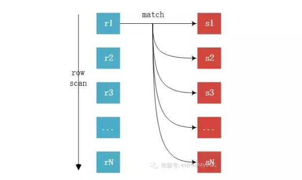
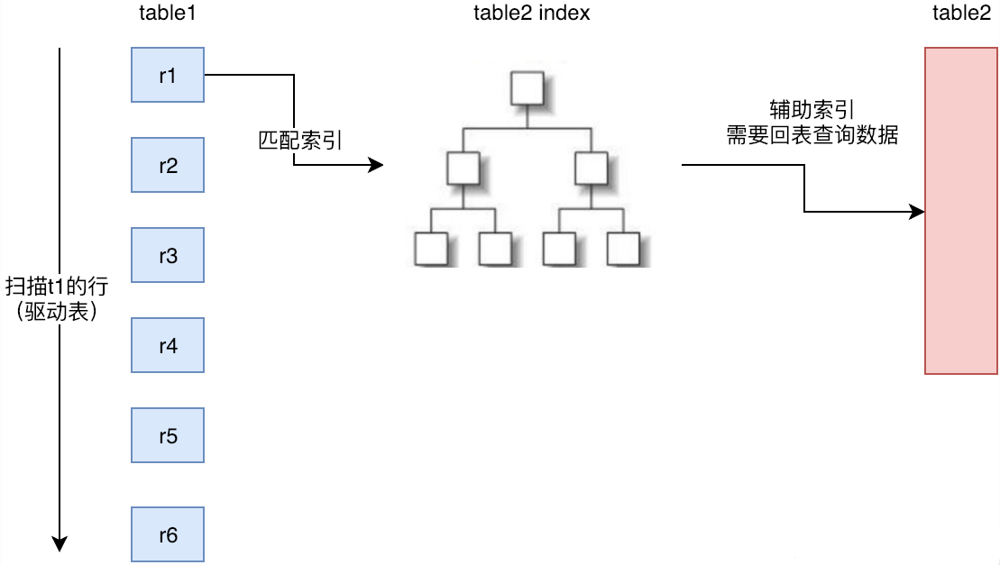
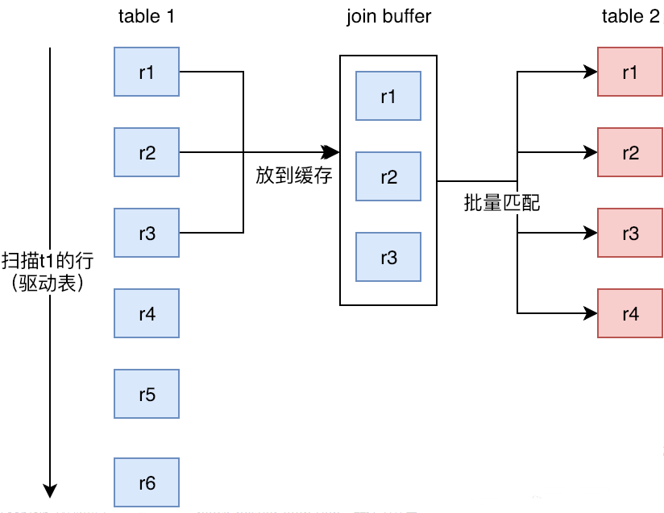
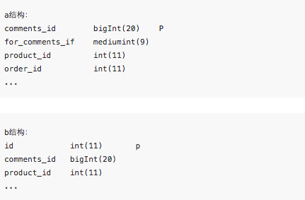
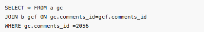
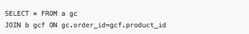
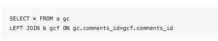
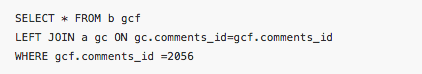
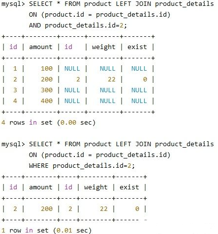

# 一、Join 查询原理

**查询原理：**MySQL 内部采用了一种叫做 nested loop join（嵌套循环连接）的算法。Nested Loop Join 实际上就是通过**驱动表的结果集作为循环基础数据**，然后一条一条的通过该结果集中的数据作为过滤条件到下一个表中查询数据，然后合并结果。如果还有第三个参与 Join，则再通过前两个表的 Join 结果集作为循环基础数据，再一次通过循环查询条件到第三个表中查询数据，如此往复，基本上 MySQL 采用的是最容易理解的算法来实现 join。所以驱动表的选择非常重要，驱动表的数据小可以显著降低扫描的行数。

一般情况下参与联合查询的两张表都会一大一小，如果是 join，在没有其他过滤条件的情况下**MySQL 会自动选择小表作为驱动表**。简单来说，驱动表就是主表，left join 中的左表就是驱动表，right join 中的右表是驱动表。

# 二、Nested-Loop Join

在 Mysql 中，使用 Nested-Loop Join 的算法思想去优化 join，Nested-Loop Join 翻译成中文则是“嵌套循环连接”。

举个例子：
`select * from t1 inner join t2 on t1.id=t2.tid`
（1）t1 称为外层表，也可称为驱动表。
（2）t2 称为内层表，也可称为被驱动表。

```
//伪代码表示：
List<Row> result = new ArrayList<>();
for(Row r1 in List<Row> t1){
	for(Row r2 in List<Row> t2){
		if(r1.id = r2.tid){
			result.add(r1.join(r2));
		}
	}
}
```

`mysql`只支持一种 join 算法：Nested-Loop Join（嵌套循环连接），但 Nested-Loop Join 有三种变种：

Simple Nested-Loop Join：SNLJ，简单嵌套循环连接
Index Nested-Loop Join：INLJ，索引嵌套循环连接
Block Nested-Loop Join：BNLJ，缓存块嵌套循环连接
在选择 Join 算法时，会有优先级，理论上会优先判断能否使用 INLJ、BNLJ：

> Index Nested-LoopJoin > Block Nested-Loop Join > Simple Nested-Loop Join

# 三、Simple Nested-Loop Join：

如下图，r 为驱动表，s 为匹配表，可以看到从 r 中分别取出 r1、r2、......、rn 去匹配 s 表的左右列，然后再合并数据，对 s 表进行了 rn 次访问，对数据库开销大。如果 table1 有 1 万条数据，table2 有 1 万条数据，那么数据比较的次数=1 万 \* 1 万 =1 亿次，这种查询效率会非常慢。



所以 Mysql 继续优化，然后衍生出 Index Nested-LoopJoin、Block Nested-Loop Join 两种 NLJ 算法。在执行 join 查询时 mysql 会根据情况选择两种之一进行 join 查询。

# 四、Index Nested-Loop Join（减少内层表数据的匹配次数）

1. 索引嵌套循环连接是**基于索引**进行连接的算法，索引是基于内层表的，通过外层表匹配条件直接与内层表索引进行匹配，避免和内层表的每条记录进行比较， 从而利用索引的查询减少了对内层表的匹配次数，优势极大的提升了 join 的性能：

   > 原来的匹配次数 = 外层表行数 _ 内层表行数
   > 优化后的匹配次数= 外层表的行数 _ 内层表索引的高度

2. 使用场景：**只有内层表 join 的列有索引时**，才能用到 Index Nested-LoopJoin 进行连接。
3. 由于用到索引，如果索引是辅助索引而且返回的数据还包括内层表的其他数据，则会回内层表查询数据，多了一些 IO 操作。

这个要求非驱动表（匹配表 s）上有索引，可以通过索引来减少比较，加速查询。

在查询时，驱动表（r）会根据关联字段的索引进行查找，当在索引上找到符合的值，再回表进行查询，也就是只有当匹配到索引以后才会进行回表查询。

如果非驱动表（s）的关联健是主键的话，性能会非常高，如果不是主键，要进行多次回表查询，先关联索引，然后根据二级索引的主键 ID 进行回表操作，性能上比索引是主键要慢。



# 五、Block Nested-Loop Join（减少内层表数据的循环次数）

1. 缓存块嵌套循环连接通过一次性缓存多条数据，把参与查询的列缓存到 Join Buffer 里，然后拿 join buffer 里的数据批量与内层表的数据进行匹配，从而减少了内层循环的次数（遍历一次内层表就可以批量匹配一次 Join Buffer 里面的外层表数据）。

2. 当不使用 Index Nested-Loop Join 的时候(内层表查询不适用索引)，默认使用 Block Nested-Loop Join。
3. 什么是 Join Buffer？
   （1）Join Buffer 会缓存所有参与查询的列而不是只有 Join 的列。
   （2）可以通过调整 join_buffer_size 缓存大小
   （3）join_buffer_size 的默认值是 256K，join_buffer_size 的最大值在 MySQL 5.1.22 版本前是 4G-1，而之后的版本才能在 64 位操作系统下申请大于 4G 的 Join Buffer 空间。
   （4）使用 Block Nested-Loop Join 算法需要开启优化器管理配置的 optimizer_switch 的设置 block_nested_loop 为 on，默认为开启。



# 六、如何优化 Join 速度

- **用小结果集驱动大结果集，减少外层循环的数据量：**
- 如果小结果集和大结果集连接的列都是索引列，mysql 在内连接时也会选择用小结果集驱动大结果集，因为索引查询的成本是比较固定的，这时候外层的循环越少，join 的速度便越快。
- 为匹配的条件增加索引：争取使用 INLJ，减少内层表的循环次数
- 增大 join buffer size 的大小：当使用 BNLJ 时，一次缓存的数据越多，那么外层表循环的次数就越少
  减少不必要的字段查询：
  （1）当用到 BNLJ 时，字段越少，join buffer 所缓存的数据就越多，外层表的循环次数就越少；
  （2）当用到 INLJ 时，如果可以不回表查询，即利用到覆盖索引，则可能可以提示速度。

# 七、实例：

假设两张表 a 和 b



其中 b 的关联有 comments_id，所以有索引。

1.join



使用的是 Index Nested-Loop Join，先对驱动表 a 的主键筛选，得到一条，然后对非驱动表 b 的索引进行 seek 匹配，预计得到一条数据。

下面这种情况没用到索引：



使用 Block Nested-Loop Join，如果 b 表数据少，作为驱动表，将 b 的需要的数据缓存到 join buffer 中，批量对 a 表扫描

2.left join：



这里用到了索引，所以会采用 Index Nested-Loop Join，因为没有筛选条件，会选择一张表作为驱动表去进行 join，去关联非驱动表的索引。

如果加了条件



就会从驱动表筛选出一条来进行对非驱动表的匹配。

> left join：会保全左表数据，如果右表没相关数据，会显示 null
> light join：会保全右表数据，如果左表没相关数据，会显示 null
> inner join：部分主从表，结果会取两个表针对 on 条件相匹配的最小集

# 八、使用原则

尽量使用 inner join,避免 left join 和 NULL。

# 九、on 和 where 的使用区别

首先要明确一点，where 中的条件拿到 on 里去出来的结果是不同的，如下：


ON 条件（“A LEFT JOIN B ON 条件表达式”中的 ON)用来决定如何从 B 表中检索数据行。如果 B 表中没有任何一行数据匹配 ON 的条件,将会额外生成一行所有列为 NULL 的数据,在匹配阶段 WHERE 子句的条件都不会被使用。仅在匹配阶段完成以后，WHERE 子句条件才会被使用。它将从匹配阶段产生的数据中检索过滤。

所以我们要注意：在使用 Left (right) join 的时候，**一定要在先给出尽可能多的匹配满足条件，减少 Where 的执行**。如：

```
select * from A
inner join B on B.name = A.name
left join C on C.name = B.name
left join D on D.id = C.id
where C.status>1 and D.status=1;
```

Great:

```
select * from A
inner join B on B.name = A.name
left join C on C.name = B.name and C.status>1
left join D on D.id = C.id and D.status=1
```

# 十、总结

### 一句话总结：

连表操作时：先根据查询条件和查询字段确定驱动表，确定驱动表之后就可以开始连表操作了，然后再在缓存结果中根据查询条件找符合条件的数据

### 1、找出所有在左表，不在右表的纪录？

我们可以用右表没有 on 匹配则显示 null 的规律, 来找出所有在左表，不在右表的纪录， 注意用来判断的那列必须声明为 not null 的。
如：`select id, name, action from user as u left join user_action a on u.id = a.user_id where a.user_id is NULL`
注意:

> 1.列值为 null 应该用 is null 而不能用=NULL 2.这里 a.user_id 列必须声明为 NOT NULL 的.

### 2、using()如何使用？

on a.c1 = b.c1 等同于 using(c1)

### 3、连表时候，INNER JOIN 和 , (逗号) 的关系是什么？

INNER JOIN 和 , (逗号) 在语义上是等同的

#### 参考

[https://blog.csdn.net/agonie201218/article/details/106887646](https://blog.csdn.net/agonie201218/article/details/106887646)
[https://blog.csdn.net/agonie201218/article/details/107026646](https://blog.csdn.net/agonie201218/article/details/107026646)
[https://blog.csdn.net/agonie201218/article/details/106882132](https://blog.csdn.net/agonie201218/article/details/106882132)
https://www.iteye.com/blog/luxuryzh-1976004
[MySQL 百万级、千万级数据多表关联 SQL 语句调优](https://blog.csdn.net/agonie201218/article/details/106887646)
