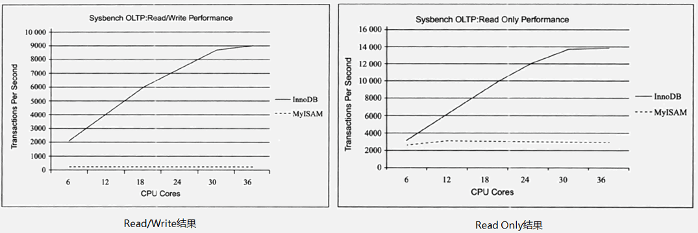
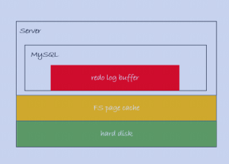
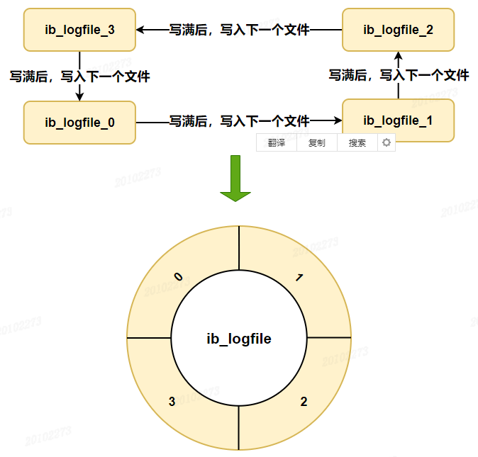
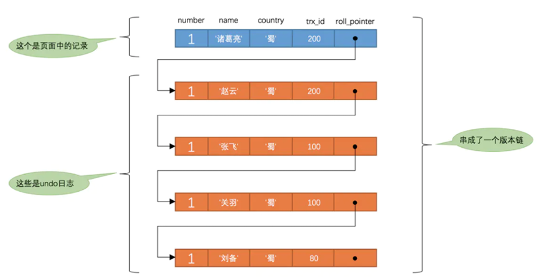
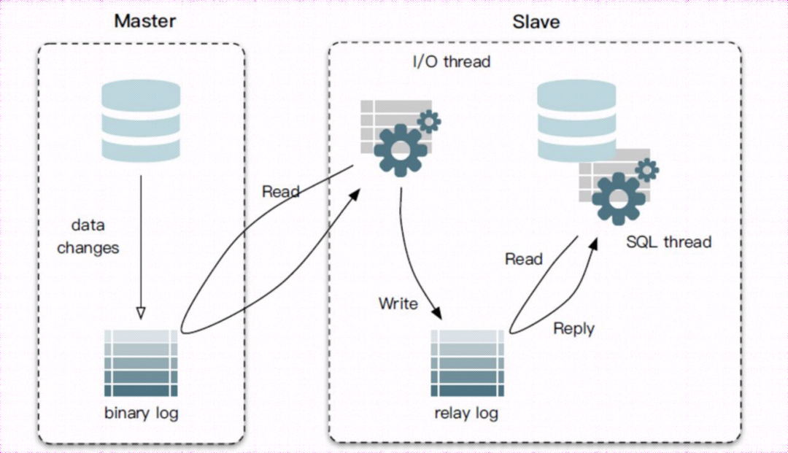
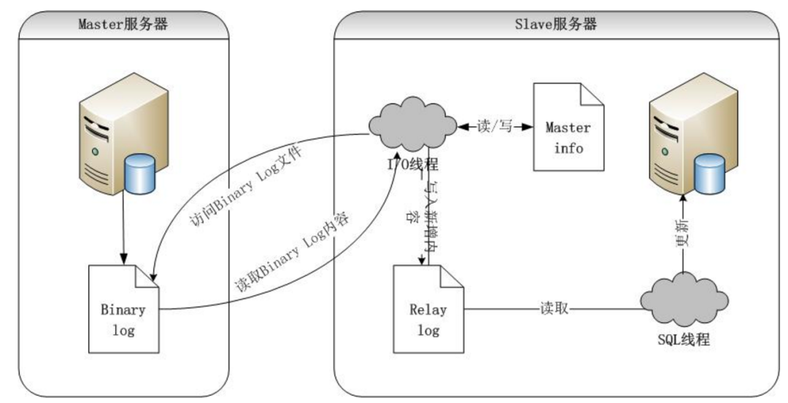

### 1、三大范式

**1NF(第一范式)**：属性（对应于表中的字段）不能再被分割，也就是这个字段只能是一个值，不能再分为多个其他的字段了。**1NF 是所有关系型数据库的最基本要求** ，也就是说关系型数据库中创建的表一定满足第一范式。

**2NF(第二范式)**：2NF 要求数据库表中的每个实例或行必须**可以被惟一地区分**，2NF 在 1NF 的基础上增加了一个列，这个列称为主键，非主属性都依赖于主键。

**3NF(第三范式)**：3NF 在 2NF 的基础之上，要求每列都和主键列直接相关，而不是间接相关，即不存在其他表的非主键信息。

在开发过程中，并不一定要满足三大范式，有时候为了提高查询效率，可以在表中冗余其他表的字段。

### 2、DML 语句和 DDL 语句区别

*   DML 是数据库操作语言（Data Manipulation Language）的缩写，是指对数据库中表记录的操作，主要包括表记录的插入、更新、删除和查询，是开发人员日常使用最频繁的操作。
    
*   DDL （Data Definition Language）是数据定义语言的缩写，简单来说，就是对数据库内部的对象进行创建、删除、修改的操作语言。它和 DML 语言的最大区别是 DML 只是对表内部数据的操作，而不涉及到表的定义、结构的修改，更不会涉及到其他对象。DDL 语句更多的被数据库管理员（DBA）所使用，一般的开发人员很少使用。
    

### 3、主键和外键的区别

*   **主键**：用于唯一标识一行数据，不能有重复，不允许为空，且一个表只能有一个主键；
    
*   **外键**：用来和其他表建立联系，外键是另一表的主键，外键是可以有重复的，可以是空值。一个表可以有多个外键；
    

### 4、drop、delete、truncate 区别

（1）用法不同

*   `drop`(丢弃数据): `drop table 表名` ，直接将表结构都删除掉，在删除表的时候使用。
    
*   `truncate` (清空数据) : `truncate table 表名` ，只删除表中的数据，再插入数据的时候自增长 id 又从 1 开始，在清空表中数据的时候使用。
    
*   `delete`（删除数据） : `delete from 表名 where 列名=值`，删除某一行的数据，如果不加 `where` 子句和`truncate table 表名`作用类似。

（2）属于不同的数据库语言

*   `truncate` 和 `drop` 属于 DDL(数据定义语言) 语句，操作立即生效，原数据不放到 rollback segment 中，不能回滚，操作不触发 trigger。
    
*   `delete` 语句是 DML (数据库操作语言) 语句，这个操作会放到 rollback segment 中，事务提交之后才生效。

（3）执行速度不同

*   `delete`命令执行的时候会产生数据库的`binlog`日志，而日志记录是需要消耗时间的，但是也有个好处方便数据回滚恢复。
    
*   `truncate`命令执行的时候不会产生数据库日志，因此比`delete`要快。除此之外，还会把表的自增值重置和索引恢复到初始大小等。
    
*   `drop`命令会把表占用的空间全部释放掉。
    

一般来说：`drop` > `truncate` > `delete`

### 5、基础架构

下图是 MySQL 的一个简要架构图，从下图你可以很清晰的看到客户端的一条 SQL 语句在 MySQL 内部是如何执行的。


*   **连接器：** 身份认证和权限相关 (登录 MySQL 的时候)。
    
*   **查询缓存：** 执行查询语句的时候，会先查询缓存（MySQL 8.0 版本后移除，因为这个功能不太实用）。
    
*   **分析器：** 没有命中缓存的话，SQL 语句就会经过分析器，分析器说白了就是要先看你的 SQL 语句要干嘛，再检查你的 SQL 语句语法是否正确。
    
*   **优化器：** 按照 MySQL 认为最优的方案去执行。
    
*   **执行器：** 执行语句，然后从存储引擎返回数据。执行语句之前会先判断是否有权限，如果没有权限的话，就会报错。
    
*   **插件式存储引擎**：主要负责数据的存储和读取，采用的是插件式架构，支持 InnoDB、MyISAM、Memory 等多种存储引擎。
    

### 6、MyISAM 和 InnoDB 有什么区别？

MySQL 5.5 之前，MyISAM 引擎是 MySQL 的默认存储引擎，MySQL 5.5 版本之后，InnoDB 是 MySQL 的默认存储引擎。

**（1）是否支持行级锁**

MyISAM 只有表级锁，而 InnoDB 支持行级锁和表级锁，默认为行级锁。

**（2）是否支持事务**

MyISAM 不提供事务支持，InnoDB 提供事务支持，实现了 SQL 标准定义的四个隔离级别，具有提交和回滚事务的能力。

InnoDB 默认使用的 REPEATABLE-READ（可重读）隔离级别是可以解决幻读问题发生的（基于 MVCC 和 Next-Key Lock）。

**（3）是否支持外键**

MyISAM 不支持，而 InnoDB 支持。

**（4）是否支持数据库异常崩溃后的安全恢复**

MyISAM 不支持，而 InnoDB 支持。使用 InnoDB 的数据库在异常崩溃后，数据库重新启动的时候会保证数据库恢复到崩溃前的状态。这个恢复的过程依赖于 `redo log` 。

**（5）是否支持 MVCC**

MyISAM 不支持，而 InnoDB 支持。

**（6）索引实现**

虽然 MyISAM 引擎和 InnoDB 引擎都是使用 B+Tree 作为索引结构，但是两者的实现方式不太一样。

*   InnoDB 引擎中，其数据文件本身就是索引文件。其表数据文件本身就是按 B+Tree 组织的一个索引结构，树的叶子节点 data 域保存了完整的数据记录。
    
*   MyISAM 索引文件和数据文件是分离的，索引保存的是数据文件的指针。
    

**（7）性能差别**

InnoDB 的性能比 MyISAM 更强大，不管是在读写混合模式下还是只读模式下，随着 CPU 核数的增加，InnoDB 的读写能力呈线性增长。MyISAM 因为读写不能并发，它的处理能力跟核数没关系。



InnoDB 和 MyISAM 性能对比

### 7、推荐自增 id 作为主键问题

*   普通索引的 B+ 树上存放的是主键索引的值，如果该值较大，会**「导致普通索引的存储空间较大」**
    
*   使用自增 id 做主键索引新插入数据只要放在该页的最尾端就可以，直接**「按照顺序插入」**，不用刻意维护
    
*   页分裂容易维护，当插入数据的当前页快满时，会发生页分裂的现象，如果主键索引不为自增 id，那么数据就可能从页的中间插入，页的数据会频繁的变动，**「导致页分裂维护成本较高」**
    

### 8、为什么 MySQL 的自增主键不连续

*   在 MySQL 5.7 及之前的版本，自增值保存在内存里，并没有持久化；
    
*   唯一键冲突：插入数据时先将自增主键 + 1，然后插入数据时唯一键冲突，插入数据失败，但是未将自增主键改回；
    
*   事务回滚：和唯一键冲突类似，回滚操作时自增值也不回退，事实上，这么做的主要原因是为了提高性能。
    

### 9、redo log 是做什么的?

`redo log`（重做日志）是`InnoDB`存储引擎独有的，它让`MySQL`拥有了崩溃恢复能力。

比如 `MySQL` 实例挂了或宕机了，重启时，`InnoDB`存储引擎会使用`redo log`恢复数据，保证数据的持久性与完整性。

更新表数据的时候，如果发现 `Buffer Pool` 里存在要更新的数据，就直接在 `Buffer Pool` 里更新。然后会把 “在某个数据页上做了什么修改” 记录到重做日志缓存（`redo log buffer`）里，接着刷盘到 `redo log` 文件里。

### 10、redo log 的刷盘时机



*   红色部分为 redo log buffer 属于内存
    
*   黄色部分为 page cache ，此时已经写入磁盘了，但是未进行持久化
    
*   绿色部分是硬盘，已经完成持久化
    

InnoDB 存储引擎为 redo log 的刷盘策略提供了 innodb_flush_log_at_trx_commit 参数，它支持**三种策略**

*   设置为 0 的时候，表示每次事务提交时**不进行刷盘**操作，只是保留在 redo log buffer 中，mysql 崩溃会丢失 1s 的数据；
    
*   设置为 1 的时候，表示每次事务提交时**都将进行**刷盘操作（默认值），持久化到磁盘；
    
*   设置为 2 的时候，表示每次事务提交时都只把 redo log buffer 内容写入 **page cache**，OS 宕机会丢失 1s 的数据，因为未进行持久化；
    

innodb_flush_log_at_trx_commit 参数默认为 1 ，也就是说当事务提交时会调用 fsync(同步操作) 对 redo log 进行刷盘。

另外 InnoDB 存储引擎有一个后台**线程**，每隔 1 秒，就会把 redo log buffer 中的内容写到文件系统缓存（page cache），然后调用 fsync 刷盘。

redo log buffer 占用的空间即将达到 innodb_log_buffer_size 一半的时候，后台线程会主动刷盘。

### 11、redo log 是怎么记录日志的

硬盘上存储的 `redo log` 日志文件不只一个，而是以一个**日志文件组**的形式出现的，每个的`redo`日志文件大小都是一样的。

比如可以配置为一组`4`个文件，每个文件的大小是 `1GB`，整个 `redo log` 日志文件组可以记录`4G`的内容。

它采用的是环形数组形式，从头开始写，写到末尾又回到头循环写，如下图所示。



所以，如果数据写满了但是还没有来得及将数据真正的刷入磁盘当中，那么就会发生**「内存抖动」**现象，从肉眼的角度来观察会发现 mysql 会宕机一会儿，此时就是正在刷盘了。

### 12、什么是 binlog

binlog 是归档日志，属于 Server 层的日志，是一个二进制格式的文件，记录内容是语句的原始逻辑，类似于 “给 ID=2 这一行的 c 字段加 1”。

不管用什么存储引擎，只要发生了表数据更新，都会产生 `binlog` 日志。它的主要作用就是数据备份、主从复制。

`binlog`会记录所有涉及更新数据的逻辑操作，属于逻辑日志，并且是顺序写。

### 13、binlog 记录格式

`binlog` 日志有三种格式，可以通过`binlog_format`参数指定。

*   **statement** ：记录的内容是`SQL`语句原文，存在数据一致性问题；
    
*   **row**：记录包含操作的具体数据，能保证同步数据的一致性；
    
*   **mixed**：记录的内容是前两者的混合，`MySQL`会判断这条`SQL`语句是否可能引起数据不一致：如果是，就用`row`格式，否则就用`statement`格式。
    

### 14、binlog 写入机制

事务执行过程中，先把日志写到`binlog cache`，事务提交的时候，再把`binlog cache`写到`binlog`文件中。

因为一个事务的`binlog`不能被拆开，无论这个事务多大，也要确保一次性写入，所以系统会给每个线程分配一个块内存作为`binlog cache`。

我们可以通过`binlog_cache_size`参数控制单个线程 binlog cache 大小，如果存储内容超过了这个参数，就要暂存到磁盘（`Swap`）。

binlog 也提供了 sync_binlog 参数来控制写入 page cache 和磁盘的时机：

*   0：每次提交事务都只写入到文件系统的 page cache，由系统自行判断什么时候执行`fsync`，机器宕机，`page cache`里面的 binlog 会丢失。
    
*   1：每次提交事务都会执行`fsync`，就如同 **redo log 日志刷盘流程** 一样。
    
*   N(N>1)：每次提交事务都写入到文件系统的 page cache，但累积`N`个事务后才`fsync`。如果机器宕机，会丢失最近`N`个事务的`binlog`日志。
    

### 15、redolog 和 binlog 的区别是什么

*   **redolog** 是 **Innodb** 独有的日志，而 **binlog** 是 **server** 层的，所有的存储引擎都有使用到；
    
*   **redolog** 记录了**具体的数值**，对某个页做了什么修改，**binlog** 记录的**操作内容**；
    
*   **binlog** 大小达到上限或者 flush log **会生成一个新的文件**，而 **redolog** 有固定大小**只能循环利用**；
    
*   **binlog 日志没有 crash-safe 的能力**，只能用于归档，而 redo log 有 crash-safe 能力；
    
*   **redo log** 在事务执行过程中可以不断写入（刷盘设置为 1，后台线程 1s 执行一次或者 redo log buffer 占用的空间即将达到 innodb_log_buffer_size 一半的时候），而 binlog 只有在提交事务时才写入文件缓存系统；
    

### 16、两阶段提交

假设执行 sql 过程中写完 redo log 日志后，binlog 日志写期间发生了异常，会出现什么情况呢？

由于 binlog 没写完就异常，这时候 binlog 里面没有对应的修改记录。因此，之后用 binlog 日志恢复数据时，就会少这一次更新，**最终数据不一致**。

为了解决两份日志之间的逻辑一致问题，InnoDB 存储引擎使用**两阶段提交**方案。

将 redo log 的写入拆成了两个步骤 prepare 和 commit，这就是两阶段提交。使用两阶段提交后，写入 binlog 时发生异常也不会有影响，因为 MySQL 根据 redo log 日志恢复数据时，发现 redo log 还处于 prepare 阶段，并且没有对应 binlog 日志，就会回滚该事务。

再看一个场景，redo log 设置 commit 阶段发生异常，那会不会回滚事务呢？

并不会回滚事务，虽然 redo log 是处于 prepare 阶段，但是能通过事务 id 找到对应的 binlog 日志，所以 MySQL 认为是完整的，就会提交事务恢复数据。

### 17、什么是 undo log.

我们知道如果想要**保证事务的原子性**，就需要在异常发生时，对已经执行的操作（INSERT、DELETE、UPDATE）进行回滚，在 MySQL 中，恢复机制是通过回滚日志（undo log） 实现的，所有事务进行的修改都会先记录到这个回滚日志中，然后再执行相关的操作。

每次对记录进行改动都会记录一条 undo log，每条 undo log 也都有一个`DB_ROLL_PTR`属性，可以将这些 undo log 都连起来，串成一个链表，形成版本链。

版本链的头节点就是当前记录最新的值。



### 18、什么是 relaylog

relaylog 是中继日志，**在主从同步的时候使用到**，它是一个中介临时的日志文件，用于存储从 master 节点同步过来的 binlog 日志内容。



master 主节点的 binlog 传到 slave 从节点后，被写入 relay log 里，从节点的 slave sql 线程从 relaylog 里读取日志然后应用到 slave 从节点本地。

从服务器 I/O 线程将主服务器的二进制日志读取过来记录到从服务器本地文件，然后 SQL 线程会读取 relay-log 日志的内容并应用到从服务器，从而**使从服务器和主服务器的数据保持一致**。

### 19、索引

索引其实是一种数据结构，能够帮助我们快速的检索数据库中的数据。

索引的作用就相当于书的目录。打个比方: 我们在查字典的时候，如果没有目录，那我们就只能一页一页的去找我们需要查的那个字，速度很慢。如果有目录了，我们只需要先去目录里查找字的位置，然后直接翻到那一页就行了。

### 20、Hash 索引

哈希表是键值对的集合，通过键 (key) 即可快速取出对应的值(value)，因此哈希表可以快速检索数据（接近 O（1））。

但是！哈希算法有个 Hash 冲突问题，也就是说多个不同的 key 最后得到的 index 相同。通常情况下，我们常用的解决办法是 **链地址法**。

链地址法就是将哈希冲突数据存放在链表中。就比如 JDK1.8 之前 HashMap 就是通过链地址法来解决哈希冲突的。不过，JDK1.8 以后 HashMap 为了减少链表过长的时候搜索时间过长引入了红黑树。

为了减少 Hash 冲突的发生，一个好的哈希函数应该 “均匀地” 将数据分布在整个可能的哈希值集合中。

**既然哈希表这么快，为什么 MySQL 没有使用其作为索引的数据结构呢？** 主要是因为 Hash 索引**不支持顺序和范围查询**。假如我们要对表中的数据进行排序或者进行范围查询，那 Hash 索引可就不行了，并且每次 IO 只能取一个。

### 21、B 树和 B+ 树

*   B 树的所有节点既存放键 (key) 也存放数据 (data)，而 B + 树只有叶子节点存放 key 和 data，其他内节点只存放 key。
    
*   B 树的叶子节点都是独立的；B + 树的叶子节点有一条引用链指向与它相邻的叶子节点。
    
*   B 树的检索的过程相当于对范围内的每个节点的关键字做二分查找，可能还没有到达叶子节点，检索就结束了。而 B + 树的检索效率就很稳定了，任何查找都是从根节点到叶子节点的过程，叶子节点的顺序检索很明显。
    

### 22、主键索引

数据表的主键列使用的就是主键索引，一种特殊的唯一索引。

在 MySQL 的 InnoDB 的表中，当没有显示的指定表的主键时，InnoDB 会自动先检查表中是否有唯一索引且不允许存在 null 值的字段，如果有，则选择该字段为默认的主键，否则 InnoDB 将会自动创建一个 6Byte 的自增主键。

### 23、二级索引

二级索引又称为辅助索引，是因为二级索引的叶子节点存储的数据是主键。也就是说，通过二级索引，可以定位主键的位置。

唯一索引，普通索引，前缀索引等索引属于二级索引。

*   唯一索引 (Unique Key) ：唯一索引也是一种约束。索引列的值必须唯一，但允许有空值；如果是**组合索引**，则列值的组合必须唯一。一张表允许创建多个唯一索引。建立唯一索引的目的大部分时候都是为了该属性列的**数据的唯一性，而不是为了查询效率**。
    
*   普通索引 (Index) ：普通索引的唯一作用就是为了快速查询数据，一张表允许创建多个普通索引，并允许数据重复和 NULL。
    
*   前缀索引 (Prefix) ：前缀索引只适用于**字符串**类型的数据。前缀索引是对**文本的前几个字符创建索引**，相比普通索引建立的数据更小， 因为只取前几个字符。
    
*   组合索引：指多个字段上创建的索引，只有在查询条件中使用了创建索引时的第一个字段，索引才会被使用。使用组合索引时遵循**最左前缀集合**（后文介绍）；
    
*   全文索引 (Full Text) ：全文索引主要是为了检索大文本数据中的关键字的信息，是目前搜索引擎数据库使用的一种技术。Mysql5.6 之前只有 MYISAM 引擎支持全文索引，5.6 之后 InnoDB 也支持了全文索引。
    

> MySQL 中的全文索引，有两个变量，**最小搜索长度和最大搜索长度**，对于长度小于最小搜索长度和大于最大搜索长度的词语，都不会被索引。

### 24、聚簇索引与非聚簇索引

聚簇索引即索引结构和数据一起存放的索引，并不是一种单独的索引类型。InnoDB 的主键索引的叶子节点中存放的就是数据行，所以它属于聚簇索引。

在 MySQL 中，InnoDB 引擎的表的 .ibd 文件就包含了该表的索引和数据，对于 InnoDB 引擎表来说，该表的索引 (B + 树) 的每个非叶子节点存储索引，叶子节点存储索引和索引对应的数据。

非聚簇索引即索引结构和数据分开存放的索引，并不是一种单独的索引类型。二级索引 (辅助索引) 就属于非聚簇索引。MySQL 的 MyISAM 引擎，不管主键还是非主键，使用的都是非聚簇索引。

辅助索引是我们人为创建的索引，它的叶子节点中存放的是主键，当我们通过辅助索引查找到主键之后，再通过查找的主键去**回表**查找主键索引。

### 25、回表

回表就是先通过数据库索引扫描出该索引树中数据所在的行，取到主键 id，再通过主键 id 取出主键索引数中的数据，即基于非主键索引的查询需要多扫描一棵索引树。

### 26、覆盖索引和联合索引

如果一个索引包含（或者说覆盖）所有需要查询的字段的值，我们就称之为 “覆盖索引”。指的是通过索引就能查询到我们所需要的数据，而不需要根据索引再去查询数据表中的数据（ 回表），这样就减少了数据库的 io 操作，提高查询效率。

使用表中的多个字段创建索引，就是联合索引，也叫组合索引或复合索引。

### 27、最左前缀匹配原则

最左前缀匹配原则指的是在使用联合索引时，MySQL 会根据联合索引中的字段顺序，从左到右依次到查询条件中去匹配，如果查询条件中存在与联合索引中最左侧字段相匹配的字段，则就会使用该字段过滤一批数据，**直至联合索引中全部字段匹配完成，或者在执行过程中遇到范围查询，如 >、<、between 和 以 % 开头的 like 查询 等条件，才会停止匹配。**

所以，我们在使用联合索引时，可以将区分度高的字段放在最左边，这也可以过滤更多数据。

### 28、索引下推

索引下推（Index Condition Pushdown） 是 MySQL 5.6 版本中提供的一项索引优化功能，可以在非聚簇索引遍历过程中，对索引中包含的字段先做判断，过滤掉不符合条件的记录，减少回表次数。

### 29、隐式转换

当操作符与不同类型的操作数一起使用时，会发生类型转换以使操作数兼容。某些转换是隐式发生的。例如，MySQL 会根据需要自动将字符串转换为数字，反之亦然。以下规则描述了比较操作的转换方式：

1.  两个参数至少有一个是 NULL 时，比较的结果也是 NULL，特殊的情况是使用 <=> 对两个 NULL 做比较时会返回 1，这两种情况都不需要做类型转换；
    
2.  两个参数都是字符串，会按照字符串来比较，不做类型转换；
    
3.  两个参数都是整数，按照整数来比较，不做类型转换；
    
4.  十六进制的值和非数字做比较时，会被当做二进制串；
    
5.  有一个参数是 TIMESTAMP 或 DATETIME，并且另外一个参数是常量，常量会被转换为 timestamp；
    
6.  有一个参数是 decimal 类型，如果另外一个参数是 decimal 或者整数，会将整数转换为 decimal 后进行比较，如果另外一个参数是浮点数，则会把 decimal 转换为浮点数进行比较；
    
7.  所有其他情况下，两个参数都会被转换为浮点数再进行比较；
    

### 30、普通索引和唯一索引该怎么选择?

* 查询


  *   当普通索引为条件时查询到数据会一直扫描，直到扫完整张表；
      


  *   当唯一索引为查询条件时，查到该数据会直接返回，不会继续扫表；
      


* 更新


  *   普通索引会直接将操作更新到 change buffer 中，然后结束
      


  *   唯一索引需要判断数据是否冲突
      


所以**唯一索引更加适合查询的场景，普通索引更适合插入的场景。**

### 31、避免索引失效

索引失效也是慢查询的主要原因之一，常见的导致索引失效的情况有下面这些：

*   使用 SELECT * 进行查询;
    
*   创建了组合索引，但查询条件未准守最左匹配原则;
    
*   在索引列上进行计算、函数、类型转换等操作;
    
*   以 % 开头的 LIKE 查询比如 like '%abc';
    
*   查询条件中使用 or，且 or 的前后条件中有一个列没有索引，涉及的索引都不会被使用到
    
*   match() 函数中的指定的列必须与全文索引中指定的列完全相同，否则会报错，无法使用全文索引。
    
*   全文索引时要注意搜索长度会导致索引失效
    

### 32、建立索引的规则

*   不为 NULL 的字段 ：索引字段的数据应该尽量不为 NULL，因为对于数据为 NULL 的字段，数据库较难优化。如果字段频繁被查询，但又避免不了为 NULL，建议使用 0,1,true,false 这样语义较为清晰的短值或短字符作为替代。
    
*   被频繁查询的字段 ：我们创建索引的字段应该是查询操作非常频繁的字段。
    
*   被作为条件查询的字段 ：被作为 WHERE 条件查询的字段，应该被考虑建立索引。
    
*   频繁需要排序的字段 ：索引已经排序，这样查询可以利用索引的排序，加快排序查询时间。
    
*   被经常频繁用于连接的字段 ：经常用于连接的字段可能是一些外键列，对于外键列并不一定要建立外键，只是说该列涉及到表与表的关系。对于频繁被连接查询的字段可以考虑建立索引，提高多表连接查询的效率。
    
*   被频繁更新的字段应该慎重建立索引；
    
*   尽可能的考虑建立联合索引而不是单列索引；
    
*   考虑在字符串类型的字段上使用前缀索引代替普通索引；
    
*   删除长期未使用的索引；
    

### 33、事务极其特性

一个事情由 n 个单元组成，这 n 个单元在执行过程中，要么同时成功，要么同时失败，这就把 n 个单元放在了一个事务之中。举个简单的例子：在不考虑试题正确与否的前提下，一张试卷由多个题目构成，当你答完题交给老师的时候是将一整张试卷交给老师，而不是将每道题单独交给老师，在这里试卷就可以理解成一个事务。

事务的特性：

*   A：原子性（`Atomicity`），原子性是指事务是一个不可分割的工作单位，事务中的操作，要么都发生，要么都不发生。
    
*   C：一致性（`Consistency`），在一个事务中，事务前后数据的完整性必须保持一致。
    
*   I：隔离性（`Isolation`），存在于多个事务中，事务的隔离性是指多个用户并发访问数据库时，一个用户的事务不能被其它用户的事务所干扰，多个并发事务之间数据要相互隔离。
    
*   D：持久性（`Durability`），持久性是指一个事务一旦被提交，它对数据库中数据的改变就是永久性的，接下来即使数据库发生故障也不应该对其有任何影响。
    

### 34、并发事务带来的问题

*   脏读（Dirty read）：B 事务读取到了 A 事务尚未提交的数据；
    
*   丢失修改（Lost to modify）：在一个事务读取一个数据时，另外一个事务也访问了该数据，那么在第一个事务中修改了这个数据后，第二个事务也修改了这个数据。这样第一个事务内的修改结果就被丢失，因此称为丢失修改。
    
*   不可重复读（Unrepeatable read）：B 事务读到了 A 事务已经提交的数据，即 B 事务在 A 事务提交之前和提交之后读取到的数据`内容`不一致（AB 事务操作的是同一条数据）；
    
*   幻读 / 虚读：B 事务读到了 A 事务已经提交的数据，即 A 事务执行插入操作，B 事务在 A 事务前后读到的数据`数量`不一致。
    

### 35、事务的隔离级别

为了解决以上隔离性引发的并发问题，数据库提供了事务的隔离机制。

*   read uncommitted（读未提交）: 一个事务还没提交时，它做的变更就能被别的事务看到，读取尚未提交的数据，哪个问题都不能解决；
    
*   read committed（读已提交）：一个事务提交之后，它做的变更才会被其他事务看到，读取已经提交的数据，可以解决脏读 ---- oracle 默认的；
    
*   repeatable read（可重复读）：一个事务执行过程中看到的数据，总是跟这个事务在启动时看到的数据是一致的，可以解决脏读和不可重复读 ---mysql 默认的；
    
*   serializable（串行化）：顾名思义是对于同一行记录，“写”会加 “写锁”，“读” 会加“读锁”。当出现读写锁冲突的时候，后访问的事务必须等前一个事务执行完成，才能继续执行。可以解决脏读、不可重复读和虚读 --- 相当于锁表。
    

虽然 serializable 级别可以解决所有的数据库并发问题，但是它会在读取的每一行数据上都加锁，这就可能导致大量的超时和锁竞争问题，从而导致效率下降。所以我们在实际应用中也很少使用 serializable，只有在非常需要确保数据的一致性而且可以接受没有并发的情况下，才考虑采用该级别。

### 36、MVCC

锁的粒度过大会导致性能的下降， MySQL 的 InnoDB 引擎下存在一种性能更优越的 MVCC 方法。

MVCC 是 `Multi-Version Concurremt Control` 的简称，**意思是基于多版本的并发控制协议，通过版本号避免同一数据在不同事务间的竞争**。它主要是为了提高数据库的并发读写性能，不用加锁就能让多个事务并发读写。

MVCC 的实现依赖于**隐藏列、Undo log、 Read View** 。

从上面对 SQL 标准定义了四个隔离级别的介绍可以看出，**标准的 SQL 隔离级别定义里，REPEATABLE-READ(可重复读) 是不可以防止幻读的**。

但是 InnoDB 实现的 REPEATABLE-READ 隔离级别其实是可以解决幻读问题发生的，主要有下面两种情况：

*   快照读 ：由 MVCC 机制来保证不出现幻读。
    
*   当前读 ：使用 Next-Key Lock（临键锁） 进行加锁来保证不出现幻读，Next-Key Lock 是行锁（Record Lock）和间隙锁（Gap Lock）的结合，行锁只能锁住已经存在的行，为了避免插入新行，需要依赖间隙锁。
    

> InnoDB 存储引擎在分布式事务的情况下一般会用到 SERIALIZABLE 隔离级别。

### 37、Mysql 中的锁

具体的锁详情请参考[此篇文章](/pages/mysql-Transactions-locks)：面试必备常见存储引擎与锁的分类，请查收

### 38、查询语句执行过程

```
select * from tb_student  s where s.age='18' and s.name=' 张三 ';
```

*   先检查该语句是否有权限，如果没有权限，直接返回错误信息，如果有权限，在 MySQL8.0 版本以前，会先查询缓存，以这条 SQL 语句为 key 在内存中查询是否有结果，如果有直接缓存，如果没有，执行下一步。
    
*   通过分析器进行词法分析，提取 SQL 语句的关键元素，比如提取上面这个语句是查询 select，提取需要查询的表名为 tb_student，需要查询所有的列，查询条件是这个表的 id='1'。然后判断这个 SQL 语句是否有语法错误，比如关键词是否正确等等，如果检查没问题就执行下一步。
    
*   接下来就是优化器进行确定执行方案，上面的 SQL 语句，可以有两种执行方案：
    
*   a. 先查询学生表中姓名为 “张三” 的学生，然后判断是否年龄是 18。
    
*   b. 先找出学生中年龄 18 岁的学生，然后再查询姓名为 “张三” 的学生。那么优化器根据自己的优化算法进行选择执行效率最好的一个方案（优化器认为，有时候不一定最好）。那么确认了执行计划后就准备开始执行了。
    
*   进行权限校验，如果没有权限就会返回错误信息，如果有权限就会调用数据库引擎接口，返回引擎的执行结果。
    

查询语句的执行流程如下：权限校验（如果命中缓存）---> 查询缓存 ---> 分析器 ---> 优化器 ---> 权限校验 ---> 执行器 ---> 引擎

### 39、更新语句执行过程

```
update tb_student A set A.age='19' where A.name=' 张三 ';
```

这条语句基本上也会沿着上一个查询的流程走，只不过执行更新的时候要记录日志，这就会引入日志模块了，MySQL 自带的日志模块是 binlog（归档日志） ，所有的存储引擎都可以使用，我们常用的 InnoDB 引擎还自带了一个日志模块 redo log（重做日志），我们就以 InnoDB 模式下来探讨这个语句的执行流程。

*   先查询到张三这一条数据，如果有缓存，也是会用到缓存。
    
*   然后拿到查询的语句把 age 改为 19，然后调用引擎 API 接口写入这一行数据，InnoDB 引擎把数据保存在内存中同时记录 redo log，此时 redo log **进入 prepare 状态**，然后告诉执行器执行完成了随时可以提交。
    
*   执行器收到通知后记录 binlog，然后调用引擎接口，**提交 redo log 为提交状态**。
    
*   更新完成。
    

更新语句执行流程如下：分析器 ----> 权限校验 ----> 执行器 ---> 引擎 ---redo log(prepare 状态)---> binlog --->redo log(commit 状态)

### 40、sql 优化

1.  应尽量避免全表扫描，首先应考虑在 where 及 order by 涉及的列上建立索引；
    
2.  应尽量避免在 where 子句中使用以下语句，否则将导致引擎放弃使用索引而进行全表扫描；
    

*   对字段进行 null 值判断，
    
*   使用!= 或 <>
    
*   or 来连接条件（使用 union all 代替）
    
*   in 和 not in 也要慎用
    
*   不要使用模糊查询（可用全文索引）
    
*   减少表达式操作
    
*   函数操作
    

4.  任何地方都不要使用 select * from t ，用具体的字段列表代替 “*”，不要返回用不到的任何字段；
    
5.  一个表的索引数最好不要超过 6 个，若太多则应考虑一些不常使用到的列上建的索引是否有必要；
    
6.  很多时候用 exists 代替 in 是一个好的选择；
    
7.  尽量减少多表联合查询；
    
8.  分页优化；
    
9.  正确使用索引；
    

### 41、主从同步数据



*   master 主库将此次更新的事件类型**写入到主库的 binlog 文件**中
    
*   master **创建 log dump 线程通知 slave** 需要更新数据
    
*   **slave** 向 master 节点发送请求，**将该 binlog 文件内容存到本地的 relaylog 中**
    
*   **slave 开启 sql 线程**读取 relaylog 中的内容，**将其中的内容在本地重新执行一遍**，完成主从数据同步

**同步策略**：

*   **全同步复制**：主库强制同步日志到从库，等全部从库执行完才返回客户端，性能差；
    
*   **半同步复制**：主库收到至少一个从库确认就认为操作成功，从库写入日志成功返回 ack 确认；
    

### 42、主从延迟要怎么解决

*   MySQL 5.6 版本以后，提供了一种**并行复制**的方式，通过将 SQL 线程转换为多个 work 线程来进行重放
    
*   **提高机器配置** (王道)
    
*   在业务初期就选择合适的分库、分表策略，**避免单表单库过大**带来额外的复制压力
    
*   **避免长事务**
    
*   **避免让数据库进行各种大量运算**
    
*   对于一些对延迟很敏感的业务**直接使用主库读**
    

### 43、为什么不要使用长事务

*   并发情况下，数据库**连接池容易被撑爆**
    
*   **容易造成大量的阻塞和锁超时**，长事务还占用锁资源，也可能拖垮整个库
    
*   执行时间长，容易造成**主从延迟**
    
*   **回滚所需要的时间比较长**，事务越长整个时间段内的事务也就越多
    
*   **undolog 日志越来越大**，长事务意味着系统里面会存在很老的事务视图。由于这些事务随时可能访问数据库里面的任何数据，所以这个事务提交之前，数据库里面它可能用到的回滚记录都必须保留，这就会导致大量占用存储空间。
