我们去面试的时候，经常被问到`netty`的题目。我整理了`netty`的`32`连问。小伙伴们，收藏起来慢慢看吧。

## 1. Netty 是什么，它的主要特点是什么？

`Netty`是一个高性能、异步事件驱动的网络编程框架，它基于`NIO`技术实现，提供了简单易用的 `API`，用于构建各种类型的网络应用程序。其主要特点包括：

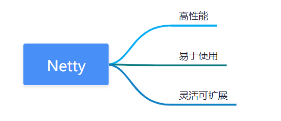

- 高性能：`Netty`使用异步`I/O`，非阻塞式处理方式，可处理大量并发连接，提高系统性能。
- 易于使用：`Netty`提供了高度抽象的`API`，可以快速构建各种类型的网络应用程序，如`Web`服务、消息推送、实时游戏等。
- 灵活可扩展：`Netty`提供了许多可插拔的组件，可以根据需要自由组合，以满足各种业务场景。

## 2. Netty 应用场景了解么？

`Netty` 在网络编程中应用非常广泛，常用于开发高性能、高吞吐量、低延迟的网络应用程序，应用场景如下：

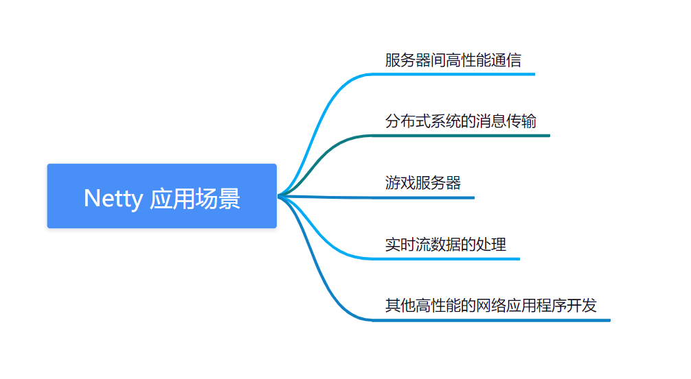

- 服务器间高性能通信，比如`RPC、HTTP、WebSocket`等协议的实现
- 分布式系统的消息传输，比如`Kafka、ActiveMQ`等消息队列
- 游戏服务器，支持高并发的游戏服务端开发
- 实时流数据的处理，比如音视频流处理、实时数据传输等
- 其他高性能的网络应用程序开发

**阿里分布式服务框架 Dubbo， 消息中间件 RocketMQ 都是使用 Netty 作为通讯的基础。**

## 3. Netty 核心组件有哪些？分别有什么作用？

Netty 的核心组件包括以下几个部分：

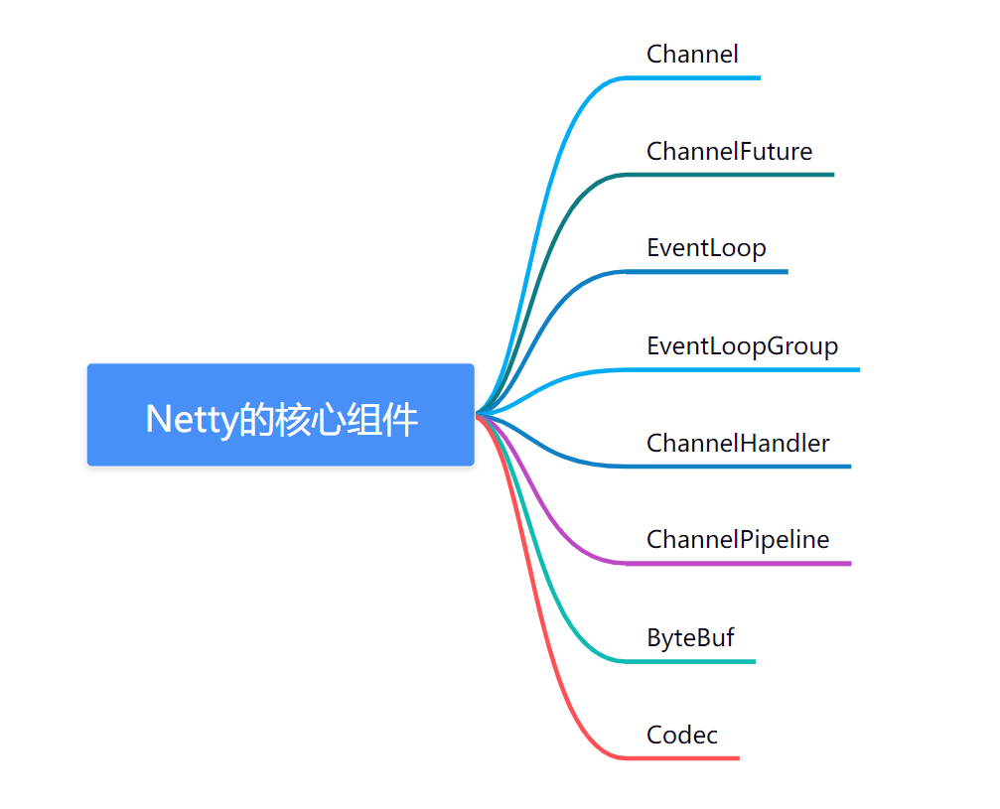

- Channel：用于网络通信的通道，可以理解为`Java NIO`中的`SocketChannel`。
- ChannelFuture：异步操作的结果，可以添加监听器以便在操作完成时得到通知。
- EventLoop：事件循环器，用于处理所有`I/O`事件和请求。`Netty`的`I/O`操作都是异步非阻塞的，它们由`EventLoop`处理并以事件的方式触发回调函数。
- EventLoopGroup：由一个或多个`EventLoop`组成的组，用于处理所有的`Channel`的`I/O`操作，可以将其看作是一个线程池。
- ChannelHandler：用于处理`Channel`上的`I/O`事件和请求，包括编码、解码、业务逻辑等，可以理解为`NIO`中的`ChannelHandler`。
- ChannelPipeline：由一组`ChannelHandler`组成的管道，用于处理`Channel`上的所有`I/O `事件和请求，`Netty`中的数据处理通常是通过将一个数据包装成一个`ByteBuf`对象，并且通过一个 `ChannelPipeline`来传递处理，以达到业务逻辑与网络通信的解耦。
- ByteBuf：`Netty`提供的字节容器，可以对字节进行高效操作，包括读写、查找等。
- Codec：用于在`ChannelPipeline`中进行数据编码和解码的组件，如字符串编解码器、对象序列化编解码器等。

这些核心组件共同构成了 Netty 的核心架构，可以帮助开发人员快速地实现高性能、高并发的网络应用程序。

## 4. Netty 的线程模型是怎样的？如何优化性能？

`Netty`的线程模型是基于事件驱动的`Reactor`模型，它使用少量的线程来处理大量的连接和数据传输，以提高性能和吞吐量。在`Netty`中，每个连接都分配了一个单独的`EventLoop`线程，该线程负责处理所有与该连接相关的事件，包括数据传输、握手和关闭等。多个连接可以共享同一个`EventLoop`线程，从而减少线程的创建和销毁开销，提高资源利用率。

为了进一步优化性能，`Netty`提供了一些线程模型和线程池配置选项，以适应不同的应用场景和性能要求。例如，可以使用不同的`EventLoopGroup`实现不同的线程模型，如**单线程模型、多线程模型和主从线程模型**等。同时，**还可以设置不同的线程池参数，如线程数、任务队列大小、线程优先级**等，以调整线程池的工作负载和性能表现。

在实际使用中，**还可以通过优化网络协议、数据结构、业务逻辑等方面来提高 Netty 的性能**。例如，可以使用零拷贝技术避免数据拷贝，使用内存池减少内存分配和回收的开销，避免使用阻塞 IO 和同步操作等，从而提高应用的吞吐量和性能表现。

## 5. EventloopGroup 了解么?和 EventLoop 啥关系?

`EventLoopGroup`和`EventLoop`是 `Netty` 中两个重要的组件。

`EventLoopGroup` 表示一组`EventLoop`，它们共同负责处理客户端连接的`I/O `事件。在 `Netty `中，通常会为不同的 `I/O` 操作创建不同的 `EventLoopGroup`。

`EventLoop` 是` Netty` 中的一个核心组件，它代表了一个不断循环的` I/O` 线程。它负责处理一个或多个 `Channel` 的 `I/O` 操作，包括数据的读取、写入和状态的更改。一个`EventLoop`可以处理多个` Channel`，而一个` Channel` 只会被一个 `EventLoop `所处理。

在 `Netty` 中，一个应用程序通常会创建两个` EventLoopGroup`：一个用于处理客户端连接，一个用于处理服务器端连接。当客户端连接到服务器时，服务器端的`EventLoopGroup`会将连接分配给一个` EventLoop` 进行处理，以便保证所有的` I/O` 操作都能得到及时、高效地处理。

## 6. Netty 的零拷贝了解么？

零拷贝`（Zero Copy）`是一种技术，可以避免在数据传输过程中对数据的多次拷贝操作，从而提高数据传输的效率和性能。在网络编程中，零拷贝技术可以减少数据在内核空间和用户空间之间的拷贝次数，从而提高数据传输效率和降低 `CPU` 的使用率。

`Netty `通过使用 `Direct Memory `和` FileChannel` 的方式实现零拷贝。当应用程序将数据写入 `Channel` 时，`Netty` 会将数据直接写入到内存缓冲区中，然后通过操作系统提供的 `sendfile` 或者` writev` 等零拷贝技术，将数据从内存缓冲区中传输到网络中，从而避免了中间的多次拷贝操作。同样，当应用程序从 `Channel` 中读取数据时，`Netty` 也会将数据直接读取到内存缓冲区中，然后通过零拷贝技术将数据从内存缓冲区传输到用户空间。

通过使用零拷贝技术，`Netty` 可以避免在数据传输过程中对数据进行多次的拷贝操作，从而提高数据传输的效率和性能。特别是在处理大量数据传输的场景中，零拷贝技术可以大幅度减少 `CPU `的使用率，降低系统的负载。

## 7. Netty 长连接、心跳机制了解么？

在网络编程中，长连接是指客户端与服务器之间建立的连接可以保持一段时间，以便在需要时可以快速地进行数据交换。与短连接相比，长连接可以避免频繁建立和关闭连接的开销，从而提高数据传输的效率和性能。

Netty 提供了一种长连接的实现方式，即通过 `Channel` 的 `keepalive` 选项来保持连接的状态。当启用了` keepalive` 选项后，客户端和服务器之间的连接将会自动保持一段时间，如果在这段时间内没有数据交换，客户端和服务器之间的连接将会被关闭。通过这种方式，可以实现长连接，避免频繁建立和关闭连接的开销。

除了 `keepalive` 选项之外，`Netty `还提供了一种**心跳机制**来保持连接的状态。心跳机制可以**通过定期向对方发送心跳消息，来检测连接是否正常**。如果在一段时间内没有收到心跳消息，就认为连接已经断开，并进行重新连接。`Netty` 提供了一个` IdleStateHandler` 类，可以用来实现心跳机制。`IdleStateHandler `可以设置多个超时时间，当连接空闲时间超过设定的时间时，会触发一个事件，可以在事件处理方法中进行相应的处理，比如发送心跳消息。

**通过使用长连接和心跳机制，可以保证客户端与服务器之间的连接处于正常的状态，从而提高数据传输的效率和性**能。特别是在处理大量数据传输的场景中，长连接和心跳机制可以降低建立和关闭连接的开销，减少网络负载，提高系统的稳定性。

## 8. Netty 服务端和客户端的启动过程了解么？

`Netty` 是一个基于` NIO` 的异步事件驱动框架，它的服务端和客户端的启动过程大致相同，都需要完成以下几个步骤：

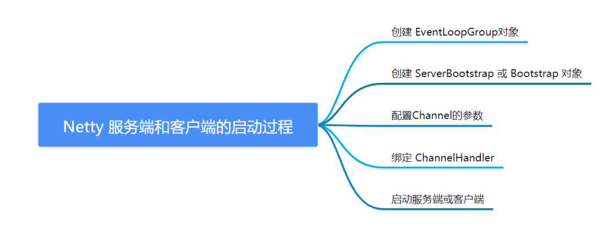

1. 创建 `EventLoopGroup` 对象。`EventLoopGroup` 是`Netty`的核心组件之一，它用于管理和调度事件的处理。`Netty `通过`EventLoopGroup`来创建多个`EventLoop`对象，并将每个 `EventLoop` 与一个线程绑定。在服务端中，一般会创建两个 `EventLoopGroup `对象，分别用于接收客户端的连接请求和处理客户端的数据。
2. 创建 `ServerBootstrap `或 `Bootstrap` 对象。`ServerBootstrap 和 Bootstrap `是 `Netty` 提供的服务端和客户端启动器，它们封装了启动过程中的各种参数和配置，方便使用者进行设置。在创建 `ServerBootstrap` 或 `Bootstrap `对象时，需要指定相应的 `EventLoopGroup` 对象，并进行一些基本的配置，比如传输协议、端口号、处理器等。
3. 配置`Channel`的参数。`Channel` 是`Netty`中的一个抽象概念，它代表了一个网络连接。在启动过程中，需要对 `Channel `的一些参数进行配置，比如传输协议、缓冲区大小、心跳检测等。
4. 绑定 `ChannelHandler。ChannelHandler` 是 `Netty` 中用于处理事件的组件，它可以处理客户端的连接请求、接收客户端的数据、发送数据给客户端等。在启动过程中，需要将 `ChannelHandler `绑定到相应的 `Channel `上，以便处理相应的事件。
5. 启动服务端或客户端。在完成以上配置后，就可以启动服务端或客户端了。在启动过程中，会创建相应的` Channel`，并对其进行一些基本的初始化，比如注册监听器、绑定端口等。启动完成后，就可以开始接收客户端的请求或向服务器发送数据了。

总的来说，`Netty` 的服务端和客户端启动过程比较简单，只需要进行一些基本的配置和设置，就可以完成相应的功能。通过使用 `Netty`，可以方便地开发高性能、高可靠性的网络应用程序。

## 9. Netty 的 Channel 和 EventLoop 之间的关系是什么？

在`Netty`中，`Channel`代表一个开放的网络连接，它可以用来读取和写入数据。而`EventLoop`则代表一个执行任务的线程，它负责处理`Channel`上的所有事件和操作。

每个`Channel`都与一个`EventLoop`关联，而一个`EventLoop`可以关联多个`Channel`。当一个`Channel`上有事件发生时，**比如数据可读或者可写**，它会将该事件提交给关联的`EventLoop`来处理。`EventLoop`会将该事件加入到它自己的任务队列中，然后按照顺序处理队列中的任务。

值得注意的是，一个`EventLoop`实例可能会被多个`Channel`所共享，因此它需要能够处理多个`Channel`上的事件，并确保在处理每个`Channel`的事件时不会被阻塞。为此，Netty 采用了事件循环（`EventLoop`）模型，它通过异步 I/O 和事件驱动的方式，实现了高效、可扩展的网络编程。

## 10. 什么是 Netty 的 ChannelPipeline，它是如何工作的？

在`Netty`中，每个`Channel`都有一个与之关联的`ChannelPipeline`，用于处理该`Channel`上的事件和请求。`ChannelPipeline`是一种基于事件驱动的处理机制，它由多个处理器（`Handler`）组成，每个处理器负责处理一个或多个事件类型，将事件转换为下一个处理器所需的数据格式。

当一个事件被触发时，它将从`ChannelPipeline`的第一个处理器（称为第一个`InboundHandler`）开始流经所有的处理器，直到到达最后一个处理器或者被中途拦截（通过抛出异常或调用`ChannelHandlerContext.fireXXX()`方法实现）。在这个过程中，每个处理器都可以对事件进行处理，也可以修改事件的传递方式，比如在处理完事件后将其转发到下一个处理器，或者直接将事件发送回到该`Channel`的对端。

`ChannelPipeline`的工作方式可以用以下三个概念来描述：

- 入站（`Inbound`）事件：由`Channel`接收到的事件，例如读取到新的数据、连接建立完成等等。入站事件将从`ChannelPipeline`的第一个`InboundHandler`开始流动，直到最后一个`InboundHandler`。
- 出站（`Outbound`）事件：由`Channel`发送出去的事件，例如向对端发送数据、关闭连接等等。出站事件将从`ChannelPipeline`的最后一个`OutboundHandler`开始流动，直到第一个`OutboundHandler`。
- `ChannelHandlerContext`：表示处理器和`ChannelPipeline`之间的关联关系。每个`ChannelHandler`都有一个`ChannelHandlerContext`，通过该对象可以实现在`ChannelPipeline`中的事件流中向前或向后传递事件，也可以通过该对象访问`Channel、ChannelPipeline和其他ChannelHandler`等。

通过使用 ChannelPipeline，Netty 实现了高度可配置和可扩展的网络通信模型，使得开发人员可以根据自己的需求选择和组合不同的处理器，以构建出高效、稳定、安全的网络通信系统。

## 11. Netty 中的 ByteBuf 是什么，它和 Java 的 ByteBuffer 有什么区别？

`Netty` 的` ByteBuf` 是一个可扩展的字节容器，它提供了许多高级的 `API`，用于方便地处理字节数据。`ByteBuf `与 `Java NIO` 的 `ByteBuffer` 相比，有以下区别：

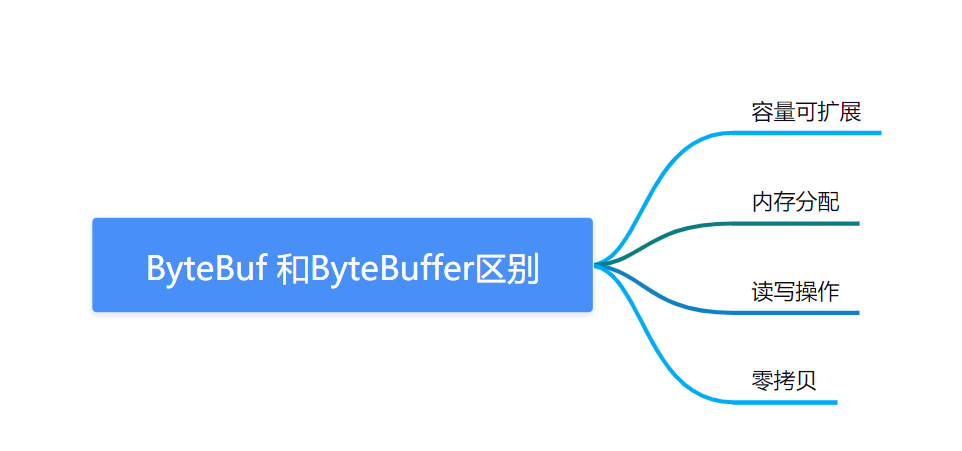

- 容量可扩展：`ByteBuf`的容量可以动态扩展，而 `ByteBuffer` 的容量是固定的。
- 内存分配：`ByteBuf `内部采用了内存池的方式，可以有效地减少内存分配和释放的开销。
- 读写操作：`ByteBuf `提供了多个读写指针，可以方便地读写字节数据。
- 零拷贝：`ByteBuf` 支持零拷贝技术，可以减少数据复制的次数。

```
ByteBuf buffer = Unpooled.buffer(10);
buffer.writeBytes("hello".getBytes());

while (buffer.isReadable()) {
  System.out.print((char) buffer.readByte());
}
```

在上面的示例代码中，我们使用 `Unpooled.buffer()` 方法创建了一个`ByteBuf`对象 `buffer`，并使用 `writeBytes()` 方法将字符串 `"hello" `写入该对象。然后，我们通过 `isReadable() `方法判断该对象是否可读，使用 `readByte()` 方法读取其中的字节数据，并将其转换为字符输出。

## 12. Netty 中的 ChannelHandlerContext 是什么，它的作用是什么？

在`Netty`中，`ChannelHandlerContext`表示连接到`ChannelPipeline`中的一个`Handler`上下文。在`Netty的IO`事件模型中，`ChannelHandlerContext`充当了处理`I/O`事件的处理器和`ChannelPipeline`之间的桥梁，使处理器能够相互交互并访问`ChannelPipeline`中的其他处理器。

每当`ChannelPipeline`中添加一个`Handler`时，`Netty`会创建一个`ChannelHandlerContext`对象，并将其与该`Handler`关联。这个对象包含了该`Handler`的相关信息，如所在的`ChannelPipeline`、所属的`Channel`等。在处理`I/O`事件时，`Netty`会将`I/O`事件转发给与该事件相应的`ChannelHandlerContext`，该上下文对象可以使`Handler`访问与该事件相关的任何信息，也可以在管道中转发事件。

总之，`ChannelHandlerContext`是一个重要的`Netty`组件，它提供了一种简单的机制，让开发者在处理网络 I/O 事件时可以更加灵活和高效地操作管道中的`Handler`。

## 13. 什么是 Netty 的 ChannelFuture，它的作用是什么？

在`Netty`中，`ChannelFuture`表示异步的`I/O`操作的结果。当执行一个异步操作（如发送数据到一个远程服务器）时，`ChannelFuture`会立即返回，并在将来的某个时候通知操作的结果，而不是等待操作完成。这种异步操作的特点使得 Netty 可以在同时处理多个连接时实现高性能和低延迟的网络应用程序。

具体来说，`ChannelFuture`用于在异步操作完成后通知应用程序结果。在异步操作执行后，`Netty`将一个`ChannelFuture`对象返回给调用方。调用方可以通过添加一个回调（`ChannelFutureListener`）来处理结果。例如，当异步写操作完成时，可以添加一个`ChannelFutureListener`以检查操作的状态并采取相应的措施。

`ChannelFuture`还提供了许多有用的方法，**如检查操作是否成功、等待操作完成、添加监听器等**。通过这些方法，应用程序可以更好地控制异步操作的状态和结果。

总之，`ChannelFuture`是`Netty`中异步`I/O`操作的基础，它提供了一种简单而有效的机制，使得开发者可以方便地处理`I/O`操作的结果。

## 14. Netty 中的 ChannelHandler 是什么，它的作用是什么？

在 `Netty` 中，`ChannelHandler`是一个接口，用于处理入站和出站数据流。它可以通过实现以下方法来处理数据流：

- `channelRead(ChannelHandlerContext ctx, Object msg)`: 处理接收到的数据，这个方法通常会被用于解码数据并将其转换为实际的业务对象。
- `channelReadComplete(ChannelHandlerContext ctx)`: 读取数据完成时被调用，可以用于向远程节点发送数据。
- `exceptionCaught(ChannelHandlerContext ctx, Throwable cause)`: 发生异常时被调用，可以在这个方法中处理异常或关闭连接。
- `channelActive(ChannelHandlerContext ctx)`: 当连接建立时被调用。
- `channelInactive(ChannelHandlerContext ctx)`: 当连接关闭时被调用。

`ChannelHandler` 可以添加到 `ChannelPipeline` 中，`ChannelPipeline` 是一个用于维护 `ChannelHandler` 调用顺序的容器。在数据流进入或离开 `Channel` 时，`ChannelPipeline` 中的 `ChannelHandler` 会按照添加的顺序依次调用它们的方法来处理数据流。

`ChannelHandler` 的主要作用是将网络协议的细节与应用程序的逻辑分离开来，使得应用程序能够专注于处理业务逻辑，而不需要关注网络协议的实现细节。

## 15. Netty 中的各种 Codec 是什么，它们的作用是什么？

在 `Netty` 中，`Codec `是一种将二进制数据与 `Java` 对象之间进行编码和解码的组件。它们可以将数据从字节流解码为 `Java` 对象，也可以将 `Java` 对象编码为字节流进行传输。

以下是 Netty 中常用的 `Codec`：

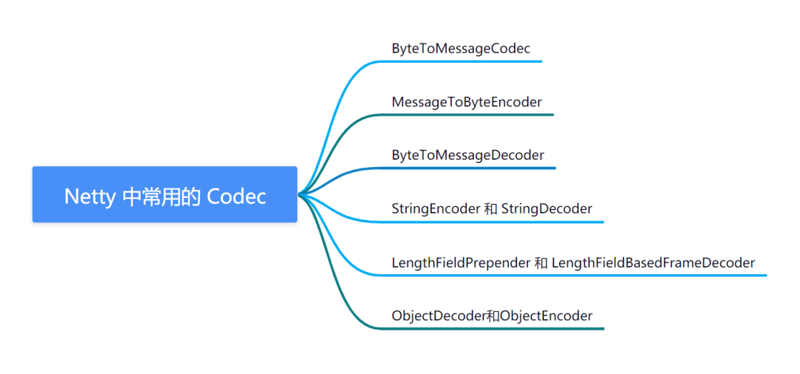

- `ByteToMessageCodec`：将字节流解码为 `Java `对象，同时也可以将` Java` 对象编码为字节流。可以用于处理自定义协议的消息解析和封装。
- `MessageToByteEncoder`：将 `Java` 对象编码为字节流。通常用于发送消息时将消息转换为二进制数据。
- `ByteToMessageDecoder`：将字节流解码为` Java` 对象。通常用于接收到数据后进行解码。
- `StringEncoder 和 StringDecoder`：分别将字符串编码为字节流和将字节流解码为字符串。
- `LengthFieldPrepender 和 LengthFieldBasedFrameDecoder`：用于处理 `TCP` 粘包和拆包问题。
- `ObjectDecoder和ObjectEncoder`：将`Java`对象序列化为字节数据，并将字节数据反序列化为`Java`对象。

这些 `Codec `组件可以通过组合使用来构建复杂的数据协议处理逻辑，以提高代码的可重用性和可维护性。

## 16. 什么是 Netty 的 BootStrap，它的作用是什么？

`Netty的Bootstrap`是一个用于启动和配置`Netty`客户端和服务器的工具类。它提供了一组简单易用的方法，使得创建和配置 Netty 应用程序变得更加容易。

`Bootstrap`类提供了一些方法，可以设置服务器或客户端的选项和属性，以及为`ChannelPipeline`配置`handler`，以处理传入或传出的数据。一旦完成配置，使用`Bootstrap`启动客户端或服务器。

在`Netty`应用程序中，`Bootstrap`有两个主要作用：

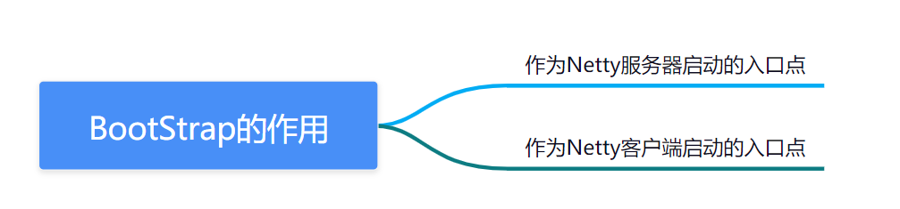

- 作为`Netty`服务器启动的入口点：通过`Bootstrap`启动一个`Netty`服务器，可以在指定的端口上监听传入的连接，并且可以设置服务器的选项和属性。
- 作为`Netty`客户端启动的入口点：通过`Bootstrap`启动一个`Netty`客户端，可以连接到远程服务器，并且可以设置客户端的选项和属性。

## 17.Netty 的 IO 模型是什么？与传统的 BIO 和 NIO 有什么不同？

> `Netty`的`IO`模型是基于事件驱动的`NIO（Non-blocking IO）`模型。在传统的`BIO（Blocking IO）`模型中，每个连接都需要一个独立的线程来处理读写事件，当连接数过多时，线程数量就会爆炸式增长，导致系统性能急剧下降。而在`NIO`模型中，一个线程可以同时处理多个连接的读写事件，大大降低了线程的数量和切换开销，提高了系统的并发性能和吞吐量。

与传统的`NIO`模型相比，`Netty`的`NIO`模型有以下不同点：

- `Netty`使用了`Reactor`模式，将`IO`事件分发给对应的`Handler`处理，使得应用程序可以更方便地处理网络事件。
- `Netty`使用了多线程模型，将`Handler`的处理逻辑和`IO`线程分离，避免了`IO`线程被阻塞的情况。
- `Netty`支持多种`Channel`类型，可以根据应用场景选择不同的`Channel`类型，如`NIO、EPoll、OIO`等。

## 18. 如何在 Netty 中实现 TCP 粘包/拆包的处理？

在`TCP`传输过程中，由于`TCP`并不了解上层应用协议的消息边界，**会将多个小消息组合成一个大消息，或者将一个大消息拆分成多个小消息发送。这种现象被称为 TCP 粘包/拆包问题**。在 Netty 中，可以通过以下几种方式来解决 TCP 粘包/拆包问题：

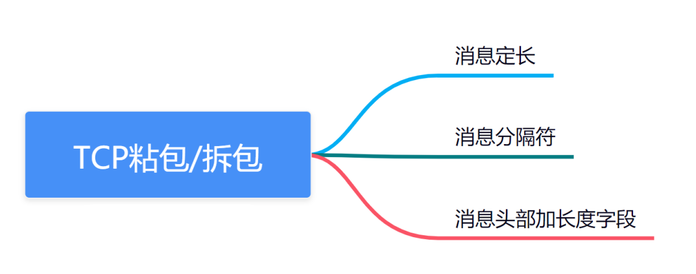

- **消息定长**：将消息固定长度发送，例如每个消息都是固定的`100`字节。在接收端，根据固定长度对消息进行拆分。

```
// 编码器，将消息的长度固定为100字节
pipeline.addLast("frameEncoder", new LengthFieldPrepender(2));
pipeline.addLast("messageEncoder", new StringEncoder(CharsetUtil.UTF_8));
// 解码器，根据固定长度对消息进行拆分
pipeline.addLast("frameDecoder", new LengthFieldBasedFrameDecoder(100, 0, 2, 0, 2));
pipeline.addLast("messageDecoder", new StringDecoder(CharsetUtil.UTF_8));
```

- **消息分隔符**：将消息以特定的分隔符分隔开，例如以"`\r\n`"作为分隔符。在接收端，根据分隔符对消息进行拆分。

```
// 编码器，以"\r\n"作为消息分隔符
pipeline.addLast("frameEncoder", new DelimiterBasedFrameEncoder("\r\n"));
pipeline.addLast("messageEncoder", new StringEncoder(CharsetUtil.UTF_8));
// 解码器，根据"\r\n"对消息进行拆分
pipeline.addLast("frameDecoder", new DelimiterBasedFrameDecoder(1024, Delimiters.lineDelimiter()));
pipeline.addLast("messageDecoder", new StringDecoder(CharsetUtil.UTF_8));
```

- **消息头部加长度字段**：在消息的头部加上表示消息长度的字段，在发送端发送消息时先发送消息长度，再发送消息内容。在接收端，先读取消息头部的长度字段，再根据长度读取消息内容。

```
// 编码器，将消息的长度加入消息头部
pipeline.addLast("frameEncoder", new LengthFieldPrepender(2));
pipeline.addLast("messageEncoder", new StringEncoder(CharsetUtil.UTF_8));
// 解码器，先读取消息头部的长度字段，再根据长度读取消息内容
pipeline.addLast("frameDecoder", new LengthFieldBasedFrameDecoder(1024, 0, 2, 0, 2));
pipeline.addLast("messageDecoder", new StringDecoder(CharsetUtil.UTF_8));
```

## 19. Netty 如何处理大文件的传输？

在`Netty`中，可以通过使用`ChunkedWriteHandler`处理大文件的传输。`ChunkedWriteHandler`是一个编码器，可以将大文件切分成多个`Chunk`，并将它们以`ChunkedData`的形式写入管道，这样就可以避免一次性将整个文件读入内存，降低内存占用。

具体使用方法如下：

- 在服务端和客户端的`ChannelPipeline`中添加`ChunkedWriteHandler`。

```
pipeline.addLast(new ChunkedWriteHandler());
```

- 在服务端和客户端的业务逻辑处理器中，接收并处理`ChunkedData`。

```
public class MyServerHandler extends SimpleChannelInboundHandler<Object> {
    @Override
    protected void channelRead0(ChannelHandlerContext ctx, Object msg) throws Exception {
        if (msg instanceof HttpRequest) {
            HttpRequest request = (HttpRequest) msg;
            // 处理HTTP请求
            // ...
        } else if (msg instanceof HttpContent) {
            HttpContent content = (HttpContent) msg;
            // 处理HTTP内容
            if (content instanceof LastHttpContent) {
                // 处理完整个HTTP请求
                // ...
            } else if (content instanceof HttpChunkedInput) {
                HttpChunkedInput chunkedInput = (HttpChunkedInput) content;
                // 处理ChunkedData
                while (true) {
                    HttpContent chunk = chunkedInput.readChunk(ctx.alloc());
                    if (chunk == null) {
                        break;
                    }
                    // 处理单个Chunk
                    // ...
                }
            }
        }
    }
}
```

- 在客户端向服务端发送数据时，将需要传输的文件包装成`ChunkedFile`并写入管道。

```
public void sendFile(Channel channel, File file) throws Exception {
    RandomAccessFile raf = new RandomAccessFile(file, "r");
    DefaultFileRegion fileRegion = new DefaultFileRegion(raf.getChannel(), 0, raf.length());
    HttpRequest request = new DefaultFullHttpRequest(HttpVersion.HTTP_1_1, HttpMethod.POST, "/");
    HttpUtil.setContentLength(request, raf.length());
    channel.write(request);
    channel.writeAndFlush(new HttpChunkedInput(new ChunkedFile(raf, 0, file.length(), 8192)));
}
```

在传输大文件时，还需要**注意以下几点**：

- 使用`ChunkedFile`时需要指定`Chunk`的大小，根据实际情况选择合适的大小，一般建议不要超过`8KB`。
- 为了避免大文件传输过程中对网络造成影响，可以在服务端和客户端的`ChannelPipeline`中添加`WriteBufferWaterMark`，限制写入缓冲区的大小。

```
pipeline.addLast(new WriteBufferWaterMark(8 * 1024, 32 * 1024));
```

## 20. 如何使用 Netty 实现心跳机制？

在`Netty`中，可以通过实现一个定时任务来实现心跳机制。具体来说，就是在客户端和服务端之间定时互相发送心跳包，以检测连接是否仍然有效。

**以下是使用 Netty 实现心跳机制的基本步骤**：

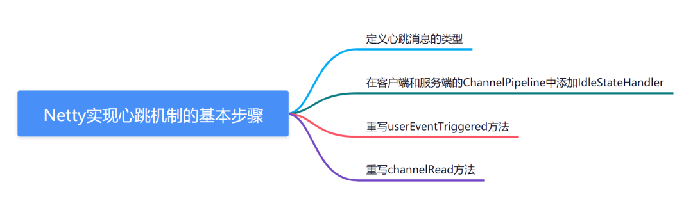

- 定义心跳消息的类型。

```
public class HeartbeatMessage implements Serializable {
    // ...
}
```

- 在客户端和服务端的`ChannelPipeline`中添加`IdleStateHandler`，用于触发定时任务。

```
pipeline.addLast(new IdleStateHandler(0, 0, 60, TimeUnit.SECONDS));
```

- 在客户端和服务端的业务逻辑处理器中，重写`userEventTriggered`方法，在触发定时任务时发送心跳包。

```
public class MyServerHandler extends SimpleChannelInboundHandler<Object> {
    @Override
    public void userEventTriggered(ChannelHandlerContext ctx, Object evt) throws Exception {
        if (evt instanceof IdleStateEvent) {
            IdleStateEvent event = (IdleStateEvent) evt;
            if (event.state() == IdleState.READER_IDLE) {
                // 读空闲，发送心跳包
                ctx.writeAndFlush(new HeartbeatMessage());
            }
        } else {
            super.userEventTriggered(ctx, evt);
        }
    }
}
```

- 在客户端和服务端的业务逻辑处理器中，重写`channelRead`方法，接收并处理心跳包。

```
public class MyClientHandler extends SimpleChannelInboundHandler<Object> {
    @Override
    protected void channelRead0(ChannelHandlerContext ctx, Object msg) throws Exception {
        if (msg instanceof HeartbeatMessage) {
            // 收到心跳包，不做处理
            return;
        }
        // 处理其他消息
        // ...
    }
}
```

需要注意的是，由于心跳包不需要传输大量数据，因此建议使用`Unpooled.EMPTY_BUFFER`作为心跳包的内容。另外，心跳间隔的时间应根据实际情况设置，一般建议设置为连接的超时时间的一半。

## 21. Netty 中如何实现 SSL/TLS 加密传输？

在 `Netty` 中实现 `SSL/TLS `加密传输，需要通过` SSLHandler`来进行处理。通常情况下，`SSLHandler` 需要在` ChannelPipeline` 中作为最后一个`handler`添加。

以下是实现` SSL/TLS` 加密传输的示例代码：

```
// 创建 SSLContext 对象，用于构建 SSLEngine
SSLContext sslContext = SSLContext.getInstance("TLS");

// 初始化 SSLContext
KeyManagerFactory keyManagerFactory = KeyManagerFactory.getInstance(KeyManagerFactory.getDefaultAlgorithm());
KeyStore keyStore = KeyStore.getInstance("JKS");
keyStore.load(new FileInputStream("server.jks"), "password".toCharArray());
keyManagerFactory.init(keyStore, "password".toCharArray());
TrustManagerFactory trustManagerFactory = TrustManagerFactory.getInstance(TrustManagerFactory.getDefaultAlgorithm());
trustManagerFactory.init(keyStore);
sslContext.init(keyManagerFactory.getKeyManagers(), trustManagerFactory.getTrustManagers(), null);

// 获取 SSLEngine
SSLEngine sslEngine = sslContext.createSSLEngine();
sslEngine.setUseClientMode(false);

// 添加 SslHandler 到 ChannelPipeline 中
pipeline.addLast("ssl", new SslHandler(sslEngine));
```

## 22. NioEventLoopGroup 默认的构造函数会起多少线程？

默认情况下，`NioEventLoopGroup` 的构造函数会根据可用的处理器核心数 (`availableProcessors()`) 创建相应数量的线程。

具体来说，`NioEventLoopGroup` 的默认构造函数内部调用了另一个构造函数，其参数 `nThreads `的默认值为` 0`，表示使用默认线程数。而默认线程数的计算方式就是调用 `Runtime.getRuntime().availableProcessors()` 方法获取当前机器可用的处理器核心数。

因此，如果你在一台四核的机器上创建了一个默认的 `NioEventLoopGroup` 实例，那么它就会使用四个线程。如果你想要修改线程数，可以调用` NioEventLoopGroup` 的其他构造函数，并传入自定义的线程数。

## 23. 如何使用 Netty 实现 WebSocket 协议？

在 `Netty` 中实现 `WebSocket` 协议，需要使用 `WebSocketServerProtocolHandler `进行处理。`WebSocketServerProtocolHandler `是一个` ChannelHandler`，可以将` HTTP` 升级为 `WebSocket` 并处理` WebSocket` 帧。

以下是实现 `WebSocket` 协议的示例代码：

```
// 添加 HTTP 请求解码器
pipeline.addLast("httpDecoder", new HttpRequestDecoder());
// 添加 HTTP 响应编码器
pipeline.addLast("httpEncoder", new HttpResponseEncoder());
// 添加 HTTP 聚合器
pipeline.addLast("httpAggregator", new HttpObjectAggregator(65536));
// 添加 WebSocket 服务器协议处理器
pipeline.addLast("webSocketHandler", new WebSocketServerProtocolHandler("/ws"));
// 添加自定义的 WebSocket 处理器
pipeline.addLast("handler", new MyWebSocketHandler());
```

在以上示例代码中，`WebSocketServerProtocolHandler `的参数 "/ws" 表示` WebSocket` 请求的 `URL` 路径，`MyWebSocketHandler` 是自定义的` WebSocket` 处理器。

## 24. Netty 高性能表现在哪些方面？

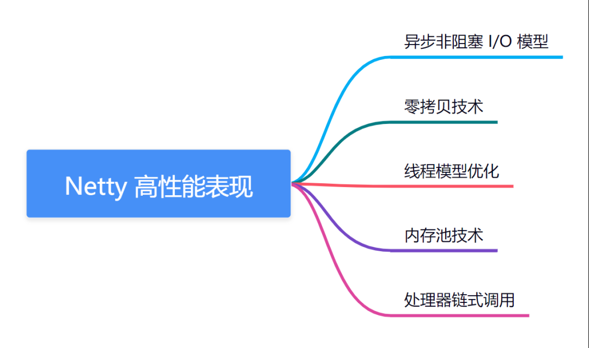

- 异步非阻塞 `I/O` 模型：`Netty `使用基于`NIO`的异步非阻塞 `I/O `模型，可以大大提高网络通信效率，减少线程的阻塞等待时间，从而提高应用程序的响应速度和吞吐量。
- 零拷贝技术：`Netty` 支持零拷贝技术，可以避免数据在内核和用户空间之间的多次复制，减少了数据拷贝的次数，从而提高了数据传输的效率和性能。
- 线程模型优化：`Netty `的线程模型非常灵活，可以根据不同的业务场景选择不同的线程模型。例如，对于低延迟和高吞吐量的场景，可以选择 `Reactor` 线程模型，对于` I/O` 操作比较简单的场景，可以选择单线程模型。
- 内存池技术：`Netty` 提供了一套基于内存池技术的 `ByteBuf` 缓冲区，可以重用已经分配的内存空间，减少内存的分配和回收次数，提高内存使用效率。
- 处理器链式调用：`Netty `的 `ChannelHandler` 可以按照一定的顺序组成一个处理器链，当事件发生时，会按照处理器链的顺序依次调用处理器，从而实现对事件的处理。这种处理方式比传统的多线程处理方式更加高效，减少了线程上下文切换和锁竞争等问题。

## 25. Netty 和 Tomcat 的区别？

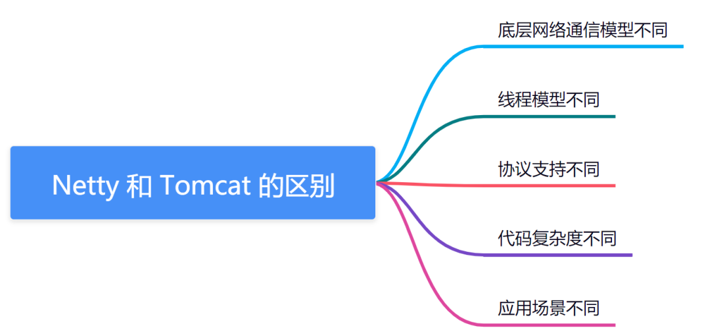

`Netty 和 Tomcat` 都是 `Java Web `应用服务器，但是它们之间存在一些区别：

- 底层网络通信模型不同：`Tomcat` 是基于阻塞的` BIO（Blocking I/O）`模型实现的，而 `Netty` 是基于` NIO（Non-Blocking I/O）`模型实现的。
- 线程模型不同：`Tomcat` 使用传统的多线程模型，每个请求都会分配一个线程，而 `Netty `使用 `EventLoop `线程模型，每个 `EventLoop` 负责处理多个连接，通过线程池管理` EventLoop`。
- 协议支持不同：`Tomcat `内置支持 `HTTP 和 HTTPS `协议，而 `Netty `不仅支持 `HTTP 和 HTTPS` 协议，还支持 `TCP、UDP 和 WebSocket` 等多种协议。
- 代码复杂度不同：由于`Tomcat`支持的功能比较全面，所以其代码相对较为复杂，而 `Netty `的代码相对比较简洁、精简。
- 应用场景不同：`Tomcat `适合于处理比较传统的 `Web `应用程序，如传统的 `MVC` 模式`Web`应用程序；而 `Netty `更适合于高性能、低延迟的网络应用程序，如游戏服务器、即时通讯服务器等。

## 26. 服务端 Netty 的工作架构图

```
             ┌───────┐        ┌───────┐
             │ Channel │◀───────│ Socket│
             │Pipeline │        │       │
             └───────┘        └───────┘
                   ▲                 │
                   │                 │
         ┌─────────┴─────────┐       │
         │                   │       │
         ▼                   ▼       ▼
┌──────────────┐   ┌──────────────┐  ┌──────────────┐
│EventLoopGroup│   │EventLoopGroup│  │EventLoopGroup│
│       boss   │   │     work     │  │     work     │
└──────────────┘   └──────────────┘  └──────────────┘
         ▲                   ▲       ▲
         │                   │       │
┌────────┴─────────┐ ┌────────┴─────────┐
│     NioServerSocketChannel   │   NioSocketChannel      │ ...
└──────────────────┘ └──────────────────┘
```

整个服务端 Netty 的工作架构图包括了以下几个部分：

- ChannelPipeline：管道处理器，用于处理入站或出站事件，对数据进行编解码、处理业务逻辑等。
- Channel：通道，对应底层的 `Socket `连接，用于收发网络数据。
- EventLoopGroup：事件循环组，包含了多个事件循环（`EventLoop`），每个事件循环负责处理多个通道上的事件。
- EventLoop：事件循环，负责监听注册到该循环的多个通道上的事件，然后根据事件类型将事件派发给对应的处理器。
- NioServerSocketChannel：NIO 服务端通道，用于接受客户端的连接。
- NioSocketChannel：NIO 客户端通道，用于和服务端进行数据通信。

在服务端启动时，会创建一个或多个 `EventLoopGroup`。其中一个 `EventLoopGroup `作为`boss`线程池，用于接受客户端的连接请求，并将连接请求分发给`work`线程池中的某个 `EventLoop`。`work `线程池中的`EventLoop`负责处理已经连接的客户端的数据通信。每个 `EventLoop `负责处理一个或多个 `NioSocketChannel`，并维护该通道的事件队列，当事件发生时，将事件添加到事件队列中，并将事件派发到管道处理器中进行处理。

## 27. 简单聊聊：Netty 的线程模型的三种使用方式？

Netty 的线程模型有三种使用方式，分别是单线程模型、多线程模型和主从多线程模型。

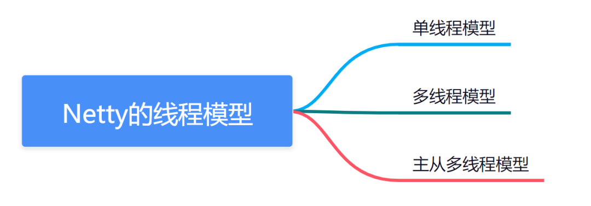

- **单线程模型**：所有的`I/O`操作都由同一个线程来执行。虽然这种方式并不适合高并发的场景，但是它具有简单、快速的优点，适用于处理`I/O`操作非常快速的场景，例如传输小文件等。
- **多线程模**型：所有的`I/O`操作都由一组线程来执行，其中一个线程负责监听客户端的连接请求，其他线程负责处理`I/O`操作。这种方式可以支持高并发，但是线程上下文切换的开销较大，适用于处理`I/O`操作较为耗时的场景。
- **主从多线程模型**：所有的`I/O`操作都由一组`NIO`线程来执行，其中一个主线程负责监听客户端的连接请求，其他从线程负责处理`I/O`操作。这种方式将接受连接和处理`I/O`操作分开，避免了线程上下文切换的开销，同时又能支持高并发，适用于处理 I/O 操作耗时较长的场景。

## 28. Netty 是如何保持长连接的

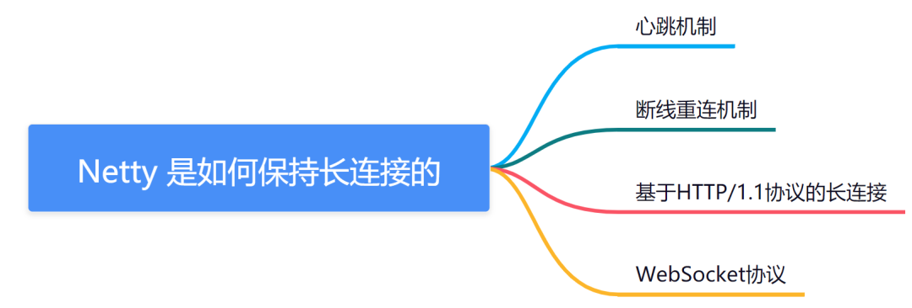

- **心跳机制**：使用心跳机制可以定期向服务器发送一个简短的数据包，以保持连接处于活动状态。如果在一段时间内没有收到心跳包，就可以认为连接已经断开，从而及时重新建立连接。`Netty`提供了`IdleStateHandler`处理器，可以方便地实现心跳机制。
- **断线重连机制**：在网络不稳定的情况下，连接可能会不可避免地断开。为了避免因为网络异常导致应用程序不能正常工作，可以实现断线重连机制，定期检查连接状态，并在连接断开时尝试重新连接。`Netty`提供了`ChannelFutureListener`接口和`ChannelFuture`对象，可以方便地实现断线重连机制。
- **基于 HTTP/1.1 协议的长连接**：`HTTP/1.1`协议支持长连接，可以在一个`TCP`连接上多次发送请求和响应。在`Netty`中，可以使用`HttpClientCodec和HttpObjectAggregator`处理器，实现基于`HTTP/1.1`协议的长连接。
- **WebSocket 协议**：`WebSocket`协议也支持长连接，可以在一个`TCP`连接上双向通信，实现实时数据交换。在`Netty`中，可以使用`WebSocketServerProtocolHandler`和`WebSocketClientProtocolHandler`处理器，实现`WebSocket`协议的长连接。

## 29. Netty 发送消息有几种方式？

在 `Netty` 中，发送消息主要有以下三种方式：

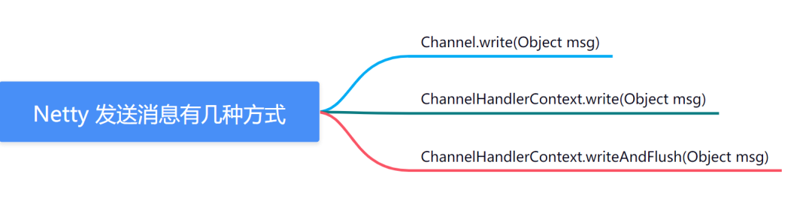

- **Channel.write(Object msg)** ：通过 `Channel` 写入消息，消息会被缓存到` Channel` 的发送缓冲区中，等待下一次调用 `flush()` 将消息发送出去。
- **ChannelHandlerContext.write(Object msg)** ：通过 `ChannelHandlerContext` 写入消息，与` Channel.write(Object msg)` 相比，`ChannelHandlerContext.write(Object msg)` 会将消息写入到 `ChannelHandlerContext` 的发送缓冲区中，等待下一次调用 `flush() `将消息发送出去。
- **ChannelHandlerContext.writeAndFlush(Object msg)** ：通过` ChannelHandlerContext` 写入并发送消息，等同于连续调用 `ChannelHandlerContext.write(Object msg)` 和` ChannelHandlerContext.flush()`。

在使用上述三种方式发送消息时，需要注意到写操作可能会失败或被延迟，因此需要在发送消息时进行一定的错误处理或者设置超时时间。另外，也可以使用 `Netty `提供的 `ChannelFuture` 对象来监听操作结果或者进行异步操作。

## 30. Netty 支持哪些心跳类型设置？

在 `Netty` 中，可以通过以下几种方式实现心跳机制：

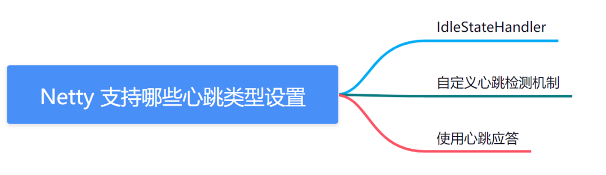

- **IdleStateHandler** ：`Netty` 内置的空闲状态检测处理器，支持多种空闲状态检测（如读空闲、写空闲、读写空闲）。
- **自定义心跳检测机制** ：可以通过自定义实现 `ChannelInboundHandler `接口的处理器来实现心跳检测，例如可以通过计时器或者线程来定期发送心跳包，或者通过对远程端口的连接状态进行检测等方式实现。
- **使用心跳应答** ：在应用层面定义心跳请求和应答消息，通过 `ChannelInboundHandler` 处理器监听接收到的心跳请求消息，并返回心跳应答消息，来实现心跳检测。如果一段时间内未收到对方的心跳应答消息，则认为连接已经失效。

需要注意的是，为了避免因心跳机制导致的网络负载过大或者频繁的连接断开和重连，应该根据具体业务场景选择适合的心跳类型和频率。

## 31. Netty 的内存管理机制是什么？

`Netty` 的内存管理机制主要是通过 `ByteBuf `类实现的。`ByteBuf` 是 `Netty` 自己实现的一个可扩展的字节缓冲区类，它在 `JDK` 的 `ByteBuffer `的基础上做了很多优化和改进。

`Netty` 的` ByteBuf` 的内存管理主要分为两种方式：

- 堆内存：`ByteBuf` 以普通的字节数组为基础，在 `JVM` 堆上分配内存。这种方式适用于小型数据的传输，如传输的是文本、`XML` 等数据。
- 直接内存：`ByteBuf` 使用操作系统的堆外内存，由操作系统分配和回收内存。这种方式适用于大型数据的传输，如传输的是音视频、大型图片等数据。

对于堆内存，`Netty` 采用了类似于`JVM `的分代内存管理机制，将缓冲区分为三种类型**：堆缓冲区、直接缓冲区、复合缓冲区**。Netty 会根据不同的使用场景和内存需求来决定使用哪种类型的缓冲区，从而提高内存利用率。

在使用 `ByteBuf `时，`Netty` 还实现了一些优化和特殊处理，如池化缓冲区、零拷贝等技术，以提高内存的利用率和性能的表现。

## 32. Netty 中如何实现高可用和负载均衡？

`Netty`本身并没有提供高可用和负载均衡的功能，但可以结合其他技术来实现这些功能。下面介绍一些常用的方案：

- 高可用：通过在多台服务器上部署同一个应用程序实现高可用。可以使用负载均衡器来将请求分配给不同的服务器，当某台服务器出现故障时，负载均衡器可以将请求转发给其他可用的服务器。常用的负载均衡器包括`Nginx、HAProxy`等。
- 负载均衡：负载均衡是将请求分配给多台服务器的过程，常用的负载均衡算法包括**轮询、随机、权重**等。在`Netty`中可以使用多个`EventLoop`来处理请求，将请求分配给不同的`EventLoop`，从而实现负载均衡。另外，可以使用第三方框架，如`Zookeeper、Consul`等，来实现服务注册、发现和负载均衡。
- 高可用与负载均衡的结合：可以使用多台服务器来实现高可用和负载均衡。在每台服务器上部署同一个应用程序，并使用负载均衡器来分配请求。当某台服务器出现故障时，负载均衡器可以将请求转发给其他可用的服务器，从而保证高可用和负载均衡。
