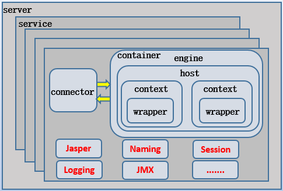
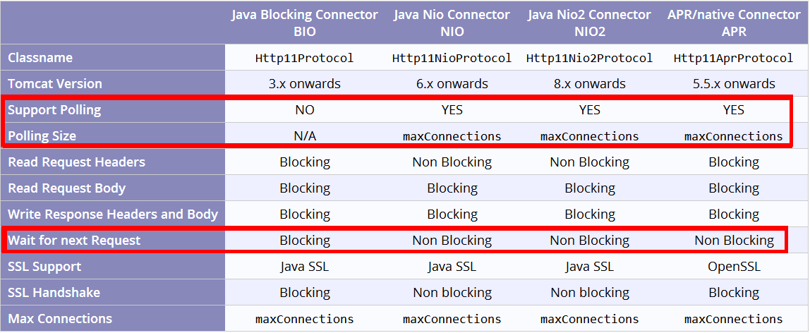
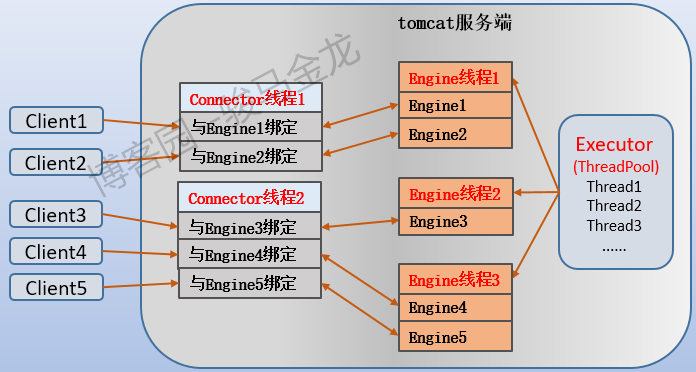
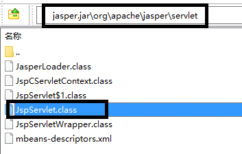

tomcat 可以处理静态资源的请求，也可以通过 servlet 处理动态资源的请求。处理 jsp 动态资源时，先通过 jasper 组件(具体的是 JspServlet)将 jsp 翻译成 java 源代码并编译成 class 后运行。需要知道的是，静态资源也一样是通过 servlet 处理的，只不过它使用的 servlet 是定义在`$catalina_home/conf/web.xml`中默认的 servlet。本文将详细分析 tomcat 如何处理客户端请求(并发)以及如何处理动、静态资源。

## 1.Tomcat 组件体系结构

如下两图：上面的图是 tomcat 组件体系的简图，下面的图是 Service 组件细化后的图。




其中：

1. `server`组件是管理 tomcat 实例的组件，可以监听一个端口，从此端口上可以远程向该实例发送 shutdown 关闭命令。

2. `service`组件是一个逻辑组件，用于绑定 connector 和 container，有了 service 表示可以向外提供服务，就像是一般的 daemon 类服务的 service。可以认为一个 service 就启动一个 JVM，更严格地说，一个 engine 组件才对应一个 JVM(定义负载均衡时，jvmRoute 就定义在 Engine 组件上用来标识这个 JVM)，只不过 connector 也工作在 JVM 中。

3. `connector` 组件是监听组件，它有四个作用：

   - (1).**开启监听套接字，监听外界请求，并建立 TCP 连接;**
   - (2).使用 protocolHandler 解析请求中的协议和端口等信息，如 http 协议、AJP 协议;
   - (3).根据解析到的信息，使用 processer 将请求数据转发给绑定的 Engine;
   - (4).接收响应数据并返回给客户端。

4. `container`是容器，它是一类组件，在配置文件(如 server.xml)中没有体现出来。它包含 4 个容器类组件：engine 容器、host 容器、context 容器和 wrapper 容器。

5. `engine`容器用于从 connector 组件处接收转发过来的请求，然后按照分析的结果将相关参数传递给匹配出的虚拟主机。engine 还用于指定默认的虚拟主机。

6. `host`容器定义虚拟主机，由于 tomcat 主要是作为 servlet 容器的，所以为每个 webapp 指定了它们的根目录 appBase。

7. `context`容器主要是根据 path 和 docBase 获取一些信息，将结果交给其内的 wrapper 组件进行处理(它提供 wrapper 运行的环境，所以它叫上下文 context)。一般来说，都采用默认的标准 wrapper 类，因此在 context 容器中几乎不会出现 wrapper 组件。

8. `wrapper`容器对应 servlet 的处理过程。它开启 servlet 的生命周期，根据 context 给出的信息以及解析 web.xml 中的映射关系，负责装载相关的类，初始化 servlet 对象 init()、执行 servlet 代码 service()以及服务结束时 servlet 对象的销毁 destory()。

9. `executor`组件为每个 Service 组件提供线程池，使得 Engine 可以从线程池中获取线程处理请求，从而实现 tomcat 的并发处理能力。

   **一定要注意，Executor 的线程池大小是为 Engine 组件设置，而不是为 Connector 设置的，Connector 的线程数量由 Connector 组件的 acceptorThreadCount 属性来设置**

   。如果要在配置文件中设置该组件，则必须设置在 Connector 组件的前面，以便在 Connector 组件中使用`executor`

   属性来引用配置好的 Executor 组件。如果不显式设置，则采用 Connector 组件上的默认配置，默认配置如下：

   - (1).maxThreads：最大线程数，默认值 200。
   - (2).minSpareThreads：最小空闲线程数，默认值 25。
   - (3).maxIdleTime：空闲线程的线程空闲多长时间才会销毁，默认值 60000 即 1 分钟。
   - (4).prestartminSpareThreads：是否启动 executor 时就直接创建等于最小空闲线程数的线程，默认值为 false，即只在有连接请求进入时才会创建。

根据上面描述的 tomcat 组件体系结构，处理请求的大致过程其实很容易推导出来：

```
Client(request)-->Connector-->Engine-->Host-->Context-->Wrapper(response data)-->Connector(response header)-->Client
```

## 2.Tomcat 和 httpd/nginx 在监听和处理请求上的区别

在监听和处理请求上，tomcat 和 httpd/nginx 等服务程序不一样，而且是巨大的区别。因此，在理解处理请求时，万万不可将 httpd/nginx 的处理模式套在 tomcat 上。

关于 httpd/nginx 等服务程序处理连接时的过程，此处仅简单说明以体现它们和 tomcat 的不同之处，详细内容可参见我另一篇文章：[不可不知的 socket 和 TCP 连接过程](http://www.cnblogs.com/f-ck-need-u/p/7623252.html)。

(1).httpd/nginx 等都是监听进程/线程负责监听，当监听到连接请求时，将生成一个新的`已连接套接字`放进一个称为已连接队列中，然后监听进程/线程继续回去监听。而负责处理请求的工作进程/线程则从该队列中获取`已连接套接字`并与客户端建立 TCP 连接，然后与客户端进行通信，包括接收客户端的资源请求数据、构建和响应数据给客户端。

(2).tomcat 虽然也将监听和处理请求的工作分别使用不同的组件进行处理，但 connector 线程监听到请求就直接建立 TCP 连接，并一直与客户端保持该连接。connector 线程会分析请求并将结果转发给与之绑定的 Engine 组件，Engine 线程负责处理请求以及构建响应数据，但 Engine 组件不会和客户端建立任何连接。**Engine 的一切数据来源都是 Connector，客户端任何一次资源请求都会发送到 connector 上，并从 connector 转发给 Engine**。Engine 构建响应后，再次将响应数据转发给 Connector，并由 Connector 做一些处理(如加上首部字段)回复给客户端。

只要明确一点即可推导出 tomcat 的连接和请求处理机制：**任何一次从外界流入的请求都必将经过 connector，任何一次从本地流出的响应数据也都必将经过 connector**。这正是连接器的意义所在 ── 连接客户端和服务端 servlet。

### 2.1 tomcat 如何处理并发请求

connector 组件支持 4 种 IO 协议类型：同步阻塞 BIO、同步非阻塞 NIO、异步非阻塞 NIO2、apache 基金会提供的 IO 模型 APR(IO 模型只是 APR 类库的其中一种功能模块)。它们的区别如下图所示，除了 BIO，其他 IO 模型在接受新请求上都是非阻塞的，因此这里不考虑 BIO，而且现在也不会有人将 connector 设置成 BIO 模式。


该表中，最需要关注的是"Wait for next Request"行，NIO/NIO2/APR 都是 Non Blocking，这表示正在处理某个请求时不会被阻塞，可以接收额外的请求，这是 tomcat 实现并发处理请求的关键。

再来看 connector 组件和并发数量有关的设置选项：

`acceptorThreadCount`：用于**接收连接请求的线程数**。默认值为 1。多核 CPU 系统应该增大该值，另外由于长连接的存在，也应该考虑增大该值。
`maxThreads`：线程池中最多允许存在多少线程用于**处理请求**。默认值为 200。它是最大并发处理的数量，但不影响接收线程接收更多的连接。
`maxConnections`：服务端允许接收和处理的最大连接数。当达到该值后，操作系统还能继续接收额外 acceptCount 个的连接请求，但这些连接暂时不会被处理。当 Connector 类型为 BIO 模型时的默认值等于 maxThread 的值，当为 NIO/NIO2 模型时的默认值为 10000，当 APR 时默认长度为 8192。
`acceptCount`：当所有请求处理线程都处于忙碌状态时，连接请求将进入等待队列，该值设置等待队列的长度。当达到队列最大值后，如果还有新连接请求进入，则会被拒绝。默认队列长度为 100。

从上面几个属性的意义来分析并发机制：

- (1).connector 中最多有 acceptorThreadCount 个专门负责监听、接收连接请求并建立 TCP 连接的线程，这些线程是非阻塞的(不考虑 BIO)。当和某客户端建立 TCP 连接后，可以继续去监听或者将 Engine 返回的数据发送给客户端或者处理其它事情。
- (2).线程池中的最大线程数 maxThreads 决定了某一刻允许处理的最大并发请求数，这是专门负责处理 connector 转发过来的请求的线程，可以认为这些线程专门是为 Engine 组件服务的(因此我将其称之为 Engine 线程)。注意，maxThreads 决定的是**某一刻**的最大并发处理能力，但不意味着 maxThreads 数量的线程只能处理 maxThreads 数量的请求，因为这些 Engine 线程也是非阻塞的，当处理某个请求时出现 IO 等待时，它不会阻塞，而是继续处理其它请求。也就是说，每个请求都占用一个 Engine 线程直到该客户端的所有请求处理完毕，但每个 Engine 线程可以处理多个请求。同时还能推测出，每个 connector 线程可以和多个 Engine 线程绑定(connector 线程的数量远少于 Engine 线程的数量)。
- (3).当并发请求数量逐渐增多，tomcat 处理能力的极限由 maxConnector 决定，这个值是由 maxThreads 和 acceptorThreadCount 以及非阻塞特性同时决定的。由于非阻塞特性，无论是 connector 线程还是 Engine 线程，都能不断接收、处理新请求。它的默认值看上去很大(10000 或 8192)，但分配到每个线程上的数量并不大。假设不考虑监听线程对数量的影响，仅从处理线程上来看，10000 个连接分配给 200 个处理线程，每个处理线程可以轮询处理 50 个请求。和 nginx 默认的一个 worker 线程允许 1024 个连接相比，已经很少了，当然，因为架构模型不一样，它们没有可比性。
- (4).当并发请求数量继续增大，tomcat 还能继续接收 acceptCount 个请求，但不会去建立连接，所以也不会去处理。实际上，这些请求不是 tomcat 接收的，而是操作系统接收的，接收后放入到由 Connector 创建的队列中，当 tomcat 有线程可以处理新的请求了再去队列中取出并处理。

再来细分一下 tomcat 和 httpd/nginx 的不同点：

- (1).**httpd/nginx 的监听者只负责监听和产生`已连接套接字`，不会和客户端直接建立 TCP 连接。而 tomcat 的监听者 connector 线程不仅会监听，还会直接建立 TCP 连接，且一直处于 ESTABLISHED 状态直到 close**。
- (2).**httpd/nginx 的工作进程/线程首先从已连接套接字队列中获取已连接套接字，并与客户端建立 TCP 连接，然后和客户端通信兵处理请求、响应数据。而 tomcat 的工作线程(Engine 线程)只接受来自 connector 转发过来的请求，处理完毕后还会将响应数据转发回 connector 线程，由 connector 将响应数据传输给客户端(和客户端的所有通信数据都必须经过连接器 connector 来传输)**。
- (3).不难推断出，一个 Connector 线程可以和多个客户端建立 TCP 连接，也可以和多个 Engine 线程建立绑定关系，而一个 Engine 线程可以处理多个请求。如果不理解并发处理机制，这一点很容易被"Connector 组件和 Engine 组件绑定在一起组成 Service 组件"这句话误导。这句话的意思并不是要求它们 1:1 对应，就像 httpd/nginx 也一样，一个监听者可能对应多个工作者。

因此，tomcat 处理连接的过程如下图所示，其中我把 Engine 线程处理请求的过程用"Engine+N"来表示，例如 Engine 线程 1 下的 Engine1 表示该 Engine 线程处理的某个请求，Engine2 表示该线程处理的另一个请求。



## 3.Tomcat 处理 jsp 动态资源的过程

假设 tomcat 的配置如下，其中项目名称为"xiaofang"。

```
<Connector connectionTimeout="20000" port="8080" protocol="HTTP/1.1" redirectPort="8443"/>

<Engine name="Catalina" defaultHost="localhost">
    <Host name="www.xiaofang.com"  appBase="webapps/xiaofang"
          unpackWARs="true" autoDeploy="true">
        <Context path="" docBase="" reloadable="true" />
        <Context path="/xuexi" docBase="xuexi" reloadable="true" />
    </Host>

    <Host name="localhost"  appBase="webapps"
          unpackWARs="true" autoDeploy="true">
    </Host>
</Engine>
```

当客户端访问`http://www.xiaofang.com:8080/xuexi/abc.jsp`时，其请求的是`$CATALINA_HOME/webapps/xiaofang/xuexi/abc.jsp`文件。

**(1).Connector 组件扮演的角色。**

Connector 组件首先监听到该请求，于是建立 TCP 连接，并分析该请求。Connector 分析请求的内容包括请求的协议、端口、参数等。因为这里没考虑集群问题，因此只可能是 http 协议而不可能是 ajp 协议的请求。分析后，将请求和相关参数转发给关联的 Engine 组件进行处理。

**(2).Engine 组件扮演的角色。**

Engine 组件主要用于将请求分配到匹配成功的虚拟主机上，如果没有能匹配成功的，则分配到默认虚拟主机上。对于上面的请求，很显然将分配到虚拟主机`www.xiaofang.com`上。

**(3).Host 组件扮演的角色。**

Host 组件收到 Engine 传递过来的请求参数后，将对请求中的 uri 与 Context 中的 path 进行匹配，如果和某个 Context 匹配成功，则将请求交给该 Context 处理。如果匹配失败，则交给`path=""`对应的 Context 来处理。所以，根据匹配结果，上面的请求将交给`<Context path="/xuexi" docBase="xuexi" />`进行处理。

**注意，这次的 uri 匹配是根据 path 进行的匹配，它是目录匹配，不是文件匹配。**也就是说，只匹配到 uri 中的 xuexi 就结束匹配。之所以要明确说明这一点，是因为后面还有一次文件匹配，用于决定交给哪个 Servlet 来处理。

**(4).Context 和 Wrapper 组件扮演的角色。**

到了这里，就算真正到了 Servlet 程序运行的地方了，相比于前面几个组件，这里的过程也更复杂一些。

请求`http://www.xiaofang.com:8080/xuexi/abc.jsp`经过 Host 的 uri 匹配后，分配给`<Context path="/xuexi" docBase="xuexi" />`进行处理，此时已经匹配了 url 中的目录，剩下的是 abc.jsp。abc.jsp 也需要匹配，但这个匹配是根据 web.xml 中的配置进行匹配的。

首先，从项目名为 xiaofang 的私有 web.xml 中进行查找，即 webapps/xiaofang/WEB-INF/web.xml。由于此处仅为简单测试，因此并没有该文件。

于是从全局 web.xml 即`$CATALINA_HOME/conf/web.xml`中匹配 abc.jsp。以下是 web.xml 中能匹配到该文件名的配置部分。

```
<!-- The mappings for the JSP servlet -->
<servlet-mapping>
    <servlet-name>jsp</servlet-name>
    <url-pattern>*.jsp</url-pattern>
    <url-pattern>*.jspx</url-pattern>
</servlet-mapping>

<servlet>
    <servlet-name>jsp</servlet-name>
    <servlet-class>org.apache.jasper.servlet.JspServlet</servlet-class>
</servlet>
```

首先根据`<servlet-mapping>`中的 url-pattern 进行**文件匹配**，发现该 url 匹配的是 servlet-name 为"jsp"的 servlet，然后再找到与该名称对应的`<servlet>`标签段，发现处理该动态资源的类为`org.apache.jasper.servlet.JspServlet`，于是找到该类对应的 class 文件，该 class 文件归档在`$catalina_home/lib/jasper.jar`中。



JspServlet 程序的作用是将 jsp 文件翻译成 java 源代码文件，并放在`$catalina_home/work`目录下。然后将该 java 源文件进行编译，编译后的 class 文件也放在 work 目录下。这个 class 文件就是 abc.jsp 最终要执行的 servlet 小程序。

```
[root@xuexi ~]# ls /usr/local/tomcat/work/Catalina/www.xiaofang.com/xuexi/org/apache/jsp/
index_jsp.class  index_jsp.java  new_
```

在翻译后的 servlet 小程序中，不仅会输出业务逻辑所需的数据，还会输出 html/css 代码，这样一来，客户端接收到的数据都将是排版好的。

## 4.Tomcat 处理静态资源的过程

对于 tomcat 来说，无论是动态还是静态资源，都是经过 servlet 处理的。只不过处理静态资源的 servlet 是默认的 servlet 而已。

在`$catalina_home/conf/web.xml`中关于静态资源处理的配置如下。

```
<!-- The mapping for the default servlet -->
<servlet-mapping>
    <servlet-name>default</servlet-name>
    <url-pattern>/</url-pattern>
</servlet-mapping>

<servlet>
    <servlet-name>default</servlet-name>
    <servlet-class>org.apache.catalina.servlets.DefaultServlet</servlet-class>
</servlet>
```

需要记住的是，**web.xml 中的 url-pattern 是文件匹配，而 server.xml 中的`<Context path="URL-PATTERN" />`是目录匹配。**

上面 web.xml 中的`<url-pattern>/</url-pattern>`表示的是默认 servlet。这意味着，当 web.xml 中没有 servlet-mapping 能匹配请求 url 中的路径时，将匹配 servlet-name，即名为 default 的 servlet。然后找到处理 default 的类为`org.apache.catalina.servlets.DefaultServlet`，该类的 class 文件归档在`$catalina_home/lib/catalina.jar`中。该 servlet 不像 JspServlet 会翻译 jsp 文件，它只有最基本的作用：原样输出请求文件中的内容给客户端。

例如，根据前面的配置，下面几个请求都将采用默认 servlet 进行处理，即当作静态资源处理。

```
http://www.xiaofang.com:8080/xuexi/index.html
http://www.xiaofang.com:8080/xuexi/abc.js
http://www.xiaofang.com:8080/xuexi/index
http://www.xiaofang.com:8080/xuexi/index.txt
```

但`http://www.xiaofang.com:8080/xuexi`则不一定，因为 tomcat 中默认的 index 文件包含 index.jsp 和 index.html，而 index.jsp 排在 index.html 的前面，只有不存在 index.jsp 时才请求 index.html。
