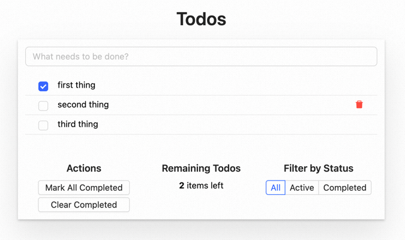

> React 是一个声明式、高效、灵活的用于构建用户界面的 JavaScript library，本文主要对 React 带来的三个颠覆性理念一一展开介绍。

# 一、React 是什么

在 React 之前前端有三个里程碑意义的 library/framework

- jQuery 解决了浏览器兼容和 DOM 元素快捷操作问题，其链式操作 API 也对后续前端框架产生了深刻影响；

- Knockout 提出了前端代码 MVVM 分层理念，数据通过模板映射为 UI 视图，大幅度减少了 DOM 操作；

- AngularJS 在 MVVM 基础上引入了双向绑定，数据变化自动反映到 UI，视图上的操作也反向自动更新数据；其通过指令拓展 HTML 的风格提升了模板引擎的灵活性，可惜作者引入了大量借鉴服务器编程的概念，让 AugularJS 学习成本直线上升，性能也略有不足；

React 是一个声明式、高效、灵活的用于构建用户界面的 JavaScript library，React 核心理念在于将一些简短、独立的代码片段组合成复杂的 UI 界面，这些代码片段被称作 “Component”。React 不是 MVC 框架，更像是其中 V，仅仅负责用户交互视图的渲染。

React 带来了三个颠覆性理念，在接下来的章节中将一一介绍：

- JSX，使用 JavaScript 表达 UI + 交互，充分利用 JavaScript 的灵活性；

- fx(props) = UI，数据驱动 UI，单向数据流、函数风格的页面组件；

- Virtual DOM，服务器、客户端使用同一套代码渲染——同构，解决前端应用 SEO 问题；

# 二、快速初始化 React 项目

使用  Create React App [1] 可以快速初始化一个 React Web 项目。

```
$ npx create-react-app learn-react --template typescript
$ cd learn-react
$ npm start
```

执行  npm start 后浏览器会在  http://localhost:3000  打开项目首页。

# 三、调试 React 应用

React 提供了  React Developer Tools[2]，集成到了 Chrome Dev Tools，借此可以查看 React 组件树及其对应 Props、State。

app.tsx

```
import React, { useState } from 'react';

function Button(props: { count: number }): JSX.Element {
  const [count, setCount] = useState(props.count);
  return (
    <button
      onClick={() => {
        setCount((c) => c + 1);
      }}
      >
      {count}
    </button>
  );
}

function App() {
  const [count, setCount] = useState(0);

  return (
    <div class>
      <Button count={5} />
    </div>
  );
}

export default App;
```

index.tsx

```
import React from 'react';
import * as ReactDOMClient from 'react-dom/client';

import App from './app';

const rootElement = document.querySelector('body') as Element;
const root = ReactDOMClient.createRoot(rootElement);

root.render(<App />);
```

打开 Chrome Dev Tools 可以看到多了一个  Components 选项卡


# 四、Todo project

接下来边学习边做一个 Todo 项目体验一下 React。



# 五、使用 JSX 做更好的关注点分离

在开始编写 React 程序之前需要了解一下 JSX。JSX 是 React 对 JavaScript 的语法拓展，用来在 JavaScript 文件内通过类 HTML 标签（HTML-like markup）表达页面的视图与交互逻辑。

```
<div class>
  <CustomComponent
    onClick={() => {alert('Hello')}}
  >
    Hello {props.name}!
  </CustomComponent>
</div>
```

Web 页面由 HTML 内容、CSS 样式、JavaScript 交互构成，长期以来 Web 开发者将三者放在独立的文件中做分离，这实际上是按照技术实现的分离。

<table data-wrapped="true"><thead><tr><th></th><th></th></tr></thead></table>

传统页面内容主要由 HTML 定义，JavaScript 逻辑是点缀，随着现代网页交互性增强，页面内容很大程度是由 JavaScript 逻辑动态生成，同时渲染逻辑本质上与其他 UI 逻辑内在耦合，比如在 UI 中需要绑定处理事件、在某些时刻状态发生变化时需要通知到 UI，以及需要在 UI 中展示准备好的数据。

因此 React 使用 JSX 把渲染逻辑和 HTML 标签集成到一起。

<table data-wrapped="true"><thead><tr><th></th><th></th></tr></thead></table>

这样开发者关注的不是 HTML 模板、JavaScript 渲染逻辑这样的技术实现，而是诸如 Sidebar、Form 这样的页面功能单元。

# 六、使用 JSX 编写 React 组件

返回 JSX 的函数就是 React 最简单的组件，可以和 HTML 标签一样嵌套使用。React 使用  props 参数向组件传递数据，提升组件的复用性。

```
/**
 * JSX 语法隐式调用 React.createElement
 * 所以虽然代码中没有调用 React 的语句，仍然需要引入
 */
import React from 'react';

interface IButton {
  /** 按钮展示文案 */
  text: string;
  /** 点击按钮跳转链接 */
  link?: string;
  /** 点击按钮自定义事件 */
  onClick?: (event?: Event) => void
}

function Button(props: IButton) {
  const { text, link, onClick } = props;

  const redirectHandler = () => {
    location.href = link;
  };

  return (
    <div
      class
      onClick={onClick | redirectHandler}
    >
      {text}
    </div>
  );
}

export default Button;
```

在使用组件时候，通过其标签的属性组装成 props 对象，传递给组件，语法和 HTML attribute 类似，但值可以是任意的 JavaScript 对象。

```
import React from 'react';

/**
 * 导入 ./button.tsx 中 export 的默认内容，命名为 Button 使用
 * .tsx 拓展名可以省略
 */
import Button from './button';

interface IDialog {
  title: string;
  content: Element;
  showClose: boolean;
}

function Dialog(props: IDialog) {
  const { title, content, showClose = false, children } = props;

  const hideDialog = () => {
    // ...
  }

  return (
    <div>
      <div class> {title} </div>
      <div class> {content | children} </div>
      {/* 没错，Button props 定义的属性，就是这样通过标签属性开放出来的 */}
      <Button
        title="取消"
        onClick={hideDialog}
      />
      <Button
        title="确认"
        onClick={() => { }}
      />
    </div>
  );
}

export default Dialog;
```

组件写好后通过  react-dom [3] 将组件渲染到页面。

```
import React from 'react';
import ReactDOM from 'react-dom/client';
import Dialog from './dialog';

// 把组件渲染到页面 id 为 root 的元素中
const rootElement = document.getElementById('root');
const root = ReactDOM.createRoot(rootElement);
root.render(
  <Dialog
    title="demo dialog"
    content="this is a dialog"
    showClose={false}
  />
);
```

# 七、JSX 规则

React 组件有几个约定：

- 组件名称使用 Pascal 风格（首字母大写），以和 HTML 原生标签（div、p、a 等）区分；

- 组件仅接受  props 一个参数，用来暴露组件可配置属性，其子组件被 React 通过  children 属性注入；

- 在组件内部 props 是只读的，不允许对其进行修改；

**1. 必须有根节点**

如同上面写的几个简单 demo，JSX 必须有 root 节点，即使多个同级元素没有父节点，也需要用虚拟节点  <></>  来包裹。

```
{/* 非法的 JSX */}
<div id="box1"></div>
<div id="box2"></div>
```

```
{/* 合法的 JSX */}
<>
    <div id="box1"></div>
  <div id="box2"></div>
</>
```

**2. 所有标签需要闭合**

在 HTML 中标签并不一定需要闭合。

```
<meta charset="UTF-8">
<br>

```

在 JSX 中可以混合 HTML 原生标签，但所有标签必须闭合。

```
<>
  <meta charset="UTF-8" />
  <br/>
  
</>
```

**3. 和 HTML 属性差异**

- 在 React 中常用的 DOM 特性和属性（包括事件处理）都使用小驼峰命名的方式，例如与 HTML 中的 tabindex 属性对应的 React 的属性是 tabIndex；

- HTML 部分属性名称与 JavaScript 保留字冲突，在 JSX 中需要使用替代名称；

  

- style 属性 value 是一个 CSS 属性组成的对象，为了让其符合 JavaScript 语法规则，属性名使用驼峰命名（fontSize、backgroundColor），而不是 CSS 属性使用的连字符，这样可以很方便设置动态样式，但静态样式应该依赖 className 和 CSS 文件的配合；

```
function HelloWorldComponent(props) {
    const divStyle = {
      // 可以很方便设置动态样式
      backgroundImage: 'url(' + props.imgUrl + ')',
    // 但静态样式应该尽量通过 className 设置类，通过 css file 解决
    // 不推荐 color: 'blue' 这种静态样式直接在 JSX 的写法
    color: 'blue',
  };

  return (
    <div style={divStyle}>
      Hello World!
    </div>
  );
}
```

- React 对于 Form 表单支持  defaultValue  属性，设置默认值，在运行时取值使用和 HTML 一致的  value 属性。

**4. 自动转义 content**

为了防止 XSS 攻击，JSX 会对直接设置的文本进行转义。

```
const content = `
  这里应该展示一张图片<br>
  
`;
<div>
  {content}
</div>
```

页面效果：


在安全性有保障的时候，可以通过  dangerouslySetInnerHTML 禁用转义效果，展示 raw HTML

```
const content = `
      这里应该展示一张图片<br>
      
  `;
<div dangerouslySetInnerHTML={{ __html: content }}/>
```


# 八、在 JSX 中 TODO 使用 {} 支持 JavaScript 表达式

JSX 中使用 {} 包裹 JavaScript 表达式处理动态逻辑，属性 value、子元素都可以，最常见的几个用法：

- {变量名} 读取变量值，双层 {{}} 并不是特殊语法，而是  {对象}  的快捷写法

```
<div style={{ color: 'red' }}></div>

// 等同于

const styleObj = { color: 'red' };
<div style={styleObj}></div>
```

- 三元表达式处理 if-else（if-else 是语句，不是表达式）

- map 处理循环逻辑，批量生成元素

```
interface IStuff {
  name: string;
  sex: 'male' | 'female';
}

function App () {
  const list: Array<IStuff> = [
    { name: 'Byron', sex: 'male' },
    { name: 'Casper', sex: 'male' },
    { name: 'Junice', sex: 'female' },
  ];

  return (
    <ul class>
      {
        list.map(stuff => { // 生成多个
          const { name, sex } = stuff;
          return (
            {
            <li
              /* 实际编程 className 设置有更好的表达方式，这里仅 demo 三元表达式使用 */}
                className={sex === 'male' ? 'stuff-male' : 'stuff-female'}
              onClick={() => { alert(name) }}
            >
              // 读取变量值
              {name}
            </li>
          );
        })
      }
    </ul>
  );
}
```

> JSX 中注释也需要使用 {} 包裹，但这种写法过于不方便，大部分编译工具都可以处理双斜线风格 // 注释

# 九、JSX 的背后

JSX 的返回值既不是 DOM 元素，也不是 HTML 字符串，而是对 DOM 的一个 JSON 描述，这就是 React Element：

```
<button id="9527" class>
   <span style={{ color: 'red' }}>
     This is a Button
   </span>
</button>
```

JSX 用类似这样的结构表达：

```
{
  "type": "button",
  "props": {
    "id": "9527",
    "className": "btn-primary",
    "children": [
      {
        "type": "span",
        "props": {
          "style": { "color": "red" },
          "children": "This is a Button"
        }
      }
    ]
  }
}
```

编译后实际是这样的调用：

```
React.createElement("button", {
  id: "9527",
  className: "btn-primary"
},React.createElement("span", {
  style: {
    color: 'red'
  }
}, "This is a Button"));
```

> React.createElement(type, props, ...children)，上文提到过 React 会自动把 children 注入到 props，就是在这个过程。

了解了 JSX 之后可以开始编写静态的 React Component 了。

完整教程见语雀：https://www.yuque.com/sunluyong/fe4java/pwsehvspthh6gtrd

**参考链接：**

[1]https://create-react-app.dev/

[2]https://chrome.google.com/webstore/detail/react-developer-tools/fmkadmapgofadopljbjfkapdkoienihi

[3]https://www.npmjs.com/package/react-dom

https://www.yuque.com/sunluyong/fe4java/pwsehvspthh6gtrd

https://mp.weixin.qq.com/s/QTbQnvzX4MxWbCLO1K4gWg
