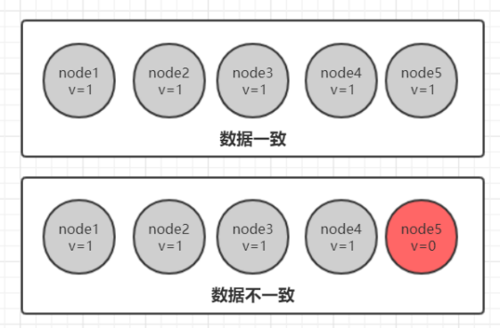
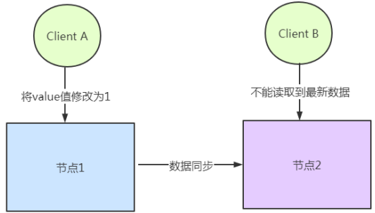
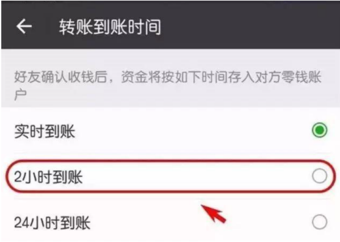
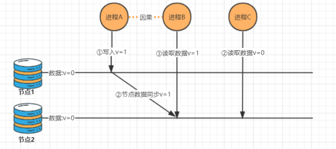
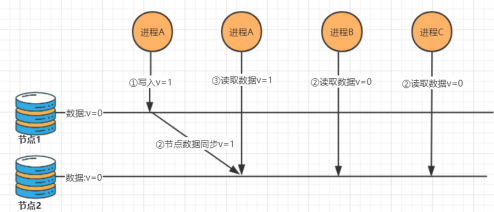
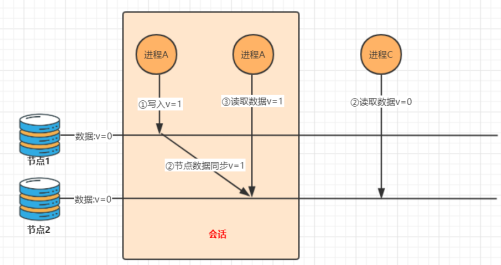
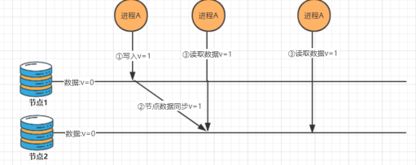
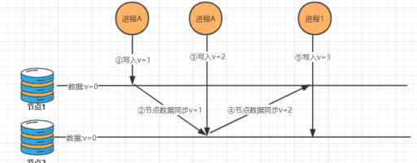
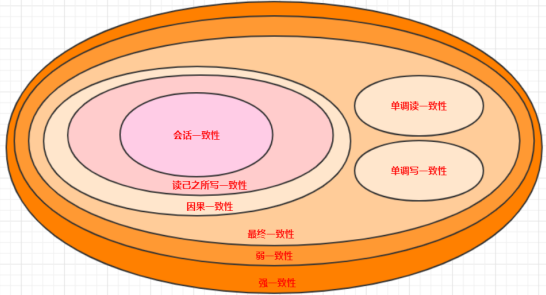

# 1. 什么是分布式数据一致性

分布式数据一致性，指的是数据在多份副本中存储时，各副本中的数据是一致的。

# 2 副本一致性

分布式系统当中，数据往往会有多个副本。多个副本就需要保证数据的一致性。这就带来了同步的问题，因为网络延迟等因素, 我们几乎没有办法保证可以同时更新所有机器当中的包括备份所有数据. 就会有数据不一致的情况

总得来说，我们无法找到一种能够满足分布式系统中数据一致性解决方案。因此，如何既保证数据的一致性，同时又不影响系统运行的性能，是每一个分布式系统都需要重点考虑和权衡的。于是，一致性级别由此诞生.

# 3 一致性分类

## 3.1 强一致性

这种一致性级别是最符合用户直觉的，它要求系统写入什么，读出来的也会是什么，用户体验好， 但实现起来往往对系统的性能影响大。但是强一致性很难实现。

## 3.2 弱一致性

这种一致性级别约束了系统在写入成功后，不承诺立即可以读到写入的值，也不承诺多久之后数据能够达到一致，但会**尽可能地** 保证到某个时间级别（比如秒级别）后，数据能够达到一致状态。

## 3.3 最终一致性

**最终一致性也是弱一致性的一种**，它无法保证数据更新后，所有后续的访问都能看到最新数值，而是需要一个时间，在这个时间之后可以保证这一点（就**是在一段时间后，节点间的数据会最终达到一致状态**），而在这个时间内，数据也许是不一致的，这个系统无法保证强一致性的时间片段被称为「不一致窗口」。不一致窗口的时间长短取决于很多因素，比如备份数据的个数、网络传输延迟速度、系统负载等。

最终一致性在实际应用中又有多种变种：

### 3.3.1 因果一致性

如果进程 A 通知进程 B 它已更新了一个数据项，那么进程 B 的后续访问将返回更新后的值。与进程 A 无因果关系的进程 C 的访问遵守一般的最终一致性规.

### 3.3.2 读己之所写一致性

当进程 A 自己更新一个数据项之后，它总是访问到更新过的值，绝不会看到旧值。这是因果一 致性模型的一个特例。

### 3.3.3 会话一致性

它把访问存储系统的进程放到会话的上下文中。只要会话还存在，系统就保证“读己之所写”一 致性。如果由于某些失败情形令会话终止，就要建立新的会话，而且系统的保证不会延续到新 的会话。

### 3.3.4 单调读一致性

如果一个进程已经读取到一个特定值，那么该进程不会读取到该值以前的任何值。

### 3.3.4 **单调写一致性**

系统保证对同一个进程的写操作串行化

# 4. 一致性模型图

