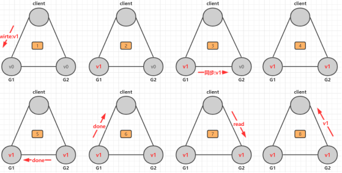
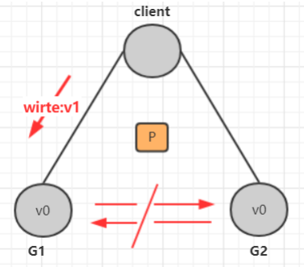
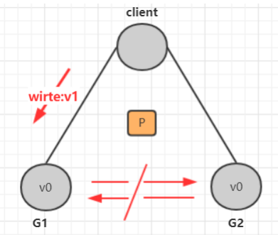
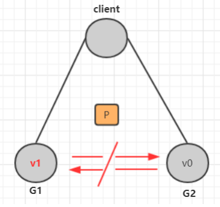
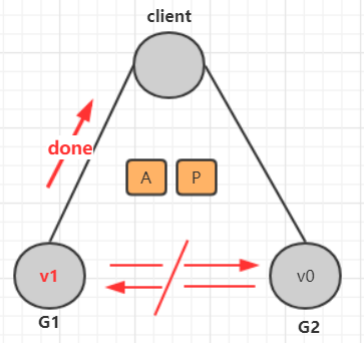
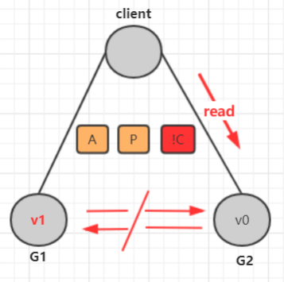
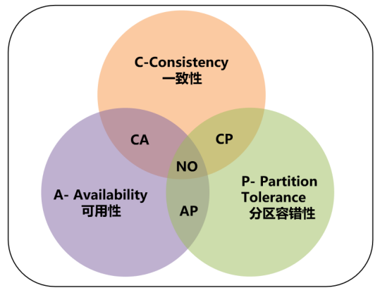
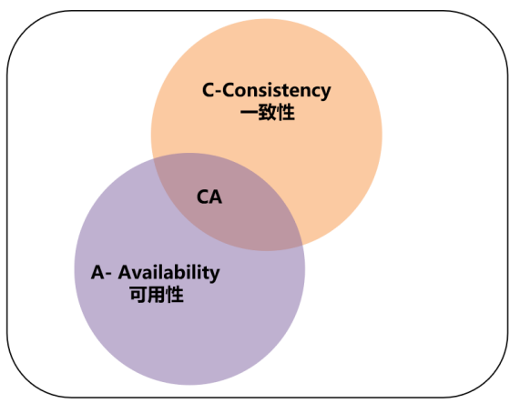
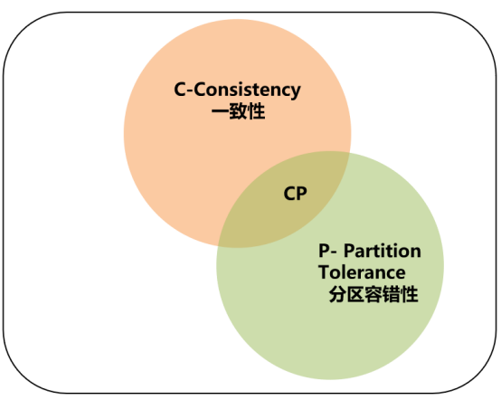
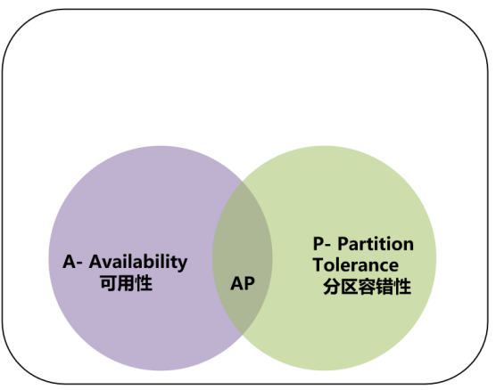

# CAP定理

# 1. CAP定理介绍

CAP定理（CAP theorem），又被称作布鲁尔定理（Brewer's theorem），它指出对于一个分布式计算系统来说，不可能同时满足以下三点

|                选项                |                           具体意义                           |
| :--------------------------------: | :----------------------------------------------------------: |
|       一致性 （Consistency）       |            所有节点访问时都是同一份最新的数据副本            |
|      可用性 （Availability）       |  每次请求都能获取到非错的响应，但是不保证获取的数据为最新数  |
| 分区容错性 （Partition tolerance） | 分布式系统在遇到任何网络分区故障的时候， 仍然能够对外提供满足一致 性和可用性的服务， 除非整个网络环境都发生了故障 |

## 1.1 一致性（C-Consistency)

> 这里指的是强一致性

在写操作完成后开始的任何读操作都必须返回该值，或者后续写操作的结果. 也就是说，在一致性系统中，一旦客户端将值写入任何一台服务器并获得响应，那么之后client从其他任何服务器读取的都是刚写入的数据

## 1.2  可用性（A-Availability)

系统中非故障节点收到的每个请求都必须有响应. 在可用系统中，如果我们的客户端向服务器发送请求，并且服务器未崩溃，则服务器必须最终响应客户端，不允许服务器忽略客户的请求

### 1.3  分区容错性（P-Partition tolerance）

允许网络丢失从一个节点发送到另一个节点的任意多条消息，即不同步. 也就是说，G1和G2发送给对方的任何消息都是可以放弃的，也就是说G1和G2可能因为各种意外情况，导致无法成功进行同步，**分布式系统要能容忍这种情况**。

# 2 CAP三者不可能同时满足论

> 假设确实存在三者能同时满足的系统

1. 那么我们要做的第一件事就是分区我们的系统，由于满足分区容错性，也就是说可能因为通信不佳等情况，G1和G2之间是没有同步

    

2. 接下来，我们的客户端将v1写入G1，但G1和G2之间是不同步的，所以如下G1是v1数据，G2是v0 数据

    

    3. 由于要满足可用性，即一定要返回数据，所以G1必须在数据没有同步给G2的前提下返回数据给 client，如下

        

        接下去，client请求的是G2服务器，由于G2服务器的数据是v0，所以client得到的数据是v0

        

        **结论:**  很明显，G1返回的是v1数据，G2返回的是v0数据，两者不一致。其余情况也有类似推导，也就是说 CAP三者不能同时出现。

        

# 3 CAP三者如何权衡

> 三选二利弊如何

CA (Consistency + Availability)：关注一致性和可用性，它需要非常严格的全体一致的协议。CA  系统不能容忍网络错误或节点错误，一旦出现这样的问题，整个系统就会拒绝写请求，因为它并不知道对面的那个结点是否挂掉了，还是只是网络问题。唯一安全的做法就是把自己变成只读的。

CP (consistency + partition tolerance)：关注一致性和分区容忍性。它关注的是系统里大多数人 的一致性协议。这样的系统只需要保证大多数结点数据一致，而少数的结点会在没有同步到最新版本的数据时变成不可用的状态。这样能够提供一部分的可用性。

AP (availability + partition tolerance)：这样的系统关心可用性和分区容忍性。因此，这样的系统不能达成一致性，需要给出数据冲突，给出数据冲突就需要维护数据版本。

**如何进行三选二**

放弃了一致性，满足分区容错，那么节点之间就有可能失去联系，为了高可用，每个节点只能用本地数据提供服务，而这样会容易导致全局数据不一致性。对于互联网应用来说，机器数量庞大，节点分散，网络故障再正常不过了，那么此时就是保障AP，放弃C的场景，而从实际中理解，像网站这种偶尔没有一致性是能接受的，但不能访问问题就非常大了。

对于银行来说，就是必须保证强一致性，也就是说C必须存在，那么就只用CA和CP两种情况，当保障强一致性和可用性（CA），那么一旦出现通信故障，系统将完全不可用。另一方面，如果保障了强一致性和分区容错（CP），那么就具备了部分可用性。实际究竟应该选择什么，是需要通过业务场景进行权衡的（并不是所有情况都是CP好于CA，只能查看信息但不能更新信息有时候还不如直接拒绝服务）
