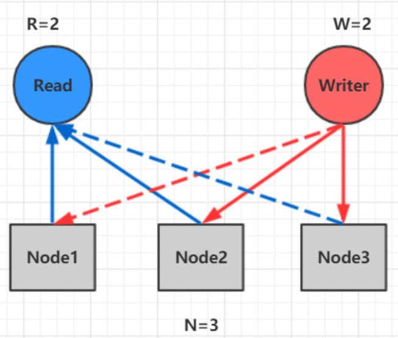
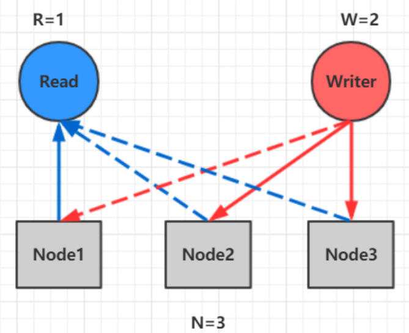

# 1 什么是NWR协议

NWR是一种在分布式存储系统中用于控制一致性级别的一种策略。在亚马逊的云存储系统中，就应用 NWR来控制一致性。

- N：在分布式存储系统中，有多少份备份数据
- W：代表一次成功的更新操作要求至少有w份数据写入成功 
- R： 代表一次成功的读数据操作要求至少有R份数据成功读取

## 2 原理

NWR值的不同组合会产生不同的一致性效果，当W+R>N的时候，整个系统对于客户端来讲能保证强 一致性。

### 以常见的N=3、W=2、R=2为例：

- N=3，表示，任何一个对象都必须有三个副本 
- W=2表示，对数据的修改操作只需要在3个副本中的2个上面完成就返回 
- R=2表示，从三个对象中要读取到2个数据对象，才能返回

> 在分布式系统中，数据的单点是不允许存在的。即线上正常存在的备份数量N设置1的情况是非常危险的，因为一旦这个备份发生错误，就可能发生数据的永久性错误。假如我们把N设置成为2，那么，只要有一个存储节点发生损坏，就会有单点的存在。所以N必须大于2。N越高，系统的维护和整体成本就越高。工业界通常把N设置为3。

1. 当W是2、R是2的时候，W+R>N，这种情况对于客户端就是强一致性的。

   

在上图中，如果R+W>N,则读取操作和写入操作成功的数据一定会有交集（如图中的 Node2），这样就可以保证一定能够读取到最新版本的更新数据，数据的强一致性得到了保证。在满足数据一致性协议的前提下，R或者W设置的越大，则系统延迟越大，因为这取决于最慢的那份备份数据的响应时间。

2. 当R+W<=N，无法保证数据的强一致性

   

因为成功写和成功读集合可能不存在交集，这样读操作无法读取到最新的更新数值，也就无法保证 数据的强一致性。
