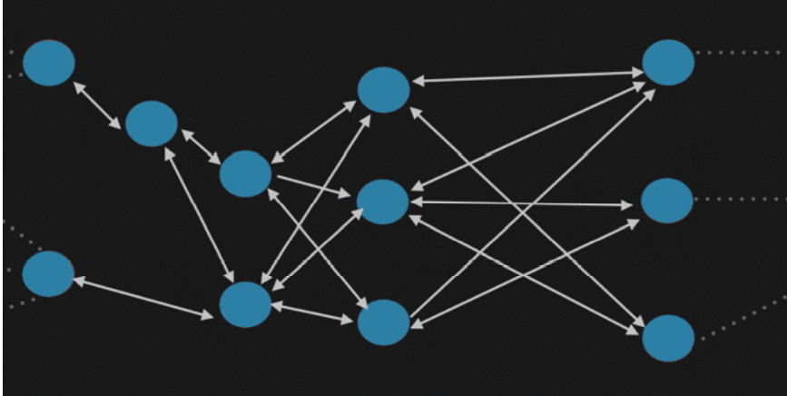
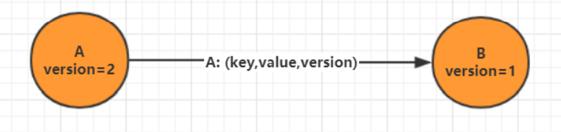
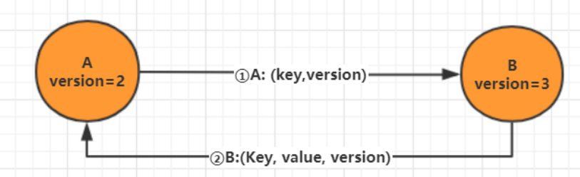

# 1 什么是 Gossip 协议

> 一种去中心化的分布式协议，数据通过节点像病毒一样逐个传播

Gossip 协议也叫 Epidemic 协议 （流行病协议）。原本用于分布式数据库中节点同步数据使用， 后被广泛用于数据库复制、信息扩散、集群成员身份确认、故障探测等。

从 gossip 单词就可以看到，其中文意思是八卦、流言等意思，我们可以想象下绯闻的传播（或者流 行病的传播）；gossip 协议的工作原理就类似于这个。gossip 协议利用一种随机的方式将信息传播到整个网络中，并在一定时间内使得系统内的所有节点数据一致。Gossip 其实是一种去中心化思路的分布式协议，解决状态在集群中的传播和状态一致性的保证两个问题。

# 2 Gossip 原理

Gossip 协议的消息传播方式有两种：反熵传播 和 谣言传播

1. 反熵传播

   是以固定的概率传播所有的数据。所有参与节点只有两种状态：Suspective(病原)、 Infective(感染)。过程是种子节点会把所有的数据都跟其他节点共享，以便消除节点之间数据的任何不一致，它可以保证最终、完全的一致。缺点是消息数量非常庞大，且无限制；通常只用于新加入节点的数据初始化。

2. 谣言传播
   是以固定的概率仅传播新到达的数据。所有参与节点有三种状态：Suspective(病原)、 Infective(感染)、Removed(愈除)。过程是消息只包含最新 update，谣言消息在某个时间点之后会被标记为 removed，并且不再被传播。缺点是系统有一定的概率会不一致，通常用于节点间数据增量同步。

# 3 通信方式

Gossip 协议最终目的是将数据分发到网络中的每一个节点。**根据不同的具体应用场景，网络中两个节点之间存在三种通信方式：推送模式、拉取模式、推/拉模式**

1. Push

   节点 A 将数据 (key,value,version) 及对应的版本号推送给 B 节点，B 节点更新 A 中比自己新的数据

   

2. Pull

   A 仅将数据 key, version 推送给 B，B 将本地比 A 新的数据（Key, value, version）推送给 A，A 更 新本地

   

# 4 优缺点

综上所述，我们可以得出 Gossip 是**一种去中心化的分布式协议，数据通过节点像病毒一样逐个传播**。因为是指数级传播，整体传播速度非常快。

1. 优点

   - 扩展性：允许节点的任意增加和减少，新增节点的状态最终会与其他节点一致

   - 容错：任意节点的宕机和重启都不会影响 Gossip 消息的传播，具有天然的分布式系统容错特性

   - 去中心化：无需中心节点，所有节点都是对等的，任意节点无需知道整个网络状况，只要网络连通，任意节点可把消息散播到全网

   - 最终一致性：Gossip 协议实现信息指数级的快速传播，因此在有新信息需要传播时，消息可以快速地发送到全局节点，在有限的时间内能够做到所有节点都拥有最新的数据。

2. 缺点
   - 消息延迟:节点随机向少数几个节点发送消息，消息最终是通过多个轮次的散播而到达全网； 不可避免的造成消息延迟。
   
   - 消息冗余:节点定期随机选择周围节点发送消息，而收到消息的节点也会重复该步骤；不可避免的引起同一节点消息多次接收，增加消息处理压力
   
     

Gossip 协议由于以上的优缺点，所以**适合于 AP 场景的数据一致性处理**，常见应用有：P2P 网络通信、 Redis Cluster、Consul。

# 5. **gossip协议**

gossip协议包含多种消息，包括ping，pong，meet，fail，等等

- meet: 某个节点发送meet给新加入的节点，让新节点加入集群中，然后新节点就会开始与其他节点进行通信

> redis-trib.rb add-node

​	其实内部就是发送了一个gossip meet消息，给新加入的节点，通知那个节点去加入我们的集群

- ping: 每个节点都会频繁给其他节点发送ping，其中包含自己的状态还有自己维护的集群元数据，互相通过ping交换元数据

每个节点每秒都会频繁发送ping给其他的集群，ping，频繁的互相之间交换数据，互相进行元数据的更新

- pong: 返回ping和meet，包含自己的状态和其他信息，也可以用于信息广播和更新

- fail: 某个节点判断另一个节点fail之后，就发送fail给其他节点，通知其他节点，指定的节点宕机了
  

## 5.1 **ping消息深入**

ping很频繁，而且要携带一些元数据，所以可能会加重网络负担

每个节点每秒会执行10次ping，每次会选择5个最久没有通信的其他节点

当然如果发现某个节点通信延时达到了cluster_node_timeout / 2，那么立即发送ping，避免数据交换延时过长，落后的时间太长了

比如说，两个节点之间都10分钟没有交换数据了，那么整个集群处于严重的元数据不一致的情况，就会有问题

所以cluster_node_timeout可以调节，如果调节比较大，那么会降低发送的频率

每次ping，一个是带上自己节点的信息，还有就是带上1/10其他节点的信息，发送出去，进行数据交换

至少包含3个其他节点的信息，最多包含总节点2个其他节点的信息

# 参考

[【带你重拾Redis】Redis cluster集群模式的原理](https://andyoung.blog.csdn.net/article/details/123814146)
