# 1 什么是Paxos

Paxos协议其实说的就是Paxos算法, Paxos算法是基于**消息传递**且具有**高度容错特性的一致性算法**，是目前公认的解决**分布式一致性**问题**最有效**的算法之一。

Paxos由 莱斯利·兰伯特(Leslie Lamport)于1998年在《The Part-Time Parliament》论文中首次公 开，最初的描述使用希腊的一个小岛Paxos，描述了Paxos小岛中通过决议的流程，并以此命名这个算法，但是这个描述理解起来比较有挑战性。后来在2001年，莱斯利·兰伯特重新发表了朴实的算法描述版本《Paxos Made Simple》 自Paxos问世以来就持续垄断了分布式一致性算法，Paxos这个名词几乎等同于分布式一致性。 Google的很多大型分布式系统都采用了Paxos算法来解决分布式一致性问题，如Chubby、Megastore 以及Spanner等。开源的ZooKeeper，以及MySQL 5.7推出的用来取代传统的主从复制的MySQL Group Replication等纷纷采用Paxos算法解决分布式一致性问题。然而，Paxos的最大特点就是难，不仅难以理解，更难以实现。 Google Chubby的作者Mike Burrows说过这个世界上只有一种一致性算法，那就是Paxos，其它 的算法都是残次品。

## 2 Paxos 解决了什么问题

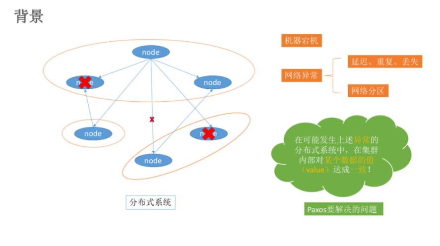

在常见的分布式系统中，总会发生诸如机器宕机或网络异常（包括消息的延迟、丢失、重复、乱序，还有网络分区）等情况。Paxos算法需要解决的问题就是如何在一个可能发生上述异常的分布式系统中，快速且正确地在集群内部对某个数据的值达成一致，并且保证不论发生以上任何异常，都不会破坏整个系统的一致性。

> 注：这里某个数据的值并不只是狭义上的某个数，它可以是一条日志，也可以是一条命令 （command）。。。根据应用场景不同，某个数据的值有不同的含义。

在之前讲解2PC 和 3PC的时候在一定程度上是可以解决数据一致性问题的. 但是并没有完全解决就是协调者宕机的情况.

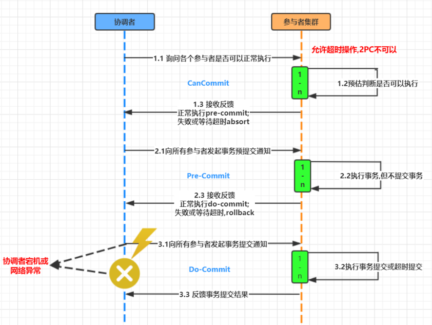

## **如何解决2PC和3PC的存在的问题呢?**

###  1. 步骤1-引入多个协调者

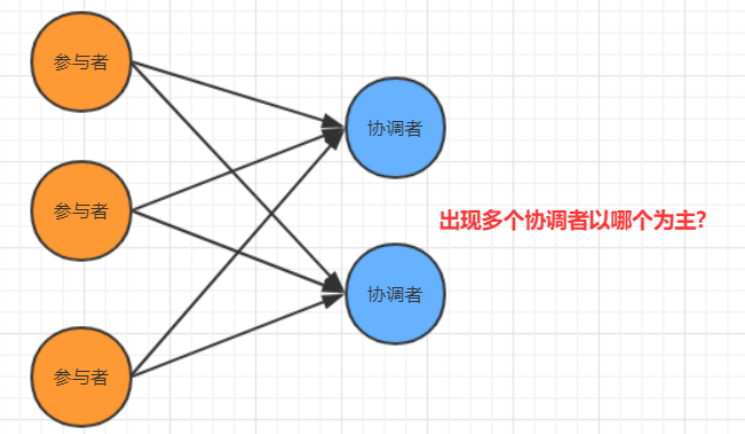

### 2. 步骤-引入主协调者,以他的命令为基准

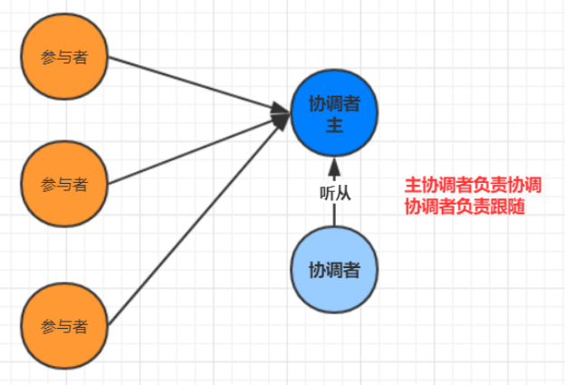

其实在引入多个协调者之后又引入主协调者.那么这个就是最简单的一种Paxos 算法.

Paxos的版本有: Basic Paxos , Multi Paxos, Fast-Paxos, 具体落地有Raft 和zk的ZAB协议

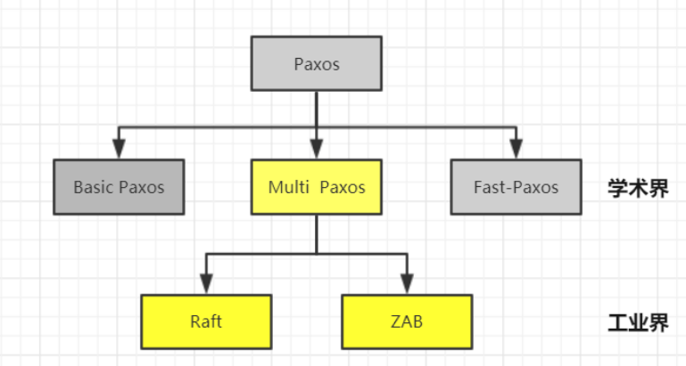

### 3 Basic Paxos相关概念

- 角色介绍 

  - Client:客户端

     客户端向分布式系统发出请求，并等待响应。例如，对分布式文件服务器中文件的写请求。 

  - Proposer：提案发起者
  
     提案者提倡客户端请求，试图说服Acceptor对此达成一致，并在发生冲突时充当协调者以推动协议向前发展 
  
  - Acceptor: 决策者，可以批准提案 
  
     Acceptor可以接受（accept）提案；并进行投票, 投票结果是否通过以多数派为准, 以如果某个提案被选定，那么该提案里的value就被选定了 
  
  - Learner: 最终决策的学习者 
  
     学习者充当该协议的复制因素(不参与投票)
  
-  决策模型

  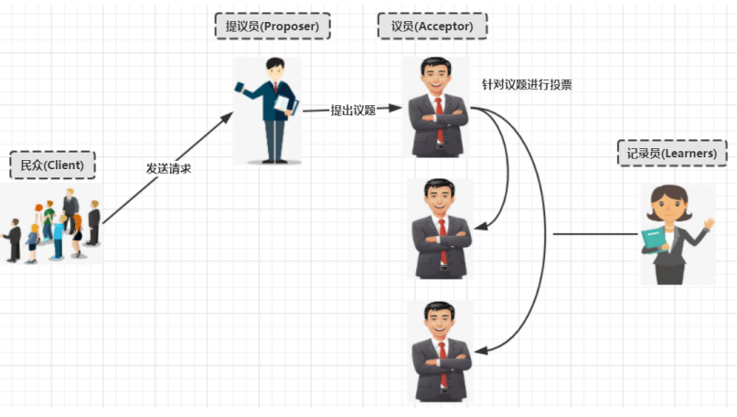

- basic paxos流程

  basic paxos流程一共分为4个步骤:

  - Prepare 

    Proposer提出一个提案,编号为N, 此N大于这个Proposer之前提出所有提出的编号, 请求 Accpetor的多数人接受这个提案 

  - Promise 

    如果编号N大于此Accpetor之前接收的任提案编号则接收, 否则拒绝 

  - Accept 

    如果达到多数派, Proposer会发出accept请求, 此请求包含提案编号和对应的内容 

  - Accepted 

    如果此Accpetor在此期间没有接受到任何大于N的提案,则接收此提案内容, 否则忽略

# 4 Basic Paxos流程图

1. 无故障的basic Paxos

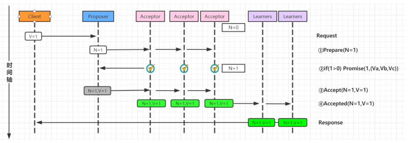

2. Acceptor失败时的basic Paxos

在下图中，多数派中的一个Acceptor发生故障，因此多数派大小变为2。在这种情况下，Basic Paxos协议仍然成功。

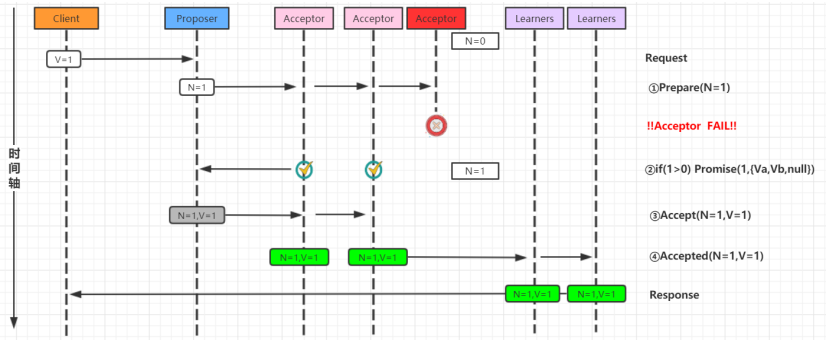

3. Proposer失败时的basic Paxos

Proposer在提出提案之后但在达成协议之前失败。具体来说，传递到Acceptor的时候失败了,这个 时候需要选出新的Proposer（提案人）,那么 Basic Paxos协议仍然成功

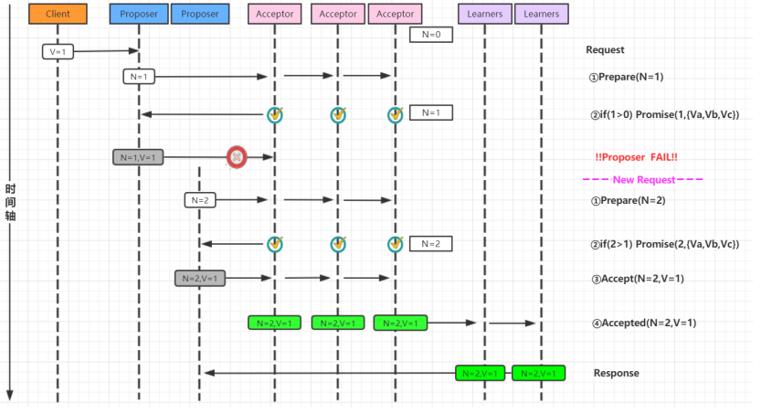

4. 当多个提议者发生冲突时的basic Paxos

最复杂的情况是多个Proposer都进行提案,导致Paxos的活锁问题.

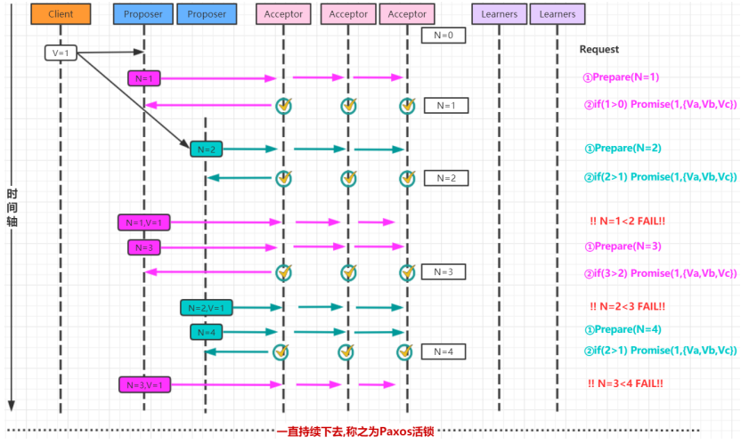

针对活锁问题解决起来非常简单: 只需要在每个Proposer再去提案的时候随机加上一个等待时间即可.

# 5 Multi-Paxos流程图

针对basic Paxos是存在一定得问题,首先就是流程复杂,实现及其困难, 其次效率低(达成一致性需要2轮 RPC调用),针对basic Paxos流程进行拆分为选举和复制的过程.

1. 第一次流程-确定Leader

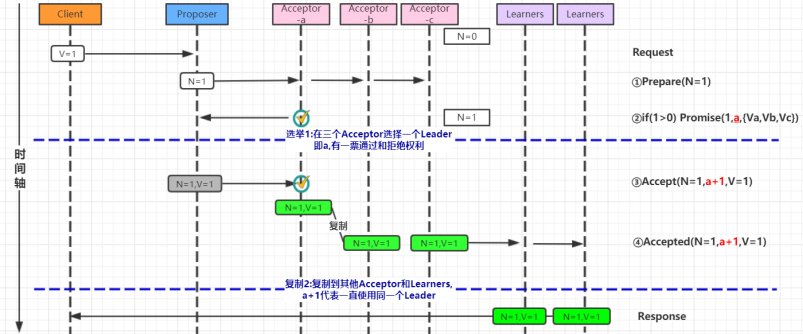

2. 第二次流程-直接由Leader确认

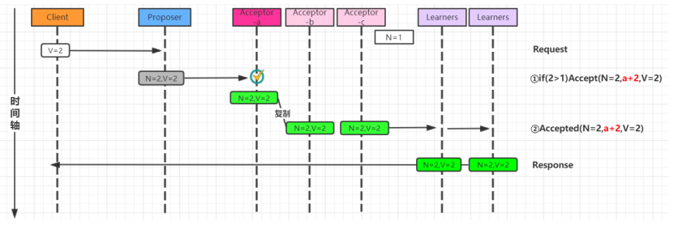

# 5 Multi-Paxos角色重叠流程图

Multi-Paxos在实施的时候会将Proposer，Acceptor和Learner的角色合并统称为“服务器”。因此， 最后只有“客户端”和“服务器”。

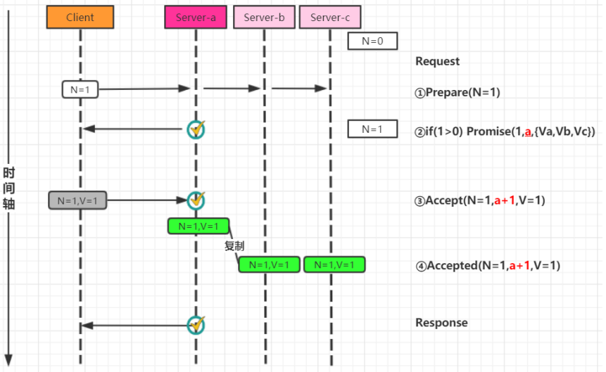
