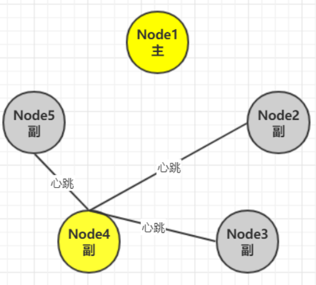
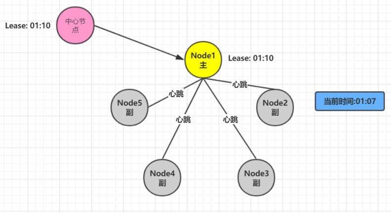

# 1 什么是Lease机制

Lease机制，翻译过来即是租约机制，是一种在分布式系统常用的协议，是维护分布式系统数据一致性的一种常用工具。

Lease机制有以下几个特点：

- Lease是颁发者对一段时间内数据一致性的承诺；
- 颁发者发出Lease后，不管是否被接收，只要Lease不过期，颁发者都会按照协议遵守承诺； Lease的持有者只能在Lease的有效期内使用承诺，一旦Lease超时，持有者需要放弃执行，重新申请Lease。

以租车为例:

# 2 Lease机制解决了什么问题

分布式系统中，如何确认一个节点是否工作正常？如果有5副本1-5。其中1号为主副本。

在分布式中最直观的处理方法是在每个副本与主副本维护一个心跳，期望通过心跳是否存在而判断对方是否依旧存活。

心跳方法其实根本无法解决分布式下节点是否正常的这个的这个问题。考虑如下场景：

1. 在某个时刻Node1主节点突然出现网络抖动或者网络中断情况(注意:不是宕机),导致从节点无法接 受到心跳

2. 会在剩下的副节点中选取一当主节点.

主要解决思路有四种： 

- 设计能容忍双主的分布式协议 
- Raft协议-通过Term版本高的同步低的. 
- 用lease机制 
- 涉及去中心化-Gossip协议

# 2 Lease的原理

1. 引入中心节点负责下发Lease

2. 出现网络问题

在01:05期间如果出现网络抖动导致其他节点申请Lease会申请失败, 因为中心节点在01:10之前都会 承认有主节点,不允许其他节点在申请Lease

3. 如果网络恢复

4. 如果到01:10时间,主节点会进行续约操作,然后在下发新的Lease

5. 如果主节点宕机,其他节点申请Lease也会失败,承认主节点存

6. 副节点申请Lease,申请成功. 因为Lease过期

# 3 lease的容错

1. 主节点宕机 

   lease机制天生即可容忍网络、lease接收方的出错,时间即Lease剩余过期时长 

2. 中心节点异常 
   颁发者宕机可能使得全部节点没有lease，系统处于不可用状态，解决的方法就是使用一个小集群而不是单一节点作为颁发者。 
3. 时差问题 
   中心节点与主节点之间的时钟可能也存在误差，只需要中心节点考虑时钟误差即可。

lease时间长短一般取经验值1-10秒即可。太短网络压力大，太长则收回承诺时间过长影响可用性。

# 4 应用

1. GFS(Google 文件系统)中，Master通过lease机制决定哪个是主副本，lease在给各节点的心跳响应 消息中携带。收不到心跳时，则等待lease过期，再颁发给其他节点。

2. chubby中，paxos选主后，从节点会给主颁发lease，在期限内不选其他节点为主。另一方面，主节点给每个client节点发送lease，用于判断client死活。
