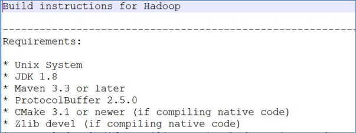

# 1 模板虚拟机环境准备

> [VMware 虚拟机安装详细教程网络 NAT、网桥配置](https://andyoung.blog.csdn.net/article/details/124333491)

1.1 安装模板虚拟机，IP 地址 192.168.10.100、主机名称 hadoop100、内存 4G、硬盘 50G

1.2 hadoop100 虚拟机配置要求如下（本文 Linux 系统全部以 CentOS-7.5-x86-1804 为例）

（1）使用 yum 安装需要虚拟机可以正常上网，yum 安装前可以先测试下虚拟机联网情况

```
[root@hadoop100 ~]# ping www.baidu.com
PING www.baidu.com (14.215.177.39) 56(84) bytes of data.
64 bytes from 14.215.177.39 (14.215.177.39): icmp_seq=1 ttl=128 time=8.60 ms
64 bytes from 14.215.177.39 (14.215.177.39): icmp_seq=2 ttl=128 time=7.72 ms
```

（2）安装 epel-release

注：Extra Packages for Enterprise Linux 是为“红帽系”的操作系统提供额外的软件包，适用于 RHEL、CentOS 和 Scientific Linux。相当于是一个软件仓库，大多数 rpm 包在官方 repository 中是找不到的）

```
[root@hadoop100 ~]# yum install -y epel-release
```

<mark>（3）注意：如果 Linux 安装的是最小系统版，还需要安装如下工具；如果安装的是 Linux 桌面标准版，不需要执行如下操作</mark>

- net-tool：工具包集合，包含 ifconfig 等命令

  ```
  [root@hadoop100 ~]# yum install -y net-tools
  ```

- vim：编辑器

      ```
      [root@hadoop100 ~]# yum install -y vim
      ```

  1.3 关闭防火墙，关闭防火墙开机自启

```
[root@hadoop100 ~]# systemctl stop firewalld
[root@hadoop100 ~]# systemctl disable firewalld.service
```

> 注意：在企业开发时，通常单个服务器的防火墙时关闭的。公司整体对外会设置非常安全的防火墙

1.4 创建 atguigu 用户，并修改 atguigu 用户的密码

```
[root@hadoop100 ~]# useradd atguigu
[root@hadoop100 ~]# passwd atguigu
```

1.5 配置 atguigu 用户具有 root 权限，方便后期加 sudo 执行 root 权限的命

```
[root@hadoop100 ~]# vim /etc/sudoers
```

修改/etc/sudoers 文件，在%wheel 这行下面添加一行，如下所示：

```
## Allow root to run any commands anywhere
root    ALL=(ALL)     ALL

## Allows people in group wheel to run all commands
%wheel  ALL=(ALL)       ALL
atguigu   ALL=(ALL)     NOPASSWD:ALL
```

> 注意：atguigu 这一行不要直接放到 root 行下面，因为所有用户都属于 wheel 组，你先配置了 atguigu 具有免密功能，但是程序执行到%wheel 行时，该功能又被覆盖回需要密码。所以 atguigu 要放到%wheel 这行下面。

1.6 在/opt 目录下创建文件夹，并修改所属主和所属组

（1）在/opt 目录下创建 module、software 文件夹

```
[root@hadoop100 ~]# mkdir /opt/module
[root@hadoop100 ~]# mkdir /opt/software
```

（2）修改 module、software 文件夹的所有者和所属组均为 atguigu 用户

```
[root@hadoop100 ~]# chown atguigu:atguigu /opt/module
[root@hadoop100 ~]# chown atguigu:atguigu /opt/software
```

（3）查看 module、software 文件夹的所有者和所属组

```
[root@hadoop100 ~]# cd /opt/
[root@hadoop100 opt]# ll
总用量 12
drwxr-xr-x. 2 atguigu atguigu 4096 5月  28 17:18 module
drwxr-xr-x. 2 root    root    4096 9月   7 2017 rh
drwxr-xr-x. 2 atguigu atguigu 4096 5月  28 17:18 software
```

1.7 卸载虚拟机自带的 JDK

> 注意：如果你的虚拟机是最小化安装不需要执行这一步。

```
[root@hadoop100 ~]# rpm -qa | grep -i java | xargs -n1 rpm -e --nodeps
```

- rpm -qa：查询所安装的所有 rpm 软件包
- grep -i：忽略大小写
- xargs -n1：表示每次只传递一个参数
- rpm -e –nodeps：强制卸载软件

  1.8 重启虚拟机

```
[root@hadoop100 ~]# reboot
```

# 2. 克隆虚拟机

## 2.1 利用模板机 hadoop100，克隆三台虚拟机：hadoop102 hadoop103 hadoop104

> 注意：克隆时，要先关闭 hadoop100

## 2.2 修改克隆机 IP，以下以 hadoop102 举例说明

（1）修改克隆虚拟机的静态 IP

```
[root@hadoop100 ~]# vim /etc/sysconfig/network-scripts/ifcfg-ens33
```

改成

```
DEVICE=ens33
TYPE=Ethernet
ONBOOT=yes
BOOTPROTO=static
NAME="ens33"
IPADDR=192.168.10.102
PREFIX=24
GATEWAY=192.168.10.2
DNS1=192.168.10.2
```

（2）查看 Linux 虚拟机的虚拟网络编辑器，编辑->虚拟网络编辑器->VMnet8


（3）查看 Windows 系统适配器 VMware Network Adapter VMnet8 的 IP 地址


（4）保证 Linux 系统 ifcfg-ens33 文件中 IP 地址、虚拟网络编辑器地址和 Windows 系统 VM8 网络 IP 地址相同。

## 2.3 修改克隆机主机名，以下以 hadoop102 举例说明

（1）修改主机名称

```
[root@hadoop100 ~]# vim /etc/hostname
hadoop102
```

（2）配置 Linux 克隆机主机名称映射 hosts 文件，打开/etc/hosts

```
[root@hadoop100 ~]# vim /etc/hosts
```

添加如下内容

```
192.168.10.100 hadoop100
192.168.10.101 hadoop101
192.168.10.102 hadoop102
192.168.10.103 hadoop103
192.168.10.104 hadoop104
192.168.10.105 hadoop105
192.168.10.106 hadoop106
192.168.10.107 hadoop107
192.168.10.108 hadoop108
```

## 1.4 重启克隆机 hadoop102

```
[root@hadoop100 ~]# reboot
```

1.5 修改 windows 的主机映射文件（hosts 文件）

（1）如果操作系统是 window7，可以直接修改

（a）进入 C:\Windows\System32\drivers\etc 路径

（b）打开 hosts 文件并添加如下内容，然后保存

```
192.168.10.100 hadoop100
192.168.10.101 hadoop101
192.168.10.102 hadoop102
192.168.10.103 hadoop103
192.168.10.104 hadoop104
192.168.10.105 hadoop105
192.168.10.106 hadoop106
192.168.10.107 hadoop107
192.168.10.108 hadoop108
```

（2）如果操作系统是 window10，先拷贝出来，修改保存以后，再覆盖即可

（a）进入 C:\Windows\System32\drivers\etc 路径

（b）拷贝 hosts 文件到桌面

（c）打开桌面 hosts 文件并添加如下内容

```
192.168.10.100 hadoop100
192.168.10.101 hadoop101
192.168.10.102 hadoop102
192.168.10.103 hadoop103
192.168.10.104 hadoop104
192.168.10.105 hadoop105
192.168.10.106 hadoop106
192.168.10.107 hadoop107
192.168.10.108 hadoop108
```

（d）将桌面 hosts 文件覆盖 C:\Windows\System32\drivers\etc 路径 hosts 文件

# 3 **Hadoop 编译安装（选做）**

- 为什么要重新编译 Hadoop 源码?

匹配不同操作系统本地库环境，Hadoop 某些操作比如压缩、IO 需要调用系统本地库（**.so|**.dll）修改源码、重构源码

- 如何编译 Hadoop 源码包根目录下文件：BUILDING.txt 详细步骤参考附件资料



- 安装编译相关的依赖

  ```shell
  yum install gcc gcc-c++ make autoconf automake libtool curl lzo-devel zlib-devel openssl openssl-devel ncurses-devel snappy snappy-devel bzip2 bzip2-devel lzo lzo-devel lzop libXtst zlib -y

  yum install -y doxygen cyrus-sasl* saslwrapper-devel*
  ```

- 手动安装 cmake

  ```shell
  #yum卸载已安装cmake 版本低
  yum erase cmake

  #解压
  tar zxvf CMake-3.19.4.tar.gz

  #编译安装
  cd /export/server/CMake-3.19.4

  ./configure

  make && make install

  #验证
  [root@node4 ~]# cmake -version
  cmake version 3.19.4

  #如果没有正确显示版本 请断开SSH连接 重写登录
  ```

- 手动安装 snappy

  ```shell
  #卸载已经安装的

  rm -rf /usr/local/lib/libsnappy*
  rm -rf /lib64/libsnappy*

  #上传解压
  tar zxvf snappy-1.1.3.tar.gz

  #编译安装
  cd /export/server/snappy-1.1.3
  ./configure
  make && make install

  #验证是否安装
  [root@node4 snappy-1.1.3]# ls -lh /usr/local/lib |grep snappy
  -rw-r--r-- 1 root root 511K Nov  4 17:13 libsnappy.a
  -rwxr-xr-x 1 root root  955 Nov  4 17:13 libsnappy.la
  lrwxrwxrwx 1 root root   18 Nov  4 17:13 libsnappy.so -> libsnappy.so.1.3.0
  lrwxrwxrwx 1 root root   18 Nov  4 17:13 libsnappy.so.1 -> libsnappy.so.1.3.0
  -rwxr-xr-x 1 root root 253K Nov  4 17:13 libsnappy.so.1.3.0
  ```

- 安装配置 JDK 1.8

  ```shell
  #解压安装包
  tar zxvf jdk-8u65-linux-x64.tar.gz

  #配置环境变量
  vim /etc/profile

  export JAVA_HOME=/export/server/jdk1.8.0_241
  export PATH=$PATH:$JAVA_HOME/bin
  export CLASSPATH=.:$JAVA_HOME/lib/dt.jar:$JAVA_HOME/lib/tools.jar

  source /etc/profile

  #验证是否安装成功
  java -version

  java version "1.8.0_241"
  Java(TM) SE Runtime Environment (build 1.8.0_241-b07)
  Java HotSpot(TM) 64-Bit Server VM (build 25.241-b07, mixed mode)
  ```

- 安装配置 maven

  ```shell
  #解压安装包
  tar zxvf apache-maven-3.5.4-bin.tar.gz

  #配置环境变量
  vim /etc/profile

  export MAVEN_HOME=/export/server/apache-maven-3.5.4
  export MAVEN_OPTS="-Xms4096m -Xmx4096m"
  export PATH=:$MAVEN_HOME/bin:$PATH

  source /etc/profile

  #验证是否安装成功
  [root@node4 ~]# mvn -v
  Apache Maven 3.5.4

  #添加maven 阿里云仓库地址 加快国内编译速度
  vim /export/server/apache-maven-3.5.4/conf/settings.xml

  <mirrors>
       <mirror>
             <id>alimaven</id>
             <name>aliyun maven</name>
             <url>http://maven.aliyun.com/nexus/content/groups/public/</url>
             <mirrorOf>central</mirrorOf>
        </mirror>
  </mirrors>
  ```

- 安装 ProtocolBuffer 3.7.1

  ```shell
  #卸载之前版本的protobuf

  #解压
  tar zxvf protobuf-3.7.1.tar.gz

  #编译安装
  cd /export/server/protobuf-3.7.1
  ./autogen.sh
  ./configure
  make && make install

  #验证是否安装成功
  [root@node4 protobuf-3.7.1]# protoc --version
  libprotoc 3.7.1
  ```

- 编译 hadoop

  ```shell
  #上传解压源码包
  tar zxvf hadoop-3.3.0-src.tar.gz

  #编译
  cd /root/hadoop-3.3.0-src

  mvn clean package -Pdist,native -DskipTests -Dtar -Dbundle.snappy -Dsnappy.lib=/usr/local/lib

  #参数说明：

  Pdist,native ：把重新编译生成的hadoop动态库；
  DskipTests ：跳过测试
  Dtar ：最后把文件以tar打包
  Dbundle.snappy ：添加snappy压缩支持【默认官网下载的是不支持的】
  Dsnappy.lib=/usr/local/lib ：指snappy在编译机器上安装后的库路径
  ```

- 编译之后的安装包路径

  ```
  /root/hadoop-3.3.0-src/hadoop-dist/target
  ```

# 4 在 hadoop102 安装 Hadoop

Hadoop 下载地址：[https://archive.apache.org/dist/hadoop/common/hadoop-3.1.3/](https://archive.apache.org/dist/hadoop/common/hadoop-2.7.2/)

1）用 XShell 文件传输工具将 hadoop-3.1.3.tar.gz 导入到 opt 目录下面的 software 文件夹下面

2）进入到 Hadoop 安装包路径下

```
[atguigu@hadoop102 ~]$ cd /opt/software/
```

3）解压安装文件到/opt/module 下面

4）查看是否解压成功

5）将 Hadoop 添加到环境变量

（1）获取 Hadoop 安装路径

```
[atguigu@hadoop102 hadoop-3.1.3]$ pwd
/opt/module/hadoop-3.1.3
```

（2）打开/etc/profile.d/my_env.sh 文件

- 在 my_env.sh 文件末尾添加如下内容：（shift+g）

  ```
  #HADOOP_HOME
  export HADOOP_HOME=/opt/module/hadoop-3.1.3
  export PATH=$PATH:$HADOOP_HOME/bin
  export PATH=$PATH:$HADOOP_HOME/sbin
  ```

- 保存并退出

（3）让修改后的文件生效

```
atguigu@hadoop102 hadoop-3.1.3]$ source /etc/profile
```

6）测试是否安装成功

```
[atguigu@hadoop102 hadoop-3.1.3]$ hadoop version
Hadoop 3.1.3
```

7）重启（如果 Hadoop 命令不能用再重启虚拟机）

```
[atguigu@hadoop102 hadoop-3.1.3]$ sudo reboot
```

# 5 Hadoop 目录结构

1）查看 Hadoop 目录结构

```
[atguigu@hadoop102 hadoop-3.1.3]$ ll
总用量 52
drwxr-xr-x. 2 atguigu atguigu  4096 5月  22 2017 bin
drwxr-xr-x. 3 atguigu atguigu  4096 5月  22 2017 etc
drwxr-xr-x. 2 atguigu atguigu  4096 5月  22 2017 include
drwxr-xr-x. 3 atguigu atguigu  4096 5月  22 2017 lib
drwxr-xr-x. 2 atguigu atguigu  4096 5月  22 2017 libexec
-rw-r--r--. 1 atguigu atguigu 15429 5月  22 2017 LICENSE.txt
-rw-r--r--. 1 atguigu atguigu   101 5月  22 2017 NOTICE.txt
-rw-r--r--. 1 atguigu atguigu  1366 5月  22 2017 README.txt
drwxr-xr-x. 2 atguigu atguigu  4096 5月  22 2017 sbin
drwxr-xr-x. 4 atguigu atguigu  4096 5月  22 2017 share
```

2）重要目录

（1）bin 目录：存放对 Hadoop 相关服务（hdfs，yarn，mapred）进行操作的脚本

（2）etc 目录：Hadoop 的配置文件目录，存放 Hadoop 的配置文件

（3）lib 目录：存放 Hadoop 的本地库（对数据进行压缩解压缩功能）

（4）sbin 目录：存放启动或停止 Hadoop 相关服务的脚本

（5）share 目录：存放 Hadoop 的依赖 jar 包、文档、和官方案例

# 6 Hadoop 运行模式

1）Hadoop 官方网站：http://hadoop.apache.org/ 安装指导 [https://hadoop.apache.org/docs/stable/hadoop-project-dist/hadoop-common/ClusterSetup.html](https://hadoop.apache.org/docs/stable/hadoop-project-dist/hadoop-common/ClusterSetup.html)

2）Hadoop 运行模式包括：**本地模式**、**伪分布式模式**以及**完全分布式模式**。

- **本地模式**：单机运行，只是用来演示一下官方案例。生产环境不用。

- **伪分布式模式**： 也是单机运行，但是具备 Hadoop 集群的所有功能，一台服务器模拟一个分布式的环境。个别缺钱的公司用来测试，生产环境不用。
- **完全分布式模式**：多台服务器组成分布式环境。生产环境使用。

## 6.1 本地运行模式（官方 WordCount）

1）创建在 hadoop-3.1.3 文件下面创建一个 wcinput 文件夹

```
[atguigu@hadoop102 hadoop-3.1.3]$ mkdir wcinput
```

2）在 wcinput 文件下创建一个 word.txt 文件

```
[atguigu@hadoop102 hadoop-3.1.3]$ cd wcinput
```

3）编辑 word.txt 文件

```
[atguigu@hadoop102 wcinput]$ vim word.txt
```

- 在文件中输入如下内容

```
hadoop yarn
hadoop mapreduce
atguigu
atguigu
```

- 保存退出：wq

4）回到 Hadoop 目录/opt/module/hadoop-3.1.3

5）执行程序

```
[atguigu@hadoop102 hadoop-3.1.3]$ hadoop jar share/hadoop/mapreduce/hadoop-mapreduce-examples-3.1.3.jar wordcount wcinput wcoutput
```

6）查看结果

```
[atguigu@hadoop102 hadoop-3.1.3]$ cat wcoutput/part-r-00000
```

看到如下结果：

```
atguigu 2
hadoop  2
mapreduce       1
yarn    1
```

## 6.2 完全分布式运行模式（开发重点）

分析：
1）准备 3 台客户机（关闭防火墙、静态 IP、主机名称）
2）安装 JDK
3）配置环境变量
4）安装 Hadoop
5）配置环境变量
6）配置集群
7）单点启动
8）配置 ssh
9）群起并测试集群

### 6.2.1 虚拟机准备

### 6.2.2 编写集群分发脚本 xsync

#### 1）scp（secure copy）安全拷贝

（1）scp 定义

scp 可以实现服务器与服务器之间的数据拷贝。（from server1 to server2）

（2）基本语法

`scp  -r     $pdir/$fname    $user@$host:$pdir/$fname`

命令 递归 要拷贝的文件路径/名称 目的地用户@主机:目的地路径/名称

（3）案例实操

- 前提：在 hadoop102、hadoop103、hadoop104 都已经创建好的/opt/module、Ø /opt/software 两个目录，并且已经把这两个目录修改为 atguigu:atguigu

  ```
  [atguigu@hadoop102 ~]$ sudo chown atguigu:atguigu -R /opt/module
  ```

  （a）在 hadoop102 上，将 hadoop102 中/opt/module/jdk1.8.0_212 目录拷贝到 hadoop103 上。

  ```
  [atguigu@hadoop102 ~]$ scp -r /opt/module/jdk1.8.0_212  atguigu@hadoop103:/opt/module
  ```

  （b）在 hadoop103 上，将 hadoop102 中/opt/module/hadoop-3.1.3 目录拷贝到 hadoop103 上。

  ```
  [atguigu@hadoop103 ~]$ scp -r atguigu@hadoop102:/opt/module/hadoop-3.1.3 /opt/module/
  ```

  （c）在 hadoop103 上操作，将 hadoop102 中/opt/module 目录下所有目录拷贝到 hadoop104 上。

  ```
  [atguigu@hadoop103 opt]$ scp -r atguigu@hadoop102:/opt/module/* atguigu@hadoop104:/opt/module
  ```

#### 2）rsync 远程同步工具

rsync 主要用于备份和镜像。具有速度快、避免复制相同内容和支持符号链接的优点。

**rsync 和 scp 区别**：用 rsync 做文件的复制要比 scp 的速度快，rsync 只对差异文件做更新。scp 是把所有文件都复制过去。

（1）基本语法

rsync -av $pdir/$fname $user@$host:$pdir/$fname

命令 选项参数 要拷贝的文件路径/名称 目的地用户@主机:目的地路径/名称

选项参数说明

| 选项 | 功能         |
| ---- | ------------ |
| -a   | 归档拷贝     |
| -v   | 显示复制过程 |

（2）案例实操

（a）删除 hadoop103 中/opt/module/hadoop-3.1.3/wcinput

```
[atguigu@hadoop103 hadoop-3.1.3]$ rm -rf wcinput/
```

（b）同步 hadoop102 中的/opt/module/hadoop-3.1.3 到 hadoop103

```
[atguigu@hadoop102 module]$ rsync -av hadoop-3.1.3/ atguigu@hadoop103:/opt/module/hadoop-3.1.3/
```

#### 3）xsync 集群分发脚本

- （1）需求：循环复制文件到所有节点的相同目录下

- （2）需求分析：

  - （a）rsync 命令原始拷贝：

    ```
    rsync  -av     /opt/module  		 atguigu@hadoop103:/opt/
    ```

  - b）期望脚本：

    xsync 要同步的文件名称

  - （c）期望脚本在任何路径都能使用（脚本放在声明了全局环境变量的路径）

    ```
    [atguigu@hadoop102 ~]$ echo $PATH
    /usr/local/bin:/usr/bin:/usr/local/sbin:/usr/sbin:/home/atguigu/.local/bin:/home/atguigu/bin:/opt/module/jdk1.8.0_212/bin
    ```

- （3）脚本实现

  - （a）在/home/atguigu/bin 目录下创建 xsync 文件

  ```
  [atguigu@hadoop102 opt]$ cd /home/atguigu
  [atguigu@hadoop102 ~]$ mkdir bin
  [atguigu@hadoop102 ~]$ cd bin
  [atguigu@hadoop102 bin]$ vim xsync
  ```

  在该文件中编写如下代码

  ```
  #!/bin/bash

  #1. 判断参数个数
  if [ $# -lt 1 ]
  then
      echo Not Enough Arguement!
      exit;
  fi

  #2. 遍历集群所有机器
  for host in hadoop102 hadoop103 hadoop104
  do
      echo ====================  $host  ====================
      #3. 遍历所有目录，挨个发送

      for file in $@
      do
          #4. 判断文件是否存在
          if [ -e $file ]
              then
                  #5. 获取父目录
                  pdir=$(cd -P $(dirname $file); pwd)

                  #6. 获取当前文件的名称
                  fname=$(basename $file)
                  ssh $host "mkdir -p $pdir"
                  rsync -av $pdir/$fname $host:$pdir
              else
                  echo $file does not exists!
          fi
      done
  done
  ```

  - （b）修改脚本 xsync 具有执行权限

    ```
    [atguigu@hadoop102 bin]$ chmod +x xsync
    ```

  - （c）测试脚本

    ```
    [atguigu@hadoop102 ~]$ xsync /home/atguigu/bin
    ```

  - （d）将脚本复制到/bin 中，以便全局调用

    ```
    [atguigu@hadoop102 bin]$ sudo cp xsync /bin/
    ```

  - （e）同步环境变量配置（root 所有者）

    ```
    [atguigu@hadoop102 ~]$ sudo ./bin/xsync /etc/profile.d/my_env.sh
    ```

    > 注意：如果用了 sudo，那么 xsync 一定要给它的路径补全。

    让环境变量生效

    ```
    [atguigu@hadoop103 bin]$ source /etc/profile
    [atguigu@hadoop104 opt]$ source /etc/profile
    ```

### 6.2.3 SSH 无密登录配置

#### 1）配置 ssh

（1）基本语法
ssh 另一台电脑的 IP 地址
（2）ssh 连接时出现 Host key verification failed 的解决方法

```
[atguigu@hadoop102 ~]$ ssh hadoop103
```

- 如果出现如下内容

```
Are you sure you want to continue connecting (yes/no)?
```

- 输入 yes，并回车

（3）退回到 hadoop102

```
[atguigu@hadoop103 ~]$ exit
```

#### 2）无密钥配置

（1）免密登录原理


（2）生成公钥和私钥

```
[atguigu@hadoop102 .ssh]$ pwd
/home/atguigu/.ssh

[atguigu@hadoop102 .ssh]$ ssh-keygen -t rsa
```

然后敲（三个回车），就会生成两个文件 id_rsa（私钥）、id_rsa.pub（公钥）

（3）将公钥拷贝到要免密登录的目标机器上

```
[atguigu@hadoop102 .ssh]$ ssh-copy-id hadoop102
[atguigu@hadoop102 .ssh]$ ssh-copy-id hadoop103
[atguigu@hadoop102 .ssh]$ ssh-copy-id hadoop104
```

> 注意：
>
> 还需要在 hadoop103 上采用 atguigu 账号配置一下无密登录到 hadoop102、hadoop103、hadoop104 服务器上。
>
> 还需要在 hadoop104 上采用 atguigu 账号配置一下无密登录到 hadoop102、hadoop103、hadoop104 服务器上。
>
> 还需要在 hadoop102 上采用 root 账号，配置一下无密登录到 hadoop102、hadoop103、hadoop104；

#### 3）.ssh 文件夹下（~/.ssh）的文件功能解释

| known_hosts     | 记录 ssh 访问过计算机的公钥（public key） |
| --------------- | ----------------------------------------- |
| id_rsa          | 生成的私钥                                |
| id_rsa.pub      | 生成的公钥                                |
| authorized_keys | 存放授权过的无密登录服务器公钥            |

### 6.2.4 集群配置

#### 1） 集群部署规划

注意：

- NameNode 和 SecondaryNameNode 不要安装在同一台服务器

- ResourceManager 也很消耗内存，不要和 NameNode、SecondaryNameNode 配置在同一台机器上。

|      | hadoop102        | hadoop103                  | hadoop104                 |
| ---- | ---------------- | -------------------------- | ------------------------- |
| HDFS | NameNodeDataNode | DataNode                   | SecondaryNameNodeDataNode |
| YARN | NodeManager      | ResourceManagerNodeManager | NodeManager               |

#### 2）配置文件说明

Hadoop 配置文件分两类：默认配置文件和自定义配置文件，只有用户想修改某一默认配置值时，才需要修改自定义配置文件，更改相应属性值。

（1）默认配置文件：

| 要获取的默认文件     | 文件存放在 Hadoop 的 jar 包中的位置                       |
| -------------------- | --------------------------------------------------------- |
| [core-default.xml]   | hadoop-common-3.1.3.jar/core-default.xml                  |
| [hdfs-default.xml]   | hadoop-hdfs-3.1.3.jar/hdfs-default.xml                    |
| [yarn-default.xml]   | hadoop-yarn-common-3.1.3.jar/yarn-default.xml             |
| [mapred-default.xml] | hadoop-mapreduce-client-core-3.1.3.jar/mapred-default.xml |

（2）自定义配置文件：

**core-site.xml、hdfs-site.xml、yarn-site.xml、mapred-site.xml**四个配置文件存放在`$HADOOP_HOME/etc/hadoop`这个路径上，用户可以根据项目需求重新进行修改配置。

#### 3）配置集群

- **hadoop-env.sh**

  ```
  #文件最后添加
  export JAVA_HOME=/export/server/jdk1.8.0_241

  # to limit who can execute the namenode command,
  export HDFS_NAMENODE_USER=root
  export HDFS_DATANODE_USER=root
  export HDFS_SECONDARYNAMENODE_USER=root
  export YARN_RESOURCEMANAGER_USER=root
  export YARN_NODEMANAGER_USER=root
  ```

（1）核心配置文件

配置**core-site.xml**

```
[atguigu@hadoop102 ~]$ cd $HADOOP_HOME/etc/hadoop
[atguigu@hadoop102 hadoop]$ vim core-site.xml
```

文件内容如下：

```
<?xml version="1.0" encoding="UTF-8"?>
<?xml-stylesheet type="text/xsl" href="configuration.xsl"?>

<configuration>
    <!-- 指定NameNode的地址 -->
    <property>
        <name>fs.defaultFS</name>
        <value>hdfs://hadoop102:8020</value>
    </property>

    <!-- 指定hadoop数据的存储目录 -->
    <property>
        <name>hadoop.tmp.dir</name>
        <value>/opt/module/hadoop-3.1.3/data</value>
    </property>

    <!-- 配置HDFS网页登录使用的静态用户为atguigu -->
    <property>
        <name>hadoop.http.staticuser.user</name>
        <value>atguigu</value>
    </property>
</configuration>
```

（2）HDFS 配置文件

配置 hdfs-site.xml

```
<?xml version="1.0" encoding="UTF-8"?>
<?xml-stylesheet type="text/xsl" href="configuration.xsl"?>

<configuration>
	<!-- nn web端访问地址-->
	<property>
        <name>dfs.namenode.http-address</name>
        <value>hadoop102:9870</value>
    </property>
	<!-- 2nn web端访问地址-->
    <property>
        <name>dfs.namenode.secondary.http-address</name>
        <value>hadoop104:9868</value>
    </property>
</configuration>
```

（3）YARN 配置文件

配置 yarn-site.xml

```
<?xml version="1.0" encoding="UTF-8"?>
<?xml-stylesheet type="text/xsl" href="configuration.xsl"?>

<configuration>
    <!-- 指定MR走shuffle -->
    <property>
        <name>yarn.nodemanager.aux-services</name>
        <value>mapreduce_shuffle</value>
    </property>

    <!-- 指定ResourceManager的地址-->
    <property>
        <name>yarn.resourcemanager.hostname</name>
        <value>hadoop103</value>
    </property>

    <!-- 环境变量的继承 -->
    <property>
        <name>yarn.nodemanager.env-whitelist</name>
        <value>JAVA_HOME,HADOOP_COMMON_HOME,HADOOP_HDFS_HOME,HADOOP_CONF_DIR,CLASSPATH_PREPEND_DISTCACHE,HADOOP_YARN_HOME,HADOOP_MAPRED_HOME</value>
    </property>
</configuration>
```

（4）MapReduce 配置文件

```
<?xml version="1.0" encoding="UTF-8"?>
<?xml-stylesheet type="text/xsl" href="configuration.xsl"?>

<configuration>
	<!-- 指定MapReduce程序运行在Yarn上 -->
    <property>
        <name>mapreduce.framework.name</name>
        <value>yarn</value>
    </property>
</configuration>
```

#### 4）在集群上分发配置好的 Hadoop 配置文件

```
[atguigu@hadoop102 hadoop]$ xsync /opt/module/hadoop-3.1.3/etc/hadoop/
```

#### 5）去 103 和 104 上查看文件分发情况

```
[atguigu@hadoop103 ~]$ cat /opt/module/hadoop-3.1.3/etc/hadoop/core-site.xml
[atguigu@hadoop104 ~]$ cat /opt/module/hadoop-3.1.3/etc/hadoop/core-site.xml
```

#### 6.2.5 群起集群

#### 1）配置 workers

```
[atguigu@hadoop102 hadoop]$ vim /opt/module/hadoop-3.1.3/etc/hadoop/workers
```

在该文件中增加如下内容：

```
hadoop102
hadoop103
hadoop104
```

> 注意：该文件中添加的内容结尾不允许有空格，文件中不允许有空行

同步所有节点配置文件

```
[atguigu@hadoop102 hadoop]$ xsync /opt/module/hadoop-3.1.3/etc
```

#### 2）启动集群

（1）**如果集群是第一次启动**，需要在 hadoop102 节点格式化 NameNode（<mark>注意：格式化 NameNode，会产生新的集群 id，导致 NameNode 和 DataNode 的集群 id 不一致，集群找不到已往数据。如果集群在运行过程中报错，需要重新格式化 NameNode 的话，一定要先停止 namenode 和 datanode 进程，并且要删除所有机器的 data 和 logs 目录，然后再进行格式化。</mark>）

```
[atguigu@hadoop102 hadoop-3.1.3]$ hdfs namenode -format
```

（2）启动 HDFS

```
[atguigu@hadoop102 hadoop-3.1.3]$ sbin/start-dfs.sh
```

（3）<mark>在配置了 ResourceManager 的节点（hadoop103）</mark>启动 YARN

```
[atguigu@hadoop103 hadoop-3.1.3]$ sbin/start-yarn.sh
```

（4）Web 端查看 HDFS 的 NameNode

（a）浏览器中输入：http://hadoop102:9870

（b）查看 HDFS 上存储的数据信息

（5）Web 端查看 YARN 的 ResourceManager

（a）浏览器中输入：http://hadoop103:8088

（b）查看 YARN 上运行的 Job 信息

#### 3）集群基本测试

（1）上传文件到集群

- 上传小文件

  ```
  [atguigu@hadoop102 ~]$ hadoop fs -mkdir /input
  [atguigu@hadoop102 ~]$ hadoop fs -put $HADOOP_HOME/wcinput/word.txt /input
  ```

- 上传大文件

  ```
  [atguigu@hadoop102 ~]$ hadoop fs -put  /opt/software/jdk-8u212-linux-x64.tar.gz  /
  ```

（2）上传文件后查看文件存放在什么位置

- 查看 HDFS 文件存储路径

```
[atguigu@hadoop102 subdir0]$ pwd
/opt/module/hadoop-3.1.3/data/dfs/data/current/BP-1436128598-192.168.10.102-1610603650062/current/finalized/subdir0/subdir0
```

- 查看 HDFS 在磁盘存储文件内容

  ```
  [atguigu@hadoop102 subdir0]$ cat blk_1073741825
  hadoop yarn
  hadoop mapreduce
  atguigu
  atguigu
  ```

（3）拼接

```
-rw-rw-r--. 1 atguigu atguigu 134217728 5月  23 16:01 blk_1073741836
-rw-rw-r--. 1 atguigu atguigu   1048583 5月  23 16:01 blk_1073741836_1012.meta
-rw-rw-r--. 1 atguigu atguigu  63439959 5月  23 16:01 blk_1073741837
-rw-rw-r--. 1 atguigu atguigu    495635 5月  23 16:01 blk_1073741837_1013.meta
[atguigu@hadoop102 subdir0]$ cat blk_1073741836>>tmp.tar.gz
[atguigu@hadoop102 subdir0]$ cat blk_1073741837>>tmp.tar.gz
[atguigu@hadoop102 subdir0]$ tar -zxvf tmp.tar.gz
```

（4）下载

```
[atguigu@hadoop104 software]$ hadoop fs -get /jdk-8u212-linux-x64.tar.gz ./
```

（5）执行 wordcount 程序

```
[atguigu@hadoop102 hadoop-3.1.3]$ hadoop jar share/hadoop/mapreduce/hadoop-mapreduce-examples-3.1.3.jar wordcount /input /output
```

### 6.2.6 配置历史服务器

为了查看程序的历史运行情况，需要配置一下历史服务器。具体配置步骤如下：

### 1）配置 mapred-site.xml

```
[atguigu@hadoop102 hadoop]$ vim mapred-site.xml
```

在该文件里面增加如下配置。

```
<!-- 历史服务器端地址 -->
<property>
    <name>mapreduce.jobhistory.address</name>
    <value>hadoop102:10020</value>
</property>

<!-- 历史服务器web端地址 -->
<property>
    <name>mapreduce.jobhistory.webapp.address</name>
    <value>hadoop102:19888</value>
</property>
```

2）分发配置

3）**在 hadoop102 启动历史服务器**

```
[atguigu@hadoop102 hadoop]$ mapred --daemon start historyserver
```

4）查看历史服务器是否启动

```
[atguigu@hadoop102 hadoop]$ jps
```

5）查看 JobHistory

http://hadoop102:19888/jobhistory

### 6.2.7 配置日志的聚集

日志聚集概念：应用运行完成以后，将程序运行日志信息上传到 HDFS 系统上。


日志聚集功能好处：可以方便的查看到程序运行详情，方便开发调试。

> 注意：开启日志聚集功能，需要重新启动 NodeManager 、ResourceManager 和 HistoryServer。

开启日志聚集功能具体步骤如下：

1）配置 yarn-site.xml

在该文件里面增加如下配置。

```
<!-- 开启日志聚集功能 -->
<property>
    <name>yarn.log-aggregation-enable</name>
    <value>true</value>
</property>
<!-- 设置日志聚集服务器地址 -->
<property>
    <name>yarn.log.server.url</name>
    <value>http://hadoop102:19888/jobhistory/logs</value>
</property>
<!-- 设置日志保留时间为7天 -->
<property>
    <name>yarn.log-aggregation.retain-seconds</name>
    <value>604800</value>
</property>
```

2）分发配置

3）关闭 NodeManager 、ResourceManager 和 HistoryServer

```
[atguigu@hadoop103 hadoop-3.1.3]$ sbin/stop-yarn.sh
[atguigu@hadoop103 hadoop-3.1.3]$ mapred --daemon stop historyserver
```

4）启动 NodeManager 、ResourceManage 和 HistoryServer

```
[atguigu@hadoop103 ~]$ start-yarn.sh
[atguigu@hadoop102 ~]$ mapred --daemon start historyserver
```

5）删除 HDFS 上已经存在的输出文件

```
[atguigu@hadoop102 ~]$ hadoop fs -rm -r /output
```

6）执行 WordCount 程序

```
[atguigu@hadoop102 hadoop-3.1.3]$ hadoop jar share/hadoop/mapreduce/hadoop-mapreduce-examples-3.1.3.jar wordcount /input /output
```

7）查看日志

（1）历史服务器地址

```
http://hadoop102:19888/jobhistory
```

（2）历史任务列表


（3）查看任务运行日志


（4）运行日志详情


### 6.2.8 集群启动/停止方式总结

#### 1）各个模块分开启动/停止（配置 ssh 是前提）常用

（1）整体启动/停止 HDFS

```
start-dfs.sh/stop-dfs.sh
```

（2）整体启动/停止 YARN

```
start-yarn.sh/stop-yarn.sh
```

#### 2）各个服务组件逐一启动/停止

（1）分别启动/停止 HDFS 组件

```
hdfs --daemon start/stop namenode/datanode/secondarynamenode
```

（2）启动/停止 YARN

```
yarn --daemon start/stop  resourcemanager/nodemanager
```

### 6.2.9 编写 Hadoop 集群常用脚本

#### 1）Hadoop 集群启停脚本（包含 HDFS，Yarn，Historyserver）：myhadoop.sh

```
[atguigu@hadoop102 ~]$ cd /home/atguigu/bin
[atguigu@hadoop102 bin]$ vim myhadoop.sh
```

- 输入如下内容

```
#!/bin/bash

if [ $# -lt 1 ]
then
    echo "No Args Input..."
    exit ;
fi

case $1 in
"start")
        echo " =================== 启动 hadoop集群 ==================="

        echo " --------------- 启动 hdfs ---------------"
        ssh hadoop102 "/opt/module/hadoop-3.1.3/sbin/start-dfs.sh"
        echo " --------------- 启动 yarn ---------------"
        ssh hadoop103 "/opt/module/hadoop-3.1.3/sbin/start-yarn.sh"
        echo " --------------- 启动 historyserver ---------------"
        ssh hadoop102 "/opt/module/hadoop-3.1.3/bin/mapred --daemon start historyserver"
;;
"stop")
        echo " =================== 关闭 hadoop集群 ==================="

        echo " --------------- 关闭 historyserver ---------------"
        ssh hadoop102 "/opt/module/hadoop-3.1.3/bin/mapred --daemon stop historyserver"
        echo " --------------- 关闭 yarn ---------------"
        ssh hadoop103 "/opt/module/hadoop-3.1.3/sbin/stop-yarn.sh"
        echo " --------------- 关闭 hdfs ---------------"
        ssh hadoop102 "/opt/module/hadoop-3.1.3/sbin/stop-dfs.sh"
;;
*)
    echo "Input Args Error..."
;;
esac
```

#### 2）查看三台服务器 Java 进程脚本：jpsall

```
[atguigu@hadoop102 ~]$ cd /home/atguigu/bin
[atguigu@hadoop102 bin]$ vim jpsall
```

- 输入如下内容

  ```
  #!/bin/bash

  for host in hadoop102 hadoop103 hadoop104
  do
          echo =============== $host ===============
          ssh $host jps
  done
  ```

- 保存后退出，然后赋予脚本执行权限

  ```
  [atguigu@hadoop102 bin]$ chmod +x jpsall
  ```

### 3）分发/home/atguigu/bin 目录，保证自定义脚本在三台机器上都可以使用

```
[atguigu@hadoop102 ~]$ xsync /home/atguigu/bin/
```

### 6.2.10 常用端口号说明

| 端口名称                   | Hadoop2.x   | Hadoop3.x        |
| -------------------------- | ----------- | ---------------- |
| NameNode 内部通信端口      | 8020 / 9000 | 8020 / 9000/9820 |
| NameNode HTTP UI           | 50070       | 9870             |
| MapReduce 查看执行任务端口 | 8088        | 8088             |
| 历史服务器通信端口         | 19888       | 19888            |

### 6.2.11 集群时间同步

**如果服务器在公网环境（能连接外网），可以不采用集群时间同步**，因为服务器会定期和公网时间进行校准；

如果服务器在内网环境，必须要配置集群时间同步，否则时间久了，会产生时间偏差，导致集群执行任务时间不同步。

#### **1）需求**

找一个机器，作为时间服务器，所有的机器与这台集群时间进行定时的同步，生产环境根据任务对时间的准确程度要求周期同步。测试环境为了尽快看到效果，采用 1 分钟同步一次。


#### 2）时间服务器配置（必须 root 用户）

（1）查看所有节点 ntpd 服务状态和开机自启动状态

```
[atguigu@hadoop102 ~]$ sudo systemctl status ntpd
[atguigu@hadoop102 ~]$ sudo systemctl start ntpd
[atguigu@hadoop102 ~]$ sudo systemctl is-enabled ntpd
```

（2）修改 hadoop102 的 ntp.conf 配置文件

```
[atguigu@hadoop102 ~]$ sudo vim /etc/ntp.conf
```

修改内容如下

（a）修改 1（授权 192.168.10.0-192.168.10.255 网段上的所有机器可以从这台机器上查询和同步时间）

```
#restrict 192.168.10.0 mask 255.255.255.0 nomodify notrap
为restrict 192.168.10.0 mask 255.255.255.0 nomodify notrap
```

（b）修改 2（集群在局域网中，不使用其他互联网上的时间）

```
server 0.centos.pool.ntp.org iburst
server 1.centos.pool.ntp.org iburst
server 2.centos.pool.ntp.org iburst
server 3.centos.pool.ntp.org iburst
```

为

```
#server 0.centos.pool.ntp.org iburst
#server 1.centos.pool.ntp.org iburst
#server 2.centos.pool.ntp.org iburst
#server 3.centos.pool.ntp.org iburst
```

（c）添加 3（当该节点丢失网络连接，依然可以采用本地时间作为时间服务器为集群中的其他节点提供时间同步）

```
server 127.127.1.0
fudge 127.127.1.0 stratum 10
```

（3）修改 hadoop102 的/etc/sysconfig/ntpd 文件

```
[atguigu@hadoop102 ~]$ sudo vim /etc/sysconfig/ntpd
```

加内容如下（让硬件时间与系统时间一起同步）

```
SYNC_HWCLOCK=yes
```

（4）重新启动 ntpd 服务

```
[atguigu@hadoop102 ~]$ sudo systemctl start ntpd
```

（5）设置 ntpd 服务开机启动

```
[atguigu@hadoop102 ~]$ sudo systemctl enable ntpd
```

#### 3）其他机器配置（必须 root 用户）

（1）关闭所有节点上 ntp 服务和自启动

```
[atguigu@hadoop103 ~]$ sudo systemctl stop ntpd
[atguigu@hadoop103 ~]$ sudo systemctl disable ntpd
[atguigu@hadoop104 ~]$ sudo systemctl stop ntpd
[atguigu@hadoop104 ~]$ sudo systemctl disable ntpd
```

（2）在其他机器配置 1 分钟与时间服务器同步一次

```
[atguigu@hadoop103 ~]$ sudo crontab -e
```

编写定时任务如下：

```
*/1 * * * * /usr/sbin/ntpdate hadoop102
```

（3）修改任意机器时间

```
[atguigu@hadoop103 ~]$ sudo date -s "2021-9-11 11:11:11"
```

（4）1 分钟后查看机器是否与时间服务器同步

```
[atguigu@hadoop103 ~]$ sudo date
```
