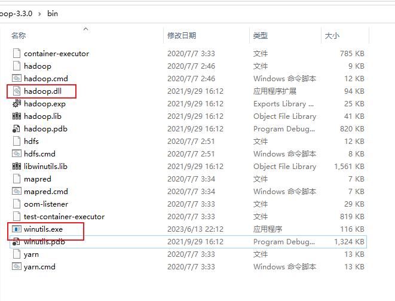
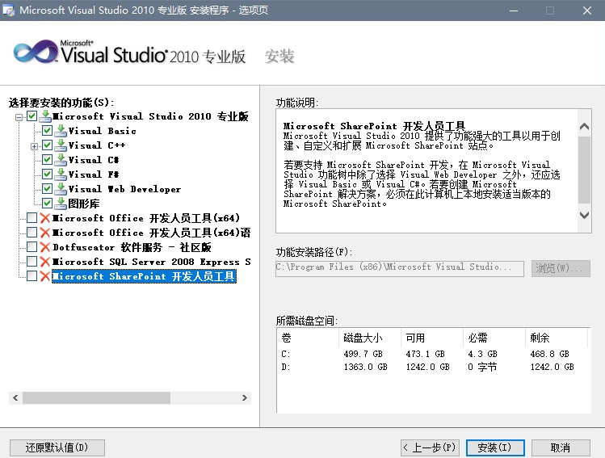

https://www.modb.pro/db/133161

https://www.cnblogs.com/jhxxb/p/10765815.html

# **为什么要编译 Hadoop 源码？**

**Hadoop 主要是基于 Java 语言所编写的，但有也部分需求和功能并不适合 Java 代码开发，所以这部分内容就基于 C++代码去开发，于是就引出了 Native Libraries 概念，我们知道 Java 语言去调用 C++代码是基于 JNI 的方式去调用的，Java 去调用本地的 C++代码打包好的本地库(NativeLibraries)文件去运行。但由于 Linux 系统的本地库文件为.so 格式，而 Windows 的本地库文件格式为 dll**，所以为了适应不同操作系统的架构，我们需要进行重新编译下 Hadoop 的源代码。

下面是编译结果。



最重要的是`hadoop.dll`和`winutils.exe`两个文件,没有这两个文件 hadoop 运行会报错

缺少`winutils.exe`

```
java.io.FileNotFoundException: Could not locate Hadoop executable: F:\Program Files\hadoop-3.3.0\bin\winutils.exe -see https://wiki.apache.org/hadoop/WindowsProblems
```

缺少`hadoop.dll`

```
WARN [org.apache.hadoop.util.NativeCodeLoader] - Unable to load native-hadoop library for your platform... using builtin-java classes where applicable
2023-06-13 22:46:08,580 WARN [org.apache.hadoop.metrics2.impl.MetricsConfig] - Cannot locate configuration: tried hadoop-metrics2-jobtracker.properties,hadoop-metrics2.properties
```

```
Exception in thread "main" java.lang.UnsatisfiedLinkError: org.apache.hadoop.io.nativeio.NativeIO$Windows.access0(Ljava/lang/String;I)Z
```

## **接下来，我们来编译 Hadoop 源码**

> 下载源码

源码下载地址（Source download）：[https://hadoop.apache.org/releases.html](https://hadoop.apache.org/releases.html)

不同版本下载 [https://archive.apache.org/dist/hadoop/core/](https://archive.apache.org/dist/hadoop/core/)

这里以 3.3.0 为例，查看源码中的编译说明文件 **BUILDING.txt**，截取 windows 部分

```
----------------------------------------------------------------------------------

Building on Windows

----------------------------------------------------------------------------------
Requirements:

* Windows System
* JDK 1.8
* Maven 3.0 or later
* Protocol Buffers 3.7.1
* CMake 3.1 or newer
* Visual Studio 2010 Professional or Higher
* Windows SDK 8.1 (if building CPU rate control for the container executor)
* zlib headers (if building native code bindings for zlib)
* Internet connection for first build (to fetch all Maven and Hadoop dependencies)
* Unix command-line tools from GnuWin32: sh, mkdir, rm, cp, tar, gzip. These
  tools must be present on your PATH.
* Python ( for generation of docs using 'mvn site')

Unix command-line tools are also included with the Windows Git package which
can be downloaded from http://git-scm.com/downloads

If using Visual Studio, it must be Professional level or higher.
Do not use Visual Studio Express.  It does not support compiling for 64-bit,
which is problematic if running a 64-bit system.

The Windows SDK 8.1 is available to download at:

http://msdn.microsoft.com/en-us/windows/bg162891.aspx

Cygwin is not required.
```

# 环境准备

## **1.JDK**

[https://www.oracle.com/technetwork/java/javase/downloads/jdk8-downloads-2133151.html](https://www.oracle.com/technetwork/java/javase/downloads/jdk8-downloads-2133151.html)

```
# 设置系统环境变量
setx /M JAVA_HOME "D:\hadoop\jdk1.8.0_192"
setx /M Path "%Path%;%JAVA_HOME%\bin;%JAVA_HOME%\jre\bin"
```

验证

```
cmd验证：
	java -version
结果：
    java version "1.8.0_261"
    Java(TM) SE Runtime Environment (build 1.8.0_261-b12)
    Java HotSpot(TM) 64-Bit Server VM (build 25.261-b12, mixed mode)
```

## **2.Maven**

[http://maven.apache.org/download.cgi](http://maven.apache.org/download.cgi)

[https://archive.apache.org/dist/maven/maven-3/](https://archive.apache.org/dist/maven/maven-3/)

```
# 设置系统环境变量
setx /M M2_HOME "D:\hadoop\apache-maven-3.6.1"
setx /M Path "%Path%;%M2_HOME%\bin"

```

conf\settings.xml 仓库配置

```
<!-- 本地仓库路径 -->
<localRepository>D:\hadoop\repo</localRepository>

<!-- 网络仓库地址 -->
<mirrors>
    <mirror>
        <id>central</id>
        <mirrorOf>central</mirrorOf>
        <name>aliyunmaven</name>
        <url>https://maven.aliyun.com/repository/central</url>
    </mirror>
    <mirror>
        <id>apache.snapshots.https</id>
        <mirrorOf>apache.snapshots.https</mirrorOf>
        <name>aliyunmaven</name>
        <url>https://maven.aliyun.com/repository/apache-snapshots</url>
    </mirror>
</mirrors>

```

```shell
cmd验证：
	mvn -version
```

## **3.ProtocolBuffer**

[https://github.com/protocolbuffers/protobuf/releases/tag/v3.23.1](https://github.com/protocolbuffers/protobuf/releases/tag/v3.23.1)

注：除了下载 protobuf 源码外，还需要下载相应版本的编译过的用于 Windows  平台的 protoc 命令（protoc-2.5.0-win32.zip）, 该命令用于将 .proto 文件转化为 Java 或 C++ 源文件。

将两个压缩包解压，然后将 protoc.exe 复制到 protobuf-2.5.0\src 目录下

```
# 安装 ProtocolBuffer
cd D:\hadoop\protobuf-2.5.0\java
mvn test
mvn install

# 设置系统环境变量
setx /M Path "%Path%;D:\hadoop\protobuf-2.5.0\src"

cmd验证：
	protoc --version
```

遇见问题

https://github.com/protocolbuffers/protobuf/issues/7313

## **4.CMake**

[https://cmake.org/download/](https://cmake.org/download/)

```
# 设置系统环境变量
setx /M Path "%Path%;D:\hadoop\cmake-3.14.3-win64-x64\bin"

cmd验证：
	cmake --version
结果：
cmake version 3.19.4
```

## **5.Visual Studio 2010 Professional**

```
文件名     cn_visual_studio_2010_professional_x86_dvd_532145.iso
SHA1　　　 33D323446131AB9565082D65C9C380BBD7FF228F
文件大小   2.41GB
发布时间   2010-05-26

ed2k://|file|cn_visual_studio_2010_professional_x86_dvd_532145.iso|2591844352|6001253431AFE573E4344F5A0B1D9CAC|/

```



## 6. 安装 GetGnuWin32 并配置环境变量

## **7.Zlib**

[http://www.zlib.net/](http://www.zlib.net/)

使用 MSVC 方式编译，打开开始菜单，在  Microsoft Visual Studio 2010 下找到  **Visual Studio x64 Win64 命令提示 (2010)**，用管理员身份运行

```
cd D:\hadoop\zlib-1.2.11
nmake -f win32/Makefile.msc

# 编译完成后在该目录下可看到 zlib1.dll 文件

```

设置系统环境变量

```
setx /M ZLIB_HOME "D:\hadoop\zlib-1.2.11"

```

## **8.Git（需要 bash 命令）**

[https://git-scm.com/download/](https://git-scm.com/download/)

```
# 设置系统环境变量
setx /M Path "%Path%;D:\hadoop\PortableGit\bin"
```

# 编译

**1. 设置 Platform**

```
setx /M Platform "x64"
```

**2. 解压源码，开始编译**

打开开始菜单，在  Microsoft Visual Studio 2010 下找到  **Visual Studio x64 Win64 命令提示 (2010)**，用管理员身份运行

```
C:\ProgramData\Microsoft\Windows\Start Menu\Programs\Visual Studio 2022\Visual Studio Tools\VC
```

```
cd D:\hadoop\hadoop-3.3.0-src
mvn package -Pdist,native-win -DskipTests -Dtar

# 编译完成后，编译好的文件在目录 hadoop-3.3.0-src\hadoop-dist\target\ 中

```

编译失败时多编译几次，或自己更换下 Maven 源再试，一些依赖的下载不是很稳定。附上编译成功的日志

```
[INFO] Reactor Summary for Apache Hadoop Main 3.3.0:
[INFO]
[INFO] Apache Hadoop Main ................................. SUCCESS [ 39.854 s]
[INFO] Apache Hadoop Build Tools .......................... SUCCESS [ 35.664 s]
[INFO] Apache Hadoop Project POM .......................... SUCCESS [ 13.814 s]
[INFO] Apache Hadoop Annotations .......................... SUCCESS [ 13.440 s]
[INFO] Apache Hadoop Assemblies ........................... SUCCESS [  0.205 s]
[INFO] Apache Hadoop Project Dist POM ..................... SUCCESS [ 28.307 s]
[INFO] Apache Hadoop Maven Plugins ........................ SUCCESS [ 26.019 s]
[INFO] Apache Hadoop MiniKDC .............................. SUCCESS [07:47 min]
[INFO] Apache Hadoop Auth ................................. SUCCESS [03:03 min]
[INFO] Apache Hadoop Auth Examples ........................ SUCCESS [  4.259 s]
[INFO] Apache Hadoop Common ............................... SUCCESS [10:30 min]
[INFO] Apache Hadoop NFS .................................. SUCCESS [  3.421 s]
[INFO] Apache Hadoop KMS .................................. SUCCESS [01:23 min]
[INFO] Apache Hadoop Common Project ....................... SUCCESS [  0.064 s]
[INFO] Apache Hadoop HDFS Client .......................... SUCCESS [01:11 min]
[INFO] Apache Hadoop HDFS ................................. SUCCESS [01:45 min]
[INFO] Apache Hadoop HDFS Native Client ................... SUCCESS [  3.279 s]
[INFO] Apache Hadoop HttpFS ............................... SUCCESS [ 29.455 s]
[INFO] Apache Hadoop HDFS BookKeeper Journal .............. SUCCESS [ 23.094 s]
[INFO] Apache Hadoop HDFS-NFS ............................. SUCCESS [  2.839 s]
[INFO] Apache Hadoop HDFS-RBF ............................. SUCCESS [ 12.846 s]
[INFO] Apache Hadoop HDFS Project ......................... SUCCESS [  0.044 s]
[INFO] Apache Hadoop YARN ................................. SUCCESS [  0.044 s]
[INFO] Apache Hadoop YARN API ............................. SUCCESS [  8.375 s]
[INFO] Apache Hadoop YARN Common .......................... SUCCESS [04:12 min]
[INFO] Apache Hadoop YARN Registry ........................ SUCCESS [  3.536 s]
[INFO] Apache Hadoop YARN Server .......................... SUCCESS [  0.050 s]
[INFO] Apache Hadoop YARN Server Common ................... SUCCESS [ 32.678 s]
[INFO] Apache Hadoop YARN NodeManager ..................... SUCCESS [ 10.878 s]
[INFO] Apache Hadoop YARN Web Proxy ....................... SUCCESS [  2.167 s]
[INFO] Apache Hadoop YARN ApplicationHistoryService ....... SUCCESS [01:36 min]
[INFO] Apache Hadoop YARN Timeline Service ................ SUCCESS [ 14.856 s]
[INFO] Apache Hadoop YARN ResourceManager ................. SUCCESS [ 21.482 s]
[INFO] Apache Hadoop YARN Server Tests .................... SUCCESS [  0.589 s]
[INFO] Apache Hadoop YARN Client .......................... SUCCESS [  3.674 s]
[INFO] Apache Hadoop YARN SharedCacheManager .............. SUCCESS [  2.209 s]
[INFO] Apache Hadoop YARN Timeline Plugin Storage ......... SUCCESS [  1.911 s]
[INFO] Apache Hadoop YARN Router .......................... SUCCESS [  3.163 s]
[INFO] Apache Hadoop YARN TimelineService HBase Backend ... SUCCESS [02:35 min]
[INFO] Apache Hadoop YARN Timeline Service HBase tests .... SUCCESS [01:36 min]
[INFO] Apache Hadoop YARN Applications .................... SUCCESS [  0.045 s]
[INFO] Apache Hadoop YARN DistributedShell ................ SUCCESS [  1.792 s]
[INFO] Apache Hadoop YARN Unmanaged Am Launcher ........... SUCCESS [  1.213 s]
[INFO] Apache Hadoop YARN Site ............................ SUCCESS [  0.042 s]
[INFO] Apache Hadoop YARN UI .............................. SUCCESS [  0.045 s]
[INFO] Apache Hadoop YARN Project ......................... SUCCESS [  5.462 s]
[INFO] Apache Hadoop MapReduce Client ..................... SUCCESS [  0.134 s]
[INFO] Apache Hadoop MapReduce Core ....................... SUCCESS [ 23.516 s]
[INFO] Apache Hadoop MapReduce Common ..................... SUCCESS [ 13.747 s]
[INFO] Apache Hadoop MapReduce Shuffle .................... SUCCESS [  2.323 s]
[INFO] Apache Hadoop MapReduce App ........................ SUCCESS [  6.160 s]
[INFO] Apache Hadoop MapReduce HistoryServer .............. SUCCESS [  4.593 s]
[INFO] Apache Hadoop MapReduce JobClient .................. SUCCESS [  2.615 s]
[INFO] Apache Hadoop MapReduce HistoryServer Plugins ...... SUCCESS [  1.280 s]
[INFO] Apache Hadoop MapReduce Examples ................... SUCCESS [  4.254 s]
[INFO] Apache Hadoop MapReduce ............................ SUCCESS [  2.127 s]
[INFO] Apache Hadoop MapReduce Streaming .................. SUCCESS [ 13.367 s]
[INFO] Apache Hadoop Distributed Copy ..................... SUCCESS [  5.503 s]
[INFO] Apache Hadoop Archives ............................. SUCCESS [  1.260 s]
[INFO] Apache Hadoop Archive Logs ......................... SUCCESS [  1.315 s]
[INFO] Apache Hadoop Rumen ................................ SUCCESS [  3.355 s]
[INFO] Apache Hadoop Gridmix .............................. SUCCESS [  2.324 s]
[INFO] Apache Hadoop Data Join ............................ SUCCESS [  1.477 s]
[INFO] Apache Hadoop Ant Tasks ............................ SUCCESS [  1.219 s]
[INFO] Apache Hadoop Extras ............................... SUCCESS [  1.615 s]
[INFO] Apache Hadoop Pipes ................................ SUCCESS [  0.040 s]
[INFO] Apache Hadoop OpenStack support .................... SUCCESS [  2.513 s]
[INFO] Apache Hadoop Amazon Web Services support .......... SUCCESS [06:23 min]
[INFO] Apache Hadoop Azure support ........................ SUCCESS [ 46.260 s]
[INFO] Apache Hadoop Aliyun OSS support ................... SUCCESS [01:14 min]
[INFO] Apache Hadoop Client ............................... SUCCESS [  5.923 s]
[INFO] Apache Hadoop Mini-Cluster ......................... SUCCESS [  0.596 s]
[INFO] Apache Hadoop Scheduler Load Simulator ............. SUCCESS [  4.338 s]
[INFO] Apache Hadoop Resource Estimator Service ........... SUCCESS [01:43 min]
[INFO] Apache Hadoop Azure Data Lake support .............. SUCCESS [ 30.751 s]
[INFO] Apache Hadoop Tools Dist ........................... SUCCESS [ 13.557 s]
[INFO] Apache Hadoop Tools ................................ SUCCESS [  0.047 s]
[INFO] Apache Hadoop Distribution ......................... SUCCESS [ 47.214 s]
[INFO] Apache Hadoop Cloud Storage ........................ SUCCESS [  0.554 s]
[INFO] Apache Hadoop Cloud Storage Project ................ SUCCESS [  0.049 s]
[INFO] ------------------------------------------------------------------------
[INFO] BUILD SUCCESS
[INFO] ------------------------------------------------------------------------
[INFO] Total time:  55:18 min
[INFO] Finished at: 2019-04-25T22:47:26+08:00
[INFO] ------------------------------------------------------------------------

```


**[Windows 10 编译 Hadoop 2.6.0 源码 - 作业部落 Cmd Markdown 编辑阅读器](https://www.zybuluo.com/ncepuwanghui/note/343755) （[快照](http://cache.baiducontent.com/c?m=9f65cb4a8c8507ed19fa950d100b92235c438014749c80522193ce5f93130a1c187bbfea706057418099293d46f45400b7b6616f360521b29ccf9c0f80fbc4276ad37b622d59c75612a21aaddc4755d650934d9ead0e91bae745e3b9d3a3850705970e476d80818b4d0164dd6f87033093a28e49654810cdfa3115fd4e7659885546a137fff7436e10f686ca5c3dd42aa67611e6b843b52966b004d21f0c5443b74dc11f212627903b308e442a7394fc5d967b261634b639ecea81effc49fc8ab774c4edcbde38e563f1b2e8ee013367218c32bfdbaac43b733404cebada01b531abfb9cad3ded03a315&p=936fc00686cc43ea0be2963811&newp=b433dc16d9c116e806bd9b7c5753d8304a02c70e3cc3864e1290c408d23f061d4862e7bc2c261607d1c47c6407ae4b5fe9fa307123454df6cc8a871d81edc56f71&user=baidu&fm=sc&query=Windows+10%B1%E0%D2%EBHadoop+2%2E6%2E0%D4%B4%C2%EB+%2D+%D7%F7%D2%B5%B2%BF%C2%E4+Cmd+Markdown+%B1%E0%BC%AD%D4%C4%B6%C1%C6%F7&qid=aca2d79200009e6f&p1=4)）**

**[https://www.cnblogs.com/guoxiaoqian/p/4328812.html](https://www.cnblogs.com/guoxiaoqian/p/4328812.html)**
